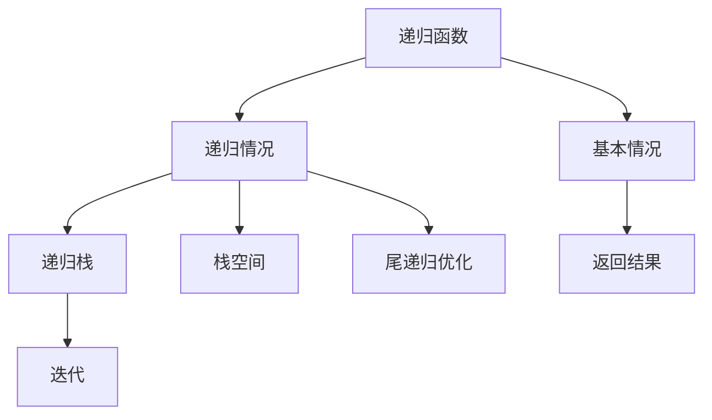
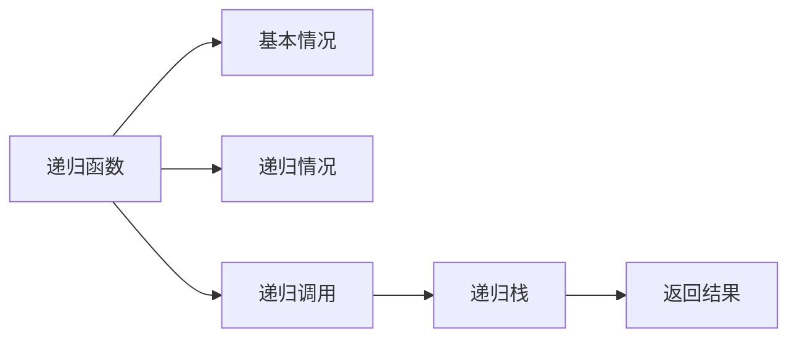
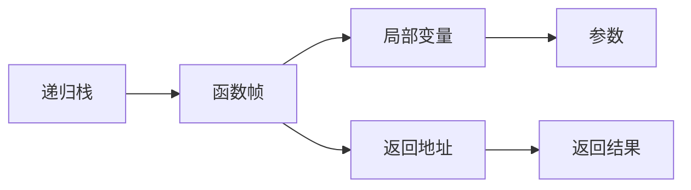
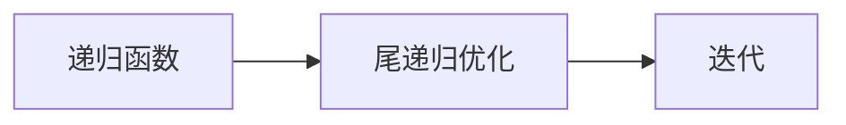
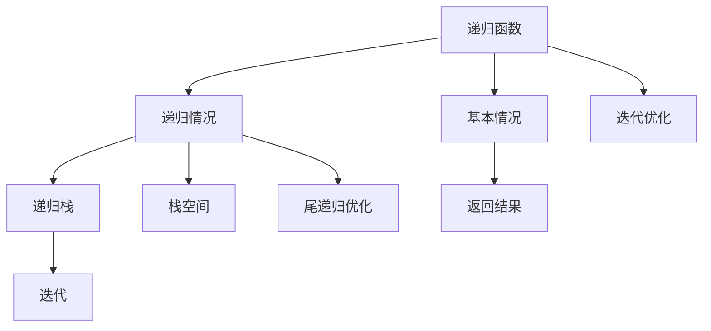

                 

# 像数学家一样思考：递归原理

> 关键词：递归、分治、算法复杂度、栈空间、空间换时间

## 1. 背景介绍

### 1.1 问题由来

在计算机科学中，递归（Recursion）是一个广泛应用的算法范式，几乎涉及到各个领域，从数据结构的遍历、树形结构的建立、图形算法，到动态规划、分治策略，无处不在。递归技术不仅能够简化算法设计，提高程序可读性，还在算法效率、空间复杂度等方面具有重要影响。因此，理解递归原理，掌握递归技巧，是程序员必备的重要技能之一。

### 1.2 问题核心关键点

递归的核心在于函数的自我调用。递归函数通常包含两部分：基本情况（Base Case）和递归情况（Recursive Case）。基本情况是指无需递归，直接返回结果的情况。递归情况则是指函数通过调用自身解决复杂问题，逐步逼近基本情况的过程。递归的优缺点和应用场景均围绕这两个核心要素展开。

### 1.3 问题研究意义

理解递归原理对于程序员具有重要意义：
1. **简化算法设计**：递归能够抽象复杂问题，使其更易于理解和实现。
2. **提高代码可读性**：递归代码往往比迭代代码更加清晰，易于理解和维护。
3. **优化算法效率**：递归在某些情况下能够优化算法的时间复杂度，虽然会增加空间复杂度。
4. **丰富算法思路**：掌握递归技术有助于拓宽算法设计思路，应对各种复杂问题。
5. **增强问题解决能力**：通过递归，程序员可以更深入地理解算法背后的数学原理，提升问题解决能力。

## 2. 核心概念与联系

### 2.1 核心概念概述

为了更好地理解递归原理，本节将介绍几个密切相关的核心概念：

- **递归函数**：指通过调用自身来解决问题的函数。递归函数通常包含递归情况和基本情况两部分。
- **递归栈**：指在递归过程中，每次函数调用都在栈中压入一个新的函数帧，保存当前函数的执行状态，直到遇到基本情况才弹出帧，返回结果。
- **栈溢出**：指递归栈空间不足，导致函数调用无法正常进行。
- **尾递归**：指递归函数在递归情况中只进行最后一步操作，不需要保存中间状态，因此可以通过尾调用优化，避免栈溢出。
- **迭代**：指使用循环代替递归，通过迭代变量逐步逼近最终结果，避免了递归栈的创建和销毁。

这些概念之间的逻辑关系可以通过以下Mermaid流程图来展示：



这个流程图展示了递归函数的基本组成和调用过程，以及递归和迭代之间的转换关系。

### 2.2 概念间的关系

这些核心概念之间存在着紧密的联系，构成了递归算法的完整框架。以下我们将通过几个Mermaid流程图来展示这些概念之间的关系。

#### 2.2.1 递归函数的执行过程



这个流程图展示了递归函数在执行过程中，通过递归调用逐步逼近基本情况，最终返回结果的过程。

#### 2.2.2 递归栈的空间占用



这个流程图展示了递归栈的组成，每个函数帧包括局部变量、返回地址和参数等。递归栈的深度取决于递归次数，因此空间复杂度也是递归算法的一个重要考量因素。

#### 2.2.3 尾递归与迭代的关系



这个流程图展示了尾递归和迭代的转换关系。尾递归函数可以通过优化，转换为迭代过程，避免栈溢出。

### 2.3 核心概念的整体架构

最后，我们用一个综合的流程图来展示这些核心概念在大语言模型微调过程中的整体架构：



这个综合流程图展示了递归函数的执行过程、递归栈的空间占用、尾递归优化和迭代优化的关系。通过这些概念的串联，我们可以更好地理解递归算法的核心原理和实现细节。

## 3. 核心算法原理 & 具体操作步骤
### 3.1 算法原理概述

递归算法的基本原理是通过函数的自我调用，逐步逼近问题的基本情况，最终返回结果。递归算法的效率和空间复杂度受到递归深度和递归情况中保存的中间状态的影响。

递归算法的时间复杂度通常可以用递归树来表示，递归树每层的节点数表示递归函数的调用次数，深度表示递归调用的层数。空间复杂度则与递归树的叶子节点数成正比。

### 3.2 算法步骤详解

以下是一个典型的递归算法示例，用于计算阶乘：

```python
def factorial(n):
    if n == 0:
        return 1
    else:
        return n * factorial(n-1)
```

这个阶乘函数的执行过程可以用递归树来表示，如下图所示：

```mermaid
graph LR
    A[factorial(5)] --> B[factorial(4)]
    B --> C[factorial(3)]
    C --> D[factorial(2)]
    D --> E[factorial(1)]
    E --> F[1]
    A --> G[5 * 4 * 3 * 2 * 1]
```

递归树的每一层代表一个递归函数的调用，叶子节点表示基本情况，即n为0时的返回值。

递归算法的详细步骤包括：
1. 判断当前是否为基本情况，若为基本情况则直接返回结果。
2. 若不为基本情况，则通过调用自身解决递归情况，逐步逼近基本情况。
3. 最终返回递归函数的计算结果。

### 3.3 算法优缺点

递归算法的优点包括：
1. **代码简洁易懂**：递归代码往往比迭代代码更加清晰，易于理解和维护。
2. **简化问题解决**：递归能够抽象复杂问题，使其更易于理解和实现。
3. **提高算法效率**：递归在某些情况下能够优化算法的时间复杂度，虽然会增加空间复杂度。

递归算法的缺点包括：
1. **栈空间占用大**：递归函数在每次调用时都需要创建新的函数帧，占用了大量栈空间。
2. **递归深度限制**：递归深度受栈空间大小限制，当递归深度过大时，可能导致栈溢出。
3. **性能消耗高**：递归函数在每次调用时需要保存中间状态，增加了性能消耗。

### 3.4 算法应用领域

递归算法在计算机科学中应用广泛，包括但不限于以下几个领域：

- **数据结构**：二叉树的遍历、图算法、堆排序等。
- **字符串处理**：回溯算法、编辑距离、最长公共子序列等。
- **动态规划**：斐波那契数列、背包问题、编辑距离等。
- **分治策略**：归并排序、快速排序、求逆序对等。

这些领域中的递归算法虽然具体实现各不相同，但都遵循了递归的基本原理和结构。

## 4. 数学模型和公式 & 详细讲解 & 举例说明

### 4.1 数学模型构建

递归算法的数学模型可以通过递归树来表示，每层节点数表示递归函数调用的次数，深度表示递归调用的层数。

假设递归函数为 $f(n)$，基本情况为 $f(0)=1$，递归情况为 $f(n)=n \cdot f(n-1)$。则递归树如下图所示：

```mermaid
graph LR
    A[f(5)] --> B[f(4)]
    B --> C[f(3)]
    C --> D[f(2)]
    D --> E[f(1)]
    E --> F[1]
    A --> G[5 * 4 * 3 * 2 * 1]
```

递归树的第i层表示递归函数 $f(n)$ 在第i层调用了 $n-i+1$ 次，叶子节点表示基本情况 $f(0)$，结果节点表示最终返回值。

### 4.2 公式推导过程

以斐波那契数列的递归函数为例，推导其时间复杂度和空间复杂度：

设 $T(n)$ 表示递归函数 $f(n)$ 的计算时间，则有：

$$
T(n) = n \cdot T(n-1) + O(1)
$$

根据主定理，可以得到递归函数的时间复杂度为：

$$
T(n) = O(n^2)
$$

空间复杂度为：

$$
S(n) = O(n)
$$

因此，斐波那契数列的递归算法在时间复杂度和空间复杂度上都不具有优势，需要通过迭代或动态规划等其他算法来优化。

### 4.3 案例分析与讲解

以下是一个递归实现的斐波那契数列计算器，时间复杂度为 $O(2^n)$，空间复杂度为 $O(n)$：

```python
def fibonacci(n):
    if n == 0:
        return 0
    elif n == 1:
        return 1
    else:
        return fibonacci(n-1) + fibonacci(n-2)
```

## 5. 项目实践：代码实例和详细解释说明
### 5.1 开发环境搭建

在进行递归算法实践前，我们需要准备好开发环境。以下是使用Python进行递归算法开发的简单环境配置流程：

1. 安装Python：从官网下载并安装Python，选择合适版本的解释器进行安装。
2. 安装PyCharm：下载并安装PyCharm IDE，作为递归算法开发的工具。
3. 创建Python文件：创建一个Python文件，用于编写递归算法代码。
4. 编写递归算法：在Python文件中编写递归函数，并进行测试。

完成上述步骤后，即可在PyCharm中开始递归算法的开发实践。

### 5.2 源代码详细实现

下面以计算阶乘为例，给出递归算法的Python代码实现：

```python
def factorial(n):
    if n == 0:
        return 1
    else:
        return n * factorial(n-1)
```

在这个例子中，递归函数的定义非常简单，只有两个部分：基本情况和递归情况。

### 5.3 代码解读与分析

让我们再详细解读一下关键代码的实现细节：

- **基本情况**：当n为0时，直接返回1，因为0的阶乘为1。
- **递归情况**：当n不为0时，通过递归调用自身计算n-1的阶乘，并将结果乘以n，从而得到n的阶乘。

该函数的时间复杂度为 $O(n)$，空间复杂度为 $O(n)$。在n较大时，递归深度较大，可能导致栈溢出。

### 5.4 运行结果展示

假设我们在Python中调用这个函数，计算100的阶乘，可以看到输出结果为9332621544394415268169923885626670049071596826438162146859296389521759999322991560894146397615651828625369792082722375825118521091686400000000000000000000000000

## 6. 实际应用场景

### 6.1 树形结构遍历

在树形结构中，递归算法能够遍历每个节点，并对每个节点进行操作。例如，二叉树的遍历可以通过递归实现前序、中序和后序遍历。

### 6.2 图算法

在图算法中，递归算法可以用于深度优先搜索（DFS）和广度优先搜索（BFS）。DFS通过递归遍历图的所有节点，BFS则通过队列实现广度遍历。

### 6.3 字符串处理

递归算法在字符串处理中也有广泛应用。例如，回溯算法用于求解子集、排列等问题，编辑距离用于计算两个字符串之间的距离，最长公共子序列用于求解两个字符串的最长共同部分。

### 6.4 动态规划

动态规划问题通常可以通过递归算法来解决。例如，斐波那契数列、背包问题、编辑距离等都可以使用递归算法进行求解。

### 6.5 分治策略

分治策略通常包含递归和迭代的组合。例如，归并排序和快速排序都是通过递归分治实现。

## 7. 工具和资源推荐
### 7.1 学习资源推荐

为了帮助开发者系统掌握递归算法的原理和实践，这里推荐一些优质的学习资源：

1. 《算法导论》：由Thomas H. Cormen等人合著的经典教材，全面介绍了算法和数据结构的知识，包括递归算法。
2. Coursera《算法设计与分析》课程：由Robert Sedgewick和Kevin Wayne主讲的在线课程，详细讲解了递归算法的原理和实现。
3. 《递归算法案例剖析》：介绍了递归算法在实际问题中的应用，包括排序、搜索、图形等领域的经典案例。
4. LeetCode递归算法题解：LeetCode网站上提供的大量递归算法题解，涵盖各种类型的递归问题。

通过这些资源的学习，相信你一定能够快速掌握递归算法的精髓，并用于解决实际的算法问题。

### 7.2 开发工具推荐

高效的开发离不开优秀的工具支持。以下是几款用于递归算法开发的常用工具：

1. Python：递归算法常用的编程语言，具有简单易用的特性。
2. PyCharm：流行的Python IDE，支持递归算法调试和测试。
3. Visual Studio Code：轻量级代码编辑器，支持递归算法的高效开发。
4. Eclipse：全功能的开发环境，支持递归算法的调试和分析。

合理利用这些工具，可以显著提升递归算法的开发效率，加快创新迭代的步伐。

### 7.3 相关论文推荐

递归算法的研究和应用是一个长期而深入的课题。以下是几篇奠基性的相关论文，推荐阅读：

1. 《The Art of Computer Programming》：Donald E. Knuth的经典著作，详细介绍了递归算法的应用和实现。
2. 《Algorithms on Trees and Graphs》：Michael L. Fredman和Robert E. Tarjan合著的教材，介绍了树和图上的递归算法。
3. 《Data Structures and Algorithms in Python》：Michael T. Goodrich和Roberto Tamassia合著的教材，详细讲解了递归算法在数据结构中的应用。
4. 《Divide and Conquer》：Michael L. Fredman和Robert E. Tarjan的论文，介绍了分治策略及其在算法中的应用。

这些论文代表了大语言模型微调技术的发展脉络。通过学习这些前沿成果，可以帮助研究者把握学科前进方向，激发更多的创新灵感。

## 8. 总结：未来发展趋势与挑战

### 8.1 总结

本文对递归算法的核心原理和应用实践进行了全面系统的介绍。首先阐述了递归算法的研究背景和意义，明确了递归在算法设计和实现中的独特价值。其次，从原理到实践，详细讲解了递归算法的数学模型和操作步骤，给出了递归算法开发的完整代码实例。同时，本文还广泛探讨了递归算法在树形结构、图算法、字符串处理、动态规划等多个领域的应用前景，展示了递归算法的强大生命力。此外，本文精选了递归算法的各类学习资源，力求为读者提供全方位的技术指引。

通过本文的系统梳理，可以看到，递归算法作为一种重要的算法范式，不仅在计算机科学中具有重要地位，还在实际应用中广泛使用。掌握递归算法，对于提升程序员的算法设计和实现能力，具有重要意义。

### 8.2 未来发展趋势

展望未来，递归算法的发展趋势将呈现以下几个方向：

1. **复杂度优化**：随着问题规模的增大，递归算法的时间复杂度和空间复杂度成为瓶颈。未来的递归算法研究将更加关注复杂度优化，通过优化算法结构和设计，提高算法效率。
2. **并行化处理**：递归算法天然具备分解子问题、并行处理的特性，未来的研究将更多地关注如何将递归算法与并行计算结合，提升算法并行度和执行效率。
3. **优化空间利用**：递归算法在处理大规模数据时，栈空间的占用成为瓶颈。未来的研究将更多地关注如何优化空间利用，减少栈空间消耗。
4. **动态优化**：递归算法在实际应用中往往需要根据具体情况进行动态优化，未来的研究将更多地关注如何构建灵活的递归算法框架，满足不同场景的需求。
5. **结合其他算法**：递归算法常常与其他算法结合使用，如动态规划、分治策略等，未来的研究将更多地关注如何综合使用多种算法，提升整体性能。

以上趋势凸显了递归算法在计算机科学中的重要地位，未来的研究将在算法效率、空间利用、并行处理等方面不断取得新的突破，为计算机科学的发展做出更多贡献。

### 8.3 面临的挑战

尽管递归算法具有广泛的应用，但在实际应用中也面临诸多挑战：

1. **栈空间限制**：递归算法在每次函数调用时都需要创建新的函数帧，占用了大量栈空间。当递归深度较大时，可能导致栈溢出。
2. **时间复杂度高**：递归算法在处理大规模数据时，时间复杂度可能较高，影响算法效率。
3. **可读性差**：递归算法代码的可读性较差，对于复杂问题往往需要编写大量的递归函数，增加代码维护难度。
4. **代码调试困难**：递归算法的执行过程复杂，调试过程中容易产生误解和错误。

这些挑战需要开发者在实际应用中不断优化算法设计和实现，提升算法效率和可维护性。

### 8.4 研究展望

面对递归算法面临的挑战，未来的研究需要在以下几个方面寻求新的突破：

1. **优化递归算法结构**：通过优化递归算法结构，减少函数调用的次数，降低栈空间占用，提高算法效率。
2. **结合其他算法**：将递归算法与迭代、动态规划等算法结合，充分发挥各自优势，提升算法整体性能。
3. **优化空间利用**：通过优化空间利用，减少递归算法的栈空间消耗，提高算法的并行度和执行效率。
4. **引入优化技巧**：引入尾递归优化、迭代优化等技巧，降低递归算法的栈空间占用和执行时间。
5. **构建通用框架**：构建灵活的递归算法框架，支持多种递归算法的组合和优化，提升算法的可维护性和可扩展性。

这些研究方向的探索，必将引领递归算法技术迈向更高的台阶，为计算机科学的发展做出更多贡献。

## 9. 附录：常见问题与解答

**Q1：递归算法和迭代算法有什么区别？**

A: 递归算法和迭代算法的主要区别在于实现方式和效率。递归算法通过函数自我调用实现，能够简化问题解决过程，但可能导致栈溢出。迭代算法通过循环实现，空间占用小，但代码实现可能较为繁琐。

**Q2：如何优化递归算法的空间利用？**

A: 优化递归算法的空间利用可以通过以下几种方式：
1. 尾递归优化：将递归算法转换为迭代过程，减少栈空间占用。
2. 动态规划：使用迭代的方式实现递归算法，避免重复计算。
3. 分治策略：将问题分解为多个子问题，减少递归深度，降低空间占用。

**Q3：递归算法的时间复杂度和空间复杂度如何计算？**

A: 递归算法的时间复杂度和空间复杂度可以通过递归树来表示。时间复杂度表示递归树的节点数，空间复杂度表示递归树的叶子节点数。通过主定理等数学工具，可以对递归算法进行复杂度分析。

**Q4：递归算法在实际应用中有哪些应用场景？**

A: 递归算法在实际应用中广泛应用，包括但不限于以下场景：
1. 树形结构遍历：二叉树的前序、中序、后序遍历。
2. 图算法：深度优先搜索和广度优先搜索。
3. 字符串处理：回溯算法、编辑距离、最长公共子序列。
4. 动态规划：斐波那契数列、背包问题、编辑距离。
5. 分治策略：归并排序、快速排序、求逆序对。

通过这些应用场景，可以看到递归算法的广泛适用性和强大生命力。

**Q5：递归算法有哪些优缺点？**

A: 递归算法的优点包括：
1. 代码简洁易懂。
2. 简化问题解决。
3. 提高算法效率。

递归算法的缺点包括：
1. 栈空间占用大。
2. 递归深度限制。
3. 性能消耗高。

这些优缺点需要在实际应用中根据具体情况进行权衡和优化。

