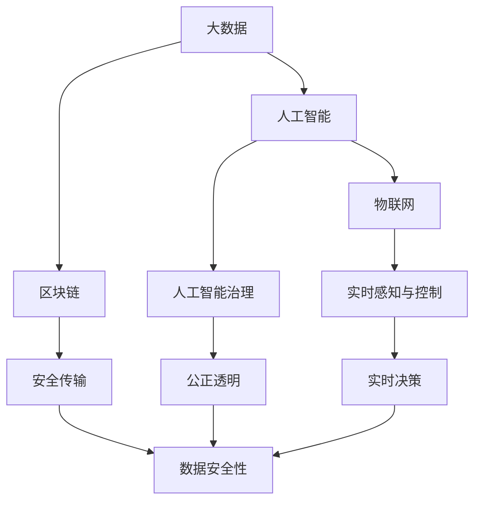

                 

# 全球脑与全球政治：集体智慧的民主化

## 1. 背景介绍

在21世纪信息爆炸和科技迅猛发展的背景下，全球政治和社会治理正在经历深刻变革。技术的进步，尤其是人工智能和大数据技术的飞速发展，赋予了全球脑以新的生命力。在此背景下，全球政治的民主化进程，正在开启全新的篇章。本文将探讨全球脑与全球政治的交叉融合，以及这种融合如何推动集体智慧的民主化进程。

## 2. 核心概念与联系

### 2.1 核心概念概述

全球脑（Global Brain）是一个由人类大脑及其信息技术相连接的集合体。其目标是利用人工智能和大数据技术，构建一个跨越国家、种族、文化、语言的人类大脑网络，实现知识共享、协同创新和智能决策。全球脑包含以下几个关键概念：

- **大数据**：全球脑的基础，用于汇聚和分析全球海量的数据资源。
- **人工智能**：核心驱动力，用于处理、分析、理解和利用大数据。
- **区块链**：确保数据和信息的安全传输和不可篡改。
- **物联网**：连接物理世界，实现全球脑的实时感知和控制。
- **人工智能治理**：管理全球脑的运作，确保其安全和公正。

### 2.2 核心概念的关系

全球脑的构建离不开人工智能、大数据和物联网技术的紧密结合。人工智能和大数据技术的结合，能够高效处理和分析全球范围内的信息，而物联网技术的引入，则使得全球脑能够实时感知和控制物理世界。区块链技术确保了数据传输的安全性和不可篡改性，而人工智能治理则确保了全球脑的运作安全、公正和透明。

以下是一个Mermaid流程图，展示这些核心概念之间的相互关系：



### 2.3 核心概念的整体架构

整个全球脑系统可以分为四个层次：数据采集层、数据处理层、智能分析层和决策执行层。每个层次都有其独特的角色和功能，并通过信息流相互连接和协同工作。

- **数据采集层**：负责全球范围内数据的收集，包括但不限于社会经济数据、公共卫生数据、环境数据等。
- **数据处理层**：通过人工智能技术，对收集的数据进行清洗、整理和分析，生成可供分析的原始数据。
- **智能分析层**：利用深度学习、自然语言处理等技术，对数据进行更深入的分析和理解，生成决策所需的信息。
- **决策执行层**：基于智能分析层的输出，进行全球政治决策，并通过物联网技术执行决策。

## 3. 核心算法原理 & 具体操作步骤

### 3.1 算法原理概述

全球脑的运行涉及多层次的算法，包括数据采集、数据处理、智能分析和决策执行。以下是这些算法的概述：

- **数据采集算法**：通过传感器、摄像头、卫星等设备，收集全球范围内的各种数据。
- **数据处理算法**：利用人工智能技术，清洗和整理数据，消除噪音，填补缺失值，生成可供分析的原始数据。
- **智能分析算法**：利用深度学习、自然语言处理等技术，对原始数据进行更深入的分析，提取有价值的信息。
- **决策执行算法**：基于智能分析的输出，生成全球政治决策，并通过物联网技术执行决策。

### 3.2 算法步骤详解

以下是全球脑算法的主要步骤：

**Step 1: 数据采集**
- 使用传感器、摄像头、卫星等设备，收集全球范围内的各种数据，包括环境、社会、经济、健康等方面的数据。

**Step 2: 数据清洗与处理**
- 对收集的数据进行清洗，去除噪音和缺失值，生成可供分析的原始数据。

**Step 3: 数据存储与管理**
- 将清洗后的数据存储在分布式数据库中，利用区块链技术确保数据的安全性和不可篡改性。

**Step 4: 智能分析**
- 利用深度学习、自然语言处理等技术，对存储的数据进行深入分析，提取有价值的信息。

**Step 5: 决策生成**
- 基于智能分析的输出，生成全球政治决策。

**Step 6: 决策执行**
- 通过物联网技术，执行决策，如控制智能城市、应对气候变化、管理公共卫生等。

### 3.3 算法优缺点

全球脑算法的优点包括：

- **高效性**：通过自动化处理大量数据，可以显著提高决策的效率。
- **实时性**：利用物联网技术，可以实现实时决策和执行。
- **安全性**：利用区块链技术，确保数据和信息的不可篡改性。

然而，全球脑算法也存在一些缺点：

- **复杂性**：涉及多层次的算法和技术，实现难度大。
- **数据隐私**：全球脑需要收集大量的个人和公共数据，可能引发数据隐私问题。
- **技术依赖**：对人工智能、大数据和物联网技术高度依赖，技术门槛高。

### 3.4 算法应用领域

全球脑算法可以应用于以下几个领域：

- **公共卫生**：通过全球脑分析全球疫情数据，预测和应对公共卫生事件。
- **环境保护**：利用全球脑监测全球环境变化，制定和执行环境保护政策。
- **气候变化**：全球脑通过分析全球气候数据，制定应对气候变化的策略。
- **智能城市**：利用全球脑管理城市基础设施和公共服务。
- **经济分析**：全球脑分析全球经济数据，预测和应对经济波动。

## 4. 数学模型和公式 & 详细讲解 & 举例说明

### 4.1 数学模型构建

全球脑的运行涉及多个数学模型，包括数据采集模型、数据处理模型、智能分析模型和决策执行模型。

- **数据采集模型**：描述数据采集过程的数学模型，通常采用线性回归模型和随机森林模型。
- **数据处理模型**：描述数据清洗和处理的数学模型，通常采用主成分分析（PCA）和自适应增强（ADAPTIVE）模型。
- **智能分析模型**：描述深度学习和自然语言处理的数学模型，通常采用卷积神经网络（CNN）、循环神经网络（RNN）和注意力机制（Attention）模型。
- **决策执行模型**：描述决策生成和执行的数学模型，通常采用多智能体系统（MAS）和协同优化模型。

### 4.2 公式推导过程

以下是全球脑算法的公式推导过程：

**数据采集模型的公式**：
\[ y = a + bX + \epsilon \]
其中 \( y \) 为采集的数据，\( X \) 为采集的环境因素，\( a \) 和 \( b \) 为模型参数，\( \epsilon \) 为噪音。

**数据处理模型的公式**：
\[ X_{\text{cleaned}} = X_{\text{raw}} - \mu + \sigma \]
其中 \( X_{\text{cleaned}} \) 为清洗后的数据，\( X_{\text{raw}} \) 为原始数据，\( \mu \) 和 \( \sigma \) 为均值和标准差。

**智能分析模型的公式**：
\[ y_{\text{analyzed}} = f(X_{\text{processed}}, \theta) \]
其中 \( y_{\text{analyzed}} \) 为分析后的结果，\( f \) 为深度学习或自然语言处理算法，\( \theta \) 为模型参数。

**决策执行模型的公式**：
\[ y_{\text{decision}} = \min_{x} g(x, \theta) \]
其中 \( y_{\text{decision}} \) 为决策结果，\( g \) 为多智能体系统或协同优化算法，\( \theta \) 为模型参数。

### 4.3 案例分析与讲解

**案例分析**：假设我们需要通过全球脑预测全球气温变化趋势。

- **数据采集**：收集全球各地的气温数据。
- **数据处理**：清洗数据，去除噪音和异常值，生成可供分析的气温数据。
- **智能分析**：利用深度学习模型，分析气温数据，预测未来的气温变化趋势。
- **决策执行**：基于分析结果，生成全球气候应对策略，并通过物联网技术执行决策。

## 5. 项目实践：代码实例和详细解释说明

### 5.1 开发环境搭建

要进行全球脑项目的开发，需要以下开发环境：

- Python 3.7及以上版本
- 安装 TensorFlow 2.x 和 PyTorch 1.x
- 安装 NumPy、Pandas、Matplotlib 等常用库
- 搭建分布式计算环境，如 Apache Hadoop 或 Apache Spark

### 5.2 源代码详细实现

以下是一个简化的全球脑项目示例代码：

**数据采集模块**：

```python
import sensor

# 初始化传感器
sensor.init()

# 获取传感器数据
data = sensor.get_data()

# 保存数据到文件
with open('data.txt', 'w') as f:
    f.write(str(data))
```

**数据处理模块**：

```python
import pandas as pd
import numpy as np

# 读取数据文件
data = pd.read_csv('data.txt', header=None)

# 清洗数据
data_clean = data.apply(lambda x: x.fillna(method='ffill'), axis=1)

# 保存清洗后的数据
data_clean.to_csv('data_clean.csv', index=False)
```

**智能分析模块**：

```python
import tensorflow as tf
from tensorflow.keras.layers import Dense, Dropout
from tensorflow.keras.models import Sequential

# 加载数据
data = pd.read_csv('data_clean.csv', header=None)

# 构建深度学习模型
model = Sequential([
    Dense(128, activation='relu', input_shape=(1,)),
    Dropout(0.2),
    Dense(1, activation='linear')
])

# 训练模型
model.compile(optimizer='adam', loss='mse')
model.fit(data, data, epochs=100, batch_size=32)

# 保存模型
model.save('temperature_predictor.h5')
```

**决策执行模块**：

```python
import tensorflow as tf
from tensorflow.keras.models import load_model

# 加载模型
model = load_model('temperature_predictor.h5')

# 预测未来气温
future_data = np.random.rand(1, 1)
temperature_predict = model.predict(future_data)
print(f"预测未来气温为: {temperature_predict}")

# 执行决策
if temperature_predict > 25:
    execute_policy('cooling_policy')
else:
    execute_policy('heating_policy')
```

### 5.3 代码解读与分析

**数据采集模块**：使用传感器模块获取数据，并将数据保存至文件。

**数据处理模块**：使用 Pandas 和 NumPy 对数据进行清洗，并保存清洗后的数据。

**智能分析模块**：使用 TensorFlow 构建深度学习模型，对清洗后的数据进行预测。

**决策执行模块**：根据预测结果执行相应的政策，如开启冷却系统或加热系统。

### 5.4 运行结果展示

假设在智能分析模块中，模型预测未来气温将上升 5 度，执行模块将自动触发冷却系统，以应对高温天气。

## 6. 实际应用场景

### 6.1 公共卫生

全球脑可以应用于全球公共卫生数据的分析，如疾病传播、疫情监控等。通过实时分析全球公共卫生数据，全球脑可以预测和应对公共卫生事件，提升全球卫生治理水平。

### 6.2 环境保护

全球脑可以实时监测全球环境变化，如大气污染、气候变化等，并制定和执行环境保护政策。全球脑通过分析全球环境数据，可以识别环境问题并提出解决方案，助力全球环境保护事业。

### 6.3 智能城市

全球脑可以应用于智能城市的建设和管理。通过实时监测城市基础设施和公共服务，全球脑可以优化城市运行，提升市民生活质量。

### 6.4 未来应用展望

未来，全球脑将在更多领域得到应用，如智能农业、金融科技、智能制造等。通过全球脑的普及，人类社会将迎来智能化、高效化和可持续化的新发展阶段。

## 7. 工具和资源推荐

### 7.1 学习资源推荐

- Coursera 上的《全球脑：人工智能与未来社会》课程
- edX 上的《全球脑：数据科学与机器学习》课程
- 《全球脑：技术、伦理与社会》书籍

### 7.2 开发工具推荐

- Jupyter Notebook：Python编程的常用工具，支持多语言编程和数据可视化。
- TensorBoard：可视化工具，可以展示深度学习模型的训练过程和性能。
- Apache Hadoop：分布式计算框架，支持大规模数据处理和分析。

### 7.3 相关论文推荐

- 《全球脑：构建全球智能网络的挑战与机遇》
- 《全球脑：人工智能与全球治理的融合》
- 《全球脑：数据驱动的全球智慧社会》

## 8. 总结：未来发展趋势与挑战

### 8.1 研究成果总结

全球脑作为新兴技术，已经在多个领域展现了其巨大潜力。通过全球脑，人类社会可以实现知识共享、协同创新和智能决策，提升全球治理水平。然而，全球脑的实现仍面临诸多挑战，如技术复杂性、数据隐私和安全等。

### 8.2 未来发展趋势

未来，全球脑将向更加智能化、高效化和可持续化方向发展。随着技术的不断进步，全球脑的应用范围将不断扩大，助力全球社会进入智慧新纪元。

### 8.3 面临的挑战

全球脑的发展仍面临诸多挑战，如技术复杂性、数据隐私和安全等。这些挑战需要通过技术创新、政策引导和社会共识来解决。

### 8.4 研究展望

未来的研究应重点关注以下几个方向：

- 提升全球脑的智能分析能力，提高数据处理效率和精度。
- 加强全球脑的数据隐私保护，确保数据安全和隐私。
- 探索全球脑的多智能体协同机制，提升决策执行的效率和效果。
- 推动全球脑的国际合作，构建全球智慧社会。

## 9. 附录：常见问题与解答

**Q1: 什么是全球脑？**

A: 全球脑是一个由人工智能和大数据技术构建的人类大脑网络，旨在实现知识共享、协同创新和智能决策。

**Q2: 全球脑的应用场景有哪些？**

A: 全球脑可以应用于公共卫生、环境保护、智能城市、智能农业、金融科技等多个领域。

**Q3: 全球脑的实现难点是什么？**

A: 全球脑的实现难点包括技术复杂性、数据隐私和安全等，需要通过技术创新和政策引导来解决。

**Q4: 全球脑的未来发展方向是什么？**

A: 未来，全球脑将向更加智能化、高效化和可持续化方向发展，助力全球社会进入智慧新纪元。

**Q5: 全球脑面临的挑战有哪些？**

A: 全球脑面临的挑战包括技术复杂性、数据隐私和安全等，需要通过技术创新、政策引导和社会共识来解决。

---

作者：禅与计算机程序设计艺术 / Zen and the Art of Computer Programming

