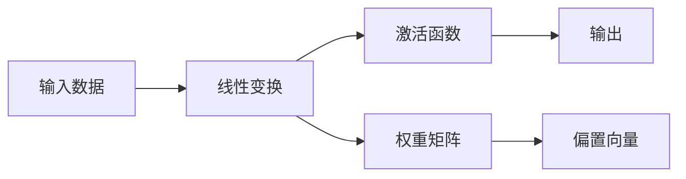
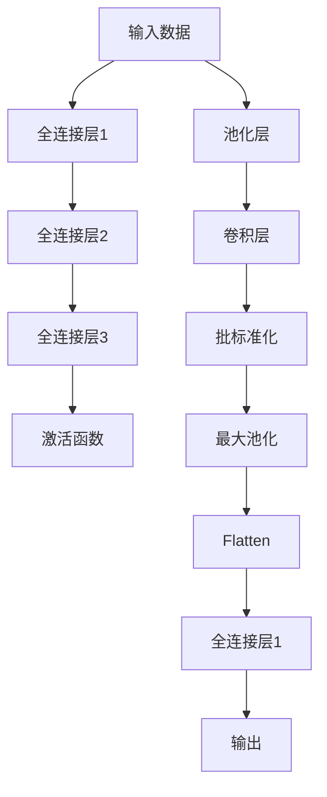

                 

# 全连接层 (Fully Connected Layer) 原理与代码实例讲解

## 1. 背景介绍

### 1.1 问题由来
在深度学习领域，全连接层 (Fully Connected Layer, FC Layer) 是最基础且最常用的一层神经网络结构。它广泛应用在图像分类、语音识别、自然语言处理等众多任务中。全连接层通过将所有输入节点与输出节点之间建立连接，实现非线性变换，从而提取高阶特征。

本文将详细介绍全连接层的原理、实现方法和应用案例，并通过实际代码实例，展示如何使用PyTorch搭建并训练一个全连接神经网络。

### 1.2 问题核心关键点
本节将解释全连接层的基本概念和核心原理，包括输入、输出维度、激活函数、权重参数等，并对比其与卷积层、池化层等基本结构的不同。

### 1.3 问题研究意义
全连接层作为深度学习模型的核心组件，是实现复杂非线性映射的关键。通过对其原理的深入理解，并掌握其实现技巧，开发者能够更高效地构建和优化深度学习模型，提升任务的性能。

## 2. 核心概念与联系

### 2.1 核心概念概述

本节将介绍全连接层的基本概念和相关核心组件。

- **输入和输出维度**：全连接层的输入和输出维度分别对应于输入特征向量和输出特征向量的大小，通常用 $d_{in}$ 和 $d_{out}$ 表示。
- **激活函数**：用于引入非线性变换，常用的激活函数包括ReLU、Sigmoid、Tanh等。
- **权重矩阵**：用于控制输入节点和输出节点之间的连接权重，是一个 $d_{out}\times d_{in}$ 的矩阵，记作 $W$。
- **偏置向量**：用于调整模型的输出偏移，是一个 $d_{out}$ 维的向量，记作 $b$。
- **线性变换**：输入数据通过与权重矩阵和偏置向量进行矩阵乘法和偏置加法后，得到线性变换结果。

### 2.2 概念间的关系

以下是一个简化的全连接层示意图，展示了输入、输出和参数之间的关系：



其中，$A$ 表示输入数据，$B$ 表示线性变换结果，$C$ 表示激活函数后的输出，$D$ 和 $E$ 分别是权重矩阵和偏置向量。

### 2.3 核心概念的整体架构

全连接层作为神经网络的基本结构，在网络中扮演着重要角色。其结构简单、功能强大，能够灵活适应各种任务。以下是一个全连接神经网络的示意图：



在这个网络中，输入数据首先经过池化和卷积层处理，然后通过多个全连接层进行特征提取和转换，最终得到输出结果。

## 3. 核心算法原理 & 具体操作步骤
### 3.1 算法原理概述

全连接层的核心原理是通过权重矩阵 $W$ 和偏置向量 $b$，对输入数据进行线性变换和激活函数计算，从而输出新的特征表示。具体步骤如下：

1. 将输入数据 $x$ 与权重矩阵 $W$ 进行矩阵乘法，得到线性变换结果 $h$。
2. 将 $h$ 加上偏置向量 $b$，得到线性变换后加上偏移的结果 $z$。
3. 对 $z$ 应用激活函数 $f$，得到最终输出 $y$。

形式化地，可以表示为：

$$
y = f(Wx + b)
$$

其中，$x$ 表示输入数据，$W$ 表示权重矩阵，$b$ 表示偏置向量，$f$ 表示激活函数。

### 3.2 算法步骤详解

#### 3.2.1 初始化参数

首先，需要初始化权重矩阵 $W$ 和偏置向量 $b$。常用的初始化方法包括随机初始化、Xavier初始化和He初始化等。以随机初始化为例，权重矩阵 $W$ 的每个元素 $w_{ij}$ 从标准正态分布 $N(0, \sigma^2)$ 中随机生成，偏置向量 $b$ 从零均值和单位方差的正态分布中生成。

#### 3.2.2 前向传播

在给定输入数据 $x$ 后，对每个样本 $x_i$ 进行全连接层的前向传播：

1. 计算线性变换结果 $h_i = Wx_i + b$。
2. 应用激活函数 $f$，得到最终输出 $y_i = f(h_i)$。

#### 3.2.3 反向传播

在计算损失函数 $\mathcal{L}$ 对模型参数的梯度时，需要利用反向传播算法。假设损失函数 $\mathcal{L}$ 关于输出 $y$ 的梯度为 $\frac{\partial \mathcal{L}}{\partial y}$，激活函数 $f$ 的导数为 $f'$，则权重矩阵 $W$ 和偏置向量 $b$ 的梯度可以通过链式法则计算得到：

$$
\frac{\partial \mathcal{L}}{\partial W} = \frac{\partial \mathcal{L}}{\partial z} \cdot \frac{\partial z}{\partial W} = \frac{\partial \mathcal{L}}{\partial z} \cdot \frac{\partial (Wx + b)}{\partial W} = x^T \cdot \frac{\partial \mathcal{L}}{\partial z}
$$

$$
\frac{\partial \mathcal{L}}{\partial b} = \frac{\partial \mathcal{L}}{\partial z} \cdot \frac{\partial z}{\partial b} = \frac{\partial \mathcal{L}}{\partial z}
$$

其中，$\frac{\partial \mathcal{L}}{\partial z}$ 可以通过反向传播求得。

### 3.3 算法优缺点

全连接层的优点包括：

1. 结构简单，易于实现和理解。
2. 能够学习任意复杂非线性关系。
3. 灵活性高，适用于各种任务。

全连接层的缺点包括：

1. 计算复杂度高，随着网络层数增加，计算量呈指数级增长。
2. 易出现过拟合，需要合理设计激活函数和正则化策略。
3. 无法提取局部特征，对于高维输入数据，难以高效处理。

### 3.4 算法应用领域

全连接层广泛应用于各种深度学习任务中，以下是一些典型的应用场景：

1. **图像分类**：将图像特征向量化后，通过多个全连接层进行特征提取和分类。
2. **语音识别**：将语音特征转换为声学模型输出，再通过全连接层进行分类或解码。
3. **自然语言处理**：将文本特征向量化后，通过多个全连接层进行语义理解和分类。
4. **推荐系统**：将用户行为特征和物品特征向量化，通过全连接层进行相似度计算和推荐。
5. **强化学习**：将状态和动作特征向量化后，通过全连接层进行策略优化和决策。

## 4. 数学模型和公式 & 详细讲解 & 举例说明

### 4.1 数学模型构建

假设输入数据 $x \in \mathbb{R}^{d_{in}}$，权重矩阵 $W \in \mathbb{R}^{d_{out} \times d_{in}}$，偏置向量 $b \in \mathbb{R}^{d_{out}}$，激活函数 $f$，则全连接层的数学模型可以表示为：

$$
y = f(Wx + b)
$$

其中，$x$ 表示输入数据，$W$ 表示权重矩阵，$b$ 表示偏置向量，$f$ 表示激活函数。

### 4.2 公式推导过程

以ReLU激活函数为例，推导全连接层的梯度计算公式。

假设输入数据 $x \in \mathbb{R}^{d_{in}}$，权重矩阵 $W \in \mathbb{R}^{d_{out} \times d_{in}}$，偏置向量 $b \in \mathbb{R}^{d_{out}}$，则线性变换结果为：

$$
h = Wx + b
$$

对 $h$ 应用ReLU激活函数，得到输出 $y$：

$$
y = \max(0, h)
$$

假设损失函数 $\mathcal{L}$ 关于输出 $y$ 的梯度为 $\frac{\partial \mathcal{L}}{\partial y}$，则权重矩阵 $W$ 和偏置向量 $b$ 的梯度可以通过链式法则计算得到：

$$
\frac{\partial \mathcal{L}}{\partial W} = \frac{\partial \mathcal{L}}{\partial y} \cdot \frac{\partial y}{\partial h} \cdot \frac{\partial h}{\partial W} = \frac{\partial \mathcal{L}}{\partial y} \cdot f'(h) \cdot x^T
$$

$$
\frac{\partial \mathcal{L}}{\partial b} = \frac{\partial \mathcal{L}}{\partial y} \cdot \frac{\partial y}{\partial h} \cdot \frac{\partial h}{\partial b} = \frac{\partial \mathcal{L}}{\partial y} \cdot f'(h)
$$

其中，$f'(h)$ 表示ReLU函数的导数，当 $h > 0$ 时，$f'(h) = 1$；当 $h \leq 0$ 时，$f'(h) = 0$。

### 4.3 案例分析与讲解

以MNIST手写数字识别任务为例，展示全连接层的实际应用。

MNIST数据集包含大量手写数字的灰度图像，每张图像的大小为28x28像素。预处理过程包括：

1. 将图像转换为1x28x28的向量。
2. 对每个向量应用全连接层进行特征提取。
3. 将特征向量通过多个全连接层进行分类。

以下是一个简单的全连接神经网络架构：

```
Input: 784 (28x28 pixels)
Hidden1: 256
Hidden2: 128
Output: 10 (digits 0-9)
```

其中，输入层有784个神经元，两个隐藏层分别有256和128个神经元，输出层有10个神经元，对应于0-9的数字类别。每个全连接层都应用ReLU激活函数。

在训练过程中，可以采用交叉熵损失函数和随机梯度下降（SGD）优化器进行模型参数的更新。具体步骤如下：

1. 将输入数据 $x$ 转换为特征向量 $h$。
2. 对 $h$ 应用ReLU激活函数，得到输出 $y$。
3. 计算损失函数 $\mathcal{L}$。
4. 计算损失函数对模型参数的梯度。
5. 更新模型参数。

## 5. 项目实践：代码实例和详细解释说明

### 5.1 开发环境搭建

在进行项目实践前，需要准备开发环境。以下是使用Python和PyTorch搭建深度学习项目的流程：

1. 安装Anaconda：从官网下载并安装Anaconda，用于创建独立的Python环境。

2. 创建并激活虚拟环境：
```bash
conda create -n pytorch-env python=3.8 
conda activate pytorch-env
```

3. 安装PyTorch：根据CUDA版本，从官网获取对应的安装命令。例如：
```bash
conda install pytorch torchvision torchaudio cudatoolkit=11.1 -c pytorch -c conda-forge
```

4. 安装Tensorboard：
```bash
pip install tensorboard
```

5. 安装NumPy、Pandas、Matplotlib等常用库：
```bash
pip install numpy pandas matplotlib tqdm jupyter notebook ipython
```

完成上述步骤后，即可在`pytorch-env`环境中开始项目实践。

### 5.2 源代码详细实现

以下是一个使用PyTorch搭建的简单全连接神经网络的代码实现：

```python
import torch
import torch.nn as nn
import torch.optim as optim
import torchvision.transforms as transforms
from torch.utils.data import DataLoader
from torchvision.datasets import MNIST

# 定义全连接神经网络模型
class Net(nn.Module):
    def __init__(self):
        super(Net, self).__init__()
        self.fc1 = nn.Linear(784, 256)
        self.fc2 = nn.Linear(256, 128)
        self.fc3 = nn.Linear(128, 10)
        
    def forward(self, x):
        x = x.view(-1, 784)  # 将图像数据转换为特征向量
        x = torch.relu(self.fc1(x))
        x = torch.relu(self.fc2(x))
        x = self.fc3(x)
        return x

# 定义训练函数
def train(model, train_loader, optimizer, criterion):
    model.train()
    for data, target in train_loader:
        optimizer.zero_grad()
        output = model(data)
        loss = criterion(output, target)
        loss.backward()
        optimizer.step()

# 定义评估函数
def evaluate(model, test_loader):
    model.eval()
    correct = 0
    total = 0
    with torch.no_grad():
        for data, target in test_loader:
            output = model(data)
            _, predicted = torch.max(output.data, 1)
            total += target.size(0)
            correct += (predicted == target).sum().item()
    accuracy = correct / total
    return accuracy

# 加载MNIST数据集
transform = transforms.Compose([transforms.ToTensor(), transforms.Normalize((0.5,), (0.5,))])
trainset = MNIST(root='./data', train=True, download=True, transform=transform)
trainloader = DataLoader(trainset, batch_size=64, shuffle=True)

testset = MNIST(root='./data', train=False, download=True, transform=transform)
testloader = DataLoader(testset, batch_size=64, shuffle=False)

# 初始化模型和优化器
model = Net()
criterion = nn.CrossEntropyLoss()
optimizer = optim.SGD(model.parameters(), lr=0.01, momentum=0.9)

# 训练模型
num_epochs = 5
for epoch in range(num_epochs):
    train(model, trainloader, optimizer, criterion)
    accuracy = evaluate(model, testloader)
    print(f'Epoch {epoch+1}, Accuracy: {accuracy:.4f}')

# 保存模型
torch.save(model.state_dict(), 'model.pth')
```

### 5.3 代码解读与分析

让我们再详细解读一下关键代码的实现细节：

**Net类**：
- `__init__`方法：定义全连接神经网络的结构，包括三个全连接层。
- `forward`方法：实现前向传播，将输入数据通过多个全连接层进行特征提取和分类。

**train函数**：
- 对模型进行训练，包括前向传播、计算损失、反向传播和优化器更新。

**evaluate函数**：
- 对模型进行评估，计算准确率。

**trainset和testset**：
- 加载MNIST数据集，并进行预处理，包括转换为Tensor类型和归一化。

**trainloader和testloader**：
- 定义数据加载器，控制每次迭代读取的样本数量和是否打乱顺序。

**model、criterion和optimizer**：
- 初始化模型、损失函数和优化器，用于训练和评估。

**训练过程**：
- 循环训练多个epoch，在每个epoch内，调用train函数进行训练，并调用evaluate函数进行评估。
- 打印每个epoch的准确率，并保存模型。

可以看到，PyTorch的Tensor操作和nn.Module框架使得全连接神经网络的搭建和训练变得简洁高效。开发者可以将更多精力放在模型设计、数据处理等高层逻辑上，而不必过多关注底层的实现细节。

## 6. 实际应用场景

全连接层作为深度学习模型的核心组件，已经广泛应用于各种任务中。以下是一些典型的应用场景：

### 6.1 图像分类

全连接层在图像分类任务中广泛应用。将图像特征向量化后，通过多个全连接层进行特征提取和分类。例如，LeNet和AlexNet等经典网络结构中就包含了全连接层。

### 6.2 语音识别

全连接层在语音识别任务中用于声学模型输出特征的分类。例如，深度语音识别模型DeepSpeech中就使用了多个全连接层进行特征提取和分类。

### 6.3 自然语言处理

全连接层在自然语言处理任务中用于文本特征的分类和序列标注。例如，机器翻译模型Seq2Seq中就使用了全连接层对源语言和目标语言的词汇进行映射。

### 6.4 推荐系统

全连接层在推荐系统中用于用户行为和物品特征的相似度计算和推荐。例如，协同过滤推荐模型中就使用了全连接层进行用户和物品的特征映射。

### 6.5 强化学习

全连接层在强化学习任务中用于状态和动作特征的映射。例如，DeepMind开发的AlphaGo中就使用了全连接层进行游戏状态的特征提取和策略优化。

## 7. 工具和资源推荐

### 7.1 学习资源推荐

为了帮助开发者系统掌握全连接层的理论基础和实践技巧，这里推荐一些优质的学习资源：

1. 《深度学习》系列书籍：Ian Goodfellow等著，全面介绍了深度学习的原理、算法和应用。
2. CS231n《卷积神经网络》课程：斯坦福大学开设的深度学习课程，重点介绍卷积神经网络，但也涵盖了全连接层等基础知识。
3. 《Python深度学习》书籍：Francois Chollet等著，详细讲解了使用Keras实现深度学习的流程，包括全连接层的搭建。
4. PyTorch官方文档：PyTorch的官方文档，提供了丰富的教程和代码示例，帮助初学者上手深度学习。
5. TensorFlow官方文档：TensorFlow的官方文档，提供了详细的使用指南和API参考，适合深度学习工程应用。

通过对这些资源的学习实践，相信你一定能够快速掌握全连接层的精髓，并用于解决实际的深度学习问题。

### 7.2 开发工具推荐

高效的开发离不开优秀的工具支持。以下是几款用于深度学习开发的常用工具：

1. PyTorch：基于Python的开源深度学习框架，灵活动态的计算图，适合快速迭代研究。
2. TensorFlow：由Google主导开发的开源深度学习框架，生产部署方便，适合大规模工程应用。
3. Keras：高层API，提供简洁的API接口，易于上手和调试。
4. Jupyter Notebook：交互式的数据分析平台，支持Python和R等语言，适合代码实现和实验调试。
5. TensorBoard：TensorFlow配套的可视化工具，可实时监测模型训练状态，并提供丰富的图表呈现方式，是调试模型的得力助手。

合理利用这些工具，可以显著提升深度学习开发效率，加快创新迭代的步伐。

### 7.3 相关论文推荐

全连接层作为深度学习的基本结构，是众多研究工作的核心组件。以下是几篇奠基性的相关论文，推荐阅读：

1. "Deep Learning" by Ian Goodfellow等：全面介绍了深度学习的原理、算法和应用。
2. "ImageNet Classification with Deep Convolutional Neural Networks" by Alex Krizhevsky等：展示了深度卷积神经网络在图像分类任务上的优越性能。
3. "Playing Atari with Deep Reinforcement Learning" by Volodymyr Mnih等：展示了深度强化学习在经典游戏上的应用。
4. "Attention is All You Need" by Ashish Vaswani等：引入了Transformer结构，开创了自注意力机制在深度学习中的应用。
5. "Natural Language Processing (almost) for Free" by Alec Radford等：展示了使用深度学习模型进行文本生成和翻译的潜力。

这些论文代表了大连接层作为深度学习核心组件的发展脉络。通过学习这些前沿成果，可以帮助研究者把握学科前进方向，激发更多的创新灵感。

除上述资源外，还有一些值得关注的前沿资源，帮助开发者紧跟全连接层的研究进展，例如：

1. arXiv论文预印本：人工智能领域最新研究成果的发布平台，包括大量尚未发表的前沿工作，学习前沿技术的必读资源。
2. 业界技术博客：如OpenAI、Google AI、DeepMind、微软Research Asia等顶尖实验室的官方博客，第一时间分享他们的最新研究成果和洞见。
3. 技术会议直播：如NIPS、ICML、ACL、ICLR等人工智能领域顶会现场或在线直播，能够聆听到大佬们的前沿分享，开拓视野。
4. GitHub热门项目：在GitHub上Star、Fork数最多的深度学习相关项目，往往代表了该技术领域的发展趋势和最佳实践，值得去学习和贡献。
5. 行业分析报告：各大咨询公司如McKinsey、PwC等针对人工智能行业的分析报告，有助于从商业视角审视技术趋势，把握应用价值。

总之，对于全连接层的学习和实践，需要开发者保持开放的心态和持续学习的意愿。多关注前沿资讯，多动手实践，多思考总结，必将收获满满的成长收益。

## 8. 总结：未来发展趋势与挑战

### 8.1 总结

本文对全连接层的基本原理和实现方法进行了详细讲解，并通过实际代码实例，展示了如何使用PyTorch搭建并训练一个全连接神经网络。全连接层作为深度学习模型的核心组件，是实现复杂非线性映射的关键。通过对其原理的深入理解，并掌握其实现技巧，开发者能够更高效地构建和优化深度学习模型，提升任务的性能。

通过本文的系统梳理，可以看到，全连接层作为深度学习模型的核心组件，其结构简单、功能强大，能够灵活适应各种任务。在实际应用中，开发者需要根据具体任务，合理设计全连接层的结构和参数，优化模型的训练和推理过程，方能得到理想的效果。

### 8.2 未来发展趋势

展望未来，全连接层作为深度学习模型的核心组件，其发展趋势主要包括以下几个方面：

1. **深度化**：随着深度学习技术的不断进步，全连接层的层数和参数量将不断增加，网络深度化将带来更强的表达能力和更好的性能。
2. **多样化**：除了传统的全连接层，未来将出现更多类型的全连接层结构，如残差连接、跳跃连接、注意力机制等，提升模型的灵活性和鲁棒性。
3. **计算效率**：随着计算资源的发展，全连接层的计算效率将不断提升，模型能够更快地进行训练和推理。
4. **可解释性**：未来将出现更多可解释的全连接层模型，能够提供更好的模型理解和调试手段，增强模型的透明度和可信度。
5. **多模态融合**：全连接层将更多地与其他模态结构（如卷积层、循环神经网络）进行融合，实现更全面和复杂的数据建模。

以上趋势凸显了全连接层的广阔前景。这些方向的探索发展，必将进一步提升深度学习模型的性能和应用范围，为人工智能技术的发展提供新的动力。

### 8.3 面临的挑战

尽管全连接层作为深度学习模型的核心组件，其在实际应用中也面临一些挑战：

1. **过拟合问题**：全连接层在训练过程中容易发生过拟合，需要合理设计正则化策略和数据增强方法。
2. **计算资源消耗**：随着全连接层的网络深度和参数量增加，模型计算量显著增加，需要高效的硬件资源进行支持。
3. **模型可解释性不足**：全连接层的黑盒特性使其难以进行解释和调试，特别是在高风险领域，模型透明度的提升尤为重要。
4. **参数更新困难**：全连接层的权重和偏置参数更新过程中容易发生梯度消失或爆炸，需要合理的初始化和优化算法。
5. **模型鲁棒性不足**：全连接层在面对噪声和干扰时，鲁棒性有待提升，需要进一步优化正则化和鲁棒性训练方法。

正视全连接层面临的这些挑战，积极应对并寻求突破，将是全连接层技术走向成熟的必由之路。相信随着学界和产业界的共同努力，这些挑战终将一一被克服，全连接层必将在构建人机协同的智能系统过程中发挥更大的作用。

### 8.4 研究展望

面向未来，全连接层的研究需要从以下几个方面进行探索：

1. **优化正则化和鲁棒性训练方法**：开发更加高效的优化算法和正则化技术，增强全连接层模型的鲁棒性和泛化能力。
2. **引入多模态数据融合**：将全连接层与其他模态结构进行融合，实现更全面和复杂的数据建模。
3. **探索新型的模型结构**：研究新型的全连接层结构，如残差连接、跳跃连接、注意力机制等，提升模型的灵活性和鲁棒性。
4. **优化模型训练和推理效率**：研究高效的模型压缩和优化方法，减少全连接层模型的计算量和存储量，提升

