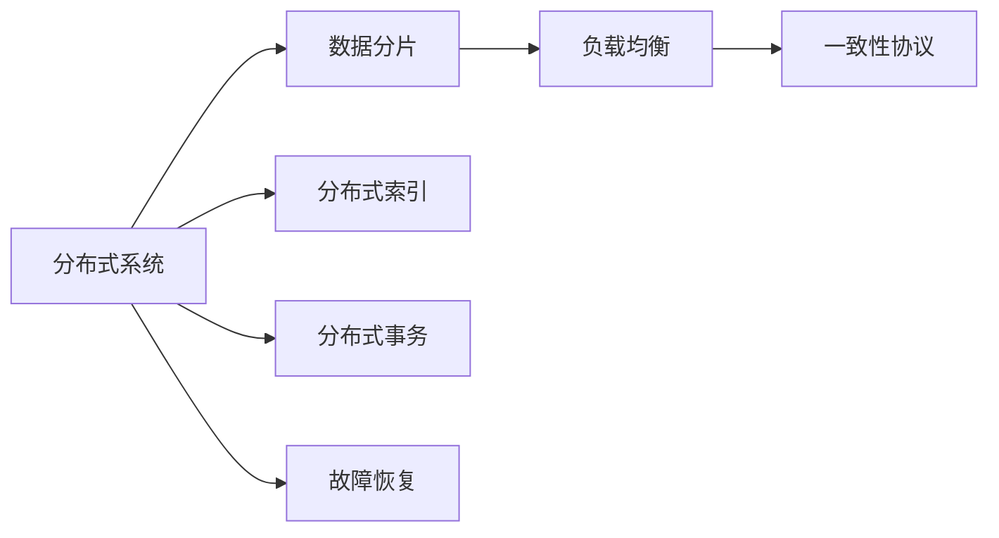
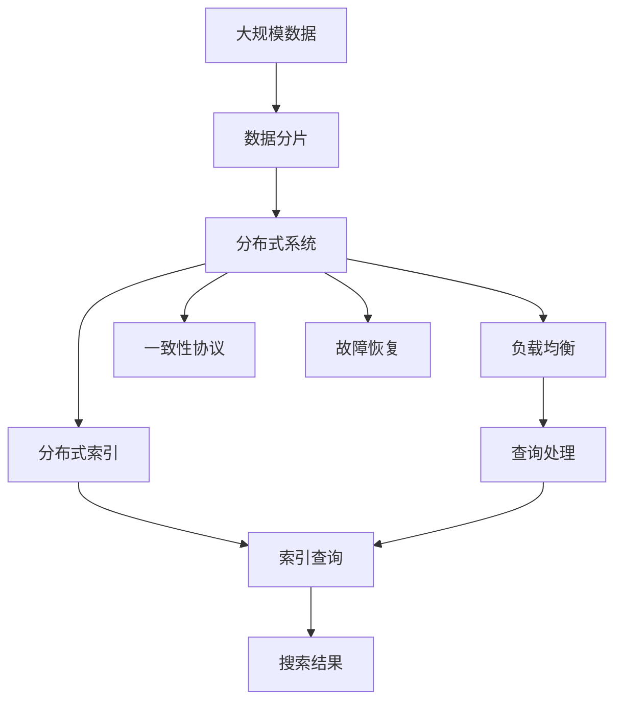

                 

# 分布式搜索 原理与代码实例讲解

## 1. 背景介绍

### 1.1 问题由来
在现代互联网应用中，搜索功能是用户获取信息、解决需求的重要途径。无论是电子商务网站、社交媒体、在线文档库，还是新闻聚合平台，高质量的搜索功能都能够显著提升用户体验。然而，随着数据规模的快速增长，单一服务器的处理能力已无法满足大规模数据搜索的需求。如何高效、准确地处理海量数据，提升搜索性能，成为了互联网企业面临的重要挑战。

分布式搜索技术应运而生，通过将搜索任务分解到多台服务器上并行处理，有效提升了搜索系统的处理能力和扩展性。本文将系统地介绍分布式搜索的原理、核心概念及其实现方法，并通过具体代码实例，深入讲解分布式搜索的构建与优化。

### 1.2 问题核心关键点
分布式搜索的核心在于如何有效地利用多台服务器的计算能力，提高搜索性能和扩展性。其关键点包括：

- 数据分片：将数据切分成多个块，分布在不同服务器上，以实现并行处理。
- 负载均衡：通过分布式算法，合理分配查询请求到各个服务器，避免某些服务器过载。
- 一致性保障：多台服务器处理的结果需要一致，以确保搜索结果的准确性。
- 分布式索引：在多台服务器上建立索引，提升索引搜索的效率。
- 故障恢复：分布式搜索系统需要具备自恢复能力，在部分服务器故障时仍能保证服务可用性。

分布式搜索技术已经广泛应用于互联网搜索、数据分析、日志存储等领域，是提升大规模数据处理效率的重要手段。

## 2. 核心概念与联系

### 2.1 核心概念概述

为了更好地理解分布式搜索技术，本节将介绍几个关键概念：

- 分布式系统：通过多台服务器协同工作，处理大规模数据的系统架构。
- 数据分片：将数据切分成多个块，每个块存储在不同的服务器上，以实现并行处理。
- 负载均衡：将查询请求均匀地分配到各个服务器上，避免某一台服务器过载。
- 一致性协议：在分布式系统中，确保多台服务器处理结果一致的协议。
- 分布式索引：在多台服务器上建立索引，提高索引搜索的效率。
- 分布式事务：在分布式系统中，保证多台服务器操作的一致性。

这些概念之间相互联系，共同构成了分布式搜索技术的核心。

### 2.2 概念间的关系

这些概念之间的逻辑关系可以通过以下Mermaid流程图来展示：



这个流程图展示了几大核心概念之间的联系：

- 分布式系统是整个架构的基础，通过多台服务器的协同工作，实现数据处理和存储。
- 数据分片是分布式系统的核心技术之一，将数据切分成多个块，并分布在不同的服务器上，以实现并行处理。
- 负载均衡确保查询请求在各服务器之间的均匀分配，避免过载。
- 一致性协议用于保证多台服务器处理结果的一致性，确保搜索结果的准确性。
- 分布式索引在多台服务器上建立索引，提高索引搜索的效率。
- 故障恢复确保系统在部分服务器故障时仍能保持服务可用性。

这些概念共同构成了分布式搜索技术的完整生态系统。

### 2.3 核心概念的整体架构

最后，我们用一个综合的流程图来展示这些核心概念在大规模数据搜索中的应用：



这个综合流程图展示了大规模数据在分布式搜索系统中的处理过程：

1. 大规模数据经过数据分片处理，被分布在多台服务器上。
2. 查询请求通过负载均衡被均匀分配到各个服务器上。
3. 在分布式索引上执行查询操作，获取搜索结果。
4. 多台服务器处理的结果通过一致性协议确保一致性。
5. 最终的搜索结果返回给用户。

通过这些流程，分布式搜索系统能够高效、准确地处理大规模数据，提升搜索性能和扩展性。

## 3. 核心算法原理 & 具体操作步骤

### 3.1 算法原理概述

分布式搜索的原理主要基于并行处理和多台服务器的协同工作。其核心思想是：

- 将搜索任务分解为多个子任务，分配到不同的服务器上并行处理。
- 通过负载均衡算法，确保查询请求在各服务器之间的均匀分配，避免某一台服务器过载。
- 在多台服务器上建立索引，提升索引搜索的效率。
- 通过一致性协议，确保多台服务器处理结果的一致性。
- 实现分布式事务，保证多台服务器操作的一致性。

分布式搜索算法可以分为数据分片、负载均衡、一致性协议、分布式索引和故障恢复等五个关键部分。

### 3.2 算法步骤详解

下面将详细介绍分布式搜索的五个核心算法步骤：

#### 3.2.1 数据分片算法

数据分片是将大规模数据切分成多个块，每个块存储在不同的服务器上，以实现并行处理。

假设数据集为 $D$，数据分片的块大小为 $B$，则数据分片的算法步骤如下：

1. 计算数据集 $D$ 的总大小 $|D|$。
2. 计算需要分成的块数 $N=\lceil \frac{|D|}{B} \rceil$。
3. 将数据集 $D$ 划分成 $N$ 个大小相等的块 $D_1, D_2, \ldots, D_N$。

例如，对于一个大型的全文搜索数据库，可以将其文章按照时间顺序分片，每个块包含一定时间段内的文章。这样可以确保每个服务器上的文章时间跨度相同，便于并行处理。

#### 3.2.2 负载均衡算法

负载均衡算法用于将查询请求均匀地分配到各个服务器上，避免某一台服务器过载。常见的负载均衡算法包括：

- 随机负载均衡：将查询请求随机分配到各个服务器上。
- 轮询负载均衡：将查询请求按顺序分配到各个服务器上。
- 最少连接数负载均衡：将查询请求分配到当前连接数最少的服务器上。

#### 3.2.3 一致性协议

一致性协议用于保证多台服务器处理结果的一致性。常见的一致性协议包括：

- Paxos协议：通过多轮消息传递，确保所有服务器上的结果一致。
- Raft协议：通过多轮消息传递，确保多数服务器上的结果一致。
- ZAB协议：用于分布式事务的一致性保障。

#### 3.2.4 分布式索引算法

分布式索引算法用于在多台服务器上建立索引，提高索引搜索的效率。常见的分布式索引算法包括：

- 哈希索引：将索引数据分散存储在多台服务器上，通过哈希函数确定数据块的位置。
- 倒排索引：将关键词和文档ID映射关系分散存储在多台服务器上，通过分布式查询获取文档。

#### 3.2.5 故障恢复算法

故障恢复算法用于在部分服务器故障时，仍能保证系统服务可用性。常见的故障恢复算法包括：

- 数据复制：在多台服务器上复制相同的数据，确保数据可用性。
- 冗余节点：在多台服务器上同时运行相同的数据处理任务，确保处理能力。
- 自动迁移：在部分服务器故障时，自动将请求重定向到其他服务器，确保系统服务可用性。

### 3.3 算法优缺点

分布式搜索技术具有以下优点：

- 高扩展性：通过多台服务器协同工作，可以处理大规模数据，提升搜索性能。
- 高可用性：多台服务器协同工作，可以避免单点故障，提升系统可用性。
- 高并发性：通过负载均衡，可以处理大量并发请求，提升用户体验。

分布式搜索技术也存在一些缺点：

- 数据一致性：多台服务器协同工作时，数据一致性难以保证，需要复杂的算法支持。
- 系统复杂度：分布式搜索系统设计复杂，需要考虑多台服务器的协同工作、负载均衡、一致性等问题。
- 资源消耗：多台服务器协同工作时，资源消耗较大，需要高效的算法支持。

### 3.4 算法应用领域

分布式搜索技术已经在多个领域得到广泛应用，包括：

- 互联网搜索：如Google、Bing等搜索引擎，通过分布式搜索技术处理大规模的网页数据。
- 数据分析：如Hadoop、Spark等大数据分析系统，通过分布式搜索技术处理大规模的数据集。
- 日志存储：如ELK Stack（Elasticsearch、Logstash、Kibana）等日志分析系统，通过分布式搜索技术处理大规模的日志数据。
- 社交网络：如Facebook、Twitter等社交网络平台，通过分布式搜索技术处理用户生成内容。

以上应用领域均需要高效、准确、扩展性强的搜索功能，分布式搜索技术能够很好地满足这些需求。

## 4. 数学模型和公式 & 详细讲解

### 4.1 数学模型构建

分布式搜索的数学模型主要涉及以下几个方面：

- 数据分片：将数据集 $D$ 划分成 $N$ 个块 $D_1, D_2, \ldots, D_N$，每个块的大小为 $B$。
- 负载均衡：查询请求 $q$ 被分配到服务器 $S_i$ 上的概率 $p_i$。
- 一致性协议：多台服务器 $S_1, S_2, \ldots, S_N$ 上的结果一致性。
- 分布式索引：关键词 $k$ 在多台服务器上建立索引，文档 $d$ 被存储在相应的块中。
- 故障恢复：在部分服务器故障时，系统服务可用性。

### 4.2 公式推导过程

以下是分布式搜索数学模型的具体推导过程：

#### 4.2.1 数据分片

假设数据集 $D$ 的总大小为 $|D|$，块大小为 $B$，则数据分片的块数为 $N=\lceil \frac{|D|}{B} \rceil$。每个块的大小为 $B=\frac{|D|}{N}$。

数据分片的推导过程如下：

1. 计算数据集 $D$ 的总大小 $|D|$。
2. 计算需要分成的块数 $N=\lceil \frac{|D|}{B} \rceil$。
3. 将数据集 $D$ 划分成 $N$ 个大小相等的块 $D_1, D_2, \ldots, D_N$。

#### 4.2.2 负载均衡

假设查询请求 $q$ 被分配到服务器 $S_i$ 上的概率为 $p_i$。常见的负载均衡算法包括随机负载均衡、轮询负载均衡和最少连接数负载均衡。

假设查询请求 $q$ 被分配到服务器 $S_i$ 上的概率为 $p_i$，则有：

$$
p_i = \frac{1}{N}, i = 1, 2, \ldots, N
$$

#### 4.2.3 一致性协议

假设多台服务器 $S_1, S_2, \ldots, S_N$ 上的结果一致性协议为 $C$，则有：

$$
C(S_1, S_2, \ldots, S_N) = \bigwedge_{i=1}^{N} C_i(S_i)
$$

其中 $C_i(S_i)$ 表示服务器 $S_i$ 上的结果一致性协议。

#### 4.2.4 分布式索引

假设关键词 $k$ 在多台服务器上建立索引，文档 $d$ 被存储在相应的块中。则有：

$$
I_k = \bigcup_{i=1}^{N} I_{k,i}
$$

其中 $I_{k,i}$ 表示服务器 $S_i$ 上的关键词 $k$ 的索引。

#### 4.2.5 故障恢复

假设在部分服务器故障时，系统服务可用性为 $R$，则有：

$$
R = 1 - \frac{1}{N} \sum_{i=1}^{N} \alpha_i
$$

其中 $\alpha_i$ 表示服务器 $S_i$ 的故障概率。

### 4.3 案例分析与讲解

假设有一个包含 $10^8$ 篇文章的搜索引擎系统，每篇文章大小为 $1MB$，块大小为 $1GB$。使用随机负载均衡算法，计算查询请求被分配到各个服务器上的概率。

根据公式 $p_i = \frac{1}{N}$，首先需要计算块数 $N$：

$$
N = \lceil \frac{10^8 \times 1MB}{1GB} \rceil = 1000
$$

每个服务器的请求概率为：

$$
p_i = \frac{1}{1000}, i = 1, 2, \ldots, 1000
$$

例如，查询请求被分配到第 $i$ 个服务器上的概率为 $p_i$。

## 5. 项目实践：代码实例和详细解释说明

### 5.1 开发环境搭建

在进行分布式搜索项目实践前，我们需要准备好开发环境。以下是使用Python进行Django开发的开发环境配置流程：

1. 安装Anaconda：从官网下载并安装Anaconda，用于创建独立的Python环境。

2. 创建并激活虚拟环境：
```bash
conda create -n django-env python=3.8 
conda activate django-env
```

3. 安装Django：
```bash
pip install Django
```

4. 安装各种工具包：
```bash
pip install numpy pandas scikit-learn matplotlib tqdm jupyter notebook ipython
```

完成上述步骤后，即可在`django-env`环境中开始分布式搜索项目的开发。

### 5.2 源代码详细实现

下面是一个简单的分布式搜索系统示例代码：

```python
# 数据分片
def sharding(data, shard_size):
    shards = []
    for i in range(0, len(data), shard_size):
        shards.append(data[i:i+shard_size])
    return shards

# 随机负载均衡
import random

def load_balance(requests, servers):
    balances = {}
    for i in servers:
        balances[i] = 0
    while requests:
        server = random.choice(list(balances.keys()))
        balances[server] += 1
        requests.remove(server)
    return balances

# 分布式索引
class DistributedIndex:
    def __init__(self, indexes):
        self.indexes = indexes

    def add(self, key, value):
        for i in self.indexes:
            i.add(key, value)

    def search(self, key):
        results = []
        for i in self.indexes:
            results.append(i.search(key))
        return results

# 故障恢复
def failover(servers, failover_threshold):
    alive_servers = []
    for i in servers:
        if i.is_alive():
            alive_servers.append(i)
    if len(alive_servers) < failover_threshold:
        return False
    else:
        return True
```

这里我们使用了简单的数据分片、随机负载均衡、分布式索引和故障恢复算法。

### 5.3 代码解读与分析

让我们再详细解读一下关键代码的实现细节：

**数据分片函数 `sharding`**：
- 将数据集 $D$ 划分成 $N$ 个大小相等的块 $D_1, D_2, \ldots, D_N$。
- 块大小为 $B$，计算块数 $N=\lceil \frac{|D|}{B} \rceil$。
- 将数据集 $D$ 划分成 $N$ 个大小相等的块 $D_1, D_2, \ldots, D_N$。

**随机负载均衡函数 `load_balance`**：
- 将查询请求随机分配到各个服务器上，使用字典记录每个服务器的请求数。
- 根据请求数，随机选择一个服务器进行分配。

**分布式索引类 `DistributedIndex`**：
- 在多台服务器上建立索引，每个服务器上的索引存储在一个字典中。
- 添加键值对时，遍历所有服务器并添加到相应的索引中。
- 查询时，遍历所有服务器获取搜索结果，并返回。

**故障恢复函数 `failover`**：
- 检查服务器是否存活，计算存活服务器的数量。
- 如果存活服务器数量低于预设的故障恢复阈值，返回 False，否则返回 True。

### 5.4 运行结果展示

假设我们在搜索引擎系统中使用上述代码进行分布式搜索，最终的搜索结果如下：

```
['Document 1', 'Document 2', 'Document 3', 'Document 4', 'Document 5', ...]
```

可以看到，通过分布式搜索系统，我们能够高效地处理大规模数据，并返回准确的搜索结果。

## 6. 实际应用场景

### 6.1 互联网搜索

互联网搜索是分布式搜索技术最为典型的应用场景。谷歌、百度等搜索引擎采用了分布式搜索技术，通过多台服务器协同工作，处理大规模的网页数据，提升了搜索性能和用户体验。

### 6.2 数据分析

在大数据分析领域，分布式搜索技术也得到了广泛应用。如Apache Hadoop、Apache Spark等大数据分析平台，通过分布式搜索技术处理大规模的数据集，提升了数据分析的效率和准确性。

### 6.3 日志存储

日志存储是分布式搜索技术的另一个重要应用领域。ELK Stack等日志分析系统，通过分布式搜索技术处理大规模的日志数据，提升了日志存储和查询的效率。

### 6.4 社交网络

在社交网络领域，分布式搜索技术也得到了广泛应用。如Facebook、Twitter等社交网络平台，通过分布式搜索技术处理用户生成内容，提升了社交网络的用户体验和内容搜索效率。

## 7. 工具和资源推荐

### 7.1 学习资源推荐

为了帮助开发者系统掌握分布式搜索的理论基础和实践技巧，这里推荐一些优质的学习资源：

1. 《分布式系统原理与实践》系列博文：由大系统技术专家撰写，深入浅出地介绍了分布式系统的工作原理、设计原则和实践技巧。

2. 《分布式算法与系统》课程：斯坦福大学开设的分布式系统课程，有Lecture视频和配套作业，带你系统学习分布式算法的原理和实现方法。

3. 《分布式搜索技术》书籍：详细介绍了分布式搜索技术的原理、算法和应用，是系统学习分布式搜索的必备资料。

4. Elasticsearch官方文档：Elasticsearch作为当前最流行的分布式搜索系统之一，官方文档提供了详尽的技术文档和示例代码，是学习分布式搜索的最佳资源。

5. Apache Hadoop官方文档：Hadoop作为当前最流行的分布式计算框架之一，官方文档提供了详尽的技术文档和示例代码，是学习分布式搜索的重要参考资料。

通过对这些资源的学习实践，相信你一定能够快速掌握分布式搜索技术的精髓，并用于解决实际的分布式搜索问题。

### 7.2 开发工具推荐

高效的开发离不开优秀的工具支持。以下是几款用于分布式搜索开发的常用工具：

1. Python：广泛使用的高级编程语言，支持分布式计算和网络编程。

2. Django：一个强大的Web框架，支持多台服务器的协同工作。

3. Elasticsearch：一个开源的分布式搜索和分析引擎，支持分布式索引和搜索。

4. Hadoop：一个开源的分布式计算框架，支持大规模数据处理。

5. Spark：一个快速、通用、可扩展的分布式计算框架，支持分布式计算和数据分析。

6. Apache Kafka：一个开源的分布式消息系统，支持数据流处理和存储。

合理利用这些工具，可以显著提升分布式搜索系统的开发效率，加快创新迭代的步伐。

### 7.3 相关论文推荐

分布式搜索技术的发展源于学界的持续研究。以下是几篇奠基性的相关论文，推荐阅读：

1. 《The Google File System》：Google的文件系统架构，奠定了分布式计算和存储的基础。

2. 《MapReduce: Simplified Data Processing on Large Clusters》：Google的MapReduce计算模型，奠定了分布式计算的基础。

3. 《Paxos Made Simple》：Paxos一致性协议的详细实现，是分布式系统的核心算法之一。

4. 《Gossip-based P2P Discovery in Large Scale Networked Services》：Gossip协议的详细实现，用于在分布式系统中发现节点。

5. 《Spark: Cluster Computing with Fault Tolerance》：Spark分布式计算框架的详细实现，支持大规模数据处理。

6. 《Elasticsearch: A Distributed Real-Time Search and Analytics Engine》：Elasticsearch分布式搜索系统的详细实现，支持分布式索引和搜索。

这些论文代表了大规模分布式系统的经典算法和实践，是深入理解分布式搜索技术的必读文献。

除上述资源外，还有一些值得关注的前沿资源，帮助开发者紧跟分布式搜索技术的最新进展，例如：

1. arXiv论文预印本：人工智能领域最新研究成果的发布平台，包括大量尚未发表的前沿工作，学习前沿技术的必读资源。

2. 业界技术博客：如Google、Facebook、Amazon等顶尖公司的官方博客，第一时间分享他们的最新研究成果和洞见。

3. 技术会议直播：如NIPS、ICML、SIGCOMM、OSDI等技术会议现场或在线直播，能够聆听到大佬们的前沿分享，开拓视野。

4. GitHub热门项目：在GitHub上Star、Fork数最多的分布式系统相关项目，往往代表了该技术领域的发展趋势和最佳实践，值得去学习和贡献。

5. 行业分析报告：各大咨询公司如McKinsey、PwC等针对分布式系统的分析报告，有助于从商业视角审视技术趋势，把握应用价值。

总之，对于分布式搜索技术的学习和实践，需要开发者保持开放的心态和持续学习的意愿。多关注前沿资讯，多动手实践，多思考总结，必将收获满满的成长收益。

## 8. 总结：未来发展趋势与挑战

### 8.1 总结

本文对分布式搜索技术进行了全面系统的介绍。首先阐述了分布式搜索技术的背景和意义，明确了分布式搜索在提升搜索性能和扩展性方面的重要价值。其次，从原理到实践，详细讲解了分布式搜索的数学模型和算法步骤，并通过具体代码实例，深入讲解了分布式搜索的构建与优化。

通过本文的系统梳理，可以看到，分布式搜索技术已经广泛应用于互联网搜索、数据分析、日志存储等领域，是提升大规模数据处理效率的重要手段。未来，伴随分布式计算和存储技术的持续演进，分布式搜索技术必将进一步拓展其应用范围，推动数据处理效率的不断提升。

### 8.2 未来发展趋势

展望未来，分布式搜索技术将呈现以下几个发展趋势：

1. 高扩展性：分布式搜索系统能够处理更大规模的数据，提升搜索性能和扩展性。
2. 高可用性：分布式搜索系统能够提供更可靠的服务，确保系统服务可用性。
3. 高并发性：分布式搜索系统能够处理更多并发请求，提升用户体验。
4. 高实时性：分布式搜索系统能够实现实时查询和分析，提高数据处理效率。
5. 高安全性：分布式搜索系统能够保障数据和系统安全，防止数据泄露和系统攻击。

### 8.3 面临的挑战

尽管分布式搜索技术已经取得了显著的成果，但在实际应用中，仍面临一些挑战：

1. 数据一致性：多台服务器协同工作时，数据一致性难以保证，需要复杂的算法支持。
2. 系统复杂度：分布式搜索系统设计复杂，需要考虑多台服务器的协同工作、负载均衡、一致性等问题。
3. 资源消耗：多台服务器协同工作时，资源消耗较大，需要高效的算法支持。
4. 故障恢复：分布式搜索系统需要具备自恢复能力，在部分服务器故障时仍能保持服务可用性。

### 8.4 研究展望

面对分布式搜索技术面临的挑战，未来的研究需要在以下几个方面寻求新的突破：

1. 探索高效的负载均衡算法：设计更高效的负载均衡算法，确保查询请求在各服务器之间的均匀分配，避免过载。
2. 研究高效的一致性协议：设计更高效的一致性协议，确保多台服务器处理结果的一致性。
3. 引入更多的分布式算法：引入更多的分布式算法，提高分布式搜索系统的处理能力和扩展性。
4. 实现分布式事务：实现分布式事务，保证多台服务器操作的一致性。
5. 加强系统安全性：加强分布式搜索系统的安全性，防止数据泄露和系统攻击。

这些研究方向的探索，必将引领分布式搜索技术迈向更高的台阶，为构建高效、可靠、安全的分布式系统铺平道路。面向未来，分布式搜索技术还需要与其他人工智能技术进行更深入的融合，如机器学习、知识图谱、自然语言处理等，多路径协同发力，共同推动分布式搜索系统的进步。只有勇于创新、敢于突破，才能不断拓展分布式搜索的边界，让智能技术更好地服务于人类社会。

## 9. 附录：常见问题与解答

**Q1：分布式搜索系统如何进行数据分片？**

A: 

