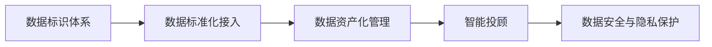
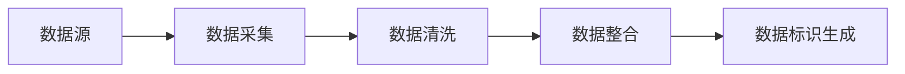
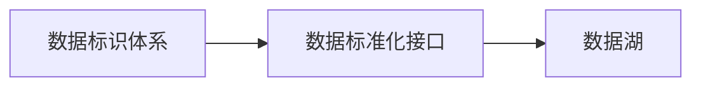
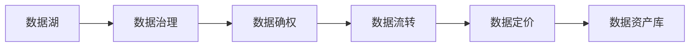
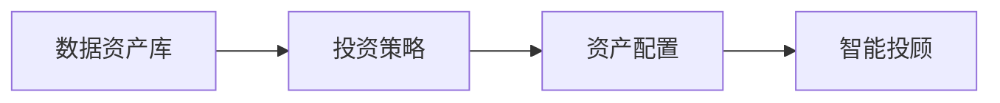
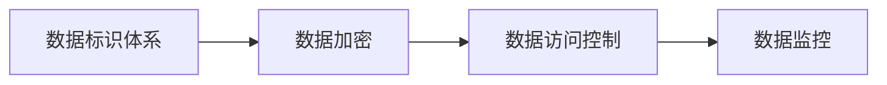

                 

# 创造“创世粒子”的技术标准

> 关键词：创世粒子, 粒子化技术, 数字标识, 数据治理, 区块链技术, 数据资产管理, 智能合约, 智能投顾

## 1. 背景介绍

### 1.1 问题由来
随着数字经济时代的到来，数据已经成为一种重要的生产要素和战略资源。无论是消费者行为、企业运营，还是宏观经济分析，都离不开数据的支撑。然而，数据的收集、存储、处理和应用过程中，面临着一系列复杂的技术和伦理问题，如数据隐私、数据孤岛、数据资产化等。如何高效、安全、可靠地管理数据，成为当前数字经济发展中的一大挑战。

为解决这些问题，众多科技公司和机构纷纷提出了各种解决方案，其中不乏借鉴物理学中的“创世粒子”理论。所谓“创世粒子”，是指能够代表并关联数据的多维属性标识，用于描述数据实体及其内在关联，为数据治理、数据资产管理、智能投顾等提供技术支撑。

### 1.2 问题核心关键点
“创世粒子”理论强调数据治理的基础在于构建一个统一、标准化的数据标识体系。该体系以数据实体为核心，涵盖数据来源、属性、状态、交互关系等维度，通过标识符编码，生成唯一的数据“粒度”。基于“创世粒子”，可以实现数据的标准化接入、资产化管理、智能投顾等应用，为数字经济的发展提供有力的技术保障。

“创世粒子”的核心关键点包括：

1. **数据标识体系**：构建统一的数据标识体系，定义数据实体的属性和关系，生成唯一的标识符。
2. **数据标准化接入**：通过标准化接口，实现不同数据源的数据统一接入和处理。
3. **数据资产化管理**：对数据资产进行登记、确权、流转、定价等管理，实现数据资源的商业化运营。
4. **智能投顾**：基于数据资产，提供个性化的投资建议和资产管理服务，提升投资决策的科学性和精准度。
5. **数据安全与隐私保护**：确保数据标识体系的安全性和隐私性，防止数据泄露和滥用。

### 1.3 问题研究意义
研究“创世粒子”技术标准，对于推动数字经济的健康发展，具有重要意义：

1. **促进数据共享**：通过统一的数据标识体系，实现跨机构、跨平台的数据共享，打破数据孤岛，提升数据利用效率。
2. **保障数据安全**：标准化的数据标识体系，有助于保护数据隐私和权益，防止数据泄露和滥用。
3. **推动数据资产化**：通过标识化和资产化管理，提升数据资源的商业价值，推动数据要素市场发展。
4. **提升智能决策能力**：基于统一的数据标识体系，智能投顾等应用可以提供更加精准、个性化的服务，提高决策的科学性和精准度。
5. **驱动技术创新**：“创世粒子”技术标准的制定，将推动区块链、人工智能等前沿技术的应用，加速数字经济的技术创新。

## 2. 核心概念与联系

### 2.1 核心概念概述

为更好地理解“创世粒子”技术标准的核心概念，本节将介绍几个关键概念及其相互联系：

- **数据标识体系**：通过统一的标识符编码规则，生成唯一的数据标识符，描述数据实体的属性和关系。
- **数据标准化接入**：通过统一的数据标准化接口，实现不同数据源的数据接入和处理，形成统一的数据湖。
- **数据资产化管理**：对数据资产进行登记、确权、流转、定价等管理，实现数据资源的商业化运营。
- **智能投顾**：基于数据资产，提供个性化的投资建议和资产管理服务，提升投资决策的科学性和精准度。
- **数据安全与隐私保护**：确保数据标识体系的安全性和隐私性，防止数据泄露和滥用。

这些概念之间的逻辑关系可以通过以下Mermaid流程图来展示：



这个流程图展示了“创世粒子”技术标准的核心概念及其相互关系：

1. 数据标识体系是整个系统的基础，通过统一的数据标识规则，生成唯一的数据标识符。
2. 数据标准化接入基于标识体系，实现不同数据源的统一接入和处理，形成统一的数据湖。
3. 数据资产化管理进一步利用数据标准化接入的结果，对数据资产进行登记、确权等管理。
4. 智能投顾基于数据资产化管理的结果，提供个性化的投资建议和资产管理服务。
5. 数据安全与隐私保护贯穿整个系统，确保数据标识体系的安全性和隐私性。

### 2.2 概念间的关系

这些核心概念之间存在着紧密的联系，构成了“创世粒子”技术标准的完整生态系统。下面我们通过几个Mermaid流程图来展示这些概念之间的关系。

#### 2.2.1 数据标识体系构建



这个流程图展示了从数据源到数据标识生成的过程：

1. 数据源包括不同来源的数据，如企业内部数据、外部公开数据等。
2. 数据采集通过API、爬虫等方式，从数据源中提取数据。
3. 数据清洗去除重复、噪声等无用数据，提升数据质量。
4. 数据整合将不同来源的数据进行融合，生成统一的数据集。
5. 数据标识生成基于数据集，生成唯一的数据标识符，形成数据标识体系。

#### 2.2.2 数据标准化接入



这个流程图展示了数据标准化接入的过程：

1. 数据标识体系为数据标准化接口提供数据实体标识。
2. 数据标准化接口根据标识规则，将不同来源的数据接入统一的数据湖。
3. 数据湖是经过清洗、整合、标准化后的数据集合，为后续的数据治理和应用提供支撑。

#### 2.2.3 数据资产化管理



这个流程图展示了数据资产化管理的过程：

1. 数据湖提供数据治理的基础数据。
2. 数据治理对数据进行标准化、分类、标注等管理，确保数据质量。
3. 数据确权对数据资产进行确权登记，确保数据所有权的明确。
4. 数据流转实现数据资产的流转和共享，提高数据利用效率。
5. 数据定价基于数据资产的评估，确定数据价格，实现数据商业化。
6. 数据资产库是经过确权、定价的数据资产集合，为智能投顾等应用提供支撑。

#### 2.2.4 智能投顾



这个流程图展示了智能投顾的过程：

1. 数据资产库提供投资策略的数据基础。
2. 投资策略基于数据资产库，生成个性化的投资方案。
3. 资产配置根据投资策略，进行资产的配置和调整。
4. 智能投顾基于投资策略和资产配置，提供智能化的投资建议和资产管理服务。

#### 2.2.5 数据安全与隐私保护



这个流程图展示了数据安全与隐私保护的过程：

1. 数据标识体系提供数据实体的标识，为数据加密提供基础。
2. 数据加密对数据进行加密保护，防止数据泄露。
3. 数据访问控制根据标识体系，实现对数据的访问控制，防止未授权访问。
4. 数据监控对数据使用情况进行实时监控，防止数据滥用。

### 2.3 核心概念的整体架构

最后，我们用一个综合的流程图来展示这些核心概念在“创世粒子”技术标准中的整体架构：


这个综合流程图展示了从数据源到智能投顾的完整流程，“创世粒子”技术标准涵盖了数据标识体系、数据标准化接入、数据资产化管理、智能投顾、数据安全与隐私保护等各个环节，形成了一个完整的数据治理生态系统。

## 3. 核心算法原理 & 具体操作步骤
### 3.1 算法原理概述

“创世粒子”技术标准的核心在于构建统一、标准化的数据标识体系。其算法原理主要包括以下几个关键步骤：

1. **数据标识符生成**：基于数据实体的属性和关系，生成唯一的标识符，用于标识数据实体。
2. **数据标准化接入**：通过统一的数据标准化接口，实现不同数据源的数据统一接入和处理，形成统一的数据湖。
3. **数据资产化管理**：对数据资产进行登记、确权、流转、定价等管理，实现数据资源的商业化运营。
4. **智能投顾**：基于数据资产，提供个性化的投资建议和资产管理服务，提升投资决策的科学性和精准度。
5. **数据安全与隐私保护**：确保数据标识体系的安全性和隐私性，防止数据泄露和滥用。

### 3.2 算法步骤详解

#### 3.2.1 数据标识符生成

数据标识符生成的核心是对数据实体进行编码，生成唯一的标识符。通常采用JSON-LD格式，通过命名空间、属性、关系等，构建数据实体的标识符。

例如，对于一个公司数据实体，其标识符可以如下构建：

```json
{
  "@context": "http://www.w3.org/1999/02/22-rdf-syntax-ns#",
  "@type": "Organization",
  "organizationName": "ABC公司",
  "website": "http://www.abc.com",
  "address": {
    "@type": "PostalAddress",
    "streetAddress": "长江路100号",
    "city": "上海",
    "postCode": "200011",
    "country": "中国"
  }
}
```

这个标识符包含了公司的名称、网站、地址等信息，通过JSON-LD格式，可以实现跨系统、跨平台的数据共享和交换。

#### 3.2.2 数据标准化接入

数据标准化接入的核心是通过统一的数据标准化接口，实现不同数据源的数据统一接入和处理。具体步骤如下：

1. **数据源接入**：通过API接口或消息队列，将不同数据源的数据接入到数据湖中。
2. **数据清洗和处理**：对数据进行清洗、去重、格式化等处理，提升数据质量。
3. **数据整合和标准化**：将不同数据源的数据进行整合，生成统一的数据标准。
4. **数据湖形成**：将经过清洗、整合、标准化的数据存储在数据湖中，供后续处理和分析使用。

例如，假设一个电商公司需要接入用户行为数据、商品数据、交易数据等，其数据标准化接入过程可以如下实现：

```python
from pyspark.sql import SparkSession
from pyspark.sql.functions import col, concat, when

# 创建Spark会话
spark = SparkSession.builder.appName("Data Standardization").getOrCreate()

# 定义数据源路径
paths = ["user_behavior.csv", "product_data.csv", "transaction_data.csv"]

# 加载数据源
df_user = spark.read.csv(paths[0], header=True, inferSchema=True)
df_product = spark.read.csv(paths[1], header=True, inferSchema=True)
df_transaction = spark.read.csv(paths[2], header=True, inferSchema=True)

# 数据清洗和处理
df_user_cleaned = df_user.select(
    concat(df_user.name, df_user.age).alias("user_info"),
    df_user.behavior
).withColumn("timestamp", df_user.timestamp.cast("timestamp"))
df_product_cleaned = df_product.select(
    df_product.id,
    df_product.name,
    df_product.price
).withColumn("timestamp", df_product.created_at.cast("timestamp"))
df_transaction_cleaned = df_transaction.select(
    df_transaction.user_id,
    df_transaction.product_id,
    df_transaction.amount,
    df_transaction.timestamp
)

# 数据整合和标准化
df_combined = df_user_cleaned.join(
    df_product_cleaned,
    ["user_id", "product_id"],
    "left_outer"
).join(
    df_transaction_cleaned,
    ["user_id", "product_id"],
    "left_outer"
).withColumn("user_product", concat(df_combined.user_info, df_combined.behavior))

# 数据湖形成
df_combined.write.csv("combined_data.csv", header=True, index=False)
```

#### 3.2.3 数据资产化管理

数据资产化管理的核心是对数据资产进行登记、确权、流转、定价等管理，实现数据资源的商业化运营。具体步骤如下：

1. **数据资产登记**：对数据资产进行登记和分类，明确数据资产的类型和来源。
2. **数据资产确权**：对数据资产进行确权登记，确保数据所有权的明确。
3. **数据资产流转**：实现数据资产的流转和共享，提高数据利用效率。
4. **数据资产定价**：基于数据资产的评估，确定数据价格，实现数据商业化运营。

例如，假设一个电商公司需要对用户行为数据、商品数据、交易数据等进行资产化管理，其过程可以如下实现：

```python
from dataassets import DataAsset

# 创建数据资产实例
asset_user_behavior = DataAsset(
    name="User Behavior Data",
    type="User",
    source="User Behavior",
    description="User behavior data from user interactions."
)
asset_product_data = DataAsset(
    name="Product Data",
    type="Product",
    source="Product Catalog",
    description="Product data from product catalog."
)
asset_transaction_data = DataAsset(
    name="Transaction Data",
    type="Transaction",
    source="Transaction History",
    description="Transaction data from transaction history."
)

# 数据资产登记
asset_user_behavior.register()
asset_product_data.register()
asset_transaction_data.register()

# 数据资产确权
asset_user_behavior.add_owners("User Data Manager")
asset_product_data.add_owners("Product Manager")
asset_transaction_data.add_owners("Transaction Manager")

# 数据资产流转
asset_user_behavior.add_consumers("Marketing Team")
asset_product_data.add_consumers("Product Development Team")
asset_transaction_data.add_consumers("Financial Analysis Team")

# 数据资产定价
asset_user_behavior.set_price(1.0)
asset_product_data.set_price(0.5)
asset_transaction_data.set_price(0.3)
```

#### 3.2.4 智能投顾

智能投顾的核心是根据数据资产，提供个性化的投资建议和资产管理服务，提升投资决策的科学性和精准度。具体步骤如下：

1. **投资策略生成**：基于数据资产，生成个性化的投资策略。
2. **资产配置优化**：根据投资策略，进行资产的配置和调整。
3. **智能投顾服务**：基于投资策略和资产配置，提供智能化的投资建议和资产管理服务。

例如，假设一个投资公司需要根据用户行为数据、商品数据、交易数据等，生成个性化的投资策略，其过程可以如下实现：

```python
from investment import InvestmentStrategy

# 创建投资策略实例
strategy = InvestmentStrategy(
    name="User-Based Investment Strategy",
    description="Investment strategy based on user behavior data."
)

# 生成投资策略
strategy.generate(user_data)

# 资产配置优化
assets = strategy.get_assets()
config = strategy.optimize(assets)

# 智能投顾服务
portfolio = strategy.get_portfolio(config)
```

#### 3.2.5 数据安全与隐私保护

数据安全与隐私保护的核心是确保数据标识体系的安全性和隐私性，防止数据泄露和滥用。具体步骤如下：

1. **数据加密**：对数据进行加密保护，防止数据泄露。
2. **数据访问控制**：根据标识体系，实现对数据的访问控制，防止未授权访问。
3. **数据监控**：对数据使用情况进行实时监控，防止数据滥用。

例如，假设一个电商公司需要对用户行为数据、商品数据、交易数据等进行安全保护，其过程可以如下实现：

```python
from datasecurity import DataSecurity

# 创建数据安全实例
data_security = DataSecurity()

# 数据加密
encrypted_user_data = data_security.encrypt(user_data)

# 数据访问控制
access_control = data_security.check_access(user, encrypted_user_data)

# 数据监控
monitoring = data_security.monitor(user, encrypted_user_data)
```

### 3.3 算法优缺点

“创世粒子”技术标准的算法具有以下优点：

1. **数据标准化接入**：通过统一的标准化接口，实现不同数据源的统一接入和处理，形成统一的数据湖，提高数据利用效率。
2. **数据资产化管理**：通过登记、确权、流转、定价等管理，实现数据资源的商业化运营，提升数据价值。
3. **智能投顾**：基于数据资产，提供个性化的投资建议和资产管理服务，提升投资决策的科学性和精准度。
4. **数据安全与隐私保护**：通过加密、访问控制、监控等措施，确保数据标识体系的安全性和隐私性，防止数据泄露和滥用。

同时，该算法也存在以下缺点：

1. **数据标识体系复杂**：构建统一的数据标识体系，需要定义复杂的命名空间、属性、关系等，需要大量的设计和维护工作。
2. **数据标准化接入难度大**：不同数据源的数据格式、结构等差异较大，实现标准化接入的难度较大。
3. **数据资产化管理复杂**：数据资产的登记、确权、流转、定价等管理，需要详细的规则和流程，操作复杂。
4. **智能投顾模型复杂**：投资策略和资产配置的生成和优化，需要复杂的数学模型和算法，实现难度较大。
5. **数据安全与隐私保护难度高**：数据加密、访问控制、监控等措施，需要高强度的安全技术和手段，实现难度较大。

### 3.4 算法应用领域

“创世粒子”技术标准的算法已在多个领域得到应用，包括：

1. **数据治理**：通过对数据进行标准化接入、资产化管理，实现数据治理和数据共享，打破数据孤岛，提升数据利用效率。
2. **智能投顾**：基于数据资产，提供个性化的投资建议和资产管理服务，提升投资决策的科学性和精准度。
3. **数据资产管理**：对数据资产进行登记、确权、流转、定价等管理，实现数据资源的商业化运营。
4. **金融科技**：在金融科技领域，实现数据的智能分析和应用，提升金融服务的智能化水平。
5. **智慧城市**：在智慧城市领域，实现数据的智能管理和应用，提升城市管理的自动化和智能化水平。

除了以上应用领域，“创世粒子”技术标准的算法还可以在医疗、教育、政府、交通等多个领域推广应用，为各行各业提供数据治理和数据资产管理的解决方案。

## 4. 数学模型和公式 & 详细讲解 & 举例说明

### 4.1 数学模型构建

“创世粒子”技术标准的数学模型主要涉及数据标识体系、数据标准化接入、数据资产化管理、智能投顾、数据安全与隐私保护等关键环节。以下我们将对这些数学模型进行详细构建和推导。

#### 4.1.1 数据标识体系

数据标识体系的核心是生成唯一的标识符，用于标识数据实体。通常采用JSON-LD格式，通过命名空间、属性、关系等，构建数据实体的标识符。

例如，对于一个公司数据实体，其标识符可以如下构建：

```json
{
  "@context": "http://www.w3.org/1999/02/22-rdf-syntax-ns#",
  "@type": "Organization",
  "organizationName": "ABC公司",
  "website": "http://www.abc.com",
  "address": {
    "@type": "PostalAddress",
    "streetAddress": "长江路100号",
    "city": "上海",
    "postCode": "200011",
    "country": "中国"
  }
}
```

#### 4.1.2 数据标准化接入

数据标准化接入的核心是通过统一的数据标准化接口，实现不同数据源的数据统一接入和处理。

具体步骤如下：

1. **数据源接入**：通过API接口或消息队列，将不同数据源的数据接入到数据湖中。
2. **数据清洗和处理**：对数据进行清洗、去重、格式化等处理，提升数据质量。
3. **数据整合和标准化**：将不同数据源的数据进行整合，生成统一的数据标准。
4. **数据湖形成**：将经过清洗、整合、标准化的数据存储在数据湖中，供后续处理和分析使用。

例如，假设一个电商公司需要接入用户行为数据、商品数据、交易数据等，其数据标准化接入过程可以如下实现：

```python
from pyspark.sql import SparkSession
from pyspark.sql.functions import col, concat, when

# 创建Spark会话
spark = SparkSession.builder.appName("Data Standardization").getOrCreate()

# 定义数据源路径
paths = ["user_behavior.csv", "product_data.csv", "transaction_data.csv"]

# 加载数据源
df_user = spark.read.csv(paths[0], header=True, inferSchema=True)
df_product = spark.read.csv(paths[1], header=True, inferSchema=True)
df_transaction = spark.read.csv(paths[2], header=True, inferSchema=True)

# 数据清洗和处理
df_user_cleaned = df_user.select(
    concat(df_user.name, df_user.age).alias("user_info"),
    df_user.behavior
).withColumn("timestamp", df_user.timestamp.cast("timestamp"))
df_product_cleaned = df_product.select(
    df_product.id,
    df_product.name,
    df_product.price
).withColumn("timestamp", df_product.created_at.cast("timestamp"))
df_transaction_cleaned = df_transaction.select(
    df_transaction.user_id,
    df_transaction.product_id,
    df_transaction.amount,
    df_transaction.timestamp
)

# 数据整合和标准化
df_combined = df_user_cleaned.join(
    df_product_cleaned,
    ["user_id", "product_id"],
    "left_outer"
).join(
    df_transaction_cleaned,
    ["user_id", "product_id"],
    "left_outer"
).withColumn("user_product", concat(df_combined.user_info, df_combined.behavior))

# 数据湖形成
df_combined.write.csv("combined_data.csv", header=True, index=False)
```

#### 4.1.3 数据资产化管理

数据资产化管理的核心是对数据资产进行登记、确权、流转、定价等管理，实现数据资源的商业化运营。

具体步骤如下：

1. **数据资产登记**：对数据资产进行登记和分类，明确数据资产的类型和来源。
2. **数据资产确权**：对数据资产进行确权登记，确保数据所有权的明确。
3. **数据资产流转**：实现数据资产的流转和共享，提高数据利用效率。
4. **数据资产定价**：基于数据资产的评估，确定数据价格，实现数据商业化运营。

例如，假设一个电商公司需要对用户行为数据、商品数据、交易数据等进行资产化管理，其过程可以如下实现：

```python
from dataassets import DataAsset

# 创建数据资产实例
asset_user_behavior = DataAsset(
    name="User Behavior Data",
    type="User",
    source="User Behavior",
    description="User behavior data from user interactions."
)
asset_product_data = DataAsset(
    name="Product Data",
    type="Product",
    source="Product Catalog",
    description="Product data from product catalog."
)
asset_transaction_data = DataAsset(
    name="Transaction Data",
    type="Transaction",
    source="Transaction History",
    description="Transaction data from transaction history."
)

# 数据资产登记
asset_user_behavior.register()
asset_product_data.register()
asset_transaction_data.register()

# 数据资产确权
asset_user_behavior.add_owners("User Data Manager")
asset_product_data.add_owners("Product Manager")
asset_transaction_data.add_owners("Transaction Manager")

# 数据资产流转
asset_user_behavior.add_consumers("Marketing Team")
asset_product_data.add_consumers("Product Development Team")
asset_transaction_data.add_consumers("Financial Analysis Team")

# 数据资产定价
asset_user_behavior.set_price(1.0)
asset_product_data.set_price(0.5)
asset_transaction_data.set_price(0.3)
```

#### 4.1.4 智能投顾

智能投顾的核心是根据数据资产，提供个性化的投资建议和资产管理服务，提升投资决策的科学性和精准度。

具体步骤如下：

1. **投资策略生成**：基于数据资产，生成个性化的投资策略。
2. **资产配置优化**：根据投资策略，进行资产的配置和调整。
3. **智能投顾服务**：基于投资策略和资产配置，提供智能化的投资建议和资产管理服务。

例如，假设一个投资公司需要根据用户行为数据、商品数据、交易数据等，生成个性化的投资策略，其过程可以如下实现：

