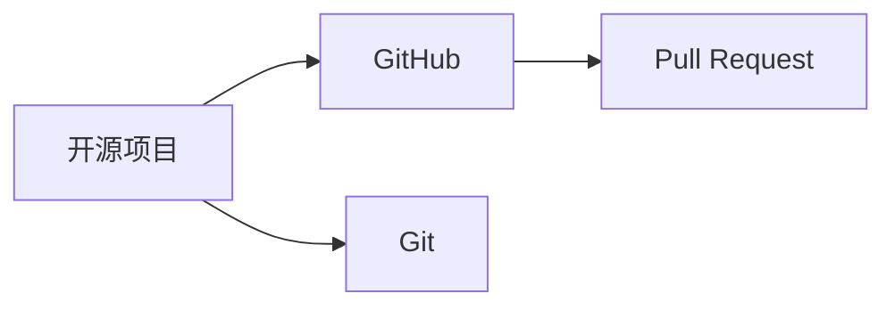

                 

# 利用开源贡献提升职场竞争力

在当今技术日新月异的职场环境中，掌握最新的技术趋势和应用方法是提升竞争力的关键。而开源社区作为技术创新和知识共享的重要平台，提供了大量高质量的代码库、框架和工具，为我们提供了丰富的学习和实践机会。本文将探讨如何利用开源贡献提升职场竞争力，包括理解开源项目的重要性、贡献方式、常见问题和提升路径等。

## 1. 背景介绍

### 1.1 问题由来

随着互联网技术的迅猛发展，开源社区已成为技术交流和知识共享的重要场所。GitHub等平台上的数百万开源项目，涵盖了几乎所有的技术领域。这些项目不仅包括了前沿的学术研究，还涵盖了广泛的企业级应用和工具库。利用开源项目进行学习和实践，成为技术工作者提升技能和就业竞争力的重要途径。

但与此同时，开源贡献的门槛和流程也成为阻碍许多技术工作者参与其中的因素。对于初学者而言，不了解贡献流程、不知道如何获取指导和反馈，导致对开源项目望而却步。而对经验丰富的开发者而言，如何在繁忙的工作中抽出时间进行开源贡献，也是一个挑战。

### 1.2 问题核心关键点

本文将聚焦于如何通过开源贡献提升职场竞争力，围绕以下几个核心关键点展开讨论：
1. 开源项目的重要性和价值。
2. 如何选择合适的开源项目进行贡献。
3. 开源贡献的具体流程和方法。
4. 开源贡献过程中常见问题及解决方案。
5. 开源贡献带来的职场竞争优势。

## 2. 核心概念与联系

### 2.1 核心概念概述

开源项目：指在开源许可证下，公开发布并提供给任何人自由使用的软件项目。开源项目不仅包括源代码，还包含了文档、测试案例、维护记录等。

GitHub：全球最大的开源代码托管平台，提供版本控制、代码审查、项目管理等工具，支持代码的开源合作与共享。

Git：一种分布式版本控制系统，用于管理代码的提交、分支、合并等操作。

Pull Request（PR）：GitHub上的一种协作机制，用于提交代码变更请求，并进行代码审查和合并。

### 2.2 核心概念之间的关系

这些核心概念之间的关系可以通过以下Mermaid流程图来展示：



这个流程图展示了大语言模型微调过程中各个核心概念之间的关系：

1. 开源项目在GitHub上发布和维护。
2. Git是项目版本控制的工具，用于管理代码变更。
3. Pull Request是GitHub上的协作机制，用于提交代码变更请求。

通过理解这些核心概念的关系，我们可以更好地把握开源项目的运作方式和开源贡献的流程。

## 3. 核心算法原理 & 具体操作步骤

### 3.1 算法原理概述

开源贡献的本质是一种技术交流和知识共享的行为。通过参与开源项目，开发者不仅能学习到新的技术知识，还能积累实际的项目经验，提升解决问题的能力。参与开源项目的过程，本身也是一种学习和提升的过程。

### 3.2 算法步骤详解

开源贡献通常分为以下步骤：

**Step 1: 选择开源项目**
- 根据自己的兴趣和技术栈，选择适合自己的开源项目。可以通过GitHub上的热门项目、Star数、Fork数等指标来衡量项目的活跃度和受欢迎程度。
- 查看项目的README文件，了解项目的背景、目标和技术栈，确保自己的技术水平和兴趣与项目相符。

**Step 2: 获取贡献权限**
- 访问项目的GitHub页面，点击“Fork”按钮将项目复制到自己账号下的仓库。
- 在复制的仓库上，创建Pull Request，并邀请原项目维护者进行代码审查。

**Step 3: 贡献代码**
- 在本地克隆复制的仓库，进行代码开发。
- 在Pull Request上，详细描述代码变更的原因、逻辑和影响。
- 耐心等待原项目维护者的代码审查，并根据反馈进行修改。

**Step 4: 代码合并**
- 代码审查通过后，原项目维护者会将代码合并到主分支，并关闭Pull Request。
- 参与者可以查看合并后的代码，学习和了解项目的变化。

### 3.3 算法优缺点

开源贡献的优点：
1. 技术学习：参与开源项目可以学习到前沿技术和最佳实践，提升技术水平。
2. 项目经验：通过实际操作，积累项目管理和团队协作经验。
3. 社区认可：开源贡献者可以获取社区的认可和推荐，提升个人品牌。

开源贡献的缺点：
1. 时间和精力：参与开源项目需要投入大量的时间和精力，可能会影响工作。
2. 贡献门槛：需要一定的技术水平和项目理解能力，初学者可能感到困难。
3. 代码审查：代码审查过程可能会遇到挑战，需要耐心和沟通技巧。

### 3.4 算法应用领域

开源贡献在多个技术领域都有广泛的应用，包括但不限于：

- 软件工程：如构建和维护开源框架、工具库等。
- 数据分析：如贡献数据清洗、分析算法等。
- 人工智能：如实现和优化深度学习模型、自然语言处理工具等。
- 云计算：如参与OpenStack、Kubernetes等项目。

## 4. 数学模型和公式 & 详细讲解 & 举例说明

由于开源贡献涉及的是技术实践和协作，数学模型和公式的应用相对较少。但在某些特定领域，数学模型的理解对于贡献开源项目有一定的帮助。例如，对于数据分析和机器学习项目，理解基本的统计学和机器学习算法，可以更好地理解项目的原理和实现。

### 4.1 数学模型构建

以下是几种常见的数学模型，在开源贡献中的应用：

1. 线性回归模型：用于预测数值型数据，常用于数据分析和统计分析任务。
2. 决策树模型：用于分类和回归任务，常用于特征工程和模型调参。
3 卷积神经网络模型：用于图像识别和处理任务，常用于计算机视觉项目。
4 支持向量机模型：用于分类和回归任务，常用于文本分类和情感分析项目。

### 4.2 公式推导过程

以线性回归模型为例，推导其基本公式。

假设有一个包含$n$个样本的数据集$\{(x_i, y_i)\}_{i=1}^n$，其中$x_i$为输入特征，$y_i$为输出标签。线性回归模型假设输出$y$可以表示为输入$x$的线性组合：

$$
y = \theta_0 + \sum_{i=1}^p \theta_i x_i
$$

其中，$\theta_0$和$\theta_1,\cdots,\theta_p$为模型参数。

目标是最小化预测值与真实值之间的平方误差：

$$
\mathcal{L}(\theta) = \frac{1}{2N} \sum_{i=1}^N (y_i - \theta_0 - \sum_{j=1}^p \theta_j x_{ij})^2
$$

通过梯度下降算法，求解最小化损失函数：

$$
\frac{\partial \mathcal{L}}{\partial \theta_j} = \frac{1}{N} \sum_{i=1}^N (y_i - \hat{y}_i) x_{ij}
$$

其中，$\hat{y}_i = \theta_0 + \sum_{j=1}^p \theta_j x_{ij}$。

通过求解上述方程组，可以得到线性回归模型的参数估计值。

### 4.3 案例分析与讲解

在实际的开源项目中，理解并应用上述数学模型，可以更好地进行贡献和协作。例如，在TensorFlow或PyTorch等深度学习框架中，掌握卷积神经网络、循环神经网络的数学原理和实现，可以帮助开发者更高效地实现和调试模型。

## 5. 项目实践：代码实例和详细解释说明

### 5.1 开发环境搭建

在进行开源贡献之前，需要准备好开发环境。以下是使用Python进行开源项目贡献的环境配置流程：

1. 安装Anaconda：从官网下载并安装Anaconda，用于创建独立的Python环境。

2. 创建并激活虚拟环境：
```bash
conda create -n pyenv python=3.8 
conda activate pyenv
```

3. 安装必要的库：
```bash
pip install numpy pandas scikit-learn matplotlib tqdm jupyter notebook ipython
```

4. 安装Git和GitHub Desktop或GitHub CLI：
```bash
brew install git
```

5. 克隆GitHub仓库：
```bash
git clone https://github.com/username/repository.git
cd repository
```

完成上述步骤后，即可在`pyenv`环境中开始贡献实践。

### 5.2 源代码详细实现

以下是一个简单的开源贡献示例，用于实现和维护一个数据清洗工具：

1. 首先，创建一个新的分支，并在GitHub上申请Pull Request：
```bash
git checkout -b feature-branch
git add .
git commit -m "Initial commit"
git push origin feature-branch
```

2. 编写代码，实现数据清洗的功能。例如，实现一个简单的函数，将CSV文件中的无效行删除：
```python
import pandas as pd

def clean_data(df):
    df = df.dropna()
    return df
```

3. 提交代码到GitHub仓库：
```bash
git add clean_data.py
git commit -m "Add clean_data function"
git push origin feature-branch
```

4. 在Pull Request上描述代码变更：
```markdown
This PR adds a `clean_data` function to the `data_cleaning` module. The function removes any rows from the given DataFrame that contain missing values. This improves the reliability of downstream data analysis tasks.
```

5. 邀请原项目维护者进行代码审查：
```bash
git push origin feature-branch --set-upstream origin/main
```

### 5.3 代码解读与分析

以下是代码实现的详细解读：

1. 首先，通过`git checkout -b feature-branch`创建一个新的分支，用于进行新功能开发。
2. 在新的分支上，编写代码实现数据清洗功能。使用`git add`和`git commit`提交代码变更。
3. 在Pull Request上，使用Markdown格式描述代码变更的目的、逻辑和影响，以便原项目维护者理解。
4. 通过`git push origin feature-branch --set-upstream origin/main`，将新分支与原项目主分支关联，方便原项目维护者进行代码审查。

### 5.4 运行结果展示

假设代码被原项目维护者接受，成功合并到主分支，以下是代码合并后的效果：

```python
import pandas as pd

def clean_data(df):
    df = df.dropna()
    return df
```

## 6. 实际应用场景

开源贡献不仅限于技术实践，它在多个行业领域都有广泛的应用。以下是几个常见的应用场景：

### 6.1 软件开发

软件开发是开源贡献的主要领域之一。通过参与开源项目，开发者可以学习到最新的编程语言、框架和工具，提升技术能力。同时，参与开源项目还能积累实际项目经验，提升项目管理和团队协作能力。

### 6.2 数据分析

数据分析是另一个开源贡献的重要领域。通过参与开源数据分析项目，可以学习到数据分析的方法和工具，提升数据处理和分析能力。数据分析项目通常需要处理大规模数据集，这有助于提升处理大数据的能力。

### 6.3 人工智能

人工智能领域也是开源贡献的热门领域。参与开源机器学习、自然语言处理等项目，可以学习到最新的算法和技术，提升在深度学习和数据科学领域的竞争力。

### 6.4 未来应用展望

未来，开源贡献将更加广泛地应用于各个技术领域。随着技术的不断进步，开源项目将变得更加多样化，涵盖更多跨领域的协作和创新。开源贡献者的参与，将为技术创新和行业发展注入新的动力。

## 7. 工具和资源推荐

### 7.1 学习资源推荐

为了帮助开发者系统掌握开源贡献的理论基础和实践技巧，这里推荐一些优质的学习资源：

1. 《开源社区入门》系列博文：详细介绍了开源社区的基本概念、流程和最佳实践，适合初学者入门。

2. 《GitHub指南》书籍：详细讲解了GitHub的使用方法、版本控制和协作机制，是进行开源贡献的必备资源。

3. 《Python高级编程》课程：由知名讲师讲授的Python高级编程课程，涵盖数据科学、机器学习等领域，适合提升技术能力。

4. 《数据科学实战》课程：由DataCamp提供的开源数据科学项目实战课程，涵盖数据清洗、数据分析、可视化等内容。

5. 《TensorFlow教程》书籍：由Google提供的TensorFlow教程，详细讲解了TensorFlow的实现原理和应用场景。

### 7.2 开发工具推荐

高效的开发离不开优秀的工具支持。以下是几款用于开源贡献开发的常用工具：

1. Visual Studio Code：轻量级、功能丰富的代码编辑器，支持Git和GitHub的集成，适合进行代码编写和提交。

2. GitKraken：基于Web的Git客户端，支持GitHub的集成，提供可视化的代码变更和Pull Request管理。

3. GitHub Desktop：GitHub提供的桌面客户端，方便进行Git仓库的克隆、提交和Pull Request申请。

4. SourceTree：基于Visual Studio的Git客户端，支持GitHub的集成，提供可视化的代码变更和Pull Request管理。

5. Git LFS（Large File Storage）：Git的扩展功能，用于处理大文件（如图片、视频等）的存储和同步，适合处理大文件项目。

### 7.3 相关论文推荐

开源贡献的研究主要集中在以下几个方面：

1. 《开源社区参与行为研究》论文：分析了开源社区参与者的行为模式和动机，提供了大量实证数据。

2. 《开源贡献的影响》论文：研究了开源贡献对开发者技能提升和职业发展的影响，提供了基于实证的结论。

3. 《开源项目的维护》论文：详细介绍了开源项目的维护机制和最佳实践，帮助开发者更好地参与和贡献。

4. 《开源贡献的激励机制》论文：研究了激励机制对开源贡献的影响，提出了多种激励方案和机制。

## 8. 总结：未来发展趋势与挑战

### 8.1 总结

本文对利用开源贡献提升职场竞争力的理论基础和实践方法进行了详细讨论。开源社区作为一个广阔的技术交流平台，提供了丰富的学习资源和实践机会。通过参与开源项目，开发者不仅能够学习到最新的技术知识，还能积累实际的项目经验，提升解决问题的能力。

开源贡献的过程，本身就是一种学习和提升的过程。通过实际的项目操作和团队协作，开发者可以不断提升自己的技术水平和职业素养，在职场中占据优势。

### 8.2 未来发展趋势

展望未来，开源贡献将在多个技术领域得到更广泛的应用，成为技术工作者提升技能和职业竞争力的重要途径。以下是几个主要的发展趋势：

1. 技术多样性增加：开源项目将涵盖更多跨领域的协作和创新，开发者可以接触到更多前沿技术和应用场景。
2. 社区生态成熟：开源社区将更加成熟和稳定，提供更好的支持和资源，帮助开发者更好地参与和贡献。
3. 激励机制完善：开源贡献的激励机制将更加完善，通过多种方式（如奖金、证书等）激励开发者参与开源项目。
4. 职业发展机会增多：开源贡献将为开发者提供更多职业发展机会，成为技术工作者的重要晋升途径。

### 8.3 面临的挑战

尽管开源贡献具有诸多优势，但在实践过程中，仍面临以下挑战：

1. 时间和精力：参与开源项目需要投入大量时间和精力，可能会影响工作和生活。
2. 贡献门槛高：需要一定的技术水平和项目理解能力，初学者可能感到困难。
3. 代码审查：代码审查过程可能会遇到挑战，需要耐心和沟通技巧。
4. 贡献者管理：开源项目的贡献者管理复杂，需要良好的项目管理和团队协作能力。

### 8.4 研究展望

为了解决这些挑战，未来的研究需要关注以下几个方面：

1. 时间管理：研究如何更好地管理开源贡献的时间和精力，提高贡献效率。
2. 入门引导：开发更易上手的开源贡献指南和教程，帮助初学者更快入门。
3. 社区支持：建立更完善的社区支持机制，提供更好的反馈和指导。
4. 代码审查：研究更高效的代码审查工具和方法，提升代码审查效率。
5. 贡献者管理：开发更有效的贡献者管理工具，提升项目的组织和协调能力。

通过解决这些挑战，开源贡献将为技术工作者提供更多的学习和实践机会，进一步提升职场竞争力。

## 9. 附录：常见问题与解答

**Q1：如何选择合适的开源项目进行贡献？**

A: 选择合适的开源项目，可以从以下几个方面入手：
1. 兴趣：选择自己感兴趣的领域和项目，更容易保持长期贡献的热情。
2. 技术栈：选择符合自己技术栈的项目，避免遇到技术难题。
3. 项目活跃度：选择活跃度高的项目，避免遇到项目停止维护的情况。

**Q2：如何处理开源贡献中的代码审查反馈？**

A: 代码审查是开源贡献中不可避免的一部分，以下是一些处理反馈的技巧：
1. 仔细阅读反馈：认真阅读代码审查者的反馈，理解其意见和建议。
2. 积极沟通：与代码审查者进行沟通，解释自己的思路和实现方式。
3. 持续改进：根据反馈不断优化代码，提升代码质量。

**Q3：如何平衡开源贡献和工作？**

A: 平衡开源贡献和工作的方法：
1. 时间管理：合理安排时间，制定明确的开源贡献计划。
2. 任务拆分：将开源贡献任务拆分为小任务，逐步完成。
3. 优先级排序：根据任务的重要性和紧急性，合理排序。

**Q4：如何提升开源贡献的质量？**

A: 提升开源贡献质量的方法：
1. 充分测试：在提交代码前进行充分的测试，确保代码稳定性和正确性。
2. 代码审查：提交代码后，仔细阅读代码审查者的反馈，积极改进。
3. 社区参与：积极参与社区讨论，获取更多反馈和建议。

总之，开源贡献是一种非常有效的学习和实践方式，通过参与开源项目，开发者可以不断提升技术能力和职业素养，在职场中占据优势。希望本文能够为技术工作者提供有价值的指导，帮助他们更好地利用开源资源，提升职场竞争力。

---

作者：禅与计算机程序设计艺术 / Zen and the Art of Computer Programming

