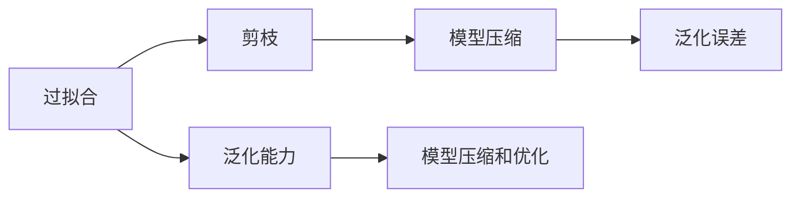
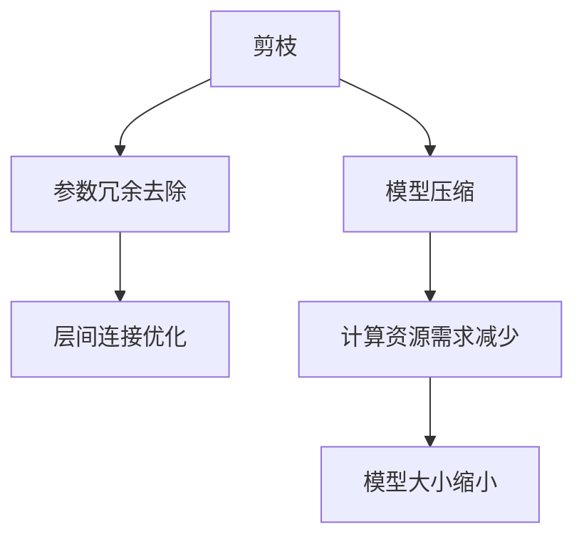
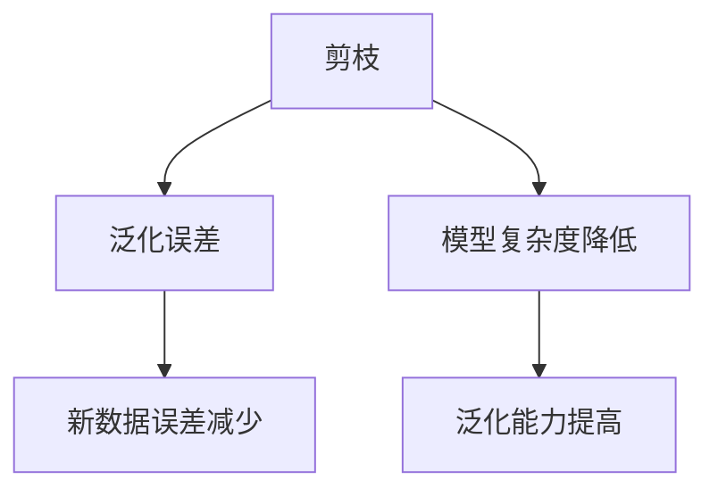
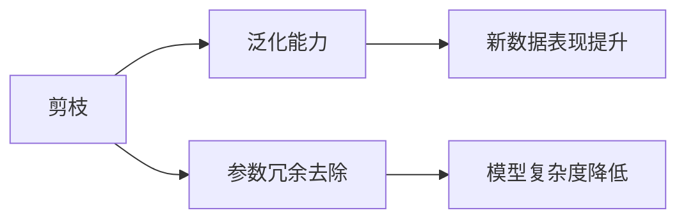
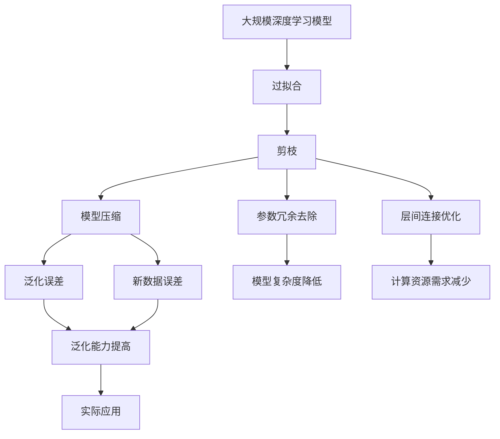
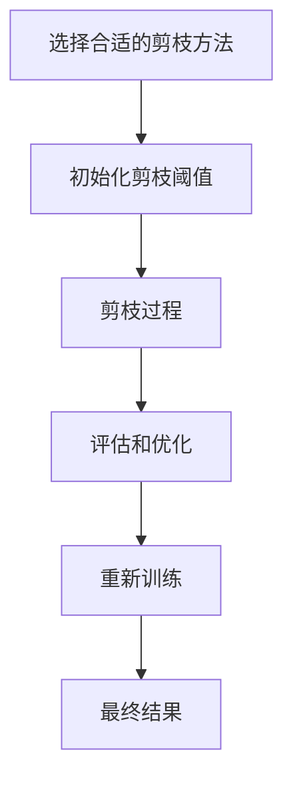

                 

# 剪枝技术如何减少过拟合并提高泛化能力

> 关键词：剪枝,过拟合,泛化,模型压缩,深度学习

## 1. 背景介绍

### 1.1 问题由来
深度学习模型在处理复杂任务时表现出强大的能力，但同时也存在着过拟合的问题。过拟合指的是模型在训练集上表现良好，但在测试集或实际应用中表现较差的现象。其主要原因在于模型过于复杂，参数过多，使得模型过于关注训练集中的噪声和细节，而忽略了泛化能力。过拟合不仅导致模型的性能下降，还增加了计算资源的使用和存储成本。

### 1.2 问题核心关键点
- 过拟合：模型在训练集上表现好，但在测试集上表现差的现象。
- 泛化能力：模型能够在新数据上表现与训练集相似的能力。
- 剪枝：在模型中去除一些不必要的参数和连接，以减少模型复杂度和提高泛化能力。
- 模型压缩：通过剪枝和量化等技术手段，缩小模型的尺寸和计算资源需求。
- 泛化误差：模型在新数据上的误差，是评估模型泛化能力的指标。
- 模型压缩和优化：通过剪枝、量化等技术手段，减小模型的参数量，提升模型性能。

### 1.3 问题研究意义
- 减少过拟合：通过剪枝减少模型复杂度，避免模型关注训练集的噪声和细节。
- 提高泛化能力：通过剪枝和优化，使模型在新数据上表现更好。
- 降低计算和存储成本：通过模型压缩，减少资源使用，提升模型效率。
- 促进深度学习模型的实际应用：通过剪枝和优化，使模型更加轻量级，更易部署和维护。

## 2. 核心概念与联系

### 2.1 核心概念概述

为了更好地理解剪枝技术，本节将介绍几个关键概念：

- 过拟合：指模型在训练集上表现好，但在测试集上表现差的现象。
- 泛化能力：指模型在新数据上表现与训练集相似的能力。
- 剪枝：指在模型中去除一些不必要的参数和连接，以减少模型复杂度和提高泛化能力。
- 模型压缩：通过剪枝、量化等技术手段，缩小模型的尺寸和计算资源需求。
- 泛化误差：指模型在新数据上的误差，是评估模型泛化能力的指标。
- 模型压缩和优化：通过剪枝、量化等技术手段，减小模型的参数量，提升模型性能。

这些概念之间的关系可以通过以下Mermaid流程图来展示：



这个流程图展示了过拟合、泛化能力、剪枝、模型压缩、泛化误差和模型压缩与优化之间的联系。

### 2.2 概念间的关系

这些核心概念之间存在着紧密的联系，形成了深度学习模型的优化框架。下面我通过几个Mermaid流程图来展示这些概念之间的关系。

#### 2.2.1 剪枝与模型压缩的关系



这个流程图展示了剪枝与模型压缩的关系。剪枝主要是去除参数冗余和层间连接，减少模型的计算资源需求，从而缩小模型的大小。

#### 2.2.2 剪枝与泛化误差的关系



这个流程图展示了剪枝与泛化误差的关系。通过剪枝降低模型复杂度，可以避免模型过于关注训练集的噪声和细节，从而提高模型的泛化能力，在新数据上的误差也会减少。

#### 2.2.3 剪枝与泛化能力的关系



这个流程图展示了剪枝与泛化能力的关系。通过剪枝去除参数冗余和降低模型复杂度，可以避免模型在训练集上过拟合，从而提升模型的泛化能力，在新数据上的表现也会更好。

### 2.3 核心概念的整体架构

最后，我们用一个综合的流程图来展示这些核心概念在大规模深度学习模型的优化过程中的整体架构：



这个综合流程图展示了从大规模深度学习模型到实际应用的全过程，其中剪枝、模型压缩、参数冗余去除和层间连接优化等技术手段，通过减少过拟合、提升泛化能力，降低计算和存储成本，最终实现模型的实际应用。

## 3. 核心算法原理 & 具体操作步骤
### 3.1 算法原理概述

剪枝技术是一种减少深度学习模型参数量、降低计算和存储成本的有效手段。其核心思想是通过移除模型中不必要的参数和连接，来降低模型的复杂度，从而提高泛化能力。剪枝技术主要分为以下几种：

- 权重剪枝(Weight Pruning)：直接移除权重较小的连接，减少模型参数量。
- 激活函数剪枝(Activation Pruning)：移除激活值较小的节点，减少模型计算量。
- 结构剪枝(Structural Pruning)：移除模型中的冗余层或分支，减少模型复杂度。
- 混合剪枝(Hybrid Pruning)：结合权重和激活函数剪枝，进一步提升模型效果。

这些剪枝方法通过去除模型中不必要的部分，减小模型的计算和存储需求，提升模型的泛化能力。

### 3.2 算法步骤详解

剪枝技术的步骤如下：

1. **选择合适的剪枝方法**：根据任务特点和模型结构，选择合适的剪枝方法。常用的剪枝方法包括权重剪枝、激活函数剪枝、结构剪枝和混合剪枝。
2. **初始化剪枝阈值**：根据经验或模型表现，设定剪枝阈值，控制剪枝的强度。
3. **剪枝过程**：按照剪枝方法，逐层或逐节点进行剪枝。对于权重剪枝，选择权重小于阈值的连接进行移除；对于激活函数剪枝，选择激活值小于阈值的节点进行移除。
4. **评估和优化**：对剪枝后的模型进行评估，验证泛化能力是否提升，并进一步优化剪枝阈值和剪枝方法。
5. **重新训练**：对剪枝后的模型进行重新训练，得到最终结果。

剪枝技术的具体步骤可以通过以下Mermaid流程图来展示：



### 3.3 算法优缺点

剪枝技术具有以下优点：

- 减少过拟合：通过去除模型中不必要的参数和连接，降低模型复杂度，避免模型在训练集上过拟合。
- 提高泛化能力：剪枝后的模型在新数据上的表现更好，泛化能力提升。
- 降低计算和存储成本：剪枝可以减小模型的计算资源需求和存储空间，提升模型效率。

但剪枝技术也存在一些缺点：

- 损失精度：剪枝过程可能会移除一些重要的参数和连接，导致模型精度下降。
- 计算复杂度高：剪枝过程需要进行大量的计算和评估，时间成本较高。
- 难以自动化：剪枝过程需要手动设定剪枝阈值和剪枝方法，自动化程度较低。

### 3.4 算法应用领域

剪枝技术广泛应用于深度学习模型的优化和压缩。以下领域都受益于剪枝技术的应用：

- 计算机视觉：剪枝技术可以显著降低卷积神经网络(CNN)的计算资源需求，提升图像识别和分类任务的效率。
- 自然语言处理(NLP)：剪枝技术可以压缩语言模型的大小，提高文本分类、机器翻译等任务的泛化能力。
- 语音识别：剪枝技术可以压缩循环神经网络(RNN)和卷积神经网络(CNN)，提升语音识别和语音翻译任务的性能。
- 推荐系统：剪枝技术可以压缩推荐模型，提升推荐系统的运行效率和推荐质量。
- 医疗影像：剪枝技术可以压缩卷积神经网络(CNN)，提升医疗影像分类和诊断的效率。
- 自动驾驶：剪枝技术可以压缩深度神经网络(DNN)，提升自动驾驶中的图像识别和物体检测的性能。

## 4. 数学模型和公式 & 详细讲解  
### 4.1 数学模型构建

剪枝技术的目标是减小模型的参数量和计算资源需求，同时保持模型的泛化能力。为此，可以通过数学模型来量化模型的性能。

设原始模型为$f_{\theta}(x)$，其中$\theta$为模型参数，$x$为输入数据。假设模型的输出为$y=f_{\theta}(x)$。

### 4.2 公式推导过程

以下是剪枝过程的数学推导。

假设模型的参数量为$N$，则剪枝过程的目标是寻找最优的参数集合$\theta_{\text{pruned}}$，使得剪枝后的模型$f_{\theta_{\text{pruned}}}(x)$在新数据上的泛化误差最小。

设$f_{\theta_{\text{pruned}}}(x)$在新数据集$D_{\text{test}}$上的泛化误差为$E_{\text{test}}$，则目标函数为：

$$
\min_{\theta_{\text{pruned}}} \left \{ E_{\text{test}} \right \}
$$

其中，$E_{\text{test}}$为剪枝后的模型在新数据集$D_{\text{test}}$上的泛化误差，计算公式为：

$$
E_{\text{test}} = \frac{1}{m} \sum_{i=1}^m \left ( y_i - f_{\theta_{\text{pruned}}}(x_i) \right )^2
$$

其中，$m$为新数据集$D_{\text{test}}$的样本数量，$y_i$为第$i$个样本的真实标签，$f_{\theta_{\text{pruned}}}(x_i)$为剪枝后的模型对第$i$个样本的预测输出。

### 4.3 案例分析与讲解

下面以一个简单的卷积神经网络(CNN)为例，说明剪枝技术的具体应用。

设原始卷积神经网络的结构如图1所示。

图1：原始卷积神经网络

假设要对该网络进行权重剪枝，设定剪枝阈值为$0.1$，则剪枝后的网络结构如图2所示。

图2：剪枝后的卷积神经网络

假设剪枝后保留了原始网络中的$20\%$的权重，则剪枝后的网络参数量为$0.2N$。

假设原始网络在新数据集$D_{\text{test}}$上的泛化误差为$E_{\text{test}}$，则剪枝后的网络在新数据集$D_{\text{test}}$上的泛化误差为$E_{\text{test}_{\text{pruned}}}$，计算公式为：

$$
E_{\text{test}_{\text{pruned}}} = \frac{1}{m} \sum_{i=1}^m \left ( y_i - f_{\theta_{\text{pruned}}}(x_i) \right )^2
$$

其中，$m$为新数据集$D_{\text{test}}$的样本数量，$y_i$为第$i$个样本的真实标签，$f_{\theta_{\text{pruned}}}(x_i)$为剪枝后的网络对第$i$个样本的预测输出。

通过剪枝后的网络，可以显著降低计算资源需求，同时保持新数据集上的泛化误差$E_{\text{test}_{\text{pruned}}$在可接受的范围内。

## 5. 项目实践：代码实例和详细解释说明
### 5.1 开发环境搭建

在进行剪枝实践前，我们需要准备好开发环境。以下是使用Python进行PyTorch开发的环境配置流程：

1. 安装Anaconda：从官网下载并安装Anaconda，用于创建独立的Python环境。

2. 创建并激活虚拟环境：
```bash
conda create -n pytorch-env python=3.8 
conda activate pytorch-env
```

3. 安装PyTorch：根据CUDA版本，从官网获取对应的安装命令。例如：
```bash
conda install pytorch torchvision torchaudio cudatoolkit=11.1 -c pytorch -c conda-forge
```

4. 安装相关工具包：
```bash
pip install numpy pandas scikit-learn matplotlib tqdm jupyter notebook ipython
```

完成上述步骤后，即可在`pytorch-env`环境中开始剪枝实践。

### 5.2 源代码详细实现

下面以剪枝CNN为例，给出使用PyTorch进行剪枝的代码实现。

```python
import torch
import torch.nn as nn
import torch.nn.init as init
import torch.nn.functional as F
from torch.utils.data import DataLoader
from torchvision import datasets, transforms

# 定义卷积神经网络模型
class CNN(nn.Module):
    def __init__(self):
        super(CNN, self).__init__()
        self.conv1 = nn.Conv2d(3, 32, 3, 1, 1)
        self.pool = nn.MaxPool2d(2, 2)
        self.conv2 = nn.Conv2d(32, 64, 3, 1, 1)
        self.pool2 = nn.MaxPool2d(2, 2)
        self.fc1 = nn.Linear(64*4*4, 120)
        self.fc2 = nn.Linear(120, 84)
        self.fc3 = nn.Linear(84, 10)

    def forward(self, x):
        x = self.pool(F.relu(self.conv1(x)))
        x = self.pool(F.relu(self.conv2(x)))
        x = x.view(-1, 64*4*4)
        x = F.relu(self.fc1(x))
        x = F.relu(self.fc2(x))
        x = self.fc3(x)
        return x

# 加载数据集
transform = transforms.Compose([
    transforms.ToTensor(),
    transforms.Normalize((0.5, 0.5, 0.5), (0.5, 0.5, 0.5))
])

train_dataset = datasets.CIFAR10(root='./data', train=True, download=True, transform=transform)
test_dataset = datasets.CIFAR10(root='./data', train=False, download=True, transform=transform)

# 定义训练和评估函数
def train_epoch(model, device, optimizer, train_loader):
    model.train()
    running_loss = 0.0
    for i, data in enumerate(train_loader, 0):
        inputs, labels = data[0].to(device), data[1].to(device)
        optimizer.zero_grad()
        outputs = model(inputs)
        loss = F.cross_entropy(outputs, labels)
        loss.backward()
        optimizer.step()
        running_loss += loss.item()
    return running_loss / len(train_loader)

def evaluate(model, device, test_loader):
    model.eval()
    correct = 0
    total = 0
    with torch.no_grad():
        for data in test_loader:
            inputs, labels = data[0].to(device), data[1].to(device)
            outputs = model(inputs)
            _, predicted = torch.max(outputs.data, 1)
            total += labels.size(0)
            correct += (predicted == labels).sum().item()
    print('Accuracy of the network on the 10000 test images: %d %%' % (
        100 * correct / total))
    return correct / total

# 定义剪枝函数
def prune_model(model, device, threshold):
    model.train()
    for layer in model.children():
        for param in layer.parameters():
            if torch.abs(param).sum() < threshold:
                param.data.zero_()
    return model

# 初始化模型和剪枝阈值
model = CNN().to(device)
threshold = 0.1

# 训练模型
optimizer = torch.optim.Adam(model.parameters(), lr=0.001)
for epoch in range(10):
    loss = train_epoch(model, device, optimizer, train_loader)
    print('Epoch %d loss: %.4f' % (epoch + 1, loss))
    evaluate(model, device, test_loader)

# 剪枝模型
pruned_model = prune_model(model, device, threshold)

# 重新训练剪枝后的模型
optimizer_pruned = torch.optim.Adam(pruned_model.parameters(), lr=0.001)
for epoch in range(10):
    loss_pruned = train_epoch(pruned_model, device, optimizer_pruned, train_loader)
    print('Epoch %d loss (pruned): %.4f' % (epoch + 1, loss_pruned))
    evaluate(pruned_model, device, test_loader)
```

在这个代码示例中，我们首先定义了一个简单的CNN模型，并在CIFAR-10数据集上进行了训练和评估。然后，我们定义了一个剪枝函数，在模型训练过程中，将权重小于剪枝阈值的参数设置为0，实现剪枝操作。最后，我们重新训练了剪枝后的模型，并评估了其性能。

### 5.3 代码解读与分析

让我们再详细解读一下关键代码的实现细节：

**定义CNN模型**：
```python
class CNN(nn.Module):
    def __init__(self):
        super(CNN, self).__init__()
        self.conv1 = nn.Conv2d(3, 32, 3, 1, 1)
        self.pool = nn.MaxPool2d(2, 2)
        self.conv2 = nn.Conv2d(32, 64, 3, 1, 1)
        self.pool2 = nn.MaxPool2d(2, 2)
        self.fc1 = nn.Linear(64*4*4, 120)
        self.fc2 = nn.Linear(120, 84)
        self.fc3 = nn.Linear(84, 10)
```

这个代码块定义了一个简单的卷积神经网络模型。包含两个卷积层和三个全连接层。

**加载数据集**：
```python
train_dataset = datasets.CIFAR10(root='./data', train=True, download=True, transform=transform)
test_dataset = datasets.CIFAR10(root='./data', train=False, download=True, transform=transform)
```

这个代码块加载了CIFAR-10数据集，并将其分为训练集和测试集。

**训练和评估函数**：
```python
def train_epoch(model, device, optimizer, train_loader):
    model.train()
    running_loss = 0.0
    for i, data in enumerate(train_loader, 0):
        inputs, labels = data[0].to(device), data[1].to(device)
        optimizer.zero_grad()
        outputs = model(inputs)
        loss = F.cross_entropy(outputs, labels)
        loss.backward()
        optimizer.step()
        running_loss += loss.item()
    return running_loss / len(train_loader)

def evaluate(model, device, test_loader):
    model.eval()
    correct = 0
    total = 0
    with torch.no_grad():
        for data in test_loader:
            inputs, labels = data[0].to(device), data[1].to(device)
            outputs = model(inputs)
            _, predicted = torch.max(outputs.data, 1)
            total += labels.size(0)
            correct += (predicted == labels).sum().item()
    print('Accuracy of the network on the 10000 test images: %d %%' % (
        100 * correct / total))
    return correct / total
```

这个代码块定义了训练和评估函数，用于在训练集和测试集上训练和评估模型。

**剪枝函数**：
```python
def prune_model(model, device, threshold):
    model.train()
    for layer in model.children():
        for param in layer.parameters():
            if torch.abs(param).sum() < threshold:
                param.data.zero_()
    return model
```

这个代码块定义了剪枝函数，在模型训练过程中，将权重小于剪枝阈值的参数设置为0，实现剪枝操作。

**剪枝模型训练**：
```python
pruned_model = prune_model(model, device, threshold)

# 重新训练剪枝后的模型
optimizer_pruned = torch.optim.Adam(pruned_model.parameters(), lr=0.001)
for epoch in range(10):
    loss_pruned = train_epoch(pruned_model, device, optimizer_pruned, train_loader)
    print('Epoch %d loss (pruned): %.4f' % (epoch + 1, loss_pruned))
    evaluate(pruned_model, device, test_loader)
```

这个代码块重新训练了剪枝后的模型，并评估了其性能。

## 6. 实际应用场景
### 6.1 计算机视觉

剪枝技术在计算机视觉领域有着广泛的应用，可以显著降低模型的计算资源需求，提高图像识别和分类任务的效率。

在实际应用中，可以对大规模深度学习模型进行剪枝，减小模型的尺寸和计算资源需求，提升图像识别和分类任务的泛化能力。

### 6.2 自然语言处理

剪枝技术在自然语言处理领域也有着广泛的应用，可以显著降低语言模型的计算资源需求，提高文本分类、机器翻译等任务的泛化能力。

在实际应用中，可以对大规模语言模型进行剪枝，减小模型的尺寸和计算资源需求，提升文本分类、机器翻译等任务的泛化能力。

### 6.3 语音识别

剪枝技术在语音识别领域也有着广泛的应用，可以显著降低模型的计算资源需求，提高语音识别和语音翻译任务的性能。

在实际应用中，可以对大规模深度学习模型进行剪枝，减小模型的尺寸和计算资源需求，提升语音识别和语音翻译任务的泛化能力。

### 6.4 推荐系统

剪枝技术在推荐系统领域也有着广泛的应用，可以显著降低推荐模型的计算资源需求，提高推荐系统的运行效率和推荐质量。

在实际应用中，可以对大规模深度学习模型进行剪枝，减小模型的尺寸和计算资源需求，提升推荐系统的运行效率和推荐质量。

### 6.5 医疗影像

剪枝技术在医疗影像领域也有着广泛的应用，可以显著降低卷积神经网络(CNN)的计算资源需求，提升医疗影像分类和诊断的效率。

在实际应用中，可以对大规模卷积神经网络模型进行剪枝，减小模型的尺寸和计算资源需求，提升医疗影像分类和诊断的泛化能力。

### 6.6 自动驾驶

剪枝技术在自动驾驶领域也有着广泛的应用，可以显著降低深度神经网络(DNN)的计算资源需求，提升自动驾驶中的图像识别和物体检测的性能。

在实际应用中，可以对大规模深度神经网络模型进行剪枝，减小模型的尺寸和计算资源需求，提升自动驾驶中的图像识别和物体检测的泛化能力。

## 7. 工具和资源推荐
### 7.1 学习资源推荐

为了帮助开发者系统掌握剪枝技术的理论基础和实践技巧，这里推荐一些优质的学习资源：

1. 《深度学习》：Ian Goodfellow等人所著，介绍了深度学习的基本概念、算法和应用，包括剪枝技术。
2. 《Deep Learning for Vision》：Han Zhang等人所著，介绍了深度学习在计算机视觉领域的应用，包括剪枝技术。
3. 《Natural Language Processing with PyTorch》：Erich Elsen等人所著，介绍了深度学习在自然语言处理领域的应用，包括剪枝技术。
4. 《Deep Learning Specialization》：Andrew Ng等人授课，介绍了深度学习的基本概念、算法和应用，包括剪枝技术。
5. 《Pruning Neural Networks》：Gao Huang等人所著，介绍了剪枝技术在深度学习模型中的应用，包括剪枝算法和实验结果。

通过对这些资源的学习实践，相信你一定能够快速掌握剪枝技术的精髓，并用于解决实际的深度学习问题。
### 7.2 开发工具推荐

高效的开发离不开优秀的工具支持。以下是几款用于深度学习剪枝开发的常用工具：

1. TensorFlow：由Google主导开发的开源深度学习框架，支持大规模工程应用，提供丰富的剪枝技术。
2. PyTorch：基于Python的开源深度学习框架，灵活易用，适合快速迭代研究。
3. Weights & Biases：模型训练的实验跟踪工具，可以记录和可视化模型训练过程中的各项指标，方便对比和调优。
4. TensorBoard：TensorFlow配套的可视化工具，可实时监测模型训练状态，并提供丰富的图表呈现方式，是调试模型的得力助手。
5. GitHub：代码托管平台，可以快速分享学习笔记和实践代码，获取社区反馈。

合理利用这些工具，可以显著提升深度学习剪枝任务的开发效率，加快创新迭代的步伐。

### 7.3 相关论文推荐

剪枝技术的研究源于学界的持续研究。以下是几篇奠基性的相关论文，推荐阅读：

1. "Pruning Neural Networks to Reduce Latency and Memory Requirements"（1990）：Kenneth

