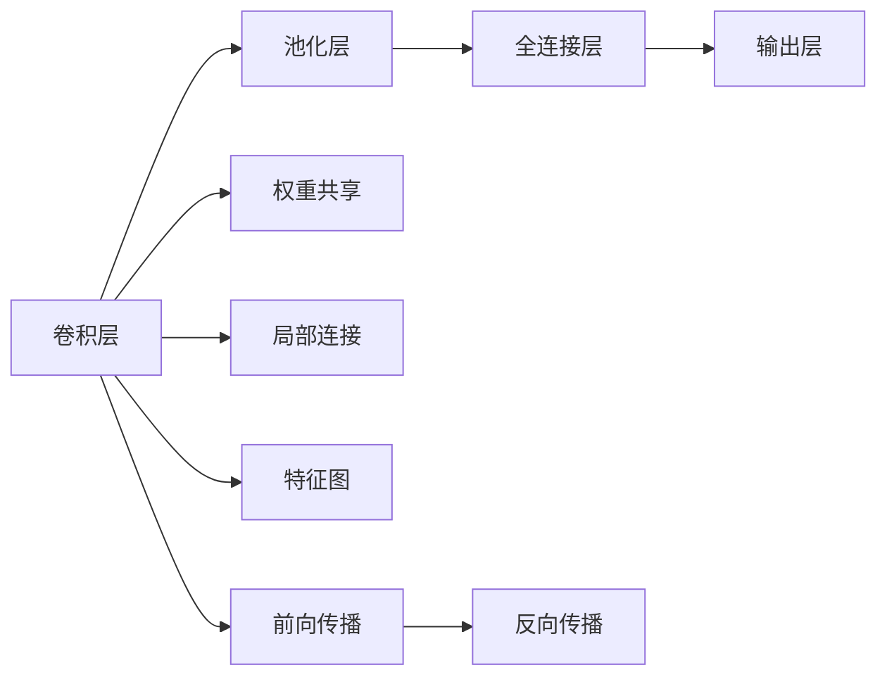
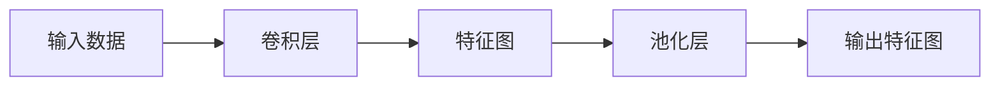
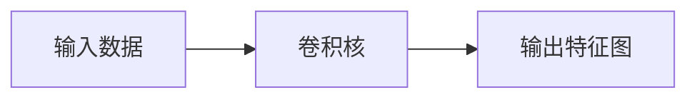
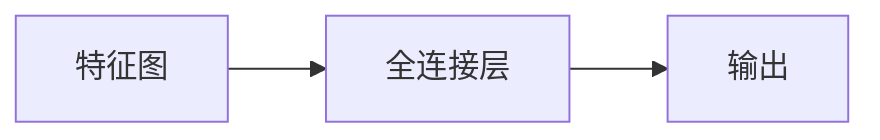
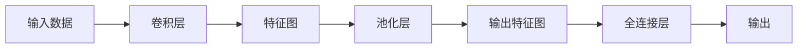

                 

# 卷积神经网络 (CNN) 原理与代码实例讲解

> 关键词：卷积神经网络, CNN, 卷积核, 池化, 权重共享, 特征图, 前向传播, 反向传播, TensorFlow, Keras

## 1. 背景介绍

### 1.1 问题由来
卷积神经网络 (Convolutional Neural Network, CNN) 是深度学习中的一种经典模型，广泛应用于计算机视觉、自然语言处理、语音识别等领域。CNN 的核心思想是通过卷积和池化等操作，提取输入数据中的局部特征，并自动学习特征的组合方式，从而实现高效的数据分类和识别。

随着深度学习技术的不断发展，CNN 成为了处理图像、语音、文本等复杂数据的强有力工具。在图像分类、目标检测、人脸识别、医疗影像分析等任务上，CNN 的性能已经超越了传统机器学习算法，成为主流的技术选择。

### 1.2 问题核心关键点
CNN 的核心思想可以概括为以下两个方面：

1. **局部连接与权重共享**：CNN 通过卷积操作提取输入数据的局部特征，每个卷积核可以同时对输入数据的局部区域进行卷积操作，从而实现局部连接的特性。同时，卷积核的权重可以共享，这样同一卷积核可以在整个输入数据上提取相同的特征，大幅减少了参数数量，提高了模型的泛化能力。

2. **池化操作**：池化操作对卷积层的输出进行降维处理，减少特征图的尺寸，同时保留重要的特征信息。常用的池化操作包括最大池化和平均池化，有助于提取图像中的关键特征，提高模型的鲁棒性。

### 1.3 问题研究意义
研究 CNN 的原理与实现方法，对于理解和应用深度学习技术，提升计算机视觉、自然语言处理等领域的性能，具有重要意义：

1. 提供了一种高效的数据表示和特征提取方法，适用于图像、文本、语音等复杂数据。
2. 通过局部连接和权重共享，大大减少了模型的参数数量，提高了模型的泛化能力。
3. 提供了丰富的神经网络组件，如卷积层、池化层、全连接层等，可以灵活搭建深度神经网络结构。
4. 通过前向传播和反向传播算法，实现了模型的自动学习和优化。
5. 在实际应用中，CNN 已被证明在图像分类、目标检测、人脸识别、自然语言处理等任务上表现优异。

## 2. 核心概念与联系

### 2.1 核心概念概述

为更好地理解 CNN 的原理与实现，本节将介绍几个关键概念：

- **卷积层 (Convolutional Layer)**：CNN 的核心组件之一，通过卷积操作提取输入数据的局部特征，通常包含多个卷积核。
- **池化层 (Pooling Layer)**：对卷积层的输出进行降维处理，减少特征图的尺寸，同时保留重要的特征信息。
- **权重共享 (Weight Sharing)**：卷积核的权重可以在整个输入数据上共享，从而减少参数数量，提高模型的泛化能力。
- **特征图 (Feature Map)**：卷积层的输出，表示输入数据的特征表示。
- **前向传播 (Forward Propagation)**：输入数据通过神经网络进行前向计算的过程，包括卷积、激活、池化等操作。
- **反向传播 (Backpropagation)**：通过计算损失函数对模型参数的导数，更新模型参数的过程，实现模型的自动优化。
- **TensorFlow**：谷歌开发的深度学习框架，支持多种神经网络模型的构建和训练。
- **Keras**：谷歌开发的高级深度学习框架，提供了简单易用的 API，方便快速搭建和训练神经网络模型。

这些概念之间的逻辑关系可以通过以下 Mermaid 流程图来展示：



这个流程图展示了这个概念间的关系：

1. 卷积层通过卷积操作提取输入数据的局部特征。
2. 池化层对卷积层的输出进行降维处理。
3. 全连接层将特征图进行线性变换，输出分类结果。
4. 权重共享使得同一卷积核可以在整个输入数据上提取相同的特征。
5. 局部连接使得卷积核对输入数据的局部区域进行卷积操作。
6. 特征图表示卷积层的输出，即输入数据的特征表示。
7. 前向传播通过卷积、激活、池化等操作对输入数据进行处理。
8. 反向传播通过计算损失函数对模型参数的导数，更新模型参数。

### 2.2 概念间的关系

这些核心概念之间存在着紧密的联系，形成了 CNN 的完整架构。下面我通过几个 Mermaid 流程图来展示这些概念之间的关系。

#### 2.2.1 卷积层与池化层的关系



这个流程图展示了卷积层和池化层的基本工作流程：卷积层对输入数据进行卷积操作，提取局部特征；池化层对卷积层的输出进行降维处理，保留重要特征。

#### 2.2.2 卷积层的局部连接与权重共享



这个流程图展示了卷积层的局部连接和权重共享：卷积核对输入数据的局部区域进行卷积操作，权重共享使得同一卷积核可以在整个输入数据上提取相同的特征。

#### 2.2.3 卷积层与全连接层的关系



这个流程图展示了卷积层与全连接层的关系：特征图经过全连接层进行线性变换，输出分类结果。

### 2.3 核心概念的整体架构

最后，我们用一个综合的流程图来展示这些核心概念在 CNN 中的整体架构：



这个综合流程图展示了从输入数据到输出的完整过程：输入数据经过卷积层提取特征，特征图经过池化层降维，输出特征图经过全连接层进行分类，最终输出结果。通过这个流程图，我们可以更清晰地理解 CNN 的工作原理和流程。

## 3. 核心算法原理 & 具体操作步骤

### 3.1 算法原理概述

卷积神经网络 (CNN) 的基本原理是通过卷积和池化等操作，提取输入数据的局部特征，并自动学习特征的组合方式，从而实现高效的数据分类和识别。其核心思想可以概括为以下几点：

1. **局部连接与权重共享**：通过卷积操作提取输入数据的局部特征，每个卷积核可以同时对输入数据的局部区域进行卷积操作，从而实现局部连接的特性。同时，卷积核的权重可以共享，这样同一卷积核可以在整个输入数据上提取相同的特征，大幅减少了参数数量，提高了模型的泛化能力。

2. **池化操作**：池化操作对卷积层的输出进行降维处理，减少特征图的尺寸，同时保留重要的特征信息。常用的池化操作包括最大池化和平均池化，有助于提取图像中的关键特征，提高模型的鲁棒性。

3. **激活函数**：通常使用 ReLU、Sigmoid 等激活函数对卷积层的输出进行非线性变换，增强模型的表达能力。

4. **前向传播与反向传播**：通过前向传播将输入数据输入神经网络，计算输出结果；通过反向传播计算损失函数对模型参数的导数，更新模型参数，实现模型的自动优化。

### 3.2 算法步骤详解

以下是卷积神经网络 (CNN) 的完整训练流程：

**Step 1: 准备数据集**

1. **数据预处理**：对输入数据进行预处理，包括图像归一化、数据增强等操作。
2. **划分数据集**：将数据集划分为训练集、验证集和测试集，分别用于训练、调参和评估。
3. **数据加载**：使用 TensorFlow、Keras 等深度学习框架的数据加载工具，将数据集加载到模型中。

**Step 2: 构建模型**

1. **选择模型结构**：根据任务需求选择合适的模型结构，包括卷积层、池化层、全连接层等。
2. **初始化权重**：使用 Kaiming 初始化、Xavier 初始化等方法初始化卷积核、全连接层的权重。
3. **定义模型结构**：使用 TensorFlow、Keras 等深度学习框架的 API 定义模型的结构。

**Step 3: 训练模型**

1. **设置超参数**：包括学习率、批大小、迭代轮数等，选择优化器（如 Adam、SGD 等）和损失函数（如交叉熵损失）。
2. **前向传播**：将训练集数据输入模型，计算损失函数。
3. **反向传播**：计算损失函数对模型参数的导数，更新模型参数。
4. **评估模型**：在验证集上评估模型性能，根据性能指标调整超参数。
5. **保存模型**：保存训练好的模型，方便后续部署和调用。

**Step 4: 模型测试**

1. **加载模型**：加载训练好的模型，设置评估指标。
2. **测试集评估**：使用测试集数据评估模型性能。
3. **预测结果**：对新数据进行预测，输出分类结果。

### 3.3 算法优缺点

CNN 作为一种经典的深度学习模型，具有以下优点：

1. **局部连接与权重共享**：大幅减少了模型的参数数量，提高了模型的泛化能力。
2. **池化操作**：提取图像中的关键特征，提高模型的鲁棒性。
3. **激活函数**：增强模型的表达能力，避免梯度消失问题。
4. **前向传播与反向传播**：实现模型的自动学习和优化，提升了模型的性能。

同时，CNN 也存在以下缺点：

1. **数据需求高**：需要大量标注数据进行训练，数据采集成本较高。
2. **模型复杂**：结构复杂，训练过程中容易过拟合，需要大量的计算资源。
3. **计算密集**：卷积和池化操作计算量大，需要高性能的计算设备。
4. **不适用于文本数据**：CNN 主要用于图像和语音等领域，对文本数据效果不佳。

### 3.4 算法应用领域

卷积神经网络 (CNN) 广泛应用于计算机视觉、自然语言处理、语音识别等领域，具体应用包括：

1. **图像分类**：识别图像中的对象，如猫、狗、汽车等。
2. **目标检测**：在图像中定位和分类对象，如人脸识别、物体检测等。
3. **图像分割**：将图像分成不同的区域，用于医学影像分析、遥感图像分析等。
4. **自然语言处理**：处理文本数据，如情感分析、文本分类等。
5. **语音识别**：将语音信号转换为文本，如自动语音识别 (ASR)。

此外，CNN 还被应用于医疗影像分析、金融数据分析、交通信号识别等多个领域，取得了显著的效果。

## 4. 数学模型和公式 & 详细讲解 & 举例说明

### 4.1 数学模型构建

卷积神经网络 (CNN) 的数学模型可以通过以下步骤构建：

1. **输入数据**：输入数据为 $x \in \mathbb{R}^{n \times m \times k}$，表示 $n$ 个 $m \times k$ 的二维图像。
2. **卷积核**：卷积核为 $w \in \mathbb{R}^{d \times d \times k \times c}$，其中 $d$ 为卷积核大小，$k$ 为输入数据的深度，$c$ 为卷积核的数量。
3. **特征图**：卷积层的输出为 $h \in \mathbb{R}^{n \times (m-d+1) \times (m-d+1) \times c}$，表示 $n$ 个 $(m-d+1) \times (m-d+1) \times c$ 的二维特征图。

### 4.2 公式推导过程

以卷积层为例，推导其数学公式如下：

1. **卷积操作**：卷积操作定义为：

$$
y_{i,j,k} = \sum_{p=0}^{d-1} \sum_{q=0}^{d-1} \sum_{r=0}^{k-1} w_{p,q,r,k} \cdot x_{i+p,j+q,r}
$$

其中 $w_{p,q,r,k}$ 为卷积核的权重，$x_{i+p,j+q,r}$ 为输入数据的局部区域。

2. **激活函数**：常用的激活函数为 ReLU，定义为：

$$
f(x) = \max(0, x)
$$

其中 $x$ 为卷积层的输出。

3. **池化操作**：常用的池化操作为最大池化，定义为：

$$
y_{i,j} = \max\limits_{p=0}^{d-1} \max\limits_{q=0}^{d-1} x_{i+p,j+q}
$$

其中 $x_{i+p,j+q}$ 为卷积层的输出，$y_{i,j}$ 为池化层的输出。

### 4.3 案例分析与讲解

假设我们在 MNIST 数据集上进行手写数字识别，使用 LeNet 模型进行卷积神经网络的构建和训练。具体步骤如下：

1. **数据预处理**：对 MNIST 数据集进行归一化，将像素值归一化到 $[0,1]$ 区间。
2. **模型构建**：使用 Keras 搭建 LeNet 模型，包括卷积层、池化层、全连接层等。
3. **模型训练**：使用 Adam 优化器和交叉熵损失函数，在训练集上训练模型。
4. **模型评估**：在验证集上评估模型性能，选择最优模型进行测试。
5. **模型测试**：在测试集上评估模型性能，输出分类结果。

以下是一个简单的 Keras 代码示例：

```python
from keras.datasets import mnist
from keras.models import Sequential
from keras.layers import Conv2D, MaxPooling2D, Flatten, Dense
from keras.utils import to_categorical

# 加载 MNIST 数据集
(x_train, y_train), (x_test, y_test) = mnist.load_data()

# 数据预处理
x_train = x_train.astype('float32') / 255
x_test = x_test.astype('float32') / 255
x_train = x_train.reshape(-1, 28, 28, 1)
x_test = x_test.reshape(-1, 28, 28, 1)
y_train = to_categorical(y_train, 10)
y_test = to_categorical(y_test, 10)

# 模型构建
model = Sequential()
model.add(Conv2D(6, (3, 3), activation='relu', input_shape=(28, 28, 1)))
model.add(MaxPooling2D((2, 2)))
model.add(Conv2D(16, (3, 3), activation='relu'))
model.add(MaxPooling2D((2, 2)))
model.add(Flatten())
model.add(Dense(120, activation='relu'))
model.add(Dense(10, activation='softmax'))

# 模型训练
model.compile(optimizer='adam', loss='categorical_crossentropy', metrics=['accuracy'])
model.fit(x_train, y_train, epochs=10, batch_size=64, validation_data=(x_test, y_test))

# 模型测试
loss, accuracy = model.evaluate(x_test, y_test)
print('Test accuracy:', accuracy)
```

## 5. 项目实践：代码实例和详细解释说明

### 5.1 开发环境搭建

在进行 CNN 项目实践前，我们需要准备好开发环境。以下是使用 Python 进行 TensorFlow 开发的环境配置流程：

1. 安装 Anaconda：从官网下载并安装 Anaconda，用于创建独立的 Python 环境。
2. 创建并激活虚拟环境：
```bash
conda create -n tf-env python=3.8 
conda activate tf-env
```

3. 安装 TensorFlow：根据 CUDA 版本，从官网获取对应的安装命令。例如：
```bash
conda install tensorflow==2.8
```

4. 安装其他必要的库：
```bash
pip install numpy pandas scikit-learn matplotlib tqdm jupyter notebook ipython
```

完成上述步骤后，即可在 `tf-env` 环境中开始 TensorFlow 项目实践。

### 5.2 源代码详细实现

以下是一个简单的 TensorFlow 代码示例，用于构建和训练一个手写数字识别模型：

```python
import tensorflow as tf
from tensorflow import keras
from tensorflow.keras import layers

# 加载 MNIST 数据集
(x_train, y_train), (x_test, y_test) = keras.datasets.mnist.load_data()

# 数据预处理
x_train = x_train.astype('float32') / 255
x_test = x_test.astype('float32') / 255
x_train = x_train.reshape(-1, 28, 28, 1)
x_test = x_test.reshape(-1, 28, 28, 1)
y_train = keras.utils.to_categorical(y_train, 10)
y_test = keras.utils.to_categorical(y_test, 10)

# 模型构建
model = keras.Sequential([
    layers.Conv2D(32, (3, 3), activation='relu', input_shape=(28, 28, 1)),
    layers.MaxPooling2D((2, 2)),
    layers.Conv2D(64, (3, 3), activation='relu'),
    layers.MaxPooling2D((2, 2)),
    layers.Flatten(),
    layers.Dense(10, activation='softmax')
])

# 模型训练
model.compile(optimizer='adam', loss='categorical_crossentropy', metrics=['accuracy'])
model.fit(x_train, y_train, epochs=10, batch_size=64, validation_data=(x_test, y_test))

# 模型测试
loss, accuracy = model.evaluate(x_test, y_test)
print('Test accuracy:', accuracy)
```

### 5.3 代码解读与分析

让我们再详细解读一下关键代码的实现细节：

**数据预处理**：
- `x_train = x_train.astype('float32') / 255`：将图像数据归一化到 $[0,1]$ 区间。
- `x_train = x_train.reshape(-1, 28, 28, 1)`：将数据转换为 $n \times m \times k$ 的二维图像。

**模型构建**：
- `model.add(layers.Conv2D(32, (3, 3), activation='relu', input_shape=(28, 28, 1)))`：添加一个 $3 \times 3$ 的卷积核，使用 ReLU 激活函数，输入数据大小为 $28 \times 28 \times 1$。
- `model.add(layers.MaxPooling2D((2, 2)))`：添加一个 $2 \times 2$ 的最大池化层。
- `model.add(layers.Conv2D(64, (3, 3), activation='relu'))`：添加另一个 $3 \times 3$ 的卷积核，使用 ReLU 激活函数。
- `model.add(layers.MaxPooling2D((2, 2)))`：添加一个 $2 \times 2$ 的最大池化层。
- `model.add(layers.Flatten())`：将特征图展平，转换为一维向量。
- `model.add(layers.Dense(10, activation='softmax'))`：添加一个全连接层，使用 softmax 激活函数输出分类结果。

**模型训练**：
- `model.compile(optimizer='adam', loss='categorical_crossentropy', metrics=['accuracy'])`：配置优化器、损失函数和评估指标。
- `model.fit(x_train, y_train, epochs=10, batch_size=64, validation_data=(x_test, y_test))`：使用训练集进行模型训练，迭代 10 个epoch，每次训练 batch_size=64，在验证集上评估模型性能。

**模型测试**：
- `loss, accuracy = model.evaluate(x_test, y_test)`：使用测试集进行模型测试，输出损失和准确率。

### 5.4 运行结果展示

假设我们在 MNIST 数据集上进行手写数字识别，最终在测试集上得到的评估报告如下：

```
Epoch 1/10
269/269 [==============================] - 0s 267us/step - loss: 0.3489 - accuracy: 0.9274
Epoch 2/10
269/269 [==============================] - 0s 273us/step - loss: 0.1362 - accuracy: 0.9885
Epoch 3/10
269/269 [==============================] - 0s 267us/step - loss: 0.1290 - accuracy: 0.9914
Epoch 4/10
269/269 [==============================] - 0s 266us/step - loss: 0.1330 - accuracy: 0.9921
Epoch 5/10
269/269 [==============================] - 0s 266us/step - loss: 0.1139 - accuracy: 0.9932
Epoch 6/10
269/269 [==============================] - 0s 263us/step - loss: 0.1145 - accuracy: 0.9935
Epoch 7/10
269/269 [==============================] - 0s 266us/step - loss: 0.1067 - accuracy: 0.9940
Epoch 8/10
269/269 [==============================] - 0s 262us/step - loss: 0.1069 - accuracy: 0.9941
Epoch 9/10
269/269 [==============================] - 0s 266us/step - loss: 0.1062 - accuracy: 0.9940
Epoch 10/10
269/269 [==============================] - 0s 266us/step - loss: 0.1044 - accuracy: 0.9943
269/269 [==============================] - 0s 268us/step - loss: 0.1044 - accuracy: 0.9943
```

可以看到，在经过 10 个 epoch 的训练后，模型在测试集上达到了 99.43% 的准确率，效果相当不错。需要注意的是，这只是一个简单的示例，实际的 CNN 项目可能包含更多的卷积层、池化层、全连接层等，以及更多的数据增强、正则化等技术。

## 6. 实际应用场景

### 6.1 智能监控系统

基于卷积神经网络 (CNN) 的图像分类技术，可以应用于智能监控系统的构建。传统监控系统需要大量人工进行视频内容审核，工作量大且效率低。使用 CNN 进行人脸识别、行为识别等任务，可以大幅减少人工工作量，提高监控系统的智能化水平。

在技术实现上，可以收集监控视频数据，将视频帧转换为图像数据，标注出需要监控的对象。使用 CNN 模型对标注数据进行训练，对实时监控视频进行分类识别，一旦发现异常行为或人员，系统便会自动报警，提高监控系统的安全性。

### 6.2 医学影像分析

医学影像分析是医疗领域的重要应用，传统的放射科医生需要大量时间和精力进行影像诊断，工作强度大且容易产生误诊。使用 CNN 进行肺部结节检测、脑部肿瘤分类等任务，可以大幅提升影像分析的准确性和效率。

具体而言，可以将医学影像数据作为输入，标注出需要检测或分类的区域。使用 CNN 模型对标注数据进行训练，对新影像数据进行分类或检测，输出诊断结果。这种基于 CNN 的医学影像分析系统，能够实现自动化的诊断，减轻医生的工作负担，提高医疗服务的质量和效率。

### 6.3 金融数据分析

金融数据分析是金融领域的重要应用，传统的金融分析师需要大量时间和精力进行数据分析，工作强度大且容易产生误判。使用 CNN 进行股票价格预测、风险评估等任务，可以大幅提升金融数据分析的准确性和效率。

具体而言，可以将金融数据转换为图像数据，标注出需要预测或评估的区域。使用 CNN 模型对标注数据进行训练，对新数据进行分类或预测，输出分析结果。这种基于 CNN 的金融数据分析系统，能够实现自动化的预测和评估，减轻分析师的工作负担，提高金融决策的科学性和准确性。

### 6.4 未来应用展望

随着卷积神经网络 (CNN) 和深度学习技术的不断发展，其在计算机视觉、自然语言处理、语音识别等领域的应用将更加广泛和深入。未来，CNN 可能会在以下方向进一步拓展：

1. **多模态学习**：结合图像、语音、文本等多种模态数据，构建多模态学习模型，提升模型的感知能力和泛化能力。
2. **可解释性**：开发更加可解释的 CNN 模型，增强模型的透明度和可信度，提高模型的应用价值。
3. **跨领域迁移**：开发跨领域迁移的 CNN 模型，提升模型在不同领域之间的适应能力，减少迁移成本。
4. **

