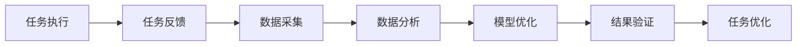
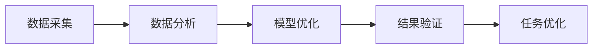
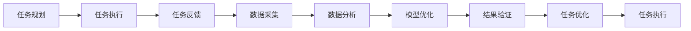

                 

# 反思和改进：提高任务质量

> 关键词：任务质量, 任务规划, 任务执行, 任务反馈, 数据采集, 数据分析, 模型优化, 结果验证

## 1. 背景介绍

### 1.1 问题由来
在当今快速变化的时代，企业面临着前所未有的挑战，如何有效地提高任务质量成为了一个关键问题。尤其是在数字化转型过程中，自动化任务和智能决策系统的普及，使得任务管理的复杂性显著增加。任务管理不仅是企业运营的基础，更是推动业务增长的重要驱动力。然而，如何确保任务能够高效、高质量地完成，是一个亟待解决的问题。

### 1.2 问题核心关键点
为了有效提高任务质量，企业需要从任务规划、执行、反馈等多个维度进行全面优化。具体包括以下几个关键点：
1. **任务规划**：明确任务目标，制定详细的执行计划，确保任务可执行性。
2. **任务执行**：选择合适的执行工具，合理分配资源，确保任务高效完成。
3. **任务反馈**：及时收集任务执行过程中的反馈信息，进行持续改进。
4. **数据采集与分析**：收集任务相关数据，进行分析，优化任务执行过程。
5. **模型优化**：使用先进的算法和技术，优化任务执行模型。
6. **结果验证**：对任务执行结果进行验证，确保满足预期。

### 1.3 问题研究意义
提高任务质量对于企业的运营效率、成本控制和客户满意度具有重要意义。通过提高任务质量，企业能够：
1. **提升运营效率**：减少任务执行的瓶颈，提高任务完成速度。
2. **降低运营成本**：减少因任务执行问题导致的资源浪费。
3. **提升客户满意度**：确保任务执行结果符合客户期望，增强客户忠诚度。
4. **加速业务创新**：通过优化任务管理，快速响应市场变化，推动业务创新。

## 2. 核心概念与联系

### 2.1 核心概念概述

为了更好地理解如何提高任务质量，我们首先介绍几个核心概念：

- **任务**：需要完成的一系列活动，通常包含明确的目标和执行步骤。
- **任务质量**：任务执行结果的优劣程度，包括执行速度、准确性、可靠性等方面。
- **任务规划**：确定任务目标、步骤和资源分配的过程。
- **任务执行**：按照既定计划执行任务的过程。
- **任务反馈**：在任务执行过程中收集的有关执行情况的信息。
- **数据采集**：从任务执行过程中收集各种数据的过程。
- **数据分析**：对采集的数据进行整理、分析的过程。
- **模型优化**：使用机器学习和数据分析技术，优化任务执行模型。

这些概念之间的关系可以通过以下Mermaid流程图来展示：


这个流程图展示了任务管理的基本流程：从任务规划到任务执行，再到任务反馈和数据采集，通过数据分析和模型优化，最终实现任务质量的提升。

### 2.2 概念间的关系

这些核心概念之间存在着紧密的联系，形成了任务管理的完整生态系统。下面我们通过几个Mermaid流程图来展示这些概念之间的关系。

#### 2.2.1 任务执行流程


这个流程图展示了任务执行的基本流程，从任务规划到任务执行，再到任务反馈和数据采集，通过数据分析和模型优化，最终实现任务质量的提升。

#### 2.2.2 任务反馈与数据采集的关系



这个流程图展示了任务反馈和数据采集的关系，从任务执行收集反馈信息，通过数据采集和数据分析，进行模型优化和结果验证，最终实现任务优化。

#### 2.2.3 模型优化与结果验证的关系



这个流程图展示了模型优化和结果验证的关系，通过数据分析进行模型优化，然后通过结果验证对优化后的模型进行验证，最终实现任务优化。

### 2.3 核心概念的整体架构

最后，我们用一个综合的流程图来展示这些核心概念在大任务管理中的整体架构：



这个综合流程图展示了从任务规划到任务执行，再到任务反馈和数据采集，通过数据分析和模型优化，最终实现任务质量的提升。

## 3. 核心算法原理 & 具体操作步骤
### 3.1 算法原理概述

提高任务质量的核心算法原理主要包括任务规划、任务执行、任务反馈、数据采集与分析、模型优化和结果验证等环节。以下是对这些环节的详细介绍。

### 3.2 算法步骤详解

#### 3.2.1 任务规划

1. **任务定义**：明确任务的目标和要求，包括任务的范围、时间、资源需求等。
2. **任务分解**：将大任务分解为多个小任务，便于管理和执行。
3. **资源分配**：根据任务的复杂度和需求，分配合适的资源，如人力、物力和财力。
4. **任务排期**：根据任务的优先级和依赖关系，制定合理的执行时间表。

#### 3.2.2 任务执行

1. **任务分配**：根据任务需求和员工的技能，分配具体的任务给合适的人员。
2. **任务监控**：实时监控任务的执行情况，确保任务按计划进行。
3. **任务调整**：根据任务的执行情况，进行必要的调整，如重新分配资源、调整执行时间等。

#### 3.2.3 任务反馈

1. **反馈收集**：在任务执行过程中，收集执行人员的反馈信息，包括进展情况、遇到的问题等。
2. **反馈分析**：对反馈信息进行分析，找出问题根源，制定解决方案。
3. **反馈闭环**：将解决方案反馈给执行人员，进行改进，确保问题得到解决。

#### 3.2.4 数据采集

1. **数据来源**：从任务执行过程中收集各种数据，包括任务进度、资源使用情况、执行人员反馈等。
2. **数据存储**：将采集的数据进行存储，方便后续分析和优化。

#### 3.2.5 数据分析

1. **数据清洗**：对采集的数据进行清洗，去除无关数据，确保数据质量。
2. **数据处理**：对清洗后的数据进行整理和分析，提取有价值的信息。
3. **数据可视化**：将分析结果进行可视化，方便理解和展示。

#### 3.2.6 模型优化

1. **模型选择**：根据任务需求选择合适的模型，如回归模型、分类模型等。
2. **模型训练**：使用采集的数据对模型进行训练，优化模型参数。
3. **模型验证**：使用验证数据对训练好的模型进行验证，评估其效果。

#### 3.2.7 结果验证

1. **结果评估**：对任务执行结果进行评估，包括任务完成情况、质量、时间等。
2. **结果调整**：根据评估结果进行必要的调整，确保任务满足预期。

### 3.3 算法优缺点

提高任务质量的核心算法具有以下优点：
1. **提高效率**：通过任务规划和任务监控，确保任务高效执行。
2. **提升质量**：通过数据分析和模型优化，提高任务执行质量。
3. **降低成本**：通过任务优化，减少资源浪费，降低运营成本。

同时，这些算法也存在一些缺点：
1. **复杂性高**：任务管理和优化涉及多个环节，需要综合考虑，复杂性较高。
2. **数据依赖**：依赖高质量的数据，数据清洗和分析过程较为耗时。
3. **技术门槛**：需要使用数据分析和机器学习技术，对技术要求较高。

### 3.4 算法应用领域

提高任务质量的核心算法适用于各种领域和场景，包括但不限于以下领域：

- **生产制造**：提高生产线的效率和质量，减少生产成本。
- **服务业**：优化客户服务流程，提高客户满意度。
- **金融行业**：优化投资决策过程，提高投资回报率。
- **医疗行业**：提高医疗服务效率，改善患者体验。
- **教育行业**：优化教学过程，提高教学质量。
- **政府管理**：提高政府工作效率，提升服务质量。

## 4. 数学模型和公式 & 详细讲解 & 举例说明

### 4.1 数学模型构建

假设任务执行过程中采集到一组数据 $D=\{(x_i,y_i)\}_{i=1}^N$，其中 $x_i$ 表示任务执行状态，$y_i$ 表示任务执行结果。我们可以构建以下数学模型：

$$
\min_{\theta} \sum_{i=1}^N \ell(y_i, f_{\theta}(x_i))
$$

其中，$\ell$ 是损失函数，$f_{\theta}$ 是任务执行模型，$\theta$ 是模型参数。

### 4.2 公式推导过程

以线性回归模型为例，其损失函数为：

$$
\ell(y_i, f_{\theta}(x_i)) = (y_i - \hat{y}_i)^2
$$

其中，$\hat{y}_i = \theta^T x_i$ 表示模型预测结果，$\theta$ 为模型参数，$x_i$ 为任务执行状态。

根据损失函数，模型的梯度更新公式为：

$$
\theta = \theta - \eta \nabla_{\theta} \sum_{i=1}^N \ell(y_i, f_{\theta}(x_i))
$$

其中，$\eta$ 为学习率，$\nabla_{\theta} \sum_{i=1}^N \ell(y_i, f_{\theta}(x_i))$ 表示梯度。

### 4.3 案例分析与讲解

假设我们在制造业企业中，任务为生产某款产品，任务执行状态包括设备状态、原材料准备情况、生产进度等。任务执行结果为产品质量、生产效率、成本等。

1. **任务规划**：根据市场需求和生产能力，制定生产计划，分解为多个子任务。
2. **任务执行**：按照计划分配生产资源，监控生产进度，确保按时完成任务。
3. **任务反馈**：收集生产过程中的反馈信息，如设备故障、原材料不足等。
4. **数据采集**：采集生产数据，包括设备状态、生产进度、产品质量等。
5. **数据分析**：对采集的数据进行分析，找出生产过程中的瓶颈，如设备故障率、原材料浪费率等。
6. **模型优化**：根据分析结果，使用机器学习模型优化生产流程，如预测设备故障、优化原材料使用等。
7. **结果验证**：对优化后的生产流程进行验证，确保提高生产效率和产品质量。

## 5. 项目实践：代码实例和详细解释说明

### 5.1 开发环境搭建

在进行任务质量优化实践前，我们需要准备好开发环境。以下是使用Python进行Scikit-learn开发的开发环境配置流程：

1. 安装Anaconda：从官网下载并安装Anaconda，用于创建独立的Python环境。

2. 创建并激活虚拟环境：
```bash
conda create -n task-quality-env python=3.8 
conda activate task-quality-env
```

3. 安装Scikit-learn：
```bash
pip install scikit-learn
```

4. 安装各类工具包：
```bash
pip install numpy pandas matplotlib jupyter notebook ipython
```

完成上述步骤后，即可在`task-quality-env`环境中开始任务质量优化实践。

### 5.2 源代码详细实现

下面是使用Scikit-learn进行任务质量优化的Python代码实现。

```python
from sklearn.linear_model import LinearRegression
from sklearn.metrics import mean_squared_error
from sklearn.model_selection import train_test_split

# 假设我们有一组生产数据
X = [[1.0, 2.0, 3.0], [4.0, 5.0, 6.0], [7.0, 8.0, 9.0], [10.0, 11.0, 12.0]]
y = [200.0, 300.0, 400.0, 500.0]

# 将数据拆分为训练集和测试集
X_train, X_test, y_train, y_test = train_test_split(X, y, test_size=0.2, random_state=42)

# 构建线性回归模型
model = LinearRegression()

# 训练模型
model.fit(X_train, y_train)

# 在测试集上验证模型
y_pred = model.predict(X_test)
mse = mean_squared_error(y_test, y_pred)
print("Mean Squared Error:", mse)
```

### 5.3 代码解读与分析

让我们再详细解读一下关键代码的实现细节：

**X和y的假设定义**：
- 我们假设X为一个二维数组，每行表示一个任务执行状态，y表示任务执行结果。
- 这里的X和y数据仅为示例，实际应用中应根据具体任务情况进行定义。

**train_test_split函数**：
- 用于将数据集拆分为训练集和测试集，方便模型训练和验证。

**LinearRegression模型**：
- 使用Scikit-learn库中的线性回归模型，构建任务执行模型。
- 线性回归模型是一种简单有效的预测模型，适用于许多任务质量优化的场景。

**模型训练和验证**：
- 使用训练集数据训练模型，然后利用测试集数据验证模型效果。
- 计算测试集上的均方误差，评估模型预测精度。

**运行结果展示**：
- 在运行代码后，输出均方误差，用于评估模型预测效果。

## 6. 实际应用场景

### 6.1 制造业质量控制

在制造业中，提高任务质量可以显著提升生产效率和产品质量。通过任务质量优化，企业可以实现以下目标：
1. **提高生产效率**：优化生产流程，减少生产时间，提高设备利用率。
2. **提升产品质量**：优化原材料使用和工艺控制，减少缺陷率，提升产品质量。
3. **降低成本**：优化资源配置，减少浪费，降低生产成本。

具体而言，可以采用以下策略：
- **任务规划**：根据市场需求和生产能力，制定生产计划，分解为多个子任务。
- **任务执行**：按照计划分配生产资源，监控生产进度，确保按时完成任务。
- **任务反馈**：收集生产过程中的反馈信息，如设备故障、原材料不足等。
- **数据采集**：采集生产数据，包括设备状态、生产进度、产品质量等。
- **数据分析**：对采集的数据进行分析，找出生产过程中的瓶颈，如设备故障率、原材料浪费率等。
- **模型优化**：根据分析结果，使用机器学习模型优化生产流程，如预测设备故障、优化原材料使用等。
- **结果验证**：对优化后的生产流程进行验证，确保提高生产效率和产品质量。

### 6.2 服务业客户满意度

在服务业中，提高任务质量可以显著提升客户满意度和忠诚度。通过任务质量优化，企业可以实现以下目标：
1. **提高服务效率**：优化服务流程，减少客户等待时间，提高服务响应速度。
2. **提升服务质量**：优化服务内容，提高服务人员技能，提升服务质量。
3. **降低客户流失率**：优化客户体验，减少客户投诉，降低客户流失率。

具体而言，可以采用以下策略：
- **任务规划**：根据客户需求和资源情况，制定服务计划，分解为多个子任务。
- **任务执行**：按照计划分配服务资源，监控服务进度，确保按时完成任务。
- **任务反馈**：收集客户反馈信息，了解客户需求和满意度。
- **数据采集**：采集服务数据，包括客户评价、服务时长、服务内容等。
- **数据分析**：对采集的数据进行分析，找出服务过程中的问题，如服务时长、服务质量等。
- **模型优化**：根据分析结果，使用机器学习模型优化服务流程，如预测客户需求、优化服务人员安排等。
- **结果验证**：对优化后的服务流程进行验证，确保提升客户满意度和忠诚度。

### 6.3 金融行业投资决策

在金融行业中，提高任务质量可以显著提升投资回报率和风险控制能力。通过任务质量优化，企业可以实现以下目标：
1. **提高投资回报率**：优化投资策略，提高投资收益。
2. **降低投资风险**：优化风险控制，减少投资损失。
3. **提升决策效率**：优化决策流程，提高决策速度和准确性。

具体而言，可以采用以下策略：
- **任务规划**：根据市场情况和投资目标，制定投资计划，分解为多个子任务。
- **任务执行**：按照计划分配投资资源，监控投资进度，确保按时完成任务。
- **任务反馈**：收集投资过程中的反馈信息，如市场变化、投资回报等。
- **数据采集**：采集投资数据，包括市场行情、投资组合、风险指标等。
- **数据分析**：对采集的数据进行分析，找出投资过程中的问题，如投资组合风险、市场波动等。
- **模型优化**：根据分析结果，使用机器学习模型优化投资策略，如预测市场趋势、优化投资组合等。
- **结果验证**：对优化后的投资策略进行验证，确保提高投资回报率和风险控制能力。

## 7. 工具和资源推荐

### 7.1 学习资源推荐

为了帮助开发者系统掌握任务质量优化的理论基础和实践技巧，这里推荐一些优质的学习资源：

1. 《机器学习实战》系列书籍：全面介绍机器学习算法和应用，包括回归分析、分类分析、聚类分析等，适合初学者和进阶者。

2. Coursera《机器学习》课程：由斯坦福大学Andrew Ng教授开设，深入浅出地讲解机器学习理论和方法，涵盖大量实例和案例。

3. Kaggle平台：全球最大的数据科学竞赛平台，提供大量真实数据集和竞赛任务，助力开发者提升数据分析和模型优化能力。

4. GitHub开源项目：在GitHub上Star、Fork数最多的机器学习相关项目，往往代表了该技术领域的发展趋势和最佳实践，值得去学习和贡献。

5. Arxiv论文预印本：人工智能领域最新研究成果的发布平台，包括大量尚未发表的前沿工作，学习前沿技术的必读资源。

通过对这些资源的学习实践，相信你一定能够快速掌握任务质量优化的精髓，并用于解决实际的业务问题。

### 7.2 开发工具推荐

高效的开发离不开优秀的工具支持。以下是几款用于任务质量优化开发的常用工具：

1. Jupyter Notebook：免费的开源笔记本环境，支持多种编程语言和数据处理库，便于快速迭代研究。

2. Scikit-learn：基于Python的机器学习库，提供了丰富的回归、分类、聚类等算法，适合各种任务质量优化场景。

3. Pandas：基于Python的数据处理库，支持大规模数据集的读写、清洗、分析等操作，便于数据采集和处理。

4. Matplotlib：基于Python的绘图库，支持绘制各种类型的图表，便于数据分析和结果展示。

5. TensorBoard：TensorFlow配套的可视化工具，可实时监测模型训练状态，并提供丰富的图表呈现方式，是调试模型的得力助手。

6. Weights & Biases：模型训练的实验跟踪工具，可以记录和可视化模型训练过程中的各项指标，方便对比和调优。

合理利用这些工具，可以显著提升任务质量优化的开发效率，加快创新迭代的步伐。

### 7.3 相关论文推荐

任务质量优化技术的发展源于学界的持续研究。以下是几篇奠基性的相关论文，推荐阅读：

1. "Machine Learning: A Probabilistic Perspective"：Tom Mitchell著，全面介绍了机器学习的基本概念和算法。

2. "The Elements of Statistical Learning"：Tibshirani, Hastie和Friedman著，涵盖了回归分析、分类分析、聚类分析等机器学习算法。

3. "Pattern Recognition and Machine Learning"：Christopher M. Bishop著，介绍了机器学习的基本理论和方法，并结合实际案例进行了讲解。

4. "Deep Learning"：Ian Goodfellow等著，全面介绍了深度学习的基本原理和算法，适合深入学习。

5. "Hands-On Machine Learning with Scikit-Learn, Keras, and TensorFlow"：Aurélien Géron著，介绍了Scikit-Learn、Keras和TensorFlow等机器学习工具的使用，适合实战练习。

这些论文代表了大任务质量优化的发展脉络。通过学习这些前沿成果，可以帮助研究者把握学科前进方向，激发更多的创新灵感。

除上述资源外，还有一些值得关注的前沿资源，帮助开发者紧跟任务质量优化的最新进展，例如：

1. 论文预印本平台：如arXiv、Google Scholar等，是获取最新研究论文的重要渠道。

2. 学术会议直播：如NeurIPS、ICML、CVPR等顶会现场或在线直播，能够聆听到大佬们的前沿分享，开拓视野。

3. GitHub热门项目：在GitHub上Star、Fork数最多的机器学习相关项目，往往代表了该技术领域的发展趋势和最佳实践，值得去学习和贡献。

4. 技术博客和论坛：如Medium、Stack Overflow等，提供大量技术文章和讨论，有助于解决实际问题。

总之，对于任务质量优化的学习和实践，需要开发者保持开放的心态和持续学习的意愿。多关注前沿资讯，多动手实践，多思考总结，必将收获满满的成长收益。

## 8. 总结：未来发展趋势与挑战

### 8.1 总结

本文对任务质量优化的核心算法原理和操作步骤进行了全面系统的介绍。首先，阐述了任务质量优化的研究背景和意义，明确了任务规划、任务执行、任务反馈、数据采集与分析、模型优化和结果验证等环节的重要性。其次，从原理到实践，详细讲解了任务质量优化的数学模型和关键步骤，给出了任务质量优化的完整代码实例。同时，本文还广泛探讨了任务质量优化在制造业、服务业、金融行业等领域的实际应用场景，展示了任务质量优化的巨大潜力。此外，本文精选了任务质量优化的各类学习资源，力求为读者提供全方位的技术指引。

通过本文的系统梳理，可以看到，任务质量优化技术在提升企业运营效率、降低成本、提高客户满意度等方面具有重要意义。任务质量优化需要开发者根据具体任务，不断迭代和优化模型、数据和算法，方能得到理想的效果。

### 8.2 未来发展趋势

展望未来，任务质量优化技术将呈现以下几个发展趋势：

1. **自动化和智能化**：随着人工智能技术的发展，任务质量优化将逐步实现自动化和智能化，减少人工干预，提高优化效率。

2. **跨领域应用**：任务质量优化技术将逐步应用于更多领域，如医疗、教育、农业等，推动各行各业智能化转型。

3. **实时优化**：任务质量优化将逐渐实现实时化，快速响应任务执行过程中的变化，提高任务执行效果。

4. **集成化**：任务质量优化将与其他人工智能技术进行更深入的融合，如知识图谱、自然语言处理等，形成更加全面、高效的任务管理方案。

5. **人机协同**：任务质量优化将更加注重人机协同，通过人工智能技术辅助决策，提高决策的科学性和准确性。

6. **多模态融合**：任务质量优化将逐步实现多模态数据的融合，如文本、语音、图像等，提升任务管理的全面性和准确性。

以上趋势凸显了任务质量优化技术的广阔前景。这些方向的探索发展，必将进一步提升任务管理的效率和效果，为企业的数字化转型提供重要支持。

### 8.3 面临的挑战

尽管任务质量优化技术已经取得了显著进展，但在迈向更加智能化、普适化应用的过程中，仍面临诸多挑战：

1. **数据获取难度**：任务质量优化依赖高质量的数据，数据获取难度大，成本高。

2. **模型复杂性**：任务质量优化模型复杂，需要高水平的技术支持，模型训练和优化过程较为耗时。

3. **资源消耗**：任务质量优化模型计算资源消耗大，对硬件设备要求较高。

4. **隐私保护**：任务质量优化涉及大量敏感数据，如何保护数据隐私，避免数据泄露，是重要的研究方向。

5. **可解释性**：任务质量优化模型结果复杂，如何提高模型的可解释性，增强用户信任，是重要的研究方向。

6. **鲁棒性和泛化能力**：任务质量优化模型在面对不同数据分布时，鲁棒性和泛化能力有待提升。

7. **跨领域应用**：任务质量优化技术在跨领域应用时，如何适应不同领域的特点，需要更多的研究。

8. **人机协同**：任务质量优化技术在实现人机协同时，如何优化人机交互界面，提升用户体验，是重要的研究方向。

这些挑战需要企业在技术、管理、伦理等方面进行综合考虑，才能推动任务质量优化技术的进一步发展。

### 8.4 研究展望

面对任务质量优化

