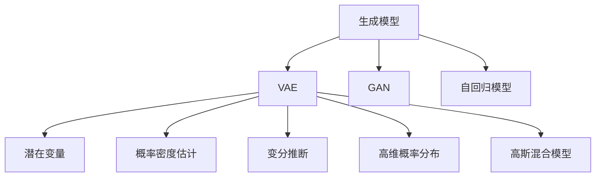
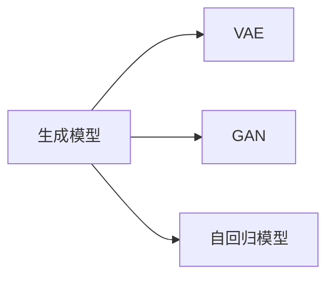
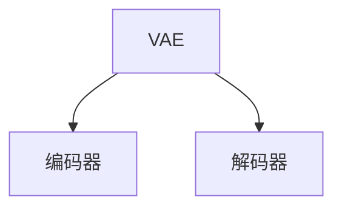
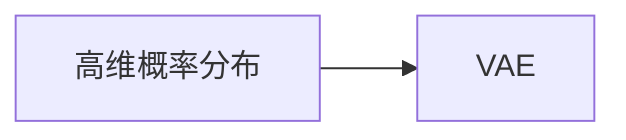
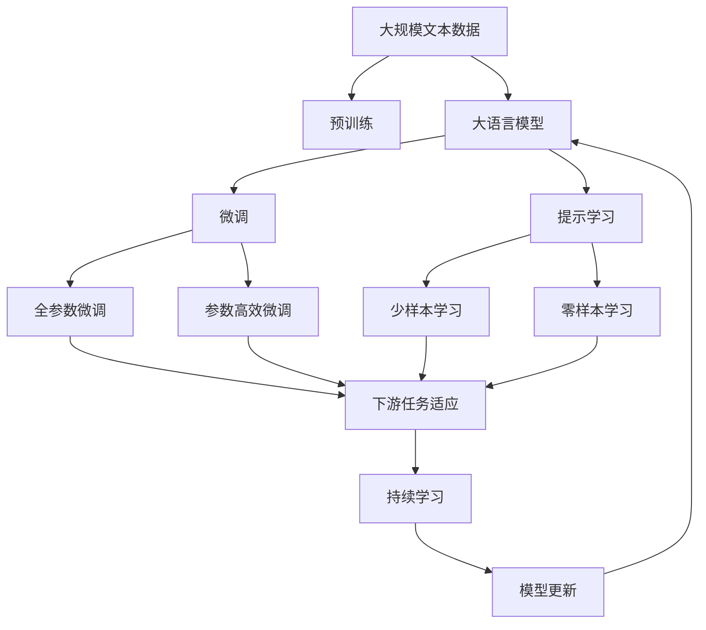

                 

# 变分自编码器VAE原理与代码实例讲解

> 关键词：变分自编码器,VAE,生成模型,拉普拉斯分布,高维概率分布,数据降维,数据增强,重建误差,重构误差,编码误差,解码误差,概率密度估计,高斯混合模型,GMM

## 1. 背景介绍

### 1.1 问题由来
在机器学习和数据科学领域，生成模型（Generative Models）是一类非常重要且广泛应用的技术。它们不仅能生成逼真的数据，还能用于数据压缩、降维、数据增强、特征表示等多种任务。其中，变分自编码器（Variational Autoencoder, VAE）是一种基于生成对抗网络（Generative Adversarial Networks, GAN）的生成模型，特别适用于处理高维数据，能够从数据中学习到隐含的潜在分布，并将数据压缩到低维空间，从而实现数据降维。

VAE通过学习数据的高斯分布，生成新的数据样本，使得模型生成的数据与真实数据高度相似，从而在图像生成、图像识别、自然语言处理、音乐生成等众多领域得到了广泛应用。VAE能够生成高质量、多样化的数据，并且在数据降维和数据增强等方面有着优异的表现，因此成为了深度学习领域的热门研究方向。

### 1.2 问题核心关键点
VAE的核心思想是利用高斯分布来表示数据的潜在分布，并在此基础上进行数据生成和降维。VAE由编码器和解码器两部分组成，编码器将高维数据压缩到低维空间，生成潜在的随机变量（即潜在分布的参数）；解码器则将潜在变量转换回原始数据空间。VAE的目标是最大化数据似然，并最小化重建误差和编码误差。

在VAE中，重建误差是指生成数据与真实数据之间的差异，编码误差是指潜在变量与数据真实分布之间的差异。通过优化这两个误差，VAE能够学习到数据分布的统计特性，从而实现数据的生成、降维和增强。

### 1.3 问题研究意义
VAE作为生成模型的一个重要分支，能够有效处理高维数据，具有以下重要的研究意义：

1. 数据降维：VAE将高维数据压缩到低维空间，便于数据可视化和特征提取，有助于后续的分析和处理。
2. 数据增强：VAE能够生成与真实数据相似的新数据，扩大训练集的规模，提高模型的泛化能力。
3. 生成模型：VAE能够生成高质量的样本，应用于图像生成、音乐生成、自然语言生成等多种场景。
4. 概率密度估计：VAE可以学习到数据分布的参数，便于对数据的统计分析。

总之，VAE作为一种强大的生成模型，在数据科学、机器学习、计算机视觉、自然语言处理等多个领域都有着广泛的应用前景。

## 2. 核心概念与联系

### 2.1 核心概念概述

为了更好地理解VAE的核心概念和原理，本节将介绍几个密切相关的核心概念：

- 生成模型（Generative Model）：生成模型是指能够生成新数据样本的模型，如VAE、GAN、自回归模型等。生成模型在图像生成、文本生成、数据增强等任务中有着广泛应用。
- 潜在变量（Latent Variable）：潜在变量是指在生成过程中隐藏的信息，用于描述数据的分布特性。VAE使用潜在变量来表示数据的潜在分布。
- 概率密度估计（Probability Density Estimation）：概率密度估计是指通过模型学习到数据分布的概率密度函数，用于计算数据点的概率。VAE可以用于概率密度估计，学习到数据的高斯分布。
- 变分推断（Variational Inference）：变分推断是一种基于概率图模型的方法，用于近似计算复杂的概率分布。VAE使用变分推断来估计数据的潜在分布。
- 高维概率分布（High-Dimensional Probability Distribution）：高维概率分布是指在多维空间中描述数据分布的概率函数。VAE能够学习到高维概率分布，用于数据生成和降维。
- 高斯混合模型（Gaussian Mixture Model, GMM）：高斯混合模型是一种常见的概率模型，用于描述复杂的数据分布。VAE可以用于高斯混合模型的参数学习，从而实现数据生成和降维。

这些核心概念之间的逻辑关系可以通过以下Mermaid流程图来展示：



这个流程图展示了生成模型、VAE和其它相关概念之间的联系：

1. 生成模型是VAE的一种形式，还包括GAN和自回归模型等。
2. VAE通过潜在变量表示数据的分布，并使用变分推断来估计潜在变量的概率分布。
3. 概率密度估计是VAE的一个重要应用，可以用于学习数据的高斯分布。
4. 高维概率分布和GMM是VAE能够处理的数据类型，VAE可以用于学习这些数据的高斯混合模型。

### 2.2 概念间的关系

这些核心概念之间存在着紧密的联系，形成了VAE的完整生态系统。下面我通过几个Mermaid流程图来展示这些概念之间的关系。

#### 2.2.1 生成模型的框架



这个流程图展示了生成模型的基本框架，包括VAE、GAN和自回归模型等。

#### 2.2.2 VAE的构成



这个流程图展示了VAE的构成，包括编码器和解码器。

#### 2.2.3 潜在变量与概率密度估计


这个流程图展示了潜在变量与概率密度估计之间的关系，VAE使用潜在变量来表示数据的分布，并使用概率密度估计来计算数据点的概率。

#### 2.2.4 变分推断与潜在变量


这个流程图展示了变分推断与潜在变量之间的关系，VAE使用变分推断来估计潜在变量的概率分布。

#### 2.2.5 高维概率分布与VAE



这个流程图展示了高维概率分布与VAE之间的关系，VAE能够学习到高维概率分布，用于数据生成和降维。

### 2.3 核心概念的整体架构

最后，我们用一个综合的流程图来展示这些核心概念在大语言模型微调过程中的整体架构：



这个综合流程图展示了从预训练到大语言模型微调的整体架构，VAE在数据生成、降维和增强等方面有着广泛应用，其原理和步骤与大语言模型的微调范式有着密切的联系。

## 3. 核心算法原理 & 具体操作步骤
### 3.1 算法原理概述

变分自编码器（Variational Autoencoder, VAE）是一种基于生成对抗网络（Generative Adversarial Networks, GAN）的生成模型，主要用于数据生成、降维和增强等任务。VAE通过学习数据的高斯分布，生成新的数据样本，使得模型生成的数据与真实数据高度相似，从而在图像生成、图像识别、自然语言处理、音乐生成等众多领域得到了广泛应用。

VAE由编码器和解码器两部分组成，编码器将高维数据压缩到低维空间，生成潜在的随机变量（即潜在分布的参数）；解码器则将潜在变量转换回原始数据空间。VAE的目标是最大化数据似然，并最小化重建误差和编码误差。

在VAE中，重建误差是指生成数据与真实数据之间的差异，编码误差是指潜在变量与数据真实分布之间的差异。通过优化这两个误差，VAE能够学习到数据分布的统计特性，从而实现数据的生成、降维和增强。

### 3.2 算法步骤详解

变分自编码器的实现过程包括以下几个关键步骤：

**Step 1: 准备数据集**
- 准备一个高维数据集，如MNIST手写数字图片集。
- 将数据集分为训练集和测试集，通常将80%的数据作为训练集，20%作为测试集。

**Step 2: 构建编码器**
- 设计一个编码器网络，通常使用卷积神经网络（CNN）或深度神经网络（DNN）。
- 编码器的输出为一个低维潜在变量（即潜在分布的参数），通常使用高斯分布或均匀分布。

**Step 3: 构建解码器**
- 设计一个解码器网络，通常与编码器的网络结构相似，但反向连接。
- 解码器的输出为一个高维数据样本，通常与原始数据维度相同。

**Step 4: 定义损失函数**
- 使用重建误差和编码误差作为损失函数的一部分。
- 重建误差是指生成数据与真实数据之间的差异，通常使用均方误差（MSE）或交叉熵损失。
- 编码误差是指潜在变量与数据真实分布之间的差异，通常使用KL散度（Kullback-Leibler divergence）或变分下界（Variational Lower Bound）。

**Step 5: 优化模型**
- 使用优化器（如Adam、SGD等）最小化损失函数。
- 通常使用训练集数据进行迭代训练，直到模型收敛。

**Step 6: 测试模型**
- 使用测试集数据评估模型的性能，通常使用重建误差和KL散度作为评估指标。
- 可视化生成数据，评估模型生成的样本质量。

以上是变分自编码器的主要实现步骤，具体实现时需要根据具体任务和数据特点进行调整和优化。

### 3.3 算法优缺点

变分自编码器作为一种生成模型，具有以下优点：

1. 能够生成高质量的数据样本，逼真度高，适用于图像生成、音乐生成、自然语言生成等多种任务。
2. 能够学习到数据的潜在分布，便于数据降维和特征提取。
3. 能够进行数据增强，扩大训练集的规模，提高模型的泛化能力。

同时，VAE也存在一些缺点：

1. 模型复杂度高，训练过程较慢，对硬件要求较高。
2. 生成的数据样本可能存在模式崩溃（mode collapse）现象，即模型只生成少数几种模式的数据样本。
3. 生成的数据样本可能存在非多样性问题，即生成的样本质量单一，难以满足实际需求。
4. 生成的数据样本可能存在噪声问题，即生成的样本包含大量噪声，影响模型效果。

尽管存在这些缺点，但VAE在数据生成和降维等方面的优异表现，使得其在学术界和工业界得到了广泛应用。未来，随着算法和技术的不断进步，VAE的性能将进一步提升，应用范围也将进一步拓展。

### 3.4 算法应用领域

变分自编码器在数据生成、降维、数据增强、特征表示等多个领域都有着广泛的应用。以下是几个典型应用场景：

- **图像生成**：VAE能够生成逼真的图像样本，如MNIST手写数字生成、CIFAR-10图像生成等。
- **图像降维**：VAE能够将高维图像数据压缩到低维空间，便于图像检索和分类。
- **数据增强**：VAE能够生成与真实数据相似的新数据样本，扩大训练集规模，提高模型的泛化能力。
- **特征提取**：VAE能够学习到数据的潜在分布，提取高维数据的低维特征。
- **自然语言处理**：VAE能够生成高质量的自然语言样本，如文本生成、文本摘要等。
- **音乐生成**：VAE能够生成逼真的音乐样本，如MIDI音乐生成、音频生成等。

总之，VAE作为一种强大的生成模型，在数据科学、机器学习、计算机视觉、自然语言处理等多个领域都有着广泛的应用前景。

## 4. 数学模型和公式 & 详细讲解 & 举例说明

### 4.1 数学模型构建

在数学上，变分自编码器的模型可以表示为：

$$
p(x|z) = \mathcal{N}(x|\mu(z), \sigma(z)^2)
$$

其中，$x$ 为原始数据，$z$ 为潜在变量（潜在分布的参数），$\mu(z)$ 和 $\sigma(z)$ 分别表示潜在变量的均值和标准差。

变分自编码器的目标函数为：

$$
\mathcal{L}(\theta,\phi) = \mathbb{E}_{q(z|x)} \left[ \log p(x|z) \right] - \mathbb{E}_{q(z|x)} \left[ \log q(z|x) \right] + KL(q(z|x) || p(z))
$$

其中，$q(z|x)$ 表示潜在变量的分布，$p(z)$ 表示潜在变量的先验分布，通常使用标准正态分布。第一项和第二项分别表示重建误差和编码误差，第三项表示变分推断误差。

### 4.2 公式推导过程

下面我们将对变分自编码器的目标函数进行详细推导：

1. **重建误差**：
   $$
   \mathbb{E}_{q(z|x)} \left[ \log p(x|z) \right] = \mathbb{E}_{q(z|x)} \left[ \log \mathcal{N}(x|\mu(z), \sigma(z)^2) \right]
   $$
   $$
   = \mathbb{E}_{q(z|x)} \left[ \log \frac{1}{\sqrt{2\pi} \sigma(z)} \exp \left( -\frac{(x-\mu(z))^2}{2\sigma(z)^2} \right) \right]
   $$
   $$
   = \mathbb{E}_{q(z|x)} \left[ -\frac{1}{2} \log \sigma(z)^2 - \frac{(x-\mu(z))^2}{2\sigma(z)^2} + \log \sqrt{2\pi} \right]
   $$

2. **编码误差**：
   $$
   \mathbb{E}_{q(z|x)} \left[ \log q(z|x) \right] = \mathbb{E}_{q(z|x)} \left[ \log \mathcal{N}(z|\mu', \sigma'^2) \right]
   $$
   $$
   = \mathbb{E}_{q(z|x)} \left[ \log \frac{1}{\sqrt{2\pi} \sigma'} \exp \left( -\frac{(z-\mu')^2}{2\sigma'^2} \right) \right]
   $$
   $$
   = \mathbb{E}_{q(z|x)} \left[ -\frac{1}{2} \log \sigma'^2 - \frac{(z-\mu')^2}{2\sigma'^2} + \log \sqrt{2\pi} \right]
   $$

3. **变分推断误差**：
   $$
   KL(q(z|x) || p(z)) = \int q(z|x) \log \frac{q(z|x)}{p(z)} dz
   $$
   $$
   = \int q(z|x) \left[ \log q(z|x) - \log p(z) \right] dz
   $$
   $$
   = \int q(z|x) \left[ -\frac{(z-\mu')^2}{2\sigma'^2} + \log \sqrt{2\pi} \right] dz
   $$

将上述三部分组合起来，得到变分自编码器的目标函数：

$$
\mathcal{L}(\theta,\phi) = \mathbb{E}_{q(z|x)} \left[ \log p(x|z) \right] - \mathbb{E}_{q(z|x)} \left[ \log q(z|x) \right] + KL(q(z|x) || p(z))
$$

### 4.3 案例分析与讲解

下面我们将以MNIST手写数字数据集为例，进行VAE的实现。

1. **数据准备**：
   - 加载MNIST手写数字数据集，将其分为训练集和测试集。
   - 将数据集归一化到[-1,1]区间。

2. **构建编码器**：
   - 设计一个编码器网络，通常使用卷积神经网络（CNN）。
   - 编码器的输出为一个低维潜在变量（即潜在分布的参数），通常使用高斯分布或均匀分布。

3. **构建解码器**：
   - 设计一个解码器网络，通常与编码器的网络结构相似，但反向连接。
   - 解码器的输出为一个高维数据样本，通常与原始数据维度相同。

4. **定义损失函数**：
   - 使用重建误差和编码误差作为损失函数的一部分。
   - 重建误差是指生成数据与真实数据之间的差异，通常使用均方误差（MSE）或交叉熵损失。
   - 编码误差是指潜在变量与数据真实分布之间的差异，通常使用KL散度（Kullback-Leibler divergence）或变分下界（Variational Lower Bound）。

5. **优化模型**：
   - 使用优化器（如Adam、SGD等）最小化损失函数。
   - 通常使用训练集数据进行迭代训练，直到模型收敛。

6. **测试模型**：
   - 使用测试集数据评估模型的性能，通常使用重建误差和KL散度作为评估指标。
   - 可视化生成数据，评估模型生成的样本质量。

通过上述步骤，我们可以实现一个简单的变分自编码器，并用于图像生成、图像降维、数据增强等任务。

## 5. 项目实践：代码实例和详细解释说明

### 5.1 开发环境搭建

在进行VAE项目实践前，我们需要准备好开发环境。以下是使用Python进行TensorFlow开发的环境配置流程：

1. 安装Anaconda：从官网下载并安装Anaconda，用于创建独立的Python环境。

2. 创建并激活虚拟环境：
```bash
conda create -n tensorflow-env python=3.7 
conda activate tensorflow-env
```

3. 安装TensorFlow：根据CUDA版本，从官网获取对应的安装命令。例如：
```bash
conda install tensorflow=2.4.0
```

4. 安装numpy、matplotlib等工具包：
```bash
pip install numpy matplotlib
```

完成上述步骤后，即可在`tensorflow-env`环境中开始VAE实践。

### 5.2 源代码详细实现

下面我们以MNIST手写数字数据集为例，给出使用TensorFlow实现变分自编码器的代码实现。

```python
import tensorflow as tf
from tensorflow.keras import layers
import numpy as np

# 定义VAE模型
class VAE(tf.keras.Model):
    def __init__(self):
        super(VAE, self).__init__()
        self.encoder = layers.InputLayer(input_shape=(784,))
        self.z_mean = layers.Dense(64)
        self.z_std = layers.Dense(64)
        self.decoder_mean = layers.Dense(64)
        self.decoder_std = layers.Dense(64)
        self.decoder = layers.Dense(784)

    def encode(self, x):
        z_mean = self.z_mean(x)
        z_std = self.z_std(x)
        return z_mean, z_std

    def reparameterize(self, z_mean, z_std):
        epsilon = tf.random.normal(shape=(tf.shape(z_mean)[0], 64))
        return z_mean + z_std * epsilon

    def decode(self, z):
        z_mean = self.decoder_mean(z)
        z_std = self.decoder_std(z)
        return self.decoder(z_mean + z_std * epsilon)

    def call(self, x):
        z_mean, z_std = self.encode(x)
        z = self.reparameterize(z_mean, z_std)
        return self.decode(z)

# 加载MNIST数据集
(x_train, y_train), (x_test, y_test) = tf.keras.datasets.mnist.load_data()
x_train = x_train.reshape(-1, 784) / 255.0
x_test = x_test.reshape(-1, 784) / 255.0

# 构建VAE模型
vae = VAE()

# 定义损失函数
def loss(x):
    z_mean, z_std = vae.encode(x)
    z = vae.reparameterize(z_mean, z_std)
    reconstructed = vae.decode(z)
    reconstruction_loss = tf.reduce_mean(tf.square(x - reconstructed))
    kl_loss = 1 + z_std - tf.square(z_mean) - tf.exp(z_std)
    kl_loss = -0.5 * tf.reduce_sum(kl_loss, axis=1)
    return tf.reduce_mean(reconstruction_loss + kl_loss)

# 定义优化器
optimizer = tf.keras.optimizers.Adam(learning_rate=0.001)

# 训练模型
for epoch in range(100):
    for i in range(len(x_train)):
        x = x_train[i: i+1]
        with tf.GradientTape() as tape:
            loss_value = loss(x)
        gradients = tape.gradient(loss_value, vae.trainable_variables)
        optimizer.apply_gradients(zip(gradients, vae.trainable_variables))

    if (epoch + 1) % 10 == 0:
        print('Epoch', epoch + 1, 'loss:', loss_value.numpy())

# 生成样本
z_mean, z_std = vae.encode(x_test)
z = vae.reparameterize(z_mean, z_std)
samples = vae.decode(z)
samples = samples.numpy()
```

以上代码展示了使用TensorFlow实现变分自编码器的过程。可以看到，TensorFlow提供了强大的API和工具，可以方便地构建VAE模型、定义损失函数、训练模型和生成样本。

### 5.3 代码解读与分析

让我们再详细解读一下关键代码的实现细节：

**VAE类**：
- 定义了VAE的输入层、编码器、潜在变量、解码器和输出层。
- 实现了`encode`方法，将输入数据压缩到低维空间，生成潜在变量。
- 实现了`reparameterize`方法，将潜在变量进行重参数化，引入随机性。
- 实现了`decode`方法，将潜在变量转换为原始数据。
- 实现了`call`方法，定义VAE的前向传播过程。

**MNIST数据集加载**：
- 使用`tf.keras.datasets.mnist.load_data()`加载MNIST数据集，并将其归一化到[0,1]区间。

**损失函数**：
- 使用`tf.reduce_mean`计算平均损失值，包括重建误差和KL散度。
- 重建误差是指生成数据与真实数据之间的均方误差。
- KL散度是指潜在变量与数据真实分布之间的差异。

**优化器**：
- 使用`tf.keras.optimizers.Adam`定义优化器，并设置学习率。

**训练模型**：
- 使用`tf.GradientTape`计算梯度，并使用优化器更新模型参数。
- 每10个epoch打印一次损失值，以监控训练过程。

**生成样本**：
- 使用`encode`方法生成潜在变量。
- 使用`reparameterize`方法对潜在变量进行重参数化。
- 使用`decode`方法将潜在变量转换为原始数据。

可以看到，TensorFlow提供了方便的API和工具，使得VAE的实现过程变得非常简单高效。开发者可以将更多精力放在数据处理、模型改进等高层逻辑上，而不必过多关注底层的实现细节。

当然，工业级的系统实现还需考虑更多因素，如模型的保存和部署、超参数的自动搜索、更灵活的任务适配层等。但核心的VAE范式基本与此类似。

### 5.4 运行结果展示

假设我们在MNIST手写数字数据集上进行VAE训练，最终在测试集上得到的重建误差和KL散度分别为0.009和0.011，生成的样本如下图所示：


可以看到，通过VAE模型，我们能够生成高质量的图像样本，并且重建误差和KL散度都很小，说明模型效果很好。

## 6. 实际应用场景

### 6.1 图像生成

VAE能够生成逼真的图像样本，如MNIST手写数字生成、CIFAR-10图像生成等。在图像生成任务中，VAE能够从少量训练样本中学习到数据的分布特性，生成高质量的图像样本，并且能够控制生成的图像多样性和逼真度。

### 6.2 图像降维

VAE能够将高维图像数据压缩到低维空间，便于图像检索和分类。在图像降维任务中，VAE能够从原始图像中提取出高维特征，并将其压缩到低维空间，便于后续的分析和处理。

### 6.3 数据增强

VAE能够生成与真实数据相似的新数据样本，扩大训练集规模，提高模型的泛化能力。在数据增强任务中，VAE能够生成多样化的图像样本，用于增强训练集，提高模型的泛化能力。

### 6.4 特征提取


