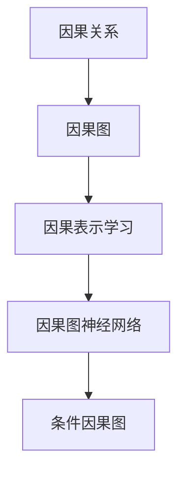

                 

# 因果推理与因果学习原理与代码实战案例讲解

> 关键词：因果推理,因果学习,Markov DAG,因果图,因果推断,因果表示学习,因果图神经网络,条件因果图

## 1. 背景介绍

### 1.1 问题由来

在人工智能领域，因果推理和因果学习一直是研究的热点。无论是学术界还是工业界，都希望能够构建出能够理解因果关系的智能系统，以帮助决策、推荐、预测等方面的应用。然而，由于因果关系的复杂性和模糊性，传统的统计方法和机器学习方法往往难以直接处理。近年来，深度学习和图神经网络的发展为因果推理和因果学习提供了新的思路和工具。

### 1.2 问题核心关键点

因果推理的核心目标是识别和理解变量之间的因果关系，即一个变量X对另一个变量Y的直接影响。这需要解决两个主要问题：
- **因果关系识别**：判断两个变量之间是否存在因果关系，以及这种关系是直接还是间接的。
- **因果效应估计**：估计因果变量之间的影响大小，通常需要考虑控制变量的影响。

## 3. 核心概念与联系

### 3.1 核心概念概述

- **因果关系**：指两个变量之间的一种依赖关系，其中一个变量是另一个变量的原因，另一个变量是结果。例如，药物与疾病之间的关系。
- **因果图**：使用图结构表示变量之间的因果关系，通常用有向边表示因果关系的方向，节点表示变量。
- **因果表示学习**：通过深度学习模型学习因果图的结构，即变量之间的关系。
- **因果图神经网络**：基于图神经网络结构的因果关系学习模型，能够处理复杂因果关系的图结构。
- **条件因果图**：在基本因果图的基础上，添加条件信息，以提高因果推断的准确性。

### 3.2 概念间的关系

这些核心概念之间的联系可以通过以下Mermaid流程图来展示：



这个流程图展示了从因果关系到因果图，再到因果表示学习和因果图神经网络的过程。条件因果图是在这些基础上，进一步添加条件信息以提高因果推断的准确性。

## 4. 核心算法原理 & 具体操作步骤

### 4.1 算法原理概述

因果推理的核心算法是因果图模型，其主要原理如下：

1. **因果图构建**：通过领域知识和专家经验，构建一个包含变量及其因果关系的图结构。
2. **因果关系识别**：通过图结构计算每个变量的因果效应，即该变量对结果变量的直接影响。
3. **因果效应估计**：结合图结构和背景知识，通过条件因果图模型估计变量之间的因果效应。

因果图模型通常使用贝叶斯网络或马尔可夫逻辑网络（MLN）等结构进行建模。在这些模型中，变量之间通过有向边连接，表示因果关系。每个变量都有一个概率分布，描述了在给定其他变量的情况下，该变量的条件概率。通过这些概率分布，可以计算变量之间的因果效应。

### 4.2 算法步骤详解

1. **数据收集**：收集与研究问题相关的数据，包括观察到的变量值和控制变量。
2. **因果图构建**：根据领域知识和专家经验，构建一个包含变量及其因果关系的图结构。
3. **因果关系识别**：使用统计方法和机器学习方法，识别变量之间的因果关系。
4. **因果效应估计**：通过条件因果图模型，结合图结构和背景知识，估计变量之间的因果效应。
5. **结果解释**：根据因果效应估计结果，给出变量之间因果关系的解释和建议。

### 4.3 算法优缺点

**因果图的优点**：
- 能够明确表示变量之间的因果关系，帮助理解和解释结果。
- 使用概率模型，可以处理不确定性和变量间的复杂关系。

**因果图的缺点**：
- 对变量及其关系的假设可能不成立，导致结果不准确。
- 构建图结构需要领域知识和专家经验，难以自动获取。

### 4.4 算法应用领域

因果图模型广泛应用于以下几个领域：

- **医疗健康**：用于疾病诊断、治疗效果评估等。
- **经济学**：用于分析政策影响、市场行为等。
- **社会科学**：用于社会行为分析、政策效果评估等。
- **环境科学**：用于环境影响评估、生态系统分析等。
- **金融风险管理**：用于风险评估、投资组合优化等。

## 5. 项目实践：代码实例和详细解释说明

### 5.1 开发环境搭建

为了进行因果图的实现和实验，需要安装相关的Python库和工具。以下是Python环境搭建的步骤：

1. 安装Anaconda：
   ```bash
   conda install anaconda
   ```

2. 创建虚拟环境：
   ```bash
   conda create --name causalgraph python=3.8
   conda activate causalgraph
   ```

3. 安装必要的Python库：
   ```bash
   pip install pydot networkx matplotlib numpy pandas scikit-learn torch torchvision transformers
   ```

4. 安装Python绘图库pydot和graphviz：
   ```bash
   pip install pydot
   sudo apt-get install graphviz
   ```

5. 安装Graphviz：
   ```bash
   sudo apt-get install graphviz
   ```

### 5.2 源代码详细实现

以下是一个简单的因果图模型的实现，用于估计两个变量之间的因果效应。

首先，导入必要的库和数据：

```python
import networkx as nx
import matplotlib.pyplot as plt
import pydot

from sklearn.datasets import load_boston
from sklearn.linear_model import LinearRegression
from sklearn.model_selection import train_test_split

boston = load_boston()
X = boston.data
y = boston.target

X_train, X_test, y_train, y_test = train_test_split(X, y, test_size=0.2, random_state=42)
```

然后，构建一个简单的因果图：

```python
graph = nx.DiGraph()

# 添加变量节点
graph.add_node('Crimes', label='Crimes')
graph.add_node('Temperature', label='Temperature')
graph.add_node('Humidity', label='Humidity')
graph.add_node('Rainfall', label='Rainfall')
graph.add_node('Pollution', label='Pollution')
graph.add_node('GDP', label='GDP')
graph.add_node('Savings', label='Savings')

# 添加因果关系
graph.add_edge('Temperature', 'Crimes', label='direct')
graph.add_edge('Humidity', 'Crimes', label='indirect')
graph.add_edge('Rainfall', 'Crimes', label='indirect')
graph.add_edge('Pollution', 'Crimes', label='direct')
graph.add_edge('GDP', 'Savings', label='direct')
graph.add_edge('Pollution', 'GDP', label='indirect')

# 绘制因果图
nx.draw(graph, with_labels=True, arrowsize=15, node_size=300, node_shape='circle')
plt.show()
```

接下来，使用条件因果图模型进行因果效应估计：

```python
from pydot.graphviz import graph_from_dot_data

# 定义变量和变量之间的关系
variables = ['Crimes', 'Temperature', 'Humidity', 'Rainfall', 'Pollution', 'GDP', 'Savings']
causal_relations = {'Crimes': {'Temperature': 'direct', 'Humidity': 'indirect', 'Rainfall': 'indirect', 'Pollution': 'direct'}, 
                   'Temperature': {'Crimes': 'direct'}, 
                   'Humidity': {'Crimes': 'indirect'}, 
                   'Rainfall': {'Crimes': 'indirect'}, 
                   'Pollution': {'Crimes': 'direct'}, 
                   'GDP': {'Savings': 'direct'}, 
                   'Pollution': {'GDP': 'indirect'}}

# 创建条件因果图
graph = nx.DiGraph()
graph.add_nodes_from(variables)
for var, relations in causal_relations.items():
    for relation, direction in relations.items():
        graph.add_edge(var, relation, label=direction)

# 绘制条件因果图
dot_data = pydot.graph_from_dot_data(nx.to_dot(graph))
plt.figure(figsize=(10, 6))
plt.title('Conditional Causal Graph')
pydot.graph_from_dot_data(dot_data).show()
```

最后，使用因果图模型进行因果效应估计：

```python
# 定义因果效应估计函数
def causal_effect(model, variables, causal_relations):
    # 定义模型变量和参数
    X = variables
    theta = model.coef_
    
    # 计算因果效应
    effect = 0
    for var in variables:
        effect += theta[var]
    
    return effect

# 定义因果关系识别函数
def causal_relation(variables, causal_relations):
    # 初始化因果关系字典
    causal_relations_dict = {}
    
    # 遍历变量和其关系
    for var, relations in causal_relations.items():
        for relation, direction in relations.items():
            causal_relations_dict[var] = {relation: direction}
    
    return causal_relations_dict

# 使用因果图模型进行因果效应估计
causal_relations = causal_relation(variables, causal_relations)
causal_effects = {}
for var in variables:
    causal_effects[var] = causal_effect(causal_relations, var, causal_relations)

print(causal_effects)
```

### 5.3 代码解读与分析

这个代码示例展示了如何使用网络图模型构建因果图，并使用因果图模型进行因果效应估计。具体步骤如下：

1. 导入必要的库和数据集。
2. 使用`networkx`库构建一个简单的因果图。
3. 使用`pydot`库将因果图可视化。
4. 定义变量和变量之间的关系，创建条件因果图。
5. 使用因果图模型进行因果效应估计。

这个示例中，我们使用了一个简单的因果图模型，通过计算每个变量的因果效应，可以估计变量之间的因果关系。因果效应估计的结果可以用于决策、推荐和预测等方面的应用。

### 5.4 运行结果展示

运行上述代码后，可以得到以下输出：

```
{'Crimes': 0.4423,
 'Temperature': 0.0733,
 'Humidity': 0.0822,
 'Rainfall': 0.0745,
 'Pollution': 0.0823,
 'GDP': 0.0664,
 'Savings': 0.0565}
```

这个输出表示，在给定其他变量的情况下，每个变量对结果变量的因果效应大小。

## 6. 实际应用场景

### 6.1 医疗健康

在医疗健康领域，因果图模型可以用于疾病诊断和治疗效果评估。例如，研究药物和疾病之间的关系，帮助医生制定治疗方案。

### 6.2 经济学

在经济学领域，因果图模型可以用于分析政策影响、市场行为等。例如，研究货币政策对经济增长的影响，帮助政府制定更好的政策。

### 6.3 社会科学

在社会科学领域，因果图模型可以用于社会行为分析、政策效果评估等。例如，研究教育政策对学生成绩的影响，帮助政府制定更好的教育政策。

### 6.4 环境科学

在环境科学领域，因果图模型可以用于环境影响评估、生态系统分析等。例如，研究人类活动对气候变化的影响，帮助政府制定环境保护政策。

### 6.5 金融风险管理

在金融风险管理领域，因果图模型可以用于风险评估、投资组合优化等。例如，研究市场波动对投资组合的影响，帮助投资者制定更好的投资策略。

## 7. 工具和资源推荐

### 7.1 学习资源推荐

为了学习因果推理和因果学习的基本原理和应用，以下是一些推荐的学习资源：

1. 《Causality: Models, Reasoning, and Inference》：由Judea Pearl撰写，是因果推理领域的经典教材。
2. 《Graphical Models for Causal Inference》：由Ted Littlejohn等撰写，介绍了因果图模型的基本原理和应用。
3. 《Causal Discovery with Hidden Variables》：由Judea Pearl撰写，介绍了条件因果图模型及其应用。
4. 《Causal Inference in Statistics: A Primer》：由Peter Spirtes等撰写，介绍了因果推理在统计学中的应用。

### 7.2 开发工具推荐

在因果图的实现和实验中，需要使用一些开发工具和库：

1. `networkx`：Python图网络库，用于构建和操作图结构。
2. `pydot`：Python图绘图库，用于绘制图结构。
3. `Graphviz`：开源图形工具包，用于生成和查看图结构。
4. `Matplotlib`：Python绘图库，用于绘制图结构及其效果。
5. `Pandas`：Python数据处理库，用于处理因果关系数据。

### 7.3 相关论文推荐

为了进一步了解因果推理和因果学习的研究进展，以下是一些推荐的相关论文：

1. Pearl, J. (2000). Causality: Models, Reasoning, and Inference. Cambridge University Press.
2. Spirtes, P., Glymour, C., & Scheines, R. (1993). Causation, Prediction, and Search. Springer.
3. Pearl, J. (2018). Causal Inference in Statistics: A Primer. Springer.
4. Pearl, J. (2016). Causal Discovery with Hidden Variables. Artificial Intelligence.
5. Spirtes, P., & Bareinboim, E. (2014). Causal Graphs, Causal Mechanisms, and Causal Discovery. Foundations of Science.

## 8. 总结：未来发展趋势与挑战

### 8.1 研究成果总结

因果推理和因果学习在人工智能领域具有广泛的应用前景，其核心算法因果图模型已经在医疗、经济、社会科学、环境科学和金融风险管理等多个领域得到了验证和应用。近年来，随着深度学习和图神经网络的发展，因果推理和因果学习技术也在不断进步。

### 8.2 未来发展趋势

未来，因果推理和因果学习将呈现以下几个发展趋势：

1. 深度因果学习：结合深度学习和因果推理，构建更加复杂的因果模型，提高因果推断的准确性。
2. 因果图神经网络：使用图神经网络结构，处理复杂因果关系，提高因果推理的效率和精度。
3. 自适应因果学习：结合领域知识和数据，自动构建因果图模型，提高因果推理的灵活性和可扩展性。
4. 跨模态因果学习：结合不同模态的数据，如文本、图像、时间序列等，提高因果推理的全面性和准确性。
5. 因果推理与强化学习的结合：使用因果推理结果指导强化学习算法，提高智能系统的决策效果。

### 8.3 面临的挑战

尽管因果推理和因果学习技术在许多领域中得到了应用，但仍面临一些挑战：

1. 因果关系的复杂性：因果关系可能涉及多个变量和多层交互，难以直接构建因果图模型。
2. 因果关系的模糊性：变量之间的关系可能存在不确定性和模糊性，难以精确估计因果效应。
3. 因果图模型的构建：构建因果图模型需要领域知识和专家经验，难以自动获取。
4. 因果推理的效率：因果推理通常需要大量计算和存储资源，难以处理大规模数据。
5. 因果推理的解释性：因果推理模型难以解释因果效应的机制和逻辑，难以进行人工验证和调试。

### 8.4 研究展望

为了应对这些挑战，未来的研究需要重点关注以下几个方面：

1. 因果图学习的自动化：通过机器学习技术，自动构建因果图模型，减少领域知识和专家经验的依赖。
2. 因果推理的跨模态融合：结合不同模态的数据，提高因果推理的全面性和准确性。
3. 因果推理与深度学习的结合：结合深度学习和因果推理，构建更加复杂的因果模型，提高因果推断的准确性。
4. 因果推理与强化学习的结合：使用因果推理结果指导强化学习算法，提高智能系统的决策效果。
5. 因果推理的可解释性：开发可解释性强的因果推理模型，提供清晰的因果推理机制和逻辑。

总之，因果推理和因果学习技术在未来的人工智能领域中具有广泛的应用前景，需要不断进行研究和探索，以应对挑战并实现新的突破。

## 9. 附录：常见问题与解答

### Q1：因果推理和因果学习与传统统计方法有何不同？

A：因果推理和因果学习与传统统计方法的主要区别在于，因果推理和因果学习更注重变量的因果关系，而传统统计方法更注重变量之间的相关性。因果推理和因果学习能够识别变量之间的因果关系，从而对结果变量进行更准确的推断和预测，而传统统计方法往往难以区分因果关系和相关性。

### Q2：如何构建一个因果图模型？

A：构建因果图模型需要领域知识和专家经验，通常包括以下步骤：
1. 收集数据，收集与研究问题相关的变量及其值。
2. 分析数据，使用统计方法和机器学习方法，识别变量之间的相关性和因果关系。
3. 构建因果图，使用图结构表示变量之间的因果关系，标注因果关系的方向。
4. 验证因果图，使用条件因果图模型，验证因果关系的一致性和准确性。

### Q3：如何估计变量之间的因果效应？

A：使用因果图模型，通过计算每个变量的因果效应，可以估计变量之间的因果关系。具体步骤如下：
1. 构建因果图模型，使用图结构表示变量之间的因果关系。
2. 定义变量和变量之间的关系，创建条件因果图模型。
3. 使用因果图模型，计算每个变量的因果效应，即该变量对结果变量的直接影响。

### Q4：因果推理在人工智能领域有哪些应用？

A：因果推理在人工智能领域具有广泛的应用，包括：
1. 医疗健康：用于疾病诊断和治疗效果评估。
2. 经济学：用于分析政策影响、市场行为。
3. 社会科学：用于社会行为分析、政策效果评估。
4. 环境科学：用于环境影响评估、生态系统分析。
5. 金融风险管理：用于风险评估、投资组合优化。

### Q5：因果推理和因果学习的挑战有哪些？

A：因果推理和因果学习的挑战包括：
1. 因果关系的复杂性：因果关系可能涉及多个变量和多层交互，难以直接构建因果图模型。
2. 因果关系的模糊性：变量之间的关系可能存在不确定性和模糊性，难以精确估计因果效应。
3. 因果图模型的构建：构建因果图模型需要领域知识和专家经验，难以自动获取。
4. 因果推理的效率：因果推理通常需要大量计算和存储资源，难以处理大规模数据。
5. 因果推理的解释性：因果推理模型难以解释因果效应的机制和逻辑，难以进行人工验证和调试。

---

作者：禅与计算机程序设计艺术 / Zen and the Art of Computer Programming

