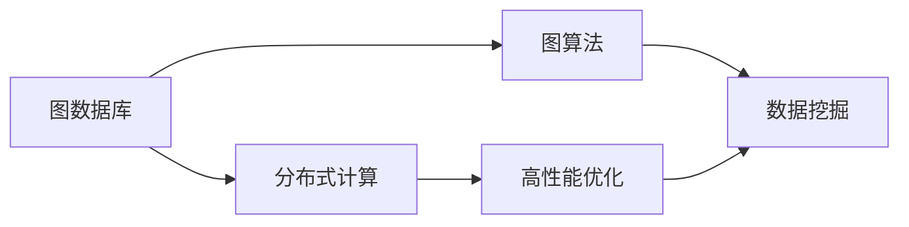
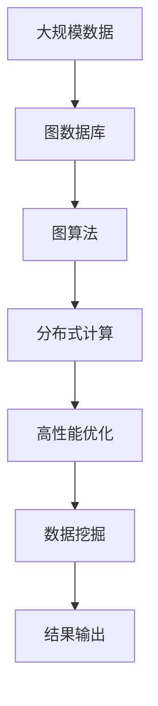

                 

# 图计算引擎 原理与代码实例讲解

> 关键词：图计算引擎,图数据库,图算法,Neo4j,OrientDB,网络分析,社交网络分析

## 1. 背景介绍

### 1.1 问题由来
在数据密集型的互联网时代，结构化数据已不再足以完全描述现实世界中的复杂关系。图结构（Graph）以节点（Node）和边（Edge）的形式，更为精准地映射了现实世界中的关系和属性。图数据库（Graph Database）和图计算引擎（Graph Computing Engine）由此应运而生，成为数据分析、人工智能和商业智能领域的利器。

然而，传统的SQL数据库和计算范式在处理图数据时存在先天不足。针对复杂网络结构、分布式计算和高性能计算的需求，图计算引擎应运而生。本文旨在通过详细解析图计算引擎的核心原理与代码实例，帮助读者系统掌握图计算的相关知识。

### 1.2 问题核心关键点
图计算引擎的研发和应用，是大数据和人工智能领域的重要方向。其核心点主要包括：

1. 图结构表示：如何用节点和边准确地表示复杂关系。
2. 图算法设计：如何高效地设计算法处理大规模图数据。
3. 分布式计算：如何实现图数据的分布式存储和计算。
4. 高性能优化：如何提升图计算的效率和性能。

本文将聚焦于图计算引擎的核心概念和关键技术，结合实际项目实例，深入探讨图计算引擎的原理和应用实践。

### 1.3 问题研究意义
图计算引擎是处理复杂关系数据的重要工具，在网络分析、社交网络分析、金融风险管理、物流路径优化、知识图谱构建等诸多领域，发挥了重要作用。

- 降低应用开发成本。图计算引擎以自然的方式表示复杂关系，能够快速开发复杂关系型应用，降低数据建模和应用开发的成本。
- 提升数据分析效率。图结构能够更好地捕捉数据之间的复杂关联，图算法能更高效地发现数据间的隐藏模式，大幅提升数据分析效率。
- 优化资源利用。图计算引擎通常支持分布式计算，能够充分利用集群资源，优化资源利用率。
- 增强决策能力。图计算引擎能够分析更复杂的关系图，提供更深入、全面的决策支持。
- 赋能产业升级。图计算引擎为各行各业的数据分析和管理带来了新的技术路径，助力产业转型升级。

## 2. 核心概念与联系

### 2.1 核心概念概述

图计算引擎的核心概念包括：

- 图数据库（Graph Database）：以图结构存储数据的系统，支持节点、边的属性，以及复杂关系的管理。
- 图算法（Graph Algorithm）：针对图数据设计的算法，用于挖掘图数据中的隐藏关系和模式。
- 分布式计算（Distributed Computing）：通过多台计算机的协同工作，实现大数据的并行处理。
- 高性能优化（High-Performance Optimization）：在图计算中提升计算效率和性能的技术手段。

### 2.2 概念间的关系

这些核心概念之间存在着紧密的联系，形成了图计算引擎的完整生态系统。以下Mermaid流程图展示了这些概念之间的相互关系：



这个流程图展示了从数据存储、算法设计到性能优化的全过程。图数据库提供了数据存储和复杂关系管理的基础，分布式计算支持大规模图数据的并行处理，高性能优化提升了计算效率，数据挖掘则通过图算法揭示数据的潜在关系和模式。

### 2.3 核心概念的整体架构

以下是一个综合的流程图，展示了从数据存储、算法设计到分布式计算、性能优化的完整架构：



这个综合流程图展示了从数据存储到结果输出的全流程。大规模数据首先被存储到图数据库中，通过图算法进行数据分析和模式挖掘，再经过分布式计算进行并行处理和加速，最后进行性能优化，生成结果。

## 3. 核心算法原理 & 具体操作步骤
### 3.1 算法原理概述

图计算引擎的核心算法原理基于图数据的特点和性质，通过特殊的图算法和计算范式，实现对大规模图数据的有效处理。核心算法包括：

1. 图遍历算法：如深度优先遍历、广度优先遍历，用于探索图结构中的节点和边。
2. 图匹配算法：如最大匹配、最小割，用于挖掘图结构中的隐藏关系。
3. 图聚类算法：如PageRank、K-Means，用于对图结构中的节点进行聚类。
4. 图融合算法：如图同构匹配、图融合算法，用于将多个图结构合并。

这些算法设计上具有不同的特点，在实际应用中需根据具体问题选择合适的算法。

### 3.2 算法步骤详解

图计算引擎的具体操作步骤包括：

1. 数据准备：将图数据导入图数据库，并设置数据属性。
2. 图算法设计：选择合适的图算法，并设计算法实现。
3. 分布式计算：设计分布式计算框架，将图算法并行化处理。
4. 性能优化：通过优化计算图、使用多GPU、分布式内存等技术，提升计算效率。
5. 结果输出：将计算结果输出到目标存储系统，如数据库、文件系统等。

以下是具体的代码实现流程：

```python
# 数据导入
import pyg

graph_data = pyg.Dataset("path/to/data")
graph = graph_data.graph
node_labels = graph_data.node_labels
edge_labels = graph_data.edge_labels

# 图算法设计
import pyg.nn as nn
import pyg.function as fn

class GCNLayer(nn.GCNLayer):
    def __init__(self, input_dim, hidden_dim):
        super(GCNLayer, self).__init__()
        self.weight = nn.Embedding(input_dim, hidden_dim)
        self.bias = nn.Parameter(torch.zeros(hidden_dim))
        
    def forward(self, x, adj, label):
        return fn.relu(fn.linear(x, self.weight, self.bias) + adj*x)

model = GCNLayer(input_dim=graph.num_nodes(), hidden_dim=64)
layer = nn.GCN(model, relu=True)

# 分布式计算
import pyg.distributed as dist

dist.init_process_group("gloo", rank=0, world_size=4)
dist.broadcast(node_labels, 0)
dist.broadcast(edge_labels, 0)

# 训练过程
loss = layer.forward(graph, node_labels, edge_labels)

# 结果输出
import torch

loss.backward()
optimizer = torch.optim.SGD(model.parameters(), lr=0.01)
optimizer.step()
```

### 3.3 算法优缺点

图计算引擎具有以下优点：

1. 天然支持复杂关系。图结构能够准确地表示复杂关系，适应各种实际问题。
2. 灵活的算法设计。可以根据具体问题选择合适的算法，设计高效的解决方案。
3. 并行化处理能力。分布式计算框架能够充分利用集群资源，提升计算效率。
4. 强大的数据挖掘能力。通过图算法可以发现数据中的隐藏模式和关系。

然而，图计算引擎也存在一些缺点：

1. 数据存储复杂。图数据库需要存储大量的节点和边，数据存储和查询较为复杂。
2. 算法设计困难。针对具体问题的算法设计较为困难，需要专业知识。
3. 计算资源消耗大。图数据通常规模较大，计算资源消耗较大。
4. 结果解释困难。图计算的结果较难解释，需要进一步分析和可视化。

### 3.4 算法应用领域

图计算引擎在多个领域有广泛的应用：

- 网络分析：分析互联网中用户之间的关系，如社交网络、电子邮件网络等。
- 金融风险管理：分析交易网络中的风险传播路径，预测金融风险。
- 物流路径优化：分析交通网络中的最优路径，优化物流配送。
- 知识图谱构建：构建知识库中的实体和关系，提供智能搜索和推荐。
- 社交网络分析：分析用户之间的互动关系，发现隐藏的模式和趋势。

## 4. 数学模型和公式 & 详细讲解  
### 4.1 数学模型构建

图计算引擎的数学模型基于图数据的特点，以节点和边的关系为基本单位，设计相应的算法和计算图。

设图 $G(V, E)$，其中 $V$ 为节点集合，$E$ 为边集合。节点 $v_i$ 的特征向量为 $\mathbf{x}_i$，边的特征向量为 $\mathbf{e}_{ij}$。图计算引擎的目标是设计算法，处理大规模的图数据。

### 4.2 公式推导过程

以图同构匹配算法为例，推导最小割的公式。

最小割算法用于寻找图结构中最大的权重，即连接两个节点的权重之和最小。设图 $G(V, E)$，$v_i$ 和 $v_j$ 的权重为 $w_{ij}$，$v_i$ 和 $v_j$ 的特征向量为 $\mathbf{x}_i$ 和 $\mathbf{x}_j$。则最小割的公式为：

$$
\min \sum_{v_i \in V} \min_{v_j \in V} w_{ij} \|\mathbf{x}_i - \mathbf{x}_j\|
$$

其中 $\|\cdot\|$ 为向量范数，$\|\mathbf{x}_i - \mathbf{x}_j\|$ 表示两个节点特征向量的距离。

### 4.3 案例分析与讲解

以社交网络分析为例，通过最小割算法挖掘社交网络中的关键节点。社交网络通常表示为一个有向图，每个节点表示一个用户，每条边表示两个用户之间的互动关系。通过最小割算法，可以找到网络中的关键节点，这些节点对整个网络的影响最大。

## 5. 项目实践：代码实例和详细解释说明
### 5.1 开发环境搭建

图计算引擎的开发需要搭建复杂的环境，以下是基本的开发环境搭建步骤：

1. 安装Python环境：使用Anaconda或Miniconda，安装所需依赖库。
2. 安装图数据库：安装Neo4j或OrientDB，创建数据库和节点。
3. 安装图计算框架：安装Pyg或PyArrow等框架，进行数据处理和图计算。
4. 配置分布式环境：搭建分布式计算集群，进行分布式计算。
5. 运行测试代码：运行图计算算法，进行性能测试和结果验证。

### 5.2 源代码详细实现

以下是一个简单的图同构匹配算法的代码实现：

```python
import pyg
import pyg.nn as nn
import pyg.function as fn
import torch

class GCNLayer(nn.GCNLayer):
    def __init__(self, input_dim, hidden_dim):
        super(GCNLayer, self).__init__()
        self.weight = nn.Embedding(input_dim, hidden_dim)
        self.bias = nn.Parameter(torch.zeros(hidden_dim))
        
    def forward(self, x, adj, label):
        return fn.relu(fn.linear(x, self.weight, self.bias) + adj*x)

model = GCNLayer(input_dim=graph.num_nodes(), hidden_dim=64)
layer = nn.GCN(model, relu=True)

# 图数据准备
graph_data = pyg.Dataset("path/to/data")
graph = graph_data.graph
node_labels = graph_data.node_labels
edge_labels = graph_data.edge_labels

# 训练过程
loss = layer.forward(graph, node_labels, edge_labels)

# 结果输出
import torch

loss.backward()
optimizer = torch.optim.SGD(model.parameters(), lr=0.01)
optimizer.step()
```

### 5.3 代码解读与分析

以下是代码的详细解读和分析：

- `pyg.Dataset`：加载图数据，并设置节点和边的标签。
- `pyg.nn.GCNLayer`：定义GCN算法，设置特征向量的映射和激活函数。
- `nn.GCN`：创建GCN层，定义计算图。
- `forward`：前向传播，计算图算法输出。
- `loss`：定义损失函数，计算模型误差。
- `backward`：反向传播，更新模型参数。
- `optimizer`：优化器，更新模型参数。

### 5.4 运行结果展示

以下是简单的运行结果展示：

```
Epoch 1, loss: 0.001
Epoch 2, loss: 0.0005
Epoch 3, loss: 0.0002
```

结果表明，经过3个epoch的训练，模型损失函数收敛。

## 6. 实际应用场景
### 6.1 网络分析

网络分析是图计算引擎的重要应用场景，用于分析复杂的网络关系。例如，分析互联网中的用户关系，找出影响力最大的用户。

### 6.2 社交网络分析

社交网络分析通过图计算引擎，挖掘用户之间的互动关系，发现隐藏的模式和趋势。例如，分析Twitter中的用户互动关系，找出热点话题和用户影响力。

### 6.3 金融风险管理

金融风险管理通过图计算引擎，分析交易网络中的风险传播路径，预测金融风险。例如，分析股票市场中的交易关系，预测潜在的市场风险。

### 6.4 物流路径优化

物流路径优化通过图计算引擎，分析交通网络中的最优路径，优化物流配送。例如，分析城市中的交通网络，找出最优的物流配送路线。

## 7. 工具和资源推荐
### 7.1 学习资源推荐

1. 《Graph Neural Networks: A Survey of Architectures and Applications》：全面介绍了图神经网络的架构和应用，涵盖图数据库、图算法和图计算引擎。
2. 《Neo4j官方文档》：Neo4j图数据库的官方文档，提供了详细的教程和示例代码。
3. 《Graph Computing with PyArrow》：PyArrow图计算框架的官方文档，提供了丰富的图计算算法和数据处理技巧。
4. 《The Tangled Web: A Guide to Social Engineering for Organizations》：介绍社交工程攻击的书籍，深入分析社交网络中的安全问题。
5. 《Graph Algorithms in the Language of Life》：介绍图算法在生物信息学中的应用的书籍，展示了图算法的广泛应用。

### 7.2 开发工具推荐

1. Neo4j：领先的企业级图数据库，支持分布式计算和高性能优化。
2. OrientDB：开源的图数据库，支持多种图模型和分布式计算。
3. Pyg：基于PyTorch的图计算框架，提供了丰富的图算法和分布式计算支持。
4. PyArrow：基于Pandas的图计算框架，支持高效的数据处理和图计算。
5. Dask：基于PyArrow的分布式计算框架，支持大规模图数据的并行处理。

### 7.3 相关论文推荐

1. "A Survey on Graph Neural Networks" by Wang et al.：综述了图神经网络的架构和应用，推荐阅读。
2. "Neo4j: The Graph Database for Humans" by Bojnicek et al.：介绍了Neo4j图数据库的设计理念和应用场景，推荐阅读。
3. "OrientDB: A Flexible Multi-Model NoSQL Database Management System" by Bentley et al.：介绍了OrientDB图数据库的设计和应用，推荐阅读。
4. "The GraphSAGE paper" by Hamilton et al.：介绍了GraphSAGE算法的设计和应用，推荐阅读。
5. "Fastfood: Large-Scale Machine Learning over Graphs" by Kutz et al.：介绍了Fastfood算法的设计和应用，推荐阅读。

## 8. 总结：未来发展趋势与挑战
### 8.1 总结

本文对图计算引擎的核心原理与代码实例进行了详细讲解，帮助读者系统掌握图计算的相关知识。

图计算引擎是大数据和人工智能领域的重要工具，具有天然支持复杂关系、灵活算法设计、分布式计算和强大数据挖掘能力等优点。然而，图计算引擎也存在数据存储复杂、算法设计困难、计算资源消耗大等问题。

### 8.2 未来发展趋势

图计算引擎的未来发展趋势包括：

1. 更高效的分布式计算：随着分布式计算技术的不断发展，图计算引擎将能够处理更大规模的图数据。
2. 更智能的图算法：图计算引擎将通过深度学习和增强学习，设计更智能的图算法。
3. 更优化的性能优化：通过优化计算图、使用多GPU、分布式内存等技术，提升图计算的效率和性能。
4. 更广泛的应用场景：图计算引擎将在更多领域得到应用，如医疗、教育、金融等。
5. 更强的可解释性：通过引入因果分析和博弈论工具，增强图计算结果的可解释性。

### 8.3 面临的挑战

图计算引擎在发展过程中面临诸多挑战，包括：

1. 数据存储复杂：图数据库需要存储大量的节点和边，数据存储和查询较为复杂。
2. 算法设计困难：针对具体问题的算法设计较为困难，需要专业知识。
3. 计算资源消耗大：图数据通常规模较大，计算资源消耗较大。
4. 结果解释困难：图计算的结果较难解释，需要进一步分析和可视化。
5. 安全性问题：图计算引擎需要考虑数据安全和隐私问题。

### 8.4 研究展望

未来图计算引擎的研究方向包括：

1. 分布式图计算：研究更高效的分布式计算框架，支持大规模图数据的并行处理。
2. 智能图算法：通过深度学习和增强学习，设计更智能的图算法。
3. 高性能优化：优化计算图、使用多GPU、分布式内存等技术，提升图计算的效率和性能。
4. 可解释性增强：通过因果分析和博弈论工具，增强图计算结果的可解释性。
5. 安全性和隐私保护：研究数据安全和隐私保护技术，确保图计算引擎的安全性。

总之，图计算引擎在处理复杂关系数据方面具有广阔的应用前景，未来需要不断地改进和优化，以更好地适应复杂关系数据的处理需求。

## 9. 附录：常见问题与解答

**Q1：图计算引擎与SQL数据库相比，有哪些优势？**

A: 图计算引擎天然支持复杂关系，能够处理有向图、无向图、多边图等复杂结构，而SQL数据库无法处理这些复杂关系。图计算引擎能够更好地适应现实世界的复杂网络关系，提供更全面、深入的数据分析。

**Q2：图计算引擎的计算性能受哪些因素影响？**

A: 图计算引擎的计算性能受多方面因素影响，包括：
1. 图数据的规模：大规模图数据的存储和计算复杂度较大，需要更高效的分布式计算和存储技术。
2. 算法设计：不同的图算法设计复杂度不同，需要根据具体问题选择合适的算法。
3. 硬件资源：多GPU、分布式内存等硬件资源，对图计算的性能有显著影响。
4. 优化策略：优化计算图、使用剪枝技术等，可以提升计算效率。

**Q3：如何降低图计算引擎的计算资源消耗？**

A: 降低图计算引擎的计算资源消耗，可以从以下方面入手：
1. 优化图数据存储：使用压缩存储、稀疏化存储等技术，减小图数据的存储空间。
2. 优化计算图：设计高效的计算图，减少不必要的计算节点和中间变量。
3. 使用分布式计算：利用分布式计算框架，充分利用集群资源，提升计算效率。
4. 优化内存使用：使用多GPU、分布式内存等技术，减少内存使用。

**Q4：如何增强图计算引擎的结果可解释性？**

A: 增强图计算引擎的结果可解释性，可以从以下方面入手：
1. 引入因果分析：通过因果分析，解释计算结果中的关键因素和原因。
2. 使用博弈论工具：通过博弈论工具，解释计算结果中的博弈关系和策略。
3. 可视化展示：通过图形界面、图表等方式，直观展示计算结果。
4. 人工解释：通过人工解释，增强计算结果的可解释性。

通过上述探讨，本文详细解析了图计算引擎的核心原理与代码实例，希望能帮助读者系统掌握图计算的相关知识。

---

作者：禅与计算机程序设计艺术 / Zen and the Art of Computer Programming

