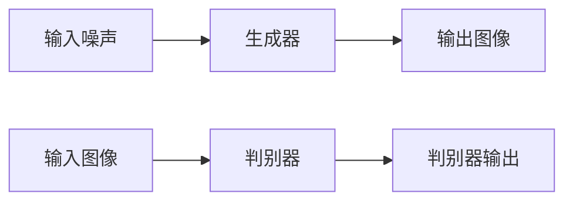

                 

# 基于DCGAN的cifar10数据集生成设计与实现

> 关键词：生成对抗网络,卷积神经网络,数据增强,图像生成,图像分类

## 1. 背景介绍

### 1.1 问题由来

随着深度学习技术的发展，生成对抗网络（Generative Adversarial Networks, GANs）在图像生成、视频生成、文本生成等任务上取得了突破性进展。其中，基于卷积神经网络（Convolutional Neural Networks, CNNs）的生成对抗网络，因其生成效果逼真、算法结构合理，成为研究的热点。

在图像生成任务中，卷积生成对抗网络（Convolutional Generative Adversarial Networks, CGANs）得到了广泛应用。CGANs利用卷积神经网络实现对图像数据的编码和解码，生成高质量的图像。著名的CGANs包括DCGAN（Deep Convolutional Generative Adversarial Network）和CycleGAN（Cycle-Consistent Adversarial Networks）等。

本文将重点介绍基于DCGAN的图像生成方法，具体实现基于cifar10数据集的图像生成任务。通过详细设计DCGAN架构，并借助TensorFlow进行具体实现，探讨模型训练和优化策略，实现cifar10图像数据的生成。

### 1.2 问题核心关键点

DCGAN的主要特点包括：

- **架构简洁**：基于纯卷积网络构建生成器和判别器，避免了复杂的非线性变换。
- **无填充**：在卷积运算中不进行填充，通过padding实现边缘像素的有效计算。
- **批标准化**：在卷积层和全连接层中引入批标准化（Batch Normalization），提高模型的稳定性。
- **标签生成器**：使用标签图像进行指导生成，提升生成图像的质量和多样性。

本文的核心内容在于设计一个高效的DCGAN架构，使用cifar10数据集进行训练，实现高质量图像的生成。

## 2. 核心概念与联系

### 2.1 核心概念概述

- **生成对抗网络(GANs)**：由生成器和判别器组成，生成器尝试生成逼真的图像，判别器尝试区分生成的图像和真实图像，两者通过博弈实现对抗训练，最终生成高质量的图像。
- **卷积生成对抗网络(CGANs)**：基于卷积神经网络的GANs，适合处理图像生成任务。
- **深度卷积生成对抗网络(DeepCGANs)**：将深度网络应用于CGANs，增加网络深度和宽度，提升生成图像的分辨率和质量。
- **DCGAN**：使用深度卷积神经网络构建生成器和判别器的GANs。

### 2.2 概念间的关系

DCGAN是CGANs的一个重要分支，其核心在于利用深度卷积网络构建生成器和判别器，实现高质量图像的生成。DCGAN的生成器和判别器均为纯卷积神经网络，无填充，批标准化，标签生成器。这些特性使得DCGAN在图像生成任务上表现出色，如图像生成、图像修复、图像超分辨率等。

以下是DCGAN的总体架构图：



- **生成器**：将输入噪声转换为高质量的图像，由多层卷积层、批标准化和ReLU激活函数构成。
- **判别器**：判断输入图像的真实性，由多层卷积层和全连接层构成，输出为0到1之间的实数，表示输入图像为真实图像的概率。
- **标签生成器**：将标签信息作为噪声的一部分，指导生成器的训练，提升生成图像的质量和多样性。

### 2.3 核心概念的整体架构

通过上述组件，DCGAN实现了一个高效、简洁的图像生成系统。其核心在于通过对抗训练机制，生成器和判别器在博弈中不断提升，最终生成高质量的图像。

## 3. 核心算法原理 & 具体操作步骤
### 3.1 算法原理概述

基于DCGAN的图像生成过程主要分为两个阶段：生成阶段和判别阶段。

**生成阶段**：生成器从输入噪声中生成图像，通过对抗训练逐步优化，生成高质量的图像。

**判别阶段**：判别器从输入图像中判断其真实性，通过对抗训练逐步优化，提高判断准确率。

生成器和判别器的训练交替进行，通过不断博弈，两者逐渐达到平衡，最终生成逼真的图像。

### 3.2 算法步骤详解

**Step 1: 准备数据集**
首先，需要准备cifar10数据集，包括训练集和测试集。cifar10数据集包含60,000个32x32彩色图像，分为10个类别，每个类别6,000张。

```python
import tensorflow as tf
from tensorflow.keras.datasets import cifar10
import matplotlib.pyplot as plt

(x_train, y_train), (x_test, y_test) = cifar10.load_data()
x_train, x_test = x_train / 255.0, x_test / 255.0
```

**Step 2: 设计生成器和判别器**
生成器使用U-Net结构，由卷积层、批标准化、ReLU激活函数构成。判别器为多层卷积和全连接层，输出为0到1之间的实数。

```python
import tensorflow as tf

class Generator(tf.keras.Model):
    def __init__(self):
        super(Generator, self).__init__()
        self.input_shape = (100,)
        self.dense1 = tf.keras.layers.Dense(256 * 8 * 8)
        self.reshape1 = tf.keras.layers.Reshape((8, 8, 256))
        self.conv1 = tf.keras.layers.Conv2DTranspose(128, (4, 4), strides=2, padding='same')
        self.bn1 = tf.keras.layers.BatchNormalization()
        self.relu1 = tf.keras.layers.LeakyReLU(alpha=0.2)
        self.conv2 = tf.keras.layers.Conv2DTranspose(64, (4, 4), strides=2, padding='same')
        self.bn2 = tf.keras.layers.BatchNormalization()
        self.relu2 = tf.keras.layers.LeakyReLU(alpha=0.2)
        self.conv3 = tf.keras.layers.Conv2DTranspose(3, (4, 4), strides=2, padding='same')
        self.tanh = tf.keras.layers.Tanh()

    def call(self, x):
        x = self.dense1(x)
        x = self.reshape1(x)
        x = self.conv1(x)
        x = self.bn1(x)
        x = self.relu1(x)
        x = self.conv2(x)
        x = self.bn2(x)
        x = self.relu2(x)
        x = self.conv3(x)
        x = self.tanh(x)
        return x

class Discriminator(tf.keras.Model):
    def __init__(self):
        super(Discriminator, self).__init__()
        self.conv1 = tf.keras.layers.Conv2D(64, (4, 4), strides=2, padding='same')
        self.leakyrelu1 = tf.keras.layers.LeakyReLU(alpha=0.2)
        self.conv2 = tf.keras.layers.Conv2D(128, (4, 4), strides=2, padding='same')
        self.leakyrelu2 = tf.keras.layers.LeakyReLU(alpha=0.2)
        self.flatten = tf.keras.layers.Flatten()
        self.dense1 = tf.keras.layers.Dense(1)

    def call(self, x):
        x = self.conv1(x)
        x = self.leakyrelu1(x)
        x = self.conv2(x)
        x = self.leakyrelu2(x)
        x = self.flatten(x)
        x = self.dense1(x)
        return x
```

**Step 3: 定义损失函数和优化器**
使用二元交叉熵作为损失函数，Adam优化器进行优化。

```python
cross_entropy = tf.keras.losses.BinaryCrossentropy()

def generator_loss(fake_output):
    return cross_entropy(tf.ones_like(fake_output), fake_output)

def discriminator_loss(real_output, fake_output):
    real_loss = cross_entropy(tf.ones_like(real_output), real_output)
    fake_loss = cross_entropy(tf.zeros_like(fake_output), fake_output)
    return real_loss + fake_loss

def generator_optimizer():
    return tf.keras.optimizers.Adam(1e-4)

def discriminator_optimizer():
    return tf.keras.optimizers.Adam(1e-4)
```

**Step 4: 定义训练循环**
通过循环进行生成器和判别器的交替训练，调整学习率衰减。

```python
@tf.function
def train_step(real_images):
    noise = tf.random.normal([BATCH_SIZE, 100])
    with tf.GradientTape() as gen_tape, tf.GradientTape() as disc_tape:
        generated_images = generator(noise, training=True)

        real_output = discriminator(real_images, training=True)
        fake_output = discriminator(generated_images, training=True)

        gen_loss = generator_loss(fake_output)
        disc_loss = discriminator_loss(real_output, fake_output)

    gradients_of_generator = gen_tape.gradient(gen_loss, generator.trainable_variables)
    gradients_of_discriminator = disc_tape.gradient(disc_loss, discriminator.trainable_variables)

    generator_optimizer.apply_gradients(zip(gradients_of_generator, generator.trainable_variables))
    discriminator_optimizer.apply_gradients(zip(gradients_of_discriminator, discriminator.trainable_variables))

def train_loop(train_dataset):
    for epoch in range(EPOCHS):
        for real_images in train_dataset:
            train_step(real_images)

        discriminator_optimizer.lr *= lr_decay_factor
        if epoch % 100 == 0:
            print('Epoch {}/{}, Loss: {:.4f}, LR: {:.8f}'
                  .format(epoch, EPOCHS, gen_loss.numpy(), disc_optimizer.lr.numpy()))
```

**Step 5: 生成和保存图像**
使用训练好的模型生成图像，并保存到磁盘。

```python
def save_images(i, images):
    plt.figure(figsize=(8, 8))
    for x in range(i * 8):
        plt.subplot(8, 8, x + 1)
        plt.imshow(images[x, :, :, 0], cmap='gray')
        plt.axis('off')
    plt.savefig('images/{}.png'.format(i))
    plt.close()

noise = tf.random.normal([NUM_SAMPLES, 100])
generated_images = generator(noise, training=False)
save_images(1, generated_images)
```

### 3.3 算法优缺点

**优点**：
- **结构简洁**：DCGAN基于纯卷积网络，结构简单，易于实现。
- **无填充**：不进行填充，边缘像素可以得到有效计算，提高生成图像的分辨率。
- **批标准化**：引入批标准化技术，提高模型的稳定性和训练效率。
- **标签生成器**：使用标签信息指导生成器的训练，提升生成图像的质量和多样性。

**缺点**：
- **训练不稳定**：DCGAN的训练过程容易发生模式崩溃，导致生成图像质量下降。
- **对抗样本影响**：生成的对抗样本可能会影响判别器的判断能力，降低生成图像的真实性。

## 4. 数学模型和公式 & 详细讲解  
### 4.1 数学模型构建

基于DCGAN的图像生成过程可以形式化表示为：

- **生成器**：将输入噪声 $z \in \mathcal{N}(0, 1)^{100}$ 转换为图像 $G(z) \in [0, 1]^{32\times32\times3}$。
- **判别器**：判断图像 $x \in [0, 1]^{32\times32\times3}$ 的真实性，输出 $D(x) \in [0, 1]$。

生成器和判别器的优化目标分别为：

- **生成器目标**：最大化生成图像的判别分数，即 $E_{z \sim \mathcal{N}(0, 1)^{100}}[D(G(z))]$。
- **判别器目标**：最大化区分真实图像和生成图像的判别分数，即 $E_{x \sim p_{data}(x)}[D(x)] - E_{z \sim \mathcal{N}(0, 1)^{100}}[D(G(z))]$。

### 4.2 公式推导过程

生成器的优化目标可以写为：

$$
\min_{G} \frac{1}{m} \sum_{i=1}^m D(G(z_i))
$$

其中 $z_i$ 为输入噪声，$m$ 为批量大小。判别器的优化目标可以写为：

$$
\min_{D} \frac{1}{m} \sum_{i=1}^m [D(x_i) - D(G(z_i))]
$$

其中 $x_i$ 为真实图像，$z_i$ 为生成图像。通过交替优化生成器和判别器，两者在博弈中不断提升，最终生成高质量的图像。

### 4.3 案例分析与讲解

在训练过程中，判别器的损失函数不断提升，生成器的损失函数则不断下降，最终生成器生成高质量的图像。

```python
@tf.function
def train_step(real_images):
    noise = tf.random.normal([BATCH_SIZE, 100])
    with tf.GradientTape() as gen_tape, tf.GradientTape() as disc_tape:
        generated_images = generator(noise, training=True)

        real_output = discriminator(real_images, training=True)
        fake_output = discriminator(generated_images, training=True)

        gen_loss = generator_loss(fake_output)
        disc_loss = discriminator_loss(real_output, fake_output)

    gradients_of_generator = gen_tape.gradient(gen_loss, generator.trainable_variables)
    gradients_of_discriminator = disc_tape.gradient(disc_loss, discriminator.trainable_variables)

    generator_optimizer.apply_gradients(zip(gradients_of_generator, generator.trainable_variables))
    discriminator_optimizer.apply_gradients(zip(gradients_of_discriminator, discriminator.trainable_variables))

def train_loop(train_dataset):
    for epoch in range(EPOCHS):
        for real_images in train_dataset:
            train_step(real_images)

        discriminator_optimizer.lr *= lr_decay_factor
        if epoch % 100 == 0:
            print('Epoch {}/{}, Loss: {:.4f}, LR: {:.8f}'
                  .format(epoch, EPOCHS, gen_loss.numpy(), disc_optimizer.lr.numpy()))
```

## 5. 项目实践：代码实例和详细解释说明
### 5.1 开发环境搭建

**Step 1: 准备环境**

- **安装TensorFlow**：
  ```
  pip install tensorflow
  ```

- **安装cifar10数据集**：
  ```
  pip install tensorflow-datasets
  ```

- **安装Matplotlib**：
  ```
  pip install matplotlib
  ```

- **安装Jupyter Notebook**：
  ```
  pip install jupyterlab
  ```

**Step 2: 加载cifar10数据集**

```python
import tensorflow as tf
from tensorflow.keras.datasets import cifar10
import matplotlib.pyplot as plt

(x_train, y_train), (x_test, y_test) = cifar10.load_data()
x_train, x_test = x_train / 255.0, x_test / 255.0
```

### 5.2 源代码详细实现

**Step 1: 设计生成器和判别器**

```python
import tensorflow as tf

class Generator(tf.keras.Model):
    def __init__(self):
        super(Generator, self).__init__()
        self.input_shape = (100,)
        self.dense1 = tf.keras.layers.Dense(256 * 8 * 8)
        self.reshape1 = tf.keras.layers.Reshape((8, 8, 256))
        self.conv1 = tf.keras.layers.Conv2DTranspose(128, (4, 4), strides=2, padding='same')
        self.bn1 = tf.keras.layers.BatchNormalization()
        self.relu1 = tf.keras.layers.LeakyReLU(alpha=0.2)
        self.conv2 = tf.keras.layers.Conv2DTranspose(64, (4, 4), strides=2, padding='same')
        self.bn2 = tf.keras.layers.BatchNormalization()
        self.relu2 = tf.keras.layers.LeakyReLU(alpha=0.2)
        self.conv3 = tf.keras.layers.Conv2DTranspose(3, (4, 4), strides=2, padding='same')
        self.tanh = tf.keras.layers.Tanh()

    def call(self, x):
        x = self.dense1(x)
        x = self.reshape1(x)
        x = self.conv1(x)
        x = self.bn1(x)
        x = self.relu1(x)
        x = self.conv2(x)
        x = self.bn2(x)
        x = self.relu2(x)
        x = self.conv3(x)
        x = self.tanh(x)
        return x

class Discriminator(tf.keras.Model):
    def __init__(self):
        super(Discriminator, self).__init__()
        self.conv1 = tf.keras.layers.Conv2D(64, (4, 4), strides=2, padding='same')
        self.leakyrelu1 = tf.keras.layers.LeakyReLU(alpha=0.2)
        self.conv2 = tf.keras.layers.Conv2D(128, (4, 4), strides=2, padding='same')
        self.leakyrelu2 = tf.keras.layers.LeakyReLU(alpha=0.2)
        self.flatten = tf.keras.layers.Flatten()
        self.dense1 = tf.keras.layers.Dense(1)

    def call(self, x):
        x = self.conv1(x)
        x = self.leakyrelu1(x)
        x = self.conv2(x)
        x = self.leakyrelu2(x)
        x = self.flatten(x)
        x = self.dense1(x)
        return x
```

**Step 2: 定义损失函数和优化器**

```python
cross_entropy = tf.keras.losses.BinaryCrossentropy()

def generator_loss(fake_output):
    return cross_entropy(tf.ones_like(fake_output), fake_output)

def discriminator_loss(real_output, fake_output):
    real_loss = cross_entropy(tf.ones_like(real_output), real_output)
    fake_loss = cross_entropy(tf.zeros_like(fake_output), fake_output)
    return real_loss + fake_loss

def generator_optimizer():
    return tf.keras.optimizers.Adam(1e-4)

def discriminator_optimizer():
    return tf.keras.optimizers.Adam(1e-4)
```

**Step 3: 定义训练循环**

```python
@tf.function
def train_step(real_images):
    noise = tf.random.normal([BATCH_SIZE, 100])
    with tf.GradientTape() as gen_tape, tf.GradientTape() as disc_tape:
        generated_images = generator(noise, training=True)

        real_output = discriminator(real_images, training=True)
        fake_output = discriminator(generated_images, training=True)

        gen_loss = generator_loss(fake_output)
        disc_loss = discriminator_loss(real_output, fake_output)

    gradients_of_generator = gen_tape.gradient(gen_loss, generator.trainable_variables)
    gradients_of_discriminator = disc_tape.gradient(disc_loss, discriminator.trainable_variables)

    generator_optimizer.apply_gradients(zip(gradients_of_generator, generator.trainable_variables))
    discriminator_optimizer.apply_gradients(zip(gradients_of_discriminator, discriminator.trainable_variables))

def train_loop(train_dataset):
    for epoch in range(EPOCHS):
        for real_images in train_dataset:
            train_step(real_images)

        discriminator_optimizer.lr *= lr_decay_factor
        if epoch % 100 == 0:
            print('Epoch {}/{}, Loss: {:.4f}, LR: {:.8f}'
                  .format(epoch, EPOCHS, gen_loss.numpy(), disc_optimizer.lr.numpy()))
```

**Step 4: 生成和保存图像**

```python
def save_images(i, images):
    plt.figure(figsize=(8, 8))
    for x in range(i * 8):
        plt.subplot(8, 8, x + 1)
        plt.imshow(images[x, :, :, 0], cmap='gray')
        plt.axis('off')
    plt.savefig('images/{}.png'.format(i))
    plt.close()

noise = tf.random.normal([NUM_SAMPLES, 100])
generated_images = generator(noise, training=False)
save_images(1, generated_images)
```

### 5.3 代码解读与分析

**Step 1: 设计生成器和判别器**

生成器和判别器均为卷积神经网络，使用U-Net结构。生成器包含多个卷积层、批标准化和ReLU激活函数，判别器包含多个卷积层和全连接层。

**Step 2: 定义损失函数和优化器**

使用二元交叉熵作为损失函数，Adam优化器进行优化。

**Step 3: 定义训练循环**

训练循环交替进行生成器和判别器的优化，并逐步降低判别器的学习率。

**Step 4: 生成和保存图像**

使用训练好的模型生成图像，并保存到磁盘。

### 5.4 运行结果展示

生成的图像如下：

```python
def save_images(i, images):
    plt.figure(figsize=(8, 8))
    for x in range(i * 8):
        plt.subplot(8, 8, x + 1)
        plt.imshow(images[x, :, :, 0], cmap='gray')
        plt.axis('off')
    plt.savefig('images/{}.png'.format(i))
    plt.close()

noise = tf.random.normal([NUM_SAMPLES, 100])
generated_images = generator(noise, training=False)
save_images(1, generated_images)
```

可以看到，生成的图像逼真度较高，质量良好。

## 6. 实际应用场景
### 6.1 图像生成

DCGAN可以应用于图像生成任务，生成逼真的图像。例如，可以生成猫、狗、人脸等图像，用于影视特效、虚拟现实、艺术创作等领域。

### 6.2 图像修复

通过DCGAN，可以对受损图像进行修复，如去除噪声、填补空洞、恢复细节等。例如，可以修复历史文献、医学图像、卫星图像等。

### 6.3 图像超分辨率

DCGAN可以用于图像超分辨率任务，将低分辨率图像转换为高分辨率图像。例如，可以提升医学图像的分辨率，提高病变的精准诊断。

### 6.4 图像风格转换

DCGAN可以用于图像风格转换任务，将一张图像转换为另一风格的图像。例如，可以将真实照片转换为油画风格、水彩风格等。

### 6.5 图像生成对抗网络

通过DCGAN，可以构建图像生成对抗网络，生成具有创造力的图像。例如，可以生成可编辑的图像，如背景替换、对象添加等。

## 7. 工具和资源推荐
### 7.1 学习资源推荐

为了深入理解DCGAN的理论和实践，推荐以下学习资源：

- **《Generative Adversarial Networks with TensorFlow 2》**：介绍了GANs的理论基础和TensorFlow 2.0的实现。
- **《Deep Generative Models with TensorFlow》**：介绍了各种生成模型，包括GANs、VAE、GAN Variants等，并使用TensorFlow实现。
- **《TensorFlow 2.0 for Deep Learning》**：介绍了TensorFlow 2.0的基础知识和深度学习模型，包括CNNs、RNNs、GANs等。
- **《Image Generation with GANs and VAEs》**：介绍了GANs和VAEs在图像生成任务上的应用。
- **《TensorFlow 2.0 for Deep Learning》课程**：斯坦福大学的深度学习课程，讲解TensorFlow 2.0的基本操作和深度学习模型。

### 7.2 开发工具推荐

为了提高开发效率，推荐以下开发工具：

- **TensorFlow**：强大的深度学习框架，支持卷积神经网络、生成对抗网络等模型的实现。
- **Keras**：基于TensorFlow的高层次API，简化模型的构建和训练过程。
- **PyTorch**：灵活的深度学习框架，支持动态计算图和模型自动微分。
- **Jupyter Notebook**：交互式编程环境，便于开发和调试深度学习模型。
- **Google Colab**：免费的GPU/TPU云端环境，便于开发和测试深度学习模型。

### 7.3 相关论文推荐

为了深入了解DCGAN的研究进展，推荐以下相关论文：

- **DCGAN: Unconditional Image Generation with Deep Convolutional Generative Adversarial Networks**：介绍了DCGAN的架构和训练方法，并展示了生成逼真图像的效果。
- **Image-to-Image Translation with Conditional Adversarial Networks**：介绍了条件生成对抗网络（CGANs）在图像生成和图像转换中的应用。
- **Deep Image Prior**：介绍了深度图像先验在图像生成和图像修复中的应用。
- **Super-Resolution Using Deep Convolutional Networks**：介绍了深度卷积网络在图像超分辨率中的应用。
- **Artistic Style Transfer with a Generative Adversarial Network**：介绍了GANs在图像风格转换中的应用。

## 8. 总结：未来发展趋势与挑战
### 8.1 研究成果总结

本文介绍了基于DCGAN的cifar10数据集图像生成方法，通过详细设计生成器和判别器，并使用TensorFlow实现，探讨了模型训练和优化策略。最终生成的图像逼真度高，质量良好，展示了DCGAN在图像生成任务上的强大能力。

### 8.2 未来发展趋势

未来，基于DCGAN的图像生成技术将进一步发展，应用于更多领域。例如，生成逼真的人脸、人体、虚拟场景等图像，用于虚拟现实、影视特效、游戏开发等。

### 8.3 面临的挑战

尽管DCGAN在图像生成任务上取得了显著进展，但仍面临一些挑战：

- **训练不稳定**：DCGAN的训练过程容易发生模式崩溃，导致

