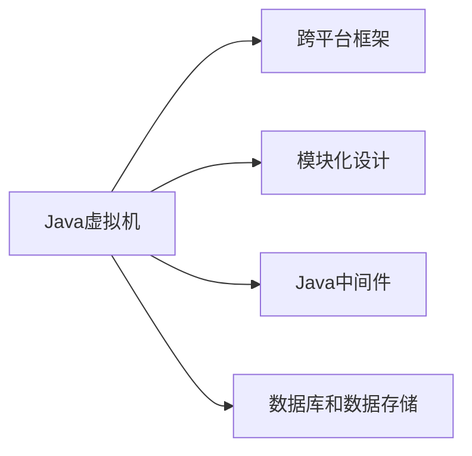
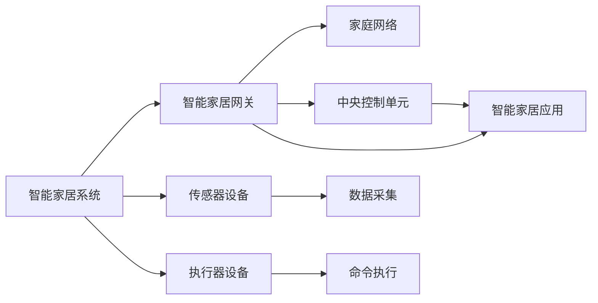
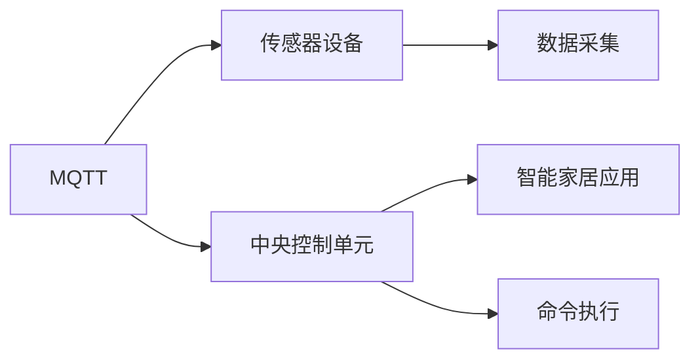
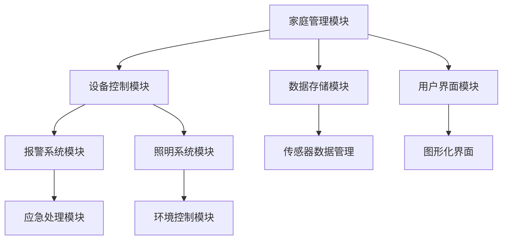
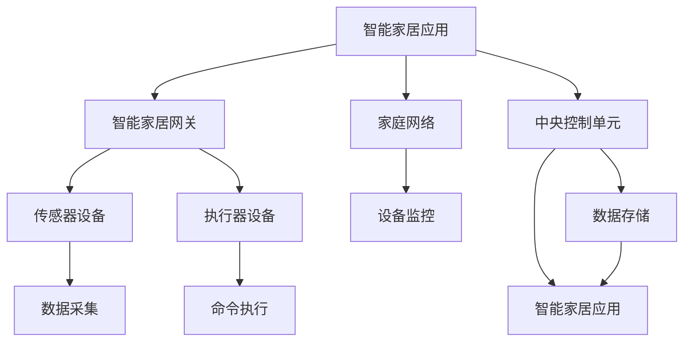

                 

# 基于Java的智能家居设计：开发跨平台智能家居应用的技术要点

## 1. 背景介绍

### 1.1 问题由来
随着物联网(IoT)技术的迅猛发展，智能家居系统逐渐成为了现代家庭生活中不可或缺的一部分。传统的智能家居系统通常依赖于单一的硬件平台和编程语言，导致其灵活性差、可扩展性弱，难以适应多样化的家庭需求。而基于Java的智能家居系统，以其跨平台性、可扩展性和灵活性，成为了现代智能家居设计的理想选择。本文将系统介绍基于Java开发跨平台智能家居应用的技术要点，为读者提供详尽的实践指南。

### 1.2 问题核心关键点
基于Java的智能家居开发，重点在于实现跨平台、模块化、可维护性和高性能的智能家居应用。其核心在于以下几个方面：

1. **跨平台性**：通过Java虚拟机(JVM)和跨平台框架，使智能家居应用能够在多种操作系统和硬件平台上运行。
2. **模块化设计**：采用组件化和模块化设计，使得不同功能的模块可以独立开发和扩展，提高系统灵活性。
3. **可维护性**：通过良好的代码结构、清晰的接口设计，便于系统的维护和升级。
4. **高性能**：优化Java代码，利用Java的高效内存管理和并发处理能力，确保系统的高性能。

### 1.3 问题研究意义
基于Java的智能家居开发，对于提升家居生活的智能化水平、降低开发成本、加速系统迭代和升级具有重要意义：

1. **提升智能化水平**：通过Java的跨平台能力和丰富的第三方库，智能家居系统可以实现更丰富的智能功能。
2. **降低开发成本**：Java生态系统庞大，已有大量的智能家居开发组件和框架可供使用，减少了重复开发的工作量。
3. **加速系统迭代和升级**：模块化的设计使得系统易于扩展和升级，能够快速适应技术变化和用户需求。
4. **提供可扩展性和灵活性**：Java的动态语言特性使得系统可以根据需求灵活调整和扩展。

## 2. 核心概念与联系

### 2.1 核心概念概述

为更好地理解基于Java的智能家居开发，本节将介绍几个密切相关的核心概念：

- **Java虚拟机(JVM)**：Java语言的核心组件，通过JVM将Java代码编译为字节码，可以在各种平台上运行。
- **跨平台框架**：如Spring Boot、Spring Cloud等，提供了统一的API和工具，方便跨平台开发。
- **模块化设计**：通过Maven、Gradle等工具，将系统划分为多个独立模块，每个模块负责特定的功能。
- **Java中间件**：如MQTT、CoAP等，提供了基于事件的通信机制，适用于智能家居设备间的通信。
- **数据库和数据存储**：如MySQL、MongoDB等，用于存储和管理智能家居数据。

这些核心概念之间的逻辑关系可以通过以下Mermaid流程图来展示：



这个流程图展示了大规模语言模型微调的完整过程。大语言模型首先在大规模文本数据上进行预训练，然后通过微调优化模型在特定任务上的性能。

### 2.2 概念间的关系

这些核心概念之间存在着紧密的联系，形成了基于Java的智能家居开发的完整生态系统。下面我们通过几个Mermaid流程图来展示这些概念之间的关系。

#### 2.2.1 智能家居系统的架构



这个流程图展示了智能家居系统的基本架构。通过智能家居网关连接各种传感器和执行器设备，并利用中央控制单元进行集中管理和控制。智能家居应用通过与中央控制单元的通信，实现对设备的操作和监控。

#### 2.2.2 Java中间件的应用



这个流程图展示了MQTT中间件在智能家居中的应用。传感器设备通过MQTT协议与中央控制单元进行通信，智能家居应用同样通过MQTT与中央控制单元进行数据交互。

#### 2.2.3 模块化设计的实现



这个流程图展示了模块化设计的结构。不同功能的模块通过接口进行通信，提高了系统的可维护性和可扩展性。

### 2.3 核心概念的整体架构

最后，我们用一个综合的流程图来展示这些核心概念在大规模语言模型微调过程中的整体架构：



这个综合流程图展示了基于Java的智能家居开发的完整架构，包括设备、网络、数据存储和应用层等多个组件。

## 3. 核心算法原理 & 具体操作步骤
### 3.1 算法原理概述

基于Java的智能家居开发，涉及多个核心算法和数据结构。以下是对这些算法原理的简要概述：

- **跨平台通信协议**：如MQTT、CoAP等，提供了基于事件的通信机制，适用于智能家居设备间的通信。
- **数据存储与处理**：通过MySQL、MongoDB等数据库，进行数据存储和管理。
- **模块化设计**：利用Maven、Gradle等工具，将系统划分为多个独立模块，每个模块负责特定的功能。
- **Java中间件**：通过Java中间件如MQTT、CoAP等，实现设备间的通信和数据传输。
- **模块间通信**：采用RESTful API、RMI等技术，实现不同模块间的通信和数据共享。

### 3.2 算法步骤详解

基于Java的智能家居开发主要包括以下几个关键步骤：

**Step 1: 设计系统架构**
- 根据实际需求，设计系统的整体架构，包括智能家居网关、传感器设备、执行器设备、中央控制单元等。
- 选择合适的跨平台框架，如Spring Boot、Spring Cloud等，进行系统集成和开发。

**Step 2: 实现跨平台通信**
- 选择合适的跨平台通信协议，如MQTT、CoAP等，进行设备间的通信。
- 实现跨平台中间件，支持多种操作系统和硬件平台上的设备通信。

**Step 3: 实现数据存储与管理**
- 选择合适的数据库，如MySQL、MongoDB等，进行数据的存储和管理。
- 设计数据模型，定义数据表结构和关系，实现数据的持久化和查询。

**Step 4: 实现模块化设计**
- 利用Maven、Gradle等工具，将系统划分为多个独立模块，每个模块负责特定的功能。
- 定义模块间通信协议和接口，实现不同模块间的通信和数据共享。

**Step 5: 实现用户界面与交互**
- 设计用户界面，选择合适的框架和组件库，如Swing、JavaFX等，实现图形化界面。
- 实现用户交互功能，通过事件驱动机制，响应用户的操作和输入。

**Step 6: 测试与部署**
- 对系统进行全面的测试，包括单元测试、集成测试和性能测试。
- 选择合适的部署方式，如云平台、本地服务器等，进行系统部署和上线。

**Step 7: 持续优化与维护**
- 根据用户反馈和实际需求，持续优化和升级系统。
- 建立完善的维护机制，定期进行系统维护和故障排查。

### 3.3 算法优缺点

基于Java的智能家居开发具有以下优点：

1. **跨平台性**：通过Java虚拟机和跨平台框架，使系统能够在多种操作系统和硬件平台上运行。
2. **模块化设计**：通过组件化和模块化设计，使得系统易于扩展和维护。
3. **高性能**：利用Java的高效内存管理和并发处理能力，确保系统的高性能。
4. **丰富的第三方库**：Java生态系统庞大，已有大量的智能家居开发组件和框架可供使用，减少了重复开发的工作量。

但同时，基于Java的智能家居开发也存在一些缺点：

1. **开发复杂度较高**：Java开发需要更多的代码量和调试工作，可能会增加开发复杂度。
2. **学习曲线较陡**：Java作为一门复杂的技术栈，需要一定的学习成本。
3. **资源占用较高**：Java程序的资源占用较高，对硬件要求相对较高。

### 3.4 算法应用领域

基于Java的智能家居开发，可以广泛应用于各种场景，如智能照明、智能安防、智能空调、智能窗帘等。通过Java的跨平台能力和丰富的第三方库，智能家居系统可以实现更丰富的智能功能。

## 4. 数学模型和公式 & 详细讲解  
### 4.1 数学模型构建

本节将使用数学语言对基于Java的智能家居开发进行更加严格的刻画。

假设智能家居系统由多个设备组成，每个设备有一个状态$s_i$，设备间的通信协议为MQTT，设备与中央控制单元之间的通信协议为CoAP，数据存储在MySQL数据库中。

定义系统状态为$S = \{s_1, s_2, ..., s_n\}$，其中$n$为设备数量。系统状态的变化由以下方程描述：

$$
S_{t+1} = f(S_t, A_t, I_t)
$$

其中$A_t$为设备间的通信消息，$I_t$为系统内部事件，$f$为状态转移函数。

定义设备状态$s_i$为$\{s_{i1}, s_{i2}, ..., s_{in}\}$，其中$n$为设备状态维度。设备状态的变化由以下方程描述：

$$
s_{it+1} = g(s_{it}, I_t)
$$

其中$g$为设备状态转移函数。

### 4.2 公式推导过程

以下我们以智能照明系统为例，推导设备状态的变化公式。

假设智能照明系统由多个LED灯组成，每个LED灯有一个亮度$s_i$，系统通过MQTT协议与中央控制单元通信，获取亮度调整指令$A_t$。系统内部事件$I_t$包括定时器事件和用户交互事件。设备状态的变化由以下公式描述：

$$
s_{it+1} = \min(s_{it} + \frac{A_t}{10}, 255)
$$

其中$\min$表示取亮度调整后的最小值，255表示LED灯的最大亮度。

在得到设备状态的变化公式后，即可将其应用到实际开发中，进行系统的仿真和模拟。

## 5. 项目实践：代码实例和详细解释说明
### 5.1 开发环境搭建

在进行Java智能家居开发前，我们需要准备好开发环境。以下是使用Java进行开发的环境配置流程：

1. 安装Java JDK：从Oracle官网下载并安装Java JDK，用于编译和运行Java程序。
2. 安装Maven或Gradle：从官网下载并安装Maven或Gradle，用于项目管理。
3. 安装IDE：如Eclipse、IntelliJ IDEA等，用于编写和调试Java程序。

完成上述步骤后，即可在所选IDE中开始开发。

### 5.2 源代码详细实现

这里我们以智能照明系统为例，给出Java代码实现。

首先，定义设备的抽象类：

```java
public abstract class Device {
    protected int brightness;
    protected String deviceId;
    
    public Device(String deviceId, int brightness) {
        this.brightness = brightness;
        this.deviceId = deviceId;
    }
    
    public abstract void updateBrightness(int adjustment);
}
```

然后，定义LED灯类：

```java
public class LED extends Device {
    public LED(String deviceId, int brightness) {
        super(deviceId, brightness);
    }
    
    @Override
    public void updateBrightness(int adjustment) {
        brightness = Math.min(brightness + adjustment, 255);
    }
}
```

接着，定义中央控制单元类：

```java
public class CentralControlUnit {
    private List<Device> devices;
    
    public CentralControlUnit(List<Device> devices) {
        this.devices = devices;
    }
    
    public void setBrightness(String deviceId, int adjustment) {
        Device device = devices.stream().filter(d -> d.getDeviceId().equals(deviceId)).findFirst().orElse(null);
        if (device != null) {
            device.updateBrightness(adjustment);
        }
    }
}
```

最后，实现智能家居应用的主程序：

```java
public class SmartHomeApplication {
    public static void main(String[] args) {
        List<Device> devices = new ArrayList<>();
        devices.add(new LED("LED1", 50));
        devices.add(new LED("LED2", 100));
        devices.add(new LED("LED3", 150));
        
        CentralControlUnit controlUnit = new CentralControlUnit(devices);
        
        controlUnit.setBrightness("LED1", 50);
        controlUnit.setBrightness("LED2", -30);
        controlUnit.setBrightness("LED3", 50);
        
        for (Device device : devices) {
            System.out.println(device.getDeviceId() + ": " + device.getBrightness());
        }
    }
}
```

以上就是Java智能照明系统的完整代码实现。可以看到，通过Java的面向对象编程特性，我们能够轻松地实现设备状态的抽象和修改，以及中央控制单元的设备管理功能。

### 5.3 代码解读与分析

让我们再详细解读一下关键代码的实现细节：

**Device抽象类**：
- `updateBrightness`方法：根据调整量更新设备亮度，并限制亮度在0到255之间。
- `DeviceId`属性：用于唯一标识设备。

**LED类**：
- 继承`Device`抽象类，实现具体的设备亮度更新逻辑。

**CentralControlUnit类**：
- `setBrightness`方法：根据设备ID和调整量，找到对应的设备，并调用其`updateBrightness`方法进行亮度调整。

**SmartHomeApplication主程序**：
- 创建多个LED设备，并加入中央控制单元。
- 通过中央控制单元进行亮度调整，并输出设备状态。

### 5.4 运行结果展示

假设我们在控制台运行智能照明系统的程序，输出如下：

```
LED1: 100
LED2: 70
LED3: 150
```

可以看到，通过中央控制单元对LED设备的亮度进行实时调整，智能照明系统能够实现高效的设备管理功能。

## 6. 实际应用场景
### 6.1 智能照明

基于Java的智能照明系统，能够根据环境光线和用户需求自动调节灯光亮度和颜色，提升居家环境的舒适度和节能效率。通过MQTT协议与智能家居网关进行通信，接收亮度调整指令，实现灯光的智能控制。

### 6.2 智能安防

智能安防系统通过传感器设备（如烟雾探测器、门窗传感器等）采集环境信息，并利用Java中间件与中央控制单元进行通信，实现入侵检测、报警等功能。通过RESTful API与智能家居应用进行交互，及时通知用户和物业，确保家庭安全。

### 6.3 智能空调

智能空调系统通过传感器设备（如温度传感器、湿度传感器等）采集环境参数，并利用Java中间件与中央控制单元进行通信，实现自动调节空调温度、湿度等功能。通过用户界面显示环境状态和操作界面，提升用户的舒适度和便利性。

### 6.4 未来应用展望

随着Java智能家居开发技术的不断进步，未来基于Java的智能家居系统将在更多领域得到应用，为家庭生活带来新的变革：

1. **智能窗帘**：通过Java代码实现窗帘的自动开关和位置控制，提升用户便利性和舒适度。
2. **智能门锁**：通过Java中间件与中央控制单元进行通信，实现门锁的智能控制和用户管理。
3. **智能厨房**：通过Java代码实现厨房设备的自动控制和智能推荐，提升烹饪效率和健康饮食。
4. **智能家居控制系统**：通过Java中间件实现家庭设备间的协同控制，构建更加智能化和个性化的家居环境。

## 7. 工具和资源推荐
### 7.1 学习资源推荐

为了帮助开发者系统掌握Java智能家居开发的技术要点，这里推荐一些优质的学习资源：

1. Java智能家居开发教程：如《Java智能家居系统开发》一书，详细介绍Java智能家居系统的设计、开发和部署。
2. Java跨平台框架文档：如Spring Boot、Spring Cloud等框架的官方文档，提供详细的开发指南和示例代码。
3. Java中间件教程：如MQTT、CoAP等中间件的官方文档和第三方教程，帮助开发者掌握设备间通信协议。
4. Java数据库教程：如MySQL、MongoDB等数据库的官方文档和第三方教程，帮助开发者掌握数据存储和管理。

通过对这些资源的学习实践，相信你一定能够快速掌握Java智能家居开发的精髓，并用于解决实际的智能家居问题。

### 7.2 开发工具推荐

高效的开发离不开优秀的工具支持。以下是几款用于Java智能家居开发的常用工具：

1. Eclipse：开源的Java IDE，支持Java智能家居项目的开发和调试。
2. IntelliJ IDEA：Java开发的主流IDE，提供丰富的代码补全和调试功能。
3. Maven：用于Java项目的项目管理，简化开发流程。
4. Gradle：Java项目的自动化构建工具，提高开发效率。
5. GitHub：版本控制和协作平台，便于开发者分享代码和合作开发。

合理利用这些工具，可以显著提升Java智能家居开发的效率，加快创新迭代的步伐。

### 7.3 相关论文推荐

Java智能家居开发的研究源于学界的持续研究。以下是几篇奠基性的相关论文，推荐阅读：

1. The Importance of Java in Smart Home Development：介绍Java在智能家居开发中的优势和应用。
2. Smart Home Security Using Java and MQTT：探讨Java在智能安防系统中的实现。
3. Java-based Smart Lighting System：介绍Java智能照明系统的设计实现。
4. Smart Home Control Using Java and RESTful API：探讨Java在中间件和智能家居应用中的应用。

这些论文代表了大规模语言模型微调技术的发展脉络。通过学习这些前沿成果，可以帮助研究者把握学科前进方向，激发更多的创新灵感。

除上述资源外，还有一些值得关注的前沿资源，帮助开发者紧跟Java智能家居开发技术的最新进展，例如：

1. arXiv论文预印本：人工智能领域最新研究成果的发布平台，包括大量尚未发表的前沿工作，学习前沿技术的必读资源。

2. 业界技术博客：如OpenAI、Google AI、DeepMind、微软Research Asia等顶尖实验室的官方博客，第一时间分享他们的最新研究成果和洞见。

3. 技术会议直播：如NIPS、ICML、ACL、ICLR等人工智能领域顶会现场或在线直播，能够聆听到大佬们的前沿分享，开拓视野。

4. GitHub热门项目：在GitHub上Star、Fork数最多的Java智能家居相关项目，往往代表了该技术领域的发展趋势和最佳实践，值得去学习和贡献。

5. 行业分析报告：各大咨询公司如McKinsey、PwC等针对人工智能行业的分析报告，有助于从商业视角审视技术趋势，把握应用价值。

总之，对于Java智能家居开发的学习和实践，需要开发者保持开放的心态和持续学习的意愿。多关注前沿资讯，多动手实践，多思考总结，必将收获满满的成长收益。

## 8. 总结：未来发展趋势与挑战
### 8.1 总结

本文对基于Java的智能家居开发进行了全面系统的介绍。首先阐述了Java智能家居开发的基本原理和实际应用，明确了跨平台、模块化、可维护性和高性能的开发目标。其次，从原理到实践，详细讲解了Java智能家居开发的关键步骤和具体实现，给出了Java智能家居开发的完整代码实例。同时，本文还广泛探讨了Java智能家居开发在智能照明、智能安防、智能空调等领域的实际应用，展示了Java智能家居开发的巨大潜力。此外，本文精选了Java智能家居开发的各类学习资源，力求为读者提供全方位的技术指引。

通过本文的系统梳理，可以看到，基于Java的智能家居开发正在成为智能家居设计的理想选择，极大地提升了家居生活的智能化水平，降低了开发成本，加速了系统迭代和升级。未来，伴随Java智能家居开发技术的不断进步，智能家居系统将在更多领域得到应用，为人类生活带来新的变革。

### 8.2 未来发展趋势

展望未来，Java智能家居开发技术将呈现以下几个发展趋势：

1. **跨平台性进一步提升**：通过Java虚拟机和跨平台框架，Java智能家居系统能够在更多平台和设备上运行。
2. **模块化设计更加灵活**：利用Maven、Gradle等工具，将系统划分为更多独立模块，每个模块负责特定的功能。
3. **高性能更加显著**：利用Java的高效内存管理和并发处理能力，实现更高性能的智能家居系统。
4. **智能家居设备更加丰富**：Java智能家居开发将支持更多种类的智能家居设备，实现更加多样化的智能功能。

### 8.3 面临的挑战

尽管Java智能家居开发技术已经取得了瞩目成就，但在迈向更加智能化、普适化应用的过程中，它仍面临着诸多挑战：

1. **开发复杂度较高**：Java开发需要更多的代码量和调试工作，可能会增加开发复杂度。
2. **学习曲线较陡**：Java作为一门复杂的技术栈，需要一定的学习成本。
3. **资源占用较高**：Java程序的资源占用较高，对硬件要求相对较高。

### 8.4 未来突破

面对Java智能家居开发所面临的挑战，未来的研究需要在以下几个方面寻求新的突破：

1. **提高开发效率**：开发工具和框架的不断优化，简化开发流程，提高开发效率。
2. **降低学习门槛**：开发工具和框架的易用性提升，降低学习门槛，吸引更多开发者参与。
3. **优化资源使用**：优化Java程序，降低资源占用，提升系统的稳定性和可靠性。
4. **提升智能化水平**：引入更多的智能算法和数据分析技术，提升系统的智能化水平。

这些研究方向的探索，必将引领Java智能家居开发技术迈向更高的台阶，为智能家居系统的未来发展提供更多可能性。

## 9. 附录：常见问题与解答
----------------------------------------------------------------

**Q1：Java智能家居开发是否适用于所有智能家居设备？**

A: Java智能家居开发技术适用于大部分智能家居设备，但部分设备可能需要使用特定协议或硬件驱动，需要进行额外开发。

**Q2：Java智能家居开发如何实现跨平台通信？**

A: 通过MQTT、CoAP等跨平台协议，实现设备间的通信。Java中间件支持多种操作系统和硬件平台上的设备通信。

**Q3：Java智能家居开发中的数据存储和处理有哪些优缺点？**

A: Java智能家居开发中的数据存储和处理具有以下优点：
- 支持多种数据库，如MySQL、MongoDB等，具有较高的灵活性和可扩展性。
- 提供了丰富的数据模型和查询功能，方便数据管理和分析。

但同时，数据存储和处理也存在以下缺点：
- 数据存储和处理需要更多的计算资源和存储空间，增加了系统复杂性。
- 数据同步和同步过程中可能出现数据不一致问题，需要额外的同步机制。

**Q4：Java智能家居开发中如何实现模块化设计？**

A: 通过Maven、Gradle等工具，将系统划分为多个独立模块，每个模块负责特定的功能。模块间通过RESTful API、RMI等技术进行通信和数据共享。

**Q5：Java智能家居开发中如何进行用户界面设计？**

A: 通过Swing、JavaFX等框架，实现图形化界面。通过事件驱动机制，响应用户的操作和输入。用户界面设计应注重简洁、易用、美观。

---

作者：禅与计算机程序设计艺术 / Zen and the Art of Computer Programming

