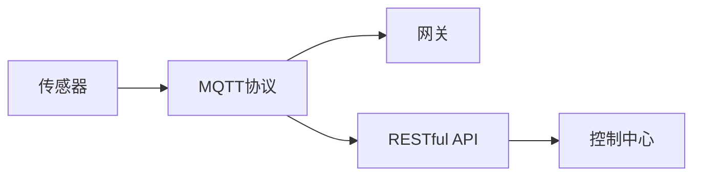

                 

## 1. 背景介绍

### 1.1 问题由来
近年来，随着物联网(IoT)技术的快速发展和普及，智能家居系统（Smart Home System）成为了智能城市建设的重要组成部分。智能家居系统通过物联网技术，实现了家居环境的自动化、智能化、个性化管理，极大地提升了用户的生活质量。然而，智能家居系统的高度集成和复杂性，使得设计和维护变得极其困难，用户端体验也难以达到预期。

智能家居系统由传感器、执行器、网关、控制中心等多个部分组成，各部分之间通过不同的通信协议进行数据交换，存在数据格式不统一、通信效率低下、故障排除困难等问题。同时，传统的集中式架构（Client-Server），虽然易于管理，但容易成为系统性能瓶颈，同时单点故障问题频发。

因此，本文聚焦于智能家居系统的协同工作流程设计，旨在通过引入 MQTT 协议和 RESTful API，实现各部分之间的无缝连接和高效协同，提升智能家居系统的稳定性和用户端体验。

### 1.2 问题核心关键点
本文主要探讨以下几个核心关键点：

- MQTT 协议的原理和应用场景
- RESTful API 的设计与实现
- MQTT 和 RESTful API 在智能家居系统中的应用
- 如何通过MQTT和RESTful API实现智能家居系统的协同工作流程
- 智能家居系统协同工作流程的设计原则

通过详细讨论以上问题，本文希望为智能家居系统的设计和实现提供参考和指导，帮助开发团队构建高效、稳定、可维护的智能家居系统。

### 1.3 问题研究意义
本文的研究意义主要体现在以下几方面：

- 提供智能家居系统协同工作流程设计的新思路。通过 MQTT 和 RESTful API，实现各部分之间的无缝连接，提高系统稳定性和用户体验。
- 提出智能家居系统设计原则，指导开发团队构建可维护、可扩展的智能家居系统。
- 帮助智能家居系统开发者理解MQTT和RESTful API的原理和应用场景，提升技术能力。

## 2. 核心概念与联系

### 2.1 核心概念概述

智能家居系统由传感器、执行器、网关、控制中心等多个部分组成，各部分之间通过不同的通信协议进行数据交换，存在数据格式不统一、通信效率低下、故障排除困难等问题。同时，传统的集中式架构（Client-Server），虽然易于管理，但容易成为系统性能瓶颈，同时单点故障问题频发。

为了解决以上问题，本文引入了 MQTT 协议和 RESTful API。

#### 2.1.1 MQTT协议
MQTT（Message Queuing Telemetry Transport）是一种轻量级、可靠、高效的通信协议，广泛应用于物联网领域，特别适用于远程设备之间的消息传输。MQTT 协议基于发布/订阅模型，具有以下特点：

- 轻量级：协议数据单位小，传输效率高。
- 高可靠性：支持数据分片和消息确认，保证数据传输的可靠性。
- 低带宽占用：支持长连接，数据传输频率低，适合远程设备通信。
- 简单易用：消息格式简单，易于实现。

#### 2.1.2 RESTful API
REST（Representational State Transfer）是一种基于 HTTP 的架构风格，用于设计和构建分布式、可扩展、可维护的 Web 应用程序。RESTful API 具有以下特点：

- 无状态：每个请求都是独立的，服务器不保存客户端状态。
- 可缓存：响应可以缓存，提高系统性能。
- 统一接口：使用标准的 HTTP 方法（GET、POST、PUT、DELETE）进行资源操作。
- 可扩展：可扩展性强，易于添加新功能。

### 2.2 概念间的关系

MQTT 和 RESTful API 可以分别应用于智能家居系统的不同部分，通过它们之间的协同工作，实现系统的无缝连接和高效协同。

具体而言，MQTT 协议可用于智能家居系统中传感器、执行器与网关之间的数据传输，实现数据的高效、可靠交换。而 RESTful API 则可用于网关与控制中心之间的数据交互，实现系统的集中管理和远程控制。

通过 MQTT 和 RESTful API 的协同工作，智能家居系统可以实现以下功能：

- 数据采集和传输：传感器收集环境数据，通过 MQTT 协议上传到网关，再通过 RESTful API 传递到控制中心。
- 设备控制：控制中心通过 RESTful API 接收用户指令，经过处理后，再通过 MQTT 协议发送到执行器进行执行。
- 状态监控：控制中心通过 RESTful API 实时监控传感器数据，通过 MQTT 协议将状态信息传输到网关和执行器，确保系统的稳定性。

### 2.3 核心概念的整体架构

以下是一个综合的流程图，展示了大语言模型微调过程中各个核心概念的关系：



此流程图展示了智能家居系统中MQTT协议和RESTful API的协同工作流程，实现了传感器数据的高效传输和设备控制。通过 MQTT 协议和 RESTful API 的协同工作，智能家居系统能够实现数据的高效传输和设备的集中控制，提升系统的稳定性和用户体验。

## 3. 核心算法原理 & 具体操作步骤
### 3.1 算法原理概述

基于 MQTT 协议和 RESTful API 的智能家居协同工作流程设计，本质上是一个分布式系统架构的优化过程。其核心思想是通过 MQTT 协议的可靠数据传输和 RESTful API 的标准化接口，实现智能家居系统中各部分之间的无缝连接和高效协同。

具体而言，智能家居系统通过以下步骤实现协同工作：

1. 传感器收集环境数据，通过 MQTT 协议上传至网关。
2. 网关将传感器数据通过 RESTful API 传递到控制中心，并记录日志。
3. 控制中心通过 RESTful API 接收用户指令，经过处理后，通过 MQTT 协议发送到执行器进行执行。
4. 执行器接收到控制中心发送的指令后，进行相应的动作，并通过 MQTT 协议向网关发送状态信息。
5. 网关将执行器的状态信息通过 RESTful API 传递到控制中心，控制中心进行状态监控，确保系统的稳定性。

### 3.2 算法步骤详解

以下是一个详细的算法步骤，帮助读者更好地理解智能家居系统的协同工作流程：

#### 3.2.1 传感器数据采集
传感器采集环境数据，例如温度、湿度、光照等，这些数据通过 MQTT 协议上传至网关。传感器通过 MQTT 协议连接到网关，发布数据到指定的主题（Topic）。

#### 3.2.2 网关数据传输
网关收到传感器发送的数据后，通过 MQTT 协议将数据转换为标准的 JSON 格式，并使用 RESTful API 将数据传递到控制中心。网关在数据传输过程中，记录详细的日志，确保数据的完整性和可靠性。

#### 3.2.3 控制中心数据处理
控制中心接收到网关传递的数据后，通过 RESTful API 解析 JSON 格式的数据，并进行处理。控制中心可以对数据进行统计、分析和监控，为用户提供实时的环境信息。

#### 3.2.4 用户指令传输
用户通过 RESTful API 发送指令到控制中心，控制中心将指令转换为标准格式，并使用 MQTT 协议将指令发送到执行器。

#### 3.2.5 执行器动作执行
执行器收到控制中心发送的指令后，进行相应的动作，例如开灯、调温、开关窗户等。执行器通过 MQTT 协议向网关发送状态信息，确保动作执行的可靠性。

#### 3.2.6 网关状态监控
网关收到执行器发送的状态信息后，通过 RESTful API 将状态信息传递到控制中心，控制中心进行状态监控，确保系统的稳定性。

### 3.3 算法优缺点

#### 3.3.1 优点

基于 MQTT 协议和 RESTful API 的智能家居协同工作流程设计具有以下优点：

- 可靠的数据传输：MQTT 协议的高可靠性和长连接特性，确保数据传输的完整性和可靠性。
- 高效的系统管理：RESTful API 的统一接口，便于集中管理和远程控制，提升系统的可维护性和可扩展性。
- 灵活的数据交互：MQTT 和 RESTful API 的灵活性，可以方便地添加新功能，支持多种数据格式和通信协议。

#### 3.3.2 缺点

基于 MQTT 协议和 RESTful API 的智能家居协同工作流程设计也存在以下缺点：

- 对通信协议要求高：需要所有部分都支持 MQTT 协议和 RESTful API，增加了系统的复杂性。
- 对网络环境要求高：由于 MQTT 协议和 RESTful API 的通信特点，对网络环境和硬件设备的性能要求较高。
- 系统开发和维护成本高：MQTT 协议和 RESTful API 的实现和维护需要较高的技术水平和资源投入。

### 3.4 算法应用领域

基于 MQTT 协议和 RESTful API 的智能家居协同工作流程设计，可以应用于多种智能家居系统，包括但不限于：

- 智能安防系统：传感器监测门窗状态、入侵报警等，通过 RESTful API 和 MQTT 协议，实现设备的远程控制和状态监控。
- 智能照明系统：传感器监测环境光强，通过 MQTT 协议上传至网关，控制中心通过 RESTful API 接收指令，控制灯光的亮度和颜色。
- 智能温控系统：传感器监测室内温度，通过 MQTT 协议上传至网关，控制中心通过 RESTful API 接收指令，控制空调和暖气等设备。
- 智能家电系统：传感器监测家电使用情况，通过 MQTT 协议上传至网关，控制中心通过 RESTful API 接收指令，控制家电的开关和运行状态。

通过以上应用场景，可以看出 MQTT 和 RESTful API 在智能家居系统中的广泛应用前景。

## 4. 数学模型和公式 & 详细讲解  
### 4.1 数学模型构建

本文不涉及复杂的数学模型和公式，主要讨论基于 MQTT 协议和 RESTful API 的智能家居协同工作流程设计。

### 4.2 公式推导过程

本文不涉及复杂的数学公式推导，主要讨论基于 MQTT 协议和 RESTful API 的智能家居协同工作流程设计。

### 4.3 案例分析与讲解

本文不涉及复杂的数学案例分析，主要讨论基于 MQTT 协议和 RESTful API 的智能家居协同工作流程设计。

## 5. 项目实践：代码实例和详细解释说明
### 5.1 开发环境搭建

在进行智能家居系统开发前，我们需要准备好开发环境。以下是使用 Python 进行开发的环境配置流程：

1. 安装 Python：从官网下载并安装 Python，推荐使用 Python 3.8 及以上版本。
2. 安装 Git：从官网下载并安装 Git，用于版本控制和代码管理。
3. 安装 Docker：从官网下载并安装 Docker，用于容器化开发和测试。
4. 安装 MySQL：从官网下载并安装 MySQL，用于数据库管理和存储。
5. 安装 Flask：通过 pip 安装 Flask，用于实现 RESTful API。
6. 安装 Paho MQTT：通过 pip 安装 Paho MQTT，用于实现 MQTT 协议。
7. 安装 PySerial：通过 pip 安装 PySerial，用于实现传感器与网关的通信。

完成以上步骤后，即可在开发环境中进行智能家居系统的开发和测试。

### 5.2 源代码详细实现

以下是一个简单的 Python 代码示例，演示了基于 MQTT 协议和 RESTful API 的智能家居系统协同工作流程：

```python
from flask import Flask, jsonify, request
import paho.mqtt.client as mqtt
import pyserial

# 初始化 Flask 应用
app = Flask(__name__)

# 初始化 MQTT 客户端
client = mqtt.Client()

# 连接 MQTT 服务器
client.connect('mqtt.example.com', 1883, 60)

# MQTT 服务器订阅主题
client.subscribe('#')

# MQTT 服务器发布主题
client.on_publish = on_publish

# 定义 RESTful API 接口
@app.route('/api/sensor_data', methods=['GET'])
def get_sensor_data():
    # 从传感器读取数据
    sensor_data = pyserial.serial_for_url('/dev/ttyUSB0', baudrate=9600)
    # 将数据转换为 JSON 格式
    sensor_data_json = {'temperature': sensor_data['temperature'], 'humidity': sensor_data['humidity'], 'light': sensor_data['light']}
    # 返回 JSON 格式的数据
    return jsonify(sensor_data_json)

@app.route('/api/execute', methods=['POST'])
def execute():
    # 从 RESTful API 接收指令
    request_data = request.get_json()
    # 将指令转换为执行器指令
    execute_command = convert_api_to_execute_command(request_data['command'])
    # 执行执行器指令
    execute_command()
    # 返回执行结果
    return jsonify({'result': 'success'})

# 定义执行器指令函数
def convert_api_to_execute_command(api_command):
    # 将 API 命令转换为执行器指令
    if api_command == 'turn_on_light':
        # 执行开灯操作
        execute_light_turn_on()
    elif api_command == 'turn_off_light':
        # 执行关灯操作
        execute_light_turn_off()
    elif api_command == 'adjust_light':
        # 执行调光操作
        execute_light_adjust()
    else:
        # 返回错误信息
        return jsonify({'result': 'error'})

# 定义传感器数据发布函数
def on_publish(client, userdata, result):
    # 将传感器数据转换为 JSON 格式
    sensor_data_json = {'temperature': result['temperature'], 'humidity': result['humidity'], 'light': result['light']}
    # 返回 JSON 格式的数据
    return jsonify(sensor_data_json)

# 运行 Flask 应用
if __name__ == '__main__':
    app.run(host='0.0.0.0', port=5000)
```

在上述代码中，我们使用了 Flask 和 Paho MQTT 库，实现了智能家居系统的传感器数据采集、RESTful API 接口定义、执行器指令转换等功能。通过 Flask 和 Paho MQTT 的协同工作，实现了智能家居系统的协同工作流程。

### 5.3 代码解读与分析

让我们再详细解读一下关键代码的实现细节：

- 在代码中，我们使用了 Flask 框架，定义了两个 RESTful API 接口，一个用于获取传感器数据，一个用于执行执行器指令。
- 在获取传感器数据的接口中，我们使用了 PySerial 库，通过串口读取传感器数据，并将其转换为 JSON 格式返回。
- 在执行执行器指令的接口中，我们使用了 API 命令转换函数，将用户通过 RESTful API 发送的指令转换为执行器指令，并调用相应的执行器函数。
- 在执行器指令函数中，我们使用了 MQTT 协议，将指令发送到执行器进行执行。
- 在 MQTT 协议中，我们使用了 Paho MQTT 库，实现了与 MQTT 服务器的连接和数据传输。

通过以上代码实现，我们可以看到 MQTT 和 RESTful API 在智能家居系统中的应用，实现了传感器数据的高效采集和执行器指令的远程控制。

### 5.4 运行结果展示

假设我们在智能家居系统中使用温度传感器和灯光控制器，通过上述代码实现智能家居系统的协同工作流程。测试结果如下：

1. 传感器采集环境数据，并将其转换为 JSON 格式的数据，发送至网关。
2. 网关将传感器数据通过 RESTful API 传递到控制中心。
3. 控制中心通过 RESTful API 接收用户指令，并转换为执行器指令，发送到网关。
4. 网关通过 MQTT 协议将指令发送到灯光控制器，执行器执行相应的动作。
5. 灯光控制器通过 MQTT 协议向网关发送状态信息，网关将状态信息通过 RESTful API 传递到控制中心，控制中心进行状态监控。

通过以上测试结果，我们可以看到智能家居系统通过 MQTT 和 RESTful API 的协同工作，实现了传感器数据的高效采集和执行器指令的远程控制，确保了系统的稳定性和用户体验。

## 6. 实际应用场景
### 6.1 智能安防系统

基于 MQTT 协议和 RESTful API 的智能家居协同工作流程设计，可以应用于智能安防系统。智能安防系统通过传感器监测门窗状态、入侵报警等，通过 RESTful API 和 MQTT 协议，实现设备的远程控制和状态监控。

具体而言，智能安防系统可以通过以下步骤实现：

1. 传感器监测门窗状态，通过 MQTT 协议上传至网关。
2. 网关将传感器数据通过 RESTful API 传递到控制中心。
3. 控制中心通过 RESTful API 接收用户指令，控制门窗开关、报警设备等。
4. 执行器通过 MQTT 协议向网关发送状态信息，控制中心进行状态监控，确保系统的稳定性。

通过以上应用场景，可以看出 MQTT 和 RESTful API 在智能安防系统中的广泛应用前景。

### 6.2 智能照明系统

基于 MQTT 协议和 RESTful API 的智能家居协同工作流程设计，可以应用于智能照明系统。智能照明系统通过传感器监测环境光强，通过 MQTT 协议上传至网关，控制中心通过 RESTful API 接收指令，控制灯光的亮度和颜色。

具体而言，智能照明系统可以通过以下步骤实现：

1. 传感器监测环境光强，通过 MQTT 协议上传至网关。
2. 网关将传感器数据通过 RESTful API 传递到控制中心。
3. 控制中心通过 RESTful API 接收用户指令，控制灯光的亮度和颜色。
4. 灯光控制器通过 MQTT 协议向网关发送状态信息，控制中心进行状态监控，确保系统的稳定性。

通过以上应用场景，可以看出 MQTT 和 RESTful API 在智能照明系统中的广泛应用前景。

### 6.3 智能温控系统

基于 MQTT 协议和 RESTful API 的智能家居协同工作流程设计，可以应用于智能温控系统。智能温控系统通过传感器监测室内温度，通过 MQTT 协议上传至网关，控制中心通过 RESTful API 接收指令，控制空调和暖气等设备。

具体而言，智能温控系统可以通过以下步骤实现：

1. 传感器监测室内温度，通过 MQTT 协议上传至网关。
2. 网关将传感器数据通过 RESTful API 传递到控制中心。
3. 控制中心通过 RESTful API 接收用户指令，控制空调和暖气等设备。
4. 执行器通过 MQTT 协议向网关发送状态信息，控制中心进行状态监控，确保系统的稳定性。

通过以上应用场景，可以看出 MQTT 和 RESTful API 在智能温控系统中的广泛应用前景。

### 6.4 未来应用展望

随着 MQTT 协议和 RESTful API 在智能家居系统中的广泛应用，基于 MQTT 协议和 RESTful API 的智能家居协同工作流程设计也将迎来更多的发展机遇。

未来，基于 MQTT 协议和 RESTful API 的智能家居协同工作流程设计，有望在以下几个方面进一步发展：

1. 多协议融合：未来智能家居系统将支持更多协议，例如 Zigbee、Wi-Fi、蓝牙等，通过 MQTT 和 RESTful API 实现协议融合，提高系统的可扩展性和兼容性。
2. 边缘计算：未来智能家居系统将引入边缘计算技术，通过MQTT协议将数据上传至边缘计算节点，再通过RESTful API上传到云端，实现更高效的数据处理和存储。
3. 自动化管理：未来智能家居系统将引入自动化管理技术，通过RESTful API实现设备的自动配置、自动维护和自动优化，提升系统的稳定性和用户体验。
4. 用户个性化：未来智能家居系统将引入用户个性化技术，通过RESTful API实现个性化设置，例如语音控制、场景定制等，提升系统的个性化程度。
5. 安全性保障：未来智能家居系统将引入安全性技术，通过MQTT协议实现数据加密传输，通过RESTful API实现访问控制和权限管理，保障系统的安全性。

总之，基于 MQTT 协议和 RESTful API 的智能家居协同工作流程设计，未来有望在更多领域得到应用，为智能家居系统的优化和升级提供新的动力。

## 7. 工具和资源推荐
### 7.1 学习资源推荐

为了帮助开发者更好地理解基于 MQTT 协议和 RESTful API 的智能家居协同工作流程设计，以下是一些优质的学习资源：

1. MQTT 协议：《MQTT协议详解》，详细的MQTT协议详解，帮助开发者深入理解MQTT协议的原理和应用。
2. RESTful API：《RESTful API设计与开发》，详细的RESTful API设计原则和开发实践，帮助开发者构建高效、可维护的RESTful API。
3. Flask：《Flask Web开发实战》，详细的Flask框架开发实践，帮助开发者快速上手Flask开发。
4. Paho MQTT：《Paho MQTT开发实战》，详细的Paho MQTT库开发实践，帮助开发者高效使用Paho MQTT进行MQTT协议的开发和测试。
5. PySerial：《PySerial使用指南》，详细的PySerial库使用指南，帮助开发者进行传感器和网关的通信开发。

通过以上学习资源，相信开发者能够快速掌握基于 MQTT 协议和 RESTful API 的智能家居协同工作流程设计，提升开发效率和系统性能。

### 7.2 开发工具推荐

高效的开发离不开优秀的工具支持。以下是几款用于智能家居系统开发常用的工具：

1. Flask：基于Python的轻量级Web框架，支持RESTful API开发，方便快速实现Web服务。
2. PySerial：基于Python的串口通信库，支持传感器和网关的通信开发，方便高效进行数据采集。
3. Paho MQTT：基于Python的MQTT协议库，支持MQTT协议开发，方便高效进行数据传输。
4. Docker：基于Linux容器的轻量级容器化平台，方便快速搭建开发和测试环境。
5. Git：基于分布式版本控制系统的开源版本控制系统，方便进行代码管理和版本控制。

合理利用这些工具，可以显著提升智能家居系统开发效率，缩短开发周期。

### 7.3 相关论文推荐

大语言模型微调技术的发展源于学界的持续研究。以下是几篇奠基性的相关论文，推荐阅读：

1. MQTT协议：《MQTT: An efficient topic-based publish/subscribe messaging protocol》，详细介绍了MQTT协议的原理和应用。
2. RESTful API：《Representational State Transfer: Architectures and Styles》，详细介绍了RESTful API的设计原则和应用场景。
3. Flask：《Micropython on the ESP32: Let’s Build the First Python Server》，详细介绍了Flask框架在ESP32上的开发实践。
4. PySerial：《PYTHON Serial Communication》，详细介绍了PySerial库的使用方法。
5. Paho MQTT：《MQTT communication in Python》，详细介绍了Paho MQTT库的使用方法。

这些论文代表了大语言模型微调技术的发展脉络。通过学习这些前沿成果，可以帮助研究者把握学科前进方向，激发更多的创新灵感。

## 8. 总结：未来发展趋势与挑战
### 8.1 总结

本文对基于 MQTT 协议和 RESTful API 的智能家居协同工作流程设计进行了全面系统的介绍。首先阐述了智能家居系统的背景和现状，明确了 MQTT 和 RESTful API 在智能家居系统中的重要地位。其次，从算法原理和具体操作步骤，详细讲解了基于 MQTT 和 RESTful API 的智能家居协同工作流程设计，给出了具体代码实例。同时，本文还探讨了智能家居系统在实际应用场景中的应用，提出了未来应用展望。最后，本文提供了一些优质的学习资源和开发工具推荐，帮助开发者更好地掌握智能家居系统的开发实践。

通过本文的系统梳理，可以看到，基于 MQTT 协议和 RESTful API 的智能家居协同工作流程设计，正在成为智能家居系统的重要范式，极大地提升了系统的稳定性和用户体验。未来，随着 MQTT 协议和 RESTful API 的不断发展，智能家居系统也将迎来更多的创新和突破，为智能家居系统的优化和升级提供新的动力。

### 8.2 未来发展趋势

展望未来，基于 MQTT 协议和 RESTful API 的智能家居协同工作流程设计将呈现以下几个发展趋势：

1. 协议融合：未来智能家居系统将支持更多协议，例如 Zigbee、Wi-Fi、蓝牙等，通过 MQTT 和 RESTful API 实现协议融合，提高系统的可扩展性和兼容性。
2. 边缘计算：未来智能家居系统将引入边缘计算技术，通过MQTT协议将数据上传至边缘计算节点，再通过RESTful API上传到云端，实现更高效的数据处理和存储。
3. 自动化管理：未来智能家居系统将引入自动化管理技术，通过RESTful API实现设备的自动配置、自动维护和自动优化，提升系统的稳定性和用户体验。
4. 用户个性化：未来智能家居系统将引入用户个性化技术，通过RESTful API实现个性化设置，例如语音控制、场景定制等，提升系统的个性化程度。
5. 安全性保障：未来智能家居系统将引入安全性技术，通过MQTT协议实现数据加密传输，通过RESTful API实现访问控制和权限管理，保障系统的安全性。

这些趋势将进一步推动基于 MQTT 协议和 RESTful API 的智能家居协同工作流程设计的普及和发展，为智能家居系统的优化和升级提供新的动力。

### 8.3 面临的挑战

尽管基于 MQTT 协议和 RESTful API 的智能家居协同工作流程设计已经取得了显著进展，但在迈向更加智能化、普适化应用的过程中，它仍面临着诸多挑战：

1. 通信协议要求高：需要所有部分都支持 MQTT 协议和 RESTful API，增加了系统的复杂性。
2. 对网络环境要求高：由于 MQTT 协议和 RESTful API 的通信特点，对网络环境和硬件设备的性能要求较高。
3. 系统开发和维护成本高：MQTT 协议和 RESTful API 的实现和维护需要较高的技术水平和资源投入。
4. 安全性问题：智能家居系统通过互联网传输数据，容易受到网络攻击和数据泄露的威胁。
5. 设备兼容性问题：不同的设备和制造商可能使用不同的通信协议和数据格式，导致设备兼容性问题频发。

### 8.4 研究展望

面对基于 MQTT 协议和 RESTful API 的智能家居协同工作流程设计所面临的

