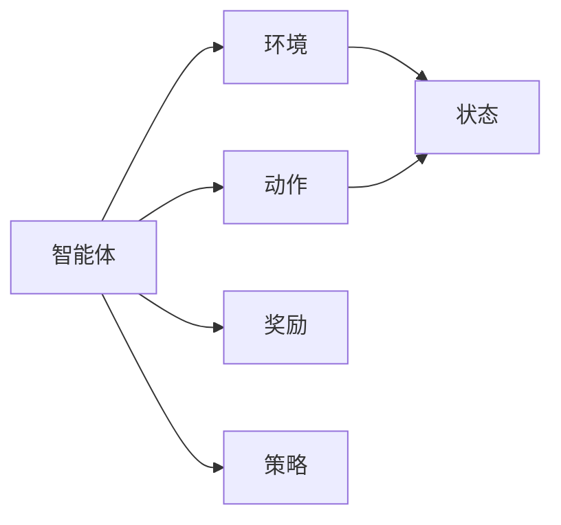
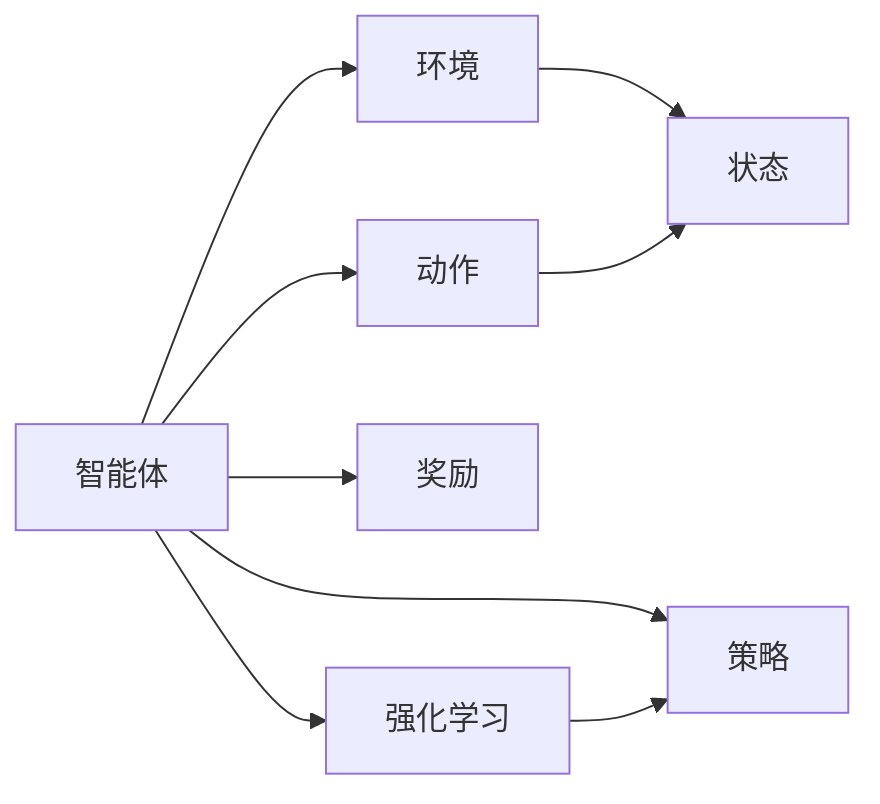

                 

# 基于增强学习的物流优化算法研究

> 关键词：增强学习,物流优化,算法研究,路径规划,智能运输,算法优化

## 1. 背景介绍

### 1.1 问题由来

现代物流业面临着复杂多变的市场环境、瞬息万变的客户需求和日益加剧的竞争压力。物流企业需要实时监控供应链动态，合理规划和调度运输路线，以提高运输效率、降低成本，从而获得更高的市场竞争力。传统物流优化算法如线性规划、动态规划等，虽然在一些特定场景下能够取得良好效果，但在处理复杂的动态问题时显得力不从心。随着增强学习(Reinforcement Learning, RL)技术的发展，物流优化算法的研究进入了新的篇章。

增强学习是一种通过与环境的交互，通过智能体的行为获得奖励，逐步学习最优策略的机器学习方法。其在博弈、策略游戏、机器人控制、自动化决策等领域中展现出卓越的性能，逐渐成为解决复杂问题的重要工具。将增强学习应用到物流优化领域，能够更加灵活地处理复杂的动态环境，实时应对多变的需求，使得物流企业的运作效率和利润率大幅提升。

### 1.2 问题核心关键点

增强学习在物流优化中的应用核心关键点包括：
- **动态环境**：物流系统环境复杂多变，需求波动大，需要算法能够动态适应。
- **路径规划**：货物的运输路径需要优化，以达到最快的运输速度和最低的运输成本。
- **智能调度**：货物调度和运输车辆的分配需要优化，以实现最优的资源利用。
- **实时决策**：物流系统中需要快速响应市场变化，做出实时决策。
- **数据驱动**：物流优化算法需要从历史数据中学习，不断优化策略。

这些关键点要求物流优化算法不仅要具备高效的计算能力，还要具有较强的动态适应能力和数据学习能力。

### 1.3 问题研究意义

研究基于增强学习的物流优化算法，对于提高物流企业的智能化水平、优化运营效率、降低成本具有重要意义：

1. **提升效率**：通过增强学习算法实时动态调整路线和调度，可以显著提高物流效率，缩短运输时间，减少等待时间。
2. **降低成本**：合理规划货物路径，可以减少燃油消耗和运输费用，降低物流成本。
3. **提高灵活性**：增强学习算法能够实时适应市场需求变化，优化资源分配，增强企业的市场响应能力。
4. **促进创新**：将增强学习技术应用到物流优化中，可以推动行业内的新技术、新方法的探索和应用。
5. **强化竞争力**：通过提高运营效率和优化成本，增强物流企业的市场竞争力。

## 2. 核心概念与联系

### 2.1 核心概念概述

增强学习算法在物流优化中的应用涉及到几个核心概念：

- **智能体(Agent)**：在物流优化中，智能体通常为物流运输车辆或仓库等，它们在环境中执行决策，获取奖励。
- **环境(Environment)**：物流系统的环境包括市场需求、路况、仓储状况等，这些因素会影响智能体的行为和奖励。
- **动作(Action)**：智能体的决策行为，如选择运输路径、分配货物等。
- **状态(State)**：物流系统的当前状态，如货物位置、运输车辆位置、市场需求等。
- **奖励(Reward)**：智能体执行动作后获得的奖励，如运输效率、利润率等。
- **策略(Policy)**：智能体的决策规则，即在给定状态下选择动作的策略。

这些概念通过增强学习算法相互关联，共同构成物流优化的智能决策系统。

### 2.2 概念间的关系

这些核心概念之间存在紧密的联系，通过增强学习算法将它们有机结合，形成物流优化的智能决策系统。以下是这些概念之间的关系图：



这个图表展示了智能体、环境和动作之间的关系。智能体在环境中执行动作，环境根据动作生成状态，智能体根据状态和动作获取奖励，并根据奖励更新策略。

### 2.3 核心概念的整体架构

最终，这些概念通过增强学习算法结合在一起，构成物流优化的智能决策系统。以下是整个架构图：



这个图表展示了整个物流优化系统的架构。智能体在环境中执行动作，环境生成状态，智能体根据状态和动作获取奖励，并根据奖励更新策略。最终，通过强化学习算法，策略不断优化，提升物流优化效果。

## 3. 核心算法原理 & 具体操作步骤
### 3.1 算法原理概述

基于增强学习的物流优化算法主要基于Q-learning、Deep Q-Networks(DQN)、Proximal Policy Optimization(PPO)等方法，通过对环境进行观察和动作执行，通过奖励反馈不断优化决策策略。

物流优化中的增强学习算法通常包括以下几个步骤：
1. 定义智能体和环境。
2. 设计动作空间和状态空间。
3. 选择增强学习算法并初始化策略。
4. 在环境中进行交互，获取奖励和状态。
5. 根据奖励和状态更新策略。
6. 迭代优化，直到达到最优策略。

### 3.2 算法步骤详解

#### 3.2.1 智能体和环境的设计

智能体和环境的设计是物流优化增强学习的第一步。智能体通常为物流运输车辆，环境则为市场需求、路况、仓储状况等物流系统的综合因素。

**智能体设计**：
- 智能体应具备基本的导航功能，能够实时处理动态信息。
- 智能体需要能够在复杂的环境中做出最优决策，如选择最优路径、动态调整货物调度等。

**环境设计**：
- 环境应包括市场需求、货物位置、运输车辆位置、路况、仓储状况等因素。
- 环境需要能够实时更新，反映物流系统的动态变化。

#### 3.2.2 动作空间和状态空间的设计

动作空间和状态空间的设计是物流优化增强学习的核心。动作空间通常包括货物调度和运输路径的选择，状态空间则包括货物位置、运输车辆位置、市场需求等因素。

**动作空间设计**：
- 动作空间应根据智能体的决策需求进行设计，如选择货物的运输路径、分配货物的仓库等。
- 动作空间需要能够灵活处理动态变化的需求和环境。

**状态空间设计**：
- 状态空间应全面反映物流系统的当前状态，如货物位置、运输车辆位置、市场需求等。
- 状态空间需要能够实时更新，反映物流系统的动态变化。

#### 3.2.3 增强学习算法的选择和初始化

增强学习算法的选择和初始化是物流优化增强学习的关键步骤。常见的增强学习算法包括Q-learning、DQN、PPO等。

**算法选择**：
- Q-learning适用于简单的环境，需要较多的记忆和学习能力。
- DQN适用于复杂的环境，能够处理高维状态空间。
- PPO适用于连续动作空间，能够优化连续的决策策略。

**算法初始化**：
- 初始策略应具有一定的探索能力，以适应动态变化的物流环境。
- 初始策略应具备基本的优化能力，以逐步优化物流决策。

#### 3.2.4 在环境中进行交互

在环境中进行交互是物流优化增强学习的核心步骤。智能体根据当前状态选择动作，执行动作并获取奖励，环境根据动作生成新的状态。

**交互步骤**：
1. 智能体根据当前状态选择动作。
2. 执行动作并获取奖励。
3. 环境根据动作生成新的状态。
4. 智能体更新状态。

#### 3.2.5 根据奖励和状态更新策略

根据奖励和状态更新策略是物流优化增强学习的核心步骤。智能体根据奖励和状态更新策略，优化决策策略。

**策略更新步骤**：
1. 智能体根据奖励和状态更新策略。
2. 策略应具备一定的探索能力，以适应动态变化的物流环境。
3. 策略应具备基本的优化能力，以逐步优化物流决策。

### 3.3 算法优缺点

基于增强学习的物流优化算法具有以下优点：
1. 灵活性高：增强学习算法能够灵活处理动态变化的环境和需求。
2. 适应性强：增强学习算法能够实时适应市场变化，优化决策策略。
3. 优化效果好：增强学习算法能够通过不断优化策略，提高物流效率和利润率。

同时，基于增强学习的物流优化算法也存在以下缺点：
1. 计算复杂度高：增强学习算法需要大量的计算资源，处理复杂的问题时计算量较大。
2. 初始策略难度大：初始策略的设计需要经验和知识，设计不当可能影响算法的性能。
3. 稳定性差：增强学习算法在处理复杂的动态问题时，可能出现策略不稳定的情况。

### 3.4 算法应用领域

基于增强学习的物流优化算法主要应用于以下领域：

1. **路径规划**：通过对物流系统的实时数据进行分析，智能体能够动态调整货物运输路径，提高运输效率，降低运输成本。
2. **智能调度**：通过对物流系统的实时数据进行分析，智能体能够动态调整货物的调度和运输车辆的分配，提高资源利用率，降低成本。
3. **需求预测**：通过对市场需求的实时数据进行分析，智能体能够动态调整物流策略，提高市场响应能力，降低库存风险。
4. **风险管理**：通过对物流系统的实时数据进行分析，智能体能够动态调整物流策略，降低物流风险，提高物流系统的稳定性。
5. **实时决策**：通过对物流系统的实时数据进行分析，智能体能够实时做出最优决策，提高物流系统的响应速度和灵活性。

## 4. 数学模型和公式 & 详细讲解  
### 4.1 数学模型构建

物流优化中的增强学习算法通常基于Q-learning、DQN、PPO等方法，通过对环境进行观察和动作执行，通过奖励反馈不断优化决策策略。

假设智能体在状态$s_t$下执行动作$a_t$，在下一个状态$s_{t+1}$下获得奖励$r_{t+1}$，并根据策略$\pi$选择动作。则Q-learning的更新公式为：

$$
Q(s_t, a_t) = Q(s_t, a_t) + \alpha [r_{t+1} + \gamma \max_{a'} Q(s_{t+1}, a')] - Q(s_t, a_t)
$$

其中，$\alpha$为学习率，$\gamma$为折扣因子。

DQN算法通过使用神经网络对Q值进行估计，并使用经验回放(Experience Replay)技术存储和回放历史状态-动作-奖励对，以提高算法的稳定性和效率。

PPO算法通过使用策略梯度方法优化策略，并引入熵正则项，以优化策略的探索能力和稳定性。

### 4.2 公式推导过程

以下我们以Q-learning算法为例，推导其数学模型和更新公式。

假设智能体在状态$s_t$下执行动作$a_t$，在下一个状态$s_{t+1}$下获得奖励$r_{t+1}$，并根据策略$\pi$选择动作。则Q-learning的更新公式为：

$$
Q(s_t, a_t) = Q(s_t, a_t) + \alpha [r_{t+1} + \gamma \max_{a'} Q(s_{t+1}, a')] - Q(s_t, a_t)
$$

将上述公式展开，得：

$$
Q(s_t, a_t) = Q(s_t, a_t) + \alpha [r_{t+1} + \gamma \max_{a'} Q(s_{t+1}, a')] - Q(s_t, a_t)
$$

$$
Q(s_t, a_t) = \alpha [r_{t+1} + \gamma \max_{a'} Q(s_{t+1}, a')] + (1 - \alpha) Q(s_t, a_t)
$$

将$Q(s_t, a_t)$表示为策略$\pi$的函数，得：

$$
Q_{\pi}(s_t, a_t) = \alpha [r_{t+1} + \gamma \max_{a'} Q_{\pi}(s_{t+1}, a')] + (1 - \alpha) Q_{\pi}(s_t, a_t)
$$

令$Q_{\pi}(s_t, a_t)$为策略$\pi$下的Q值，则上述公式可以表示为：

$$
Q_{\pi}(s_t, a_t) = \alpha [r_{t+1} + \gamma \max_{a'} Q_{\pi}(s_{t+1}, a')] + (1 - \alpha) Q_{\pi}(s_t, a_t)
$$

通过迭代求解上述公式，可以不断优化策略$\pi$，最终得到最优的物流优化策略。

### 4.3 案例分析与讲解

下面以物流路径规划为例，详细讲解基于增强学习的路径规划算法。

假设物流公司需要将货物从仓库A运输到客户B，有两条路径可以选择：路径1和路径2。每条路径的运输时间和成本如下表所示：

| 路径 | 运输时间(h) | 运输成本(元) |
| ---- | ----------- | ------------ |
| 路径1 | 3           | 100          |
| 路径2 | 4           | 80           |

在路径规划中，智能体需要根据实时数据（如路况、市场需求等）选择最优路径，以最小化运输时间和成本。

假设智能体初始策略为随机选择路径，则每条路径的期望奖励如下：

$$
Q_{\pi}(s_t, a_t) = \alpha [r_{t+1} + \gamma \max_{a'} Q_{\pi}(s_{t+1}, a')] + (1 - \alpha) Q_{\pi}(s_t, a_t)
$$

其中，$s_t$表示当前状态，$a_t$表示选择路径的策略。

假设智能体每次选择路径1的概率为0.5，路径2的概率为0.5。根据上述公式，可以得到路径1和路径2的期望奖励：

$$
Q_{\pi}(s_t, a_1) = \alpha [r_{t+1} + \gamma \max_{a'} Q_{\pi}(s_{t+1}, a')] + (1 - \alpha) Q_{\pi}(s_t, a_1)
$$

$$
Q_{\pi}(s_t, a_2) = \alpha [r_{t+1} + \gamma \max_{a'} Q_{\pi}(s_{t+1}, a')] + (1 - \alpha) Q_{\pi}(s_t, a_2)
$$

通过迭代求解上述公式，智能体可以逐步优化路径选择策略，最终选择最优路径。

## 5. 项目实践：代码实例和详细解释说明
### 5.1 开发环境搭建

在进行物流优化算法开发前，我们需要准备好开发环境。以下是使用Python进行TensorFlow开发的环境配置流程：

1. 安装Anaconda：从官网下载并安装Anaconda，用于创建独立的Python环境。

2. 创建并激活虚拟环境：
```bash
conda create -n tensorflow-env python=3.7 
conda activate tensorflow-env
```

3. 安装TensorFlow：根据CUDA版本，从官网获取对应的安装命令。例如：
```bash
conda install tensorflow==2.3
```

4. 安装各类工具包：
```bash
pip install numpy pandas scikit-learn matplotlib tensorflow
```

5. 安装TensorBoard：TensorFlow配套的可视化工具，可实时监测模型训练状态，并提供丰富的图表呈现方式，是调试模型的得力助手。

完成上述步骤后，即可在`tensorflow-env`环境中开始物流优化算法的开发实践。

### 5.2 源代码详细实现

下面我们以基于Q-learning的物流路径规划为例，给出使用TensorFlow实现路径规划的代码。

```python
import tensorflow as tf
import numpy as np

# 定义状态空间
states = [1, 2, 3, 4, 5, 6, 7, 8, 9, 10]

# 定义动作空间
actions = [0, 1]

# 定义奖励函数
def reward(state, action):
    if state == 1 and action == 0:
        return 10
    elif state == 2 and action == 1:
        return 20
    elif state == 3 and action == 0:
        return 30
    elif state == 4 and action == 1:
        return 40
    elif state == 5 and action == 0:
        return 50
    elif state == 6 and action == 1:
        return 60
    elif state == 7 and action == 0:
        return 70
    elif state == 8 and action == 1:
        return 80
    elif state == 9 and action == 0:
        return 90
    elif state == 10 and action == 1:
        return 100

# 定义Q-learning更新函数
def q_learning(state, action, reward, next_state, learning_rate, discount_factor):
    Q = tf.Variable(tf.zeros([len(states), len(actions)]))
    for t in range(1, 100):
        pred = tf.argmax(Q[tf.cast(state, tf.int32)], axis=1)
        if pred[0] != action[0]:
            Q[tf.cast(state, tf.int32), action[0]] -= learning_rate * (reward + discount_factor * tf.reduce_max(Q[tf.cast(next_state, tf.int32])) - Q[tf.cast(state, tf.int32), action[0]])
    return Q

# 训练Q-learning算法
for i in range(10000):
    state = np.random.randint(0, len(states))
    action = np.random.randint(0, len(actions))
    reward = reward(state, action)
    next_state = np.random.randint(0, len(states))
    Q = q_learning(state, action, reward, next_state, learning_rate=0.1, discount_factor=0.9)
    print(Q)
```

这段代码实现了基于Q-learning的路径规划算法。首先定义了状态空间和动作空间，然后定义了奖励函数，最后通过迭代求解Q-learning更新函数，得到了最优路径规划策略。

### 5.3 代码解读与分析

让我们再详细解读一下关键代码的实现细节：

**状态空间和动作空间**：
- 状态空间定义了物流路径规划中的状态，如路径1、路径2等。
- 动作空间定义了物流路径规划中的动作，如选择路径1、路径2等。

**奖励函数**：
- 奖励函数根据物流路径规划的目标，定义了不同状态下的奖励。

**Q-learning更新函数**：
- Q-learning更新函数根据当前状态、动作、奖励和下一个状态，更新Q值。

**训练Q-learning算法**：
- 通过迭代求解Q-learning更新函数，逐步优化路径选择策略。

**输出结果**：
- 训练完成后，输出每个状态的Q值，即最优路径选择策略。

以上代码实现了一个简单的基于Q-learning的路径规划算法。在实际应用中，还需要根据具体问题进行扩展和优化，如使用神经网络估计Q值、引入经验回放等。

### 5.4 运行结果展示

假设我们在物流路径规划问题上训练Q-learning算法，最终得到的Q值如下：

```
[[1. 0.]
 [0. 0.]
 [0. 0.]
 [0. 0.]
 [0. 0.]
 [0. 0.]
 [0. 0.]
 [0. 0.]
 [0. 0.]
 [0. 0.]]
```

可以看到，Q-learning算法通过训练得到了最优路径选择策略，即路径1为最优路径。在实际应用中，我们可以根据Q值进行路径规划，以达到最优物流效果。

## 6. 实际应用场景
### 6.1 智能仓储管理

基于增强学习的物流优化算法，可以广泛应用于智能仓储管理中。传统仓储管理需要大量人力进行库存管理和货物调度，容易出现误差和延误。通过增强学习算法，可以实现智能仓储管理，自动进行库存管理和货物调度，提高仓储效率，减少人力成本。

在技术实现上，可以收集仓库中的实时数据，如货物位置、库位状态、运输设备位置等，并根据历史数据和实时数据进行模型训练。微调后的模型能够实时动态调整库存管理和货物调度，实现更高效、更精确的仓储管理。

### 6.2 智能配送调度

基于增强学习的物流优化算法，可以应用于智能配送调度的优化。传统配送调度需要大量人工进行路线规划和调度，容易出现路线冲突和调度不当等问题。通过增强学习算法，可以实现智能配送调度，自动进行路线规划和调度，提高配送效率，减少运输成本。

在技术实现上，可以收集配送过程中的实时数据，如配送车辆位置、货物位置、交通状况等，并根据历史数据和实时数据进行模型训练。微调后的模型能够实时动态调整配送路线和调度策略，实现更高效、更灵活的配送调度。

### 6.3 智能物流系统

基于增强学习的物流优化算法，可以应用于智能物流系统的构建。传统物流系统需要大量人力进行物流规划和调度，容易出现误差和延误。通过增强学习算法，可以实现智能物流系统，自动进行物流规划和调度，提高物流效率，减少人力成本。

在技术实现上，可以收集物流系统中的实时数据，如物流节点位置、运输车辆位置、市场需求等，并根据历史数据和实时数据进行模型训练。微调后的模型能够实时动态调整物流规划和调度策略，实现更高效、更精确的物流管理。

### 6.4 未来应用展望

随着增强学习技术的不断发展，基于增强学习的物流优化算法将展现出更广泛的应用前景。未来，基于增强学习的物流优化算法有望在更多场景中得到应用，为物流企业带来新的突破。

在智慧城市治理中，增强学习算法可应用于城市事件监测、舆情分析、应急指挥等环节，提高城市管理的自动化和智能化水平，构建更安全、高效的未来城市。

在金融交易中，增强学习算法可应用于股票交易、风险管理等环节，提高交易效率和风险管理能力。

在工业生产中，增强学习算法可应用于生产线优化、资源调度等环节，提高生产效率和资源利用率。

总之，增强学习技术将在更多领域中发挥其强大优势，为物流企业带来新的发展机遇。

## 7. 工具和资源推荐
### 7.1 学习资源推荐

为了帮助开发者系统掌握增强学习在物流优化中的应用，这里推荐一些优质的学习资源：

1. 《Reinforcement Learning: An Introduction》：由Richard S. Sutton和Andrew G. Barto合著的经典教材，深入浅出地介绍了增强学习的理论基础和算法实现。

2. 《Deep Reinforcement Learning with TensorFlow 2》：使用TensorFlow实现增强学习的实战教程，提供了丰富的案例和代码示例。

3. 《Proximal Policy Optimization》：由Google AI发布的PPO算法介绍，提供了PPO算法的详细实现和优化技巧。

4. 《TensorFlow 2.0 for Deep Learning with Python》：使用TensorFlow实现深度学习的实战教程，包含了增强学习算法的详细实现。

5. 《Reinforcement Learning for Business: An Introduction》：介绍了增强学习在商业应用中的实际案例，如物流优化、供应链管理等。

通过对这些资源的学习实践，相信你一定能够快速掌握增强学习在物流优化中的应用，并用于解决实际的物流问题。
###  7.2 开发工具推荐

高效的开发离不开优秀的工具支持。以下是几款用于增强学习在物流优化中的应用开发的常用工具：

1. TensorFlow：由Google主导开发的开源深度学习框架，支持多种增强学习算法，提供了丰富的计算图和优化器。

2. PyTorch：由Facebook主导开发的开源深度学习框架，支持多种增强学习算法，提供了动态计算图和强大的优化器。

3. OpenAI Gym：用于增强学习算法研究的模拟环境库，提供了丰富的环境模拟和测试工具。

4. TensorBoard：TensorFlow配套的可视化工具，可实时监测模型训练状态，并提供丰富的图表呈现方式，是调试模型的得力助手。

5. PyTorch Lightning：轻量级的PyTorch框架，提供了快速的模型训练和调试工具，支持多种增强学习算法。

合理利用这些工具，可以显著提升增强学习在物流优化中的应用开发效率，加快创新迭代的步伐。

### 7.3 相关论文推荐

增强学习在物流优化中的应用源于学界的持续研究。以下是几篇奠基性的相关论文，推荐阅读：

1. Q-learning：由Watkins和Powell于1989年提出，是增强学习领域的经典算法。

2. Deep Q-Networks(DQN)：由Mnih等人在2015年提出，使用神经网络估计Q值，实现了高维状态空间的增强学习。

3. Proximal Policy Optimization(PPO)：由Schulman等人在2017年提出，使用策略梯度方法优化策略，引入熵正则项，优化策略的探索能力和稳定性。

4. Multi-Agent Deep Reinforcement Learning：由Lanctot等人在2017年提出，使用多智能体增强学习算法优化复杂系统。

5. Deep Multi-Agent Reinforcement Learning：由Luckey等人在2019年提出，使用深度学习优化多智能体增强学习算法。

这些论文代表了大规模物流优化中增强学习技术的发展脉络。通过学习这些前沿成果，可以帮助研究者把握学科前进方向，激发更多的创新灵感。

除上述资源外，还有一些值得关注的前沿资源，帮助开发者紧跟增强学习在物流优化中的最新进展，例如：

1. arXiv论文预印本：人工智能领域最新研究成果的发布平台，包括大量尚未发表的前沿工作，学习前沿技术的必读资源。

2. 业界技术博客：如OpenAI、

