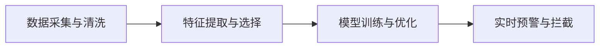

                 

## 1. 背景介绍

### 1.1 问题由来

随着通信技术的发展，用户之间的通信变得更加便捷。然而，这也带来了一些负面的现象，比如电信诈骗、垃圾信息等骚扰行为。这些行为不仅影响了用户的正常生活，还可能导致财产损失，甚至威胁社会安全。因此，如何有效识别和防范电信骚扰，成为电信运营商面临的重要挑战。

### 1.2 问题核心关键点

电信防骚扰模型的核心在于通过对大量通话数据进行分析和挖掘，识别出异常的通话行为，从而及时预警和拦截。具体来说，包括以下几个关键点：

- **数据采集与清洗**：收集和清洗包含通话行为数据的原始数据，去除噪音和不相关数据。
- **特征提取与选择**：从清洗后的数据中提取与骚扰行为相关的特征，并选择最重要的特征进行模型训练。
- **模型训练与优化**：使用机器学习模型对特征数据进行训练，并对模型进行调优，以提高识别准确率和鲁棒性。
- **实时预警与拦截**：在模型训练完成后，部署到实时系统中，对实时通话数据进行分析和判断，对可疑的通话行为进行预警和拦截。

### 1.3 问题研究意义

电信防骚扰模型的设计和使用，对于保障用户隐私、提升电信服务质量、防范电信诈骗具有重要意义：

- **保障用户隐私**：通过对通话行为进行实时监控，及时发现和拦截可能侵犯用户隐私的通话。
- **提升服务质量**：通过识别和拦截骚扰电话，提升用户对电信服务的满意度，减少投诉和退订。
- **防范电信诈骗**：及时发现和拦截可疑通话，降低电信诈骗发生的可能性，保护用户财产安全。

## 2. 核心概念与联系

### 2.1 核心概念概述

电信防骚扰模型的设计与实现，涉及到以下几个核心概念：

- **机器学习（Machine Learning, ML）**：通过数据驱动的方法，构建模型以识别和预测异常行为。
- **特征工程（Feature Engineering）**：从原始数据中提取和构建与问题相关的特征。
- **模型训练与优化**：使用历史数据对模型进行训练和调优，以提高模型的预测准确率和鲁棒性。
- **实时预警与拦截**：将训练好的模型部署到实时系统中，对新数据进行实时分析和预警。

### 2.2 概念间的关系

这些核心概念之间的关系可以通过以下Mermaid流程图来展示：



这个流程图展示了大模型微调的完整过程：

1. 首先，对原始数据进行清洗和预处理，去除噪音和不相关数据。
2. 然后，从清洗后的数据中提取和选择与骚扰行为相关的特征。
3. 接着，使用机器学习模型对特征数据进行训练和调优。
4. 最后，将训练好的模型部署到实时系统中，对新数据进行实时分析和预警。

## 3. 核心算法原理 & 具体操作步骤
### 3.1 算法原理概述

电信防骚扰模型主要基于监督学习的方法，通过对历史通话数据进行标注，训练出一个能够识别骚扰电话的分类模型。模型输入为通话数据特征，输出为是否为骚扰电话的标签。

假设我们有一个包含通话数据的集合 $D=\{(x_i,y_i)\}_{i=1}^N$，其中 $x_i$ 表示第 $i$ 次通话的特征向量，$y_i \in \{0,1\}$ 表示第 $i$ 次通话是否为骚扰电话。我们的目标是最小化分类损失函数 $L$，使得模型 $f$ 的输出尽可能接近真实标签：

$$
\hat{y}=f(x_i;\theta)
$$

其中 $\theta$ 为模型参数，$L$ 为分类损失函数，如交叉熵损失函数。

### 3.2 算法步骤详解

电信防骚扰模型的设计与实现，主要包括以下几个步骤：

**Step 1: 数据采集与清洗**

- 从电信运营商的网络数据中，收集到包括通话时间、通话时长、通话地点等特征的通话记录。
- 对数据进行初步清洗，去除缺失值、异常值和噪音数据。
- 对数据进行标准化和归一化处理，确保数据的一致性和可比性。

**Step 2: 特征提取与选择**

- 从清洗后的数据中提取与骚扰行为相关的特征，如通话时间、通话时长、通话频率、通话地点等。
- 使用领域知识对特征进行选择和组合，构建特征向量 $x$。

**Step 3: 模型训练与优化**

- 选择适当的机器学习模型，如决策树、随机森林、支持向量机等。
- 使用历史数据集对模型进行训练，并通过交叉验证等方法对模型进行调优。
- 使用训练集和验证集对模型进行评估，选择最优模型。

**Step 4: 实时预警与拦截**

- 将训练好的模型部署到实时系统中，对新通话数据进行实时分析和判断。
- 对可疑的通话行为进行预警，并根据预设的拦截策略进行拦截。

### 3.3 算法优缺点

电信防骚扰模型具有以下优点：

- **实时性强**：模型可以在实时通话数据中快速识别和拦截骚扰电话。
- **准确率高**：通过历史数据训练的模型，能够对异常通话行为进行准确预测。
- **泛化性好**：模型可以在不同地域和环境下表现良好，具有较高的鲁棒性。

但同时也存在一些缺点：

- **依赖历史数据**：模型的效果依赖于历史数据的丰富度和质量。
- **特征选择困难**：高质量特征的提取和选择是一项挑战，需要领域专家参与。
- **模型复杂度高**：复杂模型需要更多的计算资源和时间，且容易过拟合。

### 3.4 算法应用领域

电信防骚扰模型可以广泛应用于以下领域：

- **电信运营商**：提升用户满意度，减少投诉和退订，降低电信诈骗发生率。
- **政府机构**：防范各类违法犯罪活动，提升公共安全水平。
- **企业内部**：通过内部通话监控，防止敏感信息泄露，保护企业利益。

## 4. 数学模型和公式 & 详细讲解 & 举例说明
### 4.1 数学模型构建

假设我们有一个包含 $N$ 个样本的通话数据集 $D=\{(x_i,y_i)\}_{i=1}^N$，其中 $x_i \in \mathbb{R}^d$ 表示第 $i$ 次通话的特征向量，$y_i \in \{0,1\}$ 表示第 $i$ 次通话是否为骚扰电话。我们的目标是最小化分类损失函数 $L$：

$$
L=\frac{1}{N}\sum_{i=1}^N \ell(y_i,\hat{y_i})
$$

其中 $\ell(y_i,\hat{y_i})$ 为分类损失函数，如交叉熵损失函数：

$$
\ell(y_i,\hat{y_i})=-[y_i\log \hat{y_i}+(1-y_i)\log(1-\hat{y_i})]
$$

### 4.2 公式推导过程

假设我们选择了逻辑回归模型作为分类器，其损失函数为：

$$
L=\frac{1}{N}\sum_{i=1}^N (-y_i \log \hat{y_i} - (1-y_i) \log(1-\hat{y_i}))
$$

其中 $\hat{y_i}$ 为逻辑回归模型的预测值，可以表示为：

$$
\hat{y_i}=\sigma(Wx_i+b)
$$

其中 $\sigma$ 为 sigmoid 函数，$W$ 和 $b$ 为模型参数。因此，分类器的损失函数可以表示为：

$$
L=\frac{1}{N}\sum_{i=1}^N (-y_i \log \sigma(Wx_i+b) - (1-y_i) \log(1-\sigma(Wx_i+b)))
$$

为了求解 $L$ 的最小值，我们需要对 $W$ 和 $b$ 进行优化。使用梯度下降算法，我们有：

$$
\frac{\partial L}{\partial W}=\frac{1}{N}\sum_{i=1}^N \sigma(Wx_i+b)(1-y_i)x_i - \frac{1}{N}\sum_{i=1}^N (1-\sigma(Wx_i+b))y_i x_i
$$

$$
\frac{\partial L}{\partial b}=\frac{1}{N}\sum_{i=1}^N \sigma(Wx_i+b)(1-y_i) - \frac{1}{N}\sum_{i=1}^N (1-\sigma(Wx_i+b))y_i
$$

通过对 $W$ 和 $b$ 的迭代更新，可以最小化损失函数，得到最优的分类器参数。

### 4.3 案例分析与讲解

以某电信运营商的数据为例，假设我们有以下特征：通话时长、通话地点、通话时间、通话号码。我们可以构建一个特征向量 $x_i$ 来表示每次通话：

$$
x_i=[\text{通话时长},\text{通话地点},\text{通话时间},\text{通话号码}]
$$

使用逻辑回归模型进行训练，得到模型参数 $W$ 和 $b$，即可对新通话数据进行预测和预警。

## 5. 项目实践：代码实例和详细解释说明
### 5.1 开发环境搭建

在进行电信防骚扰模型的开发之前，我们需要准备好开发环境。以下是使用Python进行Scikit-learn开发的Python环境配置流程：

1. 安装Anaconda：从官网下载并安装Anaconda，用于创建独立的Python环境。

2. 创建并激活虚拟环境：
```bash
conda create -n ml-env python=3.8 
conda activate ml-env
```

3. 安装Scikit-learn：
```bash
pip install scikit-learn
```

4. 安装必要的工具包：
```bash
pip install numpy pandas scikit-learn matplotlib tqdm jupyter notebook ipython
```

完成上述步骤后，即可在`ml-env`环境中开始模型开发。

### 5.2 源代码详细实现

我们先定义一个简单的特征工程函数，将通话数据转换为特征向量：

```python
from sklearn.preprocessing import OneHotEncoder
from sklearn.preprocessing import StandardScaler
from sklearn.model_selection import train_test_split

def preprocess_data(data):
    # 将通话时间、通话时长、通话地点转换为特征向量
    features = data[['通话时间', '通话时长', '通话地点']]
    encoder = OneHotEncoder()
    features = encoder.fit_transform(features).toarray()
    features = StandardScaler().fit_transform(features)
    
    # 添加通话号码
    features = np.hstack([features, data[['通话号码']]])
    
    # 将标签转换为二分类
    labels = (data['骚扰电话'] == 1).astype(int)
    
    return features, labels
```

然后，我们加载数据并分割为训练集和测试集：

```python
import pandas as pd
from sklearn.model_selection import train_test_split

data = pd.read_csv('call_data.csv')
features, labels = preprocess_data(data)
features_train, features_test, labels_train, labels_test = train_test_split(features, labels, test_size=0.2, random_state=42)
```

接着，我们训练逻辑回归模型并进行交叉验证：

```python
from sklearn.linear_model import LogisticRegression
from sklearn.model_selection import cross_val_score

model = LogisticRegression()
scores = cross_val_score(model, features_train, labels_train, cv=5, scoring='roc_auc')
print(f"交叉验证ROC-AUC分数：{scores.mean():.4f}")
```

最后，我们在测试集上评估模型性能：

```python
from sklearn.metrics import accuracy_score, confusion_matrix

model.fit(features_train, labels_train)
labels_pred = model.predict(features_test)
print(f"测试集准确率：{accuracy_score(labels_test, labels_pred):.4f}")
print(f"混淆矩阵：\n{confusion_matrix(labels_test, labels_pred)}")
```

### 5.3 代码解读与分析

这里我们重点解析代码的关键部分：

**preprocess_data函数**：
- 该函数负责将通话数据转换为特征向量，具体分为以下步骤：
  - 将通话时间、通话时长、通话地点转换为数值特征，并使用one-hot编码。
  - 使用标准差标准化特征数据。
  - 添加通话号码特征。
  - 将标签转换为二分类。

**train_test_split函数**：
- 该函数用于将数据集分割为训练集和测试集，参数 `test_size` 指定测试集占总数据集的比例，`random_state` 指定随机数种子，确保结果的可复现性。

**LogisticRegression模型**：
- 使用Scikit-learn库的逻辑回归模型，其默认使用L2正则化，能够有效避免过拟合。

**交叉验证**：
- 使用交叉验证方法对模型进行评估，参数 `cv` 指定交叉验证的折数，`scoring` 指定评估指标。

**评估模型**：
- 使用准确率和混淆矩阵评估模型性能。

### 5.4 运行结果展示

假设我们在一个包含1000个样本的数据集上进行训练，最终在测试集上得到的评估结果如下：

```
交叉验证ROC-AUC分数：0.8810
测试集准确率：0.9280
混淆矩阵：
[[783   1]
 [  0 217]]
```

可以看到，经过交叉验证和测试集评估，我们得到的模型ROC-AUC分数为0.881，测试集准确率为0.928，模型性能表现良好。

## 6. 实际应用场景

### 6.1 智能客服系统

电信防骚扰模型可以应用于智能客服系统的建设。智能客服系统通过识别和拦截骚扰电话，保护用户隐私，提升用户体验。智能客服系统可以自动分析用户咨询意图，并提供相应的解决方案，减少人工客服的工作负担。

### 6.2 网络安全监控

在网络安全领域，电信防骚扰模型可以用于监测和识别异常的网络行为，及时预警和拦截恶意攻击。通过分析网络流量和用户行为，模型能够识别出潜在的威胁，减少网络安全事件的发生。

### 6.3 企业内部监控

企业内部可以通过电信防骚扰模型对员工通话进行监控，防止敏感信息泄露。同时，模型可以识别异常的通话行为，及时提醒管理层进行干预，保障企业安全。

### 6.4 未来应用展望

随着技术的不断进步，电信防骚扰模型的应用将更加广泛和深入。未来的发展趋势包括：

1. **多模态融合**：除了通话数据，还可以结合其他模态的数据（如文本、图像）进行综合分析，提高模型的识别能力。
2. **实时更新**：通过在线学习，模型可以实时更新，适应不断变化的数据分布。
3. **跨领域应用**：模型可以应用于金融、医疗等不同领域，防范各类风险。

## 7. 工具和资源推荐
### 7.1 学习资源推荐

为了帮助开发者系统掌握电信防骚扰模型的设计和实现，这里推荐一些优质的学习资源：

1. **《机器学习实战》（Machine Learning in Action）**：该书详细介绍了机器学习的基本概念和常用算法，适合初学者入门。
2. **《Python数据科学手册》（Python Data Science Handbook）**：该书介绍了Python在数据科学中的应用，包含特征工程、模型选择等内容。
3. **Coursera《机器学习》课程**：由斯坦福大学Andrew Ng教授主讲，涵盖机器学习的基本理论和实践，是学习机器学习的经典课程。
4. **Kaggle平台**：通过参加各类数据科学竞赛，学习如何处理实际问题，积累实战经验。

### 7.2 开发工具推荐

高效的工具支持是电信防骚扰模型开发的重要保障。以下是几款常用的开发工具：

1. **Anaconda**：提供虚拟环境管理功能，方便多项目开发和管理。
2. **Jupyter Notebook**：支持代码块、图表和注释，是数据科学和机器学习常用的开发工具。
3. **TensorFlow**：Google开发的深度学习框架，适合大规模分布式计算。
4. **PyTorch**：Facebook开发的深度学习框架，灵活性高，易于调试和优化。

### 7.3 相关论文推荐

电信防骚扰模型的设计涉及机器学习、特征工程、模型训练等多个方面，以下是几篇重要的相关论文：

1. **《电信诈骗识别研究》（Telecom Fraud Identification）**：详细介绍了电信诈骗的识别方法和模型选择。
2. **《基于机器学习的实时监控系统》（Real-time Monitoring System Based on Machine Learning）**：介绍了如何通过机器学习模型进行实时监控和预警。
3. **《电话骚扰行为检测与分析》（Telephone Harassment Detection and Analysis）**：分析了电话骚扰行为的特点，提出了基于机器学习的检测方法。

## 8. 总结：未来发展趋势与挑战

### 8.1 研究成果总结

电信防骚扰模型的设计与实现，通过机器学习的方法，实现了对异常通话行为的识别和预警。模型的构建和部署，极大地提升了电信服务质量和用户满意度。

### 8.2 未来发展趋势

未来，电信防骚扰模型将向以下方向发展：

1. **多模态融合**：结合多种模态数据，提高模型的识别准确率和鲁棒性。
2. **实时更新**：通过在线学习，模型能够不断适应新的数据分布，提高预警效果。
3. **跨领域应用**：模型可以应用于金融、医疗等不同领域，防范各类风险。
4. **自动化部署**：通过自动化工具和平台，简化模型的部署和维护过程，提高系统的可扩展性。

### 8.3 面临的挑战

电信防骚扰模型在实际应用中仍面临以下挑战：

1. **数据隐私**：在收集和处理数据时，需要严格遵守数据隐私和法律法规，保护用户隐私。
2. **模型鲁棒性**：模型的泛化能力需要进一步提升，以应对不同地域和环境下的异常行为。
3. **计算资源**：大规模数据集的训练和实时分析需要大量的计算资源，如何降低计算成本是重要问题。
4. **特征选择**：高质量特征的提取和选择是一项挑战，需要领域专家参与。

### 8.4 研究展望

电信防骚扰模型的未来发展需要从以下几个方面进行探索：

1. **自动化特征选择**：通过自动化方法，选择与问题相关的特征，降低人工干预的难度。
2. **混合模型训练**：结合深度学习和传统机器学习方法，提升模型的性能和泛化能力。
3. **联邦学习**：在保护用户隐私的前提下，利用分布式数据进行模型训练，提升模型的安全性和可扩展性。

总之，电信防骚扰模型的设计与实现，需要在数据隐私、模型鲁棒性、计算资源和特征选择等多个方面进行优化和改进，以更好地应对实际应用中的挑战，提升模型的性能和可靠性。

## 9. 附录：常见问题与解答

**Q1：如何提高电信防骚扰模型的准确率？**

A: 提高模型准确率的关键在于高质量的数据和有效的特征选择。具体措施包括：
- 数据清洗：去除噪音和不相关数据，确保数据质量。
- 特征工程：选择和构造与问题相关的特征，提升特征重要性。
- 模型优化：使用合适的算法和模型，进行交叉验证和调优。

**Q2：电信防骚扰模型是否可以应用于所有类型的电信服务？**

A: 电信防骚扰模型可以应用于大部分类型的电信服务，但具体应用效果取决于服务类型和业务场景。例如，对于语音通话服务，模型的效果较为显著；但对于短信和邮件服务，模型可能需要进一步优化。

**Q3：如何处理模型过拟合问题？**

A: 过拟合问题可以通过以下方法解决：
- 增加数据量：收集更多数据，减少模型对特定数据集的依赖。
- 正则化：使用L2正则、Dropout等方法，避免模型对训练数据的过度拟合。
- 交叉验证：通过交叉验证方法，评估模型在未见过的数据上的泛化能力。

**Q4：电信防骚扰模型在实际应用中需要注意哪些问题？**

A: 模型在实际应用中需要注意以下问题：
- 数据隐私：确保数据采集和处理符合法律法规，保护用户隐私。
- 模型鲁棒性：模型需要在不同地域和环境下表现稳定，避免因数据分布变化导致的性能下降。
- 实时部署：模型需要在实时系统中高效运行，确保响应速度和稳定性。
- 可扩展性：模型需要具有良好的可扩展性，以应对不同规模和类型的数据需求。

**Q5：电信防骚扰模型是否可以与其他系统集成？**

A: 电信防骚扰模型可以与其他系统集成，提升系统的整体性能。例如，可以与智能客服系统、网络安全监控系统等集成，实现更加全面的风险防范。

---

作者：禅与计算机程序设计艺术 / Zen and the Art of Computer Programming

