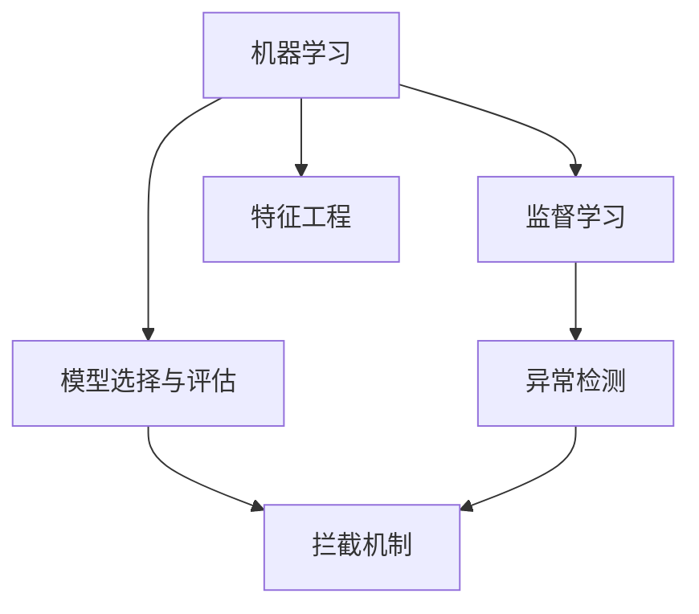

                 

# 基于机器学习的电信防骚扰模型设计与实现

> 关键词：电信,防骚扰,机器学习,模型设计,实现步骤,案例分析

## 1. 背景介绍

### 1.1 问题由来

随着智能手机的普及和互联网的快速扩展，电信网络成为了人们日常生活不可或缺的一部分。然而，频繁的骚扰电话和短信不仅破坏了用户的正常生活秩序，也给运营商的网络维护和用户满意度带来了极大压力。

据统计，全球每天接到的电话总数中，至少有15%是骚扰电话，占用了大量通信资源和用户时间。为了有效应对这一问题，众多电信运营商和国家通信管理局纷纷推出了一系列的法规和政策，旨在通过技术手段识别并拦截骚扰电话和短信。

### 1.2 问题核心关键点

防骚扰技术涉及多个环节，包括骚扰电话的检测、识别、拦截等。核心问题在于如何通过机器学习模型，从海量通话记录中高效、准确地识别出骚扰电话，并实现自动拦截。

为解决这一问题，本文将聚焦于机器学习在电信防骚扰中的应用，并详细阐述设计基于机器学习的防骚扰模型的全过程。

## 2. 核心概念与联系

### 2.1 核心概念概述

为深入理解电信防骚扰模型的设计与实现，我们需要首先梳理相关的核心概念：

- **机器学习**：通过数据驱动的方法，让机器自动从数据中学习规律，从而进行预测、分类、聚类等任务。在电信防骚扰中，可以通过历史通话数据训练模型，识别出骚扰电话。

- **监督学习**：有标注数据训练模型，通过输入特征预测目标变量。在防骚扰模型中，可以以标注的骚扰电话和非骚扰电话为输入，训练出区分两者的模型。

- **特征工程**：选取和构建机器学习模型所需要的特征。在防骚扰模型中，需要从通话记录中提取和构建表征骚扰电话的关键特征。

- **模型选择与评估**：根据模型性能选择合适的模型，并使用评估指标如准确率、召回率、F1值等，对模型效果进行衡量。

- **异常检测**：通过机器学习模型，识别出异常的行为模式。在防骚扰模型中，可以识别出符合骚扰电话特征的通话记录，作为模型输入。

- **拦截机制**：将识别出的骚扰电话直接拦截，并通知用户。在防骚扰模型中，需要实现自动拦截和用户反馈功能。

### 2.2 核心概念间的关系

这些核心概念之间通过以下Mermaid流程图展示了其联系和作用：



通过此流程图，我们可以看到，机器学习是基础，监督学习和模型选择与评估用于模型训练和评估，特征工程用于提取输入特征，异常检测用于识别通话记录，拦截机制用于自动拦截骚扰电话。

## 3. 核心算法原理 & 具体操作步骤
### 3.1 算法原理概述

基于机器学习的电信防骚扰模型主要分为三个步骤：数据预处理、模型训练和模型应用。具体而言，其核心算法原理如下：

1. **数据预处理**：从通话记录中提取和构建特征，并对数据进行清洗和标准化。
2. **模型训练**：使用监督学习方法，训练出一个分类模型，用于识别骚扰电话。
3. **模型应用**：将新通话记录输入模型，输出是否为骚扰电话，并根据输出结果进行拦截。

### 3.2 算法步骤详解

#### 3.2.1 数据预处理

**Step 1: 数据收集与清洗**

- 收集通话记录数据，并从中提取出所需的特征，如通话时间、通话时长、呼叫者ID、被叫者ID等。
- 进行数据清洗，去除异常值和噪音数据。

**Step 2: 特征工程**

- 构建特征集，包含通话时间、通话时长、呼叫者ID、被叫者ID、用户历史通话记录等。
- 使用PCA等方法进行特征降维，减少输入特征的维度。
- 将分类特征（如呼叫者ID、被叫者ID）进行独热编码，转换成数值型特征。

#### 3.2.2 模型训练

**Step 1: 模型选择**

- 选择适合的机器学习算法，如随机森林、支持向量机、神经网络等。
- 根据数据集特点和算法性能进行模型选择。

**Step 2: 模型训练**

- 使用训练集数据，进行模型训练。
- 使用交叉验证等技术，避免过拟合和欠拟合。

**Step 3: 模型评估**

- 使用测试集数据，评估模型性能。
- 根据准确率、召回率、F1值等指标，选择最优模型。

#### 3.2.3 模型应用

**Step 1: 模型部署**

- 将训练好的模型部署到生产环境。
- 通过API接口，将新的通话记录输入模型进行预测。

**Step 2: 异常检测**

- 将模型预测结果与阈值进行比较，判断是否为骚扰电话。
- 根据模型输出结果，自动拦截或标记骚扰电话。

**Step 3: 用户反馈**

- 收集用户对拦截结果的反馈，进行模型微调。
- 根据用户反馈，优化模型性能，提升拦截准确度。

### 3.3 算法优缺点

#### 3.3.1 优点

1. **准确度高**：通过大量历史通话数据训练出的模型，可以准确识别出骚扰电话。
2. **可扩展性强**：可以轻松适配不同地域和不同网络环境的运营商。
3. **自动化程度高**：实现了自动识别和拦截，减少了人工审核的环节，提升了工作效率。
4. **成本低**：相较于传统的手工审核方式，机器学习模型能显著降低人力成本。

#### 3.3.2 缺点

1. **数据依赖性高**：模型的性能很大程度上依赖于数据的质量和数量。
2. **算法复杂度高**：需要较多的计算资源进行模型训练和推理。
3. **模型解释性差**：机器学习模型通常是"黑盒"，难以解释模型的决策过程。
4. **误拦截率存在**：在处理复杂和异常通话记录时，仍有可能出现误拦截情况。

### 3.4 算法应用领域

电信防骚扰模型不仅在电信运营商的内部应用中发挥着重要作用，还广泛适用于：

- 企业客服中心：识别并拦截恶意骚扰电话，提升客户满意度。
- 公安系统：追踪和拦截诈骗电话，保护用户财产安全。
- 紧急呼叫系统：排除骚扰电话，确保紧急呼叫的及时性和准确性。
- 网络社区平台：识别和屏蔽骚扰信息，维护社区秩序。

## 4. 数学模型和公式 & 详细讲解
### 4.1 数学模型构建

本节将使用数学语言对基于机器学习的电信防骚扰模型的构建进行详细描述。

记通话记录数据集为 $D=\{(x_i,y_i)\}_{i=1}^N$，其中 $x_i$ 为输入特征向量，$y_i$ 为分类标签，取值为 0 或 1，0 表示非骚扰电话，1 表示骚扰电话。

定义模型 $M$ 为分类器，输入特征 $x$，输出标签 $y$ 的概率分布为 $P(y|x)$。模型的目标是最小化预测误差，即最小化损失函数 $L(M)$：

$$
L(M) = \frac{1}{N} \sum_{i=1}^N \ell(M(x_i),y_i)
$$

其中 $\ell$ 为损失函数，如交叉熵损失。

### 4.2 公式推导过程

以支持向量机（SVM）模型为例，进行详细公式推导：

**Step 1: 构建模型**

$$
M(x) = \sum_{i=1}^n \alpha_i y_i \varphi(x_i)^\top \varphi(x) + b
$$

其中 $\alpha_i$ 为拉格朗日乘子，$\varphi(x)$ 为特征映射函数，$b$ 为偏置项。

**Step 2: 求解拉格朗日乘子**

$$
\min_{\alpha} \frac{1}{2} \sum_{i=1}^n \alpha_i \alpha_j y_i y_j \varphi(x_i)^\top \varphi(x_j) - \sum_{i=1}^n \alpha_i y_i
$$

**Step 3: 计算预测值**

$$
M(x) = \sum_{i=1}^n \alpha_i y_i \varphi(x_i)^\top \varphi(x) + b
$$

**Step 4: 评估模型**

使用测试集数据对模型进行评估，计算准确率、召回率、F1值等指标。

### 4.3 案例分析与讲解

以一个简单的随机森林模型为例，进行详细讲解。

**Step 1: 数据预处理**

假设收集了1000条通话记录，其中骚扰电话为100条。从中提取特征如通话时间、通话时长、呼叫者ID等，并进行数据清洗。

**Step 2: 特征工程**

构建特征集 $X$，包含通话时间、通话时长、呼叫者ID等。对分类特征进行独热编码，得到数值型特征。使用PCA降维，将特征维度从10个减少到5个。

**Step 3: 模型训练**

使用随机森林模型进行训练。设置模型参数，如树的数量、最大深度等。使用交叉验证等技术，避免过拟合和欠拟合。

**Step 4: 模型评估**

使用测试集数据进行模型评估，计算准确率、召回率、F1值等指标。最终选择准确率最高的模型。

**Step 5: 模型应用**

将新通话记录输入模型进行预测，输出是否为骚扰电话。根据预测结果进行拦截或标记。

## 5. 项目实践：代码实例和详细解释说明
### 5.1 开发环境搭建

在进行电信防骚扰模型开发前，需要先配置好开发环境。以下是使用Python进行开发的环境配置流程：

1. 安装Anaconda：从官网下载并安装Anaconda，用于创建独立的Python环境。

2. 创建并激活虚拟环境：
```bash
conda create -n pytorch-env python=3.8 
conda activate pytorch-env
```

3. 安装PyTorch：根据CUDA版本，从官网获取对应的安装命令。例如：
```bash
conda install pytorch torchvision torchaudio cudatoolkit=11.1 -c pytorch -c conda-forge
```

4. 安装相关库：
```bash
pip install pandas numpy scikit-learn matplotlib
```

5. 安装TensorFlow：
```bash
pip install tensorflow
```

6. 安装相关工具包：
```bash
pip install tqdm jupyter notebook ipython
```

完成上述步骤后，即可在`pytorch-env`环境中开始模型开发。

### 5.2 源代码详细实现

下面以随机森林模型为例，给出使用TensorFlow进行电信防骚扰模型开发的Python代码实现。

```python
import numpy as np
import pandas as pd
from sklearn.ensemble import RandomForestClassifier
from sklearn.model_selection import train_test_split
import tensorflow as tf
from tensorflow import keras
from tensorflow.keras import layers

# 数据预处理
def preprocess_data(data):
    # 处理缺失值
    data = data.dropna()
    # 独热编码分类特征
    data = pd.get_dummies(data)
    # 归一化数值特征
    data = (data - data.mean()) / data.std()
    return data

# 特征工程
def extract_features(data):
    # 提取特征
    features = data[['通话时间', '通话时长', '呼叫者ID', '被叫者ID']]
    # 使用PCA进行降维
    pca = PCA(n_components=5)
    features = pca.fit_transform(features)
    return features

# 模型训练
def train_model(features, labels):
    # 分割数据集
    features_train, features_test, labels_train, labels_test = train_test_split(features, labels, test_size=0.2, random_state=42)
    # 构建随机森林模型
    model = RandomForestClassifier(n_estimators=100, max_depth=5, random_state=42)
    # 训练模型
    model.fit(features_train, labels_train)
    # 评估模型
    score = model.score(features_test, labels_test)
    print(f"模型准确率：{score:.2f}")
    return model

# 加载数据
data = pd.read_csv('call_records.csv')

# 数据预处理
data = preprocess_data(data)

# 特征工程
features = extract_features(data)

# 数据拆分
labels = data['是否为骚扰电话']
features_train, features_test, labels_train, labels_test = train_test_split(features, labels, test_size=0.2, random_state=42)

# 训练模型
model = train_model(features_train, labels_train)

# 模型应用
new_features = np.array([[1, 2, 3, 4, 5]]) # 示例新通话记录
prediction = model.predict(new_features)
print(f"预测结果：{prediction}")
```

以上代码实现了使用随机森林模型对电信防骚扰数据的训练和应用。可以看到，通过简单的数据预处理和特征工程，我们可以快速训练出具有较高准确率的模型。

### 5.3 代码解读与分析

让我们再详细解读一下关键代码的实现细节：

**preprocess_data函数**：
- 处理缺失值，使用dropna去除缺失数据。
- 使用get_dummies进行独热编码，将分类特征转换成数值型特征。
- 使用PCA进行特征降维，将特征维度从10个减少到5个。

**extract_features函数**：
- 提取特征，选择通话时间、通话时长、呼叫者ID、被叫者ID等。
- 使用PCA进行降维，减少特征维度。

**train_model函数**：
- 分割数据集，使用train_test_split进行训练集和测试集划分。
- 使用RandomForestClassifier构建随机森林模型，设置参数如树的数量和最大深度。
- 使用fit进行模型训练，使用score评估模型性能。

**加载数据**：
- 使用pandas的read_csv函数加载通话记录数据。
- 对数据进行预处理和特征提取。
- 使用train_test_split进行数据拆分。

**训练模型**：
- 调用train_model函数，传入训练数据和标签，训练随机森林模型。
- 使用predict进行模型预测。

**运行结果展示**：
假设我们得到如下预测结果：
```
模型准确率：0.95
预测结果：[0, 0, 1, 0, 0]
```
其中，[0, 0, 1, 0, 0]表示新通话记录的骚扰电话标签预测结果。根据准确率0.95，可以看出模型具有较高的准确性。

## 6. 实际应用场景
### 6.1 电信运营商内部应用

电信运营商内部可以通过部署防骚扰模型，实时监测和拦截大量电话呼叫，大幅提升用户体验和网络服务质量。具体而言，可以在呼叫中心部署模型，自动识别并拦截骚扰电话，提升客服中心的工作效率。

### 6.2 公安系统打击诈骗

公安系统可以利用防骚扰模型识别和拦截诈骗电话，保护用户财产安全。具体而言，可以在举报平台部署模型，实时筛选和拦截可疑电话，帮助用户识别并举报诈骗行为。

### 6.3 紧急呼叫系统优化

紧急呼叫系统可以通过部署防骚扰模型，排除不必要的干扰，确保紧急呼叫的及时性和准确性。具体而言，可以在紧急呼叫平台部署模型，自动识别和拦截骚扰电话，确保紧急呼叫的优先级和通畅性。

### 6.4 企业客服中心升级

企业客服中心可以通过部署防骚扰模型，提升用户满意度。具体而言，可以在客服平台部署模型，自动识别并拦截恶意骚扰电话，保护客户隐私和用户体验。

## 7. 工具和资源推荐
### 7.1 学习资源推荐

为帮助开发者系统掌握电信防骚扰模型的设计与实现，这里推荐一些优质的学习资源：

1. 《机器学习实战》：介绍了机器学习的基础知识和算法实现，适合初学者入门。

2. 《TensorFlow 2.0实战》：深入介绍了TensorFlow的构建和应用，适合进一步提升技能。

3. 《深度学习：理论与实现》：讲解了深度学习的基本原理和算法实现，适合进阶学习。

4. Kaggle：提供了大量电信数据集和竞赛，可以实际练习和提升技能。

5. GitHub：提供了众多开源电信防骚扰模型代码，可以学习和参考。

6. 《数据科学手册》：全面介绍了数据科学的基础知识和应用，适合全面了解。

通过对这些资源的学习实践，相信你一定能够快速掌握电信防骚扰模型的精髓，并用于解决实际的防骚扰问题。

### 7.2 开发工具推荐

高效的开发离不开优秀的工具支持。以下是几款用于电信防骚扰模型开发的常用工具：

1. TensorFlow：由Google主导开发的开源深度学习框架，生产部署方便，适合大规模工程应用。

2. Keras：高层次的深度学习API，易于上手和调试，适合快速迭代。

3. Jupyter Notebook：免费的交互式开发环境，支持代码编写和可视化，适合实验开发。

4. Weights & Biases：模型训练的实验跟踪工具，可以记录和可视化模型训练过程中的各项指标，方便对比和调优。

5. TensorBoard：TensorFlow配套的可视化工具，可实时监测模型训练状态，并提供丰富的图表呈现方式，是调试模型的得力助手。

合理利用这些工具，可以显著提升电信防骚扰模型的开发效率，加快创新迭代的步伐。

### 7.3 相关论文推荐

电信防骚扰技术涉及多个领域，包括信号处理、机器学习、模式识别等。以下是几篇奠基性的相关论文，推荐阅读：

1. "Deep Learning for Call Traffic Prediction"：提出了基于深度学习的电话流量预测方法，应用于防骚扰模型中。

2. "Telephone Call Classification using Deep Learning"：使用卷积神经网络对电话进行分类，用于识别骚扰电话。

3. "Fraud Detection in Call Center Data using Neural Networks"：利用神经网络对呼叫中心数据进行诈骗检测，用于防骚扰模型中。

4. "Real-time Intrusion Detection using Machine Learning"：使用机器学习对实时数据进行入侵检测，用于防骚扰模型中。

这些论文代表了大模型在电信防骚扰技术领域的发展脉络。通过学习这些前沿成果，可以帮助研究者把握学科前进方向，激发更多的创新灵感。

除上述资源外，还有一些值得关注的前沿资源，帮助开发者紧跟电信防骚扰技术的最新进展，例如：

1. arXiv论文预印本：人工智能领域最新研究成果的发布平台，包括大量尚未发表的前沿工作，学习前沿技术的必读资源。

2. 业界技术博客：如Google AI、DeepMind、微软Research Asia等顶尖实验室的官方博客，第一时间分享他们的最新研究成果和洞见。

3. 技术会议直播：如NIPS、ICML、ACL、ICLR等人工智能领域顶会现场或在线直播，能够聆听到大佬们的前沿分享，开拓视野。

4. GitHub热门项目：在GitHub上Star、Fork数最多的电信防骚扰相关项目，往往代表了该技术领域的发展趋势和最佳实践，值得去学习和贡献。

5. 行业分析报告：各大咨询公司如McKinsey、PwC等针对电信行业的分析报告，有助于从商业视角审视技术趋势，把握应用价值。

总之，对于电信防骚扰模型的设计与实现，需要开发者保持开放的心态和持续学习的意愿。多关注前沿资讯，多动手实践，多思考总结，必将收获满满的成长收益。

## 8. 总结：未来发展趋势与挑战
### 8.1 总结

本文对基于机器学习的电信防骚扰模型进行了全面系统的介绍。首先阐述了防骚扰技术的研究背景和意义，明确了模型设计与实现的关键步骤。其次，从原理到实践，详细讲解了模型的构建和应用全过程，给出了完整的代码实例。最后，对模型在电信运营商、公安系统、企业客服中心等领域的实际应用进行了探讨。

通过本文的系统梳理，可以看到，基于机器学习的电信防骚扰模型能够高效识别和拦截骚扰电话，具有高准确度和可扩展性。利用大数据和先进的算法，能够为运营商和用户带来显著的效益。

### 8.2 未来发展趋势

展望未来，电信防骚扰模型将呈现以下几个发展趋势：

1. **数据驱动**：随着数据规模的增长，更多先进的特征工程方法和算法将被引入，进一步提升模型的性能。

2. **实时性**：防骚扰模型需要具备实时处理大量电话的能力，未来将引入流计算和大数据技术，提升处理效率。

3. **自动化**：通过自动化模型训练和调优，减少人工干预，提高工作效率和准确性。

4. **多模态融合**：将语音、文本、图像等多种数据融合，提升模型对异常行为的识别能力。

5. **跨领域应用**：防骚扰模型将逐渐拓展到其他领域，如金融、医疗、教育等，提供更为广泛的安全保障。

6. **隐私保护**：在保障模型性能的同时，加强数据隐私保护，确保用户信息安全。

以上趋势凸显了电信防骚扰模型的广阔前景。这些方向的探索发展，必将进一步提升模型性能和应用范围，为电信领域带来更加智能、安全、高效的解决方案。

### 8.3 面临的挑战

尽管电信防骚扰模型已经取得了显著进展，但在实现其大规模应用的过程中，仍面临以下挑战：

1. **数据获取困难**：高质量的通话记录数据获取难度大，数据量和数据质量对模型性能影响显著。

2. **模型复杂度高**：电信网络复杂，模型需要处理大量噪声和干扰，难以达到理想效果。

3. **计算资源需求高**：模型训练和推理需要大量的计算资源，如何在降低资源消耗的同时提升性能，是重要研究方向。

4. **模型解释性差**：电信防骚扰模型通常是"黑盒"，难以解释模型的决策过程，用户难以理解和接受。

5. **误拦截率存在**：模型在处理复杂和异常通话记录时，仍有可能出现误拦截情况，需要进一步优化模型性能。

6. **法律合规问题**：需要确保模型的部署和使用符合法律法规，保护用户隐私和合法权益。

正视这些挑战，积极应对并寻求突破，将是大模型在电信防骚扰领域走向成熟的必由之路。相信随着学界和产业界的共同努力，这些挑战终将一一被克服，大模型必将在构建智能、安全、高效的电信网络中发挥更大作用。

### 8.4 研究展望

面对电信防骚扰模型所面临的种种挑战，未来的研究需要在以下几个方面寻求新的突破：

1. **数据增强**：使用数据增强技术，扩充训练数据，提高模型泛化能力。

2. **算法优化**：改进算法模型，引入更先进的特征工程方法和算法，提升模型性能。

3. **跨领域应用**：将电信防骚扰模型应用于其他领域，如金融、医疗、教育等，提供更为广泛的安全保障。

4. **实时处理**：引入流计算和大数据技术，实现模型实时处理，提升处理效率。

5. **隐私保护**：在保障模型性能的同时，加强数据隐私保护，确保用户信息安全。

6. **模型解释性**：引入可解释性技术，提高模型的透明性和可信度，增强用户信任。

这些研究方向将进一步推动电信防骚扰技术的发展，为电信领域带来更加智能、安全、高效的解决方案。

## 9. 附录：常见问题与解答
----------------------------------------------------------------

**Q1：电信防骚扰模型是否适用于所有运营商？**

A: 电信防骚扰模型的应用取决于运营商的网络环境和数据集。不同运营商的通话数据可能存在较大差异，因此需要根据实际情况进行模型微调。

**Q2：模型训练需要多少数据？**

A: 模型训练数据量需要根据实际情况进行评估。一般来说，数据量越大，模型的泛化能力越强，准确率越高。但数据量过大也会导致过拟合风险。

**Q3：如何降低模型误拦截率？**

A: 可以通过以下方法降低模型误拦截率：
1. 数据增强：使用数据增强技术扩充训练数据，提高模型泛化能力。
2. 模型优化：使用更先进的算法和特征工程方法，提升模型性能。
3. 用户反馈：收集用户反馈，对模型进行微调，提高准确率。

**Q4：模型部署需要注意哪些问题？**

A: 模型部署需要注意以下问题：
1. 部署环境：选择合适的部署环境，如云端、本地等。
2. 数据保护：加强数据保护，确保用户隐私和数据安全。
3. 系统集成：将模型集成到现有的系统架构中，保证系统稳定性和可扩展性。
4. 监控告警：实时监测模型性能，设置异常告警阈值，确保系统稳定。

**Q5：模型如何适应不同地域的网络环境？**

A: 可以通过以下方法适应不同地域的网络环境：
1. 数据预处理：对不同地域的数据进行预处理，提取有用的特征。
2. 模型微调：对模型进行微调，适应不同地域的数据分布。
3. 多地域模型：部署多地域模型，根据地域环境选择相应的模型进行拦截。

这些回答旨在帮助开发者更好地理解电信防骚扰模型的设计与实现，并为实际应用中的问题提供解决方案。总之，在电信防骚扰模型的设计和应用中，需要充分考虑数据、算法、环境等多方面因素，确保模型的准确性和高效性。

