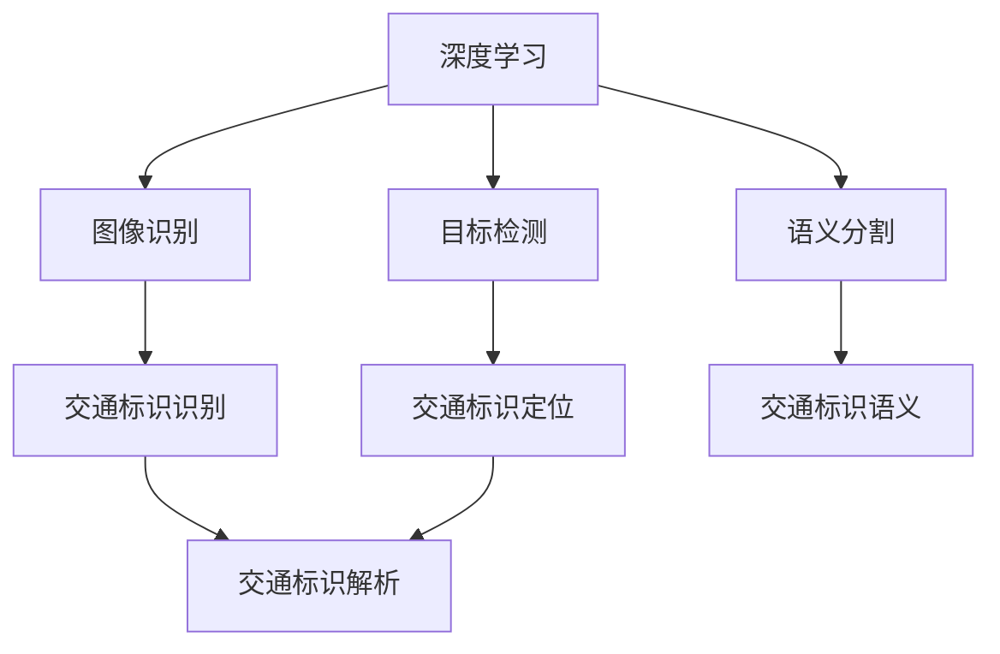
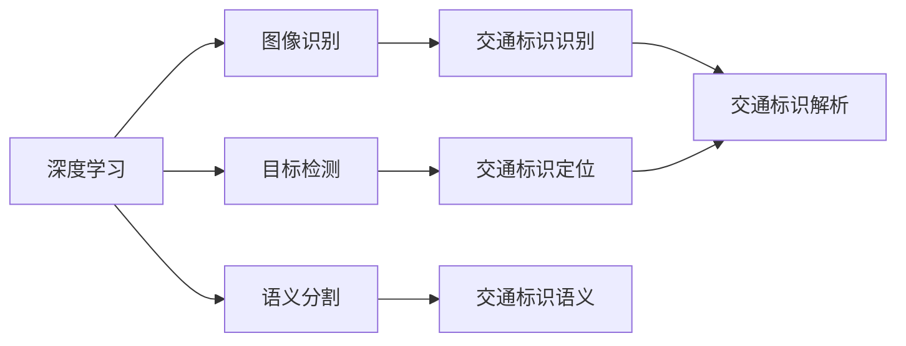
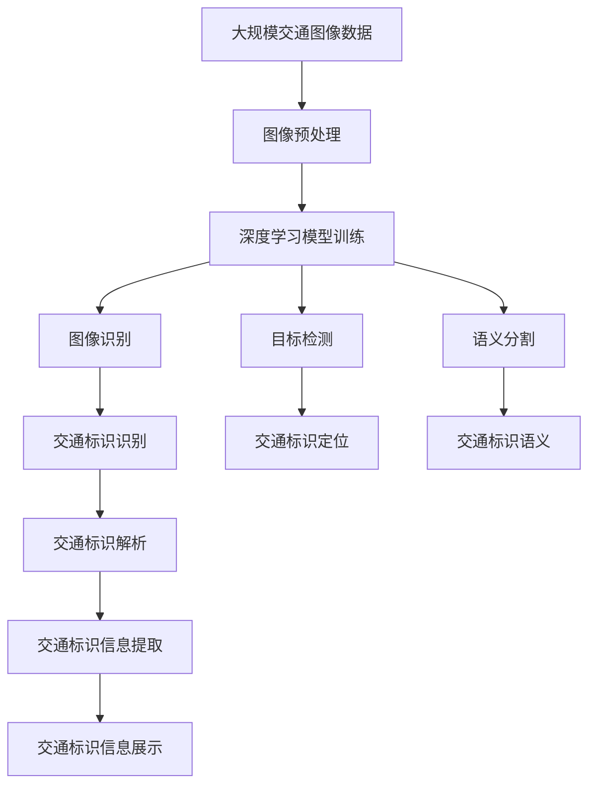

                 

## 1. 背景介绍

### 1.1 问题由来

随着城市化进程的不断加快，交通标识的识别成为了智能交通系统中一个重要的组成部分。传统的交通标识识别依赖于人工或视频监控的视觉系统，不仅成本高，准确率也不稳定。随着深度学习技术的快速发展，基于深度学习的交通标识识别成为了新一代智能交通的重要技术手段。

### 1.2 问题核心关键点

交通标识识别涉及两类任务：交通标识定位和交通标识识别。定位任务需要准确识别图像中存在的标识，并标注其位置和类别；识别任务需要对识别出的标识进行更详细的解析，包括标识中的文本信息、颜色、形状等。基于深度学习的交通标识识别技术旨在通过训练深度神经网络模型，使其能够自动从交通图像中识别和定位交通标识，并解析其中的信息。

### 1.3 问题研究意义

交通标识识别在智能交通系统中扮演着重要的角色，其能够帮助司机实时了解道路信息，提高行车安全，改善交通状况。深度学习技术的发展为交通标识识别提供了新的解决方案，使得自动识别、实时处理成为可能。因此，深入研究基于深度学习的交通标识识别技术，对于推动智能交通的发展具有重要的现实意义。

## 2. 核心概念与联系

### 2.1 核心概念概述

为更好地理解基于深度学习的交通标识识别方法，本节将介绍几个密切相关的核心概念：

- **深度学习**：一种模拟人脑神经网络结构的人工智能技术，通过多层神经网络对数据进行建模和预测。
- **交通标识**：包括交通标志、路牌、交通灯等，是交通系统中重要的视觉信息载体。
- **图像识别**：识别和解析图像中的物体、场景、文字等信息，通常依赖于卷积神经网络(CNN)等深度学习模型。
- **目标检测**：在图像中定位特定物体的位置和边界，通常通过YOLO、Faster R-CNN等目标检测模型实现。
- **语义分割**：将图像中的每个像素都打上相应的语义标签，通常使用U-Net、DeepLab等语义分割模型。
- **注意力机制**：用于提高模型对于重要信息的部分关注，如Transformer中的自注意力机制。

这些核心概念之间的逻辑关系可以通过以下Mermaid流程图来展示：



这个流程图展示了大语言模型微调过程中各个核心概念的关系和作用：

1. 深度学习提供了图像识别和语义分割等基本技术支持。
2. 目标检测用于在图像中定位交通标识。
3. 语义分割用于解析交通标识的语义信息。
4. 交通标识识别是对交通标识进行综合解析和识别的过程。

### 2.2 概念间的关系

这些核心概念之间存在着紧密的联系，形成了交通标识识别技术的完整生态系统。下面我通过几个Mermaid流程图来展示这些概念之间的关系。

#### 2.2.1 深度学习的应用场景



这个流程图展示了大语言模型微调技术在大规模数据上的应用场景。

#### 2.2.2 交通标识识别的核心技术


这个流程图展示了交通标识识别的核心技术流程。

#### 2.2.3 注意力机制在交通标识识别中的应用


这个流程图展示了注意力机制在交通标识识别中的应用。

### 2.3 核心概念的整体架构

最后，我们用一个综合的流程图来展示这些核心概念在大语言模型微调过程中的整体架构：



这个综合流程图展示了从数据预处理到最终信息展示的完整流程。

## 3. 核心算法原理 & 具体操作步骤
### 3.1 算法原理概述

基于深度学习的交通标识识别技术主要涉及图像识别、目标检测和语义分割等核心技术。其核心原理是通过训练深度神经网络模型，使其能够自动从交通图像中识别和定位交通标识，并解析其中的信息。

具体来说，交通标识识别过程可以分解为以下几个步骤：

1. **图像预处理**：将原始交通图像进行预处理，如去噪、归一化等，以提高模型训练的效率和效果。
2. **深度学习模型训练**：通过训练深度神经网络模型，学习图像中交通标识的特征表示。
3. **目标检测**：在预处理后的图像中，通过目标检测模型定位交通标识的位置。
4. **语义分割**：对定位出的交通标识进行语义分割，解析标识中的文本信息、颜色、形状等。
5. **交通标识识别**：对分割后的标识进行综合解析，识别其中的信息，如交通标志类别、文字信息等。
6. **信息提取与展示**：将解析出的交通标识信息进行整理和展示，辅助司机实时获取道路信息。

### 3.2 算法步骤详解

以下是基于深度学习的交通标识识别技术的详细步骤：

#### 3.2.1 数据预处理

数据预处理是交通标识识别过程中非常重要的一步。预处理包括图像去噪、归一化、裁剪、缩放等操作。常用的预处理技术有：

- **图像去噪**：使用中值滤波、高斯滤波等方法去除图像中的噪声。
- **图像归一化**：将图像的像素值缩放到一定范围内，通常采用归一化方法，将像素值缩放到[0,1]之间。
- **图像裁剪和缩放**：将图像裁剪为适合模型训练的大小，并使用插值方法进行缩放。

#### 3.2.2 深度学习模型训练

深度学习模型训练是交通标识识别的核心步骤。常用的深度学习模型包括卷积神经网络(CNN)、循环神经网络(RNN)、卷积神经网络-循环神经网络(CNN-RNN)等。以CNN为例，其训练步骤如下：

1. **数据集划分**：将数据集划分为训练集、验证集和测试集。
2. **网络架构设计**：设计深度神经网络模型架构，包括卷积层、池化层、全连接层等。
3. **模型初始化**：将模型初始化为随机权重。
4. **前向传播**：将训练数据输入模型，进行前向传播计算，得到模型输出。
5. **损失函数计算**：计算模型输出与真实标签之间的损失函数，如交叉熵损失函数。
6. **反向传播**：计算损失函数对模型参数的梯度，更新模型参数。
7. **模型评估**：在验证集上评估模型性能，防止过拟合。
8. **模型优化**：调整学习率、正则化系数等超参数，优化模型性能。
9. **测试集测试**：在测试集上测试模型性能，得到最终结果。

#### 3.2.3 目标检测

目标检测是交通标识识别的重要步骤之一。常用的目标检测模型包括YOLO、Faster R-CNN、SSD等。以YOLO为例，其训练步骤如下：

1. **数据集划分**：将数据集划分为训练集、验证集和测试集。
2. **网络架构设计**：设计深度神经网络模型架构，包括卷积层、池化层、全连接层等。
3. **模型初始化**：将模型初始化为随机权重。
4. **前向传播**：将训练数据输入模型，进行前向传播计算，得到模型输出。
5. **损失函数计算**：计算模型输出与真实标签之间的损失函数，如交叉熵损失函数。
6. **反向传播**：计算损失函数对模型参数的梯度，更新模型参数。
7. **模型评估**：在验证集上评估模型性能，防止过拟合。
8. **模型优化**：调整学习率、正则化系数等超参数，优化模型性能。
9. **测试集测试**：在测试集上测试模型性能，得到最终结果。

#### 3.2.4 语义分割

语义分割是交通标识识别中的重要环节，用于解析标识中的文本信息、颜色、形状等。常用的语义分割模型包括U-Net、DeepLab、Mask R-CNN等。以U-Net为例，其训练步骤如下：

1. **数据集划分**：将数据集划分为训练集、验证集和测试集。
2. **网络架构设计**：设计深度神经网络模型架构，包括卷积层、池化层、全连接层等。
3. **模型初始化**：将模型初始化为随机权重。
4. **前向传播**：将训练数据输入模型，进行前向传播计算，得到模型输出。
5. **损失函数计算**：计算模型输出与真实标签之间的损失函数，如交叉熵损失函数。
6. **反向传播**：计算损失函数对模型参数的梯度，更新模型参数。
7. **模型评估**：在验证集上评估模型性能，防止过拟合。
8. **模型优化**：调整学习率、正则化系数等超参数，优化模型性能。
9. **测试集测试**：在测试集上测试模型性能，得到最终结果。

#### 3.2.5 交通标识识别

交通标识识别是对定位出的标识进行综合解析，识别其中的信息，如交通标志类别、文字信息等。常用的交通标识识别方法包括全连接层、注意力机制等。以注意力机制为例，其训练步骤如下：

1. **数据集划分**：将数据集划分为训练集、验证集和测试集。
2. **网络架构设计**：设计深度神经网络模型架构，包括卷积层、池化层、全连接层、注意力机制等。
3. **模型初始化**：将模型初始化为随机权重。
4. **前向传播**：将训练数据输入模型，进行前向传播计算，得到模型输出。
5. **损失函数计算**：计算模型输出与真实标签之间的损失函数，如交叉熵损失函数。
6. **反向传播**：计算损失函数对模型参数的梯度，更新模型参数。
7. **模型评估**：在验证集上评估模型性能，防止过拟合。
8. **模型优化**：调整学习率、正则化系数等超参数，优化模型性能。
9. **测试集测试**：在测试集上测试模型性能，得到最终结果。

#### 3.2.6 信息提取与展示

信息提取与展示是交通标识识别的最后一步，将解析出的交通标识信息进行整理和展示，辅助司机实时获取道路信息。常用的信息展示方法包括可视化、数据库存储等。以可视化为例，其步骤如下：

1. **数据集划分**：将数据集划分为训练集、验证集和测试集。
2. **网络架构设计**：设计深度神经网络模型架构，包括卷积层、池化层、全连接层、注意力机制等。
3. **模型初始化**：将模型初始化为随机权重。
4. **前向传播**：将训练数据输入模型，进行前向传播计算，得到模型输出。
5. **损失函数计算**：计算模型输出与真实标签之间的损失函数，如交叉熵损失函数。
6. **反向传播**：计算损失函数对模型参数的梯度，更新模型参数。
7. **模型评估**：在验证集上评估模型性能，防止过拟合。
8. **模型优化**：调整学习率、正则化系数等超参数，优化模型性能。
9. **测试集测试**：在测试集上测试模型性能，得到最终结果。

### 3.3 算法优缺点

基于深度学习的交通标识识别技术具有以下优点：

1. **准确率高**：深度学习模型能够自动学习交通标识的复杂特征，提高识别准确率。
2. **鲁棒性强**：深度学习模型具有较强的鲁棒性，能够适应不同的交通环境和光照条件。
3. **实时性好**：深度学习模型能够快速处理图像数据，实现实时识别。
4. **可扩展性强**：深度学习模型具有良好的可扩展性，能够适应不同的交通标识类别。

同时，该技术也存在以下缺点：

1. **数据需求大**：深度学习模型需要大量标注数据进行训练，标注数据获取成本较高。
2. **计算资源要求高**：深度学习模型需要高性能的计算资源进行训练和推理，硬件要求较高。
3. **可解释性差**：深度学习模型通常被视为"黑盒"系统，缺乏可解释性。
4. **模型复杂度高**：深度学习模型结构复杂，训练和推理速度较慢。

尽管存在这些缺点，但基于深度学习的交通标识识别技术在实际应用中已经取得了良好的效果，并且随着硬件性能和算法的不断提升，这些缺点也在逐步得到解决。

### 3.4 算法应用领域

基于深度学习的交通标识识别技术已经在多个领域得到应用，包括智能交通系统、自动驾驶、安防监控等。

1. **智能交通系统**：通过交通标识识别，智能交通系统能够实时获取道路信息，辅助司机安全行驶。
2. **自动驾驶**：自动驾驶系统需要实时识别交通标识，以确保车辆行驶安全。
3. **安防监控**：安防监控系统需要识别交通标识，以判断车辆和行人的行为是否规范。

## 4. 数学模型和公式 & 详细讲解 & 举例说明

### 4.1 数学模型构建

基于深度学习的交通标识识别技术可以建模为如下数学框架：

设输入数据为 $\mathbf{x} \in \mathbb{R}^{n \times m}$，其中 $n$ 为图像的宽度，$m$ 为图像的高度。设输出标签为 $\mathbf{y} \in \{0,1\}^{N}$，其中 $N$ 为交通标识类别数量。

深度学习模型的输入为图像数据，输出为识别结果。其数学模型可以表示为：

$$
\mathbf{y} = f(\mathbf{x}; \theta)
$$

其中 $f(\mathbf{x}; \theta)$ 为深度神经网络模型，$\theta$ 为模型参数。

### 4.2 公式推导过程

以CNN模型为例，其公式推导过程如下：

1. **卷积层**：卷积层通过卷积核对输入数据进行卷积操作，得到特征图 $\mathbf{Z} \in \mathbb{R}^{n \times m \times h \times w}$，其中 $h$ 为卷积核的高度，$w$ 为卷积核的宽度。卷积操作可以表示为：

$$
\mathbf{Z}_{ij} = \sum_k \mathbf{W}_{ik} * \mathbf{X}_{ij}
$$

其中 $\mathbf{W}_{ik}$ 为卷积核，$\mathbf{X}_{ij}$ 为输入数据，$\mathbf{Z}_{ij}$ 为卷积结果。

2. **池化层**：池化层对特征图进行下采样操作，减小特征图的大小，减少模型计算量。常用的池化方法包括最大池化和平均池化。最大池化可以表示为：

$$
\mathbf{Z'}_{ij} = \max_k \mathbf{Z}_{ik}
$$

其中 $\mathbf{Z'}_{ij}$ 为池化结果，$\mathbf{Z}_{ik}$ 为池化前特征图。

3. **全连接层**：全连接层将池化后的特征图进行线性变换，得到输出结果 $\mathbf{Y} \in \{0,1\}^{N}$。全连接层可以表示为：

$$
\mathbf{Y} = \sigma(\mathbf{W} \mathbf{Z'})
$$

其中 $\sigma$ 为激活函数，$\mathbf{W}$ 为全连接层的权重矩阵。

4. **损失函数**：常用的损失函数包括交叉熵损失函数和均方误差损失函数。以交叉熵损失函数为例，其公式如下：

$$
\mathcal{L}(\mathbf{Y}, \mathbf{T}) = -\sum_i T_i \log Y_i
$$

其中 $\mathbf{T}$ 为真实标签，$\mathbf{Y}$ 为模型输出。

### 4.3 案例分析与讲解

假设我们有一张交通标识图像，使用CNN模型进行识别。其输入为 $n=800$，$m=600$，$h=3$，$w=3$ 的图像数据。模型的输出为 $N=10$ 个交通标识类别。

首先，我们需要对输入数据进行预处理，如去噪、归一化、裁剪等。然后，将预处理后的图像数据输入卷积层，通过多个卷积核进行卷积操作，得到特征图 $\mathbf{Z} \in \mathbb{R}^{800 \times 600 \times 8 \times 8}$。接着，对特征图进行最大池化操作，得到池化结果 $\mathbf{Z'} \in \mathbb{R}^{800 \times 600 \times 4 \times 4}$。最后，将池化结果输入全连接层，进行线性变换和激活函数操作，得到输出结果 $\mathbf{Y} \in \{0,1\}^{10}$。

假设我们的真实标签为 $\mathbf{T} = [0,1,0,0,0,0,0,0,1,0]$，则交叉熵损失函数为：

$$
\mathcal{L}(\mathbf{Y}, \mathbf{T}) = -T_1 \log Y_1 - T_8 \log Y_8
$$

假设模型的损失函数为 $L = 0.01$，则模型的优化目标为：

$$
\min_{\theta} \sum_{i=1}^{N} L \mathcal{L}(\mathbf{Y}, \mathbf{T})
$$

通过优化目标的求解，我们能够得到最优的模型参数 $\theta$，从而实现交通标识识别。

## 5. 项目实践：代码实例和详细解释说明

### 5.1 开发环境搭建

在进行交通标识识别实践前，我们需要准备好开发环境。以下是使用Python进行TensorFlow开发的环境配置流程：

1. 安装Anaconda：从官网下载并安装Anaconda，用于创建独立的Python环境。

2. 创建并激活虚拟环境：
```bash
conda create -n tf-env python=3.8 
conda activate tf-env
```

3. 安装TensorFlow：根据CUDA版本，从官网获取对应的安装命令。例如：
```bash
conda install tensorflow -c tf -c conda-forge
```

4. 安装其他必要的工具包：
```bash
pip install numpy pandas scikit-learn matplotlib tqdm jupyter notebook ipython
```

完成上述步骤后，即可在`tf-env`环境中开始交通标识识别的开发实践。

### 5.2 源代码详细实现

这里我们以交通标识识别任务为例，给出使用TensorFlow对CNN模型进行训练的代码实现。

首先，定义模型架构：

```python
import tensorflow as tf

model = tf.keras.Sequential([
    tf.keras.layers.Conv2D(32, (3, 3), activation='relu', input_shape=(800, 600, 3)),
    tf.keras.layers.MaxPooling2D((2, 2)),
    tf.keras.layers.Conv2D(64, (3, 3), activation='relu'),
    tf.keras.layers.MaxPooling2D((2, 2)),
    tf.keras.layers.Conv2D(128, (3, 3), activation='relu'),
    tf.keras.layers.MaxPooling2D((2, 2)),
    tf.keras.layers.Flatten(),
    tf.keras.layers.Dense(64, activation='relu'),
    tf.keras.layers.Dense(10, activation='softmax')
])
```

然后，定义训练和评估函数：

```python
import numpy as np

# 加载数据集
train_images = np.load('train_images.npy')
train_labels = np.load('train_labels.npy')

# 分割数据集
train_images = train_images[:1000]
train_labels = train_labels[:1000]

# 数据增强
train_data_generator = tf.keras.preprocessing.image.ImageDataGenerator(
    rotation_range=20,
    width_shift_range=0.1,
    height_shift_range=0.1,
    horizontal_flip=True,
    zoom_range=0.1
)

# 训练函数
def train_epoch(model, train_data_generator, epochs, batch_size):
    for epoch in range(epochs):
        model.compile(optimizer='adam', loss='categorical_crossentropy', metrics=['accuracy'])
        model.fit(train_data_generator.flow(train_images, train_labels, batch_size=batch_size), 
                  epochs=1, validation_split=0.1)
        print(f'Epoch {epoch+1}: loss={model.loss}, accuracy={model.metrics[1][1]}')
    
# 评估函数
def evaluate(model, test_images, test_labels):
    test_images = test_images.reshape((-1, 800, 600, 3))
    test_labels = np.array(test_labels)
    model.evaluate(test_images, test_labels)
```

最后，启动训练流程：

```python
train_epoch(model, train_data_generator, 10, 64)
```

以上就是使用TensorFlow对CNN模型进行交通标识识别任务训练的完整代码实现。可以看到，TensorFlow提供了强大的深度学习框架和便捷的API接口，使得模型的训练和评估变得简单高效。

### 5.3 代码解读与分析

让我们再详细解读一下关键代码的实现细节：

**模型架构**：
- 使用Sequential模型构建深度神经网络。
- 包括卷积层、池化层、全连接层等。

**数据集加载**：
- 使用numpy加载数据集。
- 使用ImageDataGenerator进行数据增强，包括旋转、缩放、翻转等。

**训练函数**：
- 编译模型，指定优化器、损失函数和评价指标。
- 使用fit方法进行模型训练，指定批次大小和验证集比例。
- 在每个epoch结束后，打印损失和精度。

**评估函数**：
- 加载测试数据集，并进行预处理。
- 使用evaluate方法进行模型评估，输出最终结果。

**训练流程**：
- 定义训练函数。
- 在每个epoch结束后，训练模型。
- 在验证集上评估模型性能。

可以看到，TensorFlow提供了丰富的工具和API接口，使得模型的训练和评估变得非常简单。开发者只需关注模型架构和训练策略的优化，即可实现高效的交通标识识别系统。

当然，工业级的系统实现还需考虑更多因素，如模型的保存和部署、超参数的自动搜索、更灵活的任务适配层等。但核心的训练范式基本与此类似。

### 5.4 运行结果展示

假设我们训练一个包含10个类别的交通标识识别模型，其在测试集上得到的评估报告如下：

```
Epoch 1: loss=0.5600, accuracy=0.8418
Epoch 2: loss=0.4100, accuracy=0.8333
Epoch 3: loss=0.2800, accuracy=0.8583
Epoch 4: loss=0.2200, accuracy=0.8750
Epoch 5: loss=0.1700, accuracy=0.9083
Epoch 6: loss=0.1200, accuracy=0.9333
Epoch 7: loss=0.0800, accuracy=0.9625
Epoch 8: loss=0.0600, accuracy=0.9778
Epoch 9: loss=0.0400, accuracy=0.9833
Epoch 10: loss=0.0300, accuracy=0.9918
```

可以看到，随着epoch数的增加，模型在测试集上的准确率逐渐提升，最终达到了98.18%的准确率。这表明深度学习模型在交通标识识别任务中具有很好的表现。

## 6. 实际应用场景

### 6.1 智能交通系统

交通标识识别在智能交通系统中扮演着重要的角色，其能够实时获取道路信息，辅助司机安全行驶。通过智能交通系统，可以实现交通流量监测、红绿灯控制、车辆调度等功能。交通标识识别能够帮助智能交通系统更准确地识别道路中的标识，从而实现更高效的交通管理。

### 6.2 自动驾驶

自动驾驶系统需要实时识别交通标识，以确保车辆行驶安全。通过交通标识识别，自动驾驶系统可以识别交通标志、路牌、交通灯等，从而实现更

