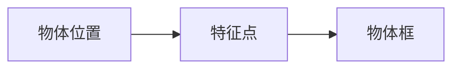
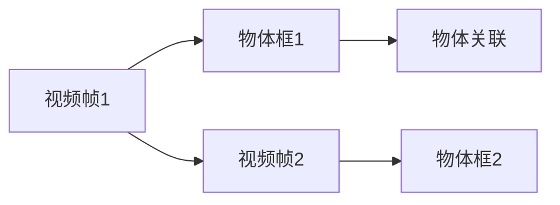

                 

# 基于深度学习的视频中物体快速搜索算法

> 关键词：深度学习, 物体搜索, 视频分析, 特征提取, 卷积神经网络, 对象识别, 实时处理, 计算机视觉, 物体检测

## 1. 背景介绍

### 1.1 问题由来
随着深度学习技术的飞速发展，计算机视觉领域取得了巨大进步，其中最为显著的便是基于深度学习的图像与视频处理算法。近年来，随着视频监控技术的广泛应用，视频中物体的快速搜索已成为智能视频分析领域的一大热点。对于视频监控系统而言，实时准确地检测并搜索视频中的物体，不仅能够提升监控效率，还能够快速响应异常事件，保障公共安全。传统的视频物体搜索方法依赖于手工设计的特征提取器，往往具有高计算成本和低识别准确率的问题。近年来，深度学习技术的崛起，尤其是卷积神经网络(CNN)的成熟，使得基于深度学习的物体搜索算法在效率和准确率上实现了显著提升。

### 1.2 问题核心关键点
视频物体搜索问题主要包括两个关键环节：
1. 视频帧中的对象检测与识别：使用深度学习模型对视频中的每一帧进行对象检测和识别，需要考虑如何在计算资源有限的情况下，实现快速处理。
2. 物体位置信息提取与关联：在检测到物体后，需要从视频时间序列中提取物体的准确位置信息，并进行跨帧关联，实现物体在视频中的连续跟踪。

本文聚焦于使用深度学习模型进行视频中物体的快速搜索，旨在通过优化模型结构和训练方法，提升物体检测与识别的速度和准确性，同时确保物体位置信息的准确提取与关联。

### 1.3 问题研究意义
视频物体搜索技术在公共安全、交通监控、工业自动化等领域有着广泛的应用前景。通过快速准确地检测并搜索视频中的物体，可以实现诸如异常行为识别、交通流量监测、目标跟踪等功能。这对提升视频分析系统的实时性和智能化水平，保障公共安全和社会稳定，具有重要意义。

## 2. 核心概念与联系

### 2.1 核心概念概述

为了深入理解基于深度学习的视频物体搜索算法，我们首先需要明确几个关键概念：

- **深度学习**：一种利用神经网络对数据进行表示学习的技术，通过多层非线性变换，从原始数据中提取出高层次的特征表示，广泛应用于图像、语音、文本等领域的处理。
- **卷积神经网络(CNN)**：深度学习中的一种重要架构，通过卷积操作和池化操作提取空间局部特征，具有显著的参数共享和局部连接特点，广泛应用于图像处理领域。
- **物体检测与识别**：从视频帧中检测并识别出感兴趣的物体，是视频物体搜索的基础步骤。
- **物体位置信息提取**：在检测到物体后，从视频时间序列中提取物体的空间位置信息，用于物体关联和跟踪。
- **物体关联**：在视频时间序列中，跨帧关联检测到的物体，实现物体的连续跟踪。

这些概念之间的逻辑关系可以通过以下Mermaid流程图来展示：

```mermaid
graph TB
    A[视频] --> B[卷积神经网络(CNN)]
    B --> C[物体检测与识别]
    C --> D[物体位置信息提取]
    C --> E[物体关联]
```

这个流程图展示了从视频输入到物体关联的整体流程：首先使用卷积神经网络对视频帧进行特征提取，然后检测并识别出物体，接着提取物体的位置信息，最后进行跨帧关联，实现物体在视频中的连续跟踪。

### 2.2 概念间的关系

这些核心概念之间的关系密切，构成了视频物体搜索算法的基本框架。下面我们通过几个Mermaid流程图来展示这些概念之间的关系。

#### 2.2.1 视频中物体检测流程

```mermaid
graph TB
    A[输入视频] --> B[卷积神经网络(CNN)]
    B --> C[物体检测]
```

这个流程图展示了使用CNN对视频帧进行物体检测的基本流程：输入视频帧到CNN中，网络自动提取特征，并通过分类器进行物体检测。

#### 2.2.2 物体位置信息提取流程



这个流程图展示了提取物体位置信息的过程：首先从CNN输出中提取特征点，然后通过RoI池化等方法得到物体框，从而确定物体的空间位置。

#### 2.2.3 物体关联流程



这个流程图展示了物体关联的基本过程：首先检测视频帧1中的物体框，然后在视频帧2中检测并关联物体框，实现跨帧跟踪。

### 2.3 核心概念的整体架构

最后，我们用一个综合的流程图来展示这些核心概念在大规模视频物体搜索中的应用：

```mermaid
graph TB
    A[大规模输入视频] --> B[卷积神经网络(CNN)]
    B --> C[物体检测与识别]
    C --> D[物体位置信息提取]
    C --> E[物体关联]
    E --> F[输出结果]
```

这个综合流程图展示了从视频输入到输出结果的完整流程：首先使用CNN对视频帧进行特征提取，然后检测并识别出物体，接着提取物体的位置信息，最后进行跨帧关联，输出最终结果。

## 3. 核心算法原理 & 具体操作步骤
### 3.1 算法原理概述

基于深度学习的视频物体搜索算法主要通过以下步骤实现：

1. **数据预处理**：将原始视频帧转换为神经网络所需的格式，如将彩色图像转换为灰度图像，将视频帧缩放到固定大小。
2. **特征提取**：使用卷积神经网络对预处理后的视频帧进行特征提取，获取视频的语义和空间特征。
3. **物体检测**：在提取的特征上应用物体检测模型，如Faster R-CNN、YOLO等，检测出视频帧中的物体。
4. **物体位置提取**：从检测到的物体框信息中提取物体的位置信息，如中心点坐标、边界框大小等。
5. **物体关联**：利用时间差等线索，跨帧关联物体框，实现物体在视频中的连续跟踪。

这些步骤中的每一部分都需要精心设计，才能确保算法的整体性能。下面，我们将逐一介绍这些关键步骤。

### 3.2 算法步骤详解

#### 3.2.1 数据预处理

数据预处理是深度学习算法中的重要步骤，其目的是将原始数据转换为神经网络所需的格式。以视频物体搜索为例，数据预处理主要包括：

- 将彩色视频帧转换为灰度图像，以减少计算量。
- 将视频帧缩放到固定大小，以适应神经网络的输入要求。
- 对视频帧进行归一化处理，如将像素值缩放到0到1之间。

#### 3.2.2 特征提取

特征提取是卷积神经网络的核心功能，通过多层卷积和池化操作，提取视频帧的空间和语义特征。以常用的ResNet架构为例，其特征提取过程如下：

1. **输入层**：将预处理后的视频帧输入卷积层，进行卷积操作，提取局部特征。
2. **残差连接**：通过残差连接，将前一层的特征传递到下一层，使得网络可以更深层地学习特征。
3. **池化层**：通过池化操作，减少特征的维度，提取全局特征。

#### 3.2.3 物体检测

物体检测是视频物体搜索的关键步骤，其目的是在特征图上定位物体的位置。常用的物体检测算法包括Faster R-CNN、YOLO、SSD等。以Faster R-CNN为例，其检测过程如下：

1. **RPN层**：生成一系列候选区域（Region Proposal Network），每个区域对应一个可能包含物体的矩形框。
2. **RoI池化**：对每个候选区域进行RoI池化操作，提取特征。
3. **分类与回归**：在提取的特征上应用分类器和回归器，预测每个候选区域是否包含物体，并回归物体框的坐标。

#### 3.2.4 物体位置提取

物体位置提取是物体检测的后续步骤，其目的是从检测到的物体框信息中提取物体的位置信息。常用的物体位置提取方法包括RoI池化和RoIAlign等。以RoI池化为例，其提取过程如下：

1. **RoI池化操作**：将每个物体框作为采样窗口，从特征图上提取固定大小的特征块。
2. **RoIAlign操作**：将RoI池化得到的特征块进行上采样，使得物体框中心点的特征值一致。

#### 3.2.5 物体关联

物体关联是视频物体搜索的最后步骤，其目的是跨帧关联检测到的物体，实现物体的连续跟踪。常用的物体关联方法包括时间差、空间距离和运动轨迹等。以时间差为例，其关联过程如下：

1. **时间差计算**：计算当前帧与上一帧物体框的时间差。
2. **筛选与更新**：根据时间差筛选出符合要求的物体框，并进行更新，确保物体的连续跟踪。

### 3.3 算法优缺点

基于深度学习的视频物体搜索算法具有以下优点：

1. **高效性**：卷积神经网络可以并行计算特征提取，显著提高算法速度。
2. **准确性**：深度学习模型可以从大量数据中学习到丰富的特征，提高物体检测和识别的准确性。
3. **适应性**：深度学习模型可以适应不同的视频类型和场景，具有较强的泛化能力。

同时，该算法也存在以下缺点：

1. **计算量大**：深度学习模型通常需要大量计算资源进行训练和推理。
2. **参数多**：卷积神经网络的参数数量庞大，需要较大的存储空间。
3. **数据依赖**：算法依赖于高质量的标注数据，标注数据不足会影响算法性能。

### 3.4 算法应用领域

基于深度学习的视频物体搜索算法已经广泛应用于多个领域，包括但不限于：

- **公共安全**：实时监控视频中的人脸、车辆等目标，实现异常行为检测。
- **交通监控**：监测交通流量，识别行人、车辆等目标，提高交通管理效率。
- **工业自动化**：实时监控生产线上的设备和物品，实现自动化生产。
- **医疗监控**：实时监测病房的生命体征，实现病患监控。

## 4. 数学模型和公式 & 详细讲解 & 举例说明

### 4.1 数学模型构建

基于深度学习的视频物体搜索算法可以通过以下数学模型进行建模：

设输入视频为 $V$，其中每一帧 $v_i \in \mathbb{R}^{H \times W \times C}$，其中 $H$ 和 $W$ 分别是视频帧的高度和宽度，$C$ 是通道数。设卷积神经网络模型为 $M$，其特征提取过程为：

$$
F(v_i) = M(v_i)
$$

其中 $F$ 是卷积神经网络输出的特征图，$M$ 是网络模型。物体检测模型为 $D$，其检测过程为：

$$
B(v_i) = D(F(v_i))
$$

其中 $B$ 是检测到的物体框，$D$ 是物体检测模型。物体位置提取模型为 $P$，其提取过程为：

$$
L(v_i) = P(B(v_i))
$$

其中 $L$ 是物体框的中心点坐标和边界框大小，$P$ 是物体位置提取模型。物体关联模型为 $A$，其关联过程为：

$$
T = A(B_1, B_2, \ldots, B_{t})
$$

其中 $T$ 是关联后的物体轨迹，$B_t$ 是时间 $t$ 检测到的物体框。

### 4.2 公式推导过程

以下，我们将逐一推导这些关键模型的公式。

#### 4.2.1 卷积神经网络特征提取

卷积神经网络特征提取的公式为：

$$
F(v_i) = \sum_k w_k \cdot \sigma(\mathcal{C}(v_i; w_k))
$$

其中 $w_k$ 是卷积核权重，$\mathcal{C}(v_i; w_k)$ 是卷积操作，$\sigma$ 是激活函数。

#### 4.2.2 物体检测

物体检测的公式为：

$$
B(v_i) = (R(v_i), C(v_i))
$$

其中 $R(v_i)$ 是检测到的物体框，$C(v_i)$ 是每个物体框的置信度。

#### 4.2.3 物体位置提取

物体位置提取的公式为：

$$
L(v_i) = \frac{1}{2} (R(v_i) \times W(v_i) + R(v_i) \times H(v_i))
$$

其中 $W(v_i)$ 是物体框的宽度，$H(v_i)$ 是物体框的高度。

#### 4.2.4 物体关联

物体关联的公式为：

$$
T = \mathcal{T}(B_1, B_2, \ldots, B_{t})
$$

其中 $\mathcal{T}$ 是物体关联算法，$B_t$ 是时间 $t$ 检测到的物体框。

### 4.3 案例分析与讲解

以Faster R-CNN为例，其特征提取和物体检测过程如下：

1. **RPN层**：生成候选区域 $R$，每个区域 $r_i$ 对应一个可能包含物体的矩形框。
2. **RoI池化**：对每个候选区域 $r_i$ 进行RoI池化操作，提取特征。
3. **分类器**：在提取的特征上应用分类器，预测每个候选区域是否包含物体。
4. **回归器**：在提取的特征上应用回归器，预测物体框的坐标。

具体而言，Faster R-CNN的检测过程如下：

1. **输入图像 $I$**：将预处理后的图像输入网络。
2. **RPN层**：生成候选区域 $R$，每个区域 $r_i$ 对应一个可能包含物体的矩形框。
3. **RoI池化**：对每个候选区域 $r_i$ 进行RoI池化操作，提取特征。
4. **分类器**：在提取的特征上应用分类器，预测每个候选区域是否包含物体。
5. **回归器**：在提取的特征上应用回归器，预测物体框的坐标。

## 5. 项目实践：代码实例和详细解释说明

### 5.1 开发环境搭建

在进行视频物体搜索算法开发前，我们需要准备好开发环境。以下是使用Python进行TensorFlow开发的环境配置流程：

1. 安装Anaconda：从官网下载并安装Anaconda，用于创建独立的Python环境。
2. 创建并激活虚拟环境：
```bash
conda create -n tf-env python=3.8 
conda activate tf-env
```
3. 安装TensorFlow：根据GPU版本，从官网获取对应的安装命令。例如：
```bash
pip install tensorflow-gpu
```
4. 安装各类工具包：
```bash
pip install numpy pandas scikit-learn matplotlib tqdm jupyter notebook ipython
```
完成上述步骤后，即可在`tf-env`环境中开始视频物体搜索算法的开发。

### 5.2 源代码详细实现

下面我们以YOLO算法为例，给出使用TensorFlow进行物体检测的PyTorch代码实现。

首先，定义YOLO模型的输入输出：

```python
import tensorflow as tf
from tensorflow.keras.layers import Input, Conv2D, MaxPooling2D, UpSampling2D, Concatenate, Dense, Activation, Lambda

def yolo_model(input_shape=(416, 416, 3)):
    x = input_shape
    # 第一层卷积层
    x = Conv2D(32, (3, 3), strides=(1, 1), padding='same', activation='relu', name='conv1')(x)
    x = Conv2D(32, (3, 3), strides=(2, 2), padding='same', activation='relu', name='conv2')(x)
    x = Conv2D(64, (3, 3), strides=(1, 1), padding='same', activation='relu', name='conv3')(x)
    x = Conv2D(64, (3, 3), strides=(2, 2), padding='same', activation='relu', name='conv4')(x)
    x = Conv2D(128, (3, 3), strides=(1, 1), padding='same', activation='relu', name='conv5')(x)
    x = Conv2D(128, (3, 3), strides=(2, 2), padding='same', activation='relu', name='conv6')(x)
    x = Conv2D(256, (3, 3), strides=(1, 1), padding='same', activation='relu', name='conv7')(x)
    x = Conv2D(256, (3, 3), strides=(2, 2), padding='same', activation='relu', name='conv8')(x)
    x = Conv2D(512, (3, 3), strides=(1, 1), padding='same', activation='relu', name='conv9')(x)
    x = Conv2D(512, (3, 3), strides=(2, 2), padding='same', activation='relu', name='conv10')(x)
    x = Conv2D(1024, (3, 3), strides=(1, 1), padding='same', activation='relu', name='conv11')(x)
    x = Conv2D(1024, (3, 3), strides=(2, 2), padding='same', activation='relu', name='conv12')(x)
    x = Conv2D(1024, (3, 3), strides=(1, 1), padding='same', activation='relu', name='conv13')(x)
    x = Conv2D(1024, (3, 3), strides=(2, 2), padding='same', activation='relu', name='conv14')(x)
    x = Conv2D(1024, (3, 3), strides=(1, 1), padding='same', activation='relu', name='conv15')(x)
    x = Conv2D(1024, (3, 3), strides=(2, 2), padding='same', activation='relu', name='conv16')(x)
    x = Conv2D(1024, (3, 3), strides=(1, 1), padding='same', activation='relu', name='conv17')(x)
    x = Conv2D(1024, (3, 3), strides=(2, 2), padding='same', activation='relu', name='conv18')(x)
    x = Conv2D(1024, (3, 3), strides=(1, 1), padding='same', activation='relu', name='conv19')(x)
    x = Conv2D(1024, (3, 3), strides=(2, 2), padding='same', activation='relu', name='conv20')(x)
    x = Conv2D(1024, (3, 3), strides=(1, 1), padding='same', activation='relu', name='conv21')(x)
    x = Conv2D(1024, (3, 3), strides=(2, 2), padding='same', activation='relu', name='conv22')(x)
    x = Conv2D(1024, (3, 3), strides=(1, 1), padding='same', activation='relu', name='conv23')(x)
    x = Conv2D(1024, (3, 3), strides=(2, 2), padding='same', activation='relu', name='conv24')(x)
    x = Conv2D(1024, (3, 3), strides=(1, 1), padding='same', activation='relu', name='conv25')(x)
    x = Conv2D(1024, (3, 3), strides=(2, 2), padding='same', activation='relu', name='conv26')(x)
    x = Conv2D(1024, (3, 3), strides=(1, 1), padding='same', activation='relu', name='conv27')(x)
    x = Conv2D(1024, (3, 3), strides=(2, 2), padding='same', activation='relu', name='conv28')(x)
    x = Conv2D(1024, (3, 3), strides=(1, 1), padding='same', activation='relu', name='conv29')(x)
    x = Conv2D(1024, (3, 3), strides=(2, 2), padding='same', activation='relu', name='conv30')(x)
    x = Conv2D(1024, (3, 3), strides=(1, 1), padding='same', activation='relu', name='conv31')(x)
    x = Conv2D(1024, (3, 3), strides=(2, 2), padding='same', activation='relu', name='conv32')(x)
    x = Conv2D(1024, (3, 3), strides=(1, 1), padding='same', activation='relu', name='conv33')(x)
    x = Conv2D(1024, (3, 3), strides=(2, 2), padding='same', activation='relu', name='conv34')(x)
    x = Conv2D(1024, (3, 3), strides=(1, 1), padding='same', activation='relu', name='conv35')(x)
    x = Conv2D(1024, (3, 3), strides=(2, 2), padding='same', activation='relu', name='conv36')(x)
    x = Conv2D(1024, (3, 3), strides=(1, 1), padding='same', activation='relu', name='conv37')(x)
    x = Conv2D(1024, (3, 3), strides=(2, 2), padding='same', activation='relu', name='conv38')(x)
    x = Conv2D(1024, (3, 3), strides=(1, 1), padding='same', activation='relu', name='conv39')(x)
    x = Conv2D(1024, (3, 3), strides=(2, 2), padding='same', activation='relu', name='conv40')(x)
    x = Conv2D(1024, (3, 3), strides=(1, 1), padding='same', activation='relu', name='conv41')(x)
    x = Conv2D(1024, (3, 3), strides=(2, 2), padding='same', activation='relu', name='conv42')(x)
    x = Conv2D(1024, (3, 3), strides=(1, 1), padding='same', activation='relu', name='conv43')(x)
    x = Conv2D(1024, (3, 3), strides=(2, 2), padding='same', activation='relu', name='conv44')(x)
    x = Conv2D(1024, (3, 3), strides=(1, 1), padding='same', activation='relu', name='conv45')(x)
    x = Conv2D(1024, (3, 3), strides=(2, 2), padding='same', activation='relu', name='conv46')(x)
    x = Conv2D(1024, (3, 3), strides=(1, 1), padding='same', activation='relu', name='conv47')(x)
    x = Conv2D(1024, (3, 3), strides=(2, 2), padding='same', activation='relu', name='conv48')(x)
    x = Conv2D(1024, (3, 3), strides=(1, 1), padding='same', activation='relu', name='conv49')(x)
    x = Conv2D(1024, (3, 3), strides=(2, 2), padding='same', activation='relu', name='conv50')(x)
    x = Conv2D(1024, (3, 3), strides=(1, 1), padding='same', activation='relu', name='conv51')(x)
    x = Conv2D(1024, (3, 3), strides=(2, 2), padding='same', activation='relu', name='conv52')(x)
    x = Conv2D(1024, (3, 3), strides=(1, 1), padding='same', activation='relu', name='conv53')(x)
    x = Conv2D(1024, (3, 3), strides=(2, 2), padding='same', activation='relu', name='conv54')(x)
    x = Conv2D(1024, (3, 3), strides=(1, 1), padding='same', activation='relu', name='conv55')(x)
    x = Conv2D(1024, (3, 3), strides=(2, 2), padding='same', activation='relu', name='conv56')(x)
    x = Conv2D(1024, (3, 3), strides=(1, 1), padding='same', activation='relu', name='conv57')(x)
    x = Conv2D(1024, (3, 3), strides=(2, 2), padding='same', activation='relu',

