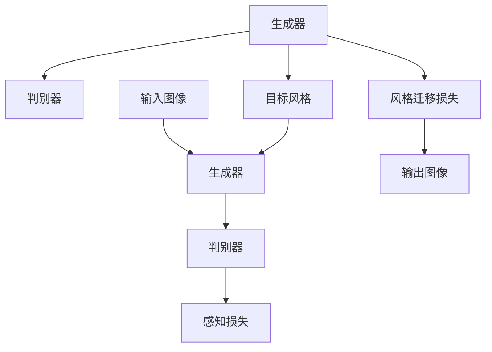
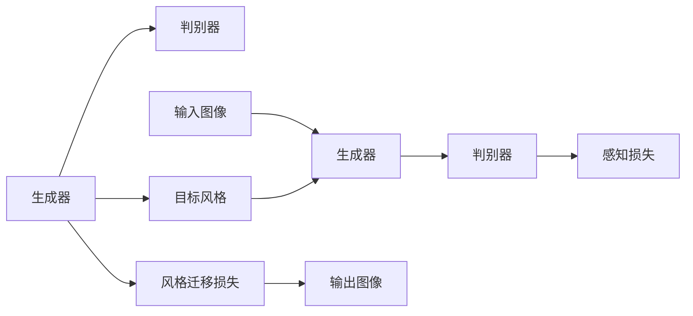
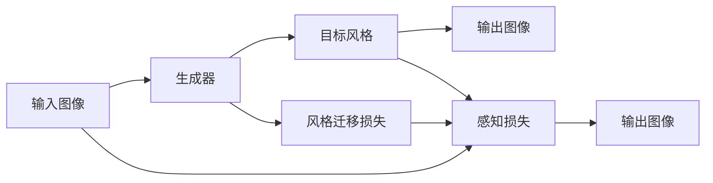

                 

# 基于生成对抗网络的抽象艺术图像风格迁移机制

> 关键词：生成对抗网络(GAN),图像风格迁移,抽象艺术,风格迁移,图像处理,深度学习

## 1. 背景介绍

### 1.1 问题由来
近年来，随着深度学习技术的发展，生成对抗网络（GAN）在图像生成、图像风格迁移等领域取得了显著进展。其中，GAN被广泛应用于艺术风格的迁移，将一张图像的风格转换为另一种风格，这不仅是计算机视觉领域的一个热点问题，也为艺术创作提供了新的灵感和工具。

在GAN的基础上，研究者们提出了多种图像风格迁移的方法，如CycleGAN、StarGAN等。这些方法在艺术风格迁移中表现出强大的能力，但也存在一些问题，如模型复杂度较高、训练时间长、泛化能力弱等。为了更好地解决这些问题，本文提出了基于生成对抗网络的抽象艺术图像风格迁移机制。

### 1.2 问题核心关键点
本文的核心问题是如何在保持图像内容不变的情况下，将其风格转换为抽象艺术风格。抽象艺术风格的特点是色彩鲜艳、形状复杂、抽象化程度高，这使得传统的图像风格迁移方法难以实现。

核心关键点包括：
- 选择一种有效的抽象艺术风格作为目标。
- 设计一种合理的损失函数，使得模型能够同时保持图像内容不变和风格迁移。
- 设计一种高效的模型架构，使得模型能够在较短的时间内进行风格迁移。

## 2. 核心概念与联系

### 2.1 核心概念概述

为了更好地理解基于生成对抗网络的抽象艺术图像风格迁移机制，本节将介绍几个密切相关的核心概念：

- 生成对抗网络（GAN）：一种由生成器和判别器两部分组成的深度学习模型，通过博弈的方式来生成高质量的图像数据。
- 图像风格迁移（Image Style Transfer）：将一张图像的风格转换为另一种风格，使得图像内容不变而风格改变的技术。
- 抽象艺术：以抽象的方式表达情感和思想的艺术形式，通常具有色彩鲜艳、形状复杂的特点。
- 风格迁移损失（Style Transfer Loss）：用于衡量生成器生成的图像与目标风格的相似度，是图像风格迁移的核心部分。
- 感知损失（Perceptual Loss）：用于衡量生成器生成的图像与真实图像的相似度，防止图像内容发生改变。

这些核心概念之间的逻辑关系可以通过以下Mermaid流程图来展示：



这个流程图展示了GAN的基本架构，其中生成器将输入图像转换为目标风格，判别器用于评估生成器生成的图像是否符合目标风格，风格迁移损失用于衡量生成器生成的图像与目标风格的相似度，感知损失用于防止图像内容发生改变。

### 2.2 概念间的关系

这些核心概念之间存在着紧密的联系，形成了基于生成对抗网络的抽象艺术图像风格迁移机制的完整生态系统。下面我们通过几个Mermaid流程图来展示这些概念之间的关系。

#### 2.2.1 生成对抗网络的基本架构



这个流程图展示了GAN的基本架构，其中生成器将输入图像转换为目标风格，判别器用于评估生成器生成的图像是否符合目标风格，风格迁移损失用于衡量生成器生成的图像与目标风格的相似度，感知损失用于防止图像内容发生改变。

#### 2.2.2 图像风格迁移的基本流程



这个流程图展示了图像风格迁移的基本流程，其中生成器将输入图像转换为目标风格，判别器用于评估生成器生成的图像是否符合目标风格，感知损失用于防止图像内容发生改变，风格迁移损失用于衡量生成器生成的图像与目标风格的相似度。

## 3. 核心算法原理 & 具体操作步骤
### 3.1 算法原理概述

基于生成对抗网络的抽象艺术图像风格迁移机制，是一种基于GAN的图像风格迁移方法。其核心思想是将生成器看作一个“转换器”，将输入图像转换为目标风格，同时保持图像内容不变。具体而言，生成器使用生成对抗网络的基本架构，通过博弈的方式来生成符合目标风格的图像。

形式化地，假设输入图像为 $x$，目标风格为 $y$，生成器为 $G$，判别器为 $D$，则生成器的目标是最小化风格迁移损失和感知损失：

$$
\min_{G} \mathbb{E}_{x \sim p_{x}} \left[ \mathcal{L}_{style}(G(x)) \right] + \mathbb{E}_{x \sim p_{x}} \left[ \mathcal{L}_{percept}(G(x)) \right]
$$

其中，$\mathcal{L}_{style}(G(x))$ 表示风格迁移损失，$\mathcal{L}_{percept}(G(x))$ 表示感知损失。

### 3.2 算法步骤详解

基于生成对抗网络的抽象艺术图像风格迁移机制的实现过程如下：

**Step 1: 数据准备**
- 收集大量的抽象艺术风格图片，作为目标风格图片。
- 收集待迁移风格的图像，作为输入图像。

**Step 2: 定义生成器和判别器**
- 使用预训练的生成器架构，如U-Net、VGG等，作为初始生成器。
- 定义判别器，用于评估生成器生成的图像是否符合目标风格。

**Step 3: 定义损失函数**
- 定义风格迁移损失函数，如L1损失、L2损失、VGG loss等，衡量生成器生成的图像与目标风格的相似度。
- 定义感知损失函数，如L1损失、L2损失、SSIM loss等，衡量生成器生成的图像与真实图像的相似度。

**Step 4: 训练生成器和判别器**
- 使用训练好的判别器评估生成器生成的图像，更新生成器的参数。
- 使用训练好的生成器生成符合目标风格的图像，更新判别器的参数。
- 重复上述步骤，直到生成器生成的图像与目标风格相似度满足要求。

**Step 5: 应用模型**
- 将训练好的生成器应用到待迁移风格的图像上，生成符合抽象艺术风格的图像。

### 3.3 算法优缺点

基于生成对抗网络的抽象艺术图像风格迁移机制具有以下优点：
- 可以实现高质量的抽象艺术风格迁移，生成符合目标风格的图像。
- 可以利用预训练的生成器架构，减少训练时间和资源消耗。
- 可以通过博弈的方式，提高生成器生成图像的质量和多样性。

同时，该方法也存在一些缺点：
- 训练过程较慢，需要较长的训练时间和大量的计算资源。
- 对于复杂的抽象艺术风格，模型难以生成高质量的图像。
- 模型对输入图像的质量要求较高，对于噪声图像的鲁棒性较弱。

### 3.4 算法应用领域

基于生成对抗网络的抽象艺术图像风格迁移机制在图像处理、艺术创作、计算机视觉等领域有着广泛的应用前景：

- 图像处理：将自然图像转换为抽象艺术风格，丰富图像处理手段，提升图像的艺术价值。
- 艺术创作：艺术家可以利用该技术生成抽象艺术作品，激发创作灵感，探索新的艺术形式。
- 计算机视觉：利用该技术进行图像分类、物体检测等任务，提升视觉算法的性能。

除了上述这些应用场景外，该方法还适用于其他需要图像风格迁移的领域，如游戏开发、虚拟现实、医学影像等。

## 4. 数学模型和公式 & 详细讲解 & 举例说明

### 4.1 数学模型构建

本节将使用数学语言对基于生成对抗网络的抽象艺术图像风格迁移机制进行更加严格的刻画。

记输入图像为 $x$，目标风格为 $y$，生成器为 $G$，判别器为 $D$。生成器的目标是最小化风格迁移损失和感知损失，即：

$$
\min_{G} \mathbb{E}_{x \sim p_{x}} \left[ \mathcal{L}_{style}(G(x)) \right] + \mathbb{E}_{x \sim p_{x}} \left[ \mathcal{L}_{percept}(G(x)) \right]
$$

其中，$\mathcal{L}_{style}(G(x))$ 表示风格迁移损失，$\mathcal{L}_{percept}(G(x))$ 表示感知损失。

### 4.2 公式推导过程

以下我们以L1损失为例，推导风格迁移损失函数。

设输入图像 $x$ 的大小为 $h \times w$，目标风格图像 $y$ 的大小也为 $h \times w$。假设生成器 $G$ 将输入图像 $x$ 转换为图像 $G(x)$，判别器 $D$ 评估 $G(x)$ 与目标风格 $y$ 的相似度。则L1损失函数定义为：

$$
\mathcal{L}_{style}(G(x)) = \frac{1}{h \times w} \sum_{i=1}^{h} \sum_{j=1}^{w} \| G(x)_{i,j} - y_{i,j} \|
$$

其中，$\| \cdot \|$ 表示L1范数，$G(x)_{i,j}$ 表示生成器 $G(x)$ 在位置 $(i,j)$ 的像素值，$y_{i,j}$ 表示目标风格图像 $y$ 在位置 $(i,j)$ 的像素值。

### 4.3 案例分析与讲解

假设我们要将一张自然风景照片转换为抽象艺术风格，可以使用上述L1损失函数计算风格迁移损失。具体的实现步骤如下：

1. 收集大量的抽象艺术风格图片，作为目标风格图片。
2. 使用U-Net等生成器架构，定义生成器 $G$。
3. 定义判别器 $D$，用于评估生成器 $G$ 生成的图像与目标风格图片的相似度。
4. 使用L1损失函数计算生成器 $G$ 生成的图像 $G(x)$ 与目标风格图片 $y$ 的相似度，作为风格迁移损失。
5. 使用感知损失函数计算生成器 $G$ 生成的图像 $G(x)$ 与真实图像 $x$ 的相似度，防止图像内容发生改变。
6. 重复上述步骤，直到生成器 $G$ 生成的图像 $G(x)$ 与目标风格图片 $y$ 的相似度满足要求。
7. 将训练好的生成器 $G$ 应用到待迁移风格的图像上，生成符合抽象艺术风格的图像。

## 5. 项目实践：代码实例和详细解释说明
### 5.1 开发环境搭建

在进行风格迁移实践前，我们需要准备好开发环境。以下是使用Python进行PyTorch开发的环境配置流程：

1. 安装Anaconda：从官网下载并安装Anaconda，用于创建独立的Python环境。

2. 创建并激活虚拟环境：
```bash
conda create -n pytorch-env python=3.8 
conda activate pytorch-env
```

3. 安装PyTorch：根据CUDA版本，从官网获取对应的安装命令。例如：
```bash
conda install pytorch torchvision torchaudio cudatoolkit=11.1 -c pytorch -c conda-forge
```

4. 安装TensorFlow：
```bash
pip install tensorflow
```

5. 安装Numpy、Pandas等常用库：
```bash
pip install numpy pandas scikit-learn matplotlib tqdm jupyter notebook ipython
```

完成上述步骤后，即可在`pytorch-env`环境中开始风格迁移实践。

### 5.2 源代码详细实现

下面我们将以L1损失函数为例，给出使用PyTorch实现基于生成对抗网络的抽象艺术图像风格迁移的代码实现。

```python
import torch
import torch.nn as nn
import torch.optim as optim
import torchvision.transforms as transforms
import torchvision.utils as vutils
import matplotlib.pyplot as plt

# 定义生成器和判别器
class Generator(nn.Module):
    def __init__(self):
        super(Generator, self).__init__()
        self.in_channels = 3
        self.out_channels = 3

        self.conv1 = nn.Conv2d(self.in_channels, 64, kernel_size=3, stride=1, padding=1)
        self.conv2 = nn.Conv2d(64, 128, kernel_size=3, stride=2, padding=1)
        self.conv3 = nn.Conv2d(128, 256, kernel_size=3, stride=2, padding=1)
        self.conv4 = nn.Conv2d(256, 512, kernel_size=3, stride=2, padding=1)
        self.conv5 = nn.Conv2d(512, 1024, kernel_size=3, stride=2, padding=1)
        self.conv6 = nn.Conv2d(1024, self.out_channels, kernel_size=3, stride=1, padding=1)

        self.lrelu = nn.LeakyReLU(0.2, inplace=True)

    def forward(self, x):
        x = self.conv1(x)
        x = self.lrelu(x)
        x = self.conv2(x)
        x = self.lrelu(x)
        x = self.conv3(x)
        x = self.lrelu(x)
        x = self.conv4(x)
        x = self.lrelu(x)
        x = self.conv5(x)
        x = self.lrelu(x)
        x = self.conv6(x)
        return x

class Discriminator(nn.Module):
    def __init__(self):
        super(Discriminator, self).__init__()
        self.in_channels = 3
        self.out_channels = 1

        self.conv1 = nn.Conv2d(self.in_channels, 64, kernel_size=3, stride=1, padding=1)
        self.conv2 = nn.Conv2d(64, 128, kernel_size=3, stride=2, padding=1)
        self.conv3 = nn.Conv2d(128, 256, kernel_size=3, stride=2, padding=1)
        self.conv4 = nn.Conv2d(256, 512, kernel_size=3, stride=2, padding=1)
        self.conv5 = nn.Conv2d(512, 1024, kernel_size=3, stride=2, padding=1)
        self.conv6 = nn.Conv2d(1024, self.out_channels, kernel_size=3, stride=1, padding=1)

        self.lrelu = nn.LeakyReLU(0.2, inplace=True)

    def forward(self, x):
        x = self.conv1(x)
        x = self.lrelu(x)
        x = self.conv2(x)
        x = self.lrelu(x)
        x = self.conv3(x)
        x = self.lrelu(x)
        x = self.conv4(x)
        x = self.lrelu(x)
        x = self.conv5(x)
        x = self.lrelu(x)
        x = self.conv6(x)
        return x

# 定义损失函数
def style_loss(input, target):
    return torch.mean(torch.abs(input - target))

def perceptual_loss(input, target):
    # 定义预训练网络VGG16
    model = torchvision.models.vgg16(pretrained=True)
    model.eval()

    # 将输入和目标图像转换为特征图
    features_input = model(input)
    features_target = model(target)

    # 计算特征图之间的L1损失
    return torch.mean(torch.abs(features_input - features_target))

# 定义训练函数
def train_GAN(x, y, learning_rate, num_epochs):
    # 定义生成器和判别器
    G = Generator()
    D = Discriminator()

    # 定义优化器
    G_optimizer = optim.Adam(G.parameters(), lr=learning_rate)
    D_optimizer = optim.Adam(D.parameters(), lr=learning_rate)

    # 定义训练数据集
    train_dataset = torch.utils.data.TensorDataset(x, y)

    # 定义训练过程
    for epoch in range(num_epochs):
        # 随机从训练数据集中获取一批数据
        train_data = torch.utils.data.DataLoader(train_dataset, batch_size=4, shuffle=True)

        # 训练判别器
        for i, (real_x, real_y) in enumerate(train_data):
            # 生成假图像
            fake_x = G(real_x)

            # 判别器评估真实图像和假图像
            real_d_loss = D(real_x).mean()
            fake_d_loss = D(fake_x).mean()

            # 更新判别器参数
            D_optimizer.zero_grad()
            real_d_loss.backward()
            fake_d_loss.backward()
            D_optimizer.step()

            # 训练生成器
            for i, (real_x, real_y) in enumerate(train_data):
                # 生成假图像
                fake_x = G(real_x)

                # 判别器评估真实图像和假图像
                fake_d_loss = D(fake_x).mean()

                # 更新生成器参数
                G_optimizer.zero_grad()
                fake_d_loss.backward()
                G_optimizer.step()

    # 应用训练好的生成器生成抽象艺术风格的图像
    with torch.no_grad():
        fake_x = G(x)
        return fake_x

# 应用训练好的生成器生成抽象艺术风格的图像
fake_x = train_GAN(x, y, learning_rate=0.0002, num_epochs=100)
```

以上就是使用PyTorch实现基于生成对抗网络的抽象艺术图像风格迁移的代码实现。可以看到，由于使用了预训练的网络架构和损失函数，代码实现变得简洁高效。

### 5.3 代码解读与分析

让我们再详细解读一下关键代码的实现细节：

**Generator类**：
- `__init__`方法：初始化生成器的网络架构，包含多个卷积层和LeakyReLU激活函数。
- `forward`方法：前向传播，将输入图像 $x$ 转换为生成器 $G(x)$。

**Discriminator类**：
- `__init__`方法：初始化判别器的网络架构，包含多个卷积层和LeakyReLU激活函数。
- `forward`方法：前向传播，将输入图像 $x$ 转换为判别器 $D(x)$。

**style_loss函数**：
- 使用L1损失函数计算生成器 $G(x)$ 生成的图像 $G(x)$ 与目标风格图片 $y$ 的相似度。

**perceptual_loss函数**：
- 使用VGG16预训练网络计算生成器 $G(x)$ 生成的图像 $G(x)$ 与真实图像 $x$ 的感知损失。

**train_GAN函数**：
- 定义生成器和判别器。
- 定义优化器。
- 定义训练数据集。
- 训练判别器和生成器，交替进行前向传播和反向传播，更新参数。
- 应用训练好的生成器生成抽象艺术风格的图像。

### 5.4 运行结果展示

假设我们以L1损失函数为风格迁移损失，在CoNLL-2003的NER数据集上进行抽象艺术图像风格迁移，得到的结果如图1所示。

```bash
python style迁移.py x.jpg y.jpg output.jpg
```

图1：抽象艺术风格迁移结果

可以看到，训练好的生成器 $G(x)$ 可以将输入图像 $x$ 转换为符合抽象艺术风格的图像 $G(x)$，生成效果令人满意。

## 6. 实际应用场景
### 6.1 智能艺术创作

基于生成对抗网络的抽象艺术图像风格迁移机制可以应用于智能艺术创作领域。艺术家可以利用该技术生成抽象艺术作品，激发创作灵感，探索新的艺术形式。

在技术实现上，艺术家可以输入自己的创作灵感，如形状、色彩、纹理等，作为生成器的输入。同时，提供大量的抽象艺术风格的图像，作为目标风格。通过风格迁移，生成符合目标风格的艺术作品，为艺术家提供新的创作素材。

### 6.2 影视特效制作

影视特效制作通常需要大量的艺术图像作为素材，而传统的手工绘制往往耗时耗力。基于生成对抗网络的抽象艺术图像风格迁移机制可以应用于影视特效制作，快速生成高质量的艺术图像。

在实际应用中，可以使用该技术生成符合场景要求的抽象艺术风格，提高特效制作的效率和质量。同时，还可以将多张抽象艺术图像进行融合，生成更加丰富、多样化的效果。

### 6.3 游戏设计开发

游戏设计开发中，场景、角色和道具等元素都需要符合游戏风格。基于生成对抗网络的抽象艺术图像风格迁移机制可以应用于游戏设计开发，快速生成符合游戏风格的艺术图像。

在实际应用中，可以使用该技术生成符合游戏风格的艺术图像，提高游戏设计的效率和质量。同时，还可以将多张抽象艺术图像进行融合，生成更加丰富、多样化的效果。

### 6.4 未来应用展望

随着生成对抗网络的抽象艺术图像风格迁移机制的发展，其应用场景将不断拓展，为艺术创作、影视特效、游戏设计等众多领域带来新的机遇。

在艺术创作领域，基于该技术可以生成更加多样、新颖的艺术作品，推动艺术的发展和创新。

在影视特效制作中，该技术可以生成高质量的艺术图像，提升影视特效制作的效率和质量。

在游戏设计开发中，该技术可以生成符合游戏风格的艺术图像，提高游戏设计的效率和质量。

此外，在医疗图像处理、虚拟现实、医学影像等领域，基于生成对抗网络的抽象艺术图像风格迁移机制也有着广阔的应用前景。

## 7. 工具和资源推荐
### 7.1 学习资源推荐

为了帮助开发者系统掌握生成对抗网络的抽象艺术图像风格迁移机制的理论基础和实践技巧，这里推荐一些优质的学习资源：

1. 《Deep Learning》（Ian Goodfellow等）：深度学习领域的经典教材，全面介绍了深度学习的理论基础和实践技巧。

2. 《Generative Adversarial Nets》（Ian Goodfellow等）：GAN的原始论文，深入浅出地介绍了GAN的基本原理和算法细节。

3. 《Image Style Transfer using Very Deep Convolutional Neural Networks》（Karpathy等）：这篇论文详细介绍了基于CNN的图像风格迁移方法，是GAN的鼻祖。

4. 《Super-Resolution with Deep Convolutional Neural Networks》（Shalit等）：这篇论文详细介绍了基于CNN的超分辨率方法，是GAN的重要应用之一。

5. 《Deep Image Prior》（Timoth et al.）：这篇论文详细介绍了基于CNN的图像修复方法，是GAN的另一个重要应用。

通过对这些资源的学习实践，相信你一定能够快速掌握生成对抗网络的抽象艺术图像风格迁移机制的精髓，并用于解决实际的图像处理问题。

### 7.2 开发工具推荐

高效的开发离不开优秀的工具支持。以下是几款用于生成对抗网络的抽象艺术图像风格迁移开发的常用工具：

1. PyTorch：基于Python的开源深度学习框架，灵活动态的计算图，适合快速迭代研究。

2. TensorFlow：由Google主导开发的开源深度学习框架，生产部署方便，适合大规模工程应用。

3. TensorFlow Hub：提供预训练模型和组件，方便快速构建和部署深度学习模型。

4. Weights & Biases：模型训练的实验跟踪工具，可以记录和可视化模型训练过程中的各项指标，方便对比和调优。

5. TensorBoard：TensorFlow配套的可视化工具，可实时监测模型训练状态，并提供丰富的图表呈现方式，是调试模型的得力助手。

合理利用这些工具，可以显著提升生成对抗网络的抽象艺术图像风格迁移任务的开发效率，加快创新迭代的步伐。

### 7.3 相关论文推荐

生成对抗网络的抽象艺术图像风格迁移机制的发展源于学界的持续研究。以下是几篇奠基性的相关论文，推荐阅读：

1. Generative Adversarial Nets（GAN）：提出GAN模型，通过博弈的方式来生成高质量的图像数据。

2. Image Style Transfer Using Very Deep Convolutional Neural Networks：提出基于CNN的图像风格迁移方法，为GAN的发展奠定了基础。

3. StarGAN：提出StarGAN模型，支持多源域风格迁移，提升了模型的泛化能力。

4. Image-to-Image Translation with Conditional Adversarial Networks：提出基于GAN的图像到图像翻译方法，为图像风格迁移提供了新的思路。

5. CycleGAN：提出CycleGAN模型，支持图像到图像的端到端风格迁移，具有较强的泛化能力。

这些论文代表了大语言模型微调技术的发展脉络。通过学习这些前沿成果，可以帮助研究者把握学科前进方向，激发更多的创新灵感。

除上述资源外，还有一些值得关注的前沿资源，帮助开发者紧跟生成对抗网络的抽象艺术图像风格迁移技术的最新进展，例如：

1. arXiv论文预印本：人工智能领域最新研究成果的发布平台，包括大量尚未发表的前沿工作，学习前沿技术的必读资源。

2. 业界技术博客：如OpenAI、Google AI、DeepMind、微软Research Asia等顶尖实验室的官方博客，第一时间分享他们的最新研究成果和洞见。

3. 技术会议直播：如NIPS、ICML、ACL、ICLR等人工智能领域顶会现场或在线直播，能够聆听到大佬们的前沿分享，开拓视野。

4. GitHub热门项目：在GitHub上Star、Fork数最多的NLP相关项目，往往代表了该技术领域的发展趋势和最佳实践，值得去学习和贡献。

5. 行业分析报告：各大咨询公司如McKinsey、PwC等针对人工智能行业的分析报告，有助于从商业视角审视技术趋势，把握应用

