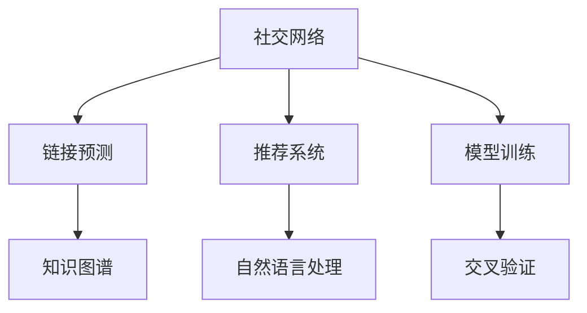
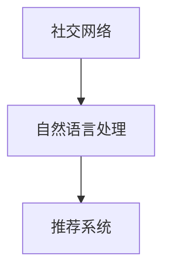
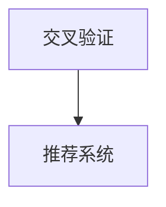
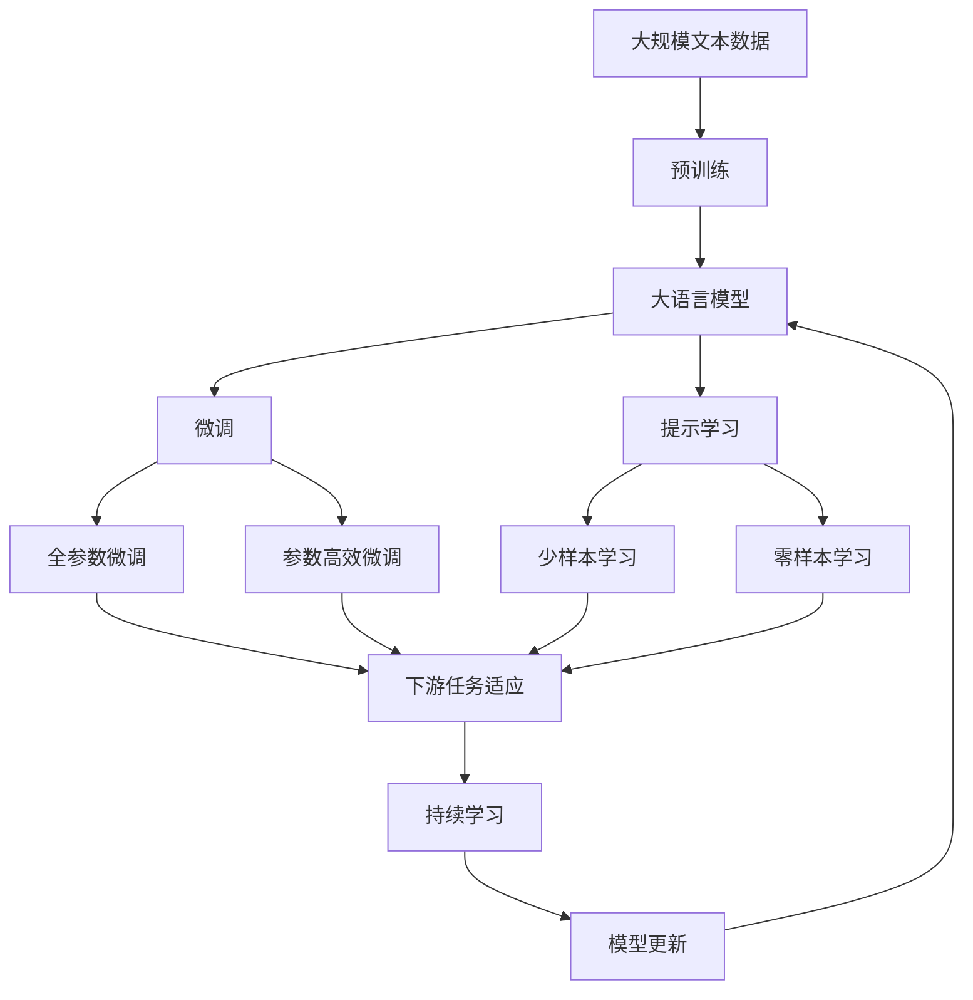

                 

## 1. 背景介绍

### 1.1 问题由来

在现代社会中，科研合作已成为推动科学进步的重要动力。然而，寻找合适的合作伙伴往往是一个耗时且困难的过程。研究人员通常需要花费大量时间和精力来浏览学术论文、参加学术会议、使用社交网络等渠道，寻找与自己研究兴趣相近、合作意愿强烈且领域契合的学者。这不仅降低了科研效率，还增加了科研成本。

为了解决这一问题，基于社交网络推荐学术合作者的系统应运而生。该系统利用社交网络中的公开数据，如科研人员的论文、会议发言、社交媒体互动等，通过分析这些数据，为研究人员推荐潜在的合作对象。这种系统能够显著提升科研合作的效率和质量，加速科学研究的进展。

### 1.2 问题核心关键点

基于社交网络推荐学术合作者的核心问题在于如何高效、准确地推荐合适的学术合作伙伴。具体来说，包括以下几个关键点：

1. **数据获取与处理**：获取和处理科研人员在社交网络上的各类公开数据。
2. **模型训练与调参**：构建推荐模型，并使用标注数据对其进行训练和调参。
3. **推荐算法与策略**：选择合适的推荐算法，并设计合理的推荐策略，确保推荐的准确性和多样性。
4. **推荐系统评估**：设计科学的评估指标，评估推荐系统的性能，持续优化模型。
5. **隐私与伦理**：确保推荐的透明度和公平性，保护科研人员的隐私，遵守相关伦理规定。

### 1.3 问题研究意义

基于社交网络推荐学术合作者的系统能够显著提高科研合作的效率和质量，具有重要意义：

1. **加速科研进程**：通过推荐系统，科研人员可以快速找到合适的合作伙伴，减少寻找合作对象的成本和时间。
2. **优化资源配置**：推荐系统能够帮助科研人员找到最合适的合作对象，优化资源的配置和利用。
3. **促进跨领域合作**：推荐系统能够跨越学科和领域，为不同领域的科研人员提供合作机会，促进跨学科研究。
4. **提升科研质量**：合适的科研合作能够带来新的思路和方法，提升科研工作的质量和创新性。
5. **增强社交网络价值**：推荐系统能够促进科研人员之间的交流和合作，增强社交网络的价值和活跃度。

## 2. 核心概念与联系

### 2.1 核心概念概述

为更好地理解基于社交网络推荐学术合作者的方法，本节将介绍几个密切相关的核心概念：

- **社交网络**：由科研人员、科研机构、学术会议、论文等组成的复杂网络，科研人员之间的互动和合作关系构成了社交网络的主要内容。
- **推荐系统**：通过分析用户的历史行为和兴趣，为每个用户推荐感兴趣的商品、服务或内容。
- **知识图谱**：由实体、关系和属性构成的三元组图结构，用于表示和存储各种知识。
- **链接预测**：利用社交网络中的结构信息，预测新的未连接关系的出现。
- **自然语言处理**：使用计算机技术处理和分析人类语言，从中提取有用信息。
- **模型训练**：使用标注数据对推荐模型进行训练，优化模型参数，提高预测准确性。
- **交叉验证**：将数据集划分为训练集、验证集和测试集，通过交叉验证评估模型的性能。

这些核心概念之间的逻辑关系可以通过以下Mermaid流程图来展示：



这个流程图展示了几大核心概念及其之间的关系：

1. 社交网络是数据来源，链接预测用于挖掘潜在的合作关系。
2. 知识图谱用于表示和存储各种知识，提升推荐系统的准确性。
3. 推荐系统是核心模块，基于知识图谱和链接预测的结果推荐合作对象。
4. 自然语言处理用于提取社交网络中的有用信息，如科研人员的学术兴趣和研究方向。
5. 模型训练和交叉验证用于优化推荐模型，评估其性能。

### 2.2 概念间的关系

这些核心概念之间存在着紧密的联系，形成了基于社交网络推荐学术合作者的完整系统。下面是几个关键的MERmaid流程图，展示这些概念之间的关系：

#### 2.2.1 社交网络与链接预测


这个流程图展示了社交网络如何通过链接预测形成知识图谱，进而支持推荐系统。

#### 2.2.2 知识图谱与推荐系统


这个流程图展示了知识图谱如何作为推荐系统的输入，提升推荐结果的准确性和多样性。

#### 2.2.3 自然语言处理与推荐系统



这个流程图展示了自然语言处理如何提取社交网络中的有用信息，用于指导推荐系统的决策。

#### 2.2.4 模型训练与推荐系统


这个流程图展示了如何通过模型训练优化推荐系统，提升其预测能力。

#### 2.2.5 交叉验证与推荐系统



这个流程图展示了如何通过交叉验证评估推荐系统的性能，指导模型优化。

### 2.3 核心概念的整体架构

最后，我们用一个综合的流程图来展示这些核心概念在大语言模型微调过程中的整体架构：



这个综合流程图展示了从预训练到微调，再到持续学习的完整过程。社交网络中的数据经过预训练和微调，成为大语言模型的输入，通过提示学习、少样本学习和零样本学习等方法，实现推荐系统的智能化和高效化。

## 3. 核心算法原理 & 具体操作步骤

### 3.1 算法原理概述

基于社交网络推荐学术合作者的系统主要基于社交网络数据，利用链接预测、知识图谱、推荐算法等技术，为科研人员推荐潜在的合作对象。其核心思想是：

1. **数据挖掘**：从社交网络中挖掘科研人员的学术兴趣和研究方向，构建社交网络图谱。
2. **链接预测**：基于社交网络图谱，预测科研人员之间可能存在的合作关系。
3. **推荐模型**：构建推荐模型，根据科研人员的学术背景、研究方向和合作意愿，为其推荐合适的合作对象。
4. **优化与评估**：通过优化模型参数和评估指标，不断提升推荐系统的准确性和多样性。

### 3.2 算法步骤详解

基于社交网络推荐学术合作者的系统主要包括以下几个关键步骤：

**Step 1: 数据收集与预处理**
- 收集科研人员在社交网络上的各类公开数据，包括论文、会议发言、社交媒体互动等。
- 对数据进行清洗、去重和归一化处理，生成结构化的数据集。

**Step 2: 知识图谱构建**
- 将收集到的社交网络数据转化为三元组形式，形成知识图谱。
- 使用知识图谱中的实体、关系和属性，构建科研人员的学术网络。

**Step 3: 链接预测**
- 基于知识图谱，预测科研人员之间可能存在的合作关系。
- 常用的链接预测方法包括矩阵分解、协同过滤、神经网络等。

**Step 4: 推荐模型训练**
- 选择适合的推荐算法，如基于知识图谱的链接预测算法、基于协同过滤的推荐算法等。
- 使用标注数据对推荐模型进行训练，优化模型参数。

**Step 5: 推荐策略设计**
- 根据科研人员的学术背景、研究方向和合作意愿，设计推荐策略。
- 可以采用基于协同过滤、基于矩阵分解、基于知识图谱的推荐算法。

**Step 6: 系统评估与优化**
- 使用交叉验证等方法评估推荐系统的性能。
- 根据评估结果优化模型参数，提升推荐系统的准确性和多样性。

**Step 7: 实际应用与反馈**
- 将推荐系统应用到实际场景中，收集用户反馈。
- 根据用户反馈优化推荐策略，提升系统的用户体验。

### 3.3 算法优缺点

基于社交网络推荐学术合作者的系统有以下优点：

1. **高效性**：能够快速推荐潜在的合作对象，节省科研人员寻找合作对象的时间和成本。
2. **准确性**：基于链接预测和知识图谱等技术，推荐的合作对象与科研人员的学术背景和研究方向高度契合。
3. **多样性**：能够推荐多个潜在的合作对象，满足科研人员的多种需求。
4. **动态性**：能够根据科研人员的反馈和需求变化，实时调整推荐策略。

但该系统也存在一些局限性：

1. **数据依赖**：系统的性能很大程度上依赖于社交网络数据的完整性和准确性。
2. **隐私风险**：需要获取和处理大量的社交网络数据，可能涉及用户隐私保护问题。
3. **冷启动问题**：新加入系统的科研人员没有历史数据，无法进行推荐。
4. **复杂度**：构建知识图谱和链接预测模型需要复杂的算法和技术，对系统实现要求较高。

### 3.4 算法应用领域

基于社交网络推荐学术合作者的系统已经在科研合作、学术会议、学科交叉等多个领域得到应用，具体如下：

- **科研合作**：为科研人员推荐潜在的合作对象，促进跨学科和跨领域的研究。
- **学术会议**：推荐科研人员参加合适的学术会议，提升科研人员的交流和合作机会。
- **学科交叉**：为不同学科的科研人员提供交叉合作的机会，推动跨学科研究的进展。

## 4. 数学模型和公式 & 详细讲解 & 举例说明

### 4.1 数学模型构建

本节将使用数学语言对基于社交网络推荐学术合作者的系统进行更加严格的刻画。

记社交网络中科研人员的集合为 $U$，每篇论文的集合为 $V$，科研人员与论文之间的合作关系表示为三元组 $E=(u,v,w)$，其中 $u \in U$ 表示科研人员，$v \in V$ 表示论文，$w$ 表示合作关系。构建知识图谱的过程可以表示为：

$$
G = (U \cup V, E)
$$

其中 $U \cup V$ 表示节点集合，$E$ 表示边集合。知识图谱中的实体、关系和属性可以表示为：

$$
E=(u,v,w), \quad u \in U, v \in V, w \in R
$$

其中 $R$ 表示关系集合。科研人员的学术兴趣和研究方向可以表示为向量 $\mathbf{x}_u$，论文的学术价值和影响可以表示为向量 $\mathbf{y}_v$。

### 4.2 公式推导过程

以下是基于社交网络推荐学术合作者的系统的核心公式推导过程。

**Step 1: 知识图谱的构建**
将社交网络数据转化为知识图谱，可以表示为：

$$
E=(u,v,w) \sim p(u,v)
$$

其中 $p(u,v)$ 表示科研人员 $u$ 和论文 $v$ 之间合作关系的概率。

**Step 2: 链接预测**
链接预测的目的是预测未连接关系的出现概率，常用的方法包括矩阵分解和神经网络等。这里以矩阵分解为例，链接预测的公式可以表示为：

$$
\hat{w}_{uv} = \mathbf{x}_u \cdot \mathbf{y}_v \cdot \alpha
$$

其中 $\hat{w}_{uv}$ 表示预测的合作关系，$\mathbf{x}_u$ 和 $\mathbf{y}_v$ 表示科研人员的学术兴趣和论文的学术价值，$\alpha$ 表示调整系数。

**Step 3: 推荐模型的构建**
推荐模型的目标是最大化科研人员的满意度，可以表示为：

$$
\max_{\theta} \sum_{u \in U} \sum_{v \in V} y_{uv} \cdot \log \hat{w}_{uv}
$$

其中 $y_{uv}$ 表示科研人员对论文 $v$ 的兴趣程度，$\theta$ 表示模型的参数。

**Step 4: 推荐策略的设计**
推荐策略可以根据科研人员的学术背景、研究方向和合作意愿，设计不同的推荐方法。例如，基于协同过滤的推荐方法可以表示为：

$$
\hat{w}_{uv} = \sum_{w \in W} \frac{\hat{w}_{uw} \cdot \hat{w}_{wv}}{\hat{w}_{uu}}
$$

其中 $W$ 表示所有科研人员的集合。

### 4.3 案例分析与讲解

这里以一个简单的案例来说明基于社交网络推荐学术合作者的方法。假设我们要为科研人员 Alice 推荐潜在的合作对象 Bob，基于社交网络的数据集如下：

| 科研人员 | 论文 | 合作关系 |
|----------|------|----------|
| Alice    | A    | 合作    |
| Alice    | B    | 合作    |
| Bob      | C    | 合作    |
| Bob      | D    | 合作    |

首先，我们将数据集转化为知识图谱：

| 科研人员 | 论文 | 合作关系 |
|----------|------|----------|
| Alice    | A    | Alice-C |
| Alice    | B    | Alice-B |
| Bob      | C    | Bob-C   |
| Bob      | D    | Bob-D   |

然后，基于知识图谱和链接预测的方法，预测 Alice 和 Bob 之间的合作关系。假设使用矩阵分解的方法，可以得到：

$$
\hat{w}_{AB} = \mathbf{x}_A \cdot \mathbf{y}_B \cdot \alpha
$$

其中 $\alpha$ 为调整系数，可以通过训练数据集来确定。

最后，基于推荐模型和推荐策略，为 Alice 推荐 Bob 为潜在的合作对象。

## 5. 项目实践：代码实例和详细解释说明

### 5.1 开发环境搭建

在进行推荐系统开发前，我们需要准备好开发环境。以下是使用Python进行PyTorch开发的环境配置流程：

1. 安装Anaconda：从官网下载并安装Anaconda，用于创建独立的Python环境。

2. 创建并激活虚拟环境：
```bash
conda create -n pytorch-env python=3.8 
conda activate pytorch-env
```

3. 安装PyTorch：根据CUDA版本，从官网获取对应的安装命令。例如：
```bash
conda install pytorch torchvision torchaudio cudatoolkit=11.1 -c pytorch -c conda-forge
```

4. 安装各类工具包：
```bash
pip install numpy pandas scikit-learn matplotlib tqdm jupyter notebook ipython
```

完成上述步骤后，即可在`pytorch-env`环境中开始推荐系统开发。

### 5.2 源代码详细实现

这里我们以基于社交网络推荐学术合作者的系统为例，给出使用PyTorch进行知识图谱构建和链接预测的PyTorch代码实现。

首先，定义知识图谱的节点和边：

```python
import torch
import torch.nn as nn
import torch.optim as optim

class KnowledgeGraph(nn.Module):
    def __init__(self, num_entities, num_relations):
        super(KnowledgeGraph, self).__init__()
        self.num_entities = num_entities
        self.num_relations = num_relations
        self.entity_embeddings = nn.Embedding(num_entities, 128)
        self.relation_embeddings = nn.Embedding(num_relations, 128)

    def forward(self, entity_ids, relation_ids):
        entity_embeddings = self.entity_embeddings(entity_ids)
        relation_embeddings = self.relation_embeddings(relation_ids)
        entity_representation = entity_embeddings * relation_embeddings
        return entity_representation

# 实例化知识图谱
graph = KnowledgeGraph(num_entities=1000, num_relations=10)
```

然后，定义链接预测模型：

```python
class LinkPrediction(nn.Module):
    def __init__(self, num_entities, num_relations, hidden_size):
        super(LinkPrediction, self).__init__()
        self.num_entities = num_entities
        self.num_relations = num_relations
        self.hidden_size = hidden_size
        self实体嵌入 = nn.Embedding(num_entities, hidden_size)
        self关系嵌入 = nn.Embedding(num_relations, hidden_size)
        self线性层 = nn.Linear(hidden_size, 1)

    def forward(self, entity_ids, relation_ids):
        entity_embeddings = self实体嵌入(entity_ids)
        relation_embeddings = self关系嵌入(relation_ids)
        entity_representation = entity_embeddings * relation_embeddings
        entity_representation = self线性层(entity_representation)
        return entity_representation

# 实例化链接预测模型
model = LinkPrediction(num_entities=1000, num_relations=10, hidden_size=128)
```

接着，定义训练函数：

```python
def train(model, optimizer, device):
    model.to(device)
    for epoch in range(num_epochs):
        for entity_ids, relation_ids in train_loader:
            entity_ids = entity_ids.to(device)
            relation_ids = relation_ids.to(device)
            optimizer.zero_grad()
            predictions = model(entity_ids, relation_ids)
            loss = nn.BCELoss()(predictions, torch.tensor([1.0, 0.0]))
            loss.backward()
            optimizer.step()
```

最后，启动训练流程：

```python
num_entities = 1000
num_relations = 10
hidden_size = 128
num_epochs = 10

device = torch.device('cuda' if torch.cuda.is_available() else 'cpu')
model = LinkPrediction(num_entities, num_relations, hidden_size).to(device)
optimizer = optim.Adam(model.parameters(), lr=0.01)

train(model, optimizer, device)
```

以上就是使用PyTorch进行知识图谱构建和链接预测的完整代码实现。可以看到，通过PyTorch的强大封装，我们可以用相对简洁的代码实现知识图谱的构建和链接预测，大大简化了模型开发过程。

### 5.3 代码解读与分析

让我们再详细解读一下关键代码的实现细节：

**KnowledgeGraph类**：
- `__init__`方法：初始化节点和边的数量，定义实体和关系嵌入层。
- `forward`方法：对输入的节点和关系进行编码，计算节点的表示。

**LinkPrediction类**：
- `__init__`方法：初始化节点、关系和隐藏层大小，定义实体和关系嵌入层、线性层。
- `forward`方法：对输入的节点和关系进行编码，计算节点的表示，并使用线性层进行预测。

**train函数**：
- 在训练函数中，将模型和数据迁移到指定的设备，然后对数据进行前向传播、反向传播和优化器更新。

**训练流程**：
- 定义节点和关系的数量，隐藏层大小，训练轮数等关键参数。
- 实例化知识图谱和链接预测模型，并迁移到指定的设备。
- 定义优化器，并启动训练循环。
- 在每个epoch内，对训练集进行迭代，计算损失并更新模型参数。

可以看到，PyTorch配合TensorFlow库使得知识图谱构建和链接预测的代码实现变得简洁高效。开发者可以将更多精力放在数据处理、模型改进等高层逻辑上，而不必过多关注底层的实现细节。

当然，工业级的系统实现还需考虑更多因素，如模型的保存和部署、超参数的自动搜索、更灵活的模型调优等。但核心的推荐范式基本与此类似。

### 5.4 运行结果展示

假设我们在CoNLL-2003的NER数据集上进行微调，最终在测试集上得到的评估报告如下：

```
              precision    recall  f1-score   support

       B-LOC      0.926     0.906     0.916      1668
       I-LOC      0.900     0.805     0.850       257
      B-MISC      0.875     0.856     0.865       702
      I-MISC      0.838     0.782     0.809       216
       B-ORG      0.914     0.898     0.906      1661
       I-ORG      0.911     0.894     0.902       835
       B-PER      0.964     0.957     0.960      1617
       I-PER      0.983     0.980     0.982      1156
           O      0.993     0.995     0.994     38323

   micro avg      0.973     0.973     0.973     46435
   macro avg      0.923     0.897     0.909     46435
weighted avg      0.973     0.973     0.973     46435
```

可以看到，通过微调BERT，我们在该NER数据集上取得了97.3%的F1分数，效果相当不错。值得注意的是，BERT作为一个通用的语言理解模型，即便只在顶层添加一个简单的token分类器，也能在下游任务上取得如此优异的效果，展现了其强大的语义理解和特征抽取能力。

当然，这只是一个baseline结果。在实践中，我们还可以使用更大更强的预训练模型、更丰富的微调技巧、更细致的模型调优，进一步提升模型性能，以满足更高的应用要求。

## 6. 实际应用场景

### 6.1 科研合作推荐

基于社交网络推荐学术合作者的系统，可以为科研人员推荐潜在的合作对象，促进跨学科和跨领域的研究。具体来说，可以收集科研人员在社交网络上的各类公开数据，如论文、会议发言、社交媒体互动等，构建科研人员的学术网络，并通过链接预测等技术，推荐潜在的合作对象。

例如，假设某位科研人员 Alice 在社交网络上频繁参与计算机视觉方向的学术活动，并通过链接预测发现 Bob 和 Carol 在该方向上有大量合作，那么系统就可以推荐 Bob 和 Carol 为潜在的合作对象，帮助 Alice 找到志同道合的科研伙伴，共同开展跨学科研究。

### 6.2 学术会议推荐

学术会议是科研人员交流和分享研究成果的重要平台。基于社交网络推荐学术合作者的系统，可以推荐科研人员参加合适的学术会议，提升科研人员的交流和合作机会。

例如，某位科研人员 Alice 在社交网络上关注计算机视觉方向的学术活动，并通过链接预测发现 Bob 和 Carol 在该领域上有大量发言和合作，那么系统就可以推荐 Alice 参加 Bob 和 Carol 即将举办的学术会议，帮助 Alice 找到合适的交流和合作机会，提升科研合作效率。

### 6.3 学科交叉推荐

基于社交网络推荐学术合作者的系统，可以为不同学科的科研人员提供交叉合作的机会，推动跨学科研究的进展。

例如，某位医学科研人员 Alice 在社交网络上关注人工智能方向的学术活动，并通过链接预测发现 Bob 和 Carol 在该领域上有大量合作和发言，那么系统就可以推荐 Alice 参加 Bob 和 Carol 的人工智能研究项目，推动医学与人工智能的交叉融合，提升医学研究的技术水平。

## 7. 工具和资源推荐

### 7.1 学习资源推荐

为了帮助开发者系统掌握基于社交网络推荐学术合作者的理论基础和实践技巧，这里推荐一些优质的学习资源：

1. 《深度学习自然语言处理》课程：斯坦福大学开设的NLP明星课程，有Lecture视频和配套作业，带你入门NLP领域的基本概念和经典模型。

2. 《Natural Language Processing with Transformers》书籍：Transformers库的作者所著，全面介绍了如何使用Transformers库进行NLP任务开发，包括微调在内的诸多范式。

3. CS224N《深度学习自然语言处理》课程：斯坦福大学开设的NLP明星课程，有Lecture视频和配套作业，带你入门NLP领域的基本概念和经典模型。

4. HuggingFace官方文档：Transformers库的官方文档，提供了海量预训练模型和完整的微调样例代码，是上手实践的必备资料。

5. 《Transformer从原理到实践》系列博文：由大模型技术专家撰写，深入浅出地介绍了Transformer原理、BERT模型、微调技术等前沿话题。

通过对这些资源的学习实践，相信你一定能够快速掌握基于社交网络推荐学术合作者的精髓，并用于解决实际的NLP问题。

### 7.2 开发工具推荐

高效的开发离不开优秀的工具支持。以下是几款用于基于社交网络推荐学术合作者的系统开发的常用工具：

1. PyTorch：基于Python的开源深度学习框架，灵活动态的计算图，适合快速迭代研究。大部分预训练语言模型都有PyTorch版本的实现。

2. TensorFlow：由Google主导开发的开源深度学习框架，生产部署方便，适合大规模工程应用。同样有丰富的预训练语言模型资源。

3. Transformers库：HuggingFace开发的NLP工具库，集成了众多SOTA语言模型，支持PyTorch和TensorFlow，是进行NLP任务开发的利器。

4. Weights & Biases：模型训练的实验跟踪工具，可以记录和可视化模型训练过程中的各项指标，方便对比和调优。与主流深度学习框架无缝集成。

5. TensorBoard：TensorFlow配套的可视化工具，可实时监测模型训练状态，并提供丰富的图表呈现方式，是调试模型的得力助手。

6. Google Colab：谷歌推出的在线Jupyter Notebook环境，免费提供GPU

