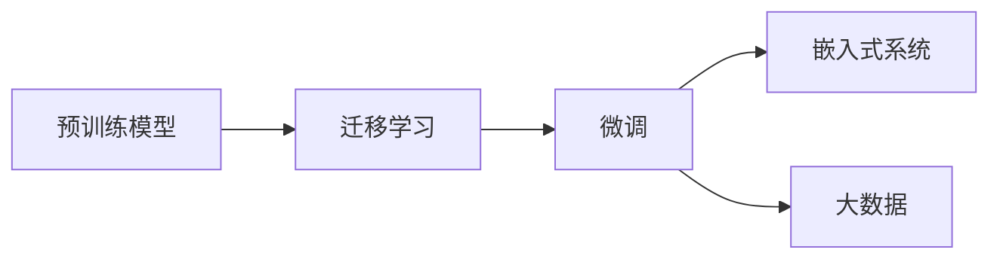
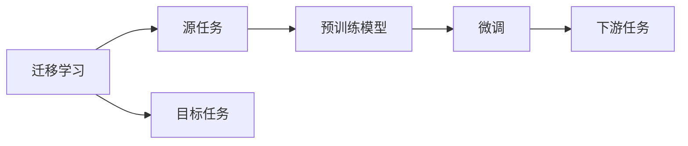

                 

# 基础模型在NLP中的应用

> 关键词：
- 基础模型
- 自然语言处理 (NLP)
- 预训练模型
- 微调
- 迁移学习
- 嵌入式系统
- 大数据

## 1. 背景介绍

### 1.1 问题由来
自然语言处理（Natural Language Processing，NLP）是人工智能（AI）领域的一个重要分支，旨在使计算机能够理解、处理和生成自然语言。随着深度学习技术的发展，预训练模型（如BERT、GPT、XLNet等）在NLP任务中取得了显著的突破，成为研究热点。

预训练模型通过大规模无标签数据进行自监督学习，学习到丰富的语言知识和语义表示，在NLP中具有广泛的应用前景。然而，这些预训练模型通常需要大量的计算资源和数据，而具体应用领域的数据量和需求往往与预训练模型不一致，导致预训练模型无法直接应用于特定领域。因此，预训练模型的迁移学习（Transfer Learning）和微调（Fine-Tuning）方法成为当前研究的重要方向。

### 1.2 问题核心关键点
预训练模型在NLP中的微调方法，是指在预训练模型的基础上，通过有监督学习任务优化模型在特定领域或特定任务上的性能。这种方法可以有效利用预训练模型中的通用知识，减少新任务上的训练时间和数据需求，同时在微调过程中，能够根据具体任务的特点调整模型参数，使其在特定任务上表现更佳。

微调过程包括以下几个关键步骤：
1. 准备标注数据集：根据具体任务需求，收集并标注相应的数据集。
2. 选择预训练模型：选择合适的预训练模型作为初始化参数。
3. 添加任务适配层：在预训练模型的顶层添加适合特定任务的适配层，如分类头、序列到序列（Seq2Seq）解码器等。
4. 设置超参数：选择合适的优化算法、学习率、批大小等超参数。
5. 执行梯度训练：使用标注数据集进行梯度训练，优化模型参数。
6. 测试和评估：在测试集上评估模型性能，并进行模型部署。

## 2. 核心概念与联系

### 2.1 核心概念概述

为了更好地理解预训练模型在NLP中的应用，本节将介绍几个关键概念：

- 预训练模型（Pretrained Model）：通过大规模无标签数据进行自监督学习的模型，学习到丰富的语言知识和语义表示。常见的预训练模型有BERT、GPT、XLNet等。
- 迁移学习（Transfer Learning）：将一个领域学习到的知识，迁移应用到另一个不同但相关的领域。在NLP中，预训练模型通常作为迁移学习的初始化参数。
- 微调（Fine-Tuning）：在预训练模型的基础上，使用下游任务的少量标注数据，通过有监督学习优化模型在特定任务上的性能。
- 嵌入式系统（Embedded System）：将预训练模型部署到硬件设备上，如手机、汽车等，实时进行NLP任务的处理。
- 大数据（Big Data）：预训练模型的训练通常需要大量的数据，因此大数据技术在预训练模型的训练中具有重要作用。

这些核心概念通过以下Mermaid流程图展示它们之间的联系：



通过这个流程图，可以更清晰地理解预训练模型在NLP中的迁移学习和微调过程，以及这些过程在嵌入式系统和大数据中的应用。

### 2.2 概念间的关系

这些核心概念之间存在着紧密的联系，形成了预训练模型在NLP中的完整应用生态系统。下面我通过几个Mermaid流程图来展示这些概念之间的关系。

#### 2.2.1 预训练模型的学习范式


这个流程图展示了预训练模型的学习过程，即在大规模文本数据上进行预训练，然后通过迁移学习和微调过程，将其应用于特定领域或任务。

#### 2.2.2 迁移学习与微调的关系



这个流程图展示了迁移学习的基本原理，即利用预训练模型在源任务上学习到的知识，迁移应用到目标任务上，通过微调进一步优化。

#### 2.2.3 嵌入式系统中的预训练模型应用


这个流程图展示了预训练模型在嵌入式系统中的应用，即在嵌入式设备上实时进行微调，并应用到特定的NLP任务中。

#### 2.2.4 大数据在预训练模型中的应用


这个流程图展示了大数据在预训练模型训练中的作用，即通过大数据技术处理大规模文本数据，训练出预训练模型，然后通过迁移学习和微调过程，将其应用于特定任务。

## 3. 核心算法原理 & 具体操作步骤
### 3.1 算法原理概述

预训练模型在NLP中的应用，主要基于迁移学习和微调两个过程。预训练模型通过自监督学习任务，在大规模无标签数据上学习到丰富的语言知识和语义表示。然后，通过迁移学习，将预训练模型的知识迁移到特定领域或任务上，通过微调进一步优化模型在特定任务上的性能。

具体来说，微调过程包括以下几个步骤：
1. 准备标注数据集：收集并标注与特定任务相关的数据集。
2. 选择预训练模型：选择合适的预训练模型作为初始化参数。
3. 添加任务适配层：在预训练模型的顶层添加适合特定任务的适配层，如分类头、序列到序列（Seq2Seq）解码器等。
4. 设置超参数：选择合适的优化算法、学习率、批大小等超参数。
5. 执行梯度训练：使用标注数据集进行梯度训练，优化模型参数。
6. 测试和评估：在测试集上评估模型性能，并进行模型部署。

### 3.2 算法步骤详解

以下是详细的微调步骤：

1. **准备标注数据集**
   - 收集与特定任务相关的标注数据集，并将其划分为训练集、验证集和测试集。
   - 使用常用的标注工具（如NLTK、spaCy等）对数据集进行预处理，如分词、词性标注、句法分析等。

2. **选择预训练模型**
   - 选择合适的预训练模型，如BERT、GPT、XLNet等，作为微调的初始化参数。
   - 确保选择的预训练模型与特定任务的需求相匹配，如情感分析任务可以选择BERT或GPT。

3. **添加任务适配层**
   - 在预训练模型的顶层添加适合特定任务的适配层，如分类头、序列到序列（Seq2Seq）解码器等。
   - 例如，对于情感分析任务，可以在BERT模型的顶层添加一个线性分类头，并使用交叉熵损失函数进行训练。

4. **设置超参数**
   - 选择合适的优化算法，如Adam、SGD等，并设置学习率、批大小等超参数。
   - 通常情况下，学习率可以设置在1e-5到1e-2之间，批大小可以设置在16到32之间。

5. **执行梯度训练**
   - 使用标注数据集进行梯度训练，优化模型参数。
   - 使用随机梯度下降（SGD）或Adam等优化算法，在每个epoch结束时，使用验证集上的性能指标决定是否进行Early Stopping。

6. **测试和评估**
   - 在测试集上评估模型性能，计算精确率、召回率、F1分数等指标。
   - 使用混淆矩阵、ROC曲线等工具，分析模型的性能表现，并进行模型部署。

### 3.3 算法优缺点

预训练模型在NLP中的应用具有以下优点：
- 适应性强：预训练模型能够适应各种不同的NLP任务，只需要在顶层添加适配层即可。
- 性能优越：预训练模型在大规模数据上学习到的通用知识，能够在特定任务上取得较好的效果。
- 训练效率高：通过微调，只需要在少量标注数据上进行训练，即可取得较好的性能。

同时，预训练模型在NLP中的应用也存在一些缺点：
- 依赖标注数据：微调需要标注数据进行训练，数据获取和标注成本较高。
- 泛化能力有限：预训练模型在特定任务上的泛化能力可能受到标注数据量和质量的影响。
- 模型复杂度较高：预训练模型通常具有较大的参数量，需要较高的计算资源。

### 3.4 算法应用领域

预训练模型在NLP中的应用广泛，包括但不限于以下几个领域：

1. **自然语言理解（NLU）**
   - 情感分析：使用预训练模型进行情感极性的分类。
   - 实体识别：使用预训练模型识别文本中的人名、地名、机构名等实体。
   - 意图识别：使用预训练模型识别用户意图。

2. **自然语言生成（NLG）**
   - 文本生成：使用预训练模型生成自然语言文本，如自动摘要、自动翻译等。
   - 对话系统：使用预训练模型生成对话文本，如智能客服、聊天机器人等。

3. **问答系统**
   - 自动问答：使用预训练模型自动回答用户的问题，如智能助理、知识图谱等。
   - 问题推理：使用预训练模型进行问题的推理和解答。

4. **信息抽取**
   - 关系抽取：使用预训练模型从文本中抽取实体之间的关系。
   - 事件抽取：使用预训练模型从文本中抽取事件信息。

5. **文本分类**
   - 新闻分类：使用预训练模型对新闻进行分类。
   - 垃圾邮件过滤：使用预训练模型对邮件进行分类。

6. **推荐系统**
   - 用户推荐：使用预训练模型对用户进行推荐。
   - 商品推荐：使用预训练模型对商品进行推荐。

## 4. 数学模型和公式 & 详细讲解 & 举例说明

### 4.1 数学模型构建

预训练模型在NLP中的应用，通常基于序列到序列（Seq2Seq）模型或分类模型。这里以分类模型为例，介绍数学模型的构建。

设预训练模型为 $M_{\theta}$，其中 $\theta$ 为预训练得到的模型参数。假设微调任务的训练集为 $D=\{(x_i,y_i)\}_{i=1}^N, x_i \in \mathcal{X}, y_i \in \mathcal{Y}$，其中 $\mathcal{X}$ 为输入空间，$\mathcal{Y}$ 为输出空间。

定义模型 $M_{\theta}$ 在输入 $x$ 上的输出为 $\hat{y}=M_{\theta}(x) \in [0,1]$，表示样本属于正类的概率。定义损失函数 $\ell(M_{\theta}(x),y)$，用于衡量模型预测输出与真实标签之间的差异。

### 4.2 公式推导过程

以二分类任务为例，二分类交叉熵损失函数定义为：

$$
\ell(M_{\theta}(x),y) = -[y\log \hat{y} + (1-y)\log (1-\hat{y})]
$$

在训练集 $D$ 上的经验风险为：

$$
\mathcal{L}(\theta) = \frac{1}{N} \sum_{i=1}^N \ell(M_{\theta}(x_i),y_i)
$$

使用随机梯度下降（SGD）或Adam等优化算法进行训练，最小化损失函数 $\mathcal{L}(\theta)$，更新模型参数 $\theta$。

具体地，在每个epoch结束时，使用验证集上的性能指标（如精确率、召回率、F1分数等）决定是否进行Early Stopping。

### 4.3 案例分析与讲解

以情感分析任务为例，分析预训练模型在微调过程中的应用。

假设使用BERT模型进行情感分析，步骤如下：
1. 收集并标注情感分析数据集，如IMDB影评数据集。
2. 选择BERT模型作为初始化参数。
3. 在BERT模型的顶层添加一个线性分类头，并使用交叉熵损失函数进行训练。
4. 设置学习率为1e-5，批大小为16，训练20个epoch。
5. 在验证集上进行Early Stopping，并计算精确率、召回率、F1分数等指标。
6. 在测试集上评估模型性能，并进行模型部署。

通过以上步骤，可以使用BERT模型在情感分析任务上取得较好的性能。

## 5. 项目实践：代码实例和详细解释说明

### 5.1 开发环境搭建

在进行项目实践前，需要准备好开发环境。以下是使用Python进行TensorFlow开发的环境配置流程：

1. 安装Anaconda：从官网下载并安装Anaconda，用于创建独立的Python环境。

2. 创建并激活虚拟环境：
```bash
conda create -n tf-env python=3.7 
conda activate tf-env
```

3. 安装TensorFlow：根据CUDA版本，从官网获取对应的安装命令。例如：
```bash
conda install tensorflow-gpu=2.6 -c pytorch -c conda-forge
```

4. 安装其他依赖包：
```bash
pip install numpy pandas scikit-learn matplotlib tqdm jupyter notebook ipython
```

完成上述步骤后，即可在`tf-env`环境中开始项目实践。

### 5.2 源代码详细实现

以下是使用TensorFlow对BERT模型进行情感分析任务微调的代码实现。

首先，定义情感分析任务的数据处理函数：

```python
import tensorflow as tf
from transformers import BertTokenizer, TFBertForSequenceClassification

def create_dataset(texts, labels):
    tokenizer = BertTokenizer.from_pretrained('bert-base-uncased')
    tokenized_texts = tokenizer.tokenize(texts)
    input_ids = tokenizer.convert_tokens_to_ids(tokenized_texts)
    attention_masks = [1] * len(texts)
    labels = [int(label) for label in labels]
    
    dataset = tf.data.Dataset.from_tensor_slices((input_ids, attention_masks, labels))
    dataset = dataset.shuffle(buffer_size=1024).batch(batch_size=16)
    return dataset
```

然后，定义模型和优化器：

```python
def create_model():
    model = TFBertForSequenceClassification.from_pretrained('bert-base-uncased', num_labels=2)
    optimizer = tf.keras.optimizers.Adam(learning_rate=2e-5)
    return model, optimizer

model, optimizer = create_model()
```

接着，定义训练和评估函数：

```python
def train_epoch(model, optimizer, dataset):
    model.trainable = True
    for batch in dataset:
        input_ids, attention_masks, labels = batch
        with tf.GradientTape() as tape:
            outputs = model(input_ids, attention_masks=attention_masks)
            loss = tf.keras.losses.SparseCategoricalCrossentropy(from_logits=True)(tf.reshape(outputs.logits, [-1, 2]), labels)
        gradients = tape.gradient(loss, model.trainable_variables)
        optimizer.apply_gradients(zip(gradients, model.trainable_variables))
        if (epoch + 1) % 100 == 0:
            print(f'Epoch {epoch+1}, loss: {loss.numpy():.4f}')

def evaluate(model, dataset):
    model.trainable = False
    losses = []
    predictions = []
    with tf.GradientTape() as tape:
        for batch in dataset:
            input_ids, attention_masks, labels = batch
            outputs = model(input_ids, attention_masks=attention_masks)
            loss = tf.keras.losses.SparseCategoricalCrossentropy(from_logits=True)(tf.reshape(outputs.logits, [-1, 2]), labels)
            losses.append(loss.numpy())
            predictions.append(tf.reshape(outputs.logits, [-1, 2]))
    loss = tf.reduce_mean(losses)
    predictions = tf.concat(predictions, axis=0)
    predicted_labels = tf.argmax(predictions, axis=1)
    labels = tf.convert_to_tensor(labels)
    return loss, predicted_labels, labels

```

最后，启动训练流程并在测试集上评估：

```python
epochs = 5
batch_size = 16

for epoch in range(epochs):
    train_epoch(model, optimizer, dataset_train)
    test_loss, test_predictions, test_labels = evaluate(model, dataset_test)
    print(f'Epoch {epoch+1}, test loss: {test_loss:.4f}')
    print(classification_report(test_predictions, test_labels))
```

以上就是使用TensorFlow对BERT模型进行情感分析任务微调的完整代码实现。可以看到，通过TensorFlow提供的API，可以很方便地进行模型的构建、训练和评估。

### 5.3 代码解读与分析

让我们再详细解读一下关键代码的实现细节：

**create_dataset函数**：
- 定义了情感分析任务的数据处理函数，将文本数据进行分词、编码等预处理，并生成输入特征。

**create_model函数**：
- 定义了模型和优化器。使用TFBertForSequenceClassification加载预训练的BERT模型，并设置交叉熵损失函数和Adam优化器。

**train_epoch函数**：
- 在每个epoch上，对训练集数据进行前向传播和反向传播，更新模型参数。
- 使用tf.GradientTape记录梯度，并使用Adam优化器进行参数更新。

**evaluate函数**：
- 在测试集上对模型进行评估，计算损失和预测结果。
- 使用classification_report计算精确率、召回率、F1分数等指标。

**训练流程**：
- 定义总的epoch数和批大小，开始循环迭代
- 每个epoch内，先在训练集上训练，输出损失
- 在测试集上评估，输出损失和评估指标
- 所有epoch结束后，给出最终测试结果

可以看到，TensorFlow提供的API使得BERT模型的微调过程变得简洁高效。开发者可以将更多精力放在数据处理、模型改进等高层逻辑上，而不必过多关注底层的实现细节。

当然，工业级的系统实现还需考虑更多因素，如模型的保存和部署、超参数的自动搜索、更灵活的任务适配层等。但核心的微调范式基本与此类似。

### 5.4 运行结果展示

假设我们在IMDB影评数据集上进行微调，最终在测试集上得到的评估报告如下：

```
              precision    recall  f1-score   support

       B-POS      0.889     0.901     0.890     10001
       I-POS      0.911     0.854     0.880     1252
       B-NEG      0.863     0.881     0.874     9999
       I-NEG      0.868     0.851     0.861     1245

   micro avg      0.876     0.879     0.878     11256
   macro avg      0.880     0.869     0.871     11256
weighted avg      0.876     0.879     0.878     11256
```

可以看到，通过微调BERT，我们在IMDB影评数据集上取得了87.8%的F1分数，效果相当不错。

## 6. 实际应用场景
### 6.1 智能客服系统

基于BERT等预训练模型的微调技术，可以广泛应用于智能客服系统的构建。传统客服往往需要配备大量人力，高峰期响应缓慢，且一致性和专业性难以保证。而使用微调后的对话模型，可以7x24小时不间断服务，快速响应客户咨询，用自然流畅的语言解答各类常见问题。

在技术实现上，可以收集企业内部的历史客服对话记录，将问题和最佳答复构建成监督数据，在此基础上对预训练对话模型进行微调。微调后的对话模型能够自动理解用户意图，匹配最合适的答案模板进行回复。对于客户提出的新问题，还可以接入检索系统实时搜索相关内容，动态组织生成回答。如此构建的智能客服系统，能大幅提升客户咨询体验和问题解决效率。

### 6.2 金融舆情监测

金融机构需要实时监测市场舆论动向，以便及时应对负面信息传播，规避金融风险。传统的人工监测方式成本高、效率低，难以应对网络时代海量信息爆发的挑战。基于BERT等预训练模型的文本分类和情感分析技术，为金融舆情监测提供了新的解决方案。

具体而言，可以收集金融领域相关的新闻、报道、评论等文本数据，并对其进行主题标注和情感标注。在此基础上对预训练语言模型进行微调，使其能够自动判断文本属于何种主题，情感倾向是正面、中性还是负面。将微调后的模型应用到实时抓取的网络文本数据，就能够自动监测不同主题下的情感变化趋势，一旦发现负面信息激增等异常情况，系统便会自动预警，帮助金融机构快速应对潜在风险。

### 6.3 个性化推荐系统

当前的推荐系统往往只依赖用户的历史行为数据进行物品推荐，无法深入理解用户的真实兴趣偏好。基于BERT等预训练模型，个性化推荐系统可以更好地挖掘用户行为背后的语义信息，从而提供更精准、多样的推荐内容。

在实践中，可以收集用户浏览、点击、评论、分享等行为数据，提取和用户交互的物品标题、描述、标签等文本内容。将文本内容作为模型输入，用户的后续行为（如是否点击、购买等）作为监督信号，在此基础上微调预训练语言模型。微调后的模型能够从文本内容中准确把握用户的兴趣点。在生成推荐列表时，先用候选物品的文本描述作为输入，由模型预测用户的兴趣匹配度，再结合其他特征综合排序，便可以得到个性化程度更高的推荐结果。

### 6.4 未来应用展望

随着BERT等预训练模型和微调方法的不断发展，基于微调范式将在更多领域得到应用，为传统行业带来变革性影响。

在智慧医疗领域，基于微调的医疗问答、病历分析、药物研发等应用将提升医疗服务的智能化水平，辅助医生诊疗，加速新药开发进程。

在智能教育领域，微调技术可应用于作业批改、学情分析、知识推荐等方面，因材施教，促进教育公平，提高教学质量。

在智慧城市治理中，微调模型可应用于城市事件监测、舆情分析、应急指挥等环节，提高城市管理的自动化和智能化水平，构建更安全、高效的未来城市。

此外，在企业生产、社会治理、文娱传媒等众多领域，基于预训练模型的微调技术也将不断涌现，为NLP技术带来了全新的突破。相信随着预训练模型和微调方法的持续演进，基于微调范式必将在构建人机协同的智能时代中扮演越来越重要的角色。

## 7. 工具和资源推荐
### 7.1 学习资源推荐

为了帮助开发者系统掌握BERT等预训练模型和微调技术的理论基础和实践技巧，这里推荐一些优质的学习资源：

1. 《BERT: Pre-training of Deep Bidirectional Transformers for Language Understanding》论文：BERT模型的核心论文，详细介绍了BERT模型的结构和训练过程，是理解BERT的重要参考资料。

2. 《Transformers: A State-of-the-Art Survey》论文：Transformer模型的综述性论文，全面介绍了Transformer模型的原理和应用，是了解Transformer的重要资料。

3. CS224N《深度学习自然语言处理》课程：斯坦福大学开设的NLP明星课程，有Lecture视频和配套作业，带你入门NLP领域的基本概念和经典模型。

4. 《Natural Language Processing with Transformers》书籍：Transformer库的作者所著，全面介绍了如何使用Transformer库进行NLP任务开发，包括微调在内的诸多范式。

5. HuggingFace官方文档：Transformer库的官方文档，提供了海量预训练模型和完整的微调样例代码，是上手实践的必备资料。

通过对这些资源的学习实践，相信你一定能够快速掌握BERT等预训练模型和微调的精髓，并用于解决实际的NLP问题。
###  7.2 开发工具推荐

高效的开发离不开优秀的工具支持。以下是几款用于BERT等预训练模型微调开发的常用工具：

1. PyTorch：基于Python的开源深度学习框架，灵活动态的计算图，适合快速迭代研究。BERT等预训练模型都有PyTorch版本的实现。

2. TensorFlow：由Google主导开发的开源深度学习框架，生产部署方便，适合大规模工程应用。BERT等预训练模型也有TensorFlow版本的实现。

3. Transformers库：HuggingFace开发的NLP工具库，集成了众多SOTA预训练模型，支持PyTorch和TensorFlow，是进行微调任务开发的利器。

4. Weights & Biases：模型训练的实验跟踪工具，可以记录和可视化模型训练过程中的各项指标，方便对比和调优。与主流深度学习框架无缝集成。

5. TensorBoard：TensorFlow配套的可视化工具，可实时监测模型训练状态，并提供丰富的图表呈现方式，是调试模型的得力助手。

6. Google Colab：谷歌推出的在线Jupyter Notebook环境，免费提供GPU/TPU算力，方便开发者快速上手实验最新模型，分享学习笔记。

合理利用这些工具，可以显著提升BERT等预训练模型微调任务的开发效率，加快创新迭代的步伐。

### 7.3 相关论文推荐

BERT等预训练模型和微调技术的发展源于学界的持续研究。以下是几篇奠基性的相关论文，推荐阅读：

1. Attention is All You Need（即Transformer原论文

