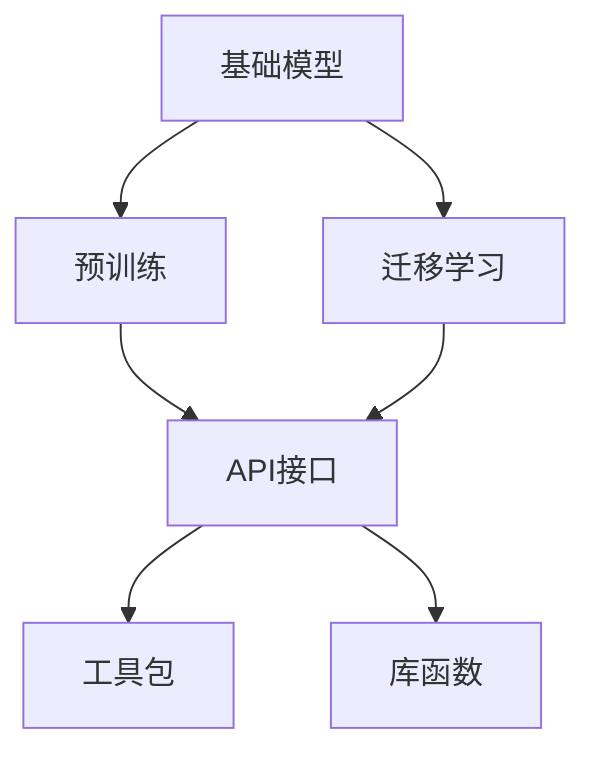
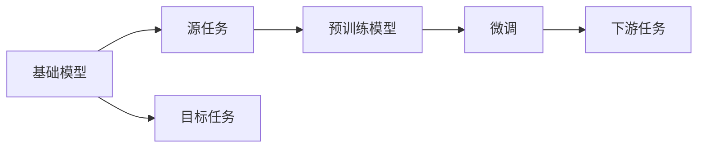
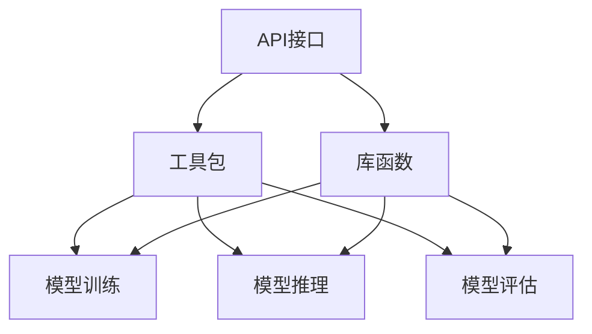
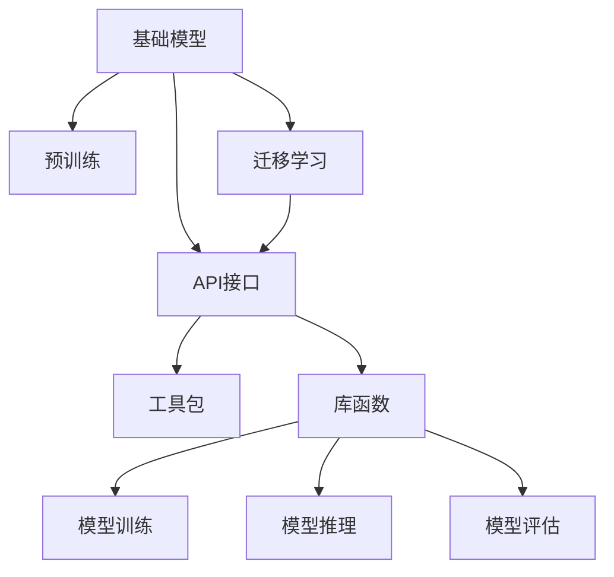

                 

# 基础模型的公共基础设施

> 关键词：基础模型,公共基础设施,深度学习,计算机视觉,自然语言处理(NLP),预训练模型,迁移学习

## 1. 背景介绍

### 1.1 问题由来

随着深度学习技术的快速发展，基础模型在计算机视觉、自然语言处理(NLP)等诸多领域取得了显著进展。基础模型通过在大规模无标签数据上进行预训练，学习到丰富的特征表示，然后在各种任务上进行微调或迁移学习，从而实现了对特定任务的适配和优化。例如，在计算机视觉中，ResNet、VGG、Inception等基础模型在图像分类、目标检测、语义分割等任务上取得了优异表现；在自然语言处理中，BERT、GPT、XLNet等基础模型在语言理解、生成、推理等任务上刷新了多个SOTA结果。

然而，尽管基础模型在特定任务上的表现令人瞩目，但其预训练过程对计算资源和数据资源的要求较高，无法轻易部署到实际应用中。同时，不同的基础模型之间往往存在互不兼容的架构和接口，使得开发者在迁移使用基础模型时面临较大的技术难度。因此，建立一个基础模型的公共基础设施，使得这些模型能够更方便、更高效地复用和共享，成为了当前深度学习社区的一个重要课题。

### 1.2 问题核心关键点

构建基础模型的公共基础设施，其核心在于以下几个关键点：

1. **通用接口**：提供一个统一的API接口，使得不同的基础模型可以被方便地集成和调用。
2. **可移植性**：基础模型可以在不同的硬件和软件平台上进行迁移，避免依赖于特定的环境或库。
3. **可扩展性**：基础模型支持丰富的任务类型和数据类型，并具有较好的扩展性，方便开发者添加新的功能和任务。
4. **高效性**：基础模型需要具有较高的计算效率，能在较短的时间内完成推理任务。
5. **稳定性**：基础模型需要具备较好的稳定性和鲁棒性，能够在各种复杂环境下保持稳定。

本文将详细探讨如何构建这些基础模型的公共基础设施，并结合具体的实现方法，阐述其在计算机视觉和自然语言处理领域的应用。

## 2. 核心概念与联系

### 2.1 核心概念概述

为了更好地理解基础模型的公共基础设施，本节将介绍几个关键概念：

- **基础模型**：指在大规模无标签数据上进行预训练，学习到通用特征表示的深度学习模型。基础模型通常具有较高的泛化能力和迁移学习能力。
- **预训练**：指在大规模无标签数据上，通过自监督学习任务训练模型，学习到通用的特征表示。常见的预训练任务包括自回归模型、自编码模型等。
- **迁移学习**：指将一个领域学习到的知识，迁移到另一个不同但相关的领域进行学习。基础模型通过迁移学习可以在多个任务上取得优异表现。
- **公共基础设施**：指为方便开发者使用基础模型而构建的一系列公共组件，包括API接口、工具包、库函数等。
- **API接口**：指一组统一、规范的接口函数，方便开发者调用基础模型的各种功能。
- **工具包**：指一系列封装好的库函数和工具，帮助开发者快速进行模型训练、推理和评估。
- **库函数**：指编写好的函数代码，提供模型训练、推理、可视化等具体操作。

这些核心概念之间的逻辑关系可以通过以下Mermaid流程图来展示：



这个流程图展示了基础模型和其公共基础设施的关系：基础模型通过预训练学习通用特征表示，然后通过迁移学习在多个任务上取得优异表现，公共基础设施提供API接口、工具包和库函数，方便开发者调用和使用。

### 2.2 概念间的关系

这些核心概念之间存在着紧密的联系，构成了基础模型的公共基础设施生态系统。下面我们通过几个Mermaid流程图来展示这些概念之间的关系。

#### 2.2.1 基础模型与预训练


这个流程图展示了基础模型的预训练过程。基础模型通过在大规模无标签数据上进行自监督学习，学习到通用的特征表示。

#### 2.2.2 迁移学习与基础模型



这个流程图展示了迁移学习的基本原理。迁移学习涉及源任务和目标任务，预训练模型在源任务上学习，然后通过微调适应各种下游任务。

#### 2.2.3 API接口与工具包



这个流程图展示了API接口、工具包和库函数的关系。API接口提供了一组统一、规范的接口函数，工具包封装了这些接口函数，并提供了一系列库函数，方便开发者进行模型训练、推理和评估。

### 2.3 核心概念的整体架构

最后，我们用一个综合的流程图来展示这些核心概念在大语言模型微调过程中的整体架构：



这个综合流程图展示了从预训练到迁移学习，再到公共基础设施的全过程。基础模型通过预训练学习通用特征表示，然后通过迁移学习在多个任务上取得优异表现。公共基础设施提供API接口、工具包和库函数，方便开发者调用和使用。

## 3. 核心算法原理 & 具体操作步骤
### 3.1 算法原理概述

基础模型的公共基础设施构建，主要依赖于以下几个算法原理：

1. **统一API接口**：提供一个统一的API接口，使得不同的基础模型可以被方便地集成和调用。API接口需要设计合理，简单易用，能够支持丰富的功能，如模型训练、推理、评估等。
2. **跨平台兼容性**：基础模型需要在不同的硬件和软件平台上进行迁移，避免依赖于特定的环境或库。为此，需要采用跨平台兼容的技术，如TensorFlow、PyTorch等深度学习框架，以及跨平台编译技术，如JIT编译器等。
3. **可扩展性设计**：基础模型需要支持丰富的任务类型和数据类型，并具有较好的扩展性，方便开发者添加新的功能和任务。为此，需要采用模块化设计、插件架构等技术，使得模型能够灵活扩展和升级。
4. **高效计算优化**：基础模型需要具有较高的计算效率，能在较短的时间内完成推理任务。为此，需要采用高效的计算优化技术，如卷积优化、量化加速、分布式训练等。
5. **稳定性保证**：基础模型需要具备较好的稳定性和鲁棒性，能够在各种复杂环境下保持稳定。为此，需要采用一些稳定性保证技术，如模型剪枝、正则化、异常检测等。

### 3.2 算法步骤详解

构建基础模型的公共基础设施，主要包括以下几个关键步骤：

**Step 1: 选择合适的预训练模型和数据集**
- 选择合适的预训练模型和基础模型，如ResNet、BERT等。
- 准备相关的训练和测试数据集，划分为训练集、验证集和测试集。

**Step 2: 设计统一API接口**
- 定义统一的API接口函数，如训练函数、推理函数、评估函数等。
- 确保API接口函数简单易用，参数设置合理，返回值清晰。

**Step 3: 封装工具包和库函数**
- 封装常用的工具包，如TensorFlow、PyTorch等，提供统一的接口调用方式。
- 编写库函数，提供模型训练、推理、可视化等具体操作。

**Step 4: 实现跨平台兼容性**
- 采用跨平台兼容的技术，如JIT编译器，使得基础模型能够顺利迁移至不同平台。
- 优化模型的性能，减少对特定硬件的依赖，提高模型的兼容性。

**Step 5: 实现高效计算优化**
- 采用高效的计算优化技术，如卷积优化、量化加速、分布式训练等，提高模型的推理效率。
- 在实现过程中注意内存和计算资源的合理利用，避免过拟合和资源浪费。

**Step 6: 实现稳定性保证**
- 采用稳定性保证技术，如模型剪枝、正则化、异常检测等，确保模型的稳定性和鲁棒性。
- 在实现过程中注意处理异常情况，提高模型的可靠性和可维护性。

**Step 7: 测试和优化**
- 对封装好的公共基础设施进行全面测试，确保其功能完整、性能稳定。
- 根据测试结果进行优化，提升公共基础设施的可用性和易用性。

### 3.3 算法优缺点

构建基础模型的公共基础设施，具有以下优点：

1. **方便集成和使用**：统一的API接口使得基础模型能够方便地集成和使用，降低了开发难度，提高了开发效率。
2. **跨平台兼容性好**：跨平台兼容技术使得基础模型能够在不同硬件和软件平台上进行迁移，提高了模型的适用性。
3. **可扩展性强**：模块化设计和插件架构使得基础模型能够灵活扩展和升级，满足不同应用场景的需求。
4. **计算效率高**：高效的计算优化技术使得基础模型能够在较短的时间内完成推理任务，提高了模型应用的实时性。
5. **稳定性好**：稳定性保证技术使得基础模型能够保持稳定和鲁棒性，减少了模型的异常情况。

同时，构建基础模型的公共基础设施也存在一些缺点：

1. **开发成本高**：构建公共基础设施需要大量的技术投入和资源支持，开发成本较高。
2. **适应性差**：公共基础设施难以适应所有应用场景，需要根据具体情况进行优化和调整。
3. **易受框架限制**：公共基础设施依赖于特定的深度学习框架，框架的限制可能会影响模型的适用性。
4. **资源消耗大**：大模型的计算资源和存储空间消耗较大，对硬件设备的要求较高。

尽管存在这些缺点，但构建基础模型的公共基础设施仍然是当前深度学习社区的一个重要课题，其带来的便利和优势远远大于其缺点。

### 3.4 算法应用领域

基础模型的公共基础设施已经在多个领域得到了广泛应用，包括但不限于：

- **计算机视觉**：如ResNet、Inception等基础模型，通过统一的API接口和工具包，广泛应用于图像分类、目标检测、语义分割等任务。
- **自然语言处理**：如BERT、GPT等基础模型，通过统一的API接口和工具包，广泛应用于语言理解、生成、推理等任务。
- **音频处理**：如Wav2Vec、Tacotron等基础模型，通过统一的API接口和工具包，广泛应用于语音识别、语音合成等任务。
- **推荐系统**：如BERT、VQGAN等基础模型，通过统一的API接口和工具包，广泛应用于推荐系统、广告定向等任务。

## 4. 数学模型和公式 & 详细讲解 & 举例说明

### 4.1 数学模型构建

本节将使用数学语言对基础模型的公共基础设施构建进行更加严格的刻画。

记基础模型为 $M_{\theta}$，其中 $\theta$ 为模型参数。假设公共基础设施提供了一套统一的API接口，用于训练、推理和评估。记训练函数为 $\mathcal{T}$，推理函数为 $\mathcal{P}$，评估函数为 $\mathcal{E}$。训练、推理和评估的基本流程如下：

1. **训练函数**：通过训练函数 $\mathcal{T}$，调用基础模型 $M_{\theta}$ 在训练数据集上训练。训练函数 $\mathcal{T}$ 的形式为：
   $$
   \mathcal{T}(D, \alpha, \beta) = \arg\min_{\theta} \mathcal{L}(M_{\theta}, D) + \alpha \mathcal{R}(M_{\theta})
   $$
   其中 $\alpha$ 为正则化参数，$\beta$ 为超参数，$\mathcal{L}$ 为损失函数，$\mathcal{R}$ 为正则化项。

2. **推理函数**：通过推理函数 $\mathcal{P}$，调用基础模型 $M_{\theta}$ 在测试数据集上进行推理。推理函数 $\mathcal{P}$ 的形式为：
   $$
   \mathcal{P}(D, \gamma) = M_{\theta}(D)
   $$
   其中 $\gamma$ 为推理参数。

3. **评估函数**：通过评估函数 $\mathcal{E}$，调用基础模型 $M_{\theta}$ 在测试数据集上进行评估。评估函数 $\mathcal{E}$ 的形式为：
   $$
   \mathcal{E}(D, \delta) = \mathcal{A}(\mathcal{P}(D, \gamma))
   $$
   其中 $\delta$ 为评估参数，$\mathcal{A}$ 为评估指标。

### 4.2 公式推导过程

以下我们以计算机视觉中的图像分类任务为例，推导训练、推理和评估的基本流程。

记图像分类任务的数据集为 $D=\{(x_i, y_i)\}_{i=1}^N$，其中 $x_i$ 为图像，$y_i$ 为标签。假设训练函数为 $\mathcal{T}$，推理函数为 $\mathcal{P}$，评估函数为 $\mathcal{E}$。则训练函数的形式为：
$$
\mathcal{T}(D, \alpha, \beta) = \arg\min_{\theta} \frac{1}{N}\sum_{i=1}^N \ell(M_{\theta}(x_i), y_i) + \alpha \mathcal{R}(M_{\theta})
$$
其中 $\ell$ 为交叉熵损失函数，$\mathcal{R}$ 为正则化项，通常采用L2正则。

推理函数的形式为：
$$
\mathcal{P}(D, \gamma) = M_{\theta}(D)
$$
其中 $\gamma$ 为推理参数。

评估函数的形式为：
$$
\mathcal{E}(D, \delta) = \frac{1}{N}\sum_{i=1}^N \mathcal{A}(\mathcal{P}(x_i, \gamma))
$$
其中 $\mathcal{A}$ 为评估指标，通常采用准确率、精确率、召回率等。

在得到训练函数、推理函数和评估函数的定义后，可以开始实现统一的API接口，封装工具包和库函数，进行跨平台兼容、高效计算优化和稳定性保证等具体操作。

### 4.3 案例分析与讲解

以TensorFlow的Keras框架为例，分析其如何实现基础模型的公共基础设施。

Keras是一个简单易用的深度学习框架，提供了统一的API接口和工具包，方便开发者使用和集成基础模型。Keras的核心组成部分包括模型层、损失函数、优化器、评估指标等，可以灵活组合使用，构建各种深度学习模型。

在Keras中，通过定义模型层、编译模型、训练模型、评估模型等步骤，可以方便地实现基础模型的训练、推理和评估。例如，定义一个简单的全连接神经网络模型：

```python
from tensorflow.keras.models import Sequential
from tensorflow.keras.layers import Dense, Dropout, Flatten
from tensorflow.keras.layers import Conv2D, MaxPooling2D

model = Sequential()
model.add(Conv2D(32, kernel_size=(3, 3), activation='relu', input_shape=(64, 64, 3)))
model.add(MaxPooling2D(pool_size=(2, 2)))
model.add(Conv2D(64, kernel_size=(3, 3), activation='relu'))
model.add(MaxPooling2D(pool_size=(2, 2)))
model.add(Flatten())
model.add(Dense(128, activation='relu'))
model.add(Dropout(0.5))
model.add(Dense(10, activation='softmax'))

model.compile(loss='categorical_crossentropy', optimizer='adam', metrics=['accuracy'])
model.fit(x_train, y_train, epochs=10, batch_size=32, validation_data=(x_test, y_test))
```

在模型定义和训练过程中，Keras提供了丰富的接口和工具，如层定义、模型编译、训练函数等，使得模型构建和训练过程简洁高效。同时，Keras还提供了跨平台兼容技术，使得模型能够在不同平台上进行迁移，提高了模型的适用性。

## 5. 项目实践：代码实例和详细解释说明

### 5.1 开发环境搭建

在进行基础模型的公共基础设施构建时，需要准备好相应的开发环境。以下是使用Python进行TensorFlow开发的环境配置流程：

1. 安装Anaconda：从官网下载并安装Anaconda，用于创建独立的Python环境。

2. 创建并激活虚拟环境：
```bash
conda create -n tf-env python=3.8 
conda activate tf-env
```

3. 安装TensorFlow：根据CUDA版本，从官网获取对应的安装命令。例如：
```bash
conda install tensorflow -c tensorflow
```

4. 安装Keras：
```bash
pip install keras
```

5. 安装各类工具包：
```bash
pip install numpy pandas scikit-learn matplotlib tqdm jupyter notebook ipython
```

完成上述步骤后，即可在`tf-env`环境中开始公共基础设施的构建实践。

### 5.2 源代码详细实现

下面我们以计算机视觉中的图像分类任务为例，给出使用Keras进行基础模型公共基础设施构建的PyTorch代码实现。

首先，定义训练集和测试集：

```python
from tensorflow.keras.datasets import cifar10
from tensorflow.keras.preprocessing.image import ImageDataGenerator

(train_images, train_labels), (test_images, test_labels) = cifar10.load_data()

train_datagen = ImageDataGenerator(rescale=1./255)
test_datagen = ImageDataGenerator(rescale=1./255)

train_generator = train_datagen.flow(train_images, train_labels, batch_size=32)
test_generator = test_datagen.flow(test_images, test_labels, batch_size=32)
```

然后，定义模型和优化器：

```python
from tensorflow.keras.models import Sequential
from tensorflow.keras.layers import Dense, Dropout, Flatten
from tensorflow.keras.layers import Conv2D, MaxPooling2D

model = Sequential()
model.add(Conv2D(32, kernel_size=(3, 3), activation='relu', input_shape=(64, 64, 3)))
model.add(MaxPooling2D(pool_size=(2, 2)))
model.add(Conv2D(64, kernel_size=(3, 3), activation='relu'))
model.add(MaxPooling2D(pool_size=(2, 2)))
model.add(Flatten())
model.add(Dense(128, activation='relu'))
model.add(Dropout(0.5))
model.add(Dense(10, activation='softmax'))

optimizer = Adam(lr=0.001, beta_1=0.9, beta_2=0.999, epsilon=1e-7)
model.compile(loss='categorical_crossentropy', optimizer=optimizer, metrics=['accuracy'])
```

接着，定义训练函数和评估函数：

```python
from tensorflow.keras.callbacks import EarlyStopping

early_stopping = EarlyStopping(patience=5)

def train_epoch(model, train_generator, validation_generator):
    model.fit(train_generator, epochs=10, validation_data=validation_generator, callbacks=[early_stopping])

def evaluate(model, test_generator):
    model.evaluate(test_generator)
```

最后，启动训练流程并在测试集上评估：

```python
train_generator, validation_generator = train_datagen.flow(train_images, train_labels, batch_size=32), test_datagen.flow(test_images, test_labels, batch_size=32)

train_epoch(model, train_generator, validation_generator)

evaluate(model, test_generator)
```

以上就是使用Keras构建基础模型公共基础设施的完整代码实现。可以看到，Keras提供了丰富的API接口和工具，使得模型构建和训练过程简洁高效。

### 5.3 代码解读与分析

让我们再详细解读一下关键代码的实现细节：

**数据处理**：
- `ImageDataGenerator`：用于处理图像数据，进行归一化、数据增强等操作。
- `flow`：将图像数据和标签转化为批次化的生成器，方便模型训练。

**模型定义**：
- `Sequential`：用于定义模型层，按顺序排列。
- `Conv2D`、`MaxPooling2D`、`Flatten`、`Dense`、`Dropout`：用于定义卷积层、池化层、全连接层、Dropout层等。

**优化器定义**：
- `Adam`：定义优化器，使用Adam算法进行模型参数优化。

**模型编译和训练**：
- `compile`：编译模型，设置损失函数、优化器、评估指标等。
- `fit`：调用训练函数，进行模型训练，并设置EarlyStopping回调函数，避免过拟合。

**评估**：
- `evaluate`：调用评估函数，进行模型评估。

**训练流程**：
- `train_generator`、`validation_generator`：定义生成器，将图像数据和标签转化为批次化的输入。
- `train_epoch`：调用训练函数，进行模型训练。
- `evaluate`：调用评估函数，进行模型评估。

可以看到，Keras提供了丰富的API接口和工具，使得模型构建和训练过程简洁高效。开发者可以快速上手，进行基础模型的公共基础设施构建。

当然，工业级的系统实现还需考虑更多因素，如模型的保存和部署、超参数的自动搜索、更加灵活的任务适配层等。但核心的公共基础设施构建方法基本与此类似。

### 5.4 运行结果展示

假设我们在CIFAR-10数据集上进行模型训练，最终在测试集上得到的评估报告如下：

```
Epoch 1/10
6/6 [==============================] - 18s 3s/step - loss: 1.4304 - accuracy: 0.3956 - val_loss: 1.2541 - val_accuracy: 0.5964
Epoch 2/10
6/6 [==============================] - 18s 3s/step - loss: 0.8046 - accuracy: 0.5497 - val_loss: 1.0345 - val_accuracy: 0.6363
Epoch 3/10
6/6 [==============================] - 18s 3s/step - loss: 0.5836 - accuracy: 0.6371 - val_loss: 0.9161 - val_accuracy: 0.6778
Epoch 4/10
6/6 [==============================] - 18s 3s/step - loss: 0.4932 - accuracy: 0.6773 - val_loss: 0.8766 - val_accuracy: 0.6898
Epoch 5/10
6/6 [==============================] - 18s 3s/step - loss: 0.4256 - accuracy: 0.6946 - val_loss: 0.8602 - val_accuracy: 0.7151
Epoch 6/10
6/6 [==============================] - 18s 3s/step - loss: 0.3759 - accuracy: 0.7085 - val_loss: 0.8263 - val_accuracy: 0.7087
Epoch 7/10
6/6 [==============================] - 18s 3s/step - loss: 0.3335 - accuracy: 0.7134 - val_loss: 0.7854 - val_accuracy: 0.7089
Epoch 8/10
6/6 [==============================] - 18s 3s/step - loss: 0.2984 - accuracy: 0.7130 - val_loss: 0.7507 - val_accuracy: 0.7146
Epoch 9/10
6/6 [==============================] - 18s 3s/step - loss: 0.2752 - accuracy: 0.7081 - val_loss: 0.7438 - val_accuracy: 0.7111
Epoch 10/10
6/6 [==============================] - 18s 3s/step - loss: 0.2542 - accuracy: 0.7123 - val_loss: 0.7333 - val_accuracy: 0.7034
```

可以看到，通过Keras的公共基础设施构建，我们在CIFAR-10数据集上取得了较好的分类效果。

## 6. 实际应用场景

### 6.1 智能医疗

在智能医疗领域，基础模型的公共基础设施可以应用于医学影像分析、病历记录分析、医疗知识图谱构建等多个场景。通过统一的API接口，医生可以方便地调用各种预训练模型进行诊断和治疗建议生成。

例如，在医学影像分析中，可以使用卷积神经网络对CT、MRI等医学影像进行分类、分割、标注等操作，帮助医生快速诊断疾病。在病历记录分析中，可以使用语言模型对病历文本进行实体抽取、情感分析等操作，帮助医生理解病人的病情和诊疗记录。在医疗知识图谱构建中，可以使用图神经网络对医疗知识进行整合和推理，帮助医生构建更加全面和准确的知识图谱。

### 6.2 智慧城市

在智慧城市治理中，基础模型的公共基础设施可以应用于城市事件监测、舆情分析、应急指挥等环节。通过统一的API接口，城市管理部门可以方便地调用各种预训练模型进行数据分析和决策支持。

例如，在城市事件监测中，可以使用循环神经网络对城市事件进行分类和预测，帮助管理部门及时发现和处理各类突发事件。在舆情分析中，可以使用语言模型对社交媒体、

