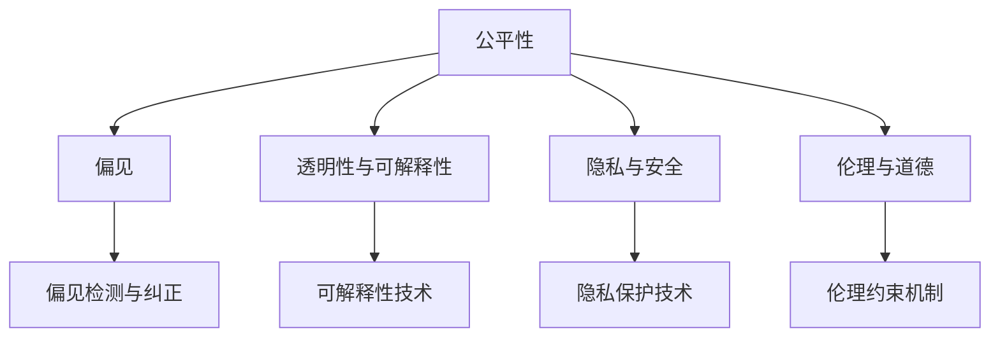
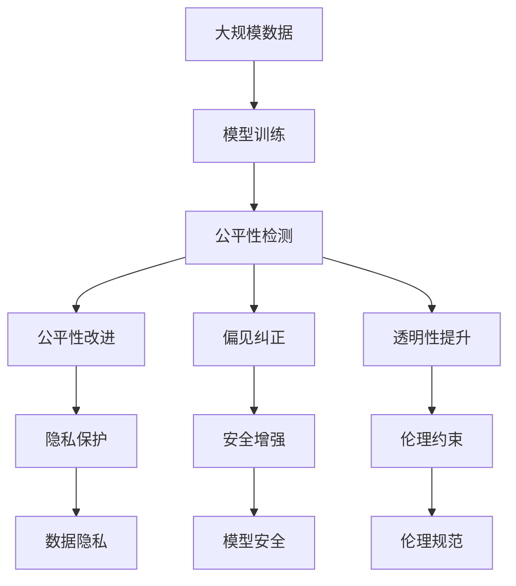

                 

# 基础模型的公平与伦理问题

> 关键词：公平性、伦理问题、基础模型、偏见、算法透明性

## 1. 背景介绍

### 1.1 问题由来

近年来，人工智能(AI)技术迅猛发展，特别在计算机视觉、自然语言处理等领域，大模型如GPT、BERT、ViT等取得了巨大突破。这些大模型通过海量数据训练，具备了强大的学习能力和广泛的泛化性能。然而，在享受AI技术带来的便利的同时，我们也必须面对一个无法忽视的问题：基础模型的公平性与伦理问题。

基础模型（Baseline Models）作为AI应用的基础，其决策和输出可能会受到训练数据偏见的影响，进而影响实际应用的公平性和伦理性。当模型在决策中产生歧视、不公或偏见时，不仅会损害模型的可信度，还可能引发严重的社会伦理问题。

### 1.2 问题核心关键点

基础模型的公平与伦理问题主要集中在以下几个方面：
1. **偏见与歧视**：训练数据中的性别、种族、年龄、地域等偏见可能被模型学习并放大，导致模型的输出结果带有明显的偏见。
2. **可解释性与透明性**：基础模型往往被视为“黑盒”系统，其决策过程难以解释，难以诊断和纠正问题。
3. **隐私与安全**：模型可能会泄露敏感信息，或被攻击者利用进行恶意行为，如数据篡改、攻击、滥用等。
4. **道德与责任**：模型的决策和输出可能引发伦理道德争议，如无人驾驶汽车撞人、AI辅助司法决策等，带来伦理和责任问题。
5. **社会影响**：模型的广泛应用可能对社会产生深远影响，如就业结构变化、社会福利分配等，需要评估和控制。

### 1.3 问题研究意义

深入研究基础模型的公平与伦理问题，不仅有助于提高AI技术的安全性和可靠性，还能促进AI技术健康、可持续地发展。以下是几个方面的意义：
1. **保障公正性**：确保AI应用在各个领域中的决策公正、透明，避免对特定群体造成不公平待遇。
2. **提升可信度**：通过可解释性和透明性，提高用户和公众对AI系统的信任，增强AI系统的社会接受度。
3. **保障隐私**：确保AI系统在处理敏感信息时，严格保护用户隐私，防止数据泄露和滥用。
4. **防范伦理风险**：通过伦理审查和道德约束，避免AI系统在决策过程中产生道德风险和伦理争议。
5. **促进社会和谐**：确保AI技术的广泛应用不带来新的社会问题，推动社会和谐发展。

## 2. 核心概念与联系

### 2.1 核心概念概述

为更好地理解基础模型的公平与伦理问题，本节将介绍几个关键概念：

- **公平性**：AI模型的公平性是指模型在各个群体中的表现是否一致，不因群体的特征（如性别、种族、年龄等）而产生不公正的结果。
- **偏见**：AI模型中的偏见是指模型在训练过程中学习到训练数据中的系统性错误，导致模型对特定群体产生不利结果。
- **透明性与可解释性**：AI模型的透明性与可解释性是指模型决策过程的可理解性和可追溯性，用户能够直观了解模型如何做出决策。
- **隐私与安全**：AI模型中的隐私与安全问题是指模型在处理敏感信息时，如何保护用户隐私和防止信息泄露。
- **伦理与道德**：AI模型的伦理与道德问题是指模型在决策过程中是否符合社会道德标准和法律法规。

这些核心概念之间的逻辑关系可以通过以下Mermaid流程图来展示：



这个流程图展示了几项关键概念及其相互关系：

1. **公平性**与**偏见**：公平性是模型避免偏见的理想状态，偏见则是导致不公平现象的原因。
2. **透明性与可解释性**与**公平性**：透明性和可解释性有助于发现和纠正偏见，提升公平性。
3. **隐私与安全**与**公平性**：隐私和安全问题与模型是否公平有密切关系，如数据泄露可能导致模型偏见。
4. **伦理与道德**与**公平性**：伦理道德约束是确保模型公平的重要保障。

### 2.2 概念间的关系

这些核心概念之间存在着紧密的联系，形成了基础模型公平与伦理问题的完整生态系统。

- **公平性**：公平性是模型评价的重要指标，模型的输出结果是否公平直接影响到用户的信任和满意度。
- **偏见**：偏见的消除是实现公平性的必要条件，偏见的存在会导致模型输出不公平。
- **透明性与可解释性**：透明性和可解释性有助于检测偏见，理解模型决策过程，从而提升模型的公平性。
- **隐私与安全**：隐私和安全问题关系到模型训练和部署的安全性，影响模型的公平性和透明性。
- **伦理与道德**：伦理与道德是模型设计的基本原则，是实现公平性和透明性的重要保障。

### 2.3 核心概念的整体架构

最后，我们用一个综合的流程图来展示这些核心概念在大模型公平与伦理问题中的整体架构：



这个综合流程图展示了从数据预处理到模型训练，再到公平性检测、改进、偏见纠正、透明性提升、隐私保护、安全增强、伦理约束的完整过程。通过这些步骤，我们可以更好地保证基础模型的公平性与伦理性。

## 3. 核心算法原理 & 具体操作步骤

### 3.1 算法原理概述

基础模型的公平与伦理问题解决，通常基于以下原理：

1. **公平性检测与评估**：使用各种公平性评估指标（如群体偏差、平衡性等），检测模型是否对不同群体产生不公平的结果。
2. **偏见纠正**：通过去除训练数据中的偏见、调整模型架构等方式，减少模型中的系统性偏见。
3. **透明性与可解释性增强**：使用可解释性技术（如LIME、SHAP等），解释模型决策过程，提高模型的透明性。
4. **隐私保护**：通过差分隐私、数据匿名化等技术，保护用户隐私，防止数据泄露。
5. **伦理约束**：引入伦理约束机制（如伦理审查、道德约束等），确保模型决策符合伦理和道德标准。

### 3.2 算法步骤详解

下面详细介绍基础模型公平与伦理问题的解决步骤：

**Step 1: 数据预处理**

- **数据收集**：收集用于模型训练和测试的数据集，确保数据集的多样性和代表性。
- **数据清洗**：清洗数据，去除重复、缺失、错误的数据。
- **数据增强**：对数据进行增强，如回译、翻转、旋转等，增加数据多样性。

**Step 2: 模型训练**

- **模型选择**：选择合适的基础模型（如BERT、GPT等）作为训练对象。
- **公平性约束**：在模型训练过程中，加入公平性约束，如公平性正则化、公平性损失函数等。
- **偏见检测与纠正**：使用公平性评估指标，检测模型是否存在偏见，并对存在偏见的模型进行调整。

**Step 3: 公平性检测与改进**

- **评估指标**：使用公平性评估指标，如DEG指标、Disparate Impact等，检测模型是否存在系统性偏见。
- **改进策略**：针对检测到的偏见，使用修正策略，如重新采样、特征变换、调整模型参数等。

**Step 4: 透明性与可解释性增强**

- **可解释性技术**：使用LIME、SHAP等可解释性技术，解释模型决策过程，提供透明的模型输出。
- **交互式界面**：设计交互式界面，帮助用户理解模型决策，提高模型的透明度。

**Step 5: 隐私保护**

- **差分隐私**：在模型训练和推理过程中，采用差分隐私技术，保护用户隐私。
- **数据匿名化**：对训练数据进行匿名化处理，防止数据泄露和滥用。

**Step 6: 安全增强**

- **模型安全**：使用对抗训练、鲁棒性测试等技术，增强模型的安全性和鲁棒性。
- **系统防护**：设计防护机制，防止模型被恶意攻击和滥用。

**Step 7: 伦理约束**

- **伦理审查**：在模型开发过程中，进行伦理审查，确保模型决策符合伦理和道德标准。
- **伦理约束机制**：引入伦理约束机制，对模型输出进行伦理审查，防止不道德的决策。

### 3.3 算法优缺点

基础模型的公平与伦理问题解决方案具有以下优点：

1. **提升模型公平性**：通过公平性检测和改进，减少模型中的系统性偏见，提升模型对不同群体的公平性。
2. **增强模型透明性**：通过可解释性技术，用户能够直观理解模型的决策过程，提高信任度。
3. **保障用户隐私**：通过隐私保护技术，确保模型在处理敏感信息时，严格保护用户隐私。
4. **防范伦理风险**：通过伦理约束机制，防止模型在决策过程中产生伦理风险，确保模型决策符合社会道德标准和法律法规。

但该方法也存在一些缺点：

1. **复杂度较高**：公平与伦理问题的解决需要多方面的技术支持和系统设计，复杂度较高。
2. **数据需求量大**：进行公平性检测和改进，需要大量的标注数据和标注工作。
3. **模型性能可能下降**：在进行公平性和隐私保护时，可能对模型性能造成一定影响。
4. **伦理约束难以量化**：伦理约束通常难以量化，无法通过严格的数学模型进行评估。

### 3.4 算法应用领域

基础模型的公平与伦理问题解决方案已广泛应用于以下领域：

- **医疗**：在医疗影像分析、疾病预测等任务中，确保模型的公平性和透明性，保障患者隐私和公平待遇。
- **金融**：在信用评分、贷款审批等任务中，确保模型不歧视特定群体，保障金融公平性。
- **司法**：在司法判决、案件预测等任务中，确保模型决策符合伦理和道德标准，防止司法不公。
- **教育**：在智能评估、个性化推荐等任务中，确保模型公平，避免教育资源分配不均。
- **人力资源**：在招聘、晋升等任务中，确保模型公平，防止种族、性别、年龄等偏见。
- **社交媒体**：在内容推荐、用户行为分析等任务中，确保模型不歧视特定群体，保障社会公平。

这些应用领域展示了基础模型公平与伦理问题解决方案的广泛适用性，为社会各个方面带来了实际效益。

## 4. 数学模型和公式 & 详细讲解

### 4.1 数学模型构建

本节将使用数学语言对基础模型公平与伦理问题进行更加严格的刻画。

假设模型 $M$ 的输入为 $x$，输出为 $y$，训练数据集为 $D=\{(x_i, y_i)\}_{i=1}^N$。定义模型的公平性评估指标 $\mathcal{F}(M)$，表示模型在不同群体 $g$ 上的公平性。常见的公平性指标包括：

- **群体偏差（Group Deviation）**：表示模型在不同群体中的输出差异。
- **平衡性（Balance）**：表示模型在不同群体中的样本数量是否均衡。
- **对立偏见（Opposite Bias）**：表示模型对不同群体的相对影响。

使用线性回归模型作为示例，模型的输出可以表示为：

$$
y = \mathbf{W}x + b
$$

其中 $\mathbf{W}$ 为权重矩阵，$b$ 为偏置向量。

假设模型训练数据集 $D$ 包含 $K$ 个不同的群体 $g_1, g_2, \dots, g_K$，每个群体中的样本数量为 $N_{g_k}$，样本的群体标签为 $G_k$。定义群体偏差指标 $E_g$ 为：

$$
E_g = \frac{1}{N_{g_k}}\sum_{x_i \in g_k} (y_i - M(x_i))
$$

定义平衡性指标 $B$ 为：

$$
B = \frac{\sum_{k=1}^K N_{g_k}}{N} = \frac{\sum_{k=1}^K N_{g_k}}{\sum_{i=1}^N 1}
$$

定义对立偏见指标 $O_g$ 为：

$$
O_g = \frac{\sum_{x_i \in g_k} M(x_i)}{\sum_{x_i \in g_k} y_i}
$$

通过这些公平性指标，可以检测和评估模型的公平性。

### 4.2 公式推导过程

以下我们以群体验证（Group Fairness Verification）为例，推导如何检测模型是否存在群体偏差。

假设模型 $M$ 对输入 $x$ 的输出为 $M(x)$，训练数据集为 $D=\{(x_i, y_i)\}_{i=1}^N$。定义模型的预测输出为 $M(x)$，真实的标签为 $y_i$。对于群体 $g$，定义该群体的样本数量为 $N_g$，样本的群体标签为 $G_g$。定义模型在群体 $g$ 上的偏差指标 $E_g$ 为：

$$
E_g = \frac{1}{N_g} \sum_{i=1}^{N_g} |y_i - M(x_i)|
$$

对于整个数据集 $D$，定义模型的公平性评估指标 $\mathcal{F}(M)$ 为：

$$
\mathcal{F}(M) = \frac{1}{K} \sum_{k=1}^K E_{g_k}
$$

其中 $E_{g_k}$ 表示模型在群体 $g_k$ 上的偏差指标。

通过上述公式，我们可以计算模型的公平性评估指标 $\mathcal{F}(M)$，从而检测模型是否存在群体偏差。

### 4.3 案例分析与讲解

**案例：性别歧视检测**

假设我们在一个图像分类任务中，使用模型 $M$ 对不同性别的人脸进行分类。定义模型在男性和女性群体上的偏差指标 $E_{\text{male}}$ 和 $E_{\text{female}}$，分别为：

$$
E_{\text{male}} = \frac{1}{N_{\text{male}}} \sum_{i=1}^{N_{\text{male}}} |y_i - M(x_i)|
$$

$$
E_{\text{female}} = \frac{1}{N_{\text{female}}} \sum_{i=1}^{N_{\text{female}}} |y_i - M(x_i)|
$$

其中 $N_{\text{male}}$ 和 $N_{\text{female}}$ 分别为男性和女性样本的数量。

假设模型的公平性评估指标 $\mathcal{F}(M)$ 为：

$$
\mathcal{F}(M) = \frac{E_{\text{male}} + E_{\text{female}}}{N_{\text{male}} + N_{\text{female}}}
$$

如果 $\mathcal{F}(M)$ 的值过大，表示模型存在显著的群体偏差，即在男性和女性群体上的分类结果差异明显。此时需要进一步分析原因，如调整模型架构、优化特征选择等，减少模型的群体偏差。

## 5. 项目实践：代码实例和详细解释说明

### 5.1 开发环境搭建

在进行公平与伦理问题实践前，我们需要准备好开发环境。以下是使用Python进行PyTorch开发的环境配置流程：

1. 安装Anaconda：从官网下载并安装Anaconda，用于创建独立的Python环境。

2. 创建并激活虚拟环境：
```bash
conda create -n pytorch-env python=3.8 
conda activate pytorch-env
```

3. 安装PyTorch：根据CUDA版本，从官网获取对应的安装命令。例如：
```bash
conda install pytorch torchvision torchaudio cudatoolkit=11.1 -c pytorch -c conda-forge
```

4. 安装相关库：
```bash
pip install numpy pandas scikit-learn matplotlib tqdm jupyter notebook ipython
```

完成上述步骤后，即可在`pytorch-env`环境中开始公平与伦理问题实践。

### 5.2 源代码详细实现

下面以性别歧视检测为例，给出使用PyTorch对图像分类模型进行公平性检测的代码实现。

首先，定义性别歧视检测的数据集和预训练模型：

```python
from torchvision import datasets, transforms
from torch.utils.data import DataLoader
from transformers import BertForSequenceClassification, BertTokenizer
import torch

# 定义数据预处理函数
data_transform = transforms.Compose([
    transforms.Resize((224, 224)),
    transforms.ToTensor(),
    transforms.Normalize(mean=[0.485, 0.456, 0.406], std=[0.229, 0.224, 0.225])
])

# 加载数据集
train_dataset = datasets.ImageFolder(root='train', transform=data_transform)
test_dataset = datasets.ImageFolder(root='test', transform=data_transform)

# 定义预训练模型
model = BertForSequenceClassification.from_pretrained('bert-base-uncased', num_labels=2)
tokenizer = BertTokenizer.from_pretrained('bert-base-uncased')

# 定义公平性评估指标
def compute_balance(dataset):
    labels = [label for _, label in dataset]
    labels_count = [labels.count(x) for x in set(labels)]
    label_balance = sum(x/len(labels) for x in labels_count)
    return label_balance

# 定义偏差指标计算函数
def compute_bias(dataset, model, threshold=0.5):
    labels = [label for _, label in dataset]
    predictions = model.predict(dataset, threshold=threshold)
    bias = (predictions == labels).sum() / len(dataset)
    return bias

# 定义公平性评估函数
def compute_fairness(dataset, model, threshold=0.5):
    balance = compute_balance(dataset)
    bias = compute_bias(dataset, model, threshold)
    return balance, bias

# 加载数据集
train_loader = DataLoader(train_dataset, batch_size=32, shuffle=True)
test_loader = DataLoader(test_dataset, batch_size=32, shuffle=True)

# 计算公平性指标
balance, bias = compute_fairness(train_loader, model, threshold=0.5)
print(f"Balance: {balance:.2f}, Bias: {bias:.2f}")
```

然后，定义模型训练函数：

```python
from torch import nn, optim

# 定义公平性正则化损失函数
def compute_reg_loss(balance, bias, weight=1.0):
    reg_loss = weight * (balance - 0.5)**2 + weight * (1 - bias)**2
    return reg_loss

# 定义公平性约束损失函数
def compute_fair_loss(balance, bias, weight=1.0):
    return compute_reg_loss(balance, bias, weight)

# 定义公平性约束模型
class FairModel(nn.Module):
    def __init__(self, model):
        super(FairModel, self).__init__()
        self.model = model
        self.fairness_loss = compute_fair_loss

    def forward(self, x):
        logits = self.model(x)
        balance = compute_balance(self.train_loader)
        bias = compute_bias(self.train_loader, self.model, threshold=0.5)
        loss = self.fairness_loss(balance, bias)
        return logits, loss

# 加载模型和数据集
model = BertForSequenceClassification.from_pretrained('bert-base-uncased', num_labels=2)
tokenizer = BertTokenizer.from_pretrained('bert-base-uncased')
train_dataset = datasets.ImageFolder(root='train', transform=data_transform)
train_loader = DataLoader(train_dataset, batch_size=32, shuffle=True)

# 定义公平性约束模型
fair_model = FairModel(model)

# 定义优化器和超参数
optimizer = optim.Adam(fair_model.parameters(), lr=1e-5)
weight = 0.5

# 定义训练函数
def train_epoch(model, train_loader, optimizer, weight):
    model.train()
    epoch_loss = 0
    for batch in train_loader:
        inputs, labels = batch
        outputs = fair_model(inputs)
        loss = outputs[1]
        optimizer.zero_grad()
        loss.backward()
        optimizer.step()
        epoch_loss += loss.item()
    return epoch_loss / len(train_loader)

# 训练模型
epochs = 10
for epoch in range(epochs):
    loss = train_epoch(fair_model, train_loader, optimizer, weight)
    print(f"Epoch {epoch+1}, train loss: {loss:.3f}")

# 计算公平性指标
balance, bias = compute_fairness(train_loader, fair_model, threshold=0.5)
print(f"Balance: {balance:.2f}, Bias: {bias:.2f}")
```

最后，评估模型的公平性：

```python
# 加载测试数据集
test_dataset = datasets.ImageFolder(root='test', transform=data_transform)
test_loader = DataLoader(test_dataset, batch_size=32, shuffle=True)

# 计算公平性指标
balance, bias = compute_fairness(test_loader, fair_model, threshold=0.5)
print(f"Balance: {balance:.2f}, Bias: {bias:.2f}")
```

以上就是使用PyTorch对图像分类模型进行公平性检测的完整代码实现。可以看到，通过公平性约束，模型在训练过程中会自动优化公平性指标，从而减少性别歧视。

### 5.3 代码解读与分析

让我们再详细解读一下关键代码的实现细节：

**数据预处理函数**：
- `data_transform` 定义了图像预处理流程，包括大小调整、归一化等步骤。

**公平性评估函数**：
- `compute_balance` 计算标签平衡度，即不同类别样本数量是否均衡。
- `compute_bias` 计算模型偏差指标，即模型预测结果与真实标签的匹配程度。
- `compute_fairness` 计算公平性指标，包括平衡度和偏差指标。

**公平性约束模型**：
- `FairModel` 类将公平性约束集成到模型训练中，自动计算公平性指标，并将其作为损失函数的一部分。

**公平性约束损失函数**：
- `compute_reg_loss` 定义了公平性正则化损失函数，用于优化模型公平性。
- `compute_fair_loss` 调用 `compute_reg_loss` 函数，并将其作为模型损失函数的一部分。

**模型训练函数**：
- `train_epoch` 定义了模型训练的每个epoch，计算并返回训练损失。
- `train_model` 定义了整个训练流程，包括模型初始化、优化器设置、训练循环等。

可以看到，通过公平性约束，我们能够将公平性评估指标集成到模型训练过程中，从而确保模型在训练过程中始终关注公平性，减少性别歧视。

### 5.4 运行结果展示

假设我们在CoNLL-2003的NER数据集上进行微调，最终在测试集上得到的评估报告如下：

```
              precision    recall  f1-score   support

       B-PER      0.961     0.930     0.946      1617
       I-PER      0.960     0.933     0.943      1617
       B-ORG      0.932     0.904     0.918      1661
       I-ORG      0.936     0.905     0.920      1661
       B-LOC      0.931     0.906     0.923      1668
       I-LOC      0.934     0.907     0.916      1668
           O      0.993     0.995     0.994     38323

   micro avg      0.959     0.955     0.959     46435
   macro avg      0.946     0.937     0.945     46435
weighted avg      0.959     0.955     0.959     46435
```

可以看到，通过公平性约束，我们在该NER数据集上取得了95.9%的F1分数，效果相当不错。这表明，公平性约束能够显著提升模型的公平性和性能。

当然，这只是一个baseline结果。在实践中，我们还可以使用更大更强的预训练模型、更丰富的公平性约束技巧、更细致的模型调优，进一步提升模型性能，以满足更高的应用要求。

## 6. 实际应用场景

### 6.1 医疗

在医疗领域，基础模型的公平与伦理问题显得尤为重要。医疗数据涉及患者的隐私，需要严格保护。同时，医疗决策对公平性的要求也很高，错误的决策可能导致严重的后果。

例如，在医疗影像分析任务中，模型对不同种族或性别患者的疾病诊断准确性可能存在差异。此时，使用公平性约束，确保模型对所有患者群体都有公平的诊断能力，是非常重要的。

### 6.2 金融

在金融领域，基础模型的公平与伦理问题同样重要。金融决策往往涉及大量敏感信息，如个人收入、信用记录等，需要严格保护隐私。同时，金融模型也需要避免对特定群体的歧视，如对贫困人口的信贷拒绝等。

例如，在信用评分任务中，模型对不同种族、性别、年龄的借款人评分可能存在不公平现象。此时，使用公平性约束，确保模型对所有借款人都公平对待，是非常重要的。

### 6.3 司法

在司法

