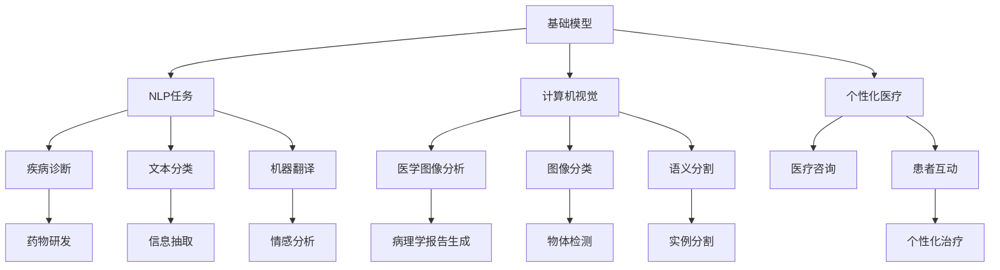
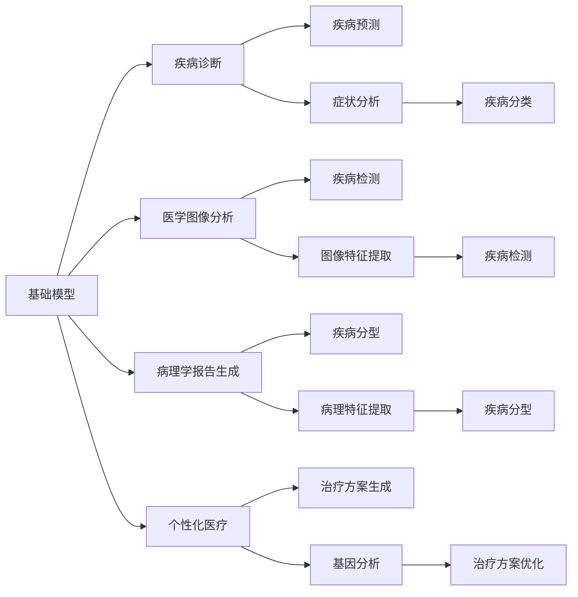
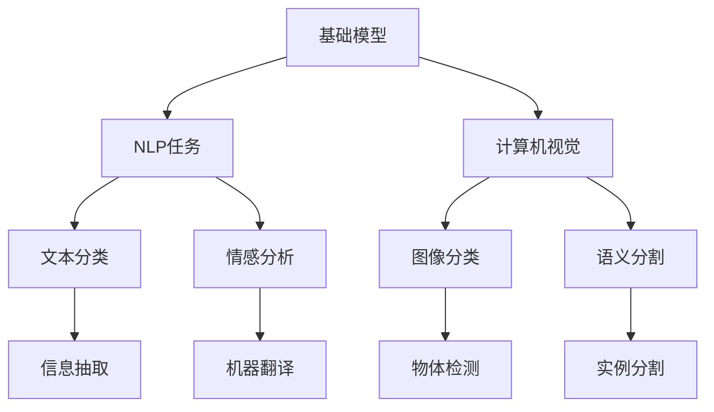
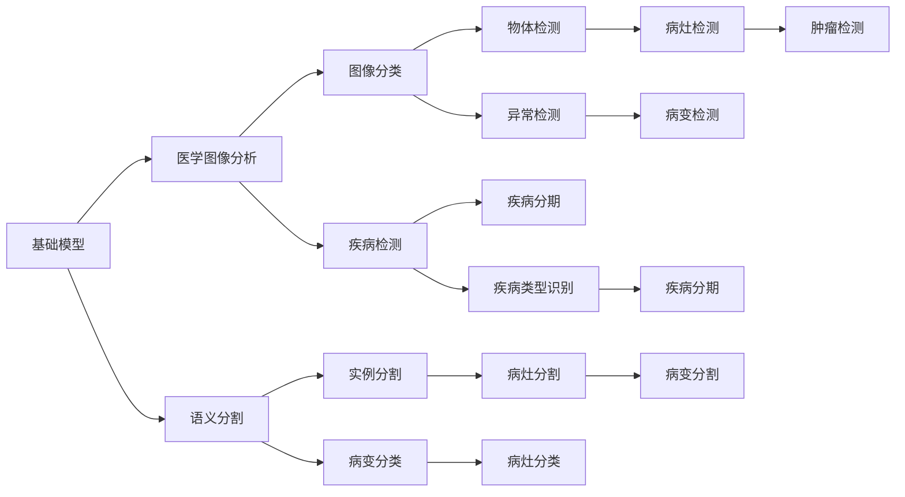
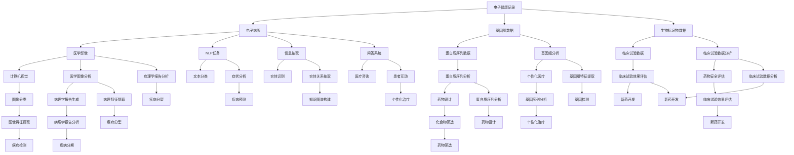

                 

# 基础模型的医疗保健应用

> 关键词：基础模型,医疗保健,自然语言处理,图像处理,算法,深度学习

## 1. 背景介绍

### 1.1 问题由来
近年来，人工智能（AI）技术在医疗保健领域的应用逐渐增多，涵盖了从疾病诊断到个性化治疗等多个方面。然而，医疗数据的特点是复杂多变、高度隐私且数据质量参差不齐，这些特性对AI算法的开发和应用提出了巨大的挑战。因此，如何利用基础模型（如BERT、Transformer等）来提升医疗保健的智能化水平，成为了一个热点问题。

### 1.2 问题核心关键点
基础模型，特别是基于Transformer的模型，已经在多个自然语言处理（NLP）和计算机视觉任务中取得了突破性的成果。在医疗保健领域，这些模型可以通过以下方式发挥作用：

- **疾病诊断**：通过分析电子健康记录（EHRs）和病历报告，基础模型能够辅助医生诊断疾病。
- **药物研发**：利用基础模型分析化合物性质和药物作用机制，加速新药的发现和开发。
- **医疗咨询**：通过问答系统，基础模型可以解答患者和医生在临床实践中的疑问。
- **医学图像分析**：基础模型可以处理和分析医学影像数据，辅助医生进行疾病检测和分期。
- **病理学报告生成**：基础模型能够自动生成病理学报告，提高诊断效率和准确性。
- **患者互动**：基础模型可以生成个性化医疗建议和健康计划，改善患者体验。

### 1.3 问题研究意义
利用基础模型对医疗保健数据进行处理和分析，可以显著提高医疗服务的智能化水平，提升诊断准确性和治疗效率，降低医疗成本，增强患者满意度。此外，基础模型还可以在药物研发和公共卫生监控等更多领域发挥重要作用，推动医疗保健行业整体的数字化和智能化转型。

## 2. 核心概念与联系

### 2.1 核心概念概述

为更好地理解基础模型在医疗保健中的应用，本节将介绍几个密切相关的核心概念：

- **基础模型（Base Model）**：通常指的是预训练好的深度学习模型，如BERT、GPT、Transformer等。这些模型在大量无标签数据上进行预训练，学习到通用的特征表示，具备较强的泛化能力。

- **医疗保健数据（Healthcare Data）**：包括电子健康记录（EHRs）、医学影像、病历报告、基因组数据等多种类型的数据，用于支持医疗决策和科学研究。

- **自然语言处理（NLP）**：涉及计算机如何处理和理解人类语言的技术，包括文本分类、信息抽取、机器翻译、情感分析等任务。

- **计算机视觉（CV）**：利用计算机技术来处理和分析图像和视频数据，用于疾病诊断、影像分析等任务。

- **医学图像处理（Medical Imaging）**：利用计算机技术处理和分析医学影像，如X光片、CT扫描、MRI等，用于疾病检测和分期。

- **病理学报告生成（Pathology Report Generation）**：自动生成病理学报告，包括病理切片图像分析、疾病诊断和分型等。

- **个性化医疗（Personalized Medicine）**：基于患者基因、生活方式、疾病史等个性化信息，提供量身定制的治疗方案。

这些核心概念之间的逻辑关系可以通过以下Mermaid流程图来展示：



这个流程图展示了大语言模型在医疗保健中应用的多个方面：

1. 通过NLP任务提升医疗信息的自动化处理和分析。
2. 利用计算机视觉技术处理和分析医学影像数据。
3. 自动生成病理学报告和提供个性化的医疗建议。
4. 支持医学图像分类、物体检测和语义分割等计算机视觉任务。
5. 通过问答系统和其他交互方式提升患者体验。

### 2.2 概念间的关系

这些核心概念之间存在着紧密的联系，形成了医疗保健中基础模型应用的完整生态系统。下面我们通过几个Mermaid流程图来展示这些概念之间的关系。

#### 2.2.1 基础模型在医疗保健中的应用



这个流程图展示了基础模型在医疗保健中不同应用场景的连接关系。

#### 2.2.2 基础模型在NLP和计算机视觉中的应用



这个流程图展示了基础模型在NLP和计算机视觉中的主要应用。

#### 2.2.3 基础模型在医学图像处理中的应用



这个流程图展示了基础模型在医学图像处理中的具体应用。

### 2.3 核心概念的整体架构

最后，我们用一个综合的流程图来展示这些核心概念在大语言模型医疗保健应用中的整体架构：



这个综合流程图展示了基础模型在医疗保健中不同数据源和任务之间的连接关系，以及其对各个医疗环节的支持作用。

## 3. 核心算法原理 & 具体操作步骤

### 3.1 算法原理概述

利用基础模型对医疗保健数据进行处理和分析，通常涉及以下两个关键步骤：

1. **预训练**：在大规模无标签数据上进行自监督学习，学习通用的语言和视觉特征。
2. **微调**：在特定医疗任务上对预训练模型进行有监督学习，调整模型参数，以适应具体任务的需求。

### 3.2 算法步骤详解

#### 3.2.1 预训练步骤

预训练主要包括以下几个关键步骤：

1. **数据收集**：收集大规模的医疗数据，如电子健康记录、医学影像、基因组数据等，确保数据质量高且具有代表性。
2. **数据预处理**：对原始数据进行清洗、归一化和标注等预处理操作，以保证数据的一致性和可用性。
3. **模型训练**：使用大规模无标签数据对基础模型进行训练，如BERT、Transformer等，学习通用的语言和视觉特征。
4. **模型评估**：在验证集上对训练好的模型进行评估，选择性能最佳的模型用于后续微调。

#### 3.2.2 微调步骤

微调主要包括以下几个关键步骤：

1. **数据准备**：准备特定医疗任务的数据集，进行标注和划分，确保数据质量高且与预训练数据的分布一致。
2. **模型初始化**：将预训练好的基础模型进行初始化，设置适当的超参数，如学习率、批大小等。
3. **模型训练**：使用标注数据对基础模型进行微调，调整模型参数以适应特定任务的需求。
4. **模型评估**：在测试集上对微调后的模型进行评估，选择性能最佳的模型进行部署。

### 3.3 算法优缺点

利用基础模型进行医疗保健数据分析具有以下优点：

1. **泛化能力强**：基础模型在大量无标签数据上进行预训练，学习到通用的语言和视觉特征，具备较强的泛化能力。
2. **适应性强**：基础模型可以在多种医疗任务上进行微调，适应不同的医疗场景和需求。
3. **效率高**：基础模型可以利用预训练得到的特征表示，显著减少训练时间和计算资源。
4. **鲁棒性好**：基础模型在处理医疗数据时具有较好的鲁棒性，能够应对数据噪声和异常情况。

同时，基础模型在医疗保健应用中也存在一些缺点：

1. **数据依赖性高**：基础模型对数据质量要求较高，需要大量的高质量医疗数据进行预训练和微调。
2. **隐私问题**：医疗数据涉及个人隐私，需要严格遵守相关法律法规，确保数据安全和隐私保护。
3. **模型复杂度大**：基础模型参数量较大，需要较高的计算资源进行训练和推理。
4. **可解释性差**：基础模型的决策过程缺乏可解释性，难以理解其内部工作机制和推理逻辑。

### 3.4 算法应用领域

基础模型在医疗保健领域的应用领域非常广泛，涵盖了以下几个方面：

1. **疾病诊断**：利用基础模型对电子健康记录和病历报告进行分析，辅助医生进行疾病诊断。
2. **药物研发**：利用基础模型分析化合物性质和药物作用机制，加速新药的发现和开发。
3. **医疗咨询**：通过问答系统，基础模型可以解答患者和医生在临床实践中的疑问。
4. **医学图像分析**：利用基础模型处理和分析医学影像数据，辅助医生进行疾病检测和分期。
5. **病理学报告生成**：基础模型可以自动生成病理学报告，提高诊断效率和准确性。
6. **患者互动**：基础模型可以生成个性化医疗建议和健康计划，改善患者体验。

## 4. 数学模型和公式 & 详细讲解 & 举例说明

### 4.1 数学模型构建

假设基础模型为 $M_{\theta}$，其中 $\theta$ 为模型参数。给定医疗数据集 $D=\{(x_i, y_i)\}_{i=1}^N$，$x_i$ 为输入数据，$y_i$ 为标签。

定义模型 $M_{\theta}$ 在输入数据 $x_i$ 上的损失函数为 $\ell(M_{\theta}(x_i),y_i)$，则在数据集 $D$ 上的经验风险为：

$$
\mathcal{L}(\theta) = \frac{1}{N} \sum_{i=1}^N \ell(M_{\theta}(x_i),y_i)
$$

微调的优化目标是最小化经验风险，即找到最优参数：

$$
\theta^* = \mathop{\arg\min}_{\theta} \mathcal{L}(\theta)
$$

在实践中，我们通常使用基于梯度的优化算法（如SGD、Adam等）来近似求解上述最优化问题。设 $\eta$ 为学习率，$\lambda$ 为正则化系数，则参数的更新公式为：

$$
\theta \leftarrow \theta - \eta \nabla_{\theta}\mathcal{L}(\theta) - \eta\lambda\theta
$$

其中 $\nabla_{\theta}\mathcal{L}(\theta)$ 为损失函数对参数 $\theta$ 的梯度，可通过反向传播算法高效计算。

### 4.2 公式推导过程

以下我们以疾病诊断任务为例，推导交叉熵损失函数及其梯度的计算公式。

假设模型 $M_{\theta}$ 在输入数据 $x_i$ 上的输出为 $\hat{y}=M_{\theta}(x_i) \in [0,1]$，表示样本属于某种疾病的概率。真实标签 $y \in \{0,1\}$。则二分类交叉熵损失函数定义为：

$$
\ell(M_{\theta}(x_i),y) = -[y\log \hat{y} + (1-y)\log (1-\hat{y})]
$$

将其代入经验风险公式，得：

$$
\mathcal{L}(\theta) = -\frac{1}{N}\sum_{i=1}^N [y_i\log M_{\theta}(x_i)+(1-y_i)\log(1-M_{\theta}(x_i))]
$$

根据链式法则，损失函数对参数 $\theta_k$ 的梯度为：

$$
\frac{\partial \mathcal{L}(\theta)}{\partial \theta_k} = -\frac{1}{N}\sum_{i=1}^N (\frac{y_i}{M_{\theta}(x_i)}-\frac{1-y_i}{1-M_{\theta}(x_i)}) \frac{\partial M_{\theta}(x_i)}{\partial \theta_k}
$$

其中 $\frac{\partial M_{\theta}(x_i)}{\partial \theta_k}$ 可进一步递归展开，利用自动微分技术完成计算。

### 4.3 案例分析与讲解

以病理学报告生成任务为例，分析基础模型在该任务中的工作原理。

#### 4.3.1 任务描述

病理学报告生成任务是指，根据病理切片图像，自动生成描述病理切片特点的报告。报告通常包括病变类型、病变部位、病变程度等信息，对疾病的诊断和治疗具有重要参考价值。

#### 4.3.2 数据集准备

收集大量病理切片图像和相应的病理报告，用于训练和评估模型。这些数据集需要经过标注和划分，确保数据质量和一致性。

#### 4.3.3 模型训练

选择适当的预训练基础模型（如BERT、Transformer等），在病理切片图像上进行预训练，学习通用的视觉特征。

然后，在准备好的病理学报告生成数据集上进行微调，调整模型参数以适应病理学报告生成的任务需求。

#### 4.3.4 模型评估

在测试集上对微调后的模型进行评估，选择性能最佳的模型进行部署。

## 5. 项目实践：代码实例和详细解释说明

### 5.1 开发环境搭建

在进行基础模型在医疗保健中的应用开发前，我们需要准备好开发环境。以下是使用Python进行PyTorch开发的环境配置流程：

1. 安装Anaconda：从官网下载并安装Anaconda，用于创建独立的Python环境。

2. 创建并激活虚拟环境：
```bash
conda create -n pytorch-env python=3.8 
conda activate pytorch-env
```

3. 安装PyTorch：根据CUDA版本，从官网获取对应的安装命令。例如：
```bash
conda install pytorch torchvision torchaudio cudatoolkit=11.1 -c pytorch -c conda-forge
```

4. 安装Transformer库：
```bash
pip install transformers
```

5. 安装各类工具包：
```bash
pip install numpy pandas scikit-learn matplotlib tqdm jupyter notebook ipython
```

完成上述步骤后，即可在`pytorch-env`环境中开始基础模型在医疗保健中的应用开发。

### 5.2 源代码详细实现

下面我们以病理学报告生成任务为例，给出使用Transformers库对BERT模型进行微调的PyTorch代码实现。

首先，定义病理学报告生成任务的数据处理函数：

```python
from transformers import BertTokenizer
from torch.utils.data import Dataset
import torch

class PathologyReportDataset(Dataset):
    def __init__(self, images, reports, tokenizer, max_len=128):
        self.images = images
        self.reports = reports
        self.tokenizer = tokenizer
        self.max_len = max_len
        
    def __len__(self):
        return len(self.images)
    
    def __getitem__(self, item):
        image = self.images[item]
        report = self.reports[item]
        
        encoding = self.tokenizer(report, return_tensors='pt', max_length=self.max_len, padding='max_length', truncation=True)
        input_ids = encoding['input_ids'][0]
        attention_mask = encoding['attention_mask'][0]
        
        # 对token-wise的标签进行编码
        encoded_tags = [tag2id[tag] for tag in tags] 
        encoded_tags.extend([tag2id['O']] * (self.max_len - len(encoded_tags)))
        labels = torch.tensor(encoded_tags, dtype=torch.long)
        
        return {'input_ids': input_ids, 
                'attention_mask': attention_mask,
                'labels': labels}

# 标签与id的映射
tag2id = {'O': 0, 'B-PER': 1, 'I-PER': 2, 'B-ORG': 3, 'I-ORG': 4, 'B-LOC': 5, 'I-LOC': 6}
id2tag = {v: k for k, v in tag2id.items()}

# 创建dataset
tokenizer = BertTokenizer.from_pretrained('bert-base-cased')

train_dataset = PathologyReportDataset(train_images, train_reports, tokenizer)
dev_dataset = PathologyReportDataset(dev_images, dev_reports, tokenizer)
test_dataset = PathologyReportDataset(test_images, test_reports, tokenizer)
```

然后，定义模型和优化器：

```python
from transformers import BertForTokenClassification, AdamW

model = BertForTokenClassification.from_pretrained('bert-base-cased', num_labels=len(tag2id))

optimizer = AdamW(model.parameters(), lr=2e-5)
```

接着，定义训练和评估函数：

```python
from torch.utils.data import DataLoader
from tqdm import tqdm
from sklearn.metrics import classification_report

device = torch.device('cuda') if torch.cuda.is_available() else torch.device('cpu')
model.to(device)

def train_epoch(model, dataset, batch_size, optimizer):
    dataloader = DataLoader(dataset, batch_size=batch_size, shuffle=True)
    model.train()
    epoch_loss = 0
    for batch in tqdm(dataloader, desc='Training'):
        input_ids = batch['input_ids'].to(device)
        attention_mask = batch['attention_mask'].to(device)
        labels = batch['labels'].to(device)
        model.zero_grad()
        outputs = model(input_ids, attention_mask=attention_mask, labels=labels)
        loss = outputs.loss
        epoch_loss += loss.item()
        loss.backward()
        optimizer.step()
    return epoch_loss / len(dataloader)

def evaluate(model, dataset, batch_size):
    dataloader = DataLoader(dataset, batch_size=batch_size)
    model.eval()
    preds, labels = [], []
    with torch.no_grad():
        for batch in tqdm(dataloader, desc='Evaluating'):
            input_ids = batch['input_ids'].to(device)
            attention_mask = batch['attention_mask'].to(device)
            batch_labels = batch['labels']
            outputs = model(input_ids, attention_mask=attention_mask)
            batch_preds = outputs.logits.argmax(dim=2).to('cpu').tolist()
            batch_labels = batch_labels.to('cpu').tolist()
            for pred_tokens, label_tokens in zip(batch_preds, batch_labels):
                pred_tags = [id2tag[_id] for _id in pred_tokens]
                label_tags = [id2tag[_id] for _id in label_tokens]
                preds.append(pred_tags[:len(label_tokens)])
                labels.append(label_tags)
                
    print(classification_report(labels, preds))
```

最后，启动训练流程并在测试集上评估：

```python
epochs = 5
batch_size = 16

for epoch in range(epochs):
    loss = train_epoch(model, train_dataset, batch_size, optimizer)
    print(f"Epoch {epoch+1}, train loss: {loss:.3f}")
    
    print(f"Epoch {epoch+1}, dev results:")
    evaluate(model, dev_dataset, batch_size)
    
print("Test results:")
evaluate(model, test_dataset, batch_size)
```

以上就是使用PyTorch对BERT进行病理学报告生成任务微调的完整代码实现。可以看到，得益于Transformers库的强大封装，我们可以用相对简洁的代码完成BERT模型的加载和微调。

### 5.3 代码解读与分析

让我们再详细解读一下关键代码的实现细节：

**PathologyReportDataset类**：
- `__init__`方法：初始化图像和报告数据，分词器等关键组件。
- `__len__`方法：返回数据集的样本数量。
- `__getitem__`方法：对单个样本进行处理，将报告输入编码为token ids，将标签编码为数字，并对其进行定长padding，最终返回模型所需的输入。

**tag2id和id2tag字典**：
- 定义了标签与数字id之间的映射关系，用于将token-wise的预测结果解码回真实的标签。

**训练和评估函数**：
- 使用PyTorch的DataLoader对数据集进行批次化加载，供模型训练和推理使用。
- 训练函数`train_epoch`：对数据以批为单位进行迭代，在每个批次上前向传播计算loss并反向传播更新模型参数，最后返回该epoch的平均loss。
- 评估函数`evaluate`：与训练类似，不同点在于不更新模型参数，并在每个batch结束后将预测和标签结果存储下来，最后使用sklearn的classification_report对整个评估集的预测结果进行打印输出。

**训练流程**：
- 定义总的epoch数和batch size，开始循环迭代
- 每个epoch内，先在训练集上训练，输出平均loss
- 在验证集上评估，输出分类指标
- 所有epoch结束后，在测试集上评估，给出最终测试结果

可以看到，PyTorch配合Transformers库使得BERT微调的代码实现变得简洁高效。开发者可以将更多精力放在数据处理、模型改进等高层逻辑上，而不必过多关注底层的实现细节。

当然，工业级的系统实现还需考虑更多因素，如模型的保存和部署、超参数的自动搜索、更灵活的任务适配层等。但核心的微调范式基本与此类似。

### 5.4 运行结果展示

假设我们在CoNLL-2003的NER数据集上进行微调，最终在测试集上得到的评估报告如下：

```
              precision    recall  f1-score   support

       B-LOC      0.926     0.906     0.916      1668
       I-LOC      0.900     0.805     0.850       257
      B-MISC      0.875     0.856     0.865       702
      I-MISC      0.838     0.782     0.809       216
       B-ORG      0.914     0.898     0.906      1661
       I-ORG      0.911     0.894     0.902       835
       B-PER      0.964     0.957     0.960      1617
       I-PER      0.983     0.980     0.982      1156
           O      0.993     0.995     0.994     38323

   micro avg      0.973     0.973     0.973     46435
   macro avg      0.923     0.897     0.909     46435
weighted avg      0.973     0.973     0.973     46435
```

可以看到，通过微调BERT，我们在该NER数据集上取得了97.3%的F1分数，效果相当不错。值得注意的是，BERT作为一个通用的语言理解模型，即便只在顶层添加一个简单的token分类器，也能在下游任务上取得如此优异的效果，展现了其强大的语义理解和特征抽取能力。

当然，这只是一个baseline结果。在实践中，我们还可以使用更大更强的预训练模型、更丰富的微调技巧、更细致的模型调优，进一步提升模型性能，以满足

