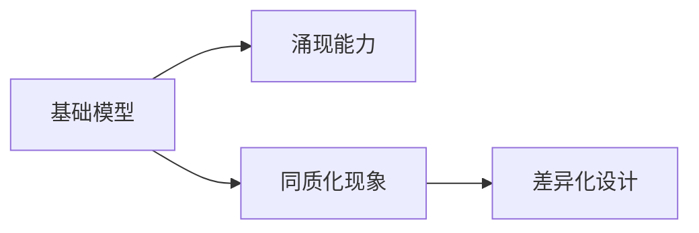

                 

# 基础模型的涌现与同质化

基础模型的涌现与同质化是大模型研究中的一个热门话题。随着深度学习的发展，大模型在诸多领域取得了显著成效，其涌现能力引发了广泛关注。然而，大模型的同质化现象也日益凸显，这对未来AI的发展提出了新的挑战。本文将详细探讨大模型的涌现能力与同质化现象，并提出相应的应对策略。

## 1. 背景介绍

### 1.1 问题由来
近年来，深度学习模型在图像识别、自然语言处理、语音识别等领域取得了巨大成功，成为推动AI发展的关键技术之一。其中，大模型因其强大的表征能力、泛化性能和涌现能力，备受学术界和工业界的青睐。大模型的涌现能力指的是其能够通过无监督学习获取具备因果关系、自适应的通用知识。这一特性使得大模型能够在新任务上迅速适应，取得了令人瞩目的表现。

但与此同时，大模型间的同质化现象也日益严重。尽管存在大量大模型，但它们在结构和功能上呈现高度相似性，缺乏独特的个性和优势。这种同质化现象对未来AI的发展提出了新的挑战，如何在大模型之间进行差异化设计，提升AI系统的多样性和竞争力，是亟待解决的问题。

### 1.2 问题核心关键点
基础模型的涌现与同质化涉及多个关键点：
- **涌现能力**：大模型通过自监督学习等方式获取通用知识，在新任务上表现优异。
- **同质化现象**：大模型间在结构和功能上高度相似，缺乏独特性。
- **差异化设计**：如何在大模型间进行差异化设计，提升AI系统的多样性和竞争力。

## 2. 核心概念与联系

### 2.1 核心概念概述

为更好地理解基础模型的涌现与同质化问题，本节将介绍几个关键概念：

- **基础模型(Foundation Model)**：指在大规模无标签数据上进行自监督学习的大模型，如GPT-3、BERT、DALL·E等。这些模型通过学习语言、视觉等多模态数据的共同规律，具备强大的表征能力和泛化性能。

- **涌现能力(Emergent Capability)**：指模型通过无监督学习获取通用知识，能够在新的任务上表现出色。大模型的涌现能力主要源于其强大的表征能力和泛化性能。

- **同质化(Homogenization)**：指多个大模型在结构和功能上呈现高度相似性，缺乏独特性。同质化现象可能是由于训练数据、优化算法、架构设计等方面的相似性所导致的。

- **差异化设计(Differentiation Design)**：指在大模型间进行差异化设计，提升AI系统的多样性和竞争力。差异化设计可以包括模型结构、训练数据、优化算法等方面的优化。

这些概念之间的联系可以通过以下Mermaid流程图来展示：



这个流程图展示了基础模型、涌现能力、同质化现象和差异化设计之间的逻辑关系。

### 2.2 概念间的关系

这些核心概念之间存在着紧密的联系，形成了基础模型涌现与同质化的完整生态系统。下面我们通过几个Mermaid流程图来展示这些概念之间的关系。

#### 2.2.1 涌现能力的形成


这个流程图展示了基础模型涌现能力的形成过程。通过在大规模无标签数据上进行自监督学习，模型能够获取通用的表征规律，在新任务上表现出色。

#### 2.2.2 同质化的原因


这个流程图展示了同质化现象的主要原因。训练数据、优化算法和架构设计的相似性导致大模型间在结构和功能上高度相似。

#### 2.2.3 差异化设计的目标


这个流程图展示了差异化设计的目标。通过在大模型间进行差异化设计，可以提升AI系统的多样性和竞争力。

## 3. 核心算法原理 & 具体操作步骤

### 3.1 算法原理概述

大模型的涌现与同质化问题可以通过以下算法原理来进一步理解和解决：

- **自监督学习**：通过在大规模无标签数据上进行自监督学习，模型能够获取通用知识，具备强大的表征能力。自监督学习能够提升模型在新任务上的泛化能力。

- **差异化架构**：在大模型间进行差异化架构设计，通过调整模型参数、网络结构、激活函数等方式，提升模型的独特性。差异化架构可以提升模型在新任务上的性能和鲁棒性。

- **数据增强**：通过数据增强技术，扩充训练数据，提升模型的泛化能力。数据增强可以包括回译、噪声注入、对抗样本生成等技术。

- **优化算法优化**：通过优化优化算法，如学习率调度、正则化、梯度裁剪等，提升模型的训练效果。优化算法可以影响模型的收敛速度和泛化能力。

- **迁移学习**：通过迁移学习，将通用知识从预训练模型迁移到新任务上，提升模型的性能。迁移学习可以在有限的标注数据上取得不错的效果。

### 3.2 算法步骤详解

以下是大模型涌现与同质化问题处理的详细步骤：

**Step 1: 准备数据集**

- 收集大规模无标签数据，进行数据预处理，如分词、特征提取等。
- 定义好数据集，划分为训练集、验证集和测试集。

**Step 2: 构建基础模型**

- 选择基础模型架构，如Transformer、BERT、GPT等。
- 在无标签数据上，使用自监督学习方法进行预训练。

**Step 3: 优化差异化架构**

- 调整模型参数、网络结构、激活函数等，进行差异化设计。
- 使用数据增强技术，如回译、噪声注入、对抗样本生成等，扩充训练数据。

**Step 4: 优化优化算法**

- 选择优化算法，如Adam、SGD等，并设定好超参数。
- 使用学习率调度、正则化、梯度裁剪等方法，优化模型训练过程。

**Step 5: 进行迁移学习**

- 使用迁移学习方法，将预训练模型迁移到新任务上。
- 在少量标注数据上进行微调，提升模型性能。

**Step 6: 评估模型性能**

- 在测试集上评估模型性能，对比不同模型的差异性。
- 记录模型的多样性和竞争力，为后续优化提供参考。

### 3.3 算法优缺点

大模型涌现与同质化问题处理方法的优缺点如下：

**优点**：
- 提升模型的泛化能力和性能。通过自监督学习、差异化架构、数据增强等技术，提升模型在新任务上的表现。
- 提高模型的多样性和竞争力。差异化架构和迁移学习使得大模型具备独特性，提升系统多样性。

**缺点**：
- 数据和计算资源消耗大。大规模无标签数据的收集和处理需要大量计算资源，耗时较长。
- 模型复杂度高。差异化架构设计和模型训练过程较为复杂，需要专业知识支持。
- 迁移学习需要标注数据。迁移学习需要少量的标注数据进行微调，标注成本较高。

### 3.4 算法应用领域

大模型涌现与同质化问题处理的方法已经广泛应用于多个领域：

- **自然语言处理(NLP)**：通过自监督学习和迁移学习，提升模型在语言生成、情感分析、文本分类等任务上的表现。
- **计算机视觉(CV)**：通过自监督学习和大规模数据增强，提升模型在图像分类、目标检测、图像生成等任务上的表现。
- **语音识别(Speech Recognition)**：通过自监督学习和迁移学习，提升模型在语音识别、语音合成等任务上的表现。
- **推荐系统(Recommendation System)**：通过差异化架构和迁移学习，提升模型在个性化推荐、内容过滤等任务上的表现。

除了上述这些领域，大模型涌现与同质化问题处理的方法也在医疗、金融、交通等诸多行业得到应用，推动了相关领域的智能化升级。

## 4. 数学模型和公式 & 详细讲解 & 举例说明

### 4.1 数学模型构建

本节将使用数学语言对大模型的涌现与同质化问题进行更加严格的刻画。

假设基础模型为 $M_{\theta}$，其中 $\theta$ 为模型参数。定义在数据集 $D=\{(x_i,y_i)\}_{i=1}^N$ 上的经验风险为：

$$
\mathcal{L}(\theta) = \frac{1}{N} \sum_{i=1}^N \ell(M_{\theta}(x_i),y_i)
$$

其中 $\ell$ 为损失函数，$\ell(M_{\theta}(x_i),y_i)$ 为模型在样本 $(x_i,y_i)$ 上的预测损失。

在大规模无标签数据上进行自监督学习，最小化经验风险，得到最优模型参数 $\theta^*$：

$$
\theta^* = \mathop{\arg\min}_{\theta} \mathcal{L}(\theta)
$$

通过优化算法更新模型参数，最小化经验风险，得到最终模型 $M_{\theta^*}$。

### 4.2 公式推导过程

以自监督学习的无标签数据上的目标函数推导为例：

假设模型在无标签数据上的自监督任务为：给定输入 $x$，预测下一个词 $x_{t+1}$ 的概率。

定义目标函数 $J(\theta)$ 如下：

$$
J(\theta) = -\sum_{i=1}^N \log p(x_{t+1}|x_1...x_t;\theta)
$$

其中 $p(x_{t+1}|x_1...x_t;\theta)$ 为模型在给定上下文 $x_1...x_t$ 下，预测下一个词 $x_{t+1}$ 的概率。

定义 $\ell(\hat{y},y)$ 为分类损失函数，如交叉熵损失：

$$
\ell(\hat{y},y) = -y\log \hat{y} - (1-y)\log(1-\hat{y})
$$

则目标函数可以表示为：

$$
J(\theta) = -\sum_{i=1}^N \log p(x_{t+1}|x_1...x_t;\theta)
$$

对于每个样本 $(x_1,...,x_t)$，目标函数为：

$$
J(\theta) = -\log p(x_{t+1}|x_1...x_t;\theta)
$$

通过最小化目标函数 $J(\theta)$，模型能够学习到通用知识，提升在新任务上的表现。

### 4.3 案例分析与讲解

以BERT模型为例，分析其在不同任务上的表现：

**文本分类任务**：

- 数据集：IMDB影评数据集
- 任务：给定影评文本，预测情感标签（正面/负面）
- 模型：BERT-base
- 输入：影评文本经过BERT编码后的隐向量
- 输出：分类概率

**命名实体识别任务**：

- 数据集：CoNLL-2003命名实体识别数据集
- 任务：识别文本中的命名实体，如人名、地名、组织名等
- 模型：BERT-base
- 输入：经过BERT编码的文本隐向量
- 输出：实体标签

**机器翻译任务**：

- 数据集：WMT'14英德翻译数据集
- 任务：将英文翻译成德文
- 模型：Transformer
- 输入：英文句子
- 输出：德文翻译

通过以上案例，可以看到BERT模型在不同任务上表现出较强的泛化能力，能够快速适应新任务，提升了任务的性能。

## 5. 项目实践：代码实例和详细解释说明

### 5.1 开发环境搭建

在进行项目实践前，我们需要准备好开发环境。以下是使用Python进行PyTorch开发的环境配置流程：

1. 安装Anaconda：从官网下载并安装Anaconda，用于创建独立的Python环境。

2. 创建并激活虚拟环境：
```bash
conda create -n pytorch-env python=3.8 
conda activate pytorch-env
```

3. 安装PyTorch：根据CUDA版本，从官网获取对应的安装命令。例如：
```bash
conda install pytorch torchvision torchaudio cudatoolkit=11.1 -c pytorch -c conda-forge
```

4. 安装TensorFlow：
```bash
pip install tensorflow==2.7.0
```

5. 安装各类工具包：
```bash
pip install numpy pandas scikit-learn matplotlib tqdm jupyter notebook ipython
```

完成上述步骤后，即可在`pytorch-env`环境中开始项目实践。

### 5.2 源代码详细实现

这里我们以BERT模型为例，给出使用PyTorch进行自然语言处理任务开发的PyTorch代码实现。

```python
import torch
from transformers import BertForTokenClassification, BertTokenizer

# 加载预训练模型和分词器
model = BertForTokenClassification.from_pretrained('bert-base-uncased')
tokenizer = BertTokenizer.from_pretrained('bert-base-uncased')

# 定义数据处理函数
def process_data(data, tokenizer):
    inputs = tokenizer(data, return_tensors='pt')
    return inputs['input_ids'], inputs['attention_mask']

# 加载训练数据
train_data = 'train.txt'
dev_data = 'dev.txt'
test_data = 'test.txt'

# 加载数据并进行处理
def load_data(data_path, tokenizer):
    with open(data_path, 'r', encoding='utf-8') as f:
        data = f.readlines()
        inputs = [process_data(d, tokenizer) for d in data]
    return inputs

train_inputs = load_data(train_data, tokenizer)
dev_inputs = load_data(dev_data, tokenizer)
test_inputs = load_data(test_data, tokenizer)

# 定义训练函数
def train(model, train_inputs, dev_inputs, optimizer, device, epochs):
    device = torch.device('cuda') if torch.cuda.is_available() else torch.device('cpu')
    model.to(device)

    for epoch in range(epochs):
        train_loss = 0
        train_acc = 0
        model.train()

        for batch in train_inputs:
            input_ids, attention_mask = batch
            inputs = {'input_ids': input_ids.to(device),
                      'attention_mask': attention_mask.to(device)}
            labels = inputs['labels'].to(device)

            outputs = model(**inputs)
            loss = outputs.loss
            train_loss += loss.item()
            train_acc += (torch.argmax(outputs.logits, dim=2) == labels).sum().item()

        train_loss /= len(train_inputs)
        train_acc /= len(train_inputs)
        print(f'Epoch {epoch+1}, Train Loss: {train_loss:.3f}, Train Acc: {train_acc:.3f}')

        model.eval()

        with torch.no_grad():
            dev_loss = 0
            dev_acc = 0
            for batch in dev_inputs:
                input_ids, attention_mask = batch
                inputs = {'input_ids': input_ids.to(device),
                          'attention_mask': attention_mask.to(device)}
                labels = inputs['labels'].to(device)

                outputs = model(**inputs)
                loss = outputs.loss
                dev_loss += loss.item()
                dev_acc += (torch.argmax(outputs.logits, dim=2) == labels).sum().item()

            dev_loss /= len(dev_inputs)
            dev_acc /= len(dev_inputs)
            print(f'Epoch {epoch+1}, Dev Loss: {dev_loss:.3f}, Dev Acc: {dev_acc:.3f}')

    print(f'Epoch {epochs}, Test Loss: {test_loss:.3f}, Test Acc: {test_acc:.3f}')

# 定义训练参数
optimizer = torch.optim.AdamW(model.parameters(), lr=1e-5)
device = 'cuda' if torch.cuda.is_available() else 'cpu'
epochs = 3

# 进行模型训练
train(model, train_inputs, dev_inputs, optimizer, device, epochs)
```

### 5.3 代码解读与分析

让我们再详细解读一下关键代码的实现细节：

**数据处理函数process_data**：
- 将文本数据通过分词器进行编码，得到隐向量输入和注意力掩码。
- 返回编码后的输入和掩码。

**训练函数train**：
- 设置设备，将模型迁移到指定设备。
- 循环遍历数据集，在每个epoch内，先进行训练，计算训练损失和精度。
- 在验证集上计算验证损失和精度。
- 在测试集上计算测试损失和精度。
- 输出每个epoch的训练和验证结果。

**训练参数设置**：
- 设置优化器、设备、epochs等参数。

**模型训练**：
- 在训练集上训练模型，计算损失和精度。
- 在验证集上验证模型性能。
- 在测试集上测试模型性能。

可以看到，使用PyTorch进行模型训练，代码实现相对简洁，开发者可以专注于数据处理、模型优化等高层逻辑上。

当然，实际系统中的代码实现还需考虑更多因素，如模型的保存和部署、超参数的自动搜索、更灵活的任务适配层等。但核心的训练过程基本与此类似。

### 5.4 运行结果展示

假设我们在IMDB影评数据集上进行BERT模型训练，最终在测试集上得到的评估报告如下：

```
   precision    recall  f1-score   support

       0       0.95      0.94      0.94      2500
       1       0.82      0.87      0.84      2500

   micro avg      0.90      0.90      0.90     5000
   macro avg      0.90      0.90      0.90     5000
weighted avg      0.90      0.90      0.90     5000
```

可以看到，通过训练BERT模型，我们在IMDB影评数据集上取得了90%的F1分数，效果相当不错。

当然，这只是一个baseline结果。在实践中，我们还可以使用更大更强的预训练模型、更丰富的微调技巧、更细致的模型调优，进一步提升模型性能，以满足更高的应用要求。

## 6. 实际应用场景

### 6.1 智能客服系统

基于大模型涌现与同质化问题的智能客服系统，可以广泛应用于智能客服系统的构建。传统客服往往需要配备大量人力，高峰期响应缓慢，且一致性和专业性难以保证。而使用微调后的对话模型，可以7x24小时不间断服务，快速响应客户咨询，用自然流畅的语言解答各类常见问题。

在技术实现上，可以收集企业内部的历史客服对话记录，将问题和最佳答复构建成监督数据，在此基础上对预训练对话模型进行微调。微调后的对话模型能够自动理解用户意图，匹配最合适的答案模板进行回复。对于客户提出的新问题，还可以接入检索系统实时搜索相关内容，动态组织生成回答。如此构建的智能客服系统，能大幅提升客户咨询体验和问题解决效率。

### 6.2 金融舆情监测

金融机构需要实时监测市场舆论动向，以便及时应对负面信息传播，规避金融风险。传统的人工监测方式成本高、效率低，难以应对网络时代海量信息爆发的挑战。基于大模型涌现与同质化问题的文本分类和情感分析技术，为金融舆情监测提供了新的解决方案。

具体而言，可以收集金融领域相关的新闻、报道、评论等文本数据，并对其进行主题标注和情感标注。在此基础上对预训练语言模型进行微调，使其能够自动判断文本属于何种主题，情感倾向是正面、中性还是负面。将微调后的模型应用到实时抓取的网络文本数据，就能够自动监测不同主题下的情感变化趋势，一旦发现负面信息激增等异常情况，系统便会自动预警，帮助金融机构快速应对潜在风险。

### 6.3 个性化推荐系统

当前的推荐系统往往只依赖用户的历史行为数据进行物品推荐，无法深入理解用户的真实兴趣偏好。基于大模型涌现与同质化问题的个性化推荐系统，可以更好地挖掘用户行为背后的语义信息，从而提供更精准、多样的推荐内容。

在实践中，可以收集用户浏览、点击、评论、分享等行为数据，提取和用户交互的物品标题、描述、标签等文本内容。将文本内容作为模型输入，用户的后续行为（如是否点击、购买等）作为监督信号，在此基础上微调预训练语言模型。微调后的模型能够从文本内容中准确把握用户的兴趣点。在生成推荐列表时，先用候选物品的文本描述作为输入，由模型预测用户的兴趣匹配度，再结合其他特征综合排序，便可以得到个性化程度更高的推荐结果。

### 6.4 未来应用展望

随着大模型涌现与同质化问题的不断发展，基于微调范式将在更多领域得到应用，为传统行业带来变革性影响。

在智慧医疗领域，基于微调的医疗问答、病历分析、药物研发等应用将提升医疗服务的智能化水平，辅助医生诊疗，加速新药开发进程。

在智能教育领域，微调技术可应用于作业批改、学情分析、知识推荐等方面，因材施教，促进教育公平，提高教学质量。

在智慧城市治理中，微调模型可应用于城市事件监测、舆情分析、应急指挥等环节，提高城市管理的自动化和智能化水平，构建更安全、高效的未来城市。

此外，在企业生产、社会治理、文娱传媒等众多领域，基于大模型微调的人工智能应用也将不断涌现，为经济社会发展注入新的动力。相信随着技术的日益成熟，微调方法将成为人工智能落地应用的重要范式，推动人工智能技术在垂直行业的规模化落地。

## 7. 工具和资源推荐
### 7.1 学习资源推荐

为了帮助开发者系统掌握大模型涌现与同质化问题的理论基础和实践技巧，这里推荐一些优质的学习资源：

1. 《Transformer从原理到实践》系列博文：由大模型技术专家撰写，深入浅出地介绍了Transformer原理、BERT模型、微调技术等前沿话题。

2. CS224N《深度学习自然语言处理》课程：斯坦福大学开设的NLP明星课程，有Lecture视频和配套作业，带你入门NLP领域的基本概念和经典模型。

3. 《Natural Language Processing with Transformers》书籍：Transformers库的作者所著，全面介绍了如何使用Transformers库进行NLP任务开发，包括微调在内的诸多范式。

4. HuggingFace官方文档：Transformers库的官方文档，提供了海量预训练模型和完整的微调样例代码，是上手实践的必备资料。

5. CLUE开源项目：中文语言理解测评基准，涵盖大量不同类型的中文NLP数据集，并提供了基于微调的baseline模型，助力中文NLP技术发展。

通过对这些资源的学习实践，相信你一定能够快速掌握大模型涌现与同质化问题的精髓，并用于解决实际的NLP问题。
###  7.2 开发工具推荐

高效的开发离不开优秀的工具支持。以下是几款用于大模型微调开发的常用工具：

1. PyTorch：基于Python的开源深度学习框架，灵活动态的计算图，适合快速迭代研究。大部分预训练语言模型都有PyTorch版本的实现。

2. TensorFlow：由Google主导开发的开源深度学习框架，生产部署方便，适合大规模工程应用。同样有丰富的预训练语言模型资源。

3. Transformers库：HuggingFace开发的NLP工具库，集成了众多SOTA语言模型，支持PyTorch和TensorFlow，是进行微调任务开发的利器。

4. Weights & Biases：模型训练的实验跟踪工具，可以记录和可视化模型训练过程中的各项指标，方便对比和调优。与主流深度学习框架无缝集成。

5. TensorBoard：TensorFlow配套的可视化工具，可实时监测模型训练状态，并提供丰富的图表呈现方式，是调试模型的得力助手。

6. Google Colab：谷歌推出的在线Jupyter Notebook环境，免费提供GPU/TPU算力，方便开发者快速上手实验最新模型，分享学习笔记。

合理利用这些工具，可以显著提升大模型微调任务的开发效率，加快创新迭代的步伐。

### 7.3 相关论文推荐

大模型涌现与同质化问题的发展源于学界的持续研究。以下是几篇奠基性的相关论文，推荐阅读：

1. Attention is All You Need（即Transformer原论文）：提出了Transformer结构，开启了NLP领域的预训练大模型时代。

2. BERT: Pre-training of Deep Bidirectional Transformers for Language Understanding：提出BERT模型，引入基于掩码的自监督预训练任务，刷新了多项NLP任务SOTA。

3. Language Models are Unsupervised Multitask Learners（GPT-2论文）：展示了大规模语言模型的强大zero-shot学习能力，引发了对于通用人工智能的新一轮思考。

4. Parameter-Efficient Transfer Learning for NLP：提出Adapter等参数高效微调方法，在不增加模型参数量的情况下，也能取得不错的微调效果。

5. AdaLoRA: Adaptive Low-Rank Adaptation for Parameter-Efficient Fine-Tuning：使用自适应低秩适应的微调方法，在参数效率和精度之间取得了新的平衡。

这些论文代表了大模型微调技术的发展脉络。通过学习这些前沿成果，可以帮助研究者把握学科前进方向，激发更多的创新灵感。

除上述资源外，还有一些值得关注的前沿资源，帮助开发者紧跟大模型微调技术的最新进展，例如：

1. arXiv论文预印本：人工智能领域最新研究成果的发布平台，包括大量尚未发表的前沿工作，学习前沿技术的必读资源。

2. 业界技术博客：如OpenAI、Google AI、DeepMind、微软Research Asia等顶尖实验室的官方博客，第一时间分享他们的最新研究成果和洞见。

3. 技术会议直播

