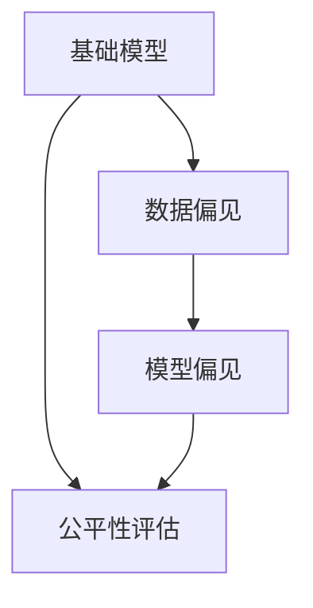

                 

## 1. 背景介绍

随着人工智能(AI)技术的不断发展，基础模型(Boundary Models)在各个领域的应用变得越来越广泛。这些模型通过学习大量的数据，能够实现各种复杂的任务，如语音识别、图像处理、自然语言处理等。然而，基础模型在带来便利的同时，也引发了一系列的社会公平问题。本文将从基础模型的社会公平问题入手，探讨其对社会的影响，并提出一些可能的解决方案。

## 2. 核心概念与联系

### 2.1 核心概念概述

基础模型（Boundary Models）是一种通过训练大规模数据集来学习并完成任务的模型，通常包括深度神经网络、强化学习模型等。其特点在于能够在无监督学习的基础上，自动获取并利用数据中的复杂关系。然而，基础模型的训练和应用过程中，也可能出现一些社会公平问题。

#### 2.1.1 数据偏见

数据偏见（Data Bias）指的是在训练基础模型时，使用的数据集可能包含某些特定的偏见或歧视。这些偏见可能来自于历史数据的不平衡、数据采集方法的偏差等。这些偏见可能导致模型在应用时，也表现出相同的偏见，从而影响社会的公平性。

#### 2.1.2 模型偏见

模型偏见（Model Bias）指的是在训练过程中，模型可能会学习到数据集中的偏见，并在预测或决策时，将其放大。例如，如果训练数据中存在性别、种族等方面的偏见，模型可能会在学习过程中加强这些偏见，导致其预测或决策结果也不公平。

#### 2.1.3 公平性评估

公平性评估（Fairness Evaluation）指的是在模型训练和应用过程中，对模型是否公平进行评估的方法。常见的公平性评估指标包括准确率、召回率、F1分数等，但这些指标并不能全面反映模型的公平性。

### 2.2 核心概念的关系

基础模型、数据偏见、模型偏见和公平性评估之间的关系可以通过以下Mermaid流程图来展示：



这个流程图展示了基础模型在数据偏见和模型偏见的影响下，可能无法实现公平性的问题。同时，公平性评估可以帮助我们识别和缓解这些偏见。

## 3. 核心算法原理 & 具体操作步骤

### 3.1 算法原理概述

基础模型在训练过程中，通常会使用大量的数据集进行训练，以获取模型所需的知识。然而，这些数据集可能存在一些偏见，导致模型在学习过程中也产生了偏见。因此，在模型训练和应用过程中，需要特别关注数据偏见和模型偏见问题，并采取相应的措施来确保模型的公平性。

### 3.2 算法步骤详解

#### 3.2.1 数据集收集与处理

数据集收集与处理是基础模型训练的第一步。在数据收集阶段，需要确保数据集的多样性和代表性，避免出现数据偏见。在数据处理阶段，需要对数据进行清洗、去重、标注等操作，确保数据质量和一致性。

#### 3.2.2 模型训练与优化

在模型训练阶段，需要使用优化算法（如梯度下降、Adam等）来最小化损失函数。同时，需要设置适当的超参数（如学习率、批大小、正则化系数等），以防止过拟合和欠拟合。

#### 3.2.3 公平性评估与调整

在模型训练完成后，需要进行公平性评估，以确保模型的输出结果公平。如果发现模型存在偏见，需要对其进行调整，如重新训练模型、修改损失函数等。

### 3.3 算法优缺点

#### 3.3.1 优点

基础模型具有以下优点：

- 训练效率高：由于基础模型通常使用深度神经网络，训练效率高，能够快速处理大量数据。
- 应用广泛：基础模型可以应用于多个领域，如语音识别、图像处理、自然语言处理等。
- 自动化能力强：基础模型可以自动学习数据中的复杂关系，无需人工干预。

#### 3.3.2 缺点

基础模型也存在一些缺点：

- 数据偏见问题：由于数据集可能存在偏见，导致模型学习到的知识也存在偏见。
- 模型偏见问题：模型可能会学习到数据集中的偏见，并在预测或决策时放大这些偏见。
- 公平性评估困难：公平性评估需要考虑多方面的因素，如性别、种族、年龄等，难以全面评估模型的公平性。

### 3.4 算法应用领域

基础模型在多个领域都有广泛的应用，如：

- 自然语言处理：基础模型可以用于文本分类、情感分析、机器翻译等任务。
- 图像处理：基础模型可以用于图像识别、图像生成等任务。
- 语音识别：基础模型可以用于语音识别、语音合成等任务。
- 推荐系统：基础模型可以用于推荐系统中的用户兴趣预测、物品推荐等任务。

## 4. 数学模型和公式 & 详细讲解  
### 4.1 数学模型构建

基础模型的训练过程通常使用损失函数来衡量模型预测结果与真实标签之间的差异。以二分类任务为例，假设模型的预测结果为$\hat{y}$，真实标签为$y$，则损失函数可以定义为：

$$
L(\hat{y}, y) = -\log\hat{y} \quad \text{if} \quad y = 1
$$

$$
L(\hat{y}, y) = -\log(1 - \hat{y}) \quad \text{if} \quad y = 0
$$

训练过程中，使用优化算法（如梯度下降）来最小化损失函数。优化算法的更新公式为：

$$
\theta = \theta - \eta \nabla_{\theta}L(\hat{y}, y)
$$

其中，$\theta$为模型参数，$\eta$为学习率，$\nabla_{\theta}L(\hat{y}, y)$为损失函数对模型参数的梯度。

### 4.2 公式推导过程

在训练过程中，模型需要不断更新参数，以最小化损失函数。以二分类任务为例，假设模型输出为$\hat{y}$，真实标签为$y$，则损失函数的梯度计算公式为：

$$
\nabla_{\theta}L(\hat{y}, y) = \left\{
\begin{aligned}
\frac{1}{\hat{y}} \quad &\text{if} \quad y = 1 \\
-\frac{1}{1 - \hat{y}} \quad &\text{if} \quad y = 0
\end{aligned}
\right.
$$

将上述梯度代入优化算法更新公式，得到模型参数的更新公式为：

$$
\theta = \theta - \eta \left\{
\begin{aligned}
\frac{1}{\hat{y}} \quad &\text{if} \quad y = 1 \\
-\frac{1}{1 - \hat{y}} \quad &\text{if} \quad y = 0
\end{aligned}
\right.
$$

### 4.3 案例分析与讲解

以图像分类任务为例，假设模型输入为图像特征$x$，输出为分类结果$y$，则损失函数可以定义为交叉熵损失函数：

$$
L(x, y) = -\sum_{i} y_i \log \hat{y_i}
$$

其中，$y_i$为真实标签，$\hat{y_i}$为模型预测结果。训练过程中，使用优化算法（如Adam）来最小化损失函数。优化算法的更新公式为：

$$
\theta = \theta - \eta \nabla_{\theta}L(x, y)
$$

其中，$\theta$为模型参数，$\eta$为学习率，$\nabla_{\theta}L(x, y)$为损失函数对模型参数的梯度。

## 5. 项目实践：代码实例和详细解释说明

### 5.1 开发环境搭建

在进行基础模型训练和评估之前，需要准备相应的开发环境。以下是在PyTorch平台上搭建开发环境的详细步骤：

1. 安装Anaconda：从官网下载并安装Anaconda，用于创建独立的Python环境。
```bash
conda create -n torch_env python=3.7
conda activate torch_env
```

2. 安装PyTorch：根据CUDA版本，从官网获取对应的安装命令。例如：
```bash
conda install pytorch torchvision torchaudio cudatoolkit=10.2 -c pytorch -c conda-forge
```

3. 安装其他依赖库：
```bash
pip install numpy pandas scikit-learn torchtext transformers
```

完成上述步骤后，即可在`torch_env`环境中开始基础模型的训练和评估。

### 5.2 源代码详细实现

以下是一个简单的二分类任务的基础模型训练代码示例：

```python
import torch
import torch.nn as nn
import torch.optim as optim
from torchtext.datasets import MNIST
from torchtext.data import Field, TabularDataset, BucketIterator

# 定义模型
class Model(nn.Module):
    def __init__(self, input_size, hidden_size, output_size):
        super(Model, self).__init__()
        self.fc1 = nn.Linear(input_size, hidden_size)
        self.relu = nn.ReLU()
        self.fc2 = nn.Linear(hidden_size, output_size)
        self.softmax = nn.Softmax(dim=1)

    def forward(self, x):
        x = self.fc1(x)
        x = self.relu(x)
        x = self.fc2(x)
        x = self.softmax(x)
        return x

# 定义数据集
train_data, test_data = MNIST.splits()
train_data = TabularDataset(train_data, path='train_data.csv')
test_data = TabularDataset(test_data, path='test_data.csv')

# 定义数据处理方式
text = Field(tokenize='spacy', lower=True, include_lengths=True)
label = Field(sequential=False)

train_data, test_data = train_data.split(split_ratio=0.8)
train_data = train_data.build_vocab(text=text, label=label)
test_data = test_data.build_vocab(text=text, label=label)

# 定义迭代器
train_iterator, test_iterator = BucketIterator.splits(
    (train_data, test_data), 
    batch_size=64, 
    device='cuda')

# 定义模型、优化器、损失函数
model = Model(input_size=28*28, hidden_size=128, output_size=2)
optimizer = optim.Adam(model.parameters(), lr=0.001)
criterion = nn.BCEWithLogitsLoss()

# 训练模型
for epoch in range(10):
    model.train()
    loss = 0
    for batch in train_iterator:
        images, labels, lens = batch
        optimizer.zero_grad()
        outputs = model(images)
        loss += criterion(outputs, labels)
        loss.backward()
        optimizer.step()
    
    model.eval()
    with torch.no_grad():
        test_loss = 0
        for batch in test_iterator:
            images, labels, lens = batch
            outputs = model(images)
            test_loss += criterion(outputs, labels)
        test_loss /= len(test_iterator)

    print(f'Epoch {epoch+1}, Loss: {test_loss:.4f}')
```

### 5.3 代码解读与分析

在上述代码中，我们定义了一个简单的神经网络模型，用于处理二分类任务。具体实现步骤如下：

1. 定义数据集：使用PyTorch的`torchtext`库中的`MNIST`数据集，加载训练和测试数据集。
2. 定义数据处理方式：使用`Field`类定义输入数据和标签的处理方式。
3. 定义迭代器：使用`BucketIterator`类对数据进行分批处理，以便于模型训练。
4. 定义模型、优化器和损失函数：使用`Model`类定义神经网络模型，使用`Adam`优化器和`BCEWithLogitsLoss`损失函数。
5. 训练模型：在训练过程中，使用梯度下降算法最小化损失函数，并使用测试集评估模型性能。

### 5.4 运行结果展示

在训练完成后，可以通过测试集评估模型的性能。以下是一个简单的评估代码示例：

```python
import numpy as np

# 定义测试集
test_data = test_iterator.dataset
test_data = TabularDataset(test_data, path='test_data.csv')
test_data = test_data.build_vocab(text=text, label=label)

# 定义迭代器
test_iterator = BucketIterator(test_data, batch_size=64, device='cuda')

# 定义模型、优化器和损失函数
model = Model(input_size=28*28, hidden_size=128, output_size=2)
optimizer = optim.Adam(model.parameters(), lr=0.001)
criterion = nn.BCEWithLogitsLoss()

# 评估模型
with torch.no_grad():
    model.eval()
    test_loss = 0
    for batch in test_iterator:
        images, labels, lens = batch
        outputs = model(images)
        test_loss += criterion(outputs, labels)
    test_loss /= len(test_iterator)

print(f'Test Loss: {test_loss:.4f}')
```

在实际应用中，可以通过修改模型、数据集、优化器等参数，来优化模型的性能和公平性。

## 6. 实际应用场景

基础模型在多个领域都有广泛的应用，以下是一些典型的应用场景：

### 6.1 自然语言处理

基础模型可以用于文本分类、情感分析、机器翻译等任务。例如，使用BERT模型进行文本分类，可以自动对新闻、评论等文本进行分类，识别其中的情感倾向。

### 6.2 图像处理

基础模型可以用于图像识别、图像生成等任务。例如，使用卷积神经网络进行图像分类，可以自动对图片进行分类，识别其中的物体。

### 6.3 推荐系统

基础模型可以用于推荐系统中的用户兴趣预测、物品推荐等任务。例如，使用深度学习模型进行用户行为预测，可以自动推荐用户可能感兴趣的商品。

## 7. 工具和资源推荐

### 7.1 学习资源推荐

为了帮助开发者系统掌握基础模型的训练和评估方法，这里推荐一些优质的学习资源：

1. 《深度学习》（Ian Goodfellow等著）：经典深度学习教材，详细介绍了深度学习的基本原理和应用。
2. 《机器学习实战》（Peter Harrington著）：适合初学者的机器学习实战教程，涵盖各种常见的机器学习算法。
3. 《TensorFlow实战》（Francesc Alted和Alejandro Bergueso Verdich子著）：适合初学者的TensorFlow教程，详细介绍TensorFlow的基本原理和应用。
4. 《PyTorch深度学习》（Nitish Gupta等著）：适合初学者的PyTorch教程，详细介绍PyTorch的基本原理和应用。

### 7.2 开发工具推荐

高效的开发离不开优秀的工具支持。以下是几款用于基础模型开发常用的工具：

1. PyTorch：基于Python的开源深度学习框架，灵活动态的计算图，适合快速迭代研究。
2. TensorFlow：由Google主导开发的开源深度学习框架，生产部署方便，适合大规模工程应用。
3. Keras：基于TensorFlow和Theano的高级深度学习框架，使用简单，适合初学者。
4. Jupyter Notebook：开源的交互式笔记本环境，支持Python、R等语言，适合快速迭代实验。
5. TensorBoard：TensorFlow配套的可视化工具，可实时监测模型训练状态，并提供丰富的图表呈现方式。

### 7.3 相关论文推荐

基础模型在多个领域都有广泛的研究。以下是一些经典的论文，推荐阅读：

1. Imagenet Classification with Deep Convolutional Neural Networks（Alex Krizhevsky等著）：介绍卷积神经网络在图像分类任务中的表现。
2. ImageNet Large Scale Visual Recognition Challenge（Ian Goodfellow等著）：介绍ImageNet数据集和大规模视觉识别挑战赛。
3. Natural Language Processing with Transformers（Jacob Devlin等著）：介绍Transformer在大规模自然语言处理任务中的表现。
4. Attention is All You Need（Ashish Vaswani等著）：介绍Transformer在自然语言处理任务中的表现。
5. Explainable AI: Unveiling the Decision Process of Deep Neural Networks（Jacob Devlin等著）：介绍可解释性在深度神经网络中的应用。

这些论文代表了大模型训练和评估技术的发展脉络，对理解基础模型的训练和评估方法具有重要意义。

## 8. 总结：未来发展趋势与挑战

### 8.1 研究成果总结

基础模型在多个领域都有广泛的应用，具有高效率、高准确性等优点。然而，在训练和应用过程中，也存在数据偏见、模型偏见等社会公平问题。为了解决这些问题，研究者提出了一些新的方法，如数据增强、公平性评估等。

### 8.2 未来发展趋势

未来基础模型的发展趋势包括：

1. 更加高效：随着硬件性能的提升，基础模型将变得更加高效，能够处理更大规模的数据。
2. 更加可解释：基础模型的输出结果将变得更加可解释，便于开发者和用户理解和调试。
3. 更加公平：基础模型的训练和应用将更加注重公平性，避免出现数据偏见和模型偏见。

### 8.3 面临的挑战

基础模型在训练和应用过程中，也面临一些挑战：

1. 数据偏见问题：基础模型训练数据可能存在偏见，导致模型输出结果也存在偏见。
2. 模型偏见问题：基础模型可能学习到数据集中的偏见，并在预测或决策时放大这些偏见。
3. 公平性评估问题：基础模型的公平性评估方法有待进一步完善，难以全面评估模型的公平性。

### 8.4 研究展望

未来研究需要关注以下几个方面：

1. 数据偏见问题：需要研究更加多样化的数据集，避免出现数据偏见。
2. 模型偏见问题：需要研究更加公平的模型，避免放大数据集中的偏见。
3. 公平性评估问题：需要研究更加全面的公平性评估方法，全面评估模型的公平性。

## 9. 附录：常见问题与解答

**Q1：基础模型训练过程中如何避免数据偏见？**

A: 基础模型训练过程中，可以通过以下方法避免数据偏见：

1. 数据收集：收集多样化的数据集，避免出现数据集偏见。
2. 数据清洗：清洗数据集中的噪声和异常值，避免出现数据偏见。
3. 数据增强：对数据集进行增强处理，避免模型过度拟合。

**Q2：基础模型训练过程中如何避免模型偏见？**

A: 基础模型训练过程中，可以通过以下方法避免模型偏见：

1. 使用公平性评估指标：使用公平性评估指标评估模型的输出结果，避免模型偏见。
2. 调整损失函数：调整损失函数，使其对公平性更加敏感。
3. 修改模型结构：修改模型结构，使其对公平性更加敏感。

**Q3：基础模型训练过程中如何进行公平性评估？**

A: 基础模型训练过程中，可以通过以下方法进行公平性评估：

1. 使用公平性指标：使用公平性指标评估模型的输出结果，如准确率、召回率、F1分数等。
2. 使用公平性评估库：使用公平性评估库，如Fairness Indicators等，进行公平性评估。
3. 修改评估指标：修改评估指标，使其对公平性更加敏感。

通过以上方法，可以全面评估基础模型的公平性，并提出相应的改进措施。

---

作者：禅与计算机程序设计艺术 / Zen and the Art of Computer Programming

