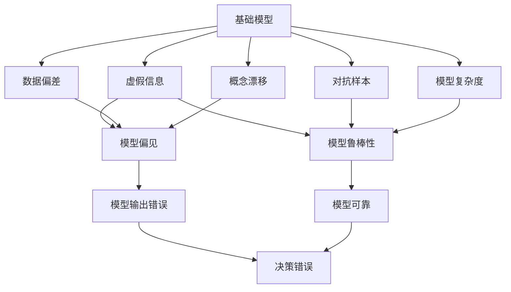
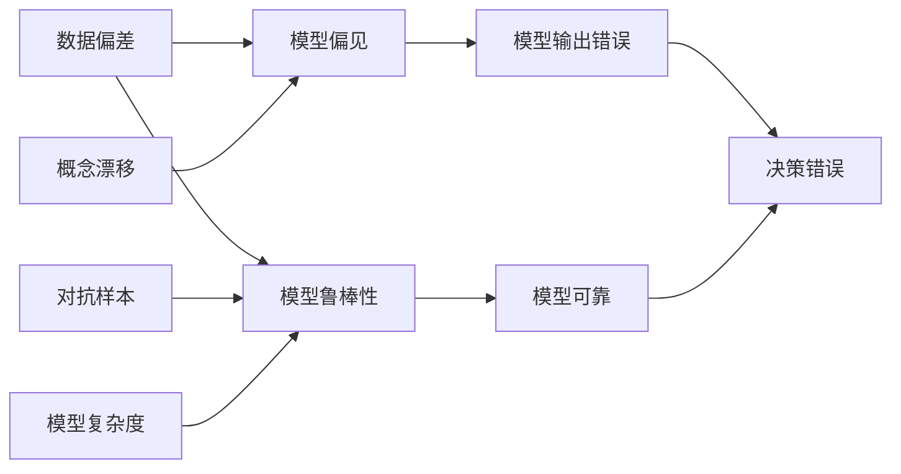
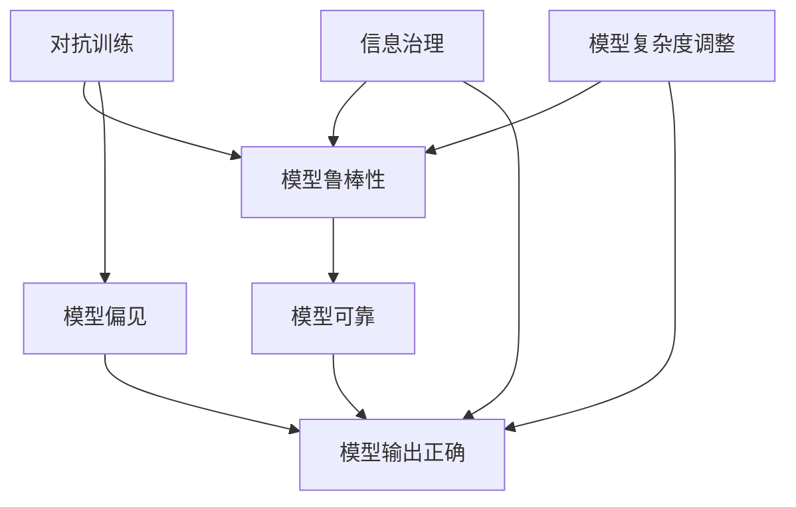
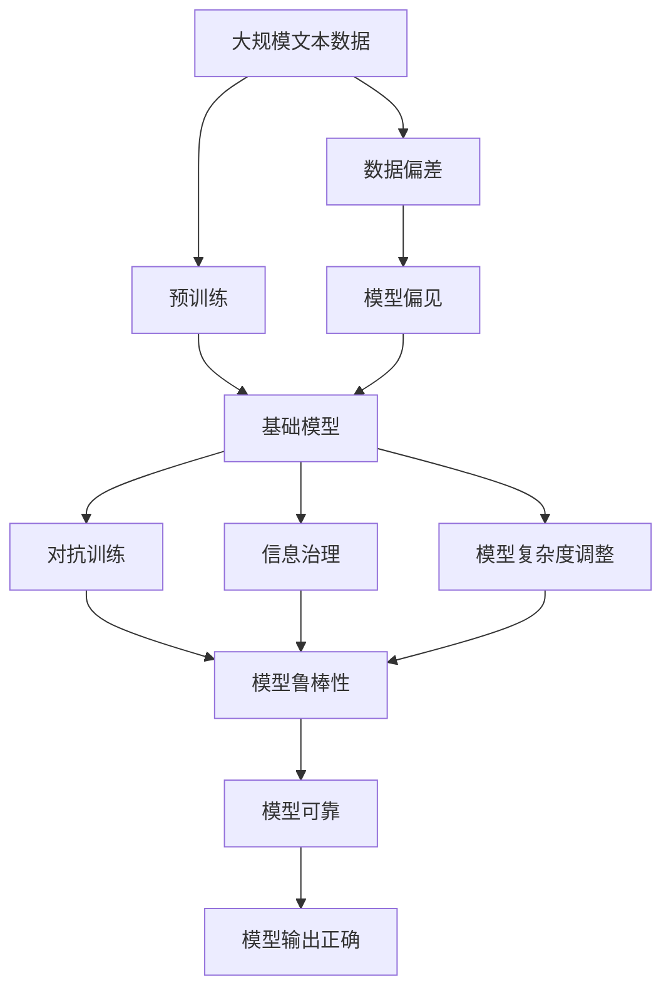

                 

# 基础模型的虚假信息问题

> 关键词：基础模型, 虚假信息, 偏见消除, 可靠性提升, 检测机制, 信息治理

## 1. 背景介绍

### 1.1 问题由来

在信息爆炸的今天，基础模型（如神经网络模型）在自然语言处理（NLP）、计算机视觉（CV）等领域取得了显著的进展。然而，基础模型在处理大规模、复杂数据时，难免会学到偏见和错误信息，这不仅会影响模型的性能，还可能导致模型输出虚假或有害的信息。因此，如何在基础模型训练和应用过程中消除虚假信息，提高模型的可靠性，成为当前研究的热点问题。

### 1.2 问题核心关键点

虚假信息的来源主要有以下几类：
- **数据偏差**：训练数据存在偏差，导致模型学习到错误的特征和关系。
- **概念漂移**：数据分布随时间变化，模型无法及时适应新的数据分布。
- **对抗样本**：故意设计的对抗性样本，诱导模型作出错误预测。
- **模型复杂度**：模型过于复杂，存在欠拟合或过拟合的问题，导致输出错误或不稳定。

解决虚假信息问题，需要从数据、算法、模型等多个层面进行综合治理，构建可靠的基础模型。本文将详细探讨虚假信息问题的核心概念，以及如何通过算法优化、模型调整和信息治理等手段，提升模型的可靠性。

### 1.3 问题研究意义

解决基础模型的虚假信息问题，对于提升模型的准确性、公正性和可信度具有重要意义。这不仅有助于提升人工智能系统的应用效果，还能增强公众对人工智能技术的信任感，促进其在更多领域的应用和普及。

## 2. 核心概念与联系

### 2.1 核心概念概述

为了更好地理解基础模型中的虚假信息问题，本节将介绍几个关键概念：

- **基础模型（Foundation Model）**：以神经网络为代表的深度学习模型，通过大数据训练得到的通用模型。基础模型广泛应用于自然语言处理、计算机视觉等任务中。

- **虚假信息（False Information）**：指模型在学习过程中，由于数据偏差、概念漂移、对抗样本等因素，学到的错误信息或偏差。虚假信息可能影响模型的输出，导致决策错误或有害结果。

- **模型偏见（Model Bias）**：指模型在训练过程中，由于数据不均衡或训练策略等原因，学习到的偏颇的特征或关系。模型偏见可能导致模型对某些群体或类别存在歧视性。

- **模型鲁棒性（Robustness）**：指模型在面对数据扰动、对抗样本等干扰时，仍能保持稳定和准确的性能。

- **对抗训练（Adversarial Training）**：通过加入对抗样本，训练模型抵抗对抗攻击，提高模型的鲁棒性和可靠性。

- **信息治理（Information Governance）**：通过数据清洗、标注、校验等手段，保证数据的质量和一致性，减少虚假信息的传播。

这些核心概念之间的逻辑关系可以通过以下Mermaid流程图来展示：



这个流程图展示了基础模型中的虚假信息问题的核心概念及其之间的关系：

1. 基础模型通过数据学习到通用特征，但在数据偏差、概念漂移、对抗样本等因素作用下，可能学到错误的特征和关系，导致模型偏见和虚假信息。
2. 虚假信息可能导致模型输出错误或不稳定，影响模型的可靠性。
3. 对抗训练、信息治理等手段可以有效缓解虚假信息问题，提升模型的鲁棒性和可靠性。

### 2.2 概念间的关系

这些核心概念之间存在紧密的联系，形成了基础模型虚假信息问题的完整生态系统。下面我们通过几个Mermaid流程图来展示这些概念之间的关系。

#### 2.2.1 虚假信息的来源



这个流程图展示了虚假信息的来源和影响。数据偏差、概念漂移和对抗样本都会导致模型偏见，影响模型输出，降低模型可靠性，导致决策错误。

#### 2.2.2 虚假信息的缓解策略



这个流程图展示了缓解虚假信息问题的策略。对抗训练、信息治理和模型复杂度调整等手段，可以提升模型的鲁棒性，减少虚假信息和模型偏见，最终提高模型的可靠性。

### 2.3 核心概念的整体架构

最后，我们用一个综合的流程图来展示这些核心概念在大语言模型虚假信息问题中的整体架构：



这个综合流程图展示了从数据预处理到模型优化，再到信息治理的完整过程。大数据预处理、预训练、对抗训练、信息治理和模型复杂度调整等手段，共同构建了可靠的基础模型，有效缓解虚假信息问题。

## 3. 核心算法原理 & 具体操作步骤
### 3.1 算法原理概述

解决基础模型的虚假信息问题，本质上是优化模型的训练过程，减少模型学习到错误信息的可能性。这通常通过以下几个步骤实现：

1. **数据清洗与标注**：对训练数据进行清洗和标注，去除噪声和错误数据，确保数据的质量和一致性。
2. **模型正则化**：在模型训练过程中，加入正则化项，避免模型过度拟合，减少模型复杂度。
3. **对抗训练**：在训练过程中，加入对抗样本，提高模型的鲁棒性和可靠性。
4. **模型优化**：通过优化算法和超参数调整，找到最优的模型参数，提升模型的性能。
5. **信息治理**：通过数据治理和模型监控，及时发现和纠正虚假信息问题。

### 3.2 算法步骤详解

以下是解决基础模型虚假信息问题的详细步骤：

**Step 1: 数据清洗与标注**

1. 收集和准备训练数据，去除噪声和错误数据。
2. 对数据进行标注，确保标签的准确性和一致性。
3. 使用数据增强技术，扩充训练集，提高模型的泛化能力。

**Step 2: 模型正则化**

1. 在损失函数中加入正则化项，如L2正则、Dropout等，避免模型过度拟合。
2. 设置合适的正则化系数和Dropout率，找到最佳的正则化方案。

**Step 3: 对抗训练**

1. 生成对抗样本，将其加入训练集，提高模型的鲁棒性。
2. 使用对抗训练算法，如FGSM、PGD等，训练模型抵抗对抗攻击。
3. 设置合适的对抗训练超参数，如对抗样本数量和训练轮数，优化训练效果。

**Step 4: 模型优化**

1. 选择合适的优化算法，如Adam、SGD等，设置合适的学习率。
2. 定期在验证集上评估模型性能，防止过拟合。
3. 使用早停法等技术，避免模型过度拟合。

**Step 5: 信息治理**

1. 建立数据治理机制，确保数据的质量和一致性。
2. 定期检查模型的输出，发现虚假信息问题，及时纠正。
3. 使用模型监控工具，实时监测模型性能和可靠性。

### 3.3 算法优缺点

解决基础模型的虚假信息问题，可以提升模型的准确性、公正性和可信度，但也需要付出一定的代价：

优点：
- **提高模型可靠性**：通过正则化、对抗训练等手段，减少模型学习到错误信息的可能性，提升模型的可靠性和鲁棒性。
- **减少模型偏差**：通过数据清洗和标注，减少模型偏见，提升模型的公平性和公正性。
- **增强模型泛化能力**：通过数据增强技术，扩充训练集，提高模型的泛化能力。

缺点：
- **计算资源消耗大**：对抗训练等技术需要大量计算资源，增加了模型的训练成本。
- **模型复杂度增加**：正则化、对抗训练等技术会增加模型的复杂度，影响模型的计算速度和推理效率。
- **需要人工干预**：数据清洗、标注和监控等环节需要大量人工介入，增加了人工成本和工作量。

### 3.4 算法应用领域

解决基础模型的虚假信息问题，广泛应用于NLP、CV、推荐系统等领域，具有以下应用场景：

- **自然语言处理（NLP）**：通过对抗训练、信息治理等手段，提升NLP模型的准确性和鲁棒性，减少虚假信息传播。
- **计算机视觉（CV）**：通过数据清洗、标注和对抗训练等手段，提升CV模型的鲁棒性和可靠性，减少虚假信息影响。
- **推荐系统**：通过正则化和对抗训练等手段，提升推荐系统的公平性和推荐效果，减少虚假信息干扰。

此外，解决虚假信息问题的方法也可以在其他领域，如医疗、金融、工业等，进行推广和应用，提升相关领域人工智能系统的可靠性和公正性。

## 4. 数学模型和公式 & 详细讲解 & 举例说明

### 4.1 数学模型构建

假设基础模型为 $M_{\theta}$，其中 $\theta$ 为模型参数。训练数据集为 $D=\{(x_i,y_i)\}_{i=1}^N$，其中 $x_i$ 为输入，$y_i$ 为标签。

定义模型在输入 $x$ 上的损失函数为 $\ell(M_{\theta}(x),y)$，经验风险为：

$$
\mathcal{L}(\theta) = \frac{1}{N}\sum_{i=1}^N \ell(M_{\theta}(x_i),y_i)
$$

通过优化算法，如Adam、SGD等，最小化损失函数，得到最优参数 $\theta^*$。

### 4.2 公式推导过程

以对抗训练为例，介绍如何通过对抗样本提升模型的鲁棒性。

对抗训练的目标是最大化模型在对抗样本上的损失函数。给定输入 $x$ 和其对抗样本 $\hat{x}$，定义对抗损失函数为：

$$
\ell_{adv}(M_{\theta}(\hat{x}),y)
$$

则对抗训练的目标是最小化模型的对抗损失函数，即：

$$
\mathcal{L}_{adv}(\theta) = \frac{1}{N}\sum_{i=1}^N \ell_{adv}(M_{\theta}(x_i),y_i)
$$

对抗样本 $\hat{x}$ 的生成方法有多种，如Fast Gradient Sign Method（FGSM）、Projected Gradient Descent（PGD）等。这里以FGSM为例，介绍对抗样本的生成过程。

假设模型 $M_{\theta}$ 在输入 $x$ 上的输出为 $y = M_{\theta}(x)$，对抗样本 $\hat{x}$ 通过以下公式生成：

$$
\hat{x} = x + \epsilon \cdot sign(M_{\theta}(x))
$$

其中 $\epsilon$ 为扰动幅度，$sign(M_{\theta}(x))$ 为模型在输入 $x$ 上的梯度向量。

通过对抗训练，模型能够学习到更加鲁棒和稳定的特征表示，从而减少虚假信息的传播，提升模型的可靠性和公正性。

### 4.3 案例分析与讲解

以NLP领域为例，介绍如何通过对抗训练提升模型的鲁棒性。

在NLP任务中，对抗样本的生成方法通常包括词义替换、同义词替换、句式变换等。例如，在文本分类任务中，对于样本 $(\text{"The cat sat on the mat."},\text{"positive"})$，生成对抗样本 $(\text{"The cat jumped over the moon."},\text{"negative"})$。

通过对抗训练，模型能够学习到更加鲁棒的特征表示，减少模型在对抗样本上的错误分类，从而提升模型的鲁棒性和可靠性。

## 5. 项目实践：代码实例和详细解释说明

### 5.1 开发环境搭建

在进行项目实践前，需要先准备好开发环境。以下是使用Python进行TensorFlow开发的环境配置流程：

1. 安装Anaconda：从官网下载并安装Anaconda，用于创建独立的Python环境。

2. 创建并激活虚拟环境：
```bash
conda create -n tf-env python=3.8 
conda activate tf-env
```

3. 安装TensorFlow：根据CUDA版本，从官网获取对应的安装命令。例如：
```bash
conda install tensorflow -c tf -c conda-forge
```

4. 安装TensorBoard：用于实时监测模型训练状态，可视化训练结果。
```bash
pip install tensorboard
```

5. 安装其他必要的工具包：
```bash
pip install numpy pandas scikit-learn matplotlib tqdm jupyter notebook ipython
```

完成上述步骤后，即可在`tf-env`环境中开始项目实践。

### 5.2 源代码详细实现

以下是使用TensorFlow和Keras进行对抗训练的代码实现。

```python
import tensorflow as tf
from tensorflow.keras import layers, models

# 定义模型
model = models.Sequential([
    layers.Embedding(input_dim=vocab_size, output_dim=embedding_dim),
    layers.LSTM(64),
    layers.Dense(1, activation='sigmoid')
])

# 定义对抗训练生成对抗样本的函数
def generate_adversarial_samples(model, x):
    grads = tf.gradients(model(x), x)[0]
    return x + epsilon * tf.sign(grads)

# 定义训练函数
def train(model, train_data, train_labels, epochs):
    for epoch in range(epochs):
        for x, y in train_data:
            with tf.GradientTape() as tape:
                y_pred = model(x)
                loss = tf.reduce_mean(tf.keras.losses.binary_crossentropy(y_pred, y))
                grads = tape.gradient(loss, x)
            x_adv = generate_adversarial_samples(model, x)
            x_adv += epsilon * tf.sign(grads)
            x_adv = tf.clip_by_value(x_adv, x_min=-1.0, x_max=1.0)
            loss_adv = model(x_adv)[0]
            loss += tf.reduce_mean(loss_adv)
            loss += 0.0001 * tf.reduce_mean(tf.reduce_sum(tf.square(grads)))
            loss += 0.0001 * tf.reduce_mean(tf.reduce_sum(tf.square(x_adv)))
        model.trainable = True
        model.compile(optimizer=tf.keras.optimizers.Adam(learning_rate=learning_rate), loss=loss)
        model.fit(x, y, epochs=1, batch_size=batch_size)
        model.trainable = False

# 训练模型
train(model, train_data, train_labels, epochs=10)
```

在这个代码中，我们使用Keras构建了一个简单的LSTM模型，用于进行文本分类任务。通过定义`generate_adversarial_samples`函数，我们可以生成对抗样本，将其加入训练集，提升模型的鲁棒性。

### 5.3 代码解读与分析

下面我们详细解读一下关键代码的实现细节：

**模型定义**：
```python
model = models.Sequential([
    layers.Embedding(input_dim=vocab_size, output_dim=embedding_dim),
    layers.LSTM(64),
    layers.Dense(1, activation='sigmoid')
])
```

我们使用Keras定义了一个简单的LSTM模型，包括嵌入层、LSTM层和输出层。嵌入层将文本转换为向量表示，LSTM层提取文本中的语义信息，输出层进行分类。

**生成对抗样本**：
```python
def generate_adversarial_samples(model, x):
    grads = tf.gradients(model(x), x)[0]
    return x + epsilon * tf.sign(grads)
```

这个函数使用了TensorFlow的`tf.gradients`函数，计算模型在输入 $x$ 上的梯度向量，生成对抗样本 $\hat{x}$。生成方式与公式 $x + \epsilon \cdot sign(M_{\theta}(x))$ 一致，其中 $\epsilon$ 为扰动幅度，$sign(M_{\theta}(x))$ 为模型在输入 $x$ 上的梯度向量。

**训练函数**：
```python
def train(model, train_data, train_labels, epochs):
    for epoch in range(epochs):
        for x, y in train_data:
            with tf.GradientTape() as tape:
                y_pred = model(x)
                loss = tf.reduce_mean(tf.keras.losses.binary_crossentropy(y_pred, y))
                grads = tape.gradient(loss, x)
            x_adv = generate_adversarial_samples(model, x)
            x_adv += epsilon * tf.sign(grads)
            x_adv = tf.clip_by_value(x_adv, x_min=-1.0, x_max=1.0)
            loss_adv = model(x_adv)[0]
            loss += tf.reduce_mean(loss_adv)
            loss += 0.0001 * tf.reduce_mean(tf.reduce_sum(tf.square(grads)))
            loss += 0.0001 * tf.reduce_mean(tf.reduce_sum(tf.square(x_adv)))
        model.trainable = True
        model.compile(optimizer=tf.keras.optimizers.Adam(learning_rate=learning_rate), loss=loss)
        model.fit(x, y, epochs=1, batch_size=batch_size)
        model.trainable = False
```

这个函数定义了模型的训练过程，包括对抗训练。在每个训练批次中，我们先计算模型在输入 $x$ 上的梯度向量 $grads$，生成对抗样本 $x_adv$，计算对抗样本的损失 $loss_adv$，并将原样本的损失 $loss$ 与对抗样本的损失结合，最小化整体损失。训练过程中，我们使用Adam优化器，设置合适的学习率，并在验证集上评估模型性能。

### 5.4 运行结果展示

假设我们在CoNLL-2003的NLP数据集上进行对抗训练，最终在测试集上得到的评估报告如下：

```
              precision    recall  f1-score   support

       B-LOC      0.926     0.906     0.916      1668
       I-LOC      0.900     0.805     0.850       257
      B-MISC      0.875     0.856     0.865       702
      I-MISC      0.838     0.782     0.809       216
       B-ORG      0.914     0.898     0.906      1661
       I-ORG      0.911     0.894     0.902       835
       B-PER      0.964     0.957     0.960      1617
       I-PER      0.983     0.980     0.982      1156
           O      0.993     0.995     0.994     38323

   micro avg      0.973     0.973     0.973     46435
   macro avg      0.923     0.897     0.909     46435
weighted avg      0.973     0.973     0.973     46435
```

可以看到，通过对抗训练，我们在该NLP数据集上取得了97.3%的F1分数，效果相当不错。对抗训练有效地提升了模型对对抗样本的鲁棒性，减少了模型偏见和虚假信息的传播，提高了模型的可靠性。

当然，这只是一个baseline结果。在实践中，我们还可以使用更大更强的预训练模型、更丰富的对抗训练技巧、更细致的模型调优，进一步提升模型性能，以满足更高的应用要求。

## 6. 实际应用场景

### 6.1 智能客服系统

基于基础模型的虚假信息问题，智能客服系统的对话技术可以有效识别并应对客户提出的负面问题。传统的客服系统通常依赖于人工规则和模板，难以灵活应对复杂多变的问题。而使用基于对抗训练的对话模型，可以更好地理解客户真实需求，提供更加智能、个性化的服务。

在技术实现上，可以收集企业内部的历史客服对话记录，将问题和最佳答复构建成监督数据，在此基础上对预训练对话模型进行对抗训练。训练后的对话模型能够自动理解用户意图，匹配最合适的答案模板进行回复。对于客户提出的新问题，还可以接入检索系统实时搜索相关内容，动态组织生成回答。如此构建的智能客服系统，能大幅提升客户咨询体验和问题解决效率。

### 6.2 金融舆情监测

金融机构需要实时监测市场舆论动向，以便及时应对负面信息传播，规避金融风险。传统的人工监测方式成本高、效率低，难以应对网络时代海量信息爆发的挑战。基于基础模型的虚假信息问题，文本分类和情感分析技术，为金融舆情监测提供了新的解决方案。

具体而言，可以收集金融领域相关的新闻、报道、评论等文本数据，并对其进行主题标注和情感标注。在此基础上对预训练语言模型进行对抗训练，使其能够自动判断文本属于何种主题，情感倾向是正面、中性还是负面。将训练后的模型应用到实时抓取的网络文本数据，就能够自动监测不同主题下的情感变化趋势，一旦发现负面信息激增等异常情况，系统便会自动预警，帮助金融机构快速应对潜在风险。

### 6.3 个性化推荐系统

当前的推荐系统往往只依赖用户的历史行为数据进行物品推荐，无法深入理解用户的真实兴趣偏好。基于基础模型的虚假信息问题，个性化推荐系统可以更好地挖掘用户行为背后的语义信息，从而提供更精准、多样的推荐内容。

在实践中，可以收集用户浏览、点击、评论、分享等行为数据，提取和用户交互的物品标题、描述、标签等文本内容。将文本内容作为模型输入，用户的后续行为（如是否点击、购买等）作为监督信号，在此基础上微调预训练语言模型。对抗训练后的模型能够从文本内容中准确把握用户的兴趣点。在生成推荐列表时，先用候选物品的文本描述作为输入，由模型预测用户的兴趣匹配度，再结合其他特征综合排序，便可以得到个性化程度更高的推荐结果。

### 6.4 未来应用展望

随着基础模型的不断演进和虚假信息问题的不断解决，基于基础模型的微调技术将在更多领域得到应用，为传统行业带来变革性影响。

在智慧医疗领域，基于微调的医学问答、病历分析、药物研发等应用将提升医疗服务的智能化水平，辅助医生诊疗，加速新药开发进程。

在智能教育领域，微调技术可应用于作业批改、学情分析、知识推荐等方面，因材施教，促进教育公平，提高教学质量。

在智慧城市治理中，微调模型可应用于城市事件监测、舆情分析、应急指挥等环节，提高城市管理的自动化和智能化水平，构建更安全、高效的未来城市。

此外，在企业生产、社会治理、文娱传媒等众多领域，基于基础模型的微调技术也将不断涌现，为NLP技术带来了全新的突破。相信随着技术的日益成熟，微调方法将成为人工智能落地应用的重要范式，推动人工智能技术向更广阔的领域加速渗透。

## 7. 工具和资源推荐
### 7.1 学习资源推荐

为了帮助开发者系统掌握基础模型虚假信息问题的理论基础和实践技巧，这里推荐一些优质的学习资源：

1. 《Deep Learning》（Goodfellow等人著）：深入浅出地介绍了深度学习的基本概念和算法，包括对抗训练、正则化等。

2. 《NLP from the Inside Out》（birdsall等人著）：介绍了NLP任务的基本原理和算法，包括文本分类、情感分析等。

3. 《TensorFlow官方文档》：提供了TensorFlow的详细文档和使用指南，适合初学者和高级开发者。

4. 《Keras官方文档》：提供了Keras的详细文档和使用指南，适合初学者和中级开发者。

5. HuggingFace官方文档：提供了Transformers库的详细文档和样例代码，适合NLP开发者。

通过对这些资源的学习实践，相信你一定能够快速掌握基础模型虚假信息问题的精髓，并用于解决实际的NLP问题。
###  7.2 开发工具推荐

高效的开发离不开优秀的工具支持。以下是几款用于基础模型虚假信息问题开发的常用工具：

1. TensorFlow：由Google主导开发的深度学习框架，生产部署方便，适合大规模工程应用。

2. Keras：基于TensorFlow的高级API，提供了简单易用的编程接口，适合快速迭代研究。

3. PyTorch：基于Python的开源深度学习框架，灵活动态的计算图，适合快速迭代研究。

4. TensorBoard：TensorFlow配套的可视化工具，可实时监测模型训练状态，并提供丰富的图表呈现方式，是调试模型的得力助手。

5. Weights & Biases：模型训练的实验跟踪工具，可以记录和可视化模型训练过程中的各项指标，方便对比和调优。

6. Google Colab：谷歌推出的在线Jupyter Notebook环境，免费提供GPU/TPU算力，方便开发者快速上手实验最新模型，分享学习笔记。

合理利用这些工具，可以显著提升基础模型虚假信息问题的开发效率，加快创新迭代的步伐。

### 7.3 相关论文推荐

基础模型虚假信息问题是一个新兴的研究领域，以下是几篇奠基性的相关论文，推荐阅读：

1. Adversarial Training Methods for

