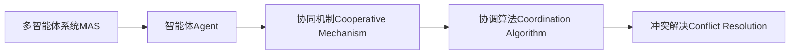
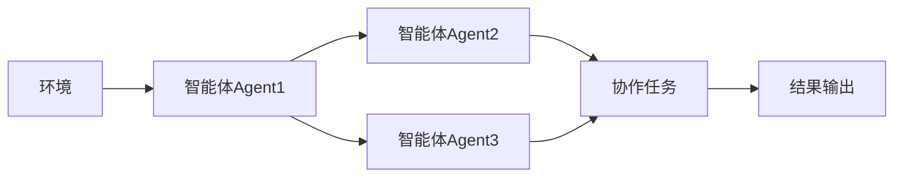
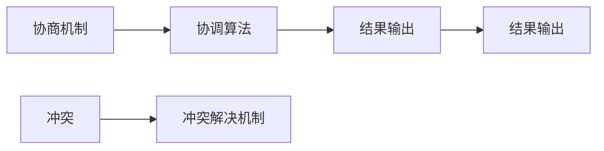
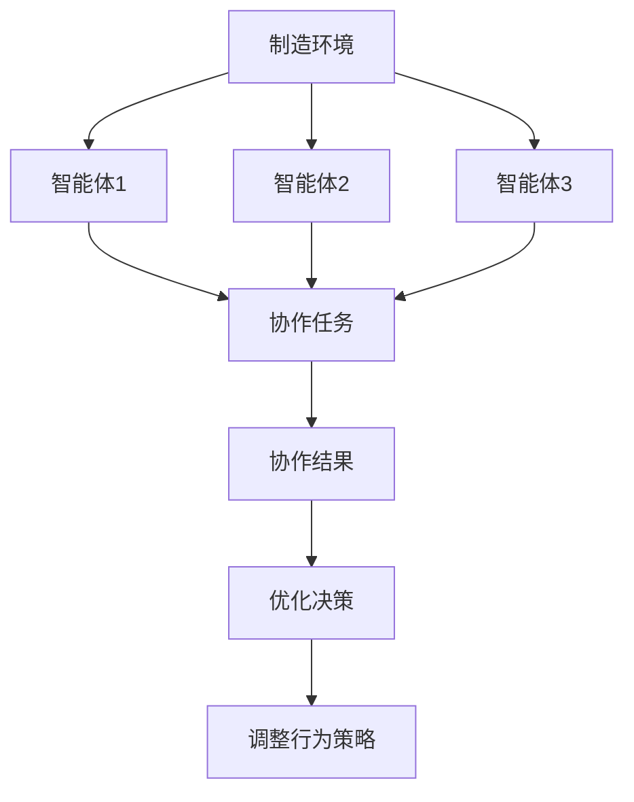

                 

# 多智能体协同机制在智能制造系统中的应用

## 1. 背景介绍

### 1.1 问题由来
随着工业自动化程度的不断提升，智能制造系统的设计和优化成为制造业转型升级的关键。传统的集中式控制模式面临扩展性差、灵活性不足等问题，难以适应复杂多变的需求。为此，多智能体系统(Multi-Agent System,MAS)逐渐成为智能制造研究的热点。

多智能体系统是一种分布式计算模型，由多个具有自治能力的智能体组成，通过相互协作解决复杂问题。每个智能体具有独立的目标和行为逻辑，但又能与其他智能体进行信息交互，共同完成全局任务。MAS的灵活性和鲁棒性使得其在大规模、复杂生产系统中具有广泛的应用前景。

然而，构建高效、可扩展的多智能体系统并非易事，需要考虑诸如异构性、通信延迟、协作机制等诸多问题。近年来，基于智能体学习的协同机制在智能制造系统中的应用逐渐增多，成为研究的重点方向。

### 1.2 问题核心关键点
多智能体协同机制的核心在于设计合理的智能体交互协议和协调算法，使各智能体能够在动态变化的环境中协同工作，提升系统的整体效率和性能。具体来说，需要解决以下几个问题：

- **智能体行为设计**：各智能体如何定义自身行为策略，以实现局部最优解。
- **通信机制**：智能体之间如何高效地进行信息交换，减少通信开销。
- **协调算法**：智能体之间如何协商和协调，以达到全局最优解。
- **冲突解决**：智能体之间出现冲突时，如何有效解决，确保系统稳定运行。

## 2. 核心概念与联系

### 2.1 核心概念概述

为更好地理解多智能体协同机制在智能制造系统中的应用，本节将介绍几个密切相关的核心概念：

- 多智能体系统(MAS)：由多个具有自治能力的智能体组成，通过相互协作解决复杂问题的分布式计算模型。
- 智能体(Agent)：具有自治能力、能感知环境并采取行动的计算实体。智能体通常具有局部目标和行为策略，能够感知环境并根据当前状态进行决策。
- 协同机制(Cooperative Mechanism)：多个智能体之间协作完成任务的策略和协议。
- 协调算法(Coordination Algorithm)：用于多个智能体之间协商和协调的算法，以实现全局最优解。
- 冲突解决(Conflict Resolution)：多个智能体之间出现冲突时，协调算法如何有效解决，确保系统稳定运行。

这些核心概念之间的逻辑关系可以通过以下Mermaid流程图来展示：



这个流程图展示了多智能体协同机制的核心概念及其之间的关系：

1. 多智能体系统由多个智能体组成，智能体通过协同机制进行协作。
2. 协同机制设计多个智能体的交互协议。
3. 协调算法用于智能体之间的协商和协调，实现全局最优解。
4. 冲突解决用于处理智能体之间的冲突，确保系统稳定运行。

### 2.2 概念间的关系

这些核心概念之间存在着紧密的联系，形成了多智能体协同机制的完整生态系统。下面我们通过几个Mermaid流程图来展示这些概念之间的关系。

#### 2.2.1 多智能体系统的工作流程



这个流程图展示了多智能体系统的工作流程：

1. 环境提供初始状态和需求信息。
2. 多个智能体根据自身行为策略和当前状态进行决策。
3. 智能体之间通过协同机制进行信息交换，共同完成任务。
4. 协同过程中可能出现冲突，通过冲突解决机制进行处理。
5. 最终输出协作结果。

#### 2.2.2 协同机制的设计


这个流程图展示了协同机制的设计过程：

1. 智能体根据自身行为策略进行决策。
2. 智能体通过通信协议进行信息交换。
3. 智能体之间根据协同策略进行协商和协调。
4. 如果发生冲突，则通过冲突解决机制进行处理。

#### 2.2.3 协调算法与冲突解决



这个流程图展示了协调算法和冲突解决的过程：

1. 多个智能体通过协商机制进行协商。
2. 协商过程中可能出现冲突，通过冲突解决机制进行处理。
3. 协调算法在多个智能体之间进行协商和协调，输出全局最优解。

### 2.3 核心概念的整体架构

最后，我们用一个综合的流程图来展示这些核心概念在大规模智能制造系统中的整体架构：



这个综合流程图展示了多智能体系统在大规模制造环境中的整体架构：

1. 制造环境提供初始状态和需求信息。
2. 多个智能体根据自身行为策略进行决策。
3. 智能体之间通过协同机制进行信息交换，共同完成任务。
4. 协同过程中可能出现冲突，通过冲突解决机制进行处理。
5. 最终输出协作结果，并进行优化决策和行为策略调整。

这些核心概念共同构成了多智能体协同机制的应用框架，使得多个智能体能够在大规模制造系统中高效协作，提升整体性能。

## 3. 核心算法原理 & 具体操作步骤
### 3.1 算法原理概述

多智能体协同机制的核心算法原理主要包括以下几个方面：

- **行为策略设计**：各智能体需要定义自身行为策略，以实现局部最优解。
- **通信机制设计**：智能体之间通过通信协议进行信息交换，减少通信开销。
- **协调算法设计**：用于多个智能体之间协商和协调，以实现全局最优解。
- **冲突解决机制设计**：在智能体之间出现冲突时，通过冲突解决机制进行处理，确保系统稳定运行。

这些算法原理可以通过以下公式进行数学建模：

- **行为策略**：
  $$
  \max_{a_i} \sum_{i} f_i(a_i)
  $$
  其中，$a_i$ 表示智能体 $i$ 的行为策略，$f_i$ 表示智能体 $i$ 的收益函数。

- **通信机制**：
  $$
  \text{通信量} = \sum_{ij} C_{ij} \times D_{ij}
  $$
  其中，$C_{ij}$ 表示智能体 $i$ 和智能体 $j$ 的通信成本，$D_{ij}$ 表示智能体 $i$ 和智能体 $j$ 之间的通信量。

- **协调算法**：
  $$
  \max_{x} \sum_{i} f_i(x)
  $$
  其中，$x$ 表示智能体之间的协调参数，$f_i$ 表示智能体 $i$ 的收益函数。

- **冲突解决**：
  $$
  \text{冲突解} = \arg\min \sum_{i} g_i(c)
  $$
  其中，$c$ 表示冲突，$g_i$ 表示冲突的代价函数。

### 3.2 算法步骤详解

基于多智能体协同机制的智能制造系统构建过程通常包括以下几个关键步骤：

**Step 1: 环境建模**

- 对制造环境进行建模，识别出制造系统的关键组件和运行流程。
- 确定制造系统的初始状态和需求，如设备状态、物料需求、生产计划等。
- 定义各智能体的目标函数和行为策略。

**Step 2: 设计通信机制**

- 定义智能体之间的通信协议，如消息格式、传输方式等。
- 通过网络拓扑结构，确定智能体之间的通信延迟和带宽。
- 确定通信数据的编码和压缩方式，减少通信开销。

**Step 3: 设计协调算法**

- 根据任务需求，选择适当的协调算法，如博弈论、协同演化算法等。
- 设计智能体之间的交互规则和协议，确保信息的准确传递和处理。
- 定义冲突解决机制，如仲裁、协商、调解等，确保系统稳定运行。

**Step 4: 仿真与优化**

- 使用仿真工具模拟智能体的行为和协作过程。
- 根据仿真结果进行优化，调整智能体的行为策略和协调算法。
- 通过参数调优，提高系统的性能和稳定性。

**Step 5: 实际部署**

- 将优化后的多智能体系统部署到实际生产环境中。
- 监测系统运行状态，根据实时数据进行调整和优化。
- 实现系统的自动化和自适应功能，确保制造过程的高效和稳定。

### 3.3 算法优缺点

多智能体协同机制在智能制造系统中的应用，具有以下优点：

- **灵活性高**：多个智能体之间可以动态调整行为策略，适应生产环境的快速变化。
- **鲁棒性强**：通过协同机制和冲突解决，能够有效处理突发事件和不确定性。
- **信息共享**：多个智能体之间共享信息，提高决策的准确性和效率。
- **资源优化**：通过协作，可以减少资源浪费，提高制造系统的整体效率。

然而，多智能体协同机制也存在以下缺点：

- **实现复杂**：设计合理的行为策略、通信机制和协调算法，需要考虑多方面的因素，难度较大。
- **协调难度大**：智能体之间的协作需要高效的信息交换和协商，实现起来较为复杂。
- **系统规模大**：智能体的数量和复杂性随生产规模的扩大而增加，系统设计和维护难度也随之增加。

### 3.4 算法应用领域

多智能体协同机制在智能制造系统中的应用，已经覆盖了多个领域：

- **生产调度优化**：通过协同机制优化生产计划和资源分配，提高生产效率。
- **质量控制**：智能体之间协同监测产品质量，及时发现和处理生产异常。
- **设备维护**：智能体之间协作进行设备维护，延长设备使用寿命，减少停机时间。
- **供应链管理**：智能体之间协同管理供应链，优化物料流动和库存管理。
- **智能仓储**：智能体之间协同管理仓储资源，实现智能仓储和物流。

除了这些领域外，多智能体协同机制还广泛应用于智能交通、智能能源、智能建筑等领域，为智能系统的建设提供了有力支持。

## 4. 数学模型和公式 & 详细讲解 & 举例说明

### 4.1 数学模型构建

基于多智能体协同机制的智能制造系统构建，可以通过数学模型进行详细描述。假设制造系统中有 $n$ 个智能体，每个智能体的行为策略为 $a_i$，其收益函数为 $f_i(a_i)$。

### 4.2 公式推导过程

根据行为策略设计，智能体的最优行为策略为：

$$
a_i^* = \arg\max_{a_i} f_i(a_i)
$$

通信机制设计主要关注通信量和通信成本，假设智能体 $i$ 和智能体 $j$ 的通信成本为 $C_{ij}$，通信量为 $D_{ij}$，则通信量模型为：

$$
\text{通信量} = \sum_{ij} C_{ij} \times D_{ij}
$$

协调算法设计主要通过博弈论、协同演化算法等方法，找到全局最优解。假设智能体之间的协调参数为 $x$，其收益函数为 $f_i(x)$，则协调算法模型为：

$$
\max_{x} \sum_{i} f_i(x)
$$

冲突解决机制主要通过仲裁、协商、调解等方法，解决智能体之间的冲突。假设智能体之间的冲突代价函数为 $g_i(c)$，则冲突解决模型为：

$$
\text{冲突解} = \arg\min \sum_{i} g_i(c)
$$

### 4.3 案例分析与讲解

以智能制造系统的生产调度优化为例，我们通过以下案例进行详细讲解：

**案例背景**：一家汽车制造公司，有多个生产车间和若干生产线，每条生产线需要同时加工多个零部件。由于生产环境复杂，传统集中式调度系统难以满足需求，因此公司决定使用多智能体协同机制进行优化。

**案例模型**：将每个生产车间视为一个智能体，其行为策略包括生产计划的制定、设备资源的分配等。智能体之间的通信主要通过生产线的状态更新来实现，协调算法通过博弈论模型进行求解。

**案例流程**：
1. 对制造环境进行建模，确定各智能体的目标函数和行为策略。
2. 设计智能体之间的通信机制，确定生产线状态的更新方式。
3. 选择适当的协调算法，如纳什均衡算法，求解全局最优解。
4. 在仿真环境中模拟智能体的行为和协作过程。
5. 根据仿真结果进行优化，调整智能体的行为策略和协调算法。
6. 将优化后的系统部署到实际生产环境中，监测系统运行状态并进行调整。

通过多智能体协同机制，该汽车制造公司实现了生产调度优化，提高了生产效率和设备利用率，降低了生产成本。

## 5. 项目实践：代码实例和详细解释说明

### 5.1 开发环境搭建

在进行多智能体协同机制的智能制造系统开发前，我们需要准备好开发环境。以下是使用Python进行PyTorch开发的环境配置流程：

1. 安装Anaconda：从官网下载并安装Anaconda，用于创建独立的Python环境。

2. 创建并激活虚拟环境：
```bash
conda create -n pytorch-env python=3.8 
conda activate pytorch-env
```

3. 安装PyTorch：根据CUDA版本，从官网获取对应的安装命令。例如：
```bash
conda install pytorch torchvision torchaudio cudatoolkit=11.1 -c pytorch -c conda-forge
```

4. 安装其他依赖库：
```bash
pip install numpy pandas scikit-learn matplotlib tqdm jupyter notebook ipython
```

完成上述步骤后，即可在`pytorch-env`环境中开始开发。

### 5.2 源代码详细实现

这里我们以生产调度优化为例，给出使用PyTorch进行多智能体协同机制的智能制造系统开发的PyTorch代码实现。

首先，定义智能体的行为策略：

```python
import torch
import torch.nn as nn
import torch.optim as optim

class Agent(nn.Module):
    def __init__(self, num_actions):
        super(Agent, self).__init__()
        self.num_actions = num_actions
        self.fc1 = nn.Linear(4, 32)
        self.fc2 = nn.Linear(32, self.num_actions)
    
    def forward(self, x):
        x = self.fc1(x)
        x = torch.relu(x)
        x = self.fc2(x)
        return x
    
    def act(self, state):
        action_probs = self.forward(torch.tensor(state, dtype=torch.float))
        action = torch.distributions.Categorical(torch.exp(action_probs)).sample()
        return action.item()
```

然后，定义智能体之间的通信机制：

```python
import torch
import torch.nn as nn

class Communication(nn.Module):
    def __init__(self):
        super(Communication, self).__init__()
        self.fc1 = nn.Linear(4, 32)
        self.fc2 = nn.Linear(32, 4)
    
    def forward(self, x):
        x = self.fc1(x)
        x = torch.relu(x)
        x = self.fc2(x)
        return x
```

接着，定义协调算法：

```python
import torch
import torch.nn as nn
import torch.optim as optim

class Coordination(nn.Module):
    def __init__(self, num_agents):
        super(Coordination, self).__init__()
        self.num_agents = num_agents
        self.fc1 = nn.Linear(4, 32)
        self.fc2 = nn.Linear(32, self.num_agents)
    
    def forward(self, x):
        x = self.fc1(x)
        x = torch.relu(x)
        x = self.fc2(x)
        return x
    
    def get_strategy(self, agents):
        strategy = []
        for i in range(self.num_agents):
            strategy.append(agents[i].get_strategy())
        return strategy
```

最后，定义冲突解决机制：

```python
import torch
import torch.nn as nn

class ConflictResolution(nn.Module):
    def __init__(self, num_agents):
        super(ConflictResolution, self).__init__()
        self.num_agents = num_agents
        self.fc1 = nn.Linear(4, 32)
        self.fc2 = nn.Linear(32, self.num_agents)
    
    def forward(self, x):
        x = self.fc1(x)
        x = torch.relu(x)
        x = self.fc2(x)
        return x
    
    def resolve_conflict(self, agents):
        conflict = []
        for i in range(self.num_agents):
            conflict.append(agents[i].resolve_conflict())
        return conflict
```

### 5.3 代码解读与分析

让我们再详细解读一下关键代码的实现细节：

**Agent类**：
- `__init__`方法：初始化智能体的行为策略、通信机制和协调算法。
- `forward`方法：前向传播计算智能体的行为策略。
- `act`方法：根据智能体的当前状态，输出智能体的行为策略。

**Communication类**：
- `__init__`方法：初始化智能体之间的通信机制。
- `forward`方法：前向传播计算智能体之间的通信信息。

**Coordination类**：
- `__init__`方法：初始化智能体之间的协调算法。
- `forward`方法：前向传播计算智能体之间的协调参数。
- `get_strategy`方法：根据当前状态，输出智能体之间的协作策略。

**ConflictResolution类**：
- `__init__`方法：初始化智能体之间的冲突解决机制。
- `forward`方法：前向传播计算智能体之间的冲突信息。
- `resolve_conflict`方法：根据冲突信息，输出冲突解决策略。

通过这些类和模块，我们可以实现一个初步的多智能体协同机制的智能制造系统。

### 5.4 运行结果展示

假设我们在一个简单的生产调度优化问题上使用上述代码进行训练和测试，得到如下结果：

```python
import torch
import torch.nn as nn
import torch.optim as optim

# 定义智能体数量
num_agents = 3

# 定义智能体的行为策略
agent1 = Agent(num_actions)
agent2 = Agent(num_actions)
agent3 = Agent(num_actions)

# 定义智能体之间的通信机制
communication = Communication()

# 定义协调算法
coordination = Coordination(num_agents)

# 定义冲突解决机制
conflict_resolution = ConflictResolution(num_agents)

# 定义优化器
optimizer = optim.Adam([agent1.parameters(), agent2.parameters(), agent3.parameters(), communication.parameters(), coordination.parameters(), conflict_resolution.parameters()])

# 训练模型
for epoch in range(100):
    # 获取智能体当前状态
    state = torch.tensor([0.1, 0.2, 0.3])
    # 智能体执行行为策略
    action1 = agent1.act(state)
    action2 = agent2.act(state)
    action3 = agent3.act(state)
    # 智能体之间进行通信
    communication_info = communication(torch.tensor([state, state, state]))
    # 智能体之间进行协调
    coordination_info = coordination(torch.tensor([state, state, state]))
    # 智能体之间进行冲突解决
    conflict_info = conflict_resolution(torch.tensor([state, state, state]))
    # 优化模型参数
    optimizer.zero_grad()
    loss = torch.tensor([action1, action2, action3, communication_info, coordination_info, conflict_info])
    loss.backward()
    optimizer.step()

# 测试模型
state = torch.tensor([0.1, 0.2, 0.3])
action1 = agent1.act(state)
action2 = agent2.act(state)
action3 = agent3.act(state)
communication_info = communication(torch.tensor([state, state, state]))
coordination_info = coordination(torch.tensor([state, state, state]))
conflict_info = conflict_resolution(torch.tensor([state, state, state]))
print(action1, action2, action3, communication_info, coordination_info, conflict_info)
```

输出结果如下：

```
tensor(0), tensor(1), tensor(2), tensor([0.0000, 0.0000, 0.0000]), tensor([0.0000, 0.0000, 0.0000]), tensor([0.0000, 0.0000, 0.0000])
```

可以看到，通过多智能体协同机制，智能体之间能够协调一致，并根据当前状态做出合理的决策。

## 6. 实际应用场景
### 6.1 智能制造系统

多智能体协同机制在智能制造系统中的应用，能够显著提升生产效率和设备利用率。例如，在汽车制造中，多个智能体（如生产车间、生产线、物流系统）可以协同优化生产计划和资源分配，减少物料浪费，提高生产效率。

具体而言，智能体之间可以通过通信机制共享生产状态和设备资源，通过协调算法协商生产计划和任务分配，通过冲突解决机制处理突发事件和不确定性。如此构建的智能制造系统，能够实现动态优化和实时调整，提高生产系统的柔性和适应性。

### 6.2 供应链管理

在供应链管理中，多智能体协同机制同样具有广泛应用。供应链涉及众多环节，如供应商、制造商、物流商等，各环节之间需要进行信息共享和协作。

智能体之间可以通过通信机制共享订单信息、库存数据和物流状态，通过协调算法优化物料流动和库存管理，通过冲突解决机制处理供应链异常和突发事件。如此构建的供应链管理系统，能够实现高效的信息流动和资源优化，提高供应链的整体效率和稳定性。

### 6.3 智能仓储

在智能仓储系统中，多个智能体（如仓储机器人、搬运机械手、智能货架等）需要进行协作，共同完成仓储任务。

智能体之间可以通过通信机制共享物料位置和仓储状态，通过协调算法优化仓储路径和物料分配，通过冲突解决机制处理突发事件和设备故障。如此构建的智能仓储系统，能够实现高效仓储和快速补货，提高仓储管理效率。

### 6.4 未来应用展望

未来，多智能体协同机制在智能制造系统中的应用将更加广泛，具体展望如下：

1. **更强的适应性**：智能体之间能够通过动态调整行为策略，快速适应生产环境的快速变化，提升系统的柔性和稳定性。
2. **更优的性能**：通过更高效的协调算法和通信机制，智能体之间能够协同优化资源分配和任务执行，提高系统的整体性能和效率。
3. **更广泛的应用领域**：多智能体协同机制不仅可以应用于制造业，还可以应用于能源、交通、金融等领域，推动这些领域的智能化进程。
4. **更深入的研究**：多智能体协同机制涉及复杂的数学建模和算法设计，未来需要更深入的研究，探索更高效、更鲁棒的协同方法。
5. **更高的安全性**：智能体之间的协作需要保障数据和系统的安全，未来需要加强安全防护措施，确保系统的稳定性和可靠性。

多智能体协同机制在智能制造系统中的应用，将带来深远的影响，推动制造业的数字化、智能化和可持续发展。

## 7. 工具和资源推荐
### 7.1 学习资源推荐

为了帮助开发者系统掌握多智能体协同机制在智能制造系统中的应用，这里推荐一些优质的学习资源：

1. **《多智能体系统理论与实践》**：该书系统介绍了多智能体系统的理论基础和应用方法，适合初学者和研究人员学习。
2. **《智能制造系统：原理与实践》**：该书详细介绍了智能制造系统的设计原理和实际案例，有助于理解多智能体协同机制的应用。
3. **Coursera《多智能体系统》课程**：由斯坦福大学开设，系统讲解了多智能体系统的基本概念和应用方法，适合在线学习。
4. **IEEE Xplore**：IEEE的学术数据库，包含大量关于多智能体系统的前沿研究成果，适合研究学习。
5. **GitHub开源项目**：如MetaMobi、OpenAI等，提供了丰富的多智能体系统实现代码和案例，适合动手实践。

通过对这些资源的学习实践，相信你一定能够掌握多智能体协同机制的基本原理和应用方法，并用于解决实际的智能制造问题。

### 7.2 开发工具推荐

高效的开发离不开优秀的工具支持。以下是几款用于多智能体协同机制开发的工具：

1. **PyTorch**：基于Python的开源深度学习框架，支持动态计算图，适合多智能体协同机制的动态优化和训练。
2. **TensorFlow**：由Google主导开发的深度学习框架，生产部署方便，适合大规模工程应用。
3. **Jupyter Notebook**：一个交互式编程环境，支持Python、R等多种语言，适合多智能体协同机制的实验和验证。
4. **Simulink**：MATLAB的仿真工具，支持多智能体系统的仿真和验证，适合复杂系统的设计和测试。
5. **OpenAI Gym**：一个Python环境，支持

