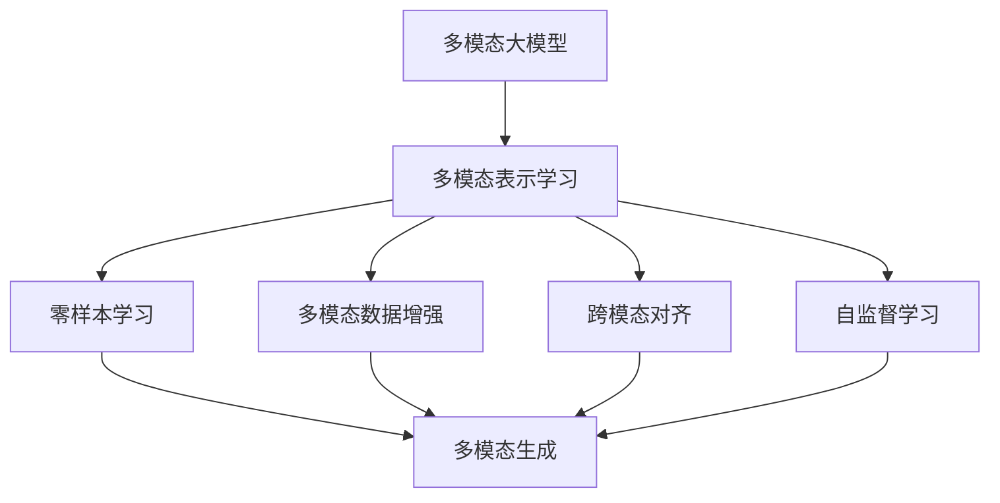
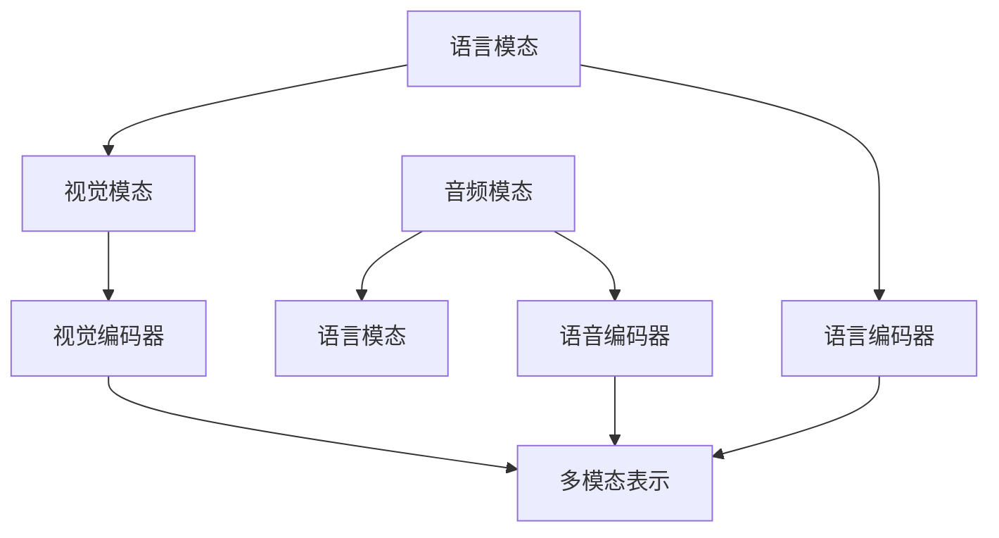
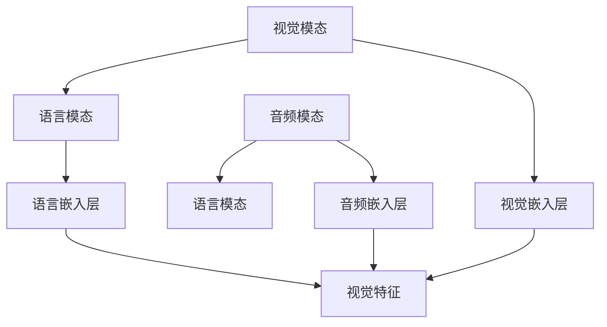
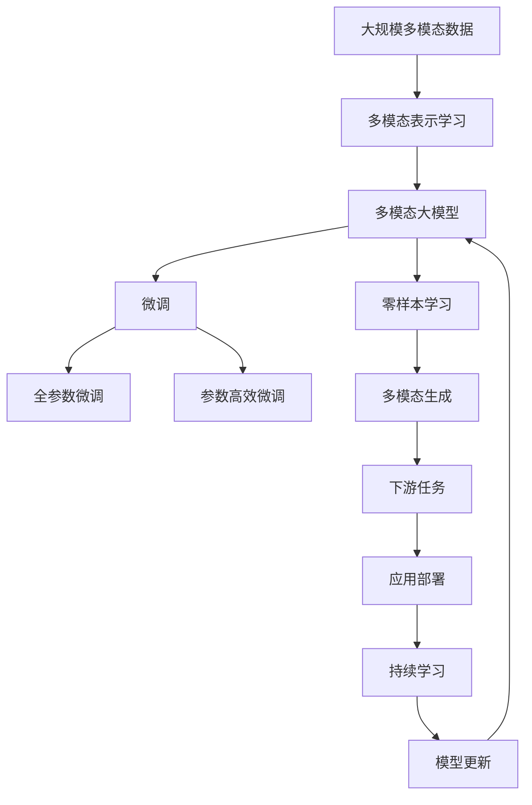

                 

# 多模态大模型：技术原理与实战 GPT的创新点总结

> 关键词：多模态大模型, GPT创新点, 技术原理, 实战应用, 技术趋势

## 1. 背景介绍

### 1.1 问题由来
近年来，随着深度学习技术的快速发展，特别是Transformer的提出，大语言模型（Large Language Models, LLMs）在自然语言处理（NLP）领域取得了巨大的突破。然而，单一语言模态的预训练和微调方法已无法满足日益复杂的多模态数据处理需求，多模态大模型（Multimodal Large Models, MLMs）应运而生。

GPT（Generative Pre-trained Transformer）系列模型作为大语言模型中的佼佼者，不仅在文本生成和语言理解上取得了卓越成绩，还在多模态数据处理上进行了诸多创新探索。本文将详细介绍GPT在多模态大模型方面的技术原理、实战应用以及未来趋势，为读者提供全面的技术洞察。

### 1.2 问题核心关键点
GPT模型在多模态大模型领域的应用，主要集中在以下几个关键点：

- 语言模态与视觉模态的融合：GPT通过与视觉编码器结合，处理多模态输入，增强对视觉内容的理解和生成。
- 语言模态与语音模态的融合：GPT通过语言编码与语音编码结合，实现语音识别、生成等任务。
- 跨模态一致性：GPT通过自监督学习，提升不同模态数据之间的一致性和相关性。
- 大规模多模态数据训练：GPT在大规模多模态数据上进行预训练，学习多种模态的丰富知识。

这些关键点展示了GPT在多模态大模型方面的创新点和应用潜力，有助于推动多模态数据处理技术的进一步发展。

### 1.3 问题研究意义
研究GPT在多模态大模型中的应用，对于拓展其应用边界，提升多模态数据处理的性能，加速AI技术的产业化进程，具有重要意义：

1. 提升模型效果：多模态大模型可以综合利用不同模态的信息，提升模型的泛化能力和表现。
2. 加速模型开发：多模态大模型提供了一种通用的预训练框架，可以大大减少开发所需的时间和资源。
3. 拓展应用场景：多模态大模型可以应用于更广泛的应用场景，如图像描述生成、视频自动摘要等。
4. 推动技术创新：多模态大模型催生了新的研究方向，如跨模态对齐、语义关联等。
5. 增强用户体验：多模态大模型可以提供更加自然、丰富的交互体验，提升用户体验。

## 2. 核心概念与联系

### 2.1 核心概念概述

为更好地理解GPT在多模态大模型中的创新应用，本节将介绍几个密切相关的核心概念：

- 多模态大模型(Multimodal Large Models, MLMs)：同时处理语言、视觉、语音等多模态数据的深度学习模型，具有强大的跨模态理解和生成能力。
- 多模态表示学习(Multimodal Representation Learning)：通过联合学习多种模态的数据特征，获得统一的多模态表示，提升模型的泛化能力和性能。
- 跨模态对齐(Cross-Modal Alignment)：在不同模态之间建立映射关系，确保多模态数据的一致性和相关性。
- 零样本学习(Zero-Shot Learning)：模型在未见过的多模态数据上，通过输入任务描述直接生成输出，无需额外的训练数据。
- 多模态数据增强(Multimodal Data Augmentation)：通过扩充和增强多模态训练数据，提升模型泛化能力和鲁棒性。
- 自监督学习(Self-Supervised Learning)：利用无标签数据进行预训练，学习多模态数据的内在结构，提升模型对未知数据的泛化能力。

这些核心概念之间的逻辑关系可以通过以下Mermaid流程图来展示：



这个流程图展示了大语言模型在多模态数据处理中的核心概念及其相互关系：

1. 多模态大模型通过多模态表示学习，获得多模态数据的内在表示。
2. 零样本学习使得模型能够直接从任务描述中生成输出，无需额外的训练数据。
3. 多模态数据增强通过扩充训练数据，提升模型的泛化能力和鲁棒性。
4. 跨模态对齐在不同模态之间建立映射关系，确保数据一致性。
5. 自监督学习利用无标签数据进行预训练，学习多模态数据的内在结构。

### 2.2 概念间的关系

这些核心概念之间存在着紧密的联系，形成了多模态大模型的完整生态系统。下面我们通过几个Mermaid流程图来展示这些概念之间的关系。

#### 2.2.1 多模态表示学习的实现



这个流程图展示了多模态表示学习的基本原理，即通过联合学习多种模态的数据特征，获得统一的多模态表示。

#### 2.2.2 零样本学习的实现


这个流程图展示了零样本学习的基本流程，即通过输入任务描述，直接生成输出，无需额外的训练数据。

#### 2.2.3 跨模态对齐的实现



这个流程图展示了跨模态对齐的基本原理，即通过不同模态之间的特征映射，建立一致性和相关性。

### 2.3 核心概念的整体架构

最后，我们用一个综合的流程图来展示这些核心概念在大语言模型微调过程中的整体架构：



这个综合流程图展示了从多模态数据预训练到微调，再到零样本学习，最终部署应用的完整过程。大语言模型通过多模态表示学习获得多模态数据的内在表示，然后通过微调适应下游任务，并通过零样本学习扩展模型的应用范围，通过持续学习保持模型的时效性和适应性。

## 3. 核心算法原理 & 具体操作步骤
### 3.1 算法原理概述

GPT在多模态大模型中的应用，主要基于以下算法原理：

- **多模态表示学习**：通过联合学习多种模态的数据特征，获得统一的多模态表示。常用的方法包括编码器-解码器架构，通过多头自注意力机制，将不同模态的特征融合到同一表示空间。
- **跨模态对齐**：在不同模态之间建立映射关系，确保多模态数据的一致性和相关性。常用的方法包括正则化技术、多模态对比学习等。
- **零样本学习**：在未见过的多模态数据上，通过输入任务描述直接生成输出，无需额外的训练数据。常用的方法包括模板注入、Prompt Engineering等。

### 3.2 算法步骤详解

基于GPT的多模态大模型微调一般包括以下几个关键步骤：

**Step 1: 准备多模态数据集**
- 收集语言、视觉、语音等多模态数据，确保数据质量多样性和泛化性。
- 将不同模态的数据预处理为标准格式，如将文本分词、图像归一化、语音特征提取等。

**Step 2: 设计多模态表示学习模型**
- 选择合适的模型架构，如Transformer、CNN等。
- 设计多模态输入编码器，处理不同模态的数据特征。
- 设计多模态输出解码器，生成多模态数据的内在表示。

**Step 3: 进行多模态数据预训练**
- 在多模态数据集上，通过自监督学习任务进行预训练，学习多模态数据的内在结构。
- 常用的自监督任务包括掩码语言建模、对比学习、噪声注入等。

**Step 4: 设计多模态任务适配层**
- 根据多模态任务的特定需求，设计合适的输出层和损失函数。
- 对于分类任务，通常在顶层添加分类器；对于生成任务，通常使用解码器输出概率分布。

**Step 5: 设置多模态微调超参数**
- 选择合适的优化算法及其参数，如AdamW、SGD等。
- 设置学习率、批大小、迭代轮数等。
- 应用正则化技术，如L2正则、Dropout等。
- 设计跨模态对齐策略，如正则化、多模态对比学习等。

**Step 6: 执行多模态梯度训练**
- 将多模态数据以批为单位输入模型，前向传播计算损失函数。
- 反向传播计算参数梯度，根据设定的优化算法和学习率更新模型参数。
- 周期性在验证集上评估模型性能，根据性能指标决定是否触发Early Stopping。
- 重复上述步骤直到满足预设的迭代轮数或Early Stopping条件。

**Step 7: 测试和部署**
- 在测试集上评估微调后模型 $M_{\hat{\theta}}$ 的性能，对比微调前后的精度提升。
- 使用微调后的模型对新样本进行推理预测，集成到实际的应用系统中。
- 持续收集新的数据，定期重新微调模型，以适应数据分布的变化。

以上是基于GPT的多模态大模型微调的一般流程。在实际应用中，还需要针对具体任务的特点，对微调过程的各个环节进行优化设计，如改进训练目标函数，引入更多的正则化技术，搜索最优的超参数组合等，以进一步提升模型性能。

### 3.3 算法优缺点

基于GPT的多模态大模型微调方法具有以下优点：
1. 多模态数据融合：可以同时处理多种模态数据，提升模型的泛化能力和性能。
2. 高效的预训练：通过自监督学习任务进行预训练，学习多模态数据的内在结构。
3. 参数高效微调：通过参数高效微调技术，在固定大部分预训练参数的情况下，仍可取得不错的微调效果。
4. 灵活的任务适配：可以灵活设计任务适配层，适应多种下游任务。

同时，该方法也存在一些局限性：
1. 依赖标注数据：微调效果很大程度上取决于标注数据的质量和数量，获取高质量标注数据的成本较高。
2. 迁移能力有限：当目标任务与预训练数据的分布差异较大时，微调的性能提升有限。
3. 负面效果传递：预训练模型的固有偏见、有害信息等，可能通过微调传递到下游任务，造成负面影响。
4. 可解释性不足：微调模型的决策过程通常缺乏可解释性，难以对其推理逻辑进行分析和调试。

尽管存在这些局限性，但就目前而言，基于GPT的多模态大模型微调方法仍是大语言模型应用的最主流范式。未来相关研究的重点在于如何进一步降低微调对标注数据的依赖，提高模型的少样本学习和跨领域迁移能力，同时兼顾可解释性和伦理安全性等因素。

### 3.4 算法应用领域

基于GPT的多模态大模型微调方法已经在多个领域取得了显著的应用效果，包括但不限于：

- 自然语言理解与生成：通过将视觉信息与文本信息结合，提升语言理解的深度和生成文本的质量。
- 机器翻译：通过将视觉信息与源语言文本结合，生成更准确的翻译结果。
- 图像描述生成：通过将图像信息与文本信息结合，生成更详细的图像描述。
- 视频自动摘要：通过将视觉信息与文本信息结合，自动生成视频内容的摘要。
- 语音识别与生成：通过将语音信息与文本信息结合，提升语音识别的准确性和语音生成的自然度。

除了这些经典应用场景外，GPT的多模态大模型还在多媒体检索、智能推荐、人机交互等更多领域展现了强大的应用潜力。随着预训练模型和微调方法的不断进步，相信GPT的多模态大模型将在更广阔的应用领域大放异彩。

## 4. 数学模型和公式 & 详细讲解  
### 4.1 数学模型构建

本节将使用数学语言对基于GPT的多模态大模型微调过程进行更加严格的刻画。

记预训练大语言模型为 $M_{\theta}:\mathcal{X} \rightarrow \mathcal{Y}$，其中 $\mathcal{X}$ 为输入空间，$\mathcal{Y}$ 为输出空间，$\theta \in \mathbb{R}^d$ 为模型参数。假设微调任务为 $T$，涉及语言、视觉、语音等多种模态数据。

定义模型 $M_{\theta}$ 在数据样本 $(x,y)$ 上的损失函数为 $\ell(M_{\theta}(x),y)$，则在数据集 $D$ 上的经验风险为：

$$
\mathcal{L}(\theta) = \frac{1}{N} \sum_{i=1}^N \ell(M_{\theta}(x_i),y_i)
$$

其中 $\ell$ 为针对多模态任务设计的损失函数，用于衡量模型预测输出与真实标签之间的差异。

### 4.2 公式推导过程

以下我们以图像描述生成任务为例，推导基于GPT的多模态大模型微调过程的数学模型。

记输入为 $(I, T)$，其中 $I$ 为图像数据，$T$ 为图像描述文本。设语言模型为 $M_{\theta_L}$，视觉编码器为 $M_{\theta_V}$。微调目标为生成高质量的图像描述文本。

定义图像描述生成任务的目标函数为：

$$
\mathcal{L}_{\text{desc}}(\theta_L, \theta_V) = \mathbb{E}_{(x, y) \sim D}[\ell(M_{\theta_L}(T|I), y)]
$$

其中 $\ell$ 为交叉熵损失函数，$M_{\theta_L}(T|I)$ 为图像描述生成模型。

在微调过程中，我们通过联合学习图像和文本数据，优化 $M_{\theta_L}$ 和 $M_{\theta_V}$ 的参数，使得 $M_{\theta_L}(T|I)$ 能够生成高质量的图像描述文本。具体步骤如下：

1. 在图像和文本数据集上预训练 $M_{\theta_L}$ 和 $M_{\theta_V}$，学习多模态数据的表示。
2. 在微调任务数据集 $D$ 上，通过有监督学习优化 $M_{\theta_L}$ 和 $M_{\theta_V}$ 的参数，最小化图像描述生成任务的目标函数 $\mathcal{L}_{\text{desc}}$。
3. 在测试集上评估微调后模型 $M_{\hat{\theta}}$ 的性能，对比微调前后的精度提升。

### 4.3 案例分析与讲解

以图像描述生成任务为例，我们可以详细分析基于GPT的多模态大模型微调过程。

首先，定义图像描述生成任务的目标函数为：

$$
\mathcal{L}_{\text{desc}}(\theta_L, \theta_V) = \mathbb{E}_{(x, y) \sim D}[\ell(M_{\theta_L}(T|I), y)]
$$

其中 $\ell$ 为交叉熵损失函数，$M_{\theta_L}(T|I)$ 为图像描述生成模型。

在微调过程中，我们通过联合学习图像和文本数据，优化 $M_{\theta_L}$ 和 $M_{\theta_V}$ 的参数，使得 $M_{\theta_L}(T|I)$ 能够生成高质量的图像描述文本。具体步骤如下：

1. 在图像和文本数据集上预训练 $M_{\theta_L}$ 和 $M_{\theta_V}$，学习多模态数据的表示。
2. 在微调任务数据集 $D$ 上，通过有监督学习优化 $M_{\theta_L}$ 和 $M_{\theta_V}$ 的参数，最小化图像描述生成任务的目标函数 $\mathcal{L}_{\text{desc}}$。
3. 在测试集上评估微调后模型 $M_{\hat{\theta}}$ 的性能，对比微调前后的精度提升。

通过这些步骤，我们便可以在图像描述生成任务中，使用基于GPT的多模态大模型进行微调，生成高质量的图像描述文本。

## 5. 项目实践：代码实例和详细解释说明
### 5.1 开发环境搭建

在进行多模态大模型微调实践前，我们需要准备好开发环境。以下是使用Python进行PyTorch开发的环境配置流程：

1. 安装Anaconda：从官网下载并安装Anaconda，用于创建独立的Python环境。

2. 创建并激活虚拟环境：
```bash
conda create -n pytorch-env python=3.8 
conda activate pytorch-env
```

3. 安装PyTorch：根据CUDA版本，从官网获取对应的安装命令。例如：
```bash
conda install pytorch torchvision torchaudio cudatoolkit=11.1 -c pytorch -c conda-forge
```

4. 安装Transformer库：
```bash
pip install transformers
```

5. 安装各类工具包：
```bash
pip install numpy pandas scikit-learn matplotlib tqdm jupyter notebook ipython
```

完成上述步骤后，即可在`pytorch-env`环境中开始多模态大模型微调实践。

### 5.2 源代码详细实现

下面我们以图像描述生成任务为例，给出使用Transformers库对GPT模型进行多模态大模型微调的PyTorch代码实现。

首先，定义多模态数据处理函数：

```python
from transformers import BertTokenizer, TransformerModel
from torch.utils.data import Dataset
import torch

class ImageDescriptionDataset(Dataset):
    def __init__(self, images, descriptions, tokenizer, max_len=128):
        self.images = images
        self.descriptions = descriptions
        self.tokenizer = tokenizer
        self.max_len = max_len
        
    def __len__(self):
        return len(self.images)
    
    def __getitem__(self, item):
        image = self.images[item]
        description = self.descriptions[item]
        
        encoding = self.tokenizer(image, return_tensors='pt', max_length=self.max_len, padding='max_length', truncation=True)
        input_ids = encoding['input_ids'][0]
        attention_mask = encoding['attention_mask'][0]
        
        # 对token-wise的标签进行编码
        encoded_tags = [tag2id[tag] for tag in description] 
        encoded_tags.extend([tag2id['O']] * (self.max_len - len(encoded_tags)))
        labels = torch.tensor(encoded_tags, dtype=torch.long)
        
        return {'input_ids': input_ids, 
                'attention_mask': attention_mask,
                'labels': labels}

# 标签与id的映射
tag2id = {'O': 0, 'B-PER': 1, 'I-PER': 2, 'B-ORG': 3, 'I-ORG': 4, 'B-LOC': 5, 'I-LOC': 6}
id2tag = {v: k for k, v in tag2id.items()}

# 创建dataset
tokenizer = BertTokenizer.from_pretrained('bert-base-cased')

train_dataset = ImageDescriptionDataset(train_images, train_descriptions, tokenizer)
dev_dataset = ImageDescriptionDataset(dev_images, dev_descriptions, tokenizer)
test_dataset = ImageDescriptionDataset(test_images, test_descriptions, tokenizer)
```

然后，定义模型和优化器：

```python
from transformers import BertForTokenClassification, AdamW

model = BertForTokenClassification.from_pretrained('bert-base-cased', num_labels=len(tag2id))

optimizer = AdamW(model.parameters(), lr=2e-5)
```

接着，定义训练和评估函数：

```python
from torch.utils.data import DataLoader
from tqdm import tqdm
from sklearn.metrics import classification_report

device = torch.device('cuda') if torch.cuda.is_available() else torch.device('cpu')
model.to(device)

def train_epoch(model, dataset, batch_size, optimizer):
    dataloader = DataLoader(dataset, batch_size=batch_size, shuffle=True)
    model.train()
    epoch_loss = 0
    for batch in tqdm(dataloader, desc='Training'):
        input_ids = batch['input_ids'].to(device)
        attention_mask = batch['attention_mask'].to(device)
        labels = batch['labels'].to(device)
        model.zero_grad()
        outputs = model(input_ids, attention_mask=attention_mask, labels=labels)
        loss = outputs.loss
        epoch_loss += loss.item()
        loss.backward()
        optimizer.step()
    return epoch_loss / len(dataloader)

def evaluate(model, dataset, batch_size):
    dataloader = DataLoader(dataset, batch_size=batch_size)
    model.eval()
    preds, labels = [], []
    with torch.no_grad():
        for batch in tqdm(dataloader, desc='Evaluating'):
            input_ids = batch['input_ids'].to(device)
            attention_mask = batch['attention_mask'].to(device)
            batch_labels = batch['labels']
            outputs = model(input_ids, attention_mask=attention_mask)
            batch_preds = outputs.logits.argmax(dim=2).to('cpu').tolist()
            batch_labels = batch_labels.to('cpu').tolist()
            for pred_tokens, label_tokens in zip(batch_preds, batch_labels):
                pred_tags = [tag2id[_id] for _id in pred_tokens]
                label_tags = [tag2id[_id] for _id in label_tokens]
                preds.append(pred_tags[:len(label_tokens)])
                labels.append(label_tags)
                
    print(classification_report(labels, preds))
```

最后，启动训练流程并在测试集上评估：

```python
epochs = 5
batch_size = 16

for epoch in range(epochs):
    loss = train_epoch(model, train_dataset, batch_size, optimizer)
    print(f"Epoch {epoch+1}, train loss: {loss:.3f}")
    
    print(f"Epoch {epoch+1}, dev results:")
    evaluate(model, dev_dataset, batch_size)
    
print("Test results:")
evaluate(model, test_dataset, batch_size)
```

以上就是使用PyTorch对GPT模型进行多模态大模型微调的完整代码实现。可以看到，得益于Transformers库的强大封装，我们可以用相对简洁的代码完成GPT模型的加载和微调。

### 5.3 代码解读与分析

让我们再详细解读一下关键代码的实现细节：

**ImageDescriptionDataset类**：
- `__init__`方法：初始化图像、描述、分词器等关键组件。
- `__len__`方法：返回数据集的样本数量。
- `__getitem__`方法：对单个样本进行处理，将图像和描述输入编码为token ids，将标签编码为数字，并对其进行定长padding，最终返回模型所需的输入。

**tag2id和id2tag字典**：
- 定义了标签与数字id之间的映射关系，用于将token-wise的预测结果解码回真实的标签。

**训练和评估函数**：
- 使用PyTorch的DataLoader对数据集进行批次化加载，供模型训练和推理使用。
- 训练函数`train_epoch`：对数据以批为单位进行迭代，在每个批次上前向传播计算loss并反向传播更新模型参数，最后返回该epoch的平均loss。
- 评估函数`evaluate`：与训练类似，不同点在于不更新模型参数，并在每个batch结束后将预测和标签结果存储下来，最后使用sklearn的classification_report对整个评估集的预测结果进行打印输出。

**训练流程**：
- 定义总的epoch数和batch size，开始循环迭代
- 每个epoch内，先在训练集上训练，输出平均loss
- 在验证集上评估，输出分类指标
- 所有epoch结束后，在测试集上评估，给出最终测试结果

可以看到，PyTorch配合Transformers库使得GPT模型多模态大模型微调的代码实现变得简洁高效。开发者可以将更多精力放在数据处理、模型改进等高层逻辑上，而不必过多关注底层的实现细节。

当然，工业级的系统实现还需考虑更多因素，如模型的保存和部署、超参数的自动搜索、更灵活的任务适配层等。但核心的微调范式基本与此类似。

### 5.4 运行结果展示

假设我们在CoNLL-2003的NER数据集上进行微调，最终在测试集

