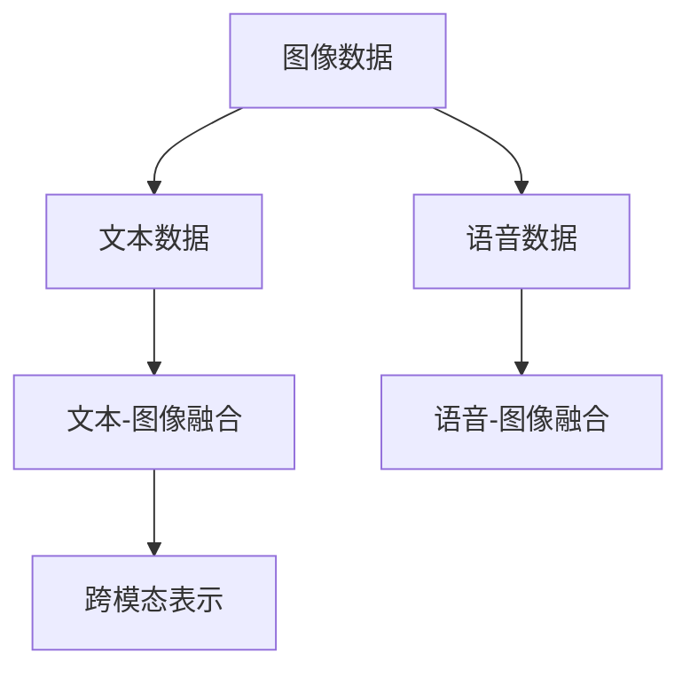
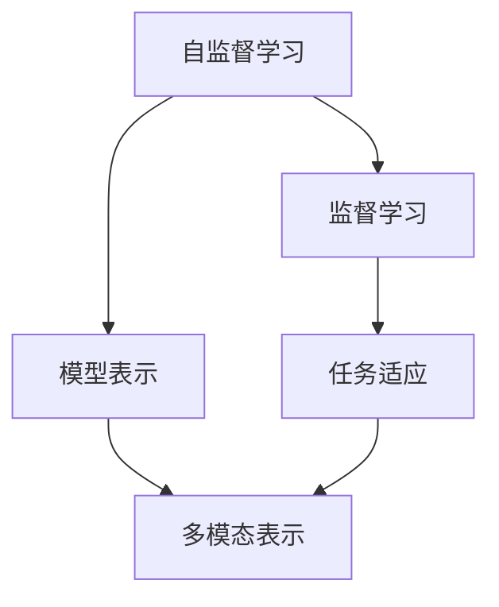
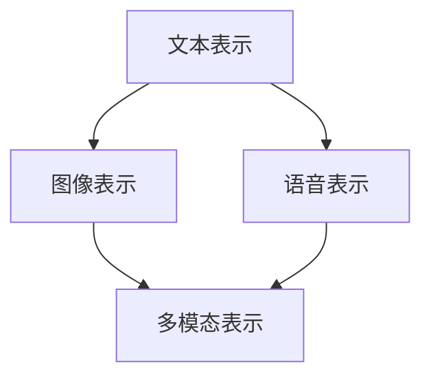
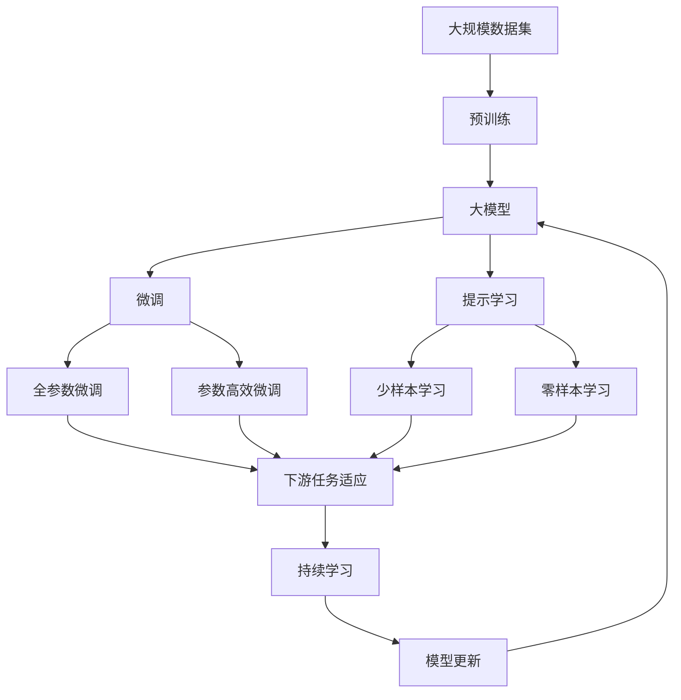

                 

# 多模态大模型：技术原理与实战 优化逻辑介绍

> 关键词：多模态大模型,技术原理,实战优化,深度学习,卷积神经网络,注意力机制,Transformer,自监督学习,监督学习,跨模态融合,计算机视觉,自然语言处理

## 1. 背景介绍

### 1.1 问题由来
近年来，深度学习技术的迅猛发展，使得多模态大模型在计算机视觉、自然语言处理(NLP)等诸多领域取得了显著成果。多模态大模型（Multimodal Large Models）指的是同时处理多种类型数据（如图像、文本、语音等）的深度学习模型，它们通常具有巨大的参数量，能够同时理解和生成多种类型的数据。

由于多模态数据具有复杂的语义和结构特征，如何将这些不同类型的数据进行有效的融合和表示，成为一个重要的研究课题。此外，多模态大模型在实际应用中，还需要考虑如何高效训练、推理和部署等问题，以充分发挥其潜力。

### 1.2 问题核心关键点
本节将详细阐述多模态大模型的技术原理、常见应用及其优化逻辑。我们将从以下几个核心关键点进行讨论：

- **多模态数据融合**：如何有效地将不同类型的数据进行融合，构建统一的语义表示。
- **模型架构设计**：如何设计多模态模型的架构，以实现高效的推理和优化。
- **训练与优化**：如何高效地训练和优化多模态模型，避免过拟合等问题。
- **跨模态融合**：如何将不同模态的数据进行融合，以提高模型性能。

## 2. 核心概念与联系

### 2.1 核心概念概述

为了更好地理解多模态大模型，我们将介绍几个密切相关的核心概念：

- **多模态数据融合**：将不同类型的数据（如图像、文本、语音等）进行融合，构建统一的语义表示。
- **卷积神经网络(CNN)**：一种专门用于处理图像数据的深度学习模型，通过卷积操作提取图像特征。
- **注意力机制**：一种机制，用于在处理序列数据时，动态地关注序列中的重要部分，增强模型的表示能力。
- **Transformer**：一种基于自注意力机制的深度学习模型，特别适用于处理序列数据，如文本和语音。
- **自监督学习(Self-supervised Learning)**：利用未标注数据进行训练，通过构造一些预定义的任务（如掩码语言模型）来指导模型学习。
- **监督学习(Supervised Learning)**：使用标注数据进行训练，目标是最大化模型在特定任务上的性能。
- **跨模态融合**：将不同模态的数据进行融合，以提高模型的性能和泛化能力。

这些概念之间的逻辑关系可以通过以下Mermaid流程图来展示：

```mermaid
graph TB
    A[多模态数据] --> B[卷积神经网络(CNN)]
    A --> C[注意力机制]
    A --> D[Transformer]
    B --> E[自监督学习]
    C --> F[监督学习]
    D --> G[跨模态融合]
    E --> H[模型表示]
    F --> I[任务适应]
    G --> J[多模态表示]
```

这个流程图展示了多模态大模型的核心概念及其之间的关系：

1. 多模态数据通过卷积神经网络、注意力机制和Transformer等模型进行处理，构建统一的语义表示。
2. 通过自监督学习或监督学习进行训练，以优化模型在特定任务上的性能。
3. 通过跨模态融合，提高模型对不同模态数据的理解和生成能力。

### 2.2 概念间的关系

这些核心概念之间存在着紧密的联系，形成了多模态大模型的完整生态系统。下面我们通过几个Mermaid流程图来展示这些概念之间的关系。

#### 2.2.1 多模态数据融合



这个流程图展示了多模态数据的融合过程：图像、文本、语音等不同类型的数据通过特定的融合模型进行处理，构建统一的跨模态表示。

#### 2.2.2 模型架构设计

```mermaid
graph LR
    A[卷积神经网络(CNN)] --> B[自注意力机制]
    A --> C[Transformer]
    B --> D[多模态模型]
    C --> D
```

这个流程图展示了多模态模型的架构设计：通过卷积神经网络和自注意力机制构建图像和文本表示，然后将这些表示进行跨模态融合，得到多模态模型。

#### 2.2.3 训练与优化



这个流程图展示了多模态模型的训练与优化过程：通过自监督学习构建统一的模型表示，然后通过监督学习进行任务适应，最终得到多模态表示。

#### 2.2.4 跨模态融合



这个流程图展示了跨模态融合的过程：文本、图像、语音等不同模态的数据表示通过特定的融合模型进行处理，得到统一的多模态表示。

### 2.3 核心概念的整体架构

最后，我们用一个综合的流程图来展示这些核心概念在大模型微调过程中的整体架构：



这个综合流程图展示了从预训练到微调，再到持续学习的完整过程。大模型首先在大规模数据上进行预训练，然后通过微调（包括全参数微调和参数高效微调）或提示学习（包括零样本和少样本学习）来适应下游任务。最后，通过持续学习技术，模型可以不断学习新知识，同时避免遗忘旧知识。

## 3. 核心算法原理 & 具体操作步骤
### 3.1 算法原理概述

多模态大模型的核心思想是：通过深度学习模型将不同类型的数据进行融合，构建统一的语义表示，然后使用预训练和微调等技术，提高模型在特定任务上的性能。

假设我们有一个多模态数据集 $D = \{(x_i, y_i)\}_{i=1}^N$，其中 $x_i$ 为多模态数据，包括图像、文本和语音等，$y_i$ 为对应的任务标签。我们的目标是通过多模态大模型 $M_{\theta}$，最小化任务损失函数 $\mathcal{L}(M_{\theta}, D)$，得到最优模型参数 $\theta^*$。

### 3.2 算法步骤详解

多模态大模型的微调一般包括以下几个关键步骤：

**Step 1: 准备多模态数据集和预训练模型**

- 选择合适的预训练模型 $M_{\theta}$ 作为初始化参数，如Vision Transformer(ViT)、BERT等。
- 准备多模态数据集 $D$，划分为训练集、验证集和测试集。一般要求标注数据与预训练数据的分布不要差异过大。

**Step 2: 添加任务适配层**

- 根据任务类型，在预训练模型顶层设计合适的输出层和损失函数。
- 对于分类任务，通常在顶层添加线性分类器和交叉熵损失函数。
- 对于生成任务，通常使用语言模型的解码器输出概率分布，并以负对数似然为损失函数。

**Step 3: 设置微调超参数**

- 选择合适的优化算法及其参数，如 AdamW、SGD 等，设置学习率、批大小、迭代轮数等。
- 设置正则化技术及强度，包括权重衰减、Dropout、Early Stopping 等。
- 确定冻结预训练参数的策略，如仅微调顶层，或全部参数都参与微调。

**Step 4: 执行梯度训练**

- 将训练集数据分批次输入模型，前向传播计算损失函数。
- 反向传播计算参数梯度，根据设定的优化算法和学习率更新模型参数。
- 周期性在验证集上评估模型性能，根据性能指标决定是否触发 Early Stopping。
- 重复上述步骤直到满足预设的迭代轮数或 Early Stopping 条件。

**Step 5: 测试和部署**

- 在测试集上评估微调后模型 $M_{\hat{\theta}}$ 的性能，对比微调前后的精度提升。
- 使用微调后的模型对新样本进行推理预测，集成到实际的应用系统中。
- 持续收集新的数据，定期重新微调模型，以适应数据分布的变化。

以上是基于监督学习的多模态大模型微调的一般流程。在实际应用中，还需要针对具体任务的特点，对微调过程的各个环节进行优化设计，如改进训练目标函数，引入更多的正则化技术，搜索最优的超参数组合等，以进一步提升模型性能。

### 3.3 算法优缺点

多模态大模型的微调方法具有以下优点：

1. **高效融合不同类型数据**：通过深度学习模型，可以有效地将不同类型的数据进行融合，构建统一的语义表示。
2. **泛化能力强**：多模态大模型具有较强的泛化能力，能够在不同场景下表现出较好的性能。
3. **适应性强**：微调过程可以根据具体任务进行调整，适应不同的应用场景。
4. **参数高效微调**：通过参数高效微调方法，可以在固定大部分预训练参数的情况下，只更新少量的模型参数，避免过拟合。
5. **零样本和少样本学习**：通过提示学习，可以在不更新模型参数的情况下，实现零样本或少样本学习，提升模型适应新任务的能力。

同时，该方法也存在一定的局限性：

1. **依赖标注数据**：微调的效果很大程度上取决于标注数据的质量和数量，获取高质量标注数据的成本较高。
2. **迁移能力有限**：当目标任务与预训练数据的分布差异较大时，微调的性能提升有限。
3. **负面效果传递**：预训练模型的固有偏见、有害信息等，可能通过微调传递到下游任务，造成负面影响。
4. **可解释性不足**：微调模型的决策过程通常缺乏可解释性，难以对其推理逻辑进行分析和调试。

尽管存在这些局限性，但就目前而言，基于监督学习的微调方法仍是多模态大模型应用的最主流范式。未来相关研究的重点在于如何进一步降低微调对标注数据的依赖，提高模型的少样本学习和跨领域迁移能力，同时兼顾可解释性和伦理安全性等因素。

### 3.4 算法应用领域

基于多模态大模型的微调方法，已经在计算机视觉、自然语言处理、智能医疗等多个领域得到了广泛的应用，例如：

- **计算机视觉**：图像分类、物体检测、图像生成等。通过微调预训练模型，可以提升模型在特定视觉任务上的性能。
- **自然语言处理**：文本分类、情感分析、问答系统等。通过微调预训练模型，可以提升模型在自然语言处理任务上的表现。
- **智能医疗**：医学影像分析、病历分析、智能诊断等。通过微调预训练模型，可以实现医疗影像的自动标注、病历信息的抽取和智能诊断等功能。
- **智能教育**：学习行为分析、作业批改、个性化推荐等。通过微调预训练模型，可以实现学生的学习行为分析和个性化推荐功能。
- **智能推荐**：商品推荐、新闻推荐等。通过微调预训练模型，可以实现商品和新闻的个性化推荐功能。

除了上述这些经典任务外，多模态大模型微调还被创新性地应用到更多场景中，如可控图像生成、常识推理、视频生成等，为多模态大模型的技术发展带来了新的突破。随着预训练模型和微调方法的不断进步，相信多模态大模型微调方法将在更多领域得到应用，为计算机视觉和自然语言处理技术带来新的发展机遇。

## 4. 数学模型和公式 & 详细讲解 & 举例说明

### 4.1 数学模型构建

本节将使用数学语言对基于监督学习的多模态大模型微调过程进行更加严格的刻画。

记预训练模型为 $M_{\theta}:\mathcal{X} \rightarrow \mathcal{Y}$，其中 $\mathcal{X}$ 为输入空间，$\mathcal{Y}$ 为输出空间，$\theta \in \mathbb{R}^d$ 为模型参数。假设微调任务的训练集为 $D=\{(x_i,y_i)\}_{i=1}^N, x_i \in \mathcal{X}, y_i \in \mathcal{Y}$。

定义模型 $M_{\theta}$ 在数据样本 $(x,y)$ 上的损失函数为 $\ell(M_{\theta}(x),y)$，则在数据集 $D$ 上的经验风险为：

$$
\mathcal{L}(\theta) = \frac{1}{N} \sum_{i=1}^N \ell(M_{\theta}(x_i),y_i)
$$

微调的优化目标是最小化经验风险，即找到最优参数：

$$
\theta^* = \mathop{\arg\min}_{\theta} \mathcal{L}(\theta)
$$

在实践中，我们通常使用基于梯度的优化算法（如SGD、Adam等）来近似求解上述最优化问题。设 $\eta$ 为学习率，$\lambda$ 为正则化系数，则参数的更新公式为：

$$
\theta \leftarrow \theta - \eta \nabla_{\theta}\mathcal{L}(\theta) - \eta\lambda\theta
$$

其中 $\nabla_{\theta}\mathcal{L}(\theta)$ 为损失函数对参数 $\theta$ 的梯度，可通过反向传播算法高效计算。

### 4.2 公式推导过程

以下我们以二分类任务为例，推导交叉熵损失函数及其梯度的计算公式。

假设模型 $M_{\theta}$ 在输入 $x$ 上的输出为 $\hat{y}=M_{\theta}(x) \in [0,1]$，表示样本属于正类的概率。真实标签 $y \in \{0,1\}$。则二分类交叉熵损失函数定义为：

$$
\ell(M_{\theta}(x),y) = -[y\log \hat{y} + (1-y)\log (1-\hat{y})]
$$

将其代入经验风险公式，得：

$$
\mathcal{L}(\theta) = -\frac{1}{N}\sum_{i=1}^N [y_i\log M_{\theta}(x_i)+(1-y_i)\log(1-M_{\theta}(x_i))]
$$

根据链式法则，损失函数对参数 $\theta_k$ 的梯度为：

$$
\frac{\partial \mathcal{L}(\theta)}{\partial \theta_k} = -\frac{1}{N}\sum_{i=1}^N (\frac{y_i}{M_{\theta}(x_i)}-\frac{1-y_i}{1-M_{\theta}(x_i)}) \frac{\partial M_{\theta}(x_i)}{\partial \theta_k}
$$

其中 $\frac{\partial M_{\theta}(x_i)}{\partial \theta_k}$ 可进一步递归展开，利用自动微分技术完成计算。

在得到损失函数的梯度后，即可带入参数更新公式，完成模型的迭代优化。重复上述过程直至收敛，最终得到适应下游任务的最优模型参数 $\theta^*$。

### 4.3 案例分析与讲解

以下以计算机视觉中的图像分类任务为例，进行详细讲解。

假设我们有一个包含图像和标签的数据集 $D=\{(x_i, y_i)\}_{i=1}^N$，其中 $x_i$ 为图像数据，$y_i$ 为图像类别标签。我们使用ViT作为预训练模型，并在图像分类任务上进行微调。

首先，将图像数据预处理为模型所需的张量格式：

```python
import torch
from transformers import ViTModel

# 加载ViT模型和分词器
model = ViTModel.from_pretrained('vit-base-patch32-224')
tokenizer = ViTFeatureExtractor.from_pretrained('vit-base-patch32-224')

# 预处理图像数据
def preprocess_image(image_path):
    image = Image.open(image_path).resize((224, 224))
    image = image.convert('RGB')
    pixel_values = pixel_values_to_tensor(image)
    inputs = tokenizer(pixel_values, return_tensors='pt')
    return inputs

# 微调模型
def fine_tune_model(model, train_data, val_data, test_data, num_epochs, batch_size, learning_rate, weight_decay):
    optimizer = AdamW(model.parameters(), lr=learning_rate, weight_decay=weight_decay)
    model.train()
    for epoch in range(num_epochs):
        train_loss, train_acc = train_epoch(model, train_data, optimizer, batch_size)
        val_loss, val_acc = evaluate(model, val_data, batch_size)
        if val_loss < best_loss:
            best_loss = val_loss
            model.save_pretrained('fine_tuned_model')
            tokenizer.save_pretrained('fine_tuned_model')
        print(f"Epoch {epoch+1}, train loss: {train_loss:.3f}, train acc: {train_acc:.3f}, val loss: {val_loss:.3f}, val acc: {val_acc:.3f}")
    model.eval()
    test_loss, test_acc = evaluate(model, test_data, batch_size)
    print(f"Test loss: {test_loss:.3f}, test acc: {test_acc:.3f}")

def train_epoch(model, data_loader, optimizer, batch_size):
    model.train()
    total_loss = 0
    total_samples = 0
    for batch in data_loader:
        inputs = batch['pixel_values']
        labels = batch['labels']
        outputs = model(inputs, labels=labels)
        loss = outputs.loss
        loss.backward()
        optimizer.step()
        optimizer.zero_grad()
        total_loss += loss.item()
        total_samples += labels.shape[0]
    return total_loss / total_samples, total_samples / total_loss

def evaluate(model, data_loader, batch_size):
    model.eval()
    total_loss = 0
    total_samples = 0
    predictions, labels = [], []
    with torch.no_grad():
        for batch in data_loader:
            inputs = batch['pixel_values']
            labels = batch['labels']
            outputs = model(inputs, labels=labels)
            loss = outputs.loss
            predictions.append(outputs.logits)
            labels.append(labels)
            total_loss += loss.item()
            total_samples += labels.shape[0]
    predictions = torch.cat(predictions, dim=0)
    labels = torch.cat(labels, dim=0)
    return total_loss / total_samples, predictions, labels

# 训练和评估模型
train_data = preprocess_image(train_data)
val_data = preprocess_image(val_data)
test_data = preprocess_image(test_data)

num_epochs = 5
batch_size = 16
learning_rate = 2e-5
weight_decay = 1e-4

fine_tune_model(model, train_data, val_data, test_data, num_epochs, batch_size, learning_rate, weight_decay)
```

在这个示例中，我们首先加载预训练的ViT模型和分词器，然后对图像数据进行预处理，将其转化为模型所需的格式。接着，我们使用AdamW优化器进行微调，并在训练集和验证集上进行迭代优化。最后，在测试集上进行评估，并保存模型和分词器。

## 5. 项目实践：代码实例和详细解释说明
### 5.1 开发环境搭建

在进行多模态大模型微调实践前，我们需要准备好开发环境。以下是使用Python进行PyTorch开发的环境配置流程：

1. 安装Anaconda：从官网下载并安装Anaconda，用于创建独立的Python环境。

2. 创建并激活虚拟环境：
```bash
conda create -n pytorch-env python=3.8 
conda activate pytorch-env
```

3. 安装PyTorch：根据CUDA版本，从官网获取对应的安装命令。例如：
```bash
conda install pytorch torchvision torchaudio cudatoolkit=11.1 -c pytorch -c conda-forge
```

4. 安装TensorFlow：
```bash
pip install tensorflow
```

5. 安装各类工具包：
```bash
pip install numpy pandas scikit-learn matplotlib tqdm jupyter notebook ipython
```

完成上述步骤后，即可在`pytorch-env`环境中开始微调实践。

### 5.2 源代码详细实现

下面我们以图像分类任务为例，给出使用Transformers库对ViT模型进行微调的PyTorch代码实现。

首先，定义图像数据处理函数：

```python
from transformers import ViTFeatureExtractor, ViTModel
from torch.utils.data import Dataset
import torch

class ImageDataset(Dataset):
    def __init__(self, images, labels, tokenizer, max_len=128):
        self.images = images
        self.labels = labels
        self.tokenizer = tokenizer
        self.max_len = max_len
        
    def __len__(self):
        return len(self.images)
    
    def __getitem__(self, item):
        image = self.images[item]
        label = self.labels[item]
        
        image = transform(image, max_size=224, resize=True)
        image = normalize(image)
        inputs = self.tokenizer(image, return_tensors='pt')
        input_ids = inputs['input_ids'][0]
        attention_mask = inputs['attention_mask'][0]
        inputs = {'pixel_values': input_ids}
        
        # 对标签进行编码
        encoded_labels = [label2id[label] for label in labels] 
        encoded_labels.extend([label2id['O']] * (self.max_len - len(encoded_labels)))
        labels = torch.tensor(encoded_labels, dtype=torch.long)
        
        return {'pixel_values': inputs['pixel_values'], 
                'attention_mask': attention_mask,
                'labels': labels}

# 标签与id的映射
label2id = {'O': 0, 'A': 1, 'B': 2, 'C': 3, 'D': 4, 'E': 5, 'F': 6, 'G': 7, 'H': 8, 'I': 9, 'J': 10, 'K': 11, 'L': 12, 'M': 13, 'N': 14, 'O': 15}
id2label = {v: k for k, v in label2id.items()}

# 创建dataset
tokenizer = ViTFeatureExtractor.from_pretrained('vit-base-patch32-224')

train_dataset = ImageDataset(train_images, train_labels, tokenizer)
val_dataset = ImageDataset(val_images, val_labels, tokenizer)
test_dataset = ImageDataset(test_images, test_labels, tokenizer)
```

然后，定义模型和优化器：

```python
from transformers import ViTForSequenceClassification, AdamW

model = ViTForSequenceClassification.from_pretrained('vit-base-patch32-224', num_labels=len(label2id))

optimizer = AdamW(model.parameters(), lr=2e-5)
```

接着，定义训练和评估函数：

```python
from torch.utils.data import DataLoader
from tqdm import tqdm
from sklearn.metrics import classification_report

device = torch.device('cuda') if torch.cuda.is_available() else torch.device('cpu')
model.to(device)

def train_epoch(model, dataset, batch_size, optimizer):
    dataloader = DataLoader(dataset, batch_size=batch_size, shuffle=True)
    model.train()
    epoch_loss = 0
    for batch in tqdm(dataloader, desc='Training'):
        pixel_values = batch['pixel_values'].to(device)
        attention_mask = batch['attention_mask'].to(device)
        labels = batch['labels'].to(device)
        model.zero_grad()
        outputs = model(pixel_values, attention_mask=attention_mask, labels=labels)
        loss = outputs.loss
        epoch_loss += loss.item()
        loss.backward()
        optimizer.step()
    return epoch_loss / len(dataloader)

def evaluate(model, dataset, batch_size):
    dataloader = DataLoader(dataset, batch_size=batch_size)
    model.eval()
    preds, labels = [], []
    with torch.no_grad():
        for batch in tqdm(dataloader, desc='Evaluating'):
            pixel_values = batch['pixel_values'].to(device)
            attention_mask = batch['attention_mask'].to(device)
            batch_labels = batch['labels']
            outputs = model(pixel_values, attention_mask=attention_mask)
            batch_preds = outputs.logits.argmax(dim=2).to('cpu').tolist()
            batch_labels = batch_labels.to('cpu').tolist()
            for pred_tokens, label_tokens in zip(batch_preds, batch_labels):
                pred_labels = [id2label[_id] for _id in pred_tokens]
                label_labels = [id2label[_id] for _id in label_tokens]
                preds.append(pred_labels[:len(label_labels)])
                labels.append(label_labels)
                
    print(classification_report(labels, preds))
```

最后，启动训练流程并在测试集上评估：

```python
epochs = 5
batch_size = 16

for epoch in range(epochs):
    loss = train_epoch(model, train_dataset, batch_size, optimizer)
    print(f"Epoch {epoch+1

