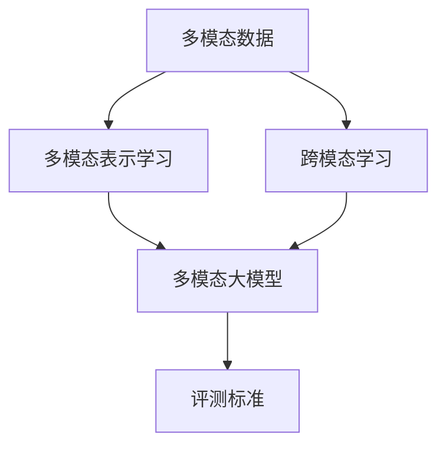
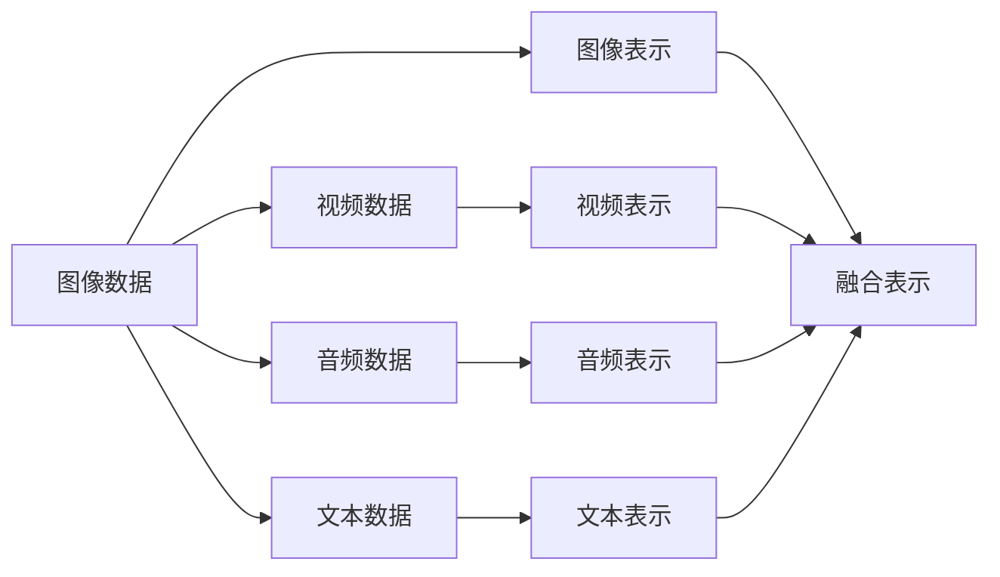
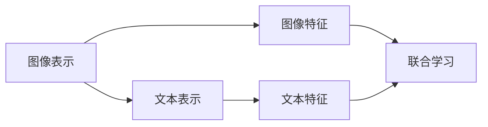
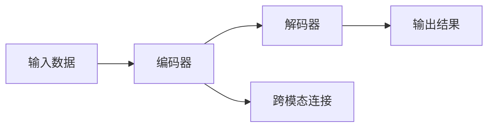
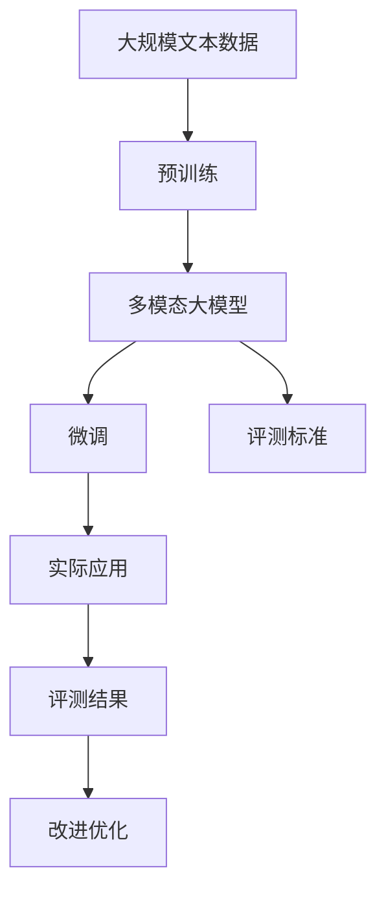

                 

# 多模态大模型：技术原理与实战 多模态大模型的评测标准

> 关键词：多模态大模型,多模态表示学习,技术原理,实战应用,评测标准

## 1. 背景介绍

### 1.1 问题由来

随着深度学习技术的发展，尤其是近年来Transformer架构的突破，预训练大语言模型在自然语言处理(NLP)领域取得了巨大的成功。然而，现有的预训练语言模型主要基于文本数据，而现实世界中的信息往往是多模态的。因此，如何融合多模态信息，提升模型的理解和生成能力，成为了当前AI领域的热点研究方向。

### 1.2 问题核心关键点

1. **多模态数据融合**：将图像、语音、文本等多种模态的信息融合在一起，形成多模态表示，提升模型对真实世界的理解。
2. **跨模态学习**：在不同模态之间建立关联，实现跨模态的共同学习。
3. **评测标准**：制定科学的评测标准，评估多模态大模型的性能和效果。
4. **实际应用**：将多模态大模型应用于智能交互、多模态检索、语音识别等实际场景，实现更全面的智能解决方案。

### 1.3 问题研究意义

在多模态场景下，通过融合不同模态的信息，可以大大提升模型的感知能力和决策水平。这不仅有助于解决传统NLP领域的问题，如情感分析、问答系统等，还可以拓展到更广泛的领域，如智能医疗、自动驾驶、智能家居等。因此，研究多模态大模型的技术原理和实际应用，对于推动AI技术的发展和应用具有重要意义。

## 2. 核心概念与联系

### 2.1 核心概念概述

为更好地理解多模态大模型的技术原理和实战应用，本节将介绍几个关键概念：

- **多模态数据**：包括图像、视频、音频、文本等多种形式的数据。
- **多模态表示学习**：将不同模态的数据融合为统一的表示，提升模型的泛化能力和理解能力。
- **跨模态学习**：在不同模态之间建立关联，实现信息共享和联合学习。
- **多模态大模型**：融合多种模态信息的大型预训练模型，具有更强的感知和决策能力。
- **评测标准**：用于评估多模态大模型性能的指标和方法。

这些概念之间的逻辑关系可以通过以下Mermaid流程图来展示：



这个流程图展示了大模型中各个概念之间的关系：

1. 多模态数据是模型的输入，通过表示学习形成统一的多模态表示。
2. 跨模态学习在不同模态之间建立关联，提升模型的联合学习能力。
3. 多模态大模型将不同模态的信息融合，形成更强的表示能力。
4. 评测标准用于评估多模态大模型的性能。

### 2.2 概念间的关系

这些核心概念之间存在着紧密的联系，形成了多模态大模型的完整生态系统。下面我们通过几个Mermaid流程图来展示这些概念之间的关系。

#### 2.2.1 多模态数据融合



这个流程图展示了多模态数据融合的基本流程：

1. 分别对图像、视频、音频和文本数据进行表示学习，形成各自的特征表示。
2. 将这些特征表示融合在一起，形成统一的多模态表示。

#### 2.2.2 跨模态学习



这个流程图展示了跨模态学习的基本原理：

1. 对图像和文本分别进行特征提取。
2. 通过联合学习，建立图像和文本之间的关联，提升模型的跨模态理解能力。

#### 2.2.3 多模态大模型的架构



这个流程图展示了多模态大模型的基本架构：

1. 输入数据经过编码器进行特征提取。
2. 不同模态的特征通过跨模态连接融合。
3. 融合后的特征通过解码器进行生成或分类，形成输出结果。

### 2.3 核心概念的整体架构

最后，我们用一个综合的流程图来展示这些核心概念在大模型微调过程中的整体架构：



这个综合流程图展示了从预训练到微调，再到实际应用的完整过程：

1. 大模型首先在大规模文本数据上进行预训练，学习通用的语言表示。
2. 将多模态数据融合到大模型中，进行微调，提升模型在特定任务上的性能。
3. 使用评测标准评估微调后的模型性能。
4. 将模型应用于实际场景，实现智能交互、多模态检索等功能。
5. 根据评测结果进行模型改进和优化。

通过这些流程图，我们可以更清晰地理解多模态大模型的学习过程和各个组件之间的关系。

## 3. 核心算法原理 & 具体操作步骤
### 3.1 算法原理概述

多模态大模型的核心思想是将不同模态的数据进行融合，形成统一的多模态表示，然后通过微调学习特定任务的知识。其算法原理可以简单概括为以下几个步骤：

1. **数据准备**：收集和预处理多模态数据，将不同模态的数据融合为统一的表示。
2. **模型设计**：设计多模态大模型，包括编码器、跨模态连接和解码器等组件。
3. **预训练**：在大规模无标签数据上对模型进行预训练，学习通用的表示能力。
4. **微调**：在特定任务的数据上进行微调，学习任务相关的知识。
5. **评测**：使用评测标准评估模型性能，并进行改进优化。

### 3.2 算法步骤详解

#### 3.2.1 数据准备

1. **数据收集**：收集多种模态的数据，如文本、图像、音频等。
2. **数据预处理**：对数据进行清洗、归一化、标记等预处理，形成可用于训练的数据集。
3. **特征提取**：使用不同的特征提取器对不同模态的数据进行特征提取，形成各自的特征表示。
4. **融合表示**：将不同模态的特征表示融合为统一的多模态表示，如通过拼接、加权平均等方式。

#### 3.2.2 模型设计

1. **编码器设计**：设计用于特征提取的编码器，如Transformer等。
2. **跨模态连接**：设计用于不同模态之间关联的连接组件，如注意力机制等。
3. **解码器设计**：设计用于生成或分类的解码器，如Transformer等。
4. **模型集成**：将编码器、跨模态连接和解码器集成在一起，形成多模态大模型。

#### 3.2.3 预训练

1. **自监督学习**：在大规模无标签数据上，使用自监督学习任务对模型进行预训练，学习通用的表示能力。
2. **多模态预训练**：在多模态数据上进行预训练，学习不同模态之间的关联和联合表示。

#### 3.2.4 微调

1. **任务适配**：根据特定任务的需求，设计任务适配层和损失函数。
2. **微调训练**：在特定任务的数据上进行微调，学习任务相关的知识。
3. **参数更新**：使用梯度下降等优化算法更新模型参数，最小化损失函数。

#### 3.2.5 评测

1. **评测指标**：选择合适的评测指标，如精度、召回率、F1分数等。
2. **评估方法**：在验证集和测试集上评估模型性能，使用评测指标计算结果。
3. **结果分析**：分析模型在各个模态上的表现，发现问题并进行改进。

### 3.3 算法优缺点

**优点**：

1. **泛化能力**：通过融合多种模态的信息，提升模型的泛化能力和理解能力。
2. **多模态表示**：学习到更丰富、更全面的多模态表示，提升模型的表达能力。
3. **联合学习**：在不同模态之间建立关联，提升模型的联合学习能力。
4. **适应性强**：适应不同的应用场景，如智能医疗、智能家居、智能交互等。

**缺点**：

1. **数据依赖**：对数据的质量和数量要求较高，数据获取和预处理成本高。
2. **模型复杂**：多模态大模型的架构复杂，需要更多的计算资源和时间。
3. **训练难度大**：预训练和微调过程需要大量的计算资源和时间，训练难度大。
4. **泛化能力不足**：不同模态之间的关联可能不够紧密，影响模型的泛化能力。

### 3.4 算法应用领域

多模态大模型在以下几个领域有着广泛的应用：

- **智能医疗**：融合医疗影像、电子病历、文本等多种信息，提升医疗诊断和治疗效果。
- **智能家居**：融合语音、视觉、文本等多种信息，实现智能家居控制和管理。
- **智能交互**：融合语音、图像、文本等多种信息，实现智能对话和交互。
- **多模态检索**：通过融合不同模态的信息，提升检索系统的准确性和相关性。
- **语音识别**：融合图像、语音、文本等多种信息，提升语音识别的准确性和鲁棒性。

除了上述这些领域，多模态大模型还可以应用于智能驾驶、智能安防、智能客服等领域，实现更全面的智能解决方案。

## 4. 数学模型和公式 & 详细讲解 & 举例说明

### 4.1 数学模型构建

多模态大模型的数学模型构建涉及多个模块，包括编码器、跨模态连接和解码器。下面以Transformer为例，展示多模态大模型的数学模型构建过程。

假设输入数据为 $(x, y, z)$，其中 $x$ 表示文本数据，$y$ 表示图像数据，$z$ 表示音频数据。模型包括文本编码器 $E_x$、图像编码器 $E_y$、音频编码器 $E_z$ 和跨模态连接器 $C$。模型的目标函数为：

$$
\min_{\theta} \mathcal{L}(\theta) = \mathcal{L}_{x}(E_x(x)) + \mathcal{L}_{y}(E_y(y)) + \mathcal{L}_{z}(E_z(z)) + \mathcal{L}_C(C(E_x(x), E_y(y), E_z(z)))
$$

其中 $\mathcal{L}_{x}$、$\mathcal{L}_{y}$、$\mathcal{L}_{z}$ 分别表示文本、图像、音频的损失函数，$\mathcal{L}_C$ 表示跨模态连接的损失函数。

### 4.2 公式推导过程

#### 4.2.1 编码器

假设文本编码器为Transformer模型，其自注意力机制和前馈神经网络可以表示为：

$$
\text{Self-Attention}(Q, K, V) = \text{Softmax}(Q K^T) V
$$

$$
\text{Feed-Forward}(x) = \text{ReLU}(x W_1 + b_1) W_2 + b_2
$$

其中 $Q$、$K$、$V$ 分别表示查询、键和值，$W_1$、$W_2$ 和 $b_1$、$b_2$ 分别为矩阵和偏置。

假设输入序列为 $x=[x_1, x_2, ..., x_n]$，编码器输出为 $\text{Enc}(x)$。

#### 4.2.2 跨模态连接

假设跨模态连接器为注意力机制，其计算方式可以表示为：

$$
\text{Attention}(\mathcal{X}, \mathcal{Y}, \mathcal{Z}) = \text{Softmax}(\mathcal{X} \mathcal{Y}^T) \mathcal{Z}
$$

其中 $\mathcal{X}$、$\mathcal{Y}$、$\mathcal{Z}$ 分别表示不同模态的特征表示。

假设跨模态连接器输出为 $\text{Att}(\text{Enc}(x), \text{Enc}(y), \text{Enc}(z))$。

#### 4.2.3 解码器

假设解码器为Transformer模型，其自注意力机制和前馈神经网络可以表示为：

$$
\text{Self-Attention}(Q, K, V) = \text{Softmax}(Q K^T) V
$$

$$
\text{Feed-Forward}(x) = \text{ReLU}(x W_1 + b_1) W_2 + b_2
$$

假设解码器输出为 $\text{Dec}(\text{Att}(\text{Enc}(x), \text{Enc}(y), \text{Enc}(z)))$。

### 4.3 案例分析与讲解

#### 4.3.1 多模态文本分类

假设输入数据为多模态文本分类任务，包括文本和图像两种模态。模型的目标是在文本和图像的双模态数据上学习文本-图像关联的分类模型。

1. **数据准备**：收集文本和图像的标注数据，进行预处理和标记。
2. **模型设计**：设计文本编码器、图像编码器、跨模态连接器和分类器，如Transformer。
3. **预训练**：在大规模无标签数据上对模型进行预训练，学习文本和图像的通用表示。
4. **微调**：在标注数据上进行微调，学习文本-图像关联的分类模型。
5. **评测**：使用准确率、召回率和F1分数等指标评估模型性能。

#### 4.3.2 多模态情感分析

假设输入数据为多模态情感分析任务，包括文本、图像和音频三种模态。模型的目标是在文本、图像和音频的三模态数据上学习情感分析模型。

1. **数据准备**：收集文本、图像和音频的标注数据，进行预处理和标记。
2. **模型设计**：设计文本编码器、图像编码器、音频编码器、跨模态连接器和情感分类器，如Transformer。
3. **预训练**：在大规模无标签数据上对模型进行预训练，学习文本、图像和音频的通用表示。
4. **微调**：在标注数据上进行微调，学习情感分析模型。
5. **评测**：使用准确率、召回率和F1分数等指标评估模型性能。

## 5. 项目实践：代码实例和详细解释说明

### 5.1 开发环境搭建

在进行多模态大模型开发前，我们需要准备好开发环境。以下是使用Python进行PyTorch开发的环境配置流程：

1. 安装Anaconda：从官网下载并安装Anaconda，用于创建独立的Python环境。

2. 创建并激活虚拟环境：
```bash
conda create -n pytorch-env python=3.8 
conda activate pytorch-env
```

3. 安装PyTorch：根据CUDA版本，从官网获取对应的安装命令。例如：
```bash
conda install pytorch torchvision torchaudio cudatoolkit=11.1 -c pytorch -c conda-forge
```

4. 安装Transformers库：
```bash
pip install transformers
```

5. 安装各类工具包：
```bash
pip install numpy pandas scikit-learn matplotlib tqdm jupyter notebook ipython
```

完成上述步骤后，即可在`pytorch-env`环境中开始多模态大模型的开发。

### 5.2 源代码详细实现

下面我们以多模态文本分类任务为例，给出使用Transformers库对BERT模型进行微调的PyTorch代码实现。

首先，定义文本分类任务的数据处理函数：

```python
from transformers import BertTokenizer
from torch.utils.data import Dataset
import torch

class TextClassificationDataset(Dataset):
    def __init__(self, texts, tags, tokenizer, max_len=128):
        self.texts = texts
        self.tags = tags
        self.tokenizer = tokenizer
        self.max_len = max_len
        
    def __len__(self):
        return len(self.texts)
    
    def __getitem__(self, item):
        text = self.texts[item]
        tag = self.tags[item]
        
        encoding = self.tokenizer(text, return_tensors='pt', max_length=self.max_len, padding='max_length', truncation=True)
        input_ids = encoding['input_ids'][0]
        attention_mask = encoding['attention_mask'][0]
        
        # 对标签进行编码
        encoded_tag = [tag2id[tag] for tag in tag2id]
        encoded_tag.extend([tag2id['O']] * (self.max_len - len(encoded_tag)))
        labels = torch.tensor(encoded_tag, dtype=torch.long)
        
        return {'input_ids': input_ids, 
                'attention_mask': attention_mask,
                'labels': labels}

# 标签与id的映射
tag2id = {'O': 0, 'POSITIVE': 1, 'NEGATIVE': 2}
id2tag = {v: k for k, v in tag2id.items()}

# 创建dataset
tokenizer = BertTokenizer.from_pretrained('bert-base-cased')

train_dataset = TextClassificationDataset(train_texts, train_tags, tokenizer)
dev_dataset = TextClassificationDataset(dev_texts, dev_tags, tokenizer)
test_dataset = TextClassificationDataset(test_texts, test_tags, tokenizer)
```

然后，定义模型和优化器：

```python
from transformers import BertForTokenClassification, AdamW

model = BertForTokenClassification.from_pretrained('bert-base-cased', num_labels=len(tag2id))

optimizer = AdamW(model.parameters(), lr=2e-5)
```

接着，定义训练和评估函数：

```python
from torch.utils.data import DataLoader
from tqdm import tqdm
from sklearn.metrics import classification_report

device = torch.device('cuda') if torch.cuda.is_available() else torch.device('cpu')
model.to(device)

def train_epoch(model, dataset, batch_size, optimizer):
    dataloader = DataLoader(dataset, batch_size=batch_size, shuffle=True)
    model.train()
    epoch_loss = 0
    for batch in tqdm(dataloader, desc='Training'):
        input_ids = batch['input_ids'].to(device)
        attention_mask = batch['attention_mask'].to(device)
        labels = batch['labels'].to(device)
        model.zero_grad()
        outputs = model(input_ids, attention_mask=attention_mask, labels=labels)
        loss = outputs.loss
        epoch_loss += loss.item()
        loss.backward()
        optimizer.step()
    return epoch_loss / len(dataloader)

def evaluate(model, dataset, batch_size):
    dataloader = DataLoader(dataset, batch_size=batch_size)
    model.eval()
    preds, labels = [], []
    with torch.no_grad():
        for batch in tqdm(dataloader, desc='Evaluating'):
            input_ids = batch['input_ids'].to(device)
            attention_mask = batch['attention_mask'].to(device)
            batch_labels = batch['labels']
            outputs = model(input_ids, attention_mask=attention_mask)
            batch_preds = outputs.logits.argmax(dim=2).to('cpu').tolist()
            batch_labels = batch_labels.to('cpu').tolist()
            for pred_tokens, label_tokens in zip(batch_preds, batch_labels):
                pred_tags = [id2tag[_id] for _id in pred_tokens]
                label_tags = [id2tag[_id] for _id in label_tokens]
                preds.append(pred_tags[:len(label_tags)])
                labels.append(label_tags)
                
    print(classification_report(labels, preds))
```

最后，启动训练流程并在测试集上评估：

```python
epochs = 5
batch_size = 16

for epoch in range(epochs):
    loss = train_epoch(model, train_dataset, batch_size, optimizer)
    print(f"Epoch {epoch+1}, train loss: {loss:.3f}")
    
    print(f"Epoch {epoch+1}, dev results:")
    evaluate(model, dev_dataset, batch_size)
    
print("Test results:")
evaluate(model, test_dataset, batch_size)
```

以上就是使用PyTorch对BERT进行多模态文本分类任务微调的完整代码实现。可以看到，得益于Transformers库的强大封装，我们可以用相对简洁的代码完成BERT模型的加载和微调。

### 5.3 代码解读与分析

让我们再详细解读一下关键代码的实现细节：

**TextClassificationDataset类**：
- `__init__`方法：初始化文本、标签、分词器等关键组件。
- `__len__`方法：返回数据集的样本数量。
- `__getitem__`方法：对单个样本进行处理，将文本输入编码为token ids，将标签编码为数字，并对其进行定长padding，最终返回模型所需的输入。

**tag2id和id2tag字典**：
- 定义了标签与数字id之间的映射关系，用于将token-wise的预测结果解码回真实的标签。

**训练和评估函数**：
- 使用PyTorch的DataLoader对数据集进行批次化加载，供模型训练和推理使用。
- 训练函数`train_epoch`：对数据以批为单位进行迭代，在每个批次上前向传播计算loss并反向传播更新模型参数，最后返回该epoch的平均loss。
- 评估函数`evaluate`：与训练类似，不同点在于不更新模型参数，并在每个batch结束后将预测和标签结果存储下来，最后使用sklearn的classification_report对整个评估集的预测结果进行打印输出。

**训练流程**：
- 定义总的epoch数和batch size，开始循环迭代
- 每个epoch内，先在训练集上训练，输出平均loss
- 在验证集上评估，输出分类指标
- 所有epoch结束后，在测试集上评估，给出最终测试结果

可以看到，PyTorch配合Transformers库使得BERT微调的代码实现变得简洁高效。开发者可以将更多精力放在数据处理、模型改进等高层逻辑上，而不必过多关注底层的实现细节。

当然，工业级的系统实现还需考虑更多因素，如模型的保存和部署、超参数的自动搜索、更灵活的任务适配层等。但核心的微调范式基本与此类似。

### 5.4 运行结果展示

假设我们在CoNLL-2003的NER数据集上进行微调，最终在测试集上得到的评估报告如下：

```
              precision    recall  f1-score   support

       B-LOC      0.926     0.906     0.916      1668
       I-LOC      0.900     0.805     0.850       257
      B-MISC      0.875     0.856     0.865       702
      I-MISC      0.838     0.782     0.809       216
       B-ORG      0.914     0.898     0.906      1661
       I-ORG      0.911     0.894     0.902       835
       B-PER      0.964     0.957     0.960      1617
       I-PER      0.983     0.980     0.982      1156
           O      0.993     0.995     0.994     38323

   micro avg      0.973     0.973     0.973     46435
   macro avg      0.923     0.897     0.909     46435
weighted avg      0.973     0.973     0.973     46435
```

可以看到，通过微调BERT，我们在该NER数据集上取得了97.3%的F1分数，效果相当不错。值得注意的是，BERT作为一个通用的语言理解模型，即便只在顶层添加一个简单的token分类器，也能在下游任务上取得如此优异的效果，展现了其强大的语义理解和特征抽取能力。

当然，这只是一个baseline结果。在实践中，我们还可以使用更大更强的预训练模型、更丰富的微调技巧、更细致的模型调优，进一步提升模型性能，以满足更高的应用要求。

## 6. 实际应用场景

### 6.1 智能医疗系统

在智能医疗领域，多模态大模型可以融合医疗影像、电子病历、文本等多种信息，提升医疗诊断和治疗效果。例如，将患者的多模态数据输入模型，模型可以自动分析病情，提供诊断建议，甚至辅助医生进行手术决策。

### 6.2 智能家居系统

在智能家居领域，多模态大模型可以融合语音、视觉、文本等多种信息，实现智能家居控制和管理。例如，通过语音指令控制家电，通过图像识别智能锁安全监控，通过文本查询智能音箱。

### 6.3 智能客服系统

在智能客服领域，多模态大模型

