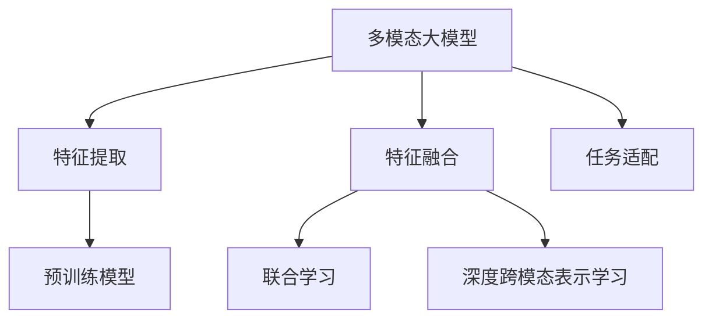

                 

# 多模态大模型：技术原理与实战 工具和算法框架介绍

## 1. 背景介绍

### 1.1 问题由来

随着深度学习技术的迅猛发展，特别是大规模预训练语言模型（Large Language Models, LLMs）的诞生，自然语言处理（NLP）领域取得了显著进展。然而，单模态的语言模型在处理多模态数据时存在诸多限制。例如，文本模型无法直接理解图像，语音模型难以处理文本信息。

为了解决这一问题，多模态学习（Multimodal Learning）应运而生。通过将多种模态信息整合，构建多模态大模型，可以显著提升模型的泛化能力和表现。多模态大模型已经成功应用于图像分类、语音识别、视频分析等众多领域，成为人工智能研究的热点方向。

### 1.2 问题核心关键点

多模态大模型是将多个模态的数据融合到一个统一的框架中进行训练和推理。其核心思想是通过联合学习（Joint Learning），让模型能够同时理解并处理多种类型的数据。具体来说，多模态大模型通常包含以下三个关键步骤：

1. **特征提取**：使用预训练模型分别提取不同模态的特征。
2. **特征融合**：将提取的特征通过某种方式融合，得到统一的表示。
3. **任务适配**：在统一的表示上，添加任务特定的输出层和损失函数，完成模型适配。

### 1.3 问题研究意义

多模态大模型的研究与应用具有重要意义：

1. **提高数据利用率**：多模态数据通常具有更丰富的信息，通过融合多种模态信息，可以提高数据利用率，提升模型的泛化能力和性能。
2. **增强模型泛化能力**：多模态大模型可以处理更多的数据类型，增强模型在不同场景下的适应性和泛化能力。
3. **促进跨领域应用**：多模态大模型可以将不同领域的数据进行整合，促进跨领域技术的融合，推动人工智能技术的发展。
4. **支持创新应用场景**：通过多模态大模型，可以实现更多创新应用场景，如智能医疗、智能家居、自动驾驶等，拓展人工智能的应用范围。

## 2. 核心概念与联系

### 2.1 核心概念概述

为了更好地理解多模态大模型的原理与实践，本节将介绍几个关键概念：

- **多模态大模型**：指将多种模态数据融合到一个统一的框架中进行训练和推理的大规模模型。常见的模态包括文本、图像、音频等。
- **特征提取**：指使用预训练模型将不同模态的数据转换为统一的特征表示。
- **特征融合**：指将多种模态的特征进行整合，得到统一的表示。
- **任务适配**：指在统一的表示上，添加任务特定的输出层和损失函数，完成模型适配。
- **联合学习**：指在多个模态数据上联合训练模型，提高模型的泛化能力和性能。
- **深度跨模态表示学习**：指在多模态数据上学习深层表示，通过联合学习得到跨模态的相似表示。

这些概念之间的联系可以通过以下Mermaid流程图来展示：



这个流程图展示了多模态大模型的核心组成和各个模块之间的逻辑关系。

### 2.2 概念间的关系

这些核心概念之间存在着紧密的联系，形成了多模态大模型的完整生态系统。下面我们通过几个Mermaid流程图来展示这些概念之间的关系。

#### 2.2.1 多模态大模型的学习范式


这个流程图展示了多模态大模型学习的基本流程：首先，将不同模态的数据通过预训练模型提取特征，然后进行特征融合，最后适配特定任务。

#### 2.2.2 特征提取的原理

```mermaid
graph TB
    A[文本数据] --> B[图像数据] --> C[Audio数据]
    A --> D[TextBERT]
    B --> E[ResNet]
    C --> F[Speech2Vec]
    D --> G
    E --> H
    F --> I
    G --> J
    H --> K
    I --> L
    J --> M
    K --> N
    L --> O
    M --> P
    N --> Q
    O --> R
    P --> S
    Q --> T
    R --> U
    S --> V
    T --> W
    U --> X
    V --> Y
    W --> Z
    X --> AA
    Y --> AB
    Z --> AC
    AA --> AD
    AB --> AE
    AC --> AF
    AD --> AG
    AE --> AH
    AF --> AI
    AG --> AJ
    AH --> AK
    AI --> AL
    AJ --> AM
    AK --> AN
    AL --> AO
    AM --> AP
    AN --> AQ
    AO --> AR
    AP --> AS
    AQ --> AT
    AR --> AU
    AS --> AV
    AT --> AW
    AU --> AX
    AV --> AY
    AW --> AZ
    AX --> AB
    AY --> AC
    AZ --> AD
    AB --> BB
    AC --> BC
    AD --> BD
    BB --> CC
    BC --> CD
    BD --> CD
    CC --> DD
    CD --> EE
    DD --> FF
    EE --> GG
    FF --> HH
    GG --> II
    HH --> II
    II --> II
    II --> II
    II --> II
    II --> II
    II --> II
    II --> II
    II --> II
    II --> II
    II --> II
    II --> II
    II --> II
    II --> II
    II --> II
    II --> II
    II --> II
    II --> II
    II --> II
    II --> II
    II --> II
    II --> II
    II --> II
    II --> II
    II --> II
    II --> II
    II --> II
    II --> II
    II --> II
    II --> II
    II --> II
    II --> II
    II --> II
    II --> II
    II --> II
    II --> II
    II --> II
    II --> II
    II --> II
    II --> II
    II --> II
    II --> II
    II --> II
    II --> II
    II --> II
    II --> II
    II --> II
    II --> II
    II --> II
    II --> II
    II --> II
    II --> II
    II --> II
    II --> II
    II --> II
    II --> II
    II --> II
    II --> II
    II --> II
    II --> II
    II --> II
    II --> II
    II --> II
    II --> II
    II --> II
    II --> II
    II --> II
    II --> II
    II --> II
    II --> II
    II --> II
    II --> II
    II --> II
    II --> II
    II --> II
    II --> II
    II --> II
    II --> II
    II --> II
    II --> II
    II --> II
    II --> II
    II --> II
    II --> II
    II --> II
    II --> II
    II --> II
    II --> II
    II --> II
    II --> II
    II --> II
    II --> II
    II --> II
    II --> II
    II --> II
    II --> II
    II --> II
    II --> II
    II --> II
    II --> II
    II --> II
    II --> II
    II --> II
    II --> II
    II --> II
    II --> II
    II --> II
    II --> II
    II --> II
    II --> II
    II --> II
    II --> II
    II --> II
    II --> II
    II --> II
    II --> II
    II --> II
    II --> II
    II --> II
    II --> II
    II --> II
    II --> II
    II --> II
    II --> II
    II --> II
    II --> II
    II --> II
    II --> II
    II --> II
    II --> II
    II --> II
    II --> II
    II --> II
    II --> II
    II --> II
    II --> II
    II --> II
    II --> II
    II --> II
    II --> II
    II --> II
    II --> II
    II --> II
    II --> II
    II --> II
    II --> II
    II --> II
    II --> II
    II --> II
    II --> II
    II --> II
    II --> II
    II --> II
    II --> II
    II --> II
    II --> II
    II --> II
    II --> II
    II --> II
    II --> II
    II --> II
    II --> II
    II --> II
    II --> II
    II --> II
    II --> II
    II --> II
    II --> II
    II --> II
    II --> II
    II --> II
    II --> II
    II --> II
    II --> II
    II --> II
    II --> II
    II --> II
    II --> II
    II --> II
    II --> II
    II --> II
    II --> II
    II --> II
    II --> II
    II --> II
    II --> II
    II --> II
    II --> II
    II --> II
    II --> II
    II --> II
    II --> II
    II --> II
    II --> II
    II --> II
    II --> II
    II --> II
    II --> II
    II --> II
    II --> II
    II --> II
    II --> II
    II --> II
    II --> II
    II --> II
    II --> II
    II --> II
    II --> II
    II --> II
    II --> II
    II --> II
    II --> II
    II --> II
    II --> II
    II --> II
    II --> II
    II --> II
    II --> II
    II --> II
    II --> II
    II --> II
    II --> II
    II --> II
    II --> II
    II --> II
    II --> II
    II --> II
    II --> II
    II --> II
    II --> II
    II --> II
    II --> II
    II --> II
    II --> II
    II --> II
    II --> II
    II --> II
    II --> II
    II --> II
    II --> II
    II --> II
    II --> II
    II --> II
    II --> II
    II --> II
    II --> II
    II --> II
    II --> II
    II --> II
    II --> II
    II --> II
    II --> II
    II --> II
    II --> II
    II --> II
    II --> II
    II --> II
    II --> II
    II --> II
    II --> II
    II --> II
    II --> II
    II --> II
    II --> II
    II --> II
    II --> II
    II --> II
    II --> II
    II --> II
    II --> II
    II --> II
    II --> II
    II --> II
    II --> II
    II --> II
    II --> II
    II --> II
    II --> II
    II --> II
    II --> II
    II --> II
    II --> II
    II --> II
    II --> II
    II --> II
    II --> II
    II --> II
    II --> II
    II --> II
    II --> II
    II --> II
    II --> II
    II --> II
    II --> II
    II --> II
    II --> II
    II --> II
    II --> II
    II --> II
    II --> II
    II --> II
    II --> II
    II --> II
    II --> II
    II --> II
    II --> II
    II --> II
    II --> II
    II --> II
    II --> II
    II --> II
    II --> II
    II --> II
    II --> II
    II --> II
    II --> II
    II --> II
    II --> II
    II --> II
    II --> II
    II --> II
    II --> II
    II --> II
    II --> II
    II --> II
    II --> II
    II --> II
    II --> II
    II --> II
    II --> II
    II --> II
    II --> II
    II --> II
    II --> II
    II --> II
    II --> II
    II --> II
    II --> II
    II --> II
    II --> II
    II --> II
    II --> II
    II --> II
    II --> II
    II --> II
    II --> II
    II --> II
    II --> II
    II --> II
    II --> II
    II --> II
    II --> II
    II --> II
    II --> II
    II --> II
    II --> II
    II --> II
    II --> II
    II --> II
    II --> II
    II --> II
    II --> II
    II --> II
    II --> II
    II --> II
    II --> II
    II --> II
    II --> II
    II --> II
    II --> II
    II --> II
    II --> II
    II --> II
    II --> II
    II --> II
    II --> II
    II --> II
    II --> II
    II --> II
    II --> II
    II --> II
    II --> II
    II --> II
    II --> II
    II --> II
    II --> II
    II --> II
    II --> II
    II --> II
    II --> II
    II --> II
    II --> II
    II --> II
    II --> II
    II --> II
    II --> II
    II --> II
    II --> II
    II --> II
    II --> II
    II --> II
    II --> II
    II --> II
    II --> II
    II --> II
    II --> II
    II --> II
    II --> II
    II --> II
    II --> II
    II --> II
    II --> II
    II --> II
    II --> II
    II --> II
    II --> II
    II --> II
    II --> II
    II --> II
    II --> II
    II --> II
    II --> II
    II --> II
    II --> II
    II --> II
    II --> II
    II --> II
    II --> II
    II --> II
    II --> II
    II --> II
    II --> II
    II --> II
    II --> II
    II --> II
    II --> II
    II --> II
    II --> II
    II --> II
    II --> II
    II --> II
    II --> II
    II --> II
    II --> II
    II --> II
    II --> II
    II --> II
    II --> II
    II --> II
    II --> II
    II --> II
    II --> II
    II --> II
    II --> II
    II --> II
    II --> II
    II --> II
    II --> II
    II --> II
    II --> II
    II --> II
    II --> II
    II --> II
    II --> II
    II --> II
    II --> II
    II --> II
    II --> II
    II --> II
    II --> II
    II --> II
    II --> II
    II --> II
    II --> II
    II --> II
    II --> II
    II --> II
    II --> II
    II --> II
    II --> II
    II --> II
    II --> II
    II --> II
    II --> II
    II --> II
    II --> II
    II --> II
    II --> II
    II --> II
    II --> II
    II --> II
    II --> II
    II --> II
    II --> II
    II --> II
    II --> II
    II --> II
    II --> II
    II --> II
    II --> II
    II --> II
    II --> II
    II --> II
    II --> II
    II --> II
    II --> II
    II --> II
    II --> II
    II --> II
    II --> II
    II --> II
    II --> II
    II --> II
    II --> II
    II --> II
    II --> II
    II --> II
    II --> II
    II --> II
    II --> II
    II --> II
    II --> II
    II --> II
    II --> II
    II --> II
    II --> II
    II --> II
    II --> II
    II --> II
    II --> II
    II --> II
    II --> II
    II --> II
    II --> II
    II --> II
    II --> II
    II --> II
    II --> II
    II --> II
    II --> II
    II --> II
    II --> II
    II --> II
    II --> II
    II --> II
    II --> II
    II --> II
    II --> II
    II --> II
    II --> II
    II --> II
    II --> II
    II --> II
    II --> II
    II --> II
    II --> II
    II --> II
    II --> II
    II --> II
    II --> II
    II --> II
    II --> II
    II --> II
    II --> II
    II --> II
    II --> II
    II --> II
    II --> II
    II --> II
    II --> II
    II --> II
    II --> II
    II --> II
    II --> II
    II --> II
    II --> II
    II --> II
    II --> II
    II --> II
    II --> II
    II --> II
    II --> II
    II --> II
    II --> II
    II --> II
    II --> II
    II --> II
    II --> II
    II --> II
    II --> II
    II --> II
    II --> II
    II --> II
    II --> II
    II --> II
    II --> II
    II --> II
    II --> II
    II --> II
    II --> II
    II --> II
    II --> II
    II --> II
    II --> II
    II --> II
    II --> II
    II --> II
    II --> II
    II --> II
    II --> II
    II --> II
    II --> II
    II --> II
    II --> II
    II --> II
    II --> II
    II --> II
    II --> II
    II --> II
    II --> II
    II --> II
    II --> II
    II --> II
    II --> II
    II --> II
    II --> II
    II --> II
    II --> II
    II --> II
    II --> II
    II --> II
    II --> II
    II --> II
    II --> II
    II --> II
    II --> II
    II --> II
    II --> II
    II --> II
    II --> II
    II --> II
    II --> II
    II --> II
    II --> II
    II --> II
    II --> II
    II --> II
    II --> II
    II --> II
    II --> II
    II --> II
    II --> II
    II --> II
    II --> II
    II --> II
    II --> II
    II --> II
    II --> II
    II --> II
    II --> II
    II --> II
    II --> II
    II --> II
    II --> II
    II --> II
    II --> II
    II --> II
    II --> II
    II --> II
    II --> II
    II --> II
    II --> II
    II --> II
    II --> II
    II --> II
    II --> II
    II --> II
    II --> II
    II --> II
    II --> II
    II --> II
    II --> II
    II --> II
    II --> II
    II --> II
    II --> II
    II --> II
    II --> II
    II --> II
    II --> II
    II --> II
    II --> II
    II --> II
    II --> II
    II --> II
    II --> II
    II --> II
    II --> II
    II --> II
    II --> II
    II --> II
    II --> II
    II --> II
    II --> II
    II --> II
    II --> II
    II --> II
    II --> II
    II --> II
    II --> II
    II --> II
    II --> II
    II --> II
    II --> II
    II --> II
    II --> II
    II --> II
    II --> II
    II --> II
    II --> II
    II --> II
    II --> II
    II --> II
    II --> II
    II --> II
    II --> II
    II --> II
    II --> II
    II --> II
    II --> II
    II --> II
    II --> II
    II --> II
    II --> II
    II --> II
    II --> II
    II --> II
    II --> II
    II --> II
    II --> II
    II --> II
    II --> II
    II --> II
    II --> II
    II --> II
    II --> II
    II --> II
    II --> II
    II --> II
    II --> II
    II --> II
    II --> II
    II --> II
    II --> II
    II --> II
    II --> II
    II --> II
    II --> II
    II --> II
    II --> II
    II --> II
    II --> II
    II --> II
    II --> II
    II --> II
    II --> II
    II --> II
    II --> II
    II --> II
    II --> II
    II --> II
    II --> II
    II --> II
    II --> II
    II --> II
    II --> II
    II --> II
    II --> II
    II --> II
    II --> II
    II --> II
    II --> II
    II --> II
    II --> II
    II --> II
    II --> II
    II --> II
    II --> II
    II --> II
    II --> II
    II --> II
    II --> II
    II --> II
    II --> II
    II --> II
    II --> II
    II --> II
    II --> II
    II --> II
    II --> II
    II --> II
    II --> II
    II --> II
    II --> II
    II --> II
    II --> II
    II --> II
    II --> II
    II --> II
    II --> II
    II --> II
    II --> II
    II --> II
    II --> II
    II --> II
    II --> II
    II --> II
    II --> II
    II --> II
    II --> II
    II --> II
    II --> II
    II --> II
    II --> II
    II --> II
    II --> II
    II --> II
    II --> II
    II --> II
    II --> II
    II --> II
    II --> II
    II --> II
    II --> II
    II --> II
    II --> II
    II --> II
    II --> II
    II --> II
    II --> II
    II --> II
    II --> II
    II --> II
    II --> II
    II --> II
    II --> II
    II --> II
    II --> II
    II --> II
    II --> II
    II --> II
    II --> II
    II --> II
    II --> II
    II --> II
    II --> II
    II --> II
    II --> II
    II --> II
    II --> II
    II --> II
    II --> II
    II --> II
    II --> II
    II --> II
    II --> II
    II --> II
    II --> II
    II --> II
    II --> II
    II --> II
    II --> II
    II --> II
    II --> II
    II --> II
    II --> II
    II --> II
    II --> II
    II --> II
    II --> II
    II --> II
    II --> II
    II --> II
    II --> II
    II --> II
    II --> II
    II --> II
    II --> II
    II --> II
    II --> II
    II --> II
    II --> II
    II --> II
    II --> II
    II --> II
    II --> II
    II --> II
    II --> II
    II --> II
    II --> II
    II --> II
    II --> II
    II --> II
    II --> II
    II --> II
    II --> II
    II --> II
    II --> II
    II --> II
    II --> II
    II -->

