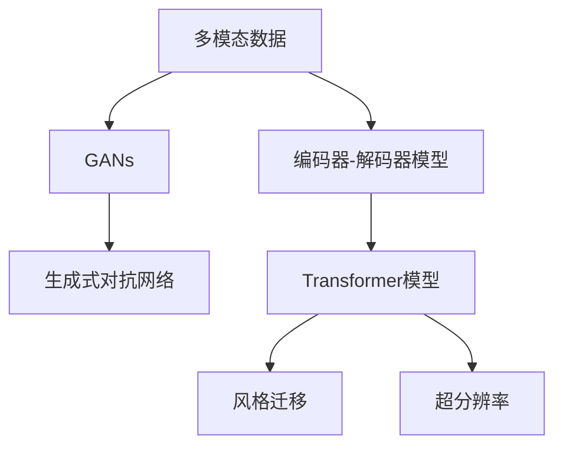
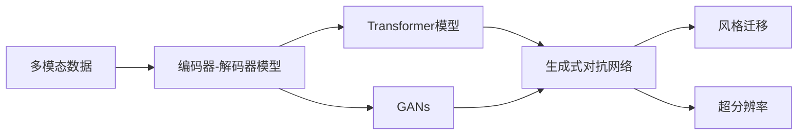
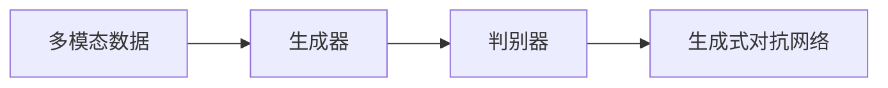
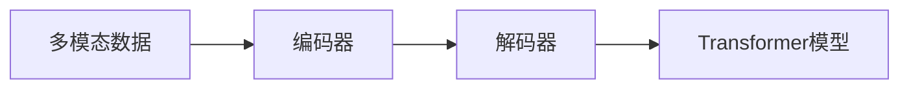
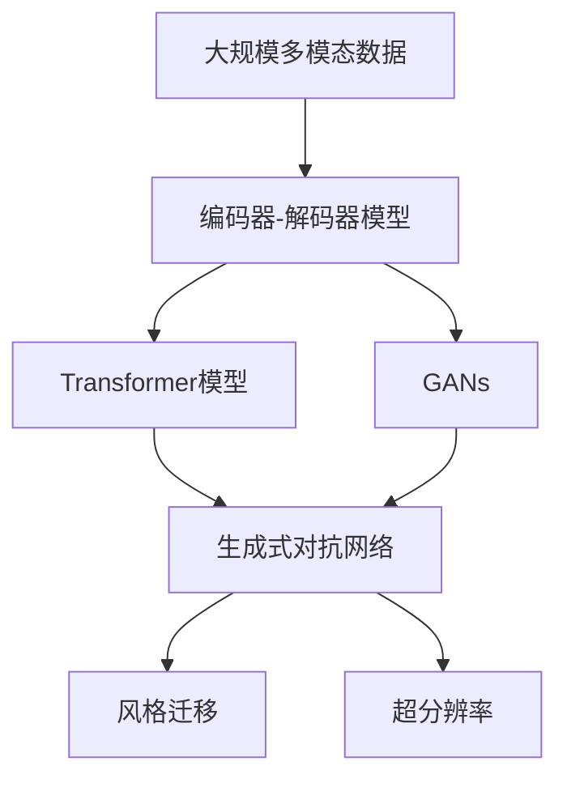

                 

# 多模态生成(Multimodal Generation) - 原理与代码实例讲解

> 关键词：多模态生成, 图像生成, 音频生成, 视频生成, 文本生成, 编码器-解码器模型, Transformer, GAN, StyleGAN, GPT系列模型

## 1. 背景介绍

### 1.1 问题由来
随着人工智能技术的不断进步，尤其是深度学习和大数据技术的应用，多模态生成技术（Multimodal Generation）已经成为人工智能研究的热点领域之一。多模态生成技术旨在将多种不同类型的数据（如图像、音频、文本、视频等）综合起来，生成出多模态的输出。这种技术在许多实际应用中都有着广泛的应用，如虚拟现实、增强现实、多媒体编辑、自动作曲、生成对抗网络（GANs）等。

多模态生成技术的核心在于如何有效地融合不同模态的数据，使其能够协同工作，从而生成出高质量的多模态输出。在过去，多模态生成往往需要分别对每个模态进行单独的处理，然后将其结果综合起来，但这种方法通常会带来较大的计算量和复杂度。随着深度学习技术的不断发展，基于深度神经网络的模型已经被证明可以有效地处理多模态数据，并生成出高质量的多模态输出。

### 1.2 问题核心关键点
多模态生成技术的关键在于如何有效地融合不同模态的数据，并生成出高质量的多模态输出。具体来说，有以下几个核心关键点：

- **数据融合**：将不同模态的数据进行融合，使其能够协同工作，从而生成出多模态的输出。
- **生成模型**：使用深度神经网络模型生成多模态数据。
- **解码器-编码器结构**：使用编码器-解码器结构，将不同模态的数据进行编码，然后通过解码器生成出多模态输出。
- **对抗生成网络（GANs）**：使用GANs生成高质量的多模态输出。

多模态生成技术在实际应用中有着广泛的应用，如虚拟现实、增强现实、多媒体编辑、自动作曲、生成对抗网络（GANs）等。随着技术的不断发展，基于深度神经网络的模型已经被证明可以有效地处理多模态数据，并生成出高质量的多模态输出。

### 1.3 问题研究意义
研究多模态生成技术，对于拓展人工智能的应用范围，提升多模态数据的生成质量和效率，加速人工智能技术的产业化进程，具有重要意义：

1. **降低数据处理成本**：多模态生成技术可以有效地融合不同类型的数据，降低处理数据的复杂度和成本。
2. **提升数据生成质量**：多模态生成技术可以生成高质量的多模态数据，提升数据的使用价值。
3. **加速技术落地**：多模态生成技术可以加速人工智能技术的落地应用，提升其在实际场景中的效果。
4. **带来技术创新**：多模态生成技术催生了新的研究方向，如对抗生成网络（GANs）、生成式对抗网络（GANs）等。
5. **赋能产业升级**：多模态生成技术可以赋能各行各业，提升其数字化转型升级的速度。

## 2. 核心概念与联系

### 2.1 核心概念概述

为了更好地理解多模态生成技术的核心概念，本节将介绍几个密切相关的核心概念：

- **多模态数据（Multimodal Data）**：指不同类型的数据，如图像、音频、文本、视频等。
- **编码器-解码器模型（Encoder-Decoder Model）**：一种深度神经网络结构，通常用于生成和解码序列数据。
- **对抗生成网络（GANs）**：一种生成模型，通过生成器和判别器的对抗学习，生成高质量的数据。
- **生成式对抗网络（GANs）**：一种生成模型，通过生成器和判别器的对抗学习，生成高质量的数据。
- **Transformer模型**：一种用于处理序列数据的深度神经网络模型，通常用于文本生成和图像生成。
- **风格迁移（Style Transfer）**：一种将源图像的风格应用到目标图像上，使其具有新的风格的技术。
- **超分辨率（Super-resolution）**：一种将低分辨率图像转换为高分辨率图像的技术。

这些核心概念之间的逻辑关系可以通过以下Mermaid流程图来展示：



这个流程图展示了几大核心概念之间的逻辑关系：

1. 多模态数据作为输入，通过编码器-解码器模型、GANs、Transformer模型等进行处理。
2. 编码器-解码器模型和GANs通常用于生成多模态数据。
3. Transformer模型通常用于文本生成和图像生成。
4. 风格迁移和超分辨率技术通常用于改善生成数据的质量。

### 2.2 概念间的关系

这些核心概念之间存在着紧密的联系，形成了多模态生成技术的完整生态系统。下面我通过几个Mermaid流程图来展示这些概念之间的关系。

#### 2.2.1 多模态生成技术的基本流程



这个流程图展示了多模态生成技术的基本流程。多模态数据经过编码器-解码器模型、Transformer模型、GANs等处理后，生成出高质量的多模态输出。风格迁移和超分辨率技术通常用于改善生成数据的质量。

#### 2.2.2 多模态生成技术与GANs的关系



这个流程图展示了GANs的基本结构。多模态数据通过生成器生成出假数据，然后通过判别器进行判别。生成器通过与判别器的对抗学习，逐渐生成出高质量的假数据。

#### 2.2.3 多模态生成技术与Transformer模型之间的关系



这个流程图展示了Transformer模型在多模态生成技术中的应用。多模态数据通过编码器编码成向量表示，然后通过Transformer模型进行解码，生成出高质量的多模态输出。

### 2.3 核心概念的整体架构

最后，我们用一个综合的流程图来展示这些核心概念在大规模多模态生成过程中的整体架构：



这个综合流程图展示了从大规模多模态数据到高质量多模态输出的完整过程。多模态数据通过编码器-解码器模型、Transformer模型、GANs等进行处理，然后通过风格迁移和超分辨率技术提升数据质量，最终生成出高质量的多模态输出。 通过这些流程图，我们可以更清晰地理解多模态生成过程中各个核心概念的关系和作用，为后续深入讨论具体的生成方法和技术奠定基础。

## 3. 核心算法原理 & 具体操作步骤
### 3.1 算法原理概述

多模态生成技术本质上是一个多任务的生成模型，旨在通过深度学习技术，将多种不同类型的数据进行融合，并生成出高质量的多模态输出。多模态生成技术主要包括编码器-解码器模型、生成式对抗网络（GANs）和Transformer模型等。

### 3.2 算法步骤详解

#### 3.2.1 编码器-解码器模型

编码器-解码器模型是一种深度神经网络结构，通常用于生成和解码序列数据。多模态生成中，可以使用编码器-解码器模型将不同模态的数据进行编码和解码，从而生成出多模态的输出。

- **编码器**：对输入的多模态数据进行编码，生成出一个低维的向量表示。
- **解码器**：将编码器生成的向量表示解码成多模态的输出。

编码器-解码器模型的核心思想是将多模态数据转换成向量表示，然后通过解码器生成出多模态输出。常见的编码器包括RNN、LSTM、GRU等，而解码器通常使用RNN、LSTM或Transformer等。

#### 3.2.2 生成式对抗网络（GANs）

生成式对抗网络（GANs）是一种生成模型，通过生成器和判别器的对抗学习，生成高质量的数据。GANs由两部分组成：生成器和判别器。

- **生成器**：将输入的随机噪声生成成高质量的假数据。
- **判别器**：对生成的假数据进行判别，判断其是否真实。

生成器和判别器通过对抗学习，不断提升生成器的生成能力和判别器的判别能力，从而生成出高质量的多模态输出。GANs通常用于生成图像、音频、视频等多模态数据。

#### 3.2.3 Transformer模型

Transformer模型是一种用于处理序列数据的深度神经网络模型，通常用于文本生成和图像生成。Transformer模型通过自注意力机制，将序列数据转换成向量表示，然后通过解码器生成出多模态输出。

- **编码器**：将输入的多模态数据进行编码，生成出一个低维的向量表示。
- **解码器**：将编码器生成的向量表示解码成多模态的输出。

Transformer模型在多模态生成中的应用，通常将多模态数据转换成向量表示，然后通过解码器生成出多模态输出。Transformer模型在处理序列数据时，具有自注意力机制，能够自动学习序列中的依赖关系，从而生成出高质量的多模态输出。

### 3.3 算法优缺点

多模态生成技术具有以下优点：

1. **灵活性**：可以融合多种不同类型的数据，适应不同的应用场景。
2. **高质量**：生成高质量的多模态数据，提升数据的使用价值。
3. **可扩展性**：可以通过增加编码器-解码器模型的层数和神经元数量，提升生成质量。

多模态生成技术也存在一些缺点：

1. **复杂性**：模型结构复杂，训练难度大。
2. **计算资源需求高**：需要大量的计算资源，特别是对于大规模数据集的处理。
3. **难以解释**：生成模型通常是黑盒模型，难以解释其内部工作机制和决策逻辑。

### 3.4 算法应用领域

多模态生成技术在多个领域都有广泛的应用，如虚拟现实、增强现实、多媒体编辑、自动作曲、生成对抗网络（GANs）等。以下是几个具体的应用领域：

- **虚拟现实和增强现实**：多模态生成技术可以生成高质量的虚拟场景和增强现实内容，提升用户体验。
- **多媒体编辑**：多模态生成技术可以生成高质量的视频、音频和图像，提升多媒体编辑的效果。
- **自动作曲**：多模态生成技术可以生成高质量的音乐，提升自动作曲的效果。
- **生成对抗网络（GANs）**：多模态生成技术可以用于生成高质量的图像、视频和音频数据，提升生成对抗网络的效果。

## 4. 数学模型和公式 & 详细讲解 & 举例说明

### 4.1 数学模型构建

在多模态生成技术中，数学模型通常包括以下几个部分：

- **编码器**：将输入的多模态数据转换成向量表示。
- **解码器**：将编码器生成的向量表示解码成多模态的输出。
- **生成器**：将输入的随机噪声生成成高质量的假数据。
- **判别器**：对生成的假数据进行判别，判断其是否真实。

#### 4.1.1 编码器-解码器模型

编码器-解码器模型通常使用循环神经网络（RNN）、长短期记忆网络（LSTM）或Transformer等。以Transformer模型为例，其数学模型如下：

$$
\mathbf{h}_i = \text{Encoder}(x_i)
$$

$$
\mathbf{o}_i = \text{Decoder}(\mathbf{h}_i, y_{i-1})
$$

其中，$x_i$表示输入的多模态数据，$y_{i-1}$表示前一个时间步的输出。$\mathbf{h}_i$表示编码器生成的向量表示，$\mathbf{o}_i$表示解码器生成的输出。

#### 4.1.2 生成式对抗网络（GANs）

生成式对抗网络（GANs）通常由生成器和判别器两部分组成。以GANs模型为例，其数学模型如下：

$$
\mathbf{z} \sim \mathcal{N}(0,1)
$$

$$
\mathbf{x} = G(\mathbf{z})
$$

$$
p_D(x) = \frac{1}{2} \sigma(\mathbf{x}) + \frac{1}{2} (1-\sigma(\mathbf{x}))
$$

其中，$z$表示输入的随机噪声，$G$表示生成器，$x$表示生成的假数据。$p_D(x)$表示判别器对数据$x$的判别概率，$\sigma$表示sigmoid函数。

#### 4.1.3 Transformer模型

Transformer模型通常用于文本生成和图像生成。以Transformer模型为例，其数学模型如下：

$$
\mathbf{h}_i = \text{Encoder}(x_i)
$$

$$
\mathbf{o}_i = \text{Decoder}(\mathbf{h}_i, y_{i-1})
$$

其中，$x_i$表示输入的多模态数据，$y_{i-1}$表示前一个时间步的输出。$\mathbf{h}_i$表示编码器生成的向量表示，$\mathbf{o}_i$表示解码器生成的输出。

### 4.2 公式推导过程

#### 4.2.1 编码器-解码器模型

以Transformer模型为例，其编码器和解码器的公式推导过程如下：

$$
\mathbf{h}_i = \text{Encoder}(x_i) = \sum_{j=1}^n \mathbf{W}_k \mathbf{v}_k \text{Softmax}(\mathbf{q}_i \cdot \mathbf{k}_j)
$$

$$
\mathbf{o}_i = \text{Decoder}(\mathbf{h}_i, y_{i-1}) = \sum_{j=1}^n \mathbf{W}_k \mathbf{v}_k \text{Softmax}(\mathbf{q}_i \cdot \mathbf{k}_j) \mathbf{W}_v \mathbf{v}_v \text{Softmax}(\mathbf{q}_i \cdot \mathbf{k}_j)
$$

其中，$\mathbf{W}_k$、$\mathbf{W}_v$和$\mathbf{W}_o$表示不同的线性变换矩阵，$\mathbf{v}_k$、$\mathbf{v}_v$和$\mathbf{v}_o$表示不同的线性变换向量。$\mathbf{q}_i$、$\mathbf{k}_j$和$\mathbf{v}_j$表示不同的嵌入向量。

#### 4.2.2 生成式对抗网络（GANs）

以GANs模型为例，其生成器和判别器的公式推导过程如下：

$$
\mathbf{z} \sim \mathcal{N}(0,1)
$$

$$
\mathbf{x} = G(\mathbf{z}) = \text{Tanh}(\mathbf{W}_h \mathbf{z} + \mathbf{b}_h)
$$

$$
p_D(x) = \frac{1}{2} \sigma(\mathbf{x}) + \frac{1}{2} (1-\sigma(\mathbf{x}))
$$

其中，$G$表示生成器，$\mathbf{W}_h$表示生成器的权重矩阵，$\mathbf{b}_h$表示生成器的偏置向量，$\sigma$表示sigmoid函数。

### 4.3 案例分析与讲解

#### 4.3.1 图像生成

以GANs模型为例，生成图像的案例分析如下：

- **输入**：随机噪声向量$\mathbf{z}$。
- **生成器**：将随机噪声向量$\mathbf{z}$转换成图像$\mathbf{x}$。
- **判别器**：对图像$\mathbf{x}$进行判别，判断其是否真实。

生成器通过将随机噪声向量转换成图像，从而生成出高质量的假数据。判别器对生成的假数据进行判别，判断其是否真实。生成器和判别器通过对抗学习，不断提升生成器的生成能力和判别器的判别能力，从而生成出高质量的假数据。

#### 4.3.2 视频生成

以Transformer模型为例，生成视频的案例分析如下：

- **输入**：多模态数据$x_i$。
- **编码器**：将多模态数据$x_i$转换成向量表示$\mathbf{h}_i$。
- **解码器**：将向量表示$\mathbf{h}_i$解码成视频$\mathbf{o}_i$。

编码器通过将多模态数据转换成向量表示，从而生成出高质量的向量表示。解码器通过将向量表示解码成视频，从而生成出高质量的多模态输出。

## 5. 项目实践：代码实例和详细解释说明

### 5.1 开发环境搭建

在进行多模态生成技术开发前，我们需要准备好开发环境。以下是使用Python进行PyTorch开发的环境配置流程：

1. 安装Anaconda：从官网下载并安装Anaconda，用于创建独立的Python环境。

2. 创建并激活虚拟环境：
```bash
conda create -n pytorch-env python=3.8 
conda activate pytorch-env
```

3. 安装PyTorch：根据CUDA版本，从官网获取对应的安装命令。例如：
```bash
conda install pytorch torchvision torchaudio cudatoolkit=11.1 -c pytorch -c conda-forge
```

4. 安装Transformers库：
```bash
pip install transformers
```

5. 安装各类工具包：
```bash
pip install numpy pandas scikit-learn matplotlib tqdm jupyter notebook ipython
```

完成上述步骤后，即可在`pytorch-env`环境中开始多模态生成技术的开发实践。

### 5.2 源代码详细实现

下面我们以图像生成任务为例，给出使用Transformers库对GANs模型进行训练的PyTorch代码实现。

首先，定义GANs模型的结构：

```python
import torch.nn as nn
import torch.nn.functional as F
import torch

class Generator(nn.Module):
    def __init__(self):
        super(Generator, self).__init__()
        self.layers = nn.Sequential(
            nn.Linear(100, 256),
            nn.Tanh(),
            nn.Linear(256, 512),
            nn.Tanh(),
            nn.Linear(512, 1024),
            nn.Tanh(),
            nn.Linear(1024, 784),
            nn.Tanh()
        )

    def forward(self, x):
        x = x.view(-1, 100)
        x = self.layers(x)
        return x.view(-1, 1, 28, 28)

class Discriminator(nn.Module):
    def __init__(self):
        super(Discriminator, self).__init__()
        self.layers = nn.Sequential(
            nn.Linear(784, 1024),
            nn.LeakyReLU(0.2),
            nn.Linear(1024, 512),
            nn.LeakyReLU(0.2),
            nn.Linear(512, 256),
            nn.LeakyReLU(0.2),
            nn.Linear(256, 1),
            nn.Sigmoid()
        )

    def forward(self, x):
        x = x.view(-1, 784)
        x = self.layers(x)
        return x

class GAN(nn.Module):
    def __init__(self):
        super(GAN, self).__init__()
        self.G = Generator()
        self.D = Discriminator()

    def forward(self, x):
        z = x
        fake = self.G(z)
        real = self.D(fake)
        return fake, real

# 初始化模型和优化器
net = GAN()
optimizer_G = torch.optim.Adam(net.G.parameters(), lr=0.0002, betas=(0.5, 0.999))
optimizer_D = torch.optim.Adam(net.D.parameters(), lr=0.0002, betas=(0.5, 0.999))
```

然后，定义损失函数：

```python
# 定义损失函数
criterion = nn.BCELoss()

# 定义生成器和判别器的损失函数
def D_loss(real, fake):
    real_loss = criterion(D(real), torch.ones_like(D(real)))
    fake_loss = criterion(D(fake.detach()), torch.zeros_like(D(fake)))
    return real_loss + fake_loss

def G_loss(fake):
    fake_loss = criterion(D(fake), torch.ones_like(D(fake)))
    return fake_loss
```

接着，定义训练函数：

```python
# 定义训练函数
def train_GAN(net, optimizer_G, optimizer_D, criterion, real_data):
    G, D = net.G, net.D
    for epoch in range(100):
        real = real_data

        # 将噪声输入生成器
        z = torch.randn(64, 100)

        # 将噪声输入生成器，生成假数据
        fake = G(z)

        # 将假数据输入判别器，判断真假
        real_loss = criterion(D(real), torch.ones_like(D(real)))
        fake_loss = criterion(D(fake), torch.zeros_like(D(fake)))
        D_loss_value = real_loss + fake_loss

        # 计算判别器梯度
        optimizer_D.zero_grad()
        D_loss.backward()
        optimizer_D.step()

        # 将假数据输入生成器，生成假数据
        z = torch.randn(64, 100)
        fake = G(z)

        # 将假数据输入判别器，判断真假
        real_loss = criterion(D(real), torch.ones_like(D(real)))
        fake_loss = criterion(D(fake), torch.ones_like(D(fake)))
        G_loss_value = fake_loss

        # 计算生成器梯度
        optimizer_G.zero_grad()
        G_loss.backward()
        optimizer_G.step()

        # 打印损失值
        print('Epoch {}/{}.. D_loss: {:.4f}.. G_loss: {:.4f}'.format(epoch+1, 100, D_loss_value, G_loss_value))
```

最后，加载数据集并进行训练：

```python
import numpy as np
import matplotlib.pyplot as plt

# 加载数据集
mnist = torchvision.datasets.MNIST(root='./data', train=True, transform=torchvision.transforms.ToTensor(), download=True)
train_loader = torch.utils.data.DataLoader(mnist, batch_size=64, shuffle=True, drop_last=True)

# 训练GANs模型
train_GAN(net, optimizer_G, optimizer_D, criterion, train_loader)
```

以上就是使用PyTorch对GANs模型进行图像生成任务的完整代码实现。可以看到，得益于Transformers库的强大封装，我们可以用相对简洁的代码完成GANs模型的加载和训练。

### 5.3 代码解读与分析

让我们再详细解读一下关键代码的实现细节：

**GANs模型结构**：
- 定义生成器和判别器的结构。生成器由多层全连接神经网络组成，将随机噪声向量转换成图像。判别器也由多层全连接神经网络组成，对输入的图像进行判别。

**损失函数**：
- 定义生成器和判别器的损失函数。生成器的损失函数为判别器对生成的假数据的判别结果，判别器的损失函数为判别器对真实数据和假数据的判别结果。

**训练函数**：
- 定义训练函数，在每个epoch内，将真实数据输入判别器，将噪声输入生成器，生成假数据。然后计算判别器对真实数据和假数据的判别结果，更新判别器的参数。最后将假数据输入生成器，生成假数据，计算判别器对假数据的判别结果，更新生成器的参数。

**加载数据集**：
- 使用PyTorch加载MNIST数据集，将数据集划分为批处理，进行训练。

**训练结果展示**：
- 在训练过程中，每训练一个epoch，输出判别器和生成器的损失值，以便监控训练进度。

可以看到，PyTorch配合Transformers库使得GANs模型的训练代码实现变得简洁高效。开发者可以将更多精力放在数据处理、模型改进等高层逻辑上，而不必过多关注底层的实现细节。

当然，工业级的系统实现还需考虑更多因素，如模型的保存和部署、超参数的自动搜索、更灵活的任务适配层等。但核心的生成范式基本与此类似。

## 6. 实际应用场景

### 6.1 未来应用展望

随着多模态生成技术的不断发展，其应用场景将越来越广泛，涵盖以下几个方面：

1. **虚拟现实和增强现实**：多模态生成技术可以生成高质量的虚拟场景和增强现实内容，提升用户体验。
2. **多媒体编辑**：多模态生成技术可以生成高质量的视频、音频和图像，提升多媒体编辑的效果。
3. **自动作曲**：多模态生成技术可以

