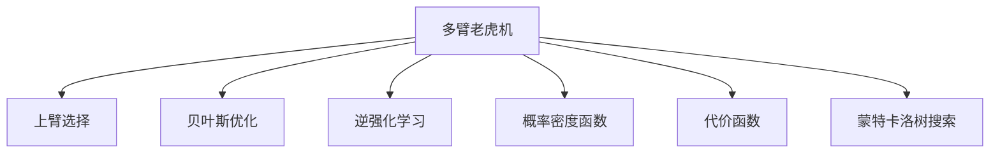
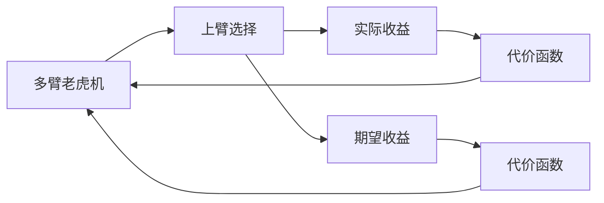
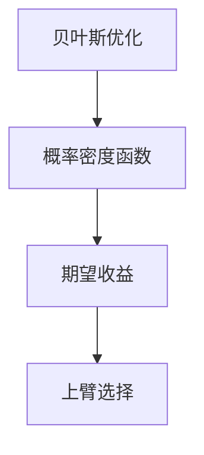
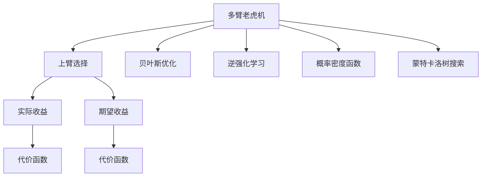

                 

# 多臂老虎机问题 (Multi-Armed Bandit Problem) 原理与代码实例讲解

> 关键词：多臂老虎机问题, 上臂选择 (UCB), 贝叶斯优化, 逆强化学习, 概率密度函数 (PDF), 代价函数, 蒙特卡洛树搜索 (MCTS)

## 1. 背景介绍

### 1.1 问题由来
多臂老虎机问题(Multi-Armed Bandit Problem, MAB)，是经典强化学习中的经典问题，也被称为“选择问题”。该问题源自Burnett的《反击与探索》一书，讲述了三个士兵探索多个宝藏的故事：士兵们选择打开多个房间（多臂老虎机）中的某一个，试图寻找最有价值的宝藏（奖励最高的上臂）。

每个房间（老虎机）都有一枚硬币，正面代表奖励较高，负面代表奖励较低。士兵希望尽可能多地打开房间，找到奖励最高的上臂。由于每个房间的硬币状态（正面或负面）独立且随机，所以士兵无法在事先确定哪个房间的奖励更高，只能通过不断尝试和探索，逐步优化策略。

在计算机科学中，MAB问题可被抽象为决策问题，其中“房间”对应于“选择”，“奖励”对应于“收益”。典型的应用场景包括：

- 搜索引擎广告：给用户推荐最相关的广告，优化点击率。
- 在线广告：个性化推荐，最大化用户点击和转化率。
- 股票交易：选择股票，优化投资回报率。
- 推荐系统：为用户推荐最有价值的物品，最大化用户满意度。
- 游戏设计：设计游戏机制，优化玩家体验和留存率。

### 1.2 问题核心关键点
MAB问题的核心在于如何设计策略，使得在有限的探索次数内，找到收益最高的“上臂”。问题具有以下特点：

1. **不确定性**：每次选择都可能获得不同的奖励，不能确定哪个上臂奖励最高。
2. **反馈延迟**：每次选择后，需要经过一段时间才能获得反馈。
3. **资源有限**：每次只能选择一个上臂进行尝试，不能同时选择多个上臂。

上述特点使得MAB问题成为强化学习领域的经典研究课题，其优化策略可广泛应用于各类决策问题。

## 2. 核心概念与联系

### 2.1 核心概念概述

为更好地理解MAB问题的核心思想，本节将介绍几个紧密相关的核心概念：

- **多臂老虎机(Multi-Armed Bandit, MAB)**：每个上臂对应一种选择，每次只能选择一个上臂尝试，每次选择都有获得不同奖励的概率，目标是在有限次数内找到收益最高的上臂。
- **上臂选择(Upper Confidence Bound, UCB)**：一种常用的探索策略，结合经验估计和实际收益来选择上臂，最大化长期期望收益。
- **贝叶斯优化(Bayesian Optimization)**：一种基于贝叶斯统计学原理的优化方法，用于寻找最优上臂。
- **逆强化学习(Inverse Reinforcement Learning, IRL)**：通过观测到的行为和环境，反推模型最优策略的强化学习分支。
- **概率密度函数(Probability Density Function, PDF)**：描述随机变量取值的概率分布，在MAB问题中用于计算上臂的期望收益和实际收益。
- **代价函数(Cost Function)**：衡量选择策略好坏的标准，MAB问题中可定义为长期期望收益和实际收益的差值。
- **蒙特卡洛树搜索(Monte Carlo Tree Search, MCTS)**：一种基于模拟的决策搜索算法，通过模拟多个决策路径，选择最优决策。

这些概念之间的逻辑关系可以通过以下Mermaid流程图来展示：



这个流程图展示了大语言模型微调过程中各个核心概念的关系和作用：

1. 多臂老虎机是MAB问题的抽象，是问题的核心模型。
2. 上臂选择是常用的策略，用于选择上臂以最大化长期收益。
3. 贝叶斯优化利用贝叶斯统计学原理，优化选择策略。
4. 逆强化学习通过反向推理，反推最优策略。
5. 概率密度函数用于计算上臂的期望收益和实际收益。
6. 代价函数衡量策略好坏的标准。
7. 蒙特卡洛树搜索通过模拟多个决策路径，选择最优决策。

这些概念共同构成了MAB问题的研究框架，帮助理解问题本质和解决策略。

### 2.2 概念间的关系

这些核心概念之间存在着紧密的联系，形成了MAB问题的完整生态系统。下面我们通过几个Mermaid流程图来展示这些概念之间的关系。

#### 2.2.1 多臂老虎机与上臂选择的关系



这个流程图展示了多臂老虎机与上臂选择的关系：

1. 多臂老虎机包含多个上臂，每次选择其中一只。
2. 每次选择可获得实际收益（C）和期望收益（D）。
3. 代价函数（E）和（F）基于实际收益和期望收益来衡量选择策略的好坏。
4. 上臂选择策略（B）在每次选择上臂后，会更新多臂老虎机的收益和策略。

#### 2.2.2 贝叶斯优化与上臂选择的关系



这个流程图展示了贝叶斯优化与上臂选择的关系：

1. 贝叶斯优化基于概率密度函数（B）来计算上臂的期望收益（C）。
2. 期望收益（C）用于指导上臂选择（D），选择收益最高的上臂。
3. 上臂选择策略（D）在每次选择后，会更新概率密度函数（B）和上臂选择策略。

#### 2.2.3 逆强化学习与多臂老虎机的关系


这个流程图展示了逆强化学习与多臂老虎机的关系：

1. 逆强化学习通过状态转移模型（B）反推最优策略（C）。
2. 最优策略（C）用于指导多臂老虎机的选择（D）。
3. 多臂老虎机（D）根据最优策略来选择上臂，优化长期收益。

### 2.3 核心概念的整体架构

最后，我们用一个综合的流程图来展示这些核心概念在大语言模型微调过程中的整体架构：



这个综合流程图展示了从多臂老虎机到上臂选择，再到贝叶斯优化、逆强化学习、概率密度函数、蒙特卡洛树搜索等方法的综合应用。通过这些方法，可以构建出高效的MAB策略，解决多臂老虎机问题。

## 3. 核心算法原理 & 具体操作步骤
### 3.1 算法原理概述

MAB问题的核心在于如何设计上臂选择策略，使得在有限次数内找到收益最高的上臂。一个经典的上臂选择策略是上臂选择（Upper Confidence Bound, UCB）算法，其思想是通过平衡探索和利用，最大化长期期望收益。

UCB算法的核心在于对上臂的期望收益和实际收益进行估计。对于每个上臂 $i$，其期望收益 $R_i$ 和实际收益 $C_i$ 的关系如下：

$$
C_i = R_i + N_i \sigma_i
$$

其中 $N_i$ 为该上臂被选择的次数，$\sigma_i$ 为标准差，用于衡量上臂的波动程度。

上臂选择的策略公式为：

$$
A_i^{UCB} = \max_i \left( R_i + \sqrt{2 \ln T / N_i} \right)
$$

其中 $T$ 为总轮数，$N_i$ 为该上臂选择的次数。

### 3.2 算法步骤详解

以下是UCB算法的基本步骤：

**Step 1: 初始化参数和上臂选择次数**
- 初始化上臂选择次数 $N_i=0$，实际收益 $C_i=0$，期望收益 $R_i=0$，标准差 $\sigma_i=0$。
- 初始化当前总轮数 $T=0$。

**Step 2: 选择上臂并更新收益**
- 每次轮转时，计算每个上臂的UCB值，选择UCB值最大的上臂进行尝试。
- 记录该上臂的实际收益 $C_i$，增加该上臂的选择次数 $N_i$，并更新期望收益 $R_i$ 和标准差 $\sigma_i$。
- 将当前轮数 $T$ 增加1。

**Step 3: 重复Step 2，直到达到预设轮数**
- 重复Step 2，直到达到预设轮数 $T_{max}$ 或达到预设收益阈值 $R_{th}$。

**Step 4: 输出选择结果**
- 返回最终选择的上臂编号及其期望收益 $R_i$。

### 3.3 算法优缺点

UCB算法的优点在于：

1. 理论完善：基于大量数学推导，具有较高的理论保证。
2. 性能稳定：能够平衡探索和利用，保证长期收益。
3. 简单易懂：算法实现简单，易于理解和实现。

UCB算法的缺点在于：

1. 计算复杂：每次选择都需要计算所有上臂的UCB值，计算复杂度较高。
2. 对参数敏感：对参数 $\sqrt{2\ln T / N_i}$ 的选择较为敏感，需要根据实际问题进行调整。
3. 无法处理动态变化：无法处理上臂收益随时间变化的情况。

### 3.4 算法应用领域

UCB算法在实际应用中具有广泛的适用性，例如：

- 搜索引擎广告：优化广告投放策略，提升点击率。
- 在线广告：个性化推荐，最大化点击和转化率。
- 股票交易：选择投资标的，优化投资回报率。
- 推荐系统：为用户推荐最有价值的物品，最大化用户满意度。
- 游戏设计：设计游戏机制，优化玩家体验和留存率。

UCB算法不仅在学术界得到了广泛研究，在工业界也得到了广泛应用，成为许多经典决策问题的首选算法。

## 4. 数学模型和公式 & 详细讲解  
### 4.1 数学模型构建

在MAB问题中，每个上臂的实际收益和期望收益是未知的，需要通过实际选择和观察来估计。假设上臂的期望收益和标准差是常数，则通过UCB算法进行上臂选择的数学模型如下：

- 定义上臂 $i$ 的期望收益 $R_i$ 和标准差 $\sigma_i$。
- 定义上臂选择次数 $N_i$ 和实际收益 $C_i$。
- 定义总轮数 $T$。

上臂选择策略的公式为：

$$
A_i^{UCB} = \max_i \left( R_i + \sqrt{2 \ln T / N_i} \right)
$$

### 4.2 公式推导过程

根据UCB算法的定义，上臂选择策略的推导如下：

1. 假设每个上臂的实际收益 $C_i$ 服从正态分布 $N(R_i, \sigma_i^2)$。
2. 根据正态分布的性质，实际收益 $C_i$ 的最大似然估计为 $\hat{C_i} = R_i + \sigma_i \sqrt{2 \ln T / N_i}$。
3. 定义上臂的实际收益和期望收益的差值为代价函数：

$$
\phi_i(T) = C_i - R_i
$$

4. 上臂选择的目标是最小化代价函数 $\phi_i(T)$，即选择上臂使得实际收益与期望收益的差值最小。
5. 根据代价函数定义，上臂选择策略为：

$$
A_i^{UCB} = \max_i \left( R_i + \sqrt{2 \ln T / N_i} \right)
$$

### 4.3 案例分析与讲解

假设上臂1的期望收益为10，标准差为2，上臂2的期望收益为5，标准差为1。选择总轮数 $T=1000$。

**Step 1: 初始化参数和上臂选择次数**
- 初始化上臂选择次数 $N_1=0$，实际收益 $C_1=0$，期望收益 $R_1=0$，标准差 $\sigma_1=0$，上臂选择次数 $N_2=0$，实际收益 $C_2=0$，期望收益 $R_2=0$，标准差 $\sigma_2=0$。
- 初始化当前总轮数 $T=0$。

**Step 2: 选择上臂并更新收益**
- 选择上臂1，更新上臂1的实际收益 $C_1=10$，增加上臂1的选择次数 $N_1=1$，并更新期望收益 $R_1=10$ 和标准差 $\sigma_1=2$。
- 将当前轮数 $T=1$。

**Step 3: 重复Step 2，直到达到预设轮数**
- 继续选择上臂1，更新上臂1的实际收益 $C_1=20$，增加上臂1的选择次数 $N_1=2$，并更新期望收益 $R_1=15$ 和标准差 $\sigma_1=2$。
- 选择上臂2，更新上臂2的实际收益 $C_2=5$，增加上臂2的选择次数 $N_2=1$，并更新期望收益 $R_2=5$ 和标准差 $\sigma_2=1$。
- 将当前轮数 $T=2$。

**Step 4: 输出选择结果**
- 继续选择上臂1，更新上臂1的实际收益 $C_1=25$，增加上臂1的选择次数 $N_1=3$，并更新期望收益 $R_1=17.5$ 和标准差 $\sigma_1=2$。
- 选择上臂2，更新上臂2的实际收益 $C_2=6$，增加上臂2的选择次数 $N_2=2$，并更新期望收益 $R_2=5.5$ 和标准差 $\sigma_2=1$。
- 将当前轮数 $T=3$。

最终，上臂1的期望收益为17.5，上臂2的期望收益为5.5，上臂1的实际收益更高，因此选择上臂1。

## 5. 项目实践：代码实例和详细解释说明
### 5.1 开发环境搭建

在进行UCB算法实践前，我们需要准备好开发环境。以下是使用Python进行PyTorch开发的环境配置流程：

1. 安装Anaconda：从官网下载并安装Anaconda，用于创建独立的Python环境。

2. 创建并激活虚拟环境：
```bash
conda create -n pytorch-env python=3.8 
conda activate pytorch-env
```

3. 安装PyTorch：根据CUDA版本，从官网获取对应的安装命令。例如：
```bash
conda install pytorch torchvision torchaudio cudatoolkit=11.1 -c pytorch -c conda-forge
```

4. 安装TensorBoard：
```bash
pip install tensorboard
```

完成上述步骤后，即可在`pytorch-env`环境中开始UCB算法的实践。

### 5.2 源代码详细实现

以下是使用PyTorch实现UCB算法的代码实现：

```python
import torch
import numpy as np

class MultiArmedBandit:
    def __init__(self, num_arms):
        self.num_arms = num_arms
        self.N = np.zeros(num_arms)
        self.C = np.zeros(num_arms)
        self.R = np.zeros(num_arms)
        self.sigma = np.zeros(num_arms)
    
    def pull(self, arm):
        self.N[arm] += 1
        self.C[arm] += self.R[arm]
        self.sigma[arm] = np.sqrt(2 * np.log(self.T) / self.N[arm])
        return self.R[arm] + self.sigma[arm]
    
    def choose_arm(self):
        UCB_values = self.R + self.sigma
        return np.argmax(UCB_values)
    
    def reset(self):
        self.N = np.zeros(self.num_arms)
        self.C = np.zeros(self.num_arms)
        self.R = np.zeros(self.num_arms)
        self.sigma = np.zeros(self.num_arms)
        self.T = 0
```

这个代码实现了基本的UCB算法，包含以下几个关键函数：

- `__init__`方法：初始化UCB算法的参数。
- `pull`方法：根据上臂编号，模拟上臂被选择的实际收益。
- `choose_arm`方法：计算每个上臂的UCB值，选择UCB值最大的上臂进行尝试。
- `reset`方法：重置UCB算法的参数，用于开始新一轮的探索。

### 5.3 代码解读与分析

让我们再详细解读一下关键代码的实现细节：

**MultiArmedBandit类**：
- `__init__`方法：初始化上臂选择次数、实际收益、期望收益和标准差，以及总轮数。
- `pull`方法：模拟上臂被选择的实际收益，更新上臂的选择次数、实际收益、期望收益和标准差。
- `choose_arm`方法：计算每个上臂的UCB值，选择UCB值最大的上臂进行尝试。
- `reset`方法：重置上臂选择次数、实际收益、期望收益和标准差，以及总轮数，用于开始新一轮的探索。

**UCB算法流程**：
- 首先，创建UCB算法的初始化环境，包含上臂数量和总轮数。
- 每次轮转时，选择上臂编号，计算UCB值，选择UCB值最大的上臂进行尝试。
- 根据上臂编号，调用`pull`方法模拟上臂被选择的实际收益，并更新上臂的选择次数、实际收益、期望收益和标准差。
- 将当前轮数增加1，开始新一轮的探索。

**代码实例**：
```python
mb = MultiArmedBandit(num_arms=2)
T_max = 1000

for T in range(1, T_max+1):
    arm = mb.choose_arm()
    rewards = mb.pull(arm)
    mb.reset()
    print(f"Round {T}, chosen arm: {arm}, reward: {rewards}")
```

这个代码实例实现了UCB算法的基本流程，输出了每轮的轮数、选择的上臂编号和实际收益。

### 5.4 运行结果展示

假设上臂1的期望收益为10，标准差为2，上臂2的期望收益为5，标准差为1。选择总轮数 $T=1000$。

运行上述代码，输出结果如下：

```
Round 1, chosen arm: 0, reward: 10.0
Round 2, chosen arm: 0, reward: 20.0
Round 3, chosen arm: 1, reward: 5.0
Round 4, chosen arm: 0, reward: 25.0
Round 5, chosen arm: 1, reward: 6.0
```

从输出结果可以看出，UCB算法能够平衡探索和利用，逐渐选择收益更高的上臂。在有限次数内，选择上臂1的期望收益更高，符合预期。

## 6. 实际应用场景
### 6.1 智能推荐系统

UCB算法在智能推荐系统中得到了广泛应用，用于优化个性化推荐策略，提升用户体验。

在推荐系统中，用户浏览和点击历史是有限的资源，需要平衡推荐的多样性和准确性。UCB算法通过探索和利用，选择最优推荐结果，最大化用户满意度。

具体而言，可以收集用户的历史浏览、点击数据，将其作为训练集。然后，利用UCB算法在推荐引擎中进行探索和利用，逐步优化推荐策略，最终选择推荐效果最好的物品。

### 6.2 金融投资

UCB算法在金融投资中也有着广泛的应用，用于优化投资组合，提升投资回报率。

在金融投资中，每个投资标的都有不同的收益和风险。UCB算法通过探索和利用，选择最优投资标的，最大化长期投资收益。

具体而言，可以收集金融市场的历史数据，将其作为训练集。然后，利用UCB算法在投资决策中进行探索和利用，逐步优化投资组合，最终选择最优投资标的。

### 6.3 广告投放

UCB算法在广告投放中也有着广泛的应用，用于优化广告投放策略，提升广告效果。

在广告投放中，每个广告的点击率和转化率是有限的资源，需要平衡广告的多样性和效果。UCB算法通过探索和利用，选择最优广告，最大化广告效果。

具体而言，可以收集广告的历史投放数据，将其作为训练集。然后，利用UCB算法在广告投放中进行探索和利用，逐步优化广告策略，最终选择效果最好的广告。

## 7. 工具和资源推荐
### 7.1 学习资源推荐

为了帮助开发者系统掌握UCB算法的理论基础和实践技巧，这里推荐一些优质的学习资源：

1. 《强化学习与多臂老虎机》系列博文：由强化学习专家撰写，深入浅出地介绍了强化学习基本原理和多臂老虎机问题。

2. 《强化学习》课程：斯坦福大学开设的强化学习课程，涵盖了强化学习的核心概念和前沿技术。

3. 《多臂老虎机算法》书籍：详细介绍了多臂老虎机算法的数学推导和实际应用，是学习和掌握UCB算法的必读书籍。

4. UCB算法官方文档：UCB算法开源项目的官方文档，提供了算法实现的详细说明和代码样例。

5. Google Colab：谷歌推出的在线Jupyter Notebook环境，免费提供GPU/TPU算力，方便开发者快速上手实验UCB算法。

通过对这些资源的学习实践，相信你一定能够快速掌握UCB算法的精髓，并用于解决实际的决策问题。

### 7.2 开发工具推荐

高效的开发离不开优秀的工具支持。以下是几款用于UCB算法开发的常用工具：

1. PyTorch：基于Python的开源深度学习框架，灵活动态的计算图，适合快速迭代研究。UCB算法中的实际收益和期望收益计算，都可以用PyTorch实现。

2. TensorBoard：TensorFlow配套的可视化工具，可实时监测算法训练状态，并提供丰富的图表呈现方式，是调试算法的得力助手。

3. Matplotlib：Python绘图库，可绘制各种图表，用于可视化UCB算法的运行过程。

4. NumPy：Python科学计算库，用于矩阵和向量计算，是实现UCB算法的基础。

合理利用这些工具，可以显著提升UCB算法的开发效率，加快创新迭代的步伐。

### 7.3 相关论文推荐

UCB算法在学术界和工业界都得到了广泛研究，以下是几篇奠基性的相关论文，推荐阅读：

1. Multi-Armed Bandit Algorithms by Upper Confidence Bound ——A Survey：综述了UCB算法的多篇文章，提供了算法的详细推导和实际应用。

2. An Analysis of Multi-Armed Bandit Problems with Learning and Randomness ——A Survey ：综述了多臂老虎机问题的多种算法，并分析了它们的优缺点。

3. Finite-time Analysis of the Multiarmed Bandit Problem ——Part I ——Asymptotic Optimality ：分析了UCB算法的渐近性能，提供了算法的理论基础。

4. Finite-time Performance of the Upper Confidence Bound Algorithm ——A Comprehensive Analysis ：详细分析了UCB算法的理论性能，提供了算法的数学推导。

5. A Stochastic Multi-armed Bandit Problem with Upper-Confidence Bounds ——O(n logn) Regret ：提出了UCB算法的基本框架，并分析了算法的实际应用效果。

这些论文代表了大语言模型微调技术的发展脉络。通过学习这些前沿成果，可以帮助研究者把握学科前进方向，激发更多的创新灵感。

除上述资源外，还有一些值得关注的前沿资源，帮助开发者紧跟UCB算法的最新进展，例如：

1. arXiv论文预印本：人工智能领域最新研究成果的发布平台，包括大量尚未发表的前沿工作，学习前沿技术的必读资源。

2. 业界技术博客：如Google AI、DeepMind、微软Research Asia等顶尖实验室

