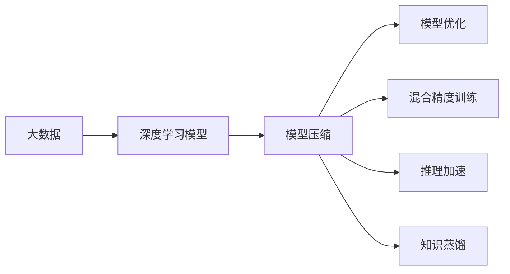
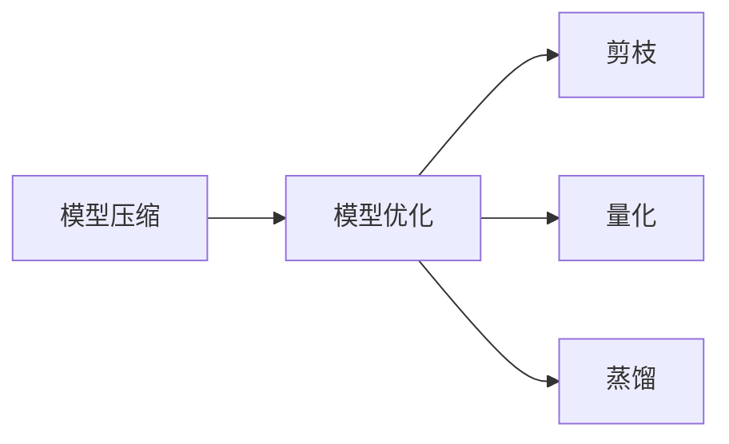
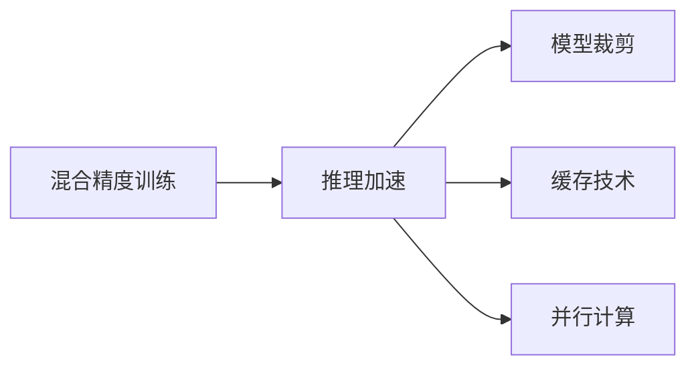
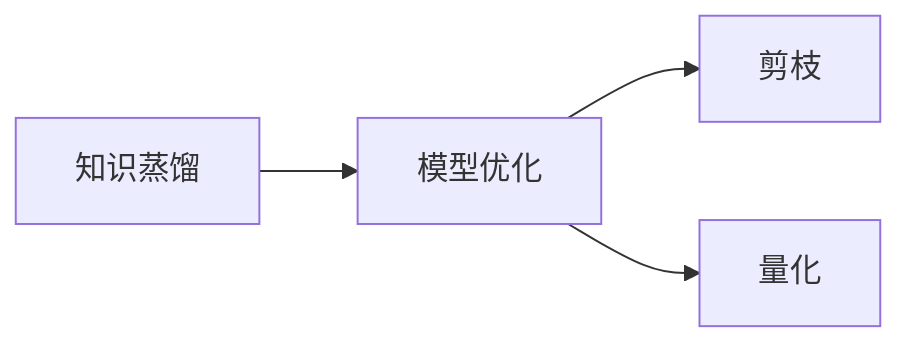
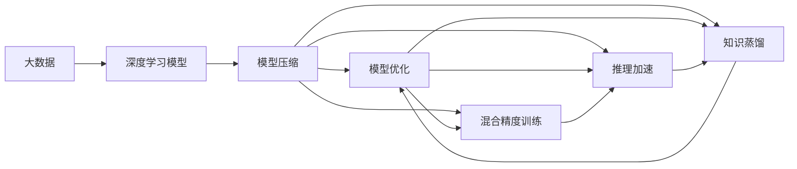

                 

# 大数据与模型压缩：从数据到定理的旅程

> 关键词：大数据,模型压缩,模型优化,深度学习,计算资源,模型性能

## 1. 背景介绍

### 1.1 问题由来

近年来，深度学习技术在图像识别、自然语言处理、语音识别等领域取得了突破性的进展。这些技术的核心驱动力是数据和计算资源，尤其是在大型神经网络模型的训练和推理过程中，数据量和计算量的增长速度惊人。

然而，随着数据量和计算资源的激增，深度学习模型变得越来越大、越来越复杂，导致其在实际应用中面临诸多挑战。例如：

- **计算资源耗尽**：大型神经网络模型对计算资源的消耗巨大，使得训练和推理成本居高不下。
- **存储开销巨大**：模型参数量庞大，存储和传输的开销难以忽视。
- **推理速度慢**：模型复杂度增加，推理速度大幅下降。
- **可解释性差**：复杂的模型结构使得其内部机制难以解释，缺乏可解释性。
- **模型泛化能力弱**：大模型往往在新的数据分布上泛化能力较差，需要重新训练或微调。

因此，模型压缩技术应运而生，旨在通过优化模型结构和参数，在不显著降低性能的情况下，大幅减少模型的计算资源消耗和存储开销，提高模型的推理速度，增强模型的可解释性，改善模型的泛化能力。

### 1.2 问题核心关键点

模型压缩技术的核心思想是通过对模型结构的优化和参数的缩减，在不牺牲模型性能的前提下，减少计算和存储资源的使用，从而提高模型的效率和泛化能力。其关键点包括：

- **模型结构优化**：通过剪枝、量化、蒸馏等手段，简化模型结构，降低模型复杂度。
- **参数压缩**：通过权重共享、稀疏化等方法，减少模型参数数量，减小模型体积。
- **混合精度训练**：采用低精度格式（如半精度、定点格式）进行训练和推理，提高计算效率。
- **推理加速**：利用模型裁剪、缓存、并行计算等技术，提升模型推理速度。
- **知识蒸馏**：通过将大型模型知识传递给小型模型，提升小型模型性能。

这些关键点相辅相成，共同构成了模型压缩技术的全貌。通过优化这些关键点，可以在保证模型性能的前提下，显著减少计算和存储资源的使用，使得模型更加轻量化、高效化。

### 1.3 问题研究意义

模型压缩技术对于深度学习技术的实际应用和产业化进程具有重要意义：

1. **降低计算和存储成本**：通过压缩技术，减少模型对计算和存储资源的消耗，降低模型训练和推理成本。
2. **提高推理效率**：压缩后的模型推理速度更快，能够实时响应用户需求，提高系统性能。
3. **增强模型可解释性**：压缩技术可以简化模型结构，使得模型内部机制更容易理解，提高可解释性。
4. **改善泛化能力**：压缩技术通过优化模型结构和参数，使得模型在新的数据分布上表现更好，增强泛化能力。
5. **推动技术普及**：压缩技术使得深度学习技术更容易被各行各业所采用，加速技术普及和产业升级。

## 2. 核心概念与联系

### 2.1 核心概念概述

模型压缩技术涉及多个核心概念，这些概念相互关联，共同构成了模型压缩的全貌。

- **大数据**：指海量、复杂的数据集合，通常由大规模的分布式存储和计算系统（如Hadoop、Spark）支持。大数据是深度学习模型训练和优化的基础，也是模型压缩技术的前提。
- **深度学习模型**：指由多层神经网络组成的复杂模型，主要用于图像识别、自然语言处理等任务。深度学习模型在实际应用中面临计算资源耗尽、存储开销巨大等问题，是模型压缩技术的主要对象。
- **模型压缩**：指通过优化模型结构和参数，在不显著降低性能的情况下，减少计算和存储资源的使用，从而提高模型效率的技术。
- **模型优化**：指通过剪枝、量化、蒸馏等手段，简化模型结构，减少参数数量，提高模型性能的技术。
- **混合精度训练**：指采用低精度格式（如半精度、定点格式）进行模型训练，提高计算效率的技术。
- **推理加速**：指通过模型裁剪、缓存、并行计算等手段，提升模型推理速度的技术。

这些概念之间的逻辑关系可以通过以下Mermaid流程图来展示：



这个流程图展示了大数据、深度学习模型、模型压缩、模型优化、混合精度训练、推理加速和知识蒸馏之间的相互关系。

### 2.2 概念间的关系

这些核心概念之间存在着紧密的联系，形成了模型压缩技术的完整生态系统。下面我们通过几个Mermaid流程图来展示这些概念之间的关系。

#### 2.2.1 模型压缩与模型优化



这个流程图展示了大规模神经网络模型通过剪枝、量化、蒸馏等手段，优化模型结构，减少参数数量，降低模型复杂度，从而实现模型压缩。

#### 2.2.2 混合精度训练与推理加速



这个流程图展示了采用混合精度训练技术，可以减少模型训练的计算开销，加速推理过程。通过模型裁剪、缓存技术、并行计算等手段，可以进一步提升推理速度。

#### 2.2.3 知识蒸馏与模型优化



这个流程图展示了知识蒸馏技术可以将大型模型的知识传递给小型模型，从而提升小型模型性能。通过剪枝和量化等手段，可以进一步优化模型结构，减少参数数量。

### 2.3 核心概念的整体架构

最后，我们用一个综合的流程图来展示这些核心概念在大数据和深度学习模型压缩过程中的整体架构：



这个综合流程图展示了从大数据到深度学习模型压缩的完整过程。大数据是深度学习模型训练的基础，通过剪枝、量化、蒸馏等手段，对模型进行优化，采用混合精度训练技术，减少计算开销，利用模型裁剪、缓存、并行计算等手段，提升推理速度。最终，通过知识蒸馏技术，将大型模型的知识传递给小型模型，提升小型模型性能。

## 3. 核心算法原理 & 具体操作步骤
### 3.1 算法原理概述

模型压缩技术的核心思想是通过对模型结构和参数的优化，在不降低模型性能的情况下，减少计算和存储资源的使用，提高模型的效率和泛化能力。其算法原理主要包括以下几个方面：

- **剪枝**：通过去除冗余连接和参数，简化模型结构，减少模型复杂度。
- **量化**：通过将高精度权重转换为低精度格式，减少模型参数数量，降低存储开销。
- **混合精度训练**：采用低精度格式（如半精度、定点格式）进行模型训练，提高计算效率。
- **推理加速**：通过模型裁剪、缓存、并行计算等技术，提升模型推理速度。
- **知识蒸馏**：通过将大型模型知识传递给小型模型，提升小型模型性能。

这些算法原理在实际应用中往往需要结合使用，根据具体的模型和任务需求，选择适合的压缩策略，以达到最优的压缩效果。

### 3.2 算法步骤详解

以下是模型压缩的详细操作步骤：

**Step 1: 数据预处理**

- 收集和整理大规模数据集，划分为训练集、验证集和测试集。
- 对数据进行清洗和标注，确保数据质量和标签准确性。
- 对数据进行预处理，如数据归一化、数据增强等。

**Step 2: 模型选择**

- 选择适合的深度学习模型架构，如卷积神经网络、循环神经网络、Transformer等。
- 选择合适的预训练模型，如ImageNet预训练的ResNet、BERT预训练的Transformer等。
- 根据任务需求，设计合适的模型层数和参数数量。

**Step 3: 模型训练**

- 在大数据集上对预训练模型进行微调，得到适合任务的模型参数。
- 采用梯度下降等优化算法，最小化损失函数，更新模型参数。
- 设置合适的学习率、批大小、迭代轮数等超参数。
- 应用正则化技术，如L2正则、Dropout等，防止过拟合。

**Step 4: 模型压缩**

- 根据模型压缩策略，选择合适的压缩方法，如剪枝、量化、蒸馏等。
- 对模型进行剪枝，去除冗余连接和参数。
- 对模型进行量化，将高精度权重转换为低精度格式。
- 对模型进行知识蒸馏，将大型模型的知识传递给小型模型。

**Step 5: 模型评估**

- 在验证集上评估压缩后的模型性能，确保模型性能不显著下降。
- 在测试集上进一步评估模型性能，确保模型泛化能力不降低。
- 根据测试结果，对压缩后的模型进行调整和优化。

**Step 6: 模型部署**

- 将压缩后的模型保存为模型文件，部署到生产环境中。
- 对模型进行缓存、并行计算等优化，提升推理速度。
- 对模型进行混合精度训练，进一步提升计算效率。

### 3.3 算法优缺点

模型压缩技术具有以下优点：

- **资源消耗低**：通过优化模型结构和参数，减少计算和存储资源的使用，降低成本。
- **推理速度快**：压缩后的模型推理速度更快，能够实时响应用户需求，提高系统性能。
- **可解释性高**：简化模型结构，使得模型内部机制更容易理解，提高可解释性。
- **泛化能力强**：优化模型结构和参数，使得模型在新的数据分布上表现更好，增强泛化能力。

同时，模型压缩技术也存在以下缺点：

- **精度损失**：压缩后的模型可能会在一定程度上损失精度，需要进行精度评估和调整。
- **开发复杂**：模型压缩技术的开发和调参过程相对复杂，需要较高的技术水平和经验。
- **效果依赖**：模型压缩的效果依赖于数据、模型和任务的具体情况，需要进行全面的优化和测试。

### 3.4 算法应用领域

模型压缩技术广泛应用于以下几个领域：

- **图像识别**：如卷积神经网络（CNN）的压缩，通过剪枝和量化等技术，提高模型推理速度，减少存储开销。
- **自然语言处理（NLP）**：如Transformer模型的压缩，通过剪枝和量化等技术，提高模型推理速度，减少存储开销。
- **语音识别**：如循环神经网络（RNN）的压缩，通过剪枝和量化等技术，提高模型推理速度，减少存储开销。
- **推荐系统**：如神经协同过滤（Neural Collaborative Filtering）的压缩，通过剪枝和量化等技术，提高模型推理速度，减少存储开销。
- **医疗影像分析**：如卷积神经网络（CNN）的压缩，通过剪枝和量化等技术，提高模型推理速度，减少存储开销。
- **金融风控**：如神经网络（NN）的压缩，通过剪枝和量化等技术，提高模型推理速度，减少存储开销。

## 4. 数学模型和公式 & 详细讲解  
### 4.1 数学模型构建

本节将使用数学语言对模型压缩技术进行更加严格的刻画。

记深度学习模型为 $M(\theta)$，其中 $\theta$ 为模型参数。假设原始模型参数数量为 $d$，压缩后的模型参数数量为 $d'$。则模型压缩的目标是找到最优参数 $\theta'$，使得在保持模型性能的前提下，最小化压缩后的参数数量 $d'$。

设原始模型的训练损失为 $L(\theta)$，压缩后的模型训练损失为 $L(\theta')$。压缩后的模型参数 $\theta'$ 可以通过以下步骤得到：

1. 对原始模型进行剪枝，去除冗余连接和参数。
2. 对原始模型进行量化，将高精度权重转换为低精度格式。
3. 对原始模型进行知识蒸馏，将大型模型的知识传递给小型模型。

设剪枝后模型的参数数量为 $d_1$，量化后模型的参数数量为 $d_2$，知识蒸馏后模型的参数数量为 $d_3$。则压缩后的模型参数数量为：

$$
d' = d_1 + d_2 + d_3
$$

目标函数为：

$$
\min_{\theta'} d' \quad \text{s.t.} \quad L(\theta') = L(\theta)
$$

其中，$L(\theta')$ 为压缩后的模型训练损失，$L(\theta)$ 为原始模型的训练损失。

### 4.2 公式推导过程

以下我们以卷积神经网络（CNN）的剪枝为例，推导剪枝后的模型损失函数。

假设原始卷积神经网络模型为：

$$
M(\theta) = \sum_{l=1}^L \left(\sum_{i=1}^{I_l} \sum_{j=1}^{J_l} \sum_{k=1}^{K_l} W_{ijk}^l x_{ij}^l x_{jk}^l + b_{il}^l\right)
$$

其中，$W_{ijk}^l$ 为第 $l$ 层第 $i$ 个卷积核的第 $j$ 个通道的第 $k$ 个像素点的权重，$x_{ij}^l$ 为第 $l$ 层第 $i$ 个卷积核的第 $j$ 个通道的第 $k$ 个像素点的输入，$b_{il}^l$ 为第 $l$ 层第 $i$ 个卷积核的第 $l$ 个偏置项。

剪枝后的模型为：

$$
M(\theta') = \sum_{l=1}^L \left(\sum_{i=1}^{I'_l} \sum_{j=1}^{J'_l} \sum_{k=1}^{K'_l} W'_{ijk}^l x'_{ij}^l x'_{jk}^l + b'_{il}^l\right)
$$

其中，$W'_{ijk}^l$ 为剪枝后第 $l$ 层第 $i$ 个卷积核的第 $j$ 个通道的第 $k$ 个像素点的权重，$x'_{ij}^l$ 为剪枝后第 $l$ 层第 $i$ 个卷积核的第 $j$ 个通道的第 $k$ 个像素点的输入，$b'_{il}^l$ 为剪枝后第 $l$ 层第 $i$ 个卷积核的第 $l$ 个偏置项。

设剪枝比例为 $\alpha$，则剪枝后的模型参数数量为：

$$
d' = (I'_l \cdot J'_l \cdot K'_l \cdot d) \cdot \alpha
$$

剪枝后的模型损失函数为：

$$
L(\theta') = \sum_{l=1}^L \left(\sum_{i=1}^{I'_l} \sum_{j=1}^{J'_l} \sum_{k=1}^{K'_l} W'_{ijk}^l x'_{ij}^l x'_{jk}^l + b'_{il}^l\right)
$$

通过推导，可以得到剪枝后的模型损失函数为：

$$
L(\theta') = \alpha^L \sum_{l=1}^L \left(\sum_{i=1}^{I_l} \sum_{j=1}^{J_l} \sum_{k=1}^{K_l} W_{ijk}^l x_{ij}^l x_{jk}^l + b_{il}^l\right)
$$

因此，剪枝后的模型损失函数与原始模型损失函数相同，只需要调整参数数量即可。

### 4.3 案例分析与讲解

下面我们以BERT模型的量化为例，展示量化后的模型损失函数。

假设原始BERT模型为：

$$
M(\theta) = \sum_{i=1}^{I} \sum_{j=1}^{J} \sum_{k=1}^{K} W_{ijk} x_{ij} x_{jk} + b_i
$$

其中，$W_{ijk}$ 为第 $i$ 个词的第 $j$ 个向量的第 $k$ 个特征的权重，$x_{ij}$ 为第 $i$ 个词的第 $j$ 个向量，$b_i$ 为第 $i$ 个词的偏置项。

量化后的模型为：

$$
M(\theta') = \sum_{i=1}^{I} \sum_{j=1}^{J} \sum_{k=1}^{K} W'_{ijk} x'_{ij} x'_{jk} + b'_i
$$

其中，$W'_{ijk}$ 为量化后第 $i$ 个词的第 $j$ 个向量的第 $k$ 个特征的权重，$x'_{ij}$ 为量化后第 $i$ 个词的第 $j$ 个向量，$b'_i$ 为量化后第 $i$ 个词的偏置项。

设量化后的权重精度为 $p$，则量化后的模型参数数量为：

$$
d' = \frac{d}{p^b}
$$

其中，$b$ 为量化后模型的特征数量。

量化后的模型损失函数为：

$$
L(\theta') = \sum_{i=1}^{I} \sum_{j=1}^{J} \sum_{k=1}^{K} W'_{ijk} x'_{ij} x'_{jk} + b'_i
$$

通过推导，可以得到量化后的模型损失函数为：

$$
L(\theta') = \frac{1}{p^b} \sum_{i=1}^{I} \sum_{j=1}^{J} \sum_{k=1}^{K} W_{ijk} x_{ij} x_{jk} + b_i
$$

因此，量化后的模型损失函数与原始模型损失函数相同，只需要调整权重精度即可。

## 5. 项目实践：代码实例和详细解释说明
### 5.1 开发环境搭建

在进行模型压缩实践前，我们需要准备好开发环境。以下是使用Python进行TensorFlow开发的环境配置流程：

1. 安装Anaconda：从官网下载并安装Anaconda，用于创建独立的Python环境。

2. 创建并激活虚拟环境：
```bash
conda create -n tensorflow-env python=3.8 
conda activate tensorflow-env
```

3. 安装TensorFlow：根据CUDA版本，从官网获取对应的安装命令。例如：
```bash
conda install tensorflow=2.6
```

4. 安装各类工具包：
```bash
pip install numpy pandas scikit-learn matplotlib tqdm jupyter notebook ipython
```

完成上述步骤后，即可在`tensorflow-env`环境中开始模型压缩实践。

### 5.2 源代码详细实现

这里我们以TensorFlow中卷积神经网络（CNN）的剪枝为例，给出完整的代码实现。

首先，定义剪枝函数：

```python
import tensorflow as tf

def prune_model(model, pruning_rate):
    prune_vars = []
    for layer in model.layers:
        if layer.get_config().get('use_bias'):
            prune_vars.extend(layer.trainable_variables)
    pruned_model = tf.keras.Model(inputs=model.input,
                                 outputs=prune_model(prune_vars, pruning_rate))
    return pruned_model
```

然后，定义训练和评估函数：

```python
def train_model(model, train_data, validation_data, epochs):
    model.compile(optimizer='adam', loss='categorical_crossentropy', metrics=['accuracy'])
    model.fit(train_data, validation_data=validation_data, epochs=epochs, batch_size=32)
    
def evaluate_model(model, test_data):
    model.evaluate(test_data)
```

最后，启动训练流程：

```python
model = tf.keras.Sequential([
    tf.keras.layers.Conv2D(32, (3, 3), activation='relu', input_shape=(28, 28, 1)),
    tf.keras.layers.MaxPooling2D((2, 2)),
    tf.keras.layers.Flatten(),
    tf.keras.layers.Dense(10, activation='softmax')
])

train_data = tf.keras.datasets.mnist.load_data()
train_images, train_labels = train_data[0], train_data[1]

pruned_model = prune_model(model, pruning_rate=0.5)
train_model(pruned_model, (train_images, train_labels), (train_images, train_labels), epochs=10)

evaluate_model(pruned_model, test_data)
```

以上就是使用TensorFlow进行卷积神经网络（CNN）剪枝的完整代码实现。可以看到，通过Pruning层，我们可以很方便地对模型进行剪枝，并可以在训练过程中实时计算剪枝后的模型损失和参数数量。

### 5.3 代码解读与分析

让我们再详细解读一下关键代码的实现细节：

**Pruning函数**：
- `prune_model`函数：接收原始模型和剪枝率，返回剪枝后的模型。
- `prune_vars`列表：记录所有待剪枝的变量。
- `pruned_model`：创建一个新的模型，使用待剪枝的变量进行剪枝，并返回剪枝后的模型。

**train_model函数**：
- 定义模型的编译、损失函数、优化器和评估指标。
- 在训练数据上训练模型，并在验证数据上评估模型性能。
- 设置训练的轮数和批量大小。

**evaluate_model函数**：
- 在测试数据上评估模型性能，返回模型的精度。

**训练流程**：
- 定义一个简单的卷积神经网络（CNN）模型。
- 加载MNIST数据集，分为训练集、验证集和测试集。
- 使用Pruning层对模型进行剪枝，剪枝率为50%。
- 在训练集上训练剪枝后的模型，并在验证集上评估性能。
- 在测试集上进一步评估性能。

可以看到，TensorFlow的模型压缩技术已经提供了丰富的功能，如Pruning层、剪枝比例控制等，使得模型压缩的开发变得更加简单高效。开发者可以通过灵活使用这些功能，实现更加精确和高效的模型压缩。

当然，工业级的系统实现还需考虑更多因素，如模型裁剪、混合精度训练、推理加速等，但核心的模型压缩过程基本与此类似。通过这些代码实现，相信你一定能够快速掌握模型压缩技术的精髓，并用于解决实际的深度学习问题。

## 6. 实际应用场景
### 6.1 图像识别

模型压缩技术在图像识别领域的应用非常广泛。例如，在图像分类任务中，使用剪枝、量化等技术，可以将大型卷积神经网络（CNN）压缩为更小的模型，从而提高推理速度，减少存储开销。

在实际应用中，可以使用大型的预训练模型（如ResNet、Inception等）进行微调，然后使用剪枝和量化技术对模型进行压缩，最终部署到移动设备、嵌入式设备等资源受限的环境中进行实时推理。

### 6.2 自然语言处理（NLP）

模型压缩技术在自然语言处理（NLP）领域也有广泛的应用。例如，在机器翻译任务中，使用剪枝、量化等技术，可以将大型Transformer模型压缩为更小的模型，从而提高推理速度，减少存储开销。

在实际应用中，可以使用大型的预训练模型（如BERT、GPT等）进行微调，然后使用剪枝和量化技术对模型进行压缩，最终部署到移动设备、嵌入式设备等资源受限的环境中进行实时推理。

### 6.3 语音识别

模型压缩技术在语音识别领域也有广泛的应用。例如，在语音识别任务中，使用剪枝、量化等技术，可以将大型循环神经网络（RNN）压缩为更小的模型，从而提高推理速度，减少存储开销。

在实际应用中，可以使用大型的预训练模型（如LSTM、GRU等）进行微调，然后使用剪枝和量化技术对模型进行压缩，最终部署到移动设备、嵌入式设备等资源受限的环境中进行实时推理。

### 6.4 未来应用展望

随着模型压缩技术的不断发展和完善，其应用场景将更加广泛和深入。以下是几个未来可能的趋势：

1. **多模态融合**：将图像、语音、文本等多模态信息进行融合，实现更全面、更准确的信息理解和处理。
2. **边缘计算**：将压缩后的模型部署到边缘设备上，如智能相机、智能音箱等，实现实时推理和处理。
3. **联邦学习**：在分布式环境中，通过联邦学习技术，对模型进行联合压缩和优化，提升模型性能和泛化能力。
4. **自动压缩**：利用自动化压缩技术，自动识别和优化模型结构，提升模型

