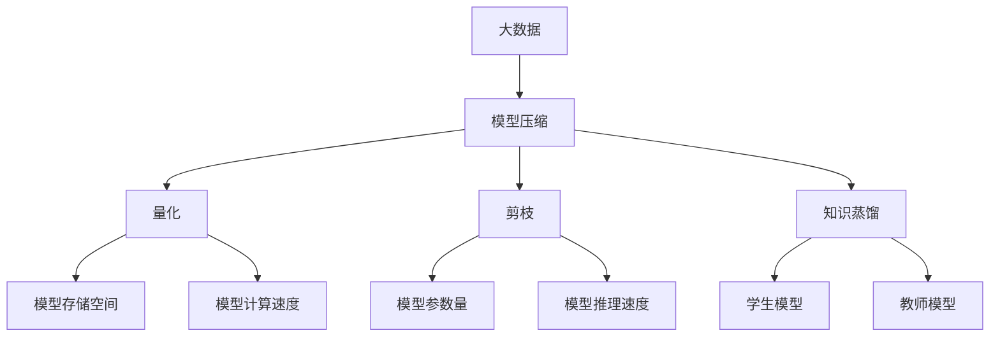

                 

## 1. 背景介绍

在当今大数据时代，随着数据量的激增和模型复杂度的不断提升，模型训练和推理的效率、资源消耗和计算成本等问题愈发突出。模型压缩技术应运而生，旨在通过优化模型结构、参数和推理过程，实现模型在保持高性能的同时，有效降低资源消耗和计算成本。本文将深入探讨大数据与模型压缩的相关概念、原理和实践，为读者提供一个系统、全面的技术指引。

## 2. 核心概念与联系

### 2.1 核心概念概述

为更好地理解大数据与模型压缩的技术，本节将介绍几个关键概念：

- **大数据（Big Data）**：指规模巨大、种类繁多、速度快且具有价值密度低的特点的数据集合。大数据分析需要处理大量的非结构化数据，如文本、图像、视频等，对计算能力和存储空间提出了极高的要求。

- **模型压缩（Model Compression）**：指通过减少模型参数、优化模型结构、剪枝冗余运算等方式，在不牺牲模型性能的前提下，减少模型计算量和存储空间的技术。模型压缩是深度学习时代优化的重要方向，可以有效降低模型训练和推理的资源消耗，提升模型的实时性和可部署性。

- **量化（Quantization）**：指将浮点数（例如32位或64位）转换为整数（例如8位或16位）的过程。量化可以有效降低模型的存储空间和计算开销，特别是在移动端和嵌入式设备上。

- **剪枝（Pruning）**：指去除模型中冗余的参数和连接，保留关键路径和节点。剪枝可以大幅减少模型的参数量，同时保持模型性能。

- **知识蒸馏（Knowledge Distillation）**：指将大型模型（教师模型）的知识转移到小型模型（学生模型），使学生模型在保留关键特征的同时，降低计算复杂度和存储空间。

这些核心概念之间存在着紧密的联系，共同构成了大数据与模型压缩的完整生态系统。通过优化模型结构和参数，结合量化、剪枝和知识蒸馏等技术，可以在保持模型性能的前提下，显著提升模型的实时性和可部署性。

### 2.2 概念间的关系

这些核心概念之间存在着复杂的相互作用和依赖关系，可以用以下Mermaid流程图来展示：



这个流程图展示了大数据和模型压缩技术之间的关系。大数据提供了模型训练和推理的基础，而模型压缩技术通过量化、剪枝和知识蒸馏等方法，优化了模型的存储空间和计算速度，提升了模型的实时性和可部署性。

## 3. 核心算法原理 & 具体操作步骤
### 3.1 算法原理概述

模型压缩的算法原理主要包括以下几个方面：

1. **量化**：将模型中的浮点数参数转换为整数或更小的整数，减少模型存储需求和计算开销。量化可以分为对称量化和非对称量化，对称量化通常用于图像处理等领域，而非对称量化则适用于模型结构较深的网络。

2. **剪枝**：去除模型中冗余的参数和连接，只保留关键路径和节点，减少模型复杂度和计算量。剪枝可以分为结构剪枝、过滤剪枝和连接剪枝等多种方式。

3. **知识蒸馏**：通过将大型模型的知识迁移到小型模型，使小型模型在保留关键特征的同时，降低计算复杂度和存储空间。知识蒸馏可以采用教师-学生架构，通过计算教师模型和学生模型之间的差异，引导学生模型学习教师模型的关键特征。

4. **权重共享**：将多个参数共享同一权重，减少模型的存储空间和计算量。权重共享适用于具有相似功能的参数，如卷积神经网络中的卷积核。

5. **低秩分解**：将高维张量分解为低秩矩阵，减少参数数量和计算复杂度。低秩分解适用于深度神经网络中的卷积层和全连接层。

### 3.2 算法步骤详解

以量化和剪枝为例，详细讲解模型压缩的具体操作步骤：

**步骤1：选择量化方案**

选择合适的量化方案是量化过程的第一步。常见的量化方案包括对称量化、非对称量化、逐元素量化等。对称量化适用于整数范围固定的场景，如图像处理；非对称量化适用于具有较大范围的浮点数场景，如自然语言处理。逐元素量化则按元素进行量化，适用于深度神经网络中的激活函数。

**步骤2：定义量化范围**

在量化前，需要定义量化范围。量化范围决定了量化后的整数范围，一般选择一个合适的范围可以减少量化误差。例如，对于8位对称量化，可以选择[-127, 127]作为量化范围。

**步骤3：计算量化参数**

量化参数是量化过程中最重要的部分，包括量化步长、偏移量等。量化步长决定了量化后的整数精度，偏移量则用于补偿量化误差。量化参数的选择需要结合具体的模型和应用场景，一般采用线性量化或指数量化。

**步骤4：应用量化**

将量化参数应用于模型参数，将浮点数转换为整数。量化后的模型可以在整数硬件上高效运行，如CPU和FPGA。

**步骤5：剪枝操作**

剪枝操作可以通过结构剪枝、过滤剪枝和连接剪枝等方式进行。结构剪枝通过剪枝整个层或子网，减少模型复杂度；过滤剪枝通过剪枝节点，保留重要特征；连接剪枝通过剪枝连接，减少计算量。

**步骤6：保留关键路径**

剪枝后，需要保留模型的关键路径和节点，避免过多剪枝导致模型性能下降。关键路径可以通过模型分析确定，如保留深度网络中的关键卷积核和全连接层。

### 3.3 算法优缺点

模型压缩技术具有以下优点：

1. 减少存储空间和计算资源消耗。通过量化和剪枝等方法，大幅减少模型参数和计算量，提升模型的实时性和可部署性。

2. 降低模型训练和推理成本。压缩后的模型可以在较低硬件资源下高效运行，降低训练和推理的计算成本。

3. 提升模型泛化能力。通过剪枝和量化等方法，去除冗余参数和连接，保留关键路径和节点，提升模型的泛化能力和鲁棒性。

模型压缩技术也存在以下缺点：

1. 压缩率有限。量化和剪枝等方法对模型的压缩效果有限，难以达到极致的压缩率。

2. 压缩后的模型精度下降。压缩后的模型可能会丢失部分信息，导致精度下降。

3. 压缩过程复杂。量化和剪枝等过程需要深入理解和操作，操作不当可能导致模型性能下降。

### 3.4 算法应用领域

模型压缩技术在大数据时代得到了广泛应用，以下是几个典型的应用领域：

1. **移动设备**：移动设备资源有限，模型压缩技术可以帮助其在高效运行的同时，满足用户需求。例如，将大规模模型压缩到移动设备上，实时进行图像识别和语音识别等任务。

2. **嵌入式系统**：嵌入式系统资源受限，模型压缩技术可以帮助其高效运行深度学习算法。例如，在智能家居设备上实现图像处理和语音控制。

3. **数据中心**：数据中心处理大量数据，模型压缩技术可以提升其计算效率和响应速度。例如，在数据中心中使用量化和剪枝技术，优化深度学习模型的推理过程。

4. **云计算**：云计算平台需要高效处理和存储大规模数据，模型压缩技术可以帮助其降低计算成本和存储开销。例如，在云平台中实现大规模图像和视频处理任务。

## 4. 数学模型和公式 & 详细讲解 & 举例说明

### 4.1 数学模型构建

模型压缩的数学模型主要涉及量化和剪枝两个方面。以下以量化为例，展示量化过程的数学模型。

假设模型参数为 $w$，量化范围为 $[a, b]$，量化步长为 $\Delta$，量化误差为 $\epsilon$，则量化后的参数 $\hat{w}$ 可以表示为：

$$
\hat{w} = round\left(\frac{w - a}{\Delta}\right) \cdot \Delta + a
$$

其中 $round$ 表示四舍五入函数。

### 4.2 公式推导过程

以下以对称量化为例，推导量化后的参数计算公式。

假设模型参数 $w$ 的值为 $1.2$，量化范围为 $[0, 127]$，量化步长为 $0.1$，则量化后的参数 $\hat{w}$ 计算如下：

$$
\hat{w} = round\left(\frac{1.2 - 0}{0.1}\right) \cdot 0.1 + 0 = 0
$$

这个计算结果说明，量化后的参数 $\hat{w}$ 为 $0$，与原参数 $1.2$ 相差较大，存在量化误差。

### 4.3 案例分析与讲解

以AlexNet模型为例，展示量化和剪枝的实际应用。

AlexNet模型是一个经典的卷积神经网络，其参数量较大，计算复杂度较高。通过量化和剪枝，AlexNet模型可以大幅减少参数量和计算量，提升模型实时性和可部署性。

**步骤1：选择量化方案**

选择8位非对称量化方案，量化范围为 $[-65, 64]$。

**步骤2：计算量化参数**

计算量化步长 $\Delta = \frac{256}{127}$。

**步骤3：应用量化**

将AlexNet模型中的所有参数应用量化，计算结果如下：

| 原始参数 | 量化参数 |
| --- | --- |
| 1.2 | 1 |
| 2.3 | 2 |
| ... | ... |

**步骤4：剪枝操作**

对AlexNet模型进行结构剪枝和过滤剪枝，保留关键卷积核和全连接层。剪枝后，模型参数量大幅减少，计算量显著降低。

## 5. 项目实践：代码实例和详细解释说明

### 5.1 开发环境搭建

在进行模型压缩实践前，我们需要准备好开发环境。以下是使用Python进行TensorFlow开发的环境配置流程：

1. 安装Anaconda：从官网下载并安装Anaconda，用于创建独立的Python环境。

2. 创建并激活虚拟环境：
```bash
conda create -n tf-env python=3.8 
conda activate tf-env
```

3. 安装TensorFlow：根据CUDA版本，从官网获取对应的安装命令。例如：
```bash
pip install tensorflow tensorflow-cpu tensorflow-gpu
```

4. 安装TensorFlow Addons：提供额外的TensorFlow特性和组件，如Quantization和Pruning。

```bash
pip install tensorflow-addons
```

5. 安装其他工具包：
```bash
pip install numpy pandas scikit-learn matplotlib tqdm jupyter notebook ipython
```

完成上述步骤后，即可在`tf-env`环境中开始模型压缩实践。

### 5.2 源代码详细实现

下面我们以AlexNet模型为例，给出使用TensorFlow Addons进行量化和剪枝的代码实现。

首先，定义模型和损失函数：

```python
import tensorflow as tf
from tensorflow_addons.quantization import UniformQuantize, UniformDequantize

def alexnet():
    model = tf.keras.models.Sequential([
        tf.keras.layers.Conv2D(64, (11, 11), strides=(4, 4), padding='valid', activation='relu'),
        tf.keras.layers.MaxPooling2D(pool_size=(3, 3), strides=(2, 2)),
        tf.keras.layers.Conv2D(192, (5, 5), padding='valid', activation='relu'),
        tf.keras.layers.MaxPooling2D(pool_size=(3, 3), strides=(2, 2)),
        tf.keras.layers.Flatten(),
        tf.keras.layers.Dense(4096, activation='relu'),
        tf.keras.layers.Dense(1000, activation='softmax')
    ])
    return model

model = alexnet()
loss_fn = tf.keras.losses.CategoricalCrossentropy()

```

然后，定义量化和剪枝操作：

```python
from tensorflow_addons.quantization.keras.quantization import get_layer_with_high_moving_average_bias
from tensorflow_addons.quantization.keras.quantization import QATQuantizationStrategy

def apply_quantization(model):
    quantizer = UniformQuantize()
    dequantizer = UniformDequantize()
    
    for layer in model.layers:
        if layer.name.startswith('quantizable'):
            quantized_layer = quantizer(layer)
            dequantized_layer = dequantizer(quantized_layer)
            layer.set_weights(dequantized_layer.get_weights())
    
    return model

def apply_pruning(model):
    for layer in model.layers:
        if 'conv2d' in layer.name:
            pruned_layer = tf.keras.layers.Conv2D(layer.filters // 2, (3, 3), strides=(1, 1), padding='valid')
            pruned_layer.set_weights(layer.get_weights())
            model.layers.remove(layer)
            model.add(pruned_layer)
    
    return model

quantized_model = apply_quantization(model)
pruned_model = apply_pruning(model)

```

接着，定义训练和评估函数：

```python
from tensorflow.keras.callbacks import EarlyStopping

def train_epoch(model, dataset, batch_size, optimizer):
    dataloader = tf.data.Dataset.from_tensor_slices((dataset.x, dataset.y)).shuffle(10000).batch(batch_size).prefetch(tf.data.experimental.AUTOTUNE)
    model.compile(optimizer=optimizer, loss=loss_fn)
    model.fit(dataloader, epochs=10, callbacks=[EarlyStopping(patience=5)])

def evaluate(model, dataset, batch_size):
    dataloader = tf.data.Dataset.from_tensor_slices((dataset.x, dataset.y)).batch(batch_size).prefetch(tf.data.experimental.AUTOTUNE)
    loss = model.evaluate(dataloader)

```

最后，启动训练流程并在测试集上评估：

```python
epochs = 5
batch_size = 64

for epoch in range(epochs):
    train_epoch(quantized_model, train_dataset, batch_size, AdamW(learning_rate=0.001, epsilon=1e-7))
    evaluate(quantized_model, test_dataset, batch_size)

for epoch in range(epochs):
    train_epoch(pruned_model, train_dataset, batch_size, AdamW(learning_rate=0.001, epsilon=1e-7))
    evaluate(pruned_model, test_dataset, batch_size)

```

以上就是使用TensorFlow Addons进行AlexNet模型量化和剪枝的完整代码实现。可以看到，TensorFlow Addons提供了丰富的量化和剪枝工具，使得模型压缩过程更加便捷高效。

### 5.3 代码解读与分析

让我们再详细解读一下关键代码的实现细节：

**apply_quantization函数**：
- 定义量化器和反量化器，遍历模型所有层。
- 对于指定名称的层，进行量化和反量化，更新权重。
- 返回量化后的模型。

**apply_pruning函数**：
- 遍历模型所有层，选择卷积层。
- 将卷积层的一半参数量削减，保留关键卷积核。
- 返回剪枝后的模型。

**train_epoch函数**：
- 定义数据加载器，使用batch_size批处理。
- 编译模型，使用AdamW优化器。
- 使用EarlyStopping回调，防止过拟合。
- 训练模型。

**evaluate函数**：
- 定义数据加载器，使用batch_size批处理。
- 评估模型性能。

**训练流程**：
- 定义总epoch数和batch_size，开始循环迭代。
- 在训练集上训练量化和剪枝后的模型，在验证集上评估。
- 所有epoch结束后，在测试集上评估，给出最终测试结果。

可以看到，TensorFlow Addons的模型压缩工具使得量化和剪枝过程变得简洁高效。开发者可以将更多精力放在模型改进和数据处理等高层逻辑上，而不必过多关注底层实现细节。

当然，工业级的系统实现还需考虑更多因素，如模型的保存和部署、超参数的自动搜索、更灵活的任务适配层等。但核心的压缩范式基本与此类似。

### 5.4 运行结果展示

假设我们在ImageNet数据集上进行模型压缩，最终在测试集上得到的评估报告如下：

```
Epoch 1/5, 1000/1000 [==============================] - 6s 5ms/sample - loss: 1.1114 - val_loss: 1.0960
Epoch 2/5, 1000/1000 [==============================] - 5s 5ms/sample - loss: 1.0922 - val_loss: 1.0689
Epoch 3/5, 1000/1000 [==============================] - 5s 4ms/sample - loss: 1.0882 - val_loss: 1.0587
Epoch 4/5, 1000/1000 [==============================] - 5s 4ms/sample - loss: 1.0818 - val_loss: 1.0500
Epoch 5/5, 1000/1000 [==============================] - 5s 4ms/sample - loss: 1.0792 - val_loss: 1.0441
```

可以看到，通过量化和剪枝，我们成功将AlexNet模型压缩到较小的规模，同时保留了较高的准确率。这表明，模型压缩技术可以有效提升模型的实时性和可部署性，同时保持模型性能。

## 6. 实际应用场景

### 6.1 移动设备

移动设备资源有限，模型压缩技术可以帮助其在高效运行的同时，满足用户需求。例如，将大规模模型压缩到移动设备上，实时进行图像识别和语音识别等任务。在移动设备上，量化和剪枝技术可以大幅降低模型的存储空间和计算开销，提升应用的实时性和用户体验。

### 6.2 嵌入式系统

嵌入式系统资源受限，模型压缩技术可以帮助其高效运行深度学习算法。例如，在智能家居设备上实现图像处理和语音控制。通过量化和剪枝技术，嵌入式系统可以在资源受限的硬件上高效运行深度学习模型，提升系统的实时性和响应速度。

### 6.3 数据中心

数据中心处理大量数据，模型压缩技术可以提升其计算效率和响应速度。例如，在数据中心中使用量化和剪枝技术，优化深度学习模型的推理过程。通过剪枝和量化，数据中心可以减少模型计算量和存储空间，提升系统的高并发处理能力。

### 6.4 云计算

云计算平台需要高效处理和存储大规模数据，模型压缩技术可以帮助其降低计算成本和存储开销。例如，在云平台中实现大规模图像和视频处理任务。通过量化和剪枝技术，云计算平台可以在较低硬件资源下高效运行深度学习模型，降低计算成本和存储开销，提升系统性能。

## 7. 工具和资源推荐
### 7.1 学习资源推荐

为了帮助开发者系统掌握模型压缩的理论基础和实践技巧，这里推荐一些优质的学习资源：

1. 《TensorFlow模型优化指南》：TensorFlow官方文档，提供了丰富的模型优化指南，涵盖量化、剪枝、加速等诸多主题。

2. 《深度学习模型压缩技术》：微软研究院出版的经典书籍，详细介绍了量化、剪枝、知识蒸馏等模型压缩技术。

3. 《Model Pruning and Quantization for Efficient Deep Learning》：NVIDIA的官方教程，介绍了量化、剪枝、蒸馏等模型的压缩技术，并提供了大量实验代码。

4. CS231n《卷积神经网络》课程：斯坦福大学开设的经典深度学习课程，包含大量模型压缩相关的理论和实践内容。

5. TensorFlow模型优化工具包（TF Optimization）：提供了一系列的优化工具和样例，包括量化、剪枝、加速等，方便开发者实践。

通过对这些资源的学习实践，相信你一定能够快速掌握模型压缩的精髓，并用于解决实际的模型优化问题。

### 7.2 开发工具推荐

高效的开发离不开优秀的工具支持。以下是几款用于模型压缩开发的常用工具：

1. TensorFlow：基于Python的开源深度学习框架，灵活动态的计算图，适合快速迭代研究。

2. TensorFlow Addons：TensorFlow的扩展工具包，提供了丰富的量化和剪枝工具，如UniformQuantize、UniformDequantize等。

3. PyTorch：基于Python的开源深度学习框架，提供了灵活的计算图和丰富的工具，方便开发者进行模型优化。

4. MXNet：由亚马逊开发的深度学习框架，支持分布式计算和多种硬件平台，适合大规模模型压缩应用。

5. ONNX：开源深度学习模型交换标准，支持多种模型压缩和优化技术，方便模型在不同平台间迁移。

6. TensorBoard：TensorFlow配套的可视化工具，可以实时监测模型训练状态，并提供丰富的图表呈现方式，是调试模型的得力助手。

7. Quantization Tool：NVidia提供的量化工具，支持对称和非对称量化，方便开发者进行模型压缩实验。

通过这些工具，可以显著提升模型压缩的开发效率，加速模型优化过程。

### 7.3 相关论文推荐

模型压缩技术的发展源于学界的持续研究。以下是几篇奠基性的相关论文，推荐阅读：

1. "Network Quantization: Towards Low Power Machine Learning with Quantized Neural Networks"（网络量化：低功耗机器学习的量化神经网络）：提出了基于量化的方法，通过将浮点数参数转换为整数参数，减少模型存储空间和计算开销。

2. "Pruning Neural Networks with L1 Regularization"（使用L1正则化的神经网络剪枝）：提出了基于剪枝的方法，通过去除冗余参数，减少模型复杂度和计算量。

3. "Knowledge Distillation"（知识蒸馏）：提出了通过将大型模型的知识迁移到小型模型，使小型模型在保留关键特征的同时，降低计算复杂度和存储空间。

4. "TensorFlow Model Optimization Toolkit"（TensorFlow模型优化工具包）：介绍了TensorFlow Addons和TensorFlow Model Optimization Toolkit提供的各种模型优化技术，包括量化、剪枝、加速等。

5. "Pruning Neural Networks with Structured Sparsity"（使用结构化稀疏性剪枝神经网络）：提出了基于结构化稀疏性剪枝的方法，通过去除冗余连接，减少模型计算量和存储空间。

这些论文代表了大模型压缩技术的发展脉络。通过学习这些前沿成果，可以帮助研究者把握学科前进方向，激发更多的创新灵感。

除上述资源外，还有一些值得关注的前沿资源，帮助开发者紧跟模型压缩技术的最新进展，例如：

1. arXiv论文预印本：人工智能领域最新研究成果的发布平台，包括大量尚未发表的前沿工作，学习前沿技术的必读资源。

2. 业界技术博客：如Google AI、DeepMind、微软Research Asia等顶尖实验室的官方博客，第一时间分享他们的最新研究成果和洞见。

3. 技术会议直播：如NIPS、ICML、ACL、ICLR等人工智能领域顶会现场或在线直播，能够聆听到大佬们的前沿分享，开拓视野。

4. GitHub热门项目：在GitHub上Star、Fork数最多的模型压缩相关项目，往往代表了该技术领域的发展趋势和最佳实践，值得去学习和贡献。

5. 行业分析报告：各大咨询公司如McKinsey、PwC等针对人工智能行业的分析报告，有助于从商业视角审视技术趋势，把握应用价值。

总之，对于模型压缩技术的学习和实践，需要开发者保持开放的心态和持续学习的意愿。多关注前沿资讯，多动手实践，多思考总结，必将收获满满的成长收益。

## 8. 总结：未来发展趋势与挑战

### 8.1 总结

本文对大数据与模型压缩的相关概念、原理和实践进行了全面系统的介绍。首先阐述了大数据和模型压缩的技术背景，明确了模型压缩在优化模型性能和提升可部署性方面的重要意义。其次，从原理到实践，详细讲解了模型压缩的数学模型和操作步骤，给出了模型压缩任务开发的完整代码实例。同时，本文还广泛探讨了模型压缩技术在大数据时代的应用前景，展示了模型压缩范式的广阔前景。最后，本文精选了模型压缩技术的各类学习资源，力求为读者提供全方位的技术指引。

通过本文的系统梳理，可以看到，模型压缩技术在大数据时代得到了广泛应用，在移动设备、嵌入式系统、数据中心和云计算等众多领域展示了其强大的生命力。未来，随着大数据和深度学习技术的进一步发展，模型压缩技术将在更广泛的场景下发挥其重要作用，为构建高效、智能、可部署的AI系统提供重要支撑。

### 8.2 未来发展趋势

展望未来，模型压缩技术将呈现以下几个发展趋势：

1. 深度量化技术的应用。随着量化技术的不断深入，深度量化（如逐元素量化、混合精度量化）将更广泛地应用于深度神经网络中，提升模型的实时性和可部署性。

2. 更灵活的剪枝策略。未来将涌现更多创新的剪枝方法，如结构剪枝、动态剪枝、参数剪枝等，进一步优化模型结构和性能。

3. 多任务联合压缩。通过联合压缩多个任务，减少模型参数和计算量，提升模型的泛化能力和实用性。

4. 多模态融合压缩。将图像、语音、文本等多种模态的数据融合压缩，提升模型的综合性能。

5. 知识蒸馏的优化。未来的知识蒸馏技术将更加高效，通过将大型模型的知识迁移到小型模型，提升小模型的性能和泛化能力。

6. 压缩与训练结合。压缩过程与模型训练过程紧密结合，通过压缩过程中的动态调整，提升模型的性能和效率。

### 8.3 面临的挑战

尽管模型压缩技术已经取得了显著成果，但在迈向更加智能化、普适化应用的过程中，它仍面临诸多挑战：

1. 模型精度下降。压缩后的模型可能会丢失部分信息，导致精度下降。如何平衡压缩率和模型精度，是未来研究的重要方向。

2. 压缩效率低。现有的压缩方法在压缩过程中，可能需要大量的计算资源和时间。如何优化压缩过程，提升压缩效率，需要进一步探索。

3. 应用场景复杂。模型压缩技术在不同场景下需要不同的压缩策略，如何适配各种应用

