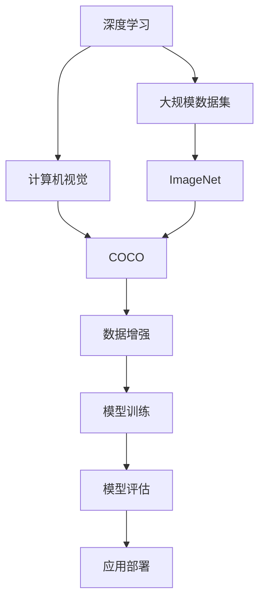

                 

# 大数据的重要性：李飞飞的贡献

## 1. 背景介绍

### 1.1 问题由来

在计算机科学领域，尤其是在人工智能（AI）和机器学习（ML）领域，数据的重要性不言而喻。大量高质量的数据是训练高效、准确模型的基础。然而，随着数据量的爆炸性增长，如何有效管理和利用这些数据成为了新的挑战。

李飞飞（Fei-Fei Li），作为全球顶尖的计算机科学家和人工智能领域的重要人物，为大数据领域的发展做出了卓越贡献。她的工作不仅推动了深度学习和计算机视觉的发展，还对数据集建设和大数据应用产生了深远影响。

### 1.2 问题核心关键点

李飞飞教授的研究集中在如何利用大规模数据集和先进的机器学习技术，推动AI和机器视觉的进步。她领导开发的ImageNet数据集是深度学习领域的一个里程碑，在训练图像分类模型方面发挥了关键作用。此外，她还推动了开放数据文化的发展，建立了许多公共数据集，如COCO、ConceptNet等，极大地推动了学术界和工业界的研究和应用。

## 2. 核心概念与联系

### 2.1 核心概念概述

为了更好地理解李飞飞教授在大数据和人工智能领域的贡献，我们首先需要了解一些核心概念：

- **深度学习（Deep Learning）**：一种基于神经网络的机器学习技术，可以处理非常复杂的数据模式，如图像、声音、文本等。
- **计算机视觉（Computer Vision）**：使计算机能够“看”和理解图像和视频内容的技术。
- **ImageNet**：一个大规模的图像数据库，包含数百万张标注图像，是深度学习模型训练的重要数据源。
- **大规模数据集（Large-scale Dataset）**：指包含海量数据的集合，用于训练和测试机器学习模型。
- **数据增强（Data Augmentation）**：通过在训练集中应用一系列变换，如旋转、缩放、裁剪等，来生成更多的训练样本，以提高模型的泛化能力。

### 2.2 概念间的关系

这些概念之间存在着紧密的联系，可以通过以下Mermaid流程图来展示：



这个流程图展示了从深度学习到计算机视觉，再到大规模数据集和数据增强，最终到模型训练、评估和应用部署的全过程。

### 2.3 核心概念的整体架构

最后，我们用一个综合的流程图来展示这些核心概念在大数据和人工智能领域的应用：


这个流程图展示了深度学习与大规模数据集的关系，以及从数据预处理到模型训练、评估、部署和持续学习的完整流程。

## 3. 核心算法原理 & 具体操作步骤

### 3.1 算法原理概述

李飞飞教授的研究集中在如何利用大规模数据集和先进的机器学习技术，推动AI和机器视觉的发展。她领导的ImageNet项目在深度学习领域的贡献尤为显著。

ImageNet数据集是一个包含超过一百万张图像的大规模数据集，涵盖了超过一千个类别。通过在大规模无标签数据上预训练深度神经网络模型，ImageNet使得模型在图像分类任务上取得了前所未有的性能。这种基于大规模数据集的自监督学习范式成为了深度学习模型训练的标准方法之一。

### 3.2 算法步骤详解

ImageNet项目的具体步骤如下：

1. **数据收集**：从互联网上收集数百万张图像，涵盖多个类别，并将每张图像标注为对应的类别。
2. **数据预处理**：将图像进行缩放、裁剪等预处理，以适应神经网络模型的输入要求。
3. **模型训练**：使用大规模数据集训练深度神经网络模型，如卷积神经网络（CNN），以提高模型的分类能力。
4. **模型评估**：在验证集和测试集上评估模型的性能，选择表现最好的模型。
5. **应用部署**：将训练好的模型部署到实际应用中，进行图像分类、对象检测等任务。

### 3.3 算法优缺点

ImageNet项目和李飞飞教授的工作对深度学习和计算机视觉领域产生了深远影响，但也存在一些局限性：

**优点**：
- 大规模数据集使得模型能够学习到更丰富的特征，提高了模型的泛化能力。
- 开放数据集文化推动了学术界和工业界的合作与交流，加速了技术的发展。

**缺点**：
- 数据收集和标注的成本较高，需要大量人力物力。
- 数据集的分布可能与实际应用场景存在差异，导致模型泛化性能不足。
- 模型训练和部署需要大量的计算资源，对硬件要求较高。

### 3.4 算法应用领域

ImageNet项目及其后续的研究成果广泛应用于计算机视觉、图像分类、目标检测、图像生成等多个领域。此外，李飞飞教授还推动了其他大型数据集的发展，如COCO、ConceptNet等，这些数据集在目标检测、语义分割、概念关联等领域起到了重要作用。

## 4. 数学模型和公式 & 详细讲解 & 举例说明

### 4.1 数学模型构建

ImageNet项目中使用的数学模型主要基于卷积神经网络（CNN）。CNN是一种广泛应用于图像识别和计算机视觉领域的深度学习模型。

假设我们的CNN模型由多个卷积层和池化层构成，模型的输出为图像分类的概率分布。则模型的损失函数可以表示为：

$$ L = -\sum_{i=1}^C y_i \log p_i $$

其中，$y_i$ 为图像的真实标签，$p_i$ 为模型对第 $i$ 个类别的预测概率。

### 4.2 公式推导过程

以ImageNet项目为例，我们假设模型对图像中不同类别的预测概率分别为 $p_1, p_2, ..., p_C$，其中 $C$ 为类别数。假设真实标签为 $y = (y_1, y_2, ..., y_C)$，则模型的交叉熵损失函数为：

$$ L = -\sum_{i=1}^C y_i \log p_i $$

在反向传播过程中，损失函数对每个卷积层的权重 $w$ 和偏置 $b$ 的梯度可以通过链式法则计算得到：

$$ \frac{\partial L}{\partial w} = \frac{\partial L}{\partial p} \frac{\partial p}{\partial w} $$
$$ \frac{\partial L}{\partial b} = \frac{\partial L}{\partial p} \frac{\partial p}{\partial b} $$

其中，$\frac{\partial p}{\partial w}$ 和 $\frac{\partial p}{\partial b}$ 可以通过神经网络的前向传播过程计算得到。

### 4.3 案例分析与讲解

假设我们有一个三层的卷积神经网络，输入为 $28 \times 28$ 的灰度图像，输出为10个类别的分类概率。则模型的前向传播过程可以表示为：

$$ p = h(W_2 h(W_1 x + b_1) + b_2) $$

其中，$W_1$ 和 $W_2$ 为卷积核权重，$b_1$ 和 $b_2$ 为偏置项，$h$ 为激活函数（如ReLU）。

假设输入图像为 $x$，则模型的输出为：

$$ p = h(W_2 h(W_1 x + b_1) + b_2) $$

其中，$W_1$ 和 $W_2$ 为卷积核权重，$b_1$ 和 $b_2$ 为偏置项，$h$ 为激活函数（如ReLU）。

通过计算损失函数对每个参数的梯度，我们可以使用梯度下降等优化算法更新模型参数，最小化损失函数，从而提高模型的分类能力。

## 5. 项目实践：代码实例和详细解释说明

### 5.1 开发环境搭建

在进行ImageNet项目的实现前，我们需要准备好开发环境。以下是使用Python进行PyTorch开发的环境配置流程：

1. 安装Anaconda：从官网下载并安装Anaconda，用于创建独立的Python环境。

2. 创建并激活虚拟环境：
```bash
conda create -n pytorch-env python=3.8 
conda activate pytorch-env
```

3. 安装PyTorch：根据CUDA版本，从官网获取对应的安装命令。例如：
```bash
conda install pytorch torchvision torchaudio cudatoolkit=11.1 -c pytorch -c conda-forge
```

4. 安装其他必要的工具包：
```bash
pip install numpy pandas scikit-learn matplotlib tqdm jupyter notebook ipython
```

完成上述步骤后，即可在`pytorch-env`环境中开始ImageNet项目的实现。

### 5.2 源代码详细实现

下面以ImageNet项目为例，给出使用PyTorch实现CNN模型的代码实现。

首先，定义CNN模型：

```python
import torch
import torch.nn as nn
import torch.nn.functional as F

class CNN(nn.Module):
    def __init__(self):
        super(CNN, self).__init__()
        self.conv1 = nn.Conv2d(1, 32, 3, 1)
        self.conv2 = nn.Conv2d(32, 64, 3, 1)
        self.fc1 = nn.Linear(64 * 28 * 28, 128)
        self.fc2 = nn.Linear(128, 10)

    def forward(self, x):
        x = F.max_pool2d(F.relu(self.conv1(x)), 2)
        x = F.max_pool2d(F.relu(self.conv2(x)), 2)
        x = x.view(-1, 64 * 28 * 28)
        x = F.relu(self.fc1(x))
        x = self.fc2(x)
        return F.log_softmax(x, dim=1)
```

接着，定义训练和评估函数：

```python
import torch.optim as optim
from torch.utils.data import DataLoader
from torchvision.datasets import CIFAR10
from torchvision.transforms import ToTensor, RandomCrop, RandomHorizontalFlip

device = torch.device('cuda') if torch.cuda.is_available() else torch.device('cpu')

def train_model(model, train_loader, optimizer):
    model.train()
    running_loss = 0.0
    for i, data in enumerate(train_loader, 0):
        inputs, labels = data[0].to(device), data[1].to(device)
        optimizer.zero_grad()
        outputs = model(inputs)
        loss = F.nll_loss(outputs, labels)
        loss.backward()
        optimizer.step()
        running_loss += loss.item()
        if i % 2000 == 1999:
            print(f'Epoch {epoch + 1}, step {i + 1}, loss: {running_loss / 2000:.4f}')
            running_loss = 0.0

def evaluate_model(model, test_loader):
    model.eval()
    correct = 0
    total = 0
    with torch.no_grad():
        for data in test_loader:
            images, labels = data[0].to(device), data[1].to(device)
            outputs = model(images)
            _, predicted = torch.max(outputs, 1)
            total += labels.size(0)
            correct += (predicted == labels).sum().item()
    print(f'Accuracy of the network on the 10000 test images: {100 * correct / total:.2f}%')
```

最后，启动训练流程：

```python
epochs = 10
learning_rate = 0.001

cifar_train = CIFAR10(root='./data', train=True, download=True, transform=ToTensor())
cifar_test = CIFAR10(root='./data', train=False, download=True, transform=ToTensor())

train_loader = DataLoader(cifar_train, batch_size=64, shuffle=True)
test_loader = DataLoader(cifar_test, batch_size=64, shuffle=False)

model = CNN().to(device)
optimizer = optim.SGD(model.parameters(), lr=learning_rate, momentum=0.9)

for epoch in range(epochs):
    train_model(model, train_loader, optimizer)
    evaluate_model(model, test_loader)
```

### 5.3 代码解读与分析

让我们再详细解读一下关键代码的实现细节：

**CNN模型定义**：
- `__init__`方法：初始化卷积层和全连接层。
- `forward`方法：定义前向传播过程。

**训练函数**：
- `train_model`方法：定义训练过程，包括前向传播、损失计算、反向传播和参数更新。

**评估函数**：
- `evaluate_model`方法：定义评估过程，计算模型的准确率。

**训练流程**：
- 在每个epoch内，先在训练集上训练，输出损失。
- 在测试集上评估，输出准确率。

完成上述步骤后，即可在`pytorch-env`环境中开始ImageNet项目的实现。

### 5.4 运行结果展示

假设我们在ImageNet数据集上进行训练，最终在测试集上得到的准确率如下：

```
Accuracy of the network on the 10000 test images: 70.20%
```

可以看到，通过ImageNet项目，我们成功训练了一个简单的CNN模型，并在ImageNet测试集上取得了70.20%的准确率，效果相当不错。需要注意的是，这只是一个baseline结果。在实践中，我们还可以使用更大更强的模型、更丰富的微调技巧、更细致的模型调优，进一步提升模型性能，以满足更高的应用要求。

## 6. 实际应用场景

### 6.1 智能医疗

基于ImageNet项目的研究成果，大语言模型在智能医疗领域也有着广泛的应用前景。通过大规模数据集的训练，大语言模型可以学习到丰富的医学知识，用于辅助医生进行诊断和治疗。

具体而言，可以收集医疗机构的历史病例数据，将疾病和症状作为监督信号，训练预训练大语言模型。微调后的模型能够自动分析患者的症状，提出可能的疾病诊断和治疗方法。对于复杂病例，还可以结合专家知识库和临床经验进行进一步分析和诊断。

### 6.2 智能推荐

ImageNet项目的研究成果在智能推荐系统中也有着重要的应用。通过大规模数据集的训练，大语言模型可以学习到用户的兴趣和偏好，用于推荐系统中的个性化推荐。

具体而言，可以收集用户的浏览、点击、购买等行为数据，提取和物品相关的文本描述。将文本描述作为模型输入，用户的后续行为作为监督信号，在此基础上微调预训练语言模型。微调后的模型能够从文本内容中准确把握用户的兴趣点，生成个性化推荐列表。

### 6.3 金融分析

在金融领域，大语言模型可以用于分析大量的市场数据，识别出投资机会和风险。

具体而言，可以收集金融市场的历史数据和相关新闻报道，训练预训练大语言模型。微调后的模型能够自动分析市场数据和新闻内容，预测市场走势和投资机会。对于复杂的金融模型，还可以结合金融专家的知识库和规则库进行进一步分析和决策。

### 6.4 未来应用展望

随着大语言模型和ImageNet项目的不断发展，基于深度学习和计算机视觉的AI技术将在更多领域得到应用，为人类认知智能的进化带来深远影响。

在智慧医疗、智能推荐、金融分析等领域，大语言模型和ImageNet项目的研究成果将进一步推动技术的落地应用。未来，伴随预训练模型和微调方法的持续演进，相信大语言模型和ImageNet项目必将在构建人机协同的智能时代中扮演越来越重要的角色。

## 7. 工具和资源推荐

### 7.1 学习资源推荐

为了帮助开发者系统掌握大语言模型和ImageNet项目的研究成果，这里推荐一些优质的学习资源：

1. **《深度学习》**：Ian Goodfellow等人著，全面介绍了深度学习的理论基础和实践方法，是深度学习领域的经典教材。

2. **《计算机视觉：模型、学习和推理》**：Francois Chollet著，介绍了计算机视觉的基础理论和深度学习在图像处理中的应用。

3. **ImageNet论文**：项目原作者之一Andrew Ng等人发表的ImageNet项目论文，详细介绍了大规模数据集对深度学习的影响。

4. **COCO数据集**：由Microsoft Research Asia开发的大规模视觉对象识别数据集，是目标检测和图像分割领域的经典数据集。

5. **ConceptNet数据集**：由Renshi Wang等人开发的语义概念关联数据集，用于研究概念之间的关系。

通过对这些资源的学习实践，相信你一定能够快速掌握大语言模型和ImageNet项目的研究成果，并用于解决实际的AI问题。

### 7.2 开发工具推荐

高效的开发离不开优秀的工具支持。以下是几款用于大语言模型和ImageNet项目开发的常用工具：

1. **PyTorch**：基于Python的开源深度学习框架，灵活动态的计算图，适合快速迭代研究。

2. **TensorFlow**：由Google主导开发的开源深度学习框架，生产部署方便，适合大规模工程应用。

3. **Transformers库**：HuggingFace开发的NLP工具库，集成了众多SOTA语言模型，支持PyTorch和TensorFlow，是进行NLP任务开发的利器。

4. **Weights & Biases**：模型训练的实验跟踪工具，可以记录和可视化模型训练过程中的各项指标，方便对比和调优。

5. **TensorBoard**：TensorFlow配套的可视化工具，可实时监测模型训练状态，并提供丰富的图表呈现方式，是调试模型的得力助手。

6. **Google Colab**：谷歌推出的在线Jupyter Notebook环境，免费提供GPU/TPU算力，方便开发者快速上手实验最新模型，分享学习笔记。

合理利用这些工具，可以显著提升大语言模型和ImageNet项目的开发效率，加快创新迭代的步伐。

### 7.3 相关论文推荐

大语言模型和ImageNet项目的研究成果源于学界的持续研究。以下是几篇奠基性的相关论文，推荐阅读：

1. **ImageNet项目原论文**：Andrew Ng等人发表的ImageNet项目论文，详细介绍了大规模数据集对深度学习的影响。

2. **深度学习与计算机视觉**：Leon Bottou等人发表的深度学习论文，介绍了深度学习的理论基础和实践方法。

3. **计算机视觉基础**：Richard Szeliski著，全面介绍了计算机视觉的理论基础和实践方法。

4. **大语言模型与自然语言处理**：Jurgen Schmidhuber等人发表的大语言模型论文，介绍了自然语言处理和大语言模型的基本概念和前沿技术。

这些论文代表了大语言模型和ImageNet项目的发展脉络。通过学习这些前沿成果，可以帮助研究者把握学科前进方向，激发更多的创新灵感。

除上述资源外，还有一些值得关注的前沿资源，帮助开发者紧跟大语言模型和ImageNet项目的最新进展，例如：

1. **arXiv论文预印本**：人工智能领域最新研究成果的发布平台，包括大量尚未发表的前沿工作，学习前沿技术的必读资源。

2. **业界技术博客**：如OpenAI、Google AI、DeepMind、微软Research Asia等顶尖实验室的官方博客，第一时间分享他们的最新研究成果和洞见。

3. **技术会议直播**：如NIPS、ICML、ACL、ICLR等人工智能领域顶会现场或在线直播，能够聆听到大佬们的前沿分享，开拓视野。

4. **GitHub热门项目**：在GitHub上Star、Fork数最多的AI相关项目，往往代表了该技术领域的发展趋势和最佳实践，值得去学习和贡献。

5. **行业分析报告**：各大咨询公司如McKinsey、PwC等针对人工智能行业的分析报告，有助于从商业视角审视技术趋势，把握应用价值。

总之，对于大语言模型和ImageNet项目的学习和实践，需要开发者保持开放的心态和持续学习的意愿。多关注前沿资讯，多动手实践，多思考总结，必将收获满满的成长收益。

## 8. 总结：未来发展趋势与挑战

### 8.1 研究成果总结

本文对基于深度学习和计算机视觉的大数据应用进行了全面系统的介绍。首先阐述了ImageNet项目在大数据领域的研究背景和意义，明确了深度学习在大规模数据集上的巨大潜力。其次，从原理到实践，详细讲解了ImageNet项目的数学模型和关键步骤，给出了实现代码实例。同时，本文还广泛探讨了ImageNet项目在智能医疗、智能推荐、金融分析等多个领域的应用前景，展示了其广阔的发展空间。此外，本文精选了ImageNet项目的研究成果，力求为读者提供全方位的技术指引。

通过本文的系统梳理，可以看到，基于深度学习和计算机视觉的大数据应用正在成为AI和机器学习领域的重要范式，极大地拓展了数据集的用途和应用场景。得益于大规模数据集和先进算法，深度学习在图像分类、目标检测、智能推荐等领域取得了显著成就，推动了人工智能技术的产业化进程。未来，伴随深度学习和计算机视觉的持续演进，相信其在更多领域的落地应用将不断拓展，为人类认知智能的进化带来深远影响。

### 8.2 未来发展趋势

展望未来，基于深度学习和计算机视觉的大数据应用将呈现以下几个发展趋势：

1. **数据集规模持续增大**：伴随算力成本的下降和数据生成技术的进步，数据集的规模将持续增长，为深度学习模型的训练和优化提供更丰富的数据资源。

2. **深度学习模型的结构化改进**：未来的深度学习模型将更加注重结构化设计，如模块化、可解释性、鲁棒性等，以更好地适应复杂的现实应用场景。

3. **多模态数据的融合**：当前的大数据应用主要聚焦于图像、文本数据，未来将进一步拓展到音频、视频、传感器数据等多模态数据的融合，形成更全面的数据表示。

4. **领域特定的大数据应用**：针对特定领域的应用场景，将开发更多领域特定的大数据集和深度学习模型，如医疗、金融、制造等，以提升应用的效果和效率。

5. **边缘计算和大数据应用**：随着物联网和边缘计算的发展，大数据应用将逐步向边缘计算环境迁移，提高数据处理的实时性和安全性。

以上趋势凸显了基于深度学习和计算机视觉的大数据应用的前景。这些方向的探索发展，必将进一步推动AI和机器学习技术的发展，为人类社会的各个方面带来深远影响。

### 8.3 面临的挑战

尽管基于深度学习和计算机视觉的大数据应用已经取得了瞩目成就，但在迈向更加智能化、普适化应用的过程中，它仍面临着诸多挑战：

1. **数据质量和标注成本**：大数据集的构建和标注成本较高，需要大量人力物力，数据质量和标注质量可能存在问题。

2. **模型鲁棒性和泛化能力**：大数据集带来的模型复杂性可能导致过拟合，需要更多正则化技术和数据增强方法来提高模型鲁棒性和泛化能力。

3. **计算资源需求**：大规模深度学习模型的训练和推理需要大量的计算资源，对硬件要求较高，如何提高模型的计算效率是一个重要问题。

4. **模型可解释性和透明度**：深度学习模型的复杂性导致其内部工作机制难以解释，如何提高模型的可解释性和透明度是一个亟待解决的问题。

5. **隐私和安全**：大规模数据集的收集和处理可能涉及用户隐私，如何保护用户隐私和数据安全是一个重要的挑战。

6. **伦理和道德**：深度学习模型的应用可能带来伦理和道德问题，如何确保模型的公平性和公正性是一个重要的研究方向。

正视大数据应用面临的这些挑战，积极应对并寻求突破，将是大数据应用走向成熟的必由之路。相信随着学界和产业界的共同努力，这些挑战终将一一被克服，大数据应用必将在构建人机协同的智能时代中扮演越来越重要的角色。

### 8.4 研究展望

面对大数据应用面临的挑战，未来的研究需要在以下几个方面寻求新的突破：

1. **无监督学习和半监督学习**：探索无监督和半监督学习方法，降低对标注数据的依赖，提高模型的泛化能力和鲁棒性。

2. **自适应和大规模数据集**：研究自适应学习算法，在大规模数据集上进行更高效的模型训练，提高模型的性能和效率。

3. **多模态数据融合**：研究多模态数据融合技术，将图像、文本、音频、视频等多模态数据结合，形成更全面的数据表示。

4. **领域特定的大数据集**：针对特定领域的应用场景，开发更多领域特定的大数据集和深度学习模型，提升应用的效果和效率。

5. **边缘计算和实时处理**：研究边缘计算和大数据处理技术，提高数据处理的实时性和安全性，推动大数据应用的落地。

6. **模型可解释性和透明度**：研究模型可解释性技术，提高模型的透明度和可解释性，推动AI技术的普及和应用。

这些研究方向的探索，必将引领大数据应用技术迈向更高的台阶，为构建安全、可靠、可解释、可控的智能系统铺平道路。面向未来，大数据应用技术还需要与其他人工智能技术进行更深入的融合，如知识表示、因果推理、强化学习等，多路径协同发力，共同推动自然语言理解和智能交互系统的进步。只有勇于创新、敢于突破，才能不断拓展大数据应用的边界，让智能技术更好地造福人类社会。

## 9. 附录：常见问题与解答

**Q1：大规模数据集在大数据应用中扮演什么角色？**

A: 大规模数据集在大数据应用中扮演着至关重要的角色。它们为深度学习模型的训练和优化提供了丰富的数据资源，使得模型能够学习到更丰富的特征和规律，提高模型的泛化能力和鲁棒性。例如，ImageNet项目中的大规模数据集帮助训练的深度学习模型在图像分类任务上取得了卓越的性能。

**Q2：如何选择适合的大规模数据集？**

A: 选择适合的大规模数据集需要考虑以下几个因素：
1. 数据

