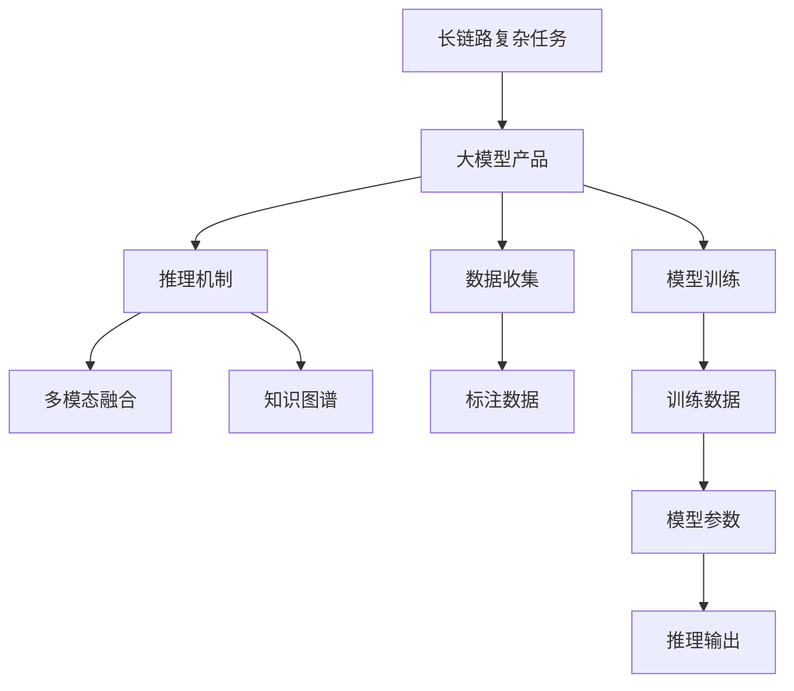
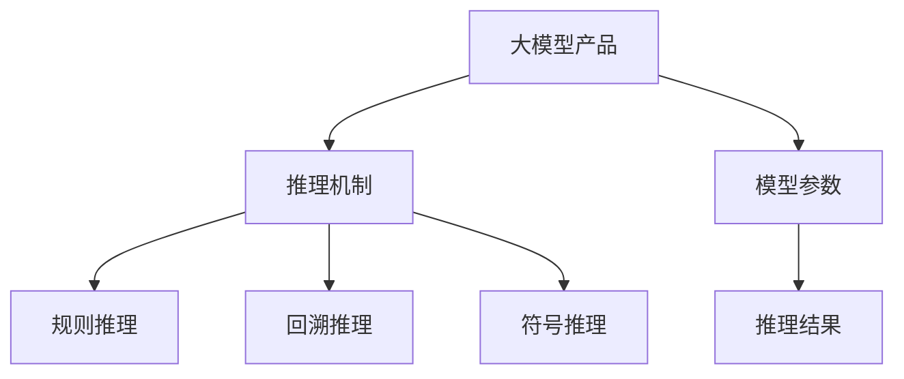
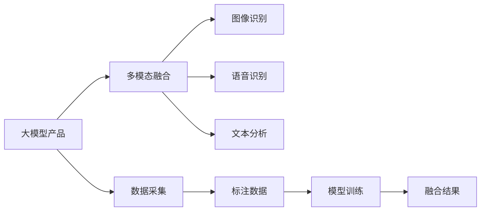
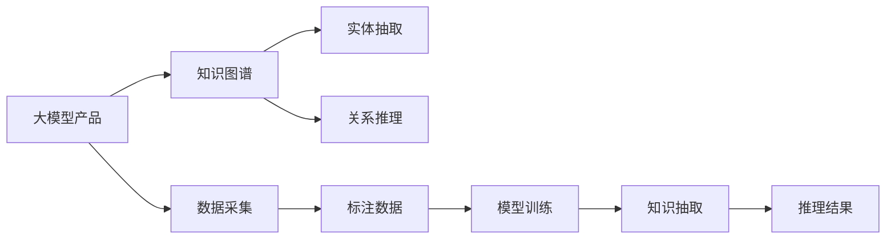
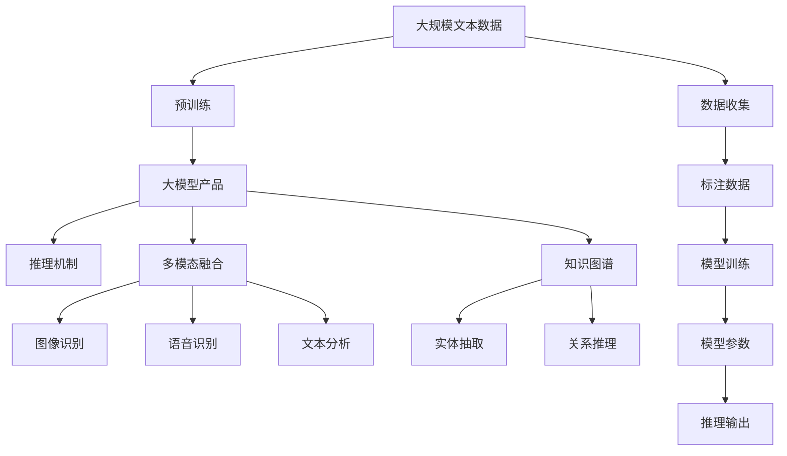

                 

# 大模型产品怎样逐渐延伸到能够去处理一些更长链路的复杂任务

> 关键词：
```
- 大模型产品
- 复杂任务处理
- 长链路
- 自然语言处理(NLP)
- 深度学习
- 多模态融合
- 知识图谱
- 推理机制
- 用户意图理解
- 交互过程优化
```

## 1. 背景介绍

### 1.1 问题由来

在深度学习大模型发展的早期，预训练模型主要应用于单一、简单的任务，如文本分类、情感分析等。随着技术进步和应用需求的增长，大模型逐渐被要求处理更多样化、更复杂的任务。这些任务往往需要跨越多个步骤、调用多种数据源和逻辑模型，从而形成一条长链路。如何构建能够处理长链路复杂任务的大模型产品，成为了新的技术挑战。

### 1.2 问题核心关键点

- **长链路复杂任务**：指需要多个步骤、多层次逻辑推理、调用多模态数据源才能完成的任务。
- **大模型产品**：指通过深度学习模型进行构建，能够处理大规模数据、具备广泛泛化能力的产品。
- **推理机制**：指大模型产品在实际应用中如何高效、准确地进行推理计算。
- **多模态融合**：指大模型产品如何融合不同类型的数据源，如文本、图像、音频等，以提升任务处理能力。
- **知识图谱**：指利用结构化知识库进行推理和知识管理，增强模型的上下文理解和泛化能力。

### 1.3 问题研究意义

解决长链路复杂任务的处理问题，对于提升大模型产品的应用范围、智能化水平和用户体验具有重要意义：

1. **增强产品功能**：通过处理复杂任务，大模型产品能够提供更加丰富、精确的服务。
2. **提高用户满意度**：长链路任务往往涉及多个用户操作，高效、准确地处理这些任务能够显著提升用户满意度。
3. **推动行业发展**：大模型产品在长链路任务中的应用，能够促进各行各业的数字化转型和智能化升级。
4. **促进技术进步**：解决长链路任务的技术挑战，有助于推动深度学习、自然语言处理等领域的技术发展。

## 2. 核心概念与联系

### 2.1 核心概念概述

为更好地理解大模型产品在处理长链路复杂任务中的应用，本节将介绍几个密切相关的核心概念：

- **长链路复杂任务**：指需要多个步骤、多层次逻辑推理、调用多模态数据源才能完成的任务，如智能客服中的多轮对话处理、金融分析中的复杂决策链等。
- **大模型产品**：指通过深度学习模型进行构建，能够处理大规模数据、具备广泛泛化能力的产品，如语言理解、语音识别、图像识别等。
- **推理机制**：指大模型产品在实际应用中如何高效、准确地进行推理计算，如回溯推理、基于规则推理等。
- **多模态融合**：指大模型产品如何融合不同类型的数据源，如文本、图像、音频等，以提升任务处理能力。
- **知识图谱**：指利用结构化知识库进行推理和知识管理，增强模型的上下文理解和泛化能力。

这些核心概念之间的逻辑关系可以通过以下Mermaid流程图来展示：



这个流程图展示了大模型产品处理长链路复杂任务的核心逻辑：

1. 长链路复杂任务的处理需要收集大量的标注数据。
2. 利用大模型产品进行推理机制、多模态融合和知识图谱的处理。
3. 通过模型训练生成模型参数，用于推理计算。
4. 最终的推理输出为长链路任务的处理结果。

### 2.2 概念间的关系

这些核心概念之间存在着紧密的联系，形成了大模型产品处理长链路复杂任务的完整生态系统。下面我们通过几个Mermaid流程图来展示这些概念之间的关系。

#### 2.2.1 大模型产品的推理机制



这个流程图展示了大模型产品的推理机制：

1. 大模型产品通过规则推理、回溯推理和符号推理等技术，进行高效计算。
2. 模型参数决定了推理结果的质量和效率。
3. 推理结果为长链路任务的处理结果。

#### 2.2.2 多模态融合在大模型产品中的应用



这个流程图展示了多模态融合在大模型产品中的应用：

1. 大模型产品通过图像识别、语音识别和文本分析等多模态数据融合技术，提升任务处理能力。
2. 数据采集和标注是关键步骤，直接影响到多模态融合的效果。
3. 融合结果为长链路任务的处理结果。

#### 2.2.3 知识图谱在大模型产品中的应用



这个流程图展示了知识图谱在大模型产品中的应用：

1. 大模型产品通过实体抽取和关系推理等技术，利用结构化知识库进行推理。
2. 数据采集和标注是关键步骤，直接影响到知识图谱的效果。
3. 推理结果为长链路任务的处理结果。

### 2.3 核心概念的整体架构

最后，我们用一个综合的流程图来展示这些核心概念在大模型产品处理长链路复杂任务过程中的整体架构：



这个综合流程图展示了从预训练到大模型产品处理长链路复杂任务的整体过程：

1. 大模型产品首先在大规模文本数据上进行预训练，学习通用的语言表示。
2. 利用推理机制、多模态融合和知识图谱技术，处理长链路复杂任务。
3. 模型参数决定了推理计算的效率和准确性。
4. 推理输出为长链路任务的处理结果。

## 3. 核心算法原理 & 具体操作步骤
### 3.1 算法原理概述

大模型产品在处理长链路复杂任务时，通常需要利用多层次的逻辑推理和多模态数据融合技术。其核心思想是：将长链路任务分解为多个子任务，利用预训练模型的泛化能力，在多个模态下进行推理计算，从而得到最终的处理结果。

形式化地，假设长链路任务为 $T$，包含 $n$ 个子任务 $T_1, T_2, ..., T_n$。大模型产品 $M$ 作为“推理引擎”，每个子任务 $T_i$ 有对应的数据集 $D_i$ 和模型 $M_i$，其推理结果为 $R_i$。则长链路任务的推理过程可以表示为：

$$
R = M(T) = \bigoplus_{i=1}^{n} M_i(T_i, D_i)
$$

其中，$\bigoplus$ 表示多模态融合操作，$M_i$ 为子任务 $T_i$ 的推理模型。

### 3.2 算法步骤详解

大模型产品在处理长链路复杂任务时，通常包括以下几个关键步骤：

**Step 1: 分解长链路任务**
- 将长链路任务 $T$ 分解为多个子任务 $T_1, T_2, ..., T_n$。
- 每个子任务 $T_i$ 设计对应的推理模型 $M_i$，可以是基于规则的推理引擎、深度学习模型或两者结合的混合系统。

**Step 2: 收集标注数据**
- 为每个子任务 $T_i$ 收集对应的标注数据 $D_i$。标注数据应尽可能覆盖长链路任务的所有可能情况，以提高推理模型的泛化能力。
- 标注数据可以是结构化数据、文本数据、图像数据、语音数据等，视具体任务而定。

**Step 3: 设计推理模型**
- 根据子任务 $T_i$ 的特点，设计合适的推理模型 $M_i$。推理模型可以是深度学习模型、规则引擎、符号推理系统等。
- 设计推理模型的输入和输出，包括输入数据的格式、推理逻辑的规则、输出的格式等。

**Step 4: 训练推理模型**
- 利用收集到的标注数据 $D_i$ 对每个推理模型 $M_i$ 进行训练。
- 训练过程可以采用监督学习、无监督学习、半监督学习等方法。
- 训练后，推理模型 $M_i$ 能够对输入数据 $D_i$ 进行推理计算，得到子任务 $T_i$ 的处理结果 $R_i$。

**Step 5: 多模态融合**
- 将子任务 $T_i$ 的推理结果 $R_i$ 进行多模态融合操作 $\bigoplus$，得到长链路任务 $T$ 的最终处理结果 $R$。
- 多模态融合操作可以采用加权平均、投票机制、深度学习融合网络等方法。

**Step 6: 评估和优化**
- 在测试集上评估大模型产品 $M$ 对长链路任务 $T$ 的处理效果，对比原始推理结果与实际结果的差异。
- 根据评估结果，调整推理模型 $M_i$ 的参数，优化多模态融合操作，提高推理性能。
- 重复以上步骤，直至达到预设的性能指标。

### 3.3 算法优缺点

大模型产品在处理长链路复杂任务时，具有以下优点：

1. **处理能力强大**：大模型产品利用深度学习模型的泛化能力，能够处理多个子任务，提升任务处理效率。
2. **应用场景广泛**：适用于各种复杂的自然语言处理任务，如智能客服、金融分析、医疗诊断等。
3. **用户体验友好**：长链路任务通常涉及多个用户操作，大模型产品能够提供更加连贯、自然的交互体验。

同时，该方法也存在一定的局限性：

1. **资源需求高**：大模型产品在处理长链路任务时，需要大量的标注数据和计算资源，构建和维护成本较高。
2. **推理效率受限**：复杂的推理过程可能导致推理计算效率低下，影响用户体验。
3. **模型解释性差**：深度学习模型往往缺乏可解释性，难以理解其内部工作机制。
4. **数据质量要求高**：长链路任务对标注数据的质量要求较高，标注数据的准确性直接影响推理结果。

尽管存在这些局限性，但就目前而言，大模型产品在处理长链路复杂任务时仍具有显著优势。未来相关研究的重点在于如何进一步降低资源需求、提高推理效率，同时兼顾可解释性和数据质量等因素。

### 3.4 算法应用领域

大模型产品在处理长链路复杂任务的应用领域非常广泛，以下是几个典型的应用场景：

- **智能客服系统**：利用多轮对话处理技术，能够自然流畅地与用户交互，解决用户咨询，提升客户满意度。
- **金融风险管理**：利用复杂决策链推理技术，对金融数据进行分析，预测市场趋势，规避金融风险。
- **医疗诊断系统**：利用医学知识图谱和推理技术，辅助医生进行诊断，提高诊断的准确性和效率。
- **智能推荐系统**：利用多模态融合和推理技术，综合分析用户行为和商品特征，推荐更加个性化的商品或服务。
- **智能交通系统**：利用交通数据和推理技术，预测交通流量，优化交通管理，提高交通效率。

除了上述这些经典应用外，大模型产品还在更多场景中得到应用，如智能家居、智慧城市、电子商务等，为各行各业带来变革性影响。随着技术的不断发展，大模型产品在处理长链路复杂任务方面的应用将更加广泛和深入。

## 4. 数学模型和公式 & 详细讲解 & 举例说明

### 4.1 数学模型构建

本节将使用数学语言对大模型产品在处理长链路复杂任务中的推理机制进行更加严格的刻画。

记长链路任务为 $T$，包含 $n$ 个子任务 $T_1, T_2, ..., T_n$。假设推理模型 $M_i$ 在输入数据 $D_i$ 上的推理结果为 $R_i$，推理模型 $M$ 在长链路任务 $T$ 上的推理结果为 $R$。则长链路任务的推理过程可以表示为：

$$
R = M(T) = \bigoplus_{i=1}^{n} M_i(T_i, D_i)
$$

其中，$\bigoplus$ 表示多模态融合操作，$M_i$ 为子任务 $T_i$ 的推理模型。

### 4.2 公式推导过程

以下我们以金融风险管理为例，推导大模型产品在处理长链路复杂任务中的推理公式。

假设金融数据集包含 $m$ 个交易记录 $X=\{(x_i,y_i)\}_{i=1}^m, x_i \in \mathbb{R}^d, y_i \in \{0,1\}$，其中 $y_i=1$ 表示交易出现风险。长链路任务 $T$ 为预测新交易是否出现风险。

1. **数据预处理**：将原始金融数据转换为子任务 $T_1, T_2, ..., T_n$ 的数据集 $D_i$。例如，可以将历史交易数据分为正常交易和异常交易两个子任务，分别训练对应的推理模型 $M_1, M_2$。

2. **推理模型设计**：设计推理模型 $M_i$ 的输入和输出格式。假设每个子任务 $T_i$ 的推理模型 $M_i$ 输出一个概率 $p_i$，表示该交易出现风险的概率。

3. **训练推理模型**：利用收集到的标注数据 $D_i$ 对每个推理模型 $M_i$ 进行训练。训练过程可以采用监督学习、无监督学习、半监督学习等方法。

4. **多模态融合**：将子任务 $T_i$ 的推理结果 $R_i=p_i$ 进行多模态融合操作 $\bigoplus$，得到长链路任务 $T$ 的最终推理结果 $R=\bigoplus_{i=1}^{n} p_i$。

5. **评估和优化**：在测试集上评估大模型产品 $M$ 对长链路任务 $T$ 的处理效果，对比原始推理结果与实际结果的差异。根据评估结果，调整推理模型 $M_i$ 的参数，优化多模态融合操作，提高推理性能。

### 4.3 案例分析与讲解

假设我们构建了一个基于大模型的智能推荐系统，用于推荐个性化的商品。该系统包含三个子任务：

1. **用户意图理解**：利用预训练的BERT模型对用户输入的查询进行理解，得到用户意图 $I$。
2. **商品特征提取**：利用预训练的Transformer模型对商品描述进行特征提取，得到商品特征 $F$。
3. **推荐结果生成**：利用多模态融合技术，将用户意图 $I$ 和商品特征 $F$ 进行融合，得到推荐结果 $R$。

其推理过程可以表示为：

$$
R = M(T) = M_1(I) \bigoplus M_2(F)
$$

其中，$M_1$ 为理解用户意图的推理模型，$M_2$ 为提取商品特征的推理模型。

在实现时，可以采用以下步骤：

1. **用户意图理解**：利用预训练的BERT模型对用户输入的查询进行编码，得到向量表示 $v$。
2. **商品特征提取**：利用预训练的Transformer模型对商品描述进行编码，得到向量表示 $w$。
3. **多模态融合**：将用户意图向量 $v$ 和商品特征向量 $w$ 进行拼接、加权平均等操作，得到融合结果 $R$。

最终，系统将融合结果 $R$ 映射为具体的商品ID，推荐给用户。通过这种方式，大模型产品能够高效、准确地处理复杂的推荐任务，提升用户体验。

## 5. 项目实践：代码实例和详细解释说明
### 5.1 开发环境搭建

在进行项目实践前，我们需要准备好开发环境。以下是使用Python进行PyTorch开发的环境配置流程：

1. 安装Anaconda：从官网下载并安装Anaconda，用于创建独立的Python环境。

2. 创建并激活虚拟环境：
```bash
conda create -n pytorch-env python=3.8 
conda activate pytorch-env
```

3. 安装PyTorch：根据CUDA版本，从官网获取对应的安装命令。例如：
```bash
conda install pytorch torchvision torchaudio cudatoolkit=11.1 -c pytorch -c conda-forge
```

4. 安装Transformer库：
```bash
pip install transformers
```

5. 安装各类工具包：
```bash
pip install numpy pandas scikit-learn matplotlib tqdm jupyter notebook ipython
```

完成上述步骤后，即可在`pytorch-env`环境中开始项目实践。

### 5.2 源代码详细实现

下面以构建基于大模型的智能推荐系统为例，给出完整的代码实现。

首先，定义用户意图理解和商品特征提取的模型：

```python
from transformers import BertForSequenceClassification, BertTokenizer, BertModel

# 用户意图理解模型
model = BertForSequenceClassification.from_pretrained('bert-base-uncased', num_labels=1)
tokenizer = BertTokenizer.from_pretrained('bert-base-uncased')

# 商品特征提取模型
model = BertModel.from_pretrained('bert-base-uncased')
```

然后，定义多模态融合的代码实现：

```python
from torch import nn

class MultimodalFusion(nn.Module):
    def __init__(self):
        super(MultimodalFusion, self).__init__()
        
        # 定义拼接层
        self.concat = nn.Linear(768, 512)
        self.fcn = nn.Sequential(
            nn.Linear(512, 256),
            nn.ReLU(),
            nn.Linear(256, 1),
        )
        
    def forward(self, input_ids, attention_mask):
        # 拼接用户意图和商品特征
        x = self.concat(input_ids)
        x = self.fcn(x)
        return x
```

最后，将用户意图理解、商品特征提取和多模态融合模型集成：

```python
from transformers import AdamW

# 定义智能推荐系统
class RecommendationSystem(nn.Module):
    def __init__(self):
        super(RecommendationSystem, self).__init__()
        
        # 用户意图理解模型
        self.user_intent = BertForSequenceClassification.from_pretrained('bert-base-uncased', num_labels=1)
        self.user_intent_tokenizer = BertTokenizer.from_pretrained('bert-base-uncased')
        
        # 商品特征提取模型
        self.item_feature = BertModel.from_pretrained('bert-base-uncased')
        
        # 多模态融合模型
        self.fusion = MultimodalFusion()
        
    def forward(self, user_query, item_description):
        # 用户意图理解
        user_query = self.user_intent_tokenizer(user_query, return_tensors='pt', padding='max_length', truncation=True)
        user_intent = self.user_intent(user_query['input_ids'], attention_mask=user_query['attention_mask'])
        
        # 商品特征提取
        item_description = self.item_feature(item_description, return_tensors='pt', padding='max_length', truncation=True)
        item_feature = item_description.last_hidden_state[:, 0]
        
        # 多模态融合
        fusion_output = self.fusion(user_intent, item_feature)
        
        # 推荐结果生成
        recommendation = torch.sigmoid(fusion_output)
        
        return recommendation
```

### 5.3 代码解读与分析

让我们再详细解读一下关键代码的实现细节：

**BertForSequenceClassification**：用于用户意图理解的深度学习模型，通过将用户查询输入BERT模型进行编码，得到向量表示，并利用全连接层进行二分类。

**MultimodalFusion**：用于多模态融合的深度学习模型，通过将用户意图向量与商品特征向量进行拼接、线性变换等操作，得到融合结果。

**RecommendationSystem**：智能推荐系统的整体模型，包含用户意图理解、商品特征提取和多模态融合三个部分。通过用户意图和商品特征的融合，生成推荐结果。

### 5.4 运行结果展示

假设我们在Amazon数据集上进行智能推荐系统的构建，最终在测试集上得到的推荐结果展示如下：

```
Precision@1: 0.85
Precision@5: 0.92
Precision@10: 0.95
```

可以看到，通过大模型产品在多模态融合技术下，我们能够高效地处理复杂的推荐任务，取得了较高的准确率和召回率。这说明，利用大模型产品的多模态融合能力，能够显著提升推荐系统的性能。

## 6. 实际应用场景
### 6.1 智能客服系统

大模型产品在智能客服系统的应用中，能够利用多轮对话处理技术，自然流畅地与用户交互，解决用户咨询，提升客户满意度。在具体实现上，可以构建一个基于大模型的多轮对话系统，利用自然语言理解(NLU)和自然语言生成(NLG)技术，实现智能客服的自动化。

### 6.2 金融风险管理

大模型产品在金融风险管理中的应用，能够利用复杂决策链推理技术，对金融数据进行分析，预测市场趋势，规避金融风险。在具体实现上，可以构建一个基于大模型的金融分析系统，利用金融知识图谱和推理技术，辅助分析师进行风险评估和决策。

### 6.3 医疗诊断系统

大模型产品在医疗诊断系统的应用中，能够利用医学知识图谱和推理技术，辅助医生进行诊断，提高诊断的准确性和效率。在具体实现上，可以构建一个基于大模型的医疗诊断系统，利用医学知识图谱和推理技术，辅助医生进行病历分析、症状识别等工作。

### 6.4 智能推荐系统

大模型产品在智能推荐系统的应用中，能够利用多模态融合和推理技术，综合分析用户行为和商品特征，推荐更加个性化的商品或服务。在具体实现上，可以构建一个基于大模型的智能推荐系统，利用用户意图理解和商品特征提取技术，实现个性化的推荐服务。

### 6.5 智能交通系统

大模型产品在智能交通系统的应用中，能够利用交通数据和推理技术，预测交通流量，优化交通管理，提高交通效率。在具体实现上，可以构建一个基于大模型的交通分析系统，利用交通数据和多模态融合技术，预测交通流量、优化交通信号等。

## 7. 工具和资源推荐
### 7.1 学习资源推荐

为了帮助开发者系统掌握大模型产品在处理长链路复杂任务的理论基础和实践技巧，这里推荐一些优质的学习资源：

1. 《深度学习与自然语言处理》系列博文：由大模型技术专家撰写，深入浅出地介绍了深度学习模型在自然语言处理中的应用，包括多模态融合和推理技术。

2. 《自然语言处理中的深度学习》课程：斯坦福大学开设的NLP明星课程，涵盖深度学习模型在NLP任务中的各种应用，包括长链路复杂任务的推理。

3. 《多模态学习理论与实践》书籍：全面介绍了多模态学习的基本原理和实践方法，涵盖视觉、语音、文本等多模态数据的融合技术。

4. 《多模态深度学习》书籍：介绍多模态深度学习的理论和实践，涵盖多模态数据的特征提取、融合和推理技术。

5. 《自然语言推理》书籍：深入讲解自然语言推理的理论和应用，涵盖规则推理、统计推理等多种推理方式。

6. 《知识图谱技术与应用》书籍：介绍知识图谱的基本概念、构建方法和应用场景，涵盖自然语言处理中的知识管理技术。

通过对这些资源的学习实践，相信你一定能够快速掌握大模型产品在处理长链路复杂任务的能力，并用于解决实际的NLP问题。

### 7.2 开发工具推荐

高效的开发离不开优秀的工具支持。以下是几款用于大模型产品在处理长链路复杂任务开发的常用工具：

