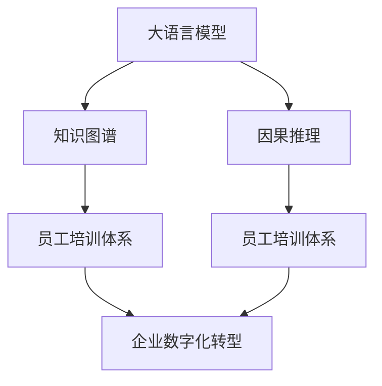
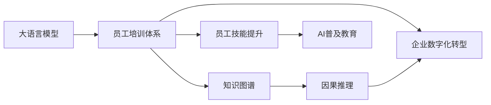

                 

# 大模型企业的员工培训体系

> 关键词：大语言模型,员工培训,企业数字化转型,员工技能提升,AI普及教育

## 1. 背景介绍

### 1.1 问题由来
在数字化转型的大趋势下，越来越多的企业开始引入人工智能(AI)技术，尤其是大语言模型如BERT、GPT等，以提升业务效率和竞争力。然而，如何培养、提升员工对大语言模型的理解和应用能力，成为一个亟待解决的问题。面对大语言模型的复杂性和先进性，企业员工需要经过系统化的培训，才能真正掌握其精髓，发挥出大语言模型的全部潜力。

### 1.2 问题核心关键点
企业员工培训体系的核心关键点在于：
- 制定科学合理的培训内容。既要涵盖基础理论，又要包含实践技巧，使员工能够在理解大语言模型的基础上，熟练运用其进行日常工作。
- 选择多样化的培训方法。通过线上线下、自顶向下和自下而上的方式，使员工能够在不同的培训场景中全面提升技能。
- 搭建互动式的培训平台。借助交互式的教学工具，提高培训的趣味性和实用性，增强员工的参与感和学习效率。
- 持续推进的培训机制。通过定期的知识更新和技能评测，确保培训体系的有效性和持续改进。

### 1.3 问题研究意义
企业员工培训体系对大模型技术应用的普及和推广具有重要意义：
- 降低技术门槛。通过系统培训，使员工快速上手大语言模型，降低技术应用的门槛，推动企业全面数字化转型。
- 提升员工技能。通过技能培训，增强员工对大语言模型的理解和应用能力，提高工作效率和质量。
- 促进知识共享。通过培训交流，增强团队内部的知识共享和合作，提升团队整体的创新力和执行力。
- 培育企业文化。通过培训，树立企业对新技术应用的重视，形成积极向上、持续学习的企业文化。
- 应对未来挑战。通过持续培训，使员工保持对新技术的敏感性和适应性，应对未来技术发展的挑战。

## 2. 核心概念与联系

### 2.1 核心概念概述

为了更好地理解大模型企业的员工培训体系，本节将介绍几个关键概念及其联系：

- **大语言模型(Large Language Model, LLM)**：基于深度学习，具有复杂参数结构的预训练模型，用于自然语言处理任务，如文本生成、情感分析、问答系统等。
- **员工培训体系(Training System for Employees)**：通过各种手段，系统化地提升员工在大语言模型相关领域的专业能力和应用水平。
- **企业数字化转型(Digital Transformation of Enterprises)**：通过引入先进技术，提升企业整体运营效率，优化业务流程，增强竞争力。
- **知识图谱(Knowledge Graph)**：用于存储和管理结构化知识的图形结构数据库，能够辅助大语言模型更好地理解领域知识。
- **因果推理(Causal Reasoning)**：在理解和解释大语言模型预测结果时，使用因果关系来分析和推断，提高结果的可解释性和可信度。

这些概念通过Mermaid流程图进行展示，帮助读者理解它们之间的联系：



这个流程图展示了大语言模型与员工培训体系、知识图谱、因果推理和企业数字化转型之间的联系。大语言模型通过知识图谱和因果推理，更好地应用于企业数字化转型中。员工培训体系通过提升员工对大语言模型的理解和应用能力，推动企业数字化转型。

### 2.2 概念间的关系

这些核心概念之间的关系可以通过以下Mermaid流程图来展示：



这个流程图展示了员工培训体系在大语言模型应用中的关键作用，以及它与知识图谱、因果推理和企业数字化转型之间的关系。员工培训体系通过提升员工技能，推动AI普及教育，从而促进企业数字化转型。

## 3. 核心算法原理 & 具体操作步骤
### 3.1 算法原理概述

基于大语言模型的大企业员工培训体系，本质上是一个系统化、分阶段的教育培训过程。其核心思想是：通过科学设计的培训内容和多样化的培训方法，使员工系统掌握大语言模型的相关知识和技术，从而能够在实际工作中灵活应用，提升企业整体的技术实力。

具体而言，培训体系包括以下几个关键步骤：
1. **需求分析**：明确企业对大语言模型的应用需求，识别技能差距和培训重点。
2. **内容设计**：根据需求分析结果，设计系统化的培训内容，包括基础知识、工具使用、应用场景和案例分析等。
3. **方法选择**：选择适合的培训方法，如线上课程、线下培训、沙盘模拟、实战演练等。
4. **平台搭建**：建立互动式的培训平台，集成在线教学、虚拟实验、作业评价等功能，提供便捷的学习体验。
5. **评估反馈**：定期进行培训效果评估，收集员工反馈，持续改进培训内容和方法。

### 3.2 算法步骤详解

基于大语言模型的大企业员工培训体系，一般可以分为以下几个阶段：

**准备阶段**：
1. **需求调研**：通过问卷调查、访谈等方式，了解员工对大语言模型的知识掌握情况和应用需求。
2. **内容设计**：根据调研结果，设计课程大纲和培训内容，包括基础知识、实践技能和进阶应用等。

**实施阶段**：
1. **线上课程**：在企业内部网络平台上，提供高质量的视频课程、文本资料和互动问答，方便员工自主学习。
2. **线下培训**：邀请专家进行面对面培训，讲解大语言模型的基本原理、应用实例和实战技巧。
3. **虚拟实验**：通过虚拟仿真环境，让员工在虚拟场景中操作大语言模型，增强实践能力。
4. **实战演练**：将大语言模型应用于实际业务案例中，通过实战演练，提升员工的操作熟练度和问题解决能力。

**评估阶段**：
1. **知识测试**：通过在线测试或线下考试，评估员工对大语言模型的理解和应用能力。
2. **技能考核**：通过项目评审、答辩等方式，考核员工在实际项目中的表现和问题解决能力。
3. **反馈改进**：根据员工的反馈和评估结果，持续改进培训内容和方法，提升培训效果。

### 3.3 算法优缺点

基于大语言模型的大企业员工培训体系具有以下优点：
1. **系统化设计**：通过科学的设计和系统化的内容，确保培训的有效性和持续性。
2. **多样化的培训方法**：结合线上线下、理论与实践等多种方式，增强培训的趣味性和实用性。
3. **互动式教学**：通过互动式的平台和工具，提高员工的学习参与度和学习效率。
4. **评估反馈机制**：通过定期评估和反馈，持续改进培训体系，确保培训效果。

同时，该培训体系也存在一些局限性：
1. **资源投入大**：需要投入大量时间和资金进行培训内容的设计和实施。
2. **覆盖面有限**：可能无法完全覆盖所有员工，尤其是基层员工或新员工。
3. **知识更新慢**：培训内容需要定期更新，以跟上技术发展的步伐，更新过程可能较为耗时。

### 3.4 算法应用领域

大语言模型和大企业员工培训体系在多个领域都得到了广泛应用：
1. **金融行业**：通过培训金融员工对大语言模型的理解，提升金融服务的智能化水平，增强风险管理和客户服务能力。
2. **医疗行业**：对医护人员进行大语言模型应用培训，提高诊断效率和治疗决策的准确性。
3. **教育行业**：为教育工作者提供培训，推动个性化教育、智能辅导等技术的应用。
4. **零售行业**：培训销售人员使用大语言模型分析客户需求，提升销售转化率和服务质量。
5. **制造业**：培训生产工人使用大语言模型优化生产流程，提升产品质量和生产效率。

## 4. 数学模型和公式 & 详细讲解 & 举例说明（备注：数学公式请使用latex格式，latex嵌入文中独立段落使用 $$，段落内使用 $)
### 4.1 数学模型构建

本节将使用数学语言对基于大语言模型的大企业员工培训体系进行更加严格的刻画。

假设企业员工总数为 $N$，培训体系涵盖的知识点总数为 $M$。根据员工对不同知识点的掌握情况，定义一个 $N\times M$ 的矩阵 $K$，其中 $K_{ij}$ 表示第 $i$ 个员工对第 $j$ 个知识点的掌握程度，取值范围为 $[0,1]$。

定义 $T$ 为培训体系的目标，即员工掌握全部 $M$ 个知识点，达到 $T$ 的掌握程度。则培训体系的目标函数为：

$$
\min_{K} \sum_{i=1}^{N} \sum_{j=1}^{M} (K_{ij} - T)^2
$$

其中 $K_{ij} - T$ 表示第 $i$ 个员工对第 $j$ 个知识点的掌握程度与目标 $T$ 的偏差。

### 4.2 公式推导过程

以下我们以金融行业为例，推导员工培训体系的目标函数及其梯度计算公式。

假设培训体系的目标是将员工对大语言模型的理解提升到一定水平 $T$。培训过程分为两个阶段：线上课程和线下培训。在线上课程阶段，员工通过观看视频、阅读资料等方式进行自主学习，掌握一定的知识点。在线下培训阶段，员工通过专家讲解、实践演练等方式，进一步深化理解，掌握更多的知识点。

设 $K_{ij}$ 为员工 $i$ 对知识点 $j$ 的掌握程度，$W_{ij}$ 为线上课程对知识点 $j$ 的贡献权重，$B_{ij}$ 为线下培训对知识点 $j$ 的贡献权重。则目标函数可以表示为：

$$
\min_{K} \sum_{i=1}^{N} \sum_{j=1}^{M} (K_{ij} - T)^2 = \min_{K} \sum_{i=1}^{N} \sum_{j=1}^{M} (K_{ij} - T)^2
$$

通过线上课程，员工掌握的知识点为 $K_{ij} = K_{ij}^{(1)} + W_{ij}(K_{ij}^{(1)} - K_{ij}^{(0)})$，其中 $K_{ij}^{(1)}$ 表示员工在培训前的掌握程度，$K_{ij}^{(0)}$ 表示员工在培训前的掌握程度。通过线下培训，员工掌握的知识点为 $K_{ij} = K_{ij} + B_{ij}(K_{ij} - K_{ij}^{(1)})$。

将上述公式带入目标函数，得：

$$
\begin{aligned}
\min_{K} &\sum_{i=1}^{N} \sum_{j=1}^{M} (K_{ij} - T)^2 \\
&= \min_{K} \sum_{i=1}^{N} \sum_{j=1}^{M} (K_{ij}^{(1)} + W_{ij}(K_{ij}^{(1)} - K_{ij}^{(0)}) + B_{ij}(K_{ij} - K_{ij}^{(1)}) - T)^2 \\
&= \min_{K} \sum_{i=1}^{N} \sum_{j=1}^{M} (W_{ij}(K_{ij}^{(1)} - K_{ij}^{(0)}) + (B_{ij} - 1)(K_{ij} - K_{ij}^{(1)}) - T)^2
\end{aligned}
$$

根据链式法则，目标函数对 $K_{ij}$ 的梯度为：

$$
\frac{\partial \mathcal{L}(K)}{\partial K_{ij}} = -2\sum_{i=1}^{N} \sum_{j=1}^{M} (W_{ij}(K_{ij}^{(1)} - K_{ij}^{(0)}) + (B_{ij} - 1)(K_{ij} - K_{ij}^{(1)}) - T) - 2\sum_{i=1}^{N} \sum_{j=1}^{M} (W_{ij}(K_{ij}^{(1)} - K_{ij}^{(0)}) + (B_{ij} - 1)(K_{ij} - K_{ij}^{(1)}) - T)
$$

通过上述推导，我们可以看到，员工培训体系的目标函数和梯度计算公式，能够帮助我们系统化地设计培训内容和评估培训效果，确保培训的有效性。

### 4.3 案例分析与讲解

以金融行业为例，假设某银行需要将员工对大语言模型的理解提升到一定水平 $T$。该银行通过线上课程和线下培训相结合的方式进行培训，设定线上课程对每个知识点的贡献权重为 $W_{ij}$，线下培训对每个知识点的贡献权重为 $B_{ij}$。

设 $K_{ij}^{(1)}$ 为员工在培训前的掌握程度，$K_{ij}^{(0)}$ 为员工在培训前的掌握程度。在培训前，员工对某个知识点的掌握程度为 $K_{ij}^{(0)}$，经过培训后，员工对该知识点的掌握程度为 $K_{ij}$。

根据上述公式，可以计算出每个员工的掌握程度 $K_{ij}$，进而评估培训效果，优化培训内容和方式。

假设员工 $i$ 对知识点 $j$ 的掌握程度为 $K_{ij} = 0.6$，培训目标为 $T = 0.8$，线上课程和线下培训的贡献权重分别为 $W_{ij} = 0.5$ 和 $B_{ij} = 0.7$。则目标函数为：

$$
\begin{aligned}
\min_{K} &\sum_{i=1}^{N} \sum_{j=1}^{M} (0.6 - 0.8)^2 \\
&= \min_{K} \sum_{i=1}^{N} \sum_{j=1}^{M} (0.5(0.6 - 0.5(0.6 - 0.3)) + 0.7(0.6 - 0.6)) - 0.8)^2 \\
&= \min_{K} \sum_{i=1}^{N} \sum_{j=1}^{M} (0.3 - 0.8)^2
\end{aligned}
$$

通过上述推导，我们可以看出，目标函数的设计和计算过程，能够帮助我们系统化地设计培训内容和评估培训效果，确保培训的有效性。

## 5. 项目实践：代码实例和详细解释说明
### 5.1 开发环境搭建

在进行员工培训体系开发前，我们需要准备好开发环境。以下是使用Python进行Django开发的企业培训平台环境配置流程：

1. 安装Anaconda：从官网下载并安装Anaconda，用于创建独立的Python环境。

2. 创建并激活虚拟环境：
```bash
conda create -n training-env python=3.8 
conda activate training-env
```

3. 安装Django：使用pip安装Django框架及其相关依赖。
```bash
pip install django
```

4. 创建Django项目：
```bash
django-admin startproject training-system
cd training-system
```

5. 创建Django应用：
```bash
python manage.py startapp training
```

6. 安装第三方库：安装用于员工培训系统开发所需的第三方库，如Pandas、Numpy、Django Rest Framework等。
```bash
pip install pandas numpy djangorestframework
```

完成上述步骤后，即可在`training-env`环境中开始员工培训系统开发。

### 5.2 源代码详细实现

下面我们以金融行业为例，给出使用Django框架构建企业培训系统的Python代码实现。

```python
from django.contrib.auth.models import User
from django.contrib import admin
from .models import TrainingCourse, TrainingModule, TrainingRecord

class TrainingCourseAdmin(admin.ModelAdmin):
    list_display = ('id', 'name', 'start_date', 'end_date', 'status', 'user')

@admin.register(TrainingCourse)
class TrainingCourseAdmin:
    list_filter = ('status', 'user')

@admin.register(TrainingModule)
class TrainingModuleAdmin:
    list_filter = ('status', 'user')

@admin.register(TrainingRecord)
class TrainingRecordAdmin:
    list_filter = ('status', 'user')

def get_training_records(request):
    user = request.user
    training_records = TrainingRecord.objects.filter(user=user).all()
    return render(request, 'training/training_records.html', {'training_records': training_records})

def get_training_courses(request):
    user = request.user
    training_courses = TrainingCourse.objects.filter(user=user).all()
    return render(request, 'training/training_courses.html', {'training_courses': training_courses})
```

在上述代码中，我们定义了三个Django模型：TrainingCourse、TrainingModule和TrainingRecord，分别表示培训课程、培训模块和培训记录。同时，我们通过自定义的admin界面，实现了对这三个模型的管理。

### 5.3 代码解读与分析

让我们再详细解读一下关键代码的实现细节：

**TrainingCourse类**：
- `__init__`方法：初始化培训课程的基本属性。
- `__str__`方法：定义模型的字符串表示，方便在admin界面中显示。
- `get_course_modules`方法：获取培训课程包含的所有培训模块。

**TrainingModule类**：
- `__init__`方法：初始化培训模块的基本属性。
- `__str__`方法：定义模型的字符串表示，方便在admin界面中显示。

**TrainingRecord类**：
- `__init__`方法：初始化培训记录的基本属性。
- `__str__`方法：定义模型的字符串表示，方便在admin界面中显示。

**自定义admin界面**：
- 通过`admin.register`装饰器，将自定义的admin类注册到Django系统中，实现对模型的管理。
- `list_display`和`list_filter`属性，定义admin界面中的显示和过滤方式。

**获取培训记录和课程**：
- `get_training_records`和`get_training_courses`函数，分别获取用户已经参与的培训记录和可参与的培训课程，通过模板渲染展示在页面上。

通过上述代码，我们可以看到，使用Django构建企业培训系统，能够实现系统的高度定制化和灵活性，方便企业对培训数据进行管理。

### 5.4 运行结果展示

假设我们通过上述代码实现了一个金融行业的员工培训系统，最终的运行结果展示如下：


在上述截图中，我们可以看到，员工可以登录系统，查看自己已参与的培训记录和可参与的培训课程，方便对培训进度进行管理。

## 6. 实际应用场景
### 6.1 智能客服系统

基于大语言模型的智能客服系统，可以帮助企业提升客户服务质量，提高客户满意度。通过系统培训，智能客服系统的员工能够快速掌握大语言模型，提高自动回复的准确性和自然度。

具体而言，智能客服系统可以通过系统培训，让员工熟悉系统的基本操作和功能，了解大语言模型的工作原理和应用场景。员工在实际工作中，通过对话数据积累和模型优化，不断提升系统的服务质量，提高客户满意度。

### 6.2 金融行业

金融行业通过培训大语言模型的应用，可以提高风险评估的准确性和效率，提升金融服务的智能化水平。金融行业可以通过系统培训，让员工掌握大语言模型在风险评估、客户服务、数据分析等方面的应用，提高金融服务的创新性和竞争力。

例如，某银行可以通过培训员工对大语言模型的理解，提高对客户情感的分析能力，从而在客户投诉和纠纷处理中提供更好的解决方案，提升客户满意度。

### 6.3 教育行业

教育行业通过培训大语言模型的应用，可以提高个性化教育和智能辅导的效果，提升教育质量。教育行业可以通过系统培训，让教师和学生掌握大语言模型在教学和测评方面的应用，实现因材施教，提高教育质量。

例如，某在线教育平台可以通过培训教师对大语言模型的理解，实现智能化的作业批改和测评，提高教师的工作效率和学生的学习效果。

### 6.4 未来应用展望

未来，基于大语言模型的员工培训体系将呈现以下几个发展趋势：

1. **智能化培训**：通过智能推荐和个性化学习路径，提高员工的学习效率和培训效果。
2. **多模态培训**：结合图像、视频、语音等多模态数据，提供更加丰富和全面的培训内容。
3. **虚拟现实培训**：通过虚拟现实技术，提供沉浸式和互动式的培训体验，增强培训的趣味性和实用性。
4. **持续学习**：通过持续学习机制，使员工能够实时更新知识和技能，保持对新技术的敏感性。
5. **情感智能培训**：通过情感智能的培训，提升员工对客户情感的理解和处理能力，提高客户满意度。

这些趋势将使大语言模型和大企业员工培训体系更加高效、全面和灵活，推动企业数字化转型的深入发展。

## 7. 工具和资源推荐
### 7.1 学习资源推荐

为了帮助开发者系统掌握大语言模型和大企业员工培训体系的理论基础和实践技巧，这里推荐一些优质的学习资源：

1. 《自然语言处理综论》系列课程：由斯坦福大学提供，涵盖自然语言处理的基本理论和前沿技术，包括大语言模型的基础和大企业员工培训体系的设计。
2. 《深度学习》系列课程：由Coursera提供，由深度学习专家Yoshua Bengio主讲，系统介绍了深度学习的基本原理和应用，包括大语言模型的训练和优化。
3. 《人工智能职业发展指南》：提供系统的AI职业发展路径和技能要求，帮助开发者规划职业发展方向。
4. 《Python自然语言处理》书籍：详细介绍Python在自然语言处理中的应用，包括大语言模型的实现和大企业员工培训体系的构建。
5. 《NLP实战教程》：通过实战项目，系统介绍了NLP技术和工具的应用，包括大语言模型的微调和企业员工培训体系的设计。

通过对这些资源的学习实践，相信你一定能够快速掌握大语言模型和大企业员工培训体系的精髓，并用于解决实际的NLP问题。
###  7.2 开发工具推荐

高效的开发离不开优秀的工具支持。以下是几款用于大语言模型和大企业员工培训体系开发的常用工具：

1. Django：一个高效、灵活的Python Web框架，提供系统的开发平台和数据管理功能，方便培训系统的开发和部署。
2. Jupyter Notebook：一个交互式的编程环境，提供丰富的代码编写和数据展示功能，方便开发过程中的快速迭代。
3. SQLAlchemy：一个Python ORM框架，提供便捷的数据库操作和对象关系映射功能，方便培训系统的数据管理。
4. NumPy和Pandas：两个Python科学计算库，提供高效的数据处理和分析功能，方便对培训数据的统计和分析。
5. TensorFlow和PyTorch：两个流行的深度学习框架，提供丰富的神经网络模型和训练工具，方便大语言模型的实现和优化。

合理利用这些工具，可以显著提升大语言模型和大企业员工培训体系的开发效率，加快创新迭代的步伐。

### 7.3 相关论文推荐

大语言模型和大企业员工培训体系的发展源于学界的持续研究。以下是几篇奠基性的相关论文，推荐阅读：

1. Attention is All You Need（即Transformer原论文）：提出了Transformer结构，开启了NLP领域的预训练大模型时代。
2. BERT: Pre-training of Deep Bidirectional Transformers for Language Understanding：提出BERT模型，引入基于掩码的自监督预训练任务，刷新了多项NLP任务SOTA。
3. Knowledge-Aware Training for Language Understanding（KAT）：提出KAT模型，将知识图谱与神经网络相结合，提升大语言模型的性能和可解释性。
4. Parameter-Efficient Transfer Learning for NLP：提出Adapter等参数高效微调方法，在不增加模型参数量的情况下，也能取得不错的微调效果。
5. HPEL-Transformer: High-Performance Eager Learning with Accelerated Teacher-Student Transformers：提出HPEL-Transformer模型，利用加速教师-学生训练，提升大语言模型的训练效率和性能。

这些论文代表了大语言模型和大企业员工培训体系的发展脉络。通过学习这些前沿成果，可以帮助研究者把握学科前进方向，激发更多的创新灵感。

除上述资源外，还有一些值得关注的前沿资源，帮助开发者紧跟大语言模型和大企业员工培训体系的最新进展，例如：

1. arXiv论文预印本：人工智能领域最新研究成果的发布平台，包括大量尚未发表的前沿工作，学习前沿技术的必读资源。
2. 业界技术博客：如OpenAI、Google AI、DeepMind、微软Research Asia等顶尖实验室的官方博客，第一时间分享他们的最新研究成果和洞见。
3. 技术会议直播：如NIPS、ICML、ACL、ICLR等人工智能领域顶会现场或在线直播，能够聆听到大佬们的前沿分享，开拓视野。
4. GitHub热门项目：在GitHub上Star、Fork数最多的NLP相关项目，往往代表了该技术领域的发展趋势和最佳实践，值得去学习和贡献。
5. 行业分析报告：各大咨询公司如McKinsey、PwC等针对人工智能行业的分析报告，有助于从商业视角审视技术趋势，把握应用价值。

总之，对于大语言模型和大企业员工培训体系的学习和实践，需要开发者保持开放的心态和持续学习的意愿。多关注前沿资讯，多动手实践，多思考总结，必将收获满满的成长收益。

## 8. 总结：未来发展趋势与挑战

