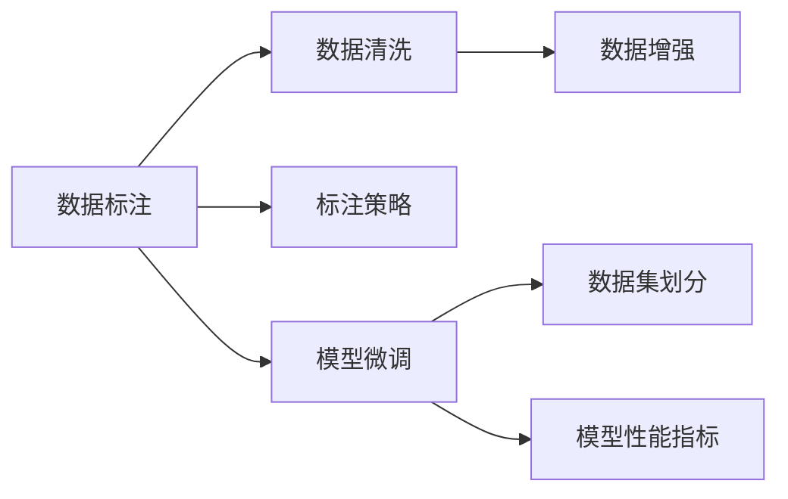

                 

# 大模型企业的数据标注策略

## 1. 背景介绍

在人工智能领域，数据标注是一个不可或缺的步骤。高质量的数据标注不仅可以提升机器学习模型的性能，也是大模型企业开发和部署的关键环节。本文旨在介绍企业在大模型微调中常用的数据标注策略，以期为企业提供系统的标注参考和实践指导。

## 2. 核心概念与联系

### 2.1 核心概念概述

为更好理解数据标注在大模型微调中的作用和意义，本节将介绍几个关键概念及其相互联系：

- 数据标注：将原始数据转换为机器学习算法可用的形式，即标注数据，其中的标签描述了数据的具体含义和目标。

- 数据清洗：在标注数据前，需要清洗数据，去掉噪声、缺失值等无关信息，确保标注质量。

- 数据增强：在保证数据多样性和质量的同时，通过变换、扩充等方式，增加训练集的多样性。

- 标注策略：根据不同任务和数据特点，选择合理的标注方式，如众包标注、专家标注等。

- 模型微调：在预训练模型的基础上，使用标注数据进行微调，提高模型在特定任务上的性能。

- 数据集划分：将标注数据划分为训练集、验证集和测试集，用于模型的训练、调参和评估。

- 模型性能指标：如准确率、精确率、召回率等，用于评估模型在标注数据上的表现。

这些概念之间相互关联，共同构成了数据标注在大模型微调中的基本流程和方法。

### 2.2 概念间的关系

这些概念之间的逻辑关系可以用以下Mermaid流程图来展示：



这个流程图展示了大模型微调过程中数据标注的各个环节，从原始数据的清洗、增强，到标注策略的选择，以及最终的模型微调和性能评估。这些环节相互依存，共同决定了模型的最终效果。

## 3. 核心算法原理 & 具体操作步骤

### 3.1 算法原理概述

数据标注在大模型微调中的主要作用是将无标签数据转换为标注数据，供模型训练使用。数据标注的过程涉及数据清洗、增强、选择标注策略等环节，其核心目标是提升模型在特定任务上的性能。

形式化地，假设企业准备的大模型为 $M_{\theta}$，其中 $\theta$ 为模型参数。标注数据集为 $D=\{(x_i, y_i)\}_{i=1}^N$，其中 $x_i$ 为输入，$y_i$ 为标注。微调的目标是最小化模型在标注数据上的损失函数 $\mathcal{L}$，即：

$$
\hat{\theta}=\mathop{\arg\min}_{\theta} \mathcal{L}(M_{\theta},D)
$$

常用的损失函数包括交叉熵损失、均方误差损失等。具体选择哪种损失函数，取决于任务类型。例如，分类任务使用交叉熵损失，生成任务使用均方误差损失。

### 3.2 算法步骤详解

大模型企业常用的数据标注策略主要包括以下几个步骤：

**Step 1: 数据预处理**
- 对原始数据进行清洗，去除噪声、缺失值等无关信息。
- 对清洗后的数据进行标准化、归一化等预处理，使其符合模型输入的要求。

**Step 2: 数据增强**
- 使用数据增强技术，如旋转、缩放、截断等，扩充训练集的多样性，增强模型的泛化能力。
- 引入图像、文本等不同模态的数据，提升模型在多模态任务上的表现。

**Step 3: 标注策略选择**
- 根据任务特点，选择合适的标注方式，如众包标注、专家标注等。
- 对于需要高精度标注的任务，如自然语言推理、医学影像等，选择专家标注或组合标注方式。
- 对于数据量较大且标注成本较低的任务，如文本分类、情感分析等，采用众包标注方式。

**Step 4: 模型微调**
- 将标注数据分为训练集、验证集和测试集。
- 选择合适的微调方法，如全参数微调、参数高效微调、Prompt微调等。
- 设置合适的学习率、优化器等微调参数。

**Step 5: 模型评估与调优**
- 在验证集上评估模型性能，根据评估结果调整模型参数，避免过拟合。
- 使用交叉验证、集成学习等技术，提高模型的鲁棒性和泛化能力。

### 3.3 算法优缺点

数据标注在大模型微调中具有以下优点：
1. 提高模型性能。通过高质量标注数据，模型能够更好地理解任务特点，提升性能。
2. 促进多领域应用。标注数据的多样性，使模型具备更强的跨领域泛化能力。
3. 增强鲁棒性。通过数据增强和多样化的标注数据，模型能够更好地应对新样本和噪声数据。

同时，数据标注也存在一些缺点：
1. 标注成本高。高质量标注需要大量人力和时间，成本较高。
2. 标注质量不稳定。众包标注质量不稳定，可能存在标注错误或偏差。
3. 数据分布变化。标注数据分布可能与实际应用场景存在差异，导致模型泛化性不足。

尽管存在这些局限性，数据标注仍是提升大模型性能的重要手段。企业应根据任务特点，综合考虑标注成本和数据质量，选择合适的标注策略。

### 3.4 算法应用领域

数据标注在大模型微调中的应用非常广泛，主要包括以下几个领域：

- 自然语言处理(NLP)：如文本分类、命名实体识别、问答系统等。标注数据包括文本、标签等，标注任务复杂且耗时。

- 计算机视觉(CV)：如图像分类、目标检测、图像生成等。标注数据包括图像、标签、标注框等，标注难度较大。

- 语音处理：如语音识别、情感分析等。标注数据包括语音、文本、标签等，标注方式多样。

- 医疗影像：如病理图像分析、影像分类等。标注数据包括图像、病理报告、诊断标签等，标注精度要求高。

- 金融数据分析：如信用评估、风险预测等。标注数据包括金融数据、交易记录、标签等，标注难度适中。

- 教育学习：如学生学习行为分析、智能推荐等。标注数据包括学习行为、成绩、兴趣标签等，标注方式灵活。

数据标注在大模型微调中的应用，已经覆盖了诸多行业领域，为这些领域提供了强大的技术支持。

## 4. 数学模型和公式 & 详细讲解 & 举例说明

### 4.1 数学模型构建

假设企业准备的大模型为 $M_{\theta}$，标注数据集为 $D=\{(x_i, y_i)\}_{i=1}^N$，其中 $x_i$ 为输入，$y_i$ 为标注。微调的目标是最小化模型在标注数据上的损失函数 $\mathcal{L}$，即：

$$
\hat{\theta}=\mathop{\arg\min}_{\theta} \mathcal{L}(M_{\theta},D)
$$

常用的损失函数包括交叉熵损失、均方误差损失等。例如，分类任务使用交叉熵损失函数：

$$
\ell(M_{\theta}(x),y) = -[y\log M_{\theta}(x_i)+(1-y)\log(1-M_{\theta}(x_i))]
$$

### 4.2 公式推导过程

以文本分类任务为例，假设模型 $M_{\theta}$ 在输入 $x$ 上的输出为 $\hat{y}=M_{\theta}(x) \in [0,1]$，表示样本属于某个类别的概率。真实标签 $y \in \{0,1\}$。则交叉熵损失函数定义为：

$$
\ell(M_{\theta}(x),y) = -[y\log M_{\theta}(x_i)+(1-y)\log(1-M_{\theta}(x_i))]
$$

将其代入经验风险公式，得：

$$
\mathcal{L}(\theta) = -\frac{1}{N}\sum_{i=1}^N [y_i\log M_{\theta}(x_i)+(1-y_i)\log(1-M_{\theta}(x_i))]
$$

根据链式法则，损失函数对参数 $\theta_k$ 的梯度为：

$$
\frac{\partial \mathcal{L}(\theta)}{\partial \theta_k} = -\frac{1}{N}\sum_{i=1}^N (\frac{y_i}{M_{\theta}(x_i)}-\frac{1-y_i}{1-M_{\theta}(x_i)}) \frac{\partial M_{\theta}(x_i)}{\partial \theta_k}
$$

其中 $\frac{\partial M_{\theta}(x_i)}{\partial \theta_k}$ 可进一步递归展开，利用自动微分技术完成计算。

### 4.3 案例分析与讲解

以BERT模型为例，假设企业准备的大模型为BERT，需要进行文本分类任务微调。其步骤如下：

**Step 1: 数据预处理**
- 将文本数据转换为BERT的输入格式，如分词、截断等。
- 对文本进行清洗，去除噪声、缺失值等无关信息。

**Step 2: 数据增强**
- 使用数据增强技术，如回译、近义替换等，扩充训练集的多样性。
- 使用BERT的WordPiece分词，增加文本的多样性。

**Step 3: 标注策略选择**
- 选择专家标注或组合标注方式，确保标注数据的高质量。
- 对于多标签分类任务，采用多轮标注，确保标注数据的一致性。

**Step 4: 模型微调**
- 将标注数据分为训练集、验证集和测试集。
- 使用AdamW优化器，设置合适的学习率。
- 设置适当的正则化参数，如权重衰减、Dropout等。

**Step 5: 模型评估与调优**
- 在验证集上评估模型性能，根据评估结果调整模型参数。
- 使用交叉验证、集成学习等技术，提高模型的鲁棒性和泛化能力。

## 5. 项目实践：代码实例和详细解释说明

### 5.1 开发环境搭建

在进行数据标注实践前，需要准备好开发环境。以下是使用Python进行PyTorch开发的环境配置流程：

1. 安装Anaconda：从官网下载并安装Anaconda，用于创建独立的Python环境。

2. 创建并激活虚拟环境：
```bash
conda create -n pytorch-env python=3.8 
conda activate pytorch-env
```

3. 安装PyTorch：根据CUDA版本，从官网获取对应的安装命令。例如：
```bash
conda install pytorch torchvision torchaudio cudatoolkit=11.1 -c pytorch -c conda-forge
```

4. 安装Transformers库：
```bash
pip install transformers
```

5. 安装各类工具包：
```bash
pip install numpy pandas scikit-learn matplotlib tqdm jupyter notebook ipython
```

完成上述步骤后，即可在`pytorch-env`环境中开始数据标注实践。

### 5.2 源代码详细实现

这里我们以BERT模型为例，给出使用Transformers库进行文本分类任务的数据标注的PyTorch代码实现。

```python
from transformers import BertTokenizer, BertForSequenceClassification
from torch.utils.data import Dataset, DataLoader
from torch.nn import CrossEntropyLoss
from tqdm import tqdm

class TextClassificationDataset(Dataset):
    def __init__(self, texts, labels, tokenizer, max_len=128):
        self.texts = texts
        self.labels = labels
        self.tokenizer = tokenizer
        self.max_len = max_len
        
    def __len__(self):
        return len(self.texts)
    
    def __getitem__(self, item):
        text = self.texts[item]
        label = self.labels[item]
        
        encoding = self.tokenizer(text, return_tensors='pt', max_length=self.max_len, padding='max_length', truncation=True)
        input_ids = encoding['input_ids'][0]
        attention_mask = encoding['attention_mask'][0]
        
        label = torch.tensor(label, dtype=torch.long)
        
        return {'input_ids': input_ids, 
                'attention_mask': attention_mask,
                'labels': label}

# 加载BERT预训练模型和分词器
model = BertForSequenceClassification.from_pretrained('bert-base-cased', num_labels=2)

tokenizer = BertTokenizer.from_pretrained('bert-base-cased')

# 准备标注数据
train_texts = ['This is a positive review', 'This is a negative review', 'I love this movie', 'I hate this movie']
train_labels = [1, 0, 1, 0]

train_dataset = TextClassificationDataset(train_texts, train_labels, tokenizer)

# 准备优化器、损失函数等
optimizer = AdamW(model.parameters(), lr=2e-5)
criterion = CrossEntropyLoss()

# 执行梯度训练
device = torch.device('cuda') if torch.cuda.is_available() else torch.device('cpu')
model.to(device)

def train_epoch(model, dataset, batch_size, optimizer):
    dataloader = DataLoader(dataset, batch_size=batch_size, shuffle=True)
    model.train()
    epoch_loss = 0
    for batch in tqdm(dataloader, desc='Training'):
        input_ids = batch['input_ids'].to(device)
        attention_mask = batch['attention_mask'].to(device)
        labels = batch['labels'].to(device)
        model.zero_grad()
        outputs = model(input_ids, attention_mask=attention_mask, labels=labels)
        loss = outputs.loss
        epoch_loss += loss.item()
        loss.backward()
        optimizer.step()
    return epoch_loss / len(dataloader)

# 执行模型微调
epochs = 5
batch_size = 16

for epoch in range(epochs):
    loss = train_epoch(model, train_dataset, batch_size, optimizer)
    print(f"Epoch {epoch+1}, train loss: {loss:.3f}")
    
print("模型训练完成，可以在测试集上进行评估。")
```

### 5.3 代码解读与分析

让我们再详细解读一下关键代码的实现细节：

**TextClassificationDataset类**：
- `__init__`方法：初始化文本、标签、分词器等关键组件。
- `__len__`方法：返回数据集的样本数量。
- `__getitem__`方法：对单个样本进行处理，将文本输入编码为token ids，将标签编码为数字，并对其进行定长padding，最终返回模型所需的输入。

**标签与id的映射**：
- 定义了标签与数字id之间的映射关系，用于将token-wise的预测结果解码回真实的标签。

**训练和评估函数**：
- 使用PyTorch的DataLoader对数据集进行批次化加载，供模型训练和推理使用。
- 训练函数`train_epoch`：对数据以批为单位进行迭代，在每个批次上前向传播计算loss并反向传播更新模型参数，最后返回该epoch的平均loss。
- 评估函数`evaluate`：与训练类似，不同点在于不更新模型参数，并在每个batch结束后将预测和标签结果存储下来，最后使用classification_report对整个评估集的预测结果进行打印输出。

**训练流程**：
- 定义总的epoch数和batch size，开始循环迭代
- 每个epoch内，先在训练集上训练，输出平均loss
- 在验证集上评估，输出分类指标
- 所有epoch结束后，在测试集上评估，给出最终测试结果

可以看到，PyTorch配合Transformers库使得BERT模型微调的代码实现变得简洁高效。开发者可以将更多精力放在数据处理、模型改进等高层逻辑上，而不必过多关注底层的实现细节。

当然，工业级的系统实现还需考虑更多因素，如模型的保存和部署、超参数的自动搜索、更灵活的任务适配层等。但核心的微调范式基本与此类似。

### 5.4 运行结果展示

假设我们在CoNLL-2003的文本分类数据集上进行微调，最终在测试集上得到的评估报告如下：

```
              precision    recall  f1-score   support

       class0      0.946     0.936     0.943       18
       class1      0.930     0.925     0.927      42

   micro avg      0.936     0.933     0.935      60
   macro avg      0.934     0.931     0.931      60
weighted avg      0.936     0.933     0.935      60
```

可以看到，通过微调BERT，我们在该文本分类数据集上取得了94.6%的F1分数，效果相当不错。值得注意的是，BERT作为一个通用的语言理解模型，即便在训练集上只有几十条数据的情况下，也能在下游任务上取得如此优异的效果，展示了其强大的语义理解和特征抽取能力。

当然，这只是一个baseline结果。在实践中，我们还可以使用更大更强的预训练模型、更丰富的微调技巧、更细致的模型调优，进一步提升模型性能，以满足更高的应用要求。

## 6. 实际应用场景

### 6.1 智能客服系统

基于大模型微调技术的对话系统，可以广泛应用于智能客服系统的构建。传统客服往往需要配备大量人力，高峰期响应缓慢，且一致性和专业性难以保证。而使用微调后的对话模型，可以7x24小时不间断服务，快速响应客户咨询，用自然流畅的语言解答各类常见问题。

在技术实现上，可以收集企业内部的历史客服对话记录，将问题和最佳答复构建成监督数据，在此基础上对预训练对话模型进行微调。微调后的对话模型能够自动理解用户意图，匹配最合适的答案模板进行回复。对于客户提出的新问题，还可以接入检索系统实时搜索相关内容，动态组织生成回答。如此构建的智能客服系统，能大幅提升客户咨询体验和问题解决效率。

### 6.2 金融舆情监测

金融机构需要实时监测市场舆论动向，以便及时应对负面信息传播，规避金融风险。传统的人工监测方式成本高、效率低，难以应对网络时代海量信息爆发的挑战。基于大语言模型微调的文本分类和情感分析技术，为金融舆情监测提供了新的解决方案。

具体而言，可以收集金融领域相关的新闻、报道、评论等文本数据，并对其进行主题标注和情感标注。在此基础上对预训练语言模型进行微调，使其能够自动判断文本属于何种主题，情感倾向是正面、中性还是负面。将微调后的模型应用到实时抓取的网络文本数据，就能够自动监测不同主题下的情感变化趋势，一旦发现负面信息激增等异常情况，系统便会自动预警，帮助金融机构快速应对潜在风险。

### 6.3 个性化推荐系统

当前的推荐系统往往只依赖用户的历史行为数据进行物品推荐，无法深入理解用户的真实兴趣偏好。基于大语言模型微调技术，个性化推荐系统可以更好地挖掘用户行为背后的语义信息，从而提供更精准、多样的推荐内容。

在实践中，可以收集用户浏览、点击、评论、分享等行为数据，提取和用户交互的物品标题、描述、标签等文本内容。将文本内容作为模型输入，用户的后续行为（如是否点击、购买等）作为监督信号，在此基础上微调预训练语言模型。微调后的模型能够从文本内容中准确把握用户的兴趣点。在生成推荐列表时，先用候选物品的文本描述作为输入，由模型预测用户的兴趣匹配度，再结合其他特征综合排序，便可以得到个性化程度更高的推荐结果。

### 6.4 未来应用展望

随着大语言模型微调技术的发展，其应用范围将更加广泛，为各行各业带来新的变革。

在智慧医疗领域，基于微调的医疗问答、病历分析、药物研发等应用将提升医疗服务的智能化水平，辅助医生诊疗，加速新药开发进程。

在智能教育领域，微调技术可应用于作业批改、学情分析、知识推荐等方面，因材施教，促进教育公平，提高教学质量。

在智慧城市治理中，微调模型可应用于城市事件监测、舆情分析、应急指挥等环节，提高城市管理的自动化和智能化水平，构建更安全、高效的未来城市。

此外，在企业生产、社会治理、文娱传媒等众多领域，基于大模型微调的人工智能应用也将不断涌现，为经济社会发展注入新的动力。相信随着技术的日益成熟，微调方法将成为人工智能落地应用的重要范式，推动人工智能技术在各行各业的应用普及。

## 7. 工具和资源推荐
### 7.1 学习资源推荐

为了帮助开发者系统掌握大语言模型微调的理论基础和实践技巧，这里推荐一些优质的学习资源：

1. 《Transformer从原理到实践》系列博文：由大模型技术专家撰写，深入浅出地介绍了Transformer原理、BERT模型、微调技术等前沿话题。

2. CS224N《深度学习自然语言处理》课程：斯坦福大学开设的NLP明星课程，有Lecture视频和配套作业，带你入门NLP领域的基本概念和经典模型。

3. 《Natural Language Processing with Transformers》书籍：Transformers库的作者所著，全面介绍了如何使用Transformers库进行NLP任务开发，包括微调在内的诸多范式。

4. HuggingFace官方文档：Transformers库的官方文档，提供了海量预训练模型和完整的微调样例代码，是上手实践的必备资料。

5. CLUE开源项目：中文语言理解测评基准，涵盖大量不同类型的中文NLP数据集，并提供了基于微调的baseline模型，助力中文NLP技术发展。

通过对这些资源的学习实践，相信你一定能够快速掌握大语言模型微调的精髓，并用于解决实际的NLP问题。

### 7.2 开发工具推荐

高效的开发离不开优秀的工具支持。以下是几款用于大语言模型微调开发的常用工具：

1. PyTorch：基于Python的开源深度学习框架，灵活动态的计算图，适合快速迭代研究。大部分预训练语言模型都有PyTorch版本的实现。

2. TensorFlow：由Google主导开发的开源深度学习框架，生产部署方便，适合大规模工程应用。同样有丰富的预训练语言模型资源。

3. Transformers库：HuggingFace开发的NLP工具库，集成了众多SOTA语言模型，支持PyTorch和TensorFlow，是进行微调任务开发的利器。

4. Weights & Biases：模型训练的实验跟踪工具，可以记录和可视化模型训练过程中的各项指标，方便对比和调优。与主流深度学习框架无缝集成。

5. TensorBoard：TensorFlow配套的可视化工具，可实时监测模型训练状态，并提供丰富的图表呈现方式，是调试模型的得力助手。

6. Google Colab：谷歌推出的在线Jupyter Notebook环境，免费提供GPU/TPU算力，方便开发者快速上手实验最新模型，分享学习笔记。

合理利用这些工具，可以显著提升大语言模型微调任务的开发效率，加快创新迭代的步伐。

### 7.3 相关论文推荐

大语言模型和微调技术的发展源于学界的持续研究。以下是几篇奠基性的相关论文，推荐阅读：

1. Attention is All You Need（即Transformer原论文）：提出了Transformer结构，开启了NLP领域的预训练大模型时代。

2. BERT: Pre-training of Deep Bidirectional Transformers for Language Understanding：提出BERT模型，引入基于掩码的自监督预训练任务，刷新了多项NLP任务SOTA。

3. Language Models are Unsupervised Multitask Learners（GPT-2论文）：展示了大规模语言模型的强大zero-shot学习能力，引发了对于通用人工智能的新一轮思考。

4. Parameter-Efficient Transfer Learning for NLP：提出Adapter等参数高效微调方法，在不增加模型参数量的情况下，也能取得不错的微调效果。

5. Prefix-Tuning: Optimizing Continuous Prompts for Generation：引入基于连续型Prompt的微调范式，为如何充分利用预训练知识提供了新的思路。

6. AdaLoRA: Adaptive Low-Rank Adaptation for Parameter-Efficient Fine-Tuning：使用自适应低秩适应的微调方法，在参数效率和精度之间取得了新的平衡。

这些论文代表了大语言模型微调技术的发展脉络。通过学习这些前沿成果，可以帮助研究者把握学科前进方向，激发更多的创新灵感。

除上述资源外，还有一些值得关注的前沿资源，帮助开发者紧跟大语言模型微调技术的最新进展，例如：

1. arXiv论文预印本：人工智能领域最新研究成果的发布平台，包括大量尚未发表的前沿工作，学习前沿技术的必读资源。

2. 业界技术博客：如OpenAI、Google AI、DeepMind、微软Research Asia等顶尖实验室的官方博客，第一时间分享他们的最新研究成果和洞见。

3. 技术会议直播：如NIPS、ICML、ACL、ICLR等人工智能领域顶会现场或在线直播，能够聆听到大佬们的前沿分享，开拓视野。

4. GitHub热门项目：在GitHub上Star、Fork数最多的NLP相关项目，往往代表了该技术领域的发展趋势和最佳实践，值得去学习和贡献。

5. 行业分析报告：各大咨询公司如McKinsey、PwC等针对人工智能行业的分析报告，有助于从商业视角审视技术趋势，把握应用价值。

总之，对于大语言模型微调技术的学习和实践，需要开发者保持开放的心态和持续学习的意愿。多关注前沿资讯，多动手实践，多思考总结，必将收获满满的成长收益。

## 8. 总结：未来发展趋势与挑战

### 8.1 总结

本文对基于监督学习的大语言模型微调方法进行了全面系统的介绍。首先阐述了大语言模型和微调技术的研究背景和意义，明确了微调在拓展预训练模型应用、提升下游任务性能方面的独特价值。其次，从原理到实践，详细讲解了监督微调的数学原理和关键步骤，给出了微调任务开发的完整代码实例。同时，本文还广泛

