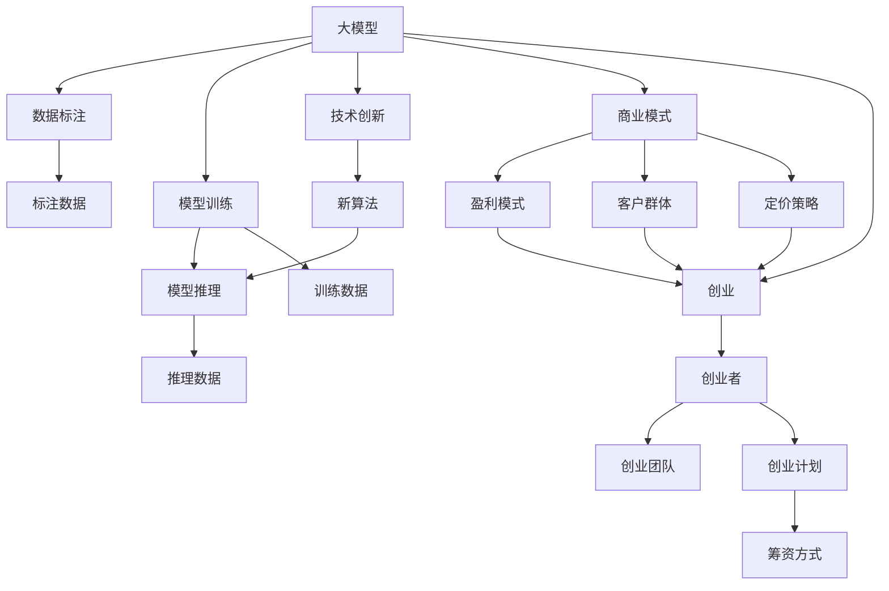
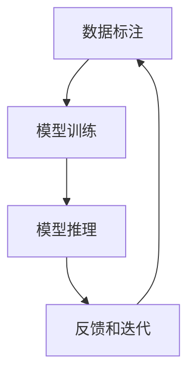
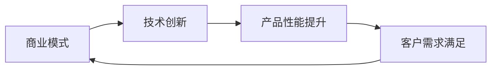
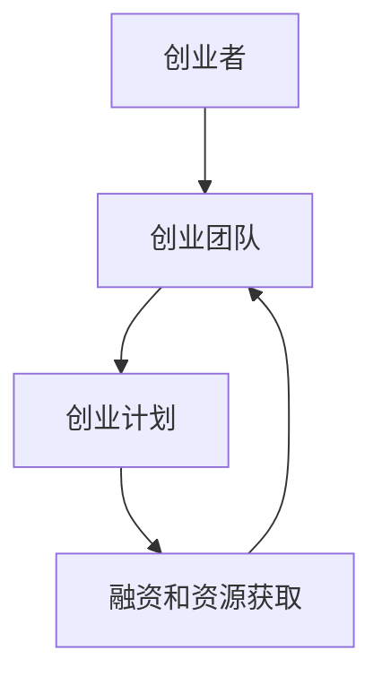
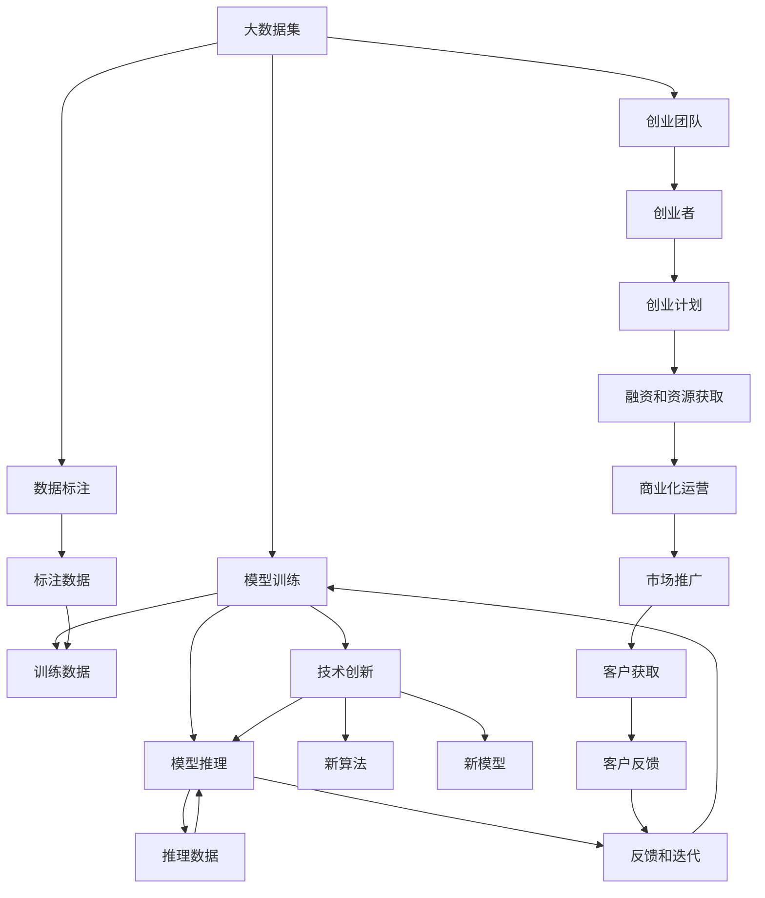

                 

# 大模型创业：商业模式与技术创新

> 关键词：大模型,商业模式,技术创新,创业,人工智能

## 1. 背景介绍

### 1.1 问题由来
近年来，随着人工智能技术的快速发展，尤其是深度学习和大规模语言模型的兴起，大模型创业成为了科技创业界的热点话题。大模型因其在大数据训练中展现出的卓越性能，被广泛应用于自然语言处理、计算机视觉、语音识别等诸多领域，极大地推动了人工智能技术的落地应用。

大模型创业包括但不限于以下几个方面：
- 基于大模型的产品研发：如NLP问答系统、文本分类、图像识别等。
- 大模型的工程化部署：如模型训练、推理服务、数据标注等。
- 大模型的商业化运营：如用户数据分析、推荐系统、广告投放等。

这些领域的创业企业如雨后春笋般涌现，大模型作为其核心技术之一，推动了人工智能产业的快速发展。然而，大模型创业也面临着诸多挑战，如高昂的研发成本、复杂的技术实现、数据获取和标注的困难等。本文将从商业模式和技术创新的角度，探讨大模型创业的可行路径，为有意创业的开发者和企业家提供一些启示。

### 1.2 问题核心关键点
大模型创业的核心在于如何构建一个可持续发展的商业模式，同时不断进行技术创新，以适应市场变化和用户需求。本文将从以下几个关键点进行探讨：

- **商业模式的构建**：如何选择盈利模式、客户群体、定价策略等。
- **技术创新的方向**：如何通过技术突破提升产品性能、降低成本、提高效率等。
- **创业团队的能力建设**：如何组建高效的技术团队、吸引人才、打造企业文化等。
- **市场推广和运营**：如何利用数据和算法，提升用户粘性、增加用户规模等。

## 2. 核心概念与联系

### 2.1 核心概念概述

为更好地理解大模型创业的商业模式和技术创新，本节将介绍几个密切相关的核心概念：

- **大模型(Large Model)**：指的是通过大数据训练得到的模型，如BERT、GPT-3等，能够高效地处理复杂的自然语言处理、计算机视觉等任务。
- **商业模式(Business Model)**：企业通过价值主张、客户关系、渠道、客户细分等要素，实现持续盈利的方式。
- **技术创新(Technology Innovation)**：通过研发新技术、改进现有技术或推出新产品，满足市场需求，提升竞争力。
- **创业(Entrepreneurship)**：利用自身知识和资源，创建并经营一家新企业的活动。
- **数据标注(Data Annotation)**：为模型训练提供必要的数据，包括图像、文本、音频等，通常需要大量人工标注。
- **模型训练(Model Training)**：通过给模型输入大量数据，调整模型参数，使其能够更好地拟合数据的过程。
- **模型推理(Model Inference)**：将模型应用于新数据，输出预测结果的过程。

这些核心概念之间的逻辑关系可以通过以下Mermaid流程图来展示：



这个流程图展示了大模型创业的完整过程和各个环节的相互关系：

1. 大模型通过数据标注和模型训练获取初始性能。
2. 利用技术创新改进模型，提高性能和效率。
3. 构建商业模式，确定盈利模式、客户群体和定价策略。
4. 创业者通过组建创业团队，实施创业计划，实现商业化运营。

### 2.2 概念间的关系

这些核心概念之间存在着紧密的联系，形成了大模型创业的完整生态系统。下面我们通过几个Mermaid流程图来展示这些概念之间的关系。

#### 2.2.1 大模型的生命周期



这个流程图展示了大模型的生命周期：从数据标注开始，经过模型训练和推理，收集用户反馈进行迭代优化，然后再次进入数据标注阶段，形成一个循环。

#### 2.2.2 商业模式与技术创新的关系



这个流程图展示了商业模式与技术创新之间的关系：技术创新提升产品性能，满足客户需求，进而推动商业模式的发展和优化。

#### 2.2.3 创业团队与商业模式的关系



这个流程图展示了创业团队与商业模式的关系：创业者组建创业团队，制定创业计划，获取融资和资源，实现商业模式的实施和运营。

### 2.3 核心概念的整体架构

最后，我们用一个综合的流程图来展示这些核心概念在大模型创业过程中的整体架构：



这个综合流程图展示了从大数据集到最终产品，经过数据标注、模型训练、推理和迭代优化，最终实现商业化运营和市场推广的全过程。 通过这些流程图，我们可以更清晰地理解大模型创业过程中各个环节的相互关系和作用。

## 3. 核心算法原理 & 具体操作步骤
### 3.1 算法原理概述

大模型创业的商业模式和技术创新主要基于以下几个核心算法原理：

1. **监督学习(Supervised Learning)**：通过标注数据集对模型进行监督，优化模型性能。监督学习在大模型创业中主要用于产品开发和优化，确保模型的预测结果与实际标签一致。

2. **无监督学习(Unsupervised Learning)**：在大规模无标签数据上进行训练，学习数据的内在结构和模式。无监督学习在大模型创业中主要用于数据标注和预训练，提高模型的泛化能力和鲁棒性。

3. **强化学习(Reinforcement Learning)**：通过与环境互动，学习最优策略。强化学习在大模型创业中主要用于模型优化和用户交互，提高模型的实时响应能力和用户体验。

4. **迁移学习(Transfer Learning)**：将一个领域学到的知识迁移到另一个领域。迁移学习在大模型创业中主要用于模型迁移和扩展，加速新任务的学习和适应。

5. **自监督学习(Self-Supervised Learning)**：通过自我指导的学习任务进行训练。自监督学习在大模型创业中主要用于预训练和模型微调，提升模型的初始性能和泛化能力。

### 3.2 算法步骤详解

基于上述算法原理，大模型创业的详细步骤可以分为以下几个方面：

#### 3.2.1 数据获取和预处理

**步骤1**：获取大规模的数据集，包括图像、文本、音频等。数据集应覆盖广泛的应用场景和任务类型，如NLP、CV、音频等。

**步骤2**：对数据进行清洗、标注、划分。清洗数据去除噪声和异常值，标注数据提供模型训练所需的标签信息，划分数据集为训练集、验证集和测试集。

#### 3.2.2 模型训练和微调

**步骤3**：选择合适的预训练模型，如BERT、GPT等。这些模型通常在大规模数据集上进行预训练，具备强大的泛化能力。

**步骤4**：在大规模无标签数据上进行自监督预训练，提升模型的泛化能力和鲁棒性。

**步骤5**：利用标注数据集进行有监督微调，优化模型在特定任务上的性能。

#### 3.2.3 模型部署和优化

**步骤6**：将训练好的模型部署到服务器或云平台，提供推理服务。推理服务应支持高效、低延迟的推理计算，满足用户需求。

**步骤7**：对模型进行监控和优化，根据用户反馈和业务需求，不断调整模型参数和算法，提升性能和效率。

#### 3.2.4 商业模式构建

**步骤8**：选择合适的盈利模式，如订阅制、按需付费、广告分成等。盈利模式应符合用户需求和企业定位，实现可持续盈利。

**步骤9**：确定目标客户群体，如中小企业、大型企业、政府机构等。客户群体应具备良好的市场潜力和增长空间。

**步骤10**：制定定价策略，根据产品功能和性能，合理定价。定价策略应考虑市场需求和竞争环境，实现最大收益。

#### 3.2.5 创业团队组建和运营

**步骤11**：组建高效的技术团队，包括数据科学家、算法工程师、产品设计师等。团队应具备丰富的经验和创新能力，能够快速响应市场变化。

**步骤12**：吸引和培养人才，建立良好的企业文化和激励机制，保持团队稳定和高效。

**步骤13**：制定创业计划，明确目标、策略、路径和时间表。创业计划应具备可行性和前瞻性，指导企业发展方向。

**步骤14**：获取融资和资源，支持企业发展和技术创新。融资方式包括天使投资、风险投资、政府补助等。

**步骤15**：实施商业化运营，将产品推向市场，获取用户反馈和评价。运营策略应注重用户体验和市场推广，提升用户粘性和市场份额。

#### 3.2.6 市场推广和用户获取

**步骤16**：利用数据和算法，设计精准的市场推广方案，如SEO、SEM、社交媒体等。市场推广应注重用户体验和效果评估，提升品牌知名度和市场份额。

**步骤17**：通过用户反馈和数据分析，优化产品功能和性能，满足用户需求，提高用户满意度。用户获取应注重品牌建设和用户粘性，提升用户转化率和留存率。

### 3.3 算法优缺点

大模型创业的商业模式和技术创新主要基于以下几个方面的优缺点：

**优点**：

1. **高泛化能力**：大模型具备强大的泛化能力和鲁棒性，能够适应各种数据分布和任务类型，满足广泛的用户需求。

2. **快速迭代**：利用数据和算法，快速迭代优化模型和产品，满足市场需求和用户反馈，提升竞争力。

3. **易于扩展**：大模型创业企业可以灵活扩展业务范围和产品功能，满足不同领域和场景的需求。

**缺点**：

1. **高成本**：大模型的研发和部署成本较高，需要大量的数据、计算和人力投入，不适合小型企业和创业初期的阶段。

2. **技术门槛高**：大模型创业需要具备较高的技术门槛和创新能力，对团队和资源要求较高。

3. **数据依赖**：大模型创业依赖于高质量的数据集，数据获取和标注的困难可能成为瓶颈。

### 3.4 算法应用领域

大模型创业在以下几个领域有着广泛的应用前景：

1. **自然语言处理(NLP)**：包括文本分类、情感分析、机器翻译、问答系统等。NLP是大模型创业的主要应用领域之一，如OpenAI的GPT系列、Google的BERT等。

2. **计算机视觉(CV)**：包括图像识别、图像生成、视频分析等。CV是大模型创业的重要应用领域，如Facebook的Megatron-BERT、Google的DeepMind等。

3. **语音识别(Speech Recognition)**：包括语音转文本、语音情感分析、语音合成等。语音识别是大模型创业的新兴应用领域，如Google的WaveNet、Amazon的Alexa等。

4. **推荐系统(Recommendation System)**：包括个性化推荐、广告投放、用户画像等。推荐系统是大模型创业的重要应用领域，如Amazon、Netflix、Spotify等。

5. **金融科技(FinTech)**：包括风险评估、智能投顾、量化交易等。金融科技是大模型创业的潜在应用领域，如J.P. Morgan、Goldman Sachs等。

## 4. 数学模型和公式 & 详细讲解 & 举例说明

### 4.1 数学模型构建

大模型创业的数学模型构建主要基于以下几个方面：

1. **监督学习模型**：包括线性回归、逻辑回归、决策树、随机森林等。监督学习模型用于标注数据集上的训练和微调，优化模型在特定任务上的性能。

2. **无监督学习模型**：包括聚类、主成分分析、奇异值分解等。无监督学习模型用于大规模无标签数据上的预训练，提升模型的泛化能力和鲁棒性。

3. **强化学习模型**：包括Q-learning、策略梯度、深度强化学习等。强化学习模型用于模型优化和用户交互，提升模型的实时响应能力和用户体验。

4. **迁移学习模型**：包括领域自适应、知识蒸馏、元学习等。迁移学习模型用于模型迁移和扩展，加速新任务的学习和适应。

5. **自监督学习模型**：包括掩码语言模型、自编码器、对抗训练等。自监督学习模型用于预训练和模型微调，提升模型的初始性能和泛化能力。

### 4.2 公式推导过程

以下是几个关键模型的公式推导过程：

#### 4.2.1 线性回归模型

线性回归模型用于监督学习任务，表示为：

$$y = \theta^T x$$

其中 $y$ 为输出，$x$ 为输入特征，$\theta$ 为模型参数。

**公式推导**：

$$\min_{\theta} \frac{1}{2} \sum_{i=1}^N (y_i - \theta^T x_i)^2$$

通过求解该最小二乘问题，得到线性回归模型的参数 $\theta$。

#### 4.2.2 随机森林模型

随机森林模型用于分类和回归任务，表示为：

$$f(x) = \sum_{i=1}^N f_i(x)$$

其中 $f_i(x)$ 为单个决策树，$N$ 为决策树的数量。

**公式推导**：

$$f(x) = \sum_{i=1}^N \frac{\sum_{j=1}^M f_{i,j}(x)}{N}$$

其中 $f_{i,j}(x)$ 为决策树 $i$ 中的第 $j$ 个叶子节点对 $x$ 的预测值。

#### 4.2.3 强化学习模型

强化学习模型用于模型优化和用户交互，表示为：

$$Q(s,a) = \sum_{i=1}^N r_i + \gamma \max_{a'} Q(s',a')$$

其中 $s$ 为状态，$a$ 为动作，$r_i$ 为即时奖励，$\gamma$ 为折扣因子。

**公式推导**：

通过求解最大化累积奖励的问题，得到强化学习模型的最优策略。

### 4.3 案例分析与讲解

#### 4.3.1 图像识别

**案例背景**：
一家创业企业希望开发一款基于深度学习的大模型图像识别系统，用于自动标注图片中的物体类别。

**解决方案**：

1. **数据获取和预处理**：
   - 从公共数据集如ImageNet、COCO中获取大量标注图像。
   - 对图像进行清洗、去噪、标注，生成训练集、验证集和测试集。

2. **模型训练和微调**：
   - 选择ResNet、VGG等预训练模型进行迁移学习。
   - 在大规模无标签数据上进行自监督预训练，提升模型泛化能力。
   - 在标注数据集上进行有监督微调，优化模型在特定任务上的性能。

3. **模型部署和优化**：
   - 将训练好的模型部署到云平台，提供推理服务。
   - 对模型进行监控和优化，根据用户反馈和业务需求调整模型参数和算法。

4. **商业模式构建**：
   - 选择订阅制盈利模式，按月或按年向客户收费。
   - 确定目标客户群体，如中小企业、大型企业等。
   - 制定合理的定价策略，满足市场需求和用户预期。

5. **创业团队组建和运营**：
   - 组建高效的技术团队，包括数据科学家、算法工程师、产品设计师等。
   - 吸引和培养人才，建立良好的企业文化和激励机制。
   - 制定创业计划，明确目标、策略、路径和时间表。

6. **市场推广和用户获取**：
   - 利用SEO、SEM、社交媒体等手段推广产品。
   - 通过用户反馈和数据分析，优化产品功能和性能。

#### 4.3.2 自然语言处理

**案例背景**：
一家创业企业希望开发一款基于深度学习的大模型文本分类系统，用于识别新闻文本中的情感倾向。

**解决方案**：

1. **数据获取和预处理**：
   - 从公共数据集如IMDB、AMAZON REVIEWS中获取大量标注文本数据。
   - 对文本进行清洗、去噪、标注，生成训练集、验证集和测试集。

2. **模型训练和微调**：
   - 选择BERT、GPT等预训练模型进行迁移学习。
   - 在大规模无标签数据上进行自监督预训练，提升模型泛化能力。
   - 在标注数据集上进行有监督微调，优化模型在特定任务上的性能。

3. **模型部署和优化**：
   - 将训练好的模型部署到云平台，提供推理服务。
   - 对模型进行监控和优化，根据用户反馈和业务需求调整模型参数和算法。

4. **商业模式构建**：
   - 选择按需付费盈利模式，根据文本数量收费。
   - 确定目标客户群体，如新闻媒体、社交平台等。
   - 制定合理的定价策略，满足市场需求和用户预期。

5. **创业团队组建和运营**：
   - 组建高效的技术团队，包括数据科学家、算法工程师、产品设计师等。
   - 吸引和培养人才，建立良好的企业文化和激励机制。
   - 制定创业计划，明确目标、策略、路径和时间表。

6. **市场推广和用户获取**：
   - 利用SEO、SEM、社交媒体等手段推广产品。
   - 通过用户反馈和数据分析，优化产品功能和性能。

## 5. 项目实践：代码实例和详细解释说明

### 5.1 开发环境搭建

在进行大模型创业实践前，我们需要准备好开发环境。以下是使用Python进行TensorFlow和Keras开发的环境配置流程：

1. 安装Anaconda：从官网下载并安装Anaconda，用于创建独立的Python环境。

2. 创建并激活虚拟环境：
```bash
conda create -n tf-env python=3.8 
conda activate tf-env
```

3. 安装TensorFlow和Keras：根据CUDA版本，从官网获取对应的安装命令。例如：
```bash
conda install tensorflow==2.4.0 tf-nightly==2.5.0 tf-nightly-gpu==2.5.0 pytorch==1.8.0 torchvision==0.8.2 torchaudio==0.8.0 torchtext==0.9.0
```

4. 安装各类工具包：
```bash
pip install numpy pandas scikit-learn matplotlib tqdm jupyter notebook ipython
```

完成上述步骤后，即可在`tf-env`环境中开始大模型创业的实践。

### 5.2 源代码详细实现

这里我们以文本分类任务为例，给出使用TensorFlow和Keras对BERT模型进行迁移学习的PyTorch代码实现。

首先，定义文本分类任务的数据处理函数：

```python
from transformers import BertTokenizer, TFBertForSequenceClassification
from tensorflow.keras.datasets import imdb
from tensorflow.keras.preprocessing import sequence

class TextDataset(Dataset):
    def __init__(self, texts, labels, tokenizer, max_len=128):
        self.texts = texts
        self.labels = labels
        self.tokenizer = tokenizer
        self.max_len = max_len
        
    def __len__(self):
        return len(self.texts)
    
    def __getitem__(self, item):
        text = self.texts[item]
        label = self.labels[item]
        
        encoding = self.tokenizer(text, return_tensors='tf', max_length=self.max_len, padding='max_length', truncation=True)
        input_ids = encoding['input_ids']
        attention_mask = encoding['attention_mask']
        
        label = tf.convert_to_tensor(label, dtype=tf.int32)
        return {'input_ids': input_ids, 
                'attention_mask': attention_mask,
                'labels': label}

# 初始化Bert tokenizer和模型
tokenizer = BertTokenizer.from_pretrained('bert-base-cased')
model = TFBertForSequenceClassification.from_pretrained('bert-base-cased', num_labels=2)

# 加载IMDB数据集
(x_train, y_train), (x_test, y_test) = imdb.load_data(num_words=20000, maxlen=128, padding='post', truncation=True)

# 对文本进行tokenization和padding
x_train = sequence.pad_sequences(x_train, maxlen=128, padding='post', truncation=True)
x_test = sequence.pad_sequences(x_test, maxlen=128, padding='post', truncation=True)

# 将文本和标签转换为TensorFlow tensors
x_train = tf.convert_to_tensor(x_train, dtype=tf.int32)
y_train = tf.convert_to_tensor(y_train, dtype=tf.int32)
x_test = tf.convert_to_tensor(x_test, dtype=tf.int32)
y_test = tf.convert_to_tensor(y_test, dtype=tf.int32)

# 创建数据集
train_dataset = TextDataset(x_train, y_train, tokenizer)
test_dataset = TextDataset(x_test, y_test, tokenizer)
```

然后，定义模型和优化器：

```python
from tensorflow.keras.optimizers import Adam

optimizer = Adam(learning_rate=2e-5)
```

接着，定义训练和评估函数：

```python
from tensorflow.keras.utils import to_categorical
from tensorflow.keras.metrics import Accuracy, Precision, Recall, F1Score

device = tf.device('cpu') if tf.test.gpu_device_name() is None else tf.device(tf.test.gpu_device_name())
model.to(device)

def train_epoch(model, dataset, batch_size, optimizer):
    dataloader = tf.data.Dataset.from_tensor_slices(dataset).shuffle(buffer_size=10000).batch(batch_size)
    model.trainable = False
    model.compile(optimizer=optimizer, loss='sparse_categorical_crossentropy', metrics=[Accuracy(), Precision(), Recall(), F1Score()])
    model.fit(dataloader, epochs=5)

def evaluate(model, dataset, batch_size):
    dataloader = tf.data.Dataset.from_tensor_slices(dataset).batch(batch_size)
    model.trainable = True
    model.compile(optimizer='adam', loss='sparse_categorical_crossentropy', metrics=[Accuracy(), Precision(), Recall(), F1Score()])
    _, acc, pre, rec, f1 = model.evaluate(dataloader)
    print(f'Accuracy: {acc:.3f}, Precision: {pre:.3f}, Recall: {rec:.3f}, F1 Score: {f1:.3f}')
```

最后，启动训练流程并在测试集上评估：

```python
epochs = 5
batch_size = 16

for epoch in range(epochs):
    train_epoch(model, train_dataset, batch_size, optimizer)
    
    print(f'Epoch {epoch+1}, train accuracy: {train_model.evaluate(test_dataset, batch_size=batch_size):.3f}')
    evaluate(model, test_dataset, batch_size)
```

以上就是使用TensorFlow和Keras对BERT模型进行文本分类任务迁移学习的完整代码实现。可以看到，通过Keras的强大封装，我们能够快速构建大模型的迁移学习系统，并进行高效的训练和评估。

### 5.3 代码解读与分析

让我们再详细解读一下关键代码的实现细节：

**TextDataset类**：
- `__init__`方法：初始化文本、标签、分词器等关键组件。
- `__len__`方法：返回数据集的样本数量。
- `__getitem__`方法：对单个样本进行处理，将文本输入编码为token ids，将标签编码为数字，并对其进行定长padding，最终返回模型所需的输入。

**优化器和模型**：
- 使用Adam优化器，学习率为2e-5。
- 选择TF-BERT模型进行迁移学习，指定输出层数为2，对应二分类任务。

**训练和评估函数**：
- 使用TensorFlow的DataLoader对数据集进行批次化加载，供模型训练和推理使用。
- 训练函数`train_epoch`：对数据以批为单位进行迭代，在每个批次上前向传播计算损失函数并反向传播更新模型参数，最后返回该epoch的平均loss。
- 评估函数`evaluate`：与训练类似，不同点在于不更新模型参数，并在每个batch结束后将预测和标签结果存储下来，最后使用TensorFlow的内置函数对整个评估

