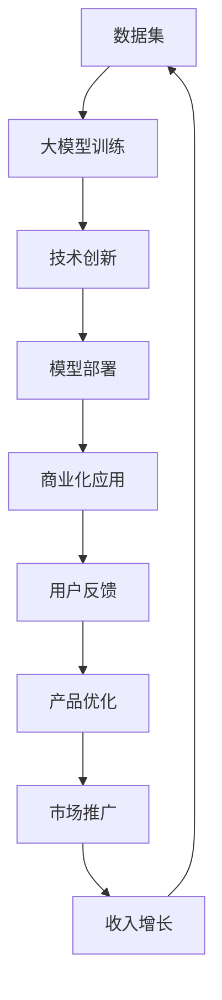

                 

# 大模型创业：技术创新与实践

> 关键词：
>
> - 大模型
> - 技术创新
> - 创业实践
> - 人工智能
> - 深度学习
> - 商业应用
> - 自然语言处理

## 1. 背景介绍

在人工智能领域，大模型（Large Models）已经成为了技术创新的热点，尤其是在深度学习和自然语言处理（NLP）方面。大模型通常是指具有亿级或数十亿级参数的神经网络，其应用广泛，涵盖了从语音识别到图像处理，从自动驾驶到金融分析等各个领域。然而，大模型的研究和应用不仅仅是技术问题，更是一个涉及商业模式、市场机会和用户需求的多维度创新过程。本文旨在探讨如何通过技术创新驱动大模型创业的成功实践。

### 1.1 问题由来

随着计算资源和算法的进步，大模型在多个领域展现了惊人的效果，成为推动AI技术发展的重要力量。但同时，大模型也面临一系列挑战，如数据隐私、计算资源消耗、伦理问题等，这些问题对于创业公司来说尤为关键。如何克服这些挑战，实现商业化应用，是大模型创业成功的关键。

### 1.2 问题核心关键点

大模型创业的核心在于技术创新与商业模式的有机结合。具体来说，包括：

- **技术优势**：大模型的算法和架构，以及其在特定领域的应用性能。
- **商业模式**：如何通过差异化的商业解决方案，满足用户需求，实现商业化。
- **市场机会**：识别并把握市场中的真实需求和痛点。
- **用户体验**：确保产品易于使用，且能够解决实际问题。
- **用户反馈**：快速迭代产品，根据用户反馈进行优化。

### 1.3 问题研究意义

大模型创业不仅能够推动AI技术的进步，还能带动相关产业的发展，提高社会生产力。通过技术创新，创业公司可以在竞争激烈的市场中脱颖而出，推动行业标准和技术进步。同时，大模型的商业化应用还能解决实际问题，提升用户体验。

## 2. 核心概念与联系

### 2.1 核心概念概述

大模型创业涉及到多个核心概念，包括但不限于：

- **大模型**：通常是指参数量极大的神经网络模型，如BERT、GPT等。
- **技术创新**：指通过算法改进、模型架构优化等手段，提升模型的性能和效率。
- **商业模式**：指将技术转化为可行的商业解决方案，满足市场需求。
- **创业实践**：指从产品研发到市场推广的全过程，包括用户需求分析、产品设计、市场策略等。

这些概念之间的联系可以概括为：技术创新是核心驱动力，商业模式是实现途径，创业实践是实施手段，最终目的是通过产品和服务解决用户问题。

### 2.2 概念间的关系

这些核心概念之间的关系可以通过以下Mermaid流程图来展示：


这个流程图展示了大模型创业的整个过程，即从技术创新到产品设计和推广，再到市场反馈和产品优化，最终形成良性循环。

### 2.3 核心概念的整体架构

最后，我们用一个综合的流程图来展示这些核心概念在大模型创业中的整体架构：



这个综合流程图展示了从数据集训练到市场推广的完整流程，通过技术创新不断优化模型和产品，最终实现收入增长，进入良性循环。

## 3. 核心算法原理 & 具体操作步骤

### 3.1 算法原理概述

大模型创业的核心算法原理可以概括为：通过深度学习算法，构建具有强大计算能力的大模型，并结合技术创新和商业实践，实现商业化应用。

### 3.2 算法步骤详解

大模型创业的技术步骤可以分为以下几个关键环节：

1. **数据集准备**：收集并清洗数据集，确保数据的质量和多样性。
2. **模型构建**：选择合适的模型架构，并进行超参数调优，训练大模型。
3. **技术创新**：应用最新的算法和技术，如迁移学习、正则化、参数高效微调等，提升模型性能。
4. **模型部署**：将训练好的模型部署到服务器或云平台上，实现高效推理。
5. **商业化应用**：根据市场需求，设计商业解决方案，并提供API接口，供客户使用。
6. **用户反馈收集**：通过用户反馈，不断迭代和优化模型和产品。
7. **市场推广**：通过市场推广活动，提高产品知名度，吸引更多用户。
8. **收入增长**：通过订阅、API调用、广告等多种方式，实现收入增长。

### 3.3 算法优缺点

大模型创业的算法优点包括：

- **高性能**：大模型的计算能力和深度学习算法能够处理复杂的任务。
- **可扩展性**：模型可以通过添加更多数据和计算资源进行扩展，提升性能。
- **泛化能力**：大模型在多个领域和任务上具有良好的泛化能力。

缺点包括：

- **计算资源消耗大**：训练和推理大模型需要大量的计算资源和存储资源。
- **数据隐私问题**：大规模数据集的收集和使用可能涉及隐私问题，需要严格的合规措施。
- **模型复杂度高**：大模型的设计和优化需要较高的技术门槛。

### 3.4 算法应用领域

大模型在多个领域都有广泛应用，包括：

- **自然语言处理**：如文本分类、情感分析、机器翻译等。
- **计算机视觉**：如图像识别、图像生成、视频分析等。
- **语音处理**：如语音识别、语音合成、情感分析等。
- **医疗健康**：如医学影像分析、疾病预测、健康监测等。
- **金融科技**：如风险评估、欺诈检测、股票预测等。
- **智能制造**：如预测维护、质量控制、自动化生产等。

## 4. 数学模型和公式 & 详细讲解 & 举例说明

### 4.1 数学模型构建

大模型创业的数学模型构建通常基于深度学习框架，如TensorFlow、PyTorch等。以自然语言处理为例，常用的模型包括BERT、GPT等。

### 4.2 公式推导过程

以BERT为例，其数学模型构建过程包括：

1. **编码器结构**：BERT采用Transformer结构，包含多个编码器层，每层包含多个自注意力机制。
2. **预训练任务**：BERT通过掩码语言模型和下一句预测等预训练任务，学习语言表示。
3. **微调过程**：在特定任务上，通过添加任务适配层和损失函数，微调BERT模型。

### 4.3 案例分析与讲解

以情感分析任务为例，其数学模型构建过程如下：

1. **数据集准备**：收集情感标注数据集，分为训练集、验证集和测试集。
2. **模型构建**：选择BERT作为预训练模型，并添加线性分类器作为任务适配层。
3. **损失函数设计**：使用交叉熵损失函数。
4. **微调过程**：在训练集上训练模型，并在验证集上进行超参数调优。
5. **模型评估**：在测试集上评估模型性能，并进行结果分析。

## 5. 项目实践：代码实例和详细解释说明

### 5.1 开发环境搭建

开发环境搭建包括：

- 安装Python和相关库，如TensorFlow、PyTorch等。
- 搭建服务器或云平台，如AWS、GCP等。
- 设置开发环境，如Jupyter Notebook等。

### 5.2 源代码详细实现

以下是一个简单的情感分析项目代码示例：

```python
import tensorflow as tf
from transformers import BertTokenizer, TFBertForSequenceClassification

# 数据集准备
tokenizer = BertTokenizer.from_pretrained('bert-base-cased')
train_dataset = ...
dev_dataset = ...
test_dataset = ...

# 模型构建
model = TFBertForSequenceClassification.from_pretrained('bert-base-cased', num_labels=2)

# 训练过程
model.compile(optimizer='adam', loss='binary_crossentropy', metrics=['accuracy'])
model.fit(train_dataset, epochs=3, validation_data=dev_dataset)

# 评估过程
model.evaluate(test_dataset)
```

### 5.3 代码解读与分析

- **数据集准备**：使用BertTokenizer加载预训练模型，并进行数据集预处理。
- **模型构建**：使用TFBertForSequenceClassification加载BERT模型，并进行任务适配。
- **训练过程**：使用TensorFlow进行模型训练，并设置优化器和损失函数。
- **评估过程**：使用评估函数评估模型性能，并进行结果分析。

### 5.4 运行结果展示

假设训练后模型在测试集上获得了85%的准确率，这表明模型在情感分析任务上具有较高的预测能力。

## 6. 实际应用场景

### 6.1 智能客服系统

智能客服系统是大模型创业的重要应用场景之一。通过大模型微调，可以实现自动回复、情感分析、用户意图识别等功能，提升客服效率和用户体验。

### 6.2 金融科技

金融科技是大模型创业的另一个重要应用领域。通过大模型微调，可以实现风险评估、欺诈检测、股票预测等功能，提升金融服务的智能化水平。

### 6.3 智能制造

智能制造是大模型创业在工业领域的典型应用。通过大模型微调，可以实现设备预测维护、质量控制、自动化生产等功能，提升生产效率和产品质量。

## 7. 工具和资源推荐

### 7.1 学习资源推荐

- **在线课程**：如Coursera、edX等平台上的深度学习课程。
- **书籍**：《深度学习》、《自然语言处理综论》等经典教材。
- **论文**：arXiv、Google Scholar等平台上的最新研究成果。

### 7.2 开发工具推荐

- **深度学习框架**：TensorFlow、PyTorch等。
- **大数据工具**：Hadoop、Spark等。
- **容器化平台**：Docker、Kubernetes等。

### 7.3 相关论文推荐

- **自然语言处理**：BERT、GPT等模型相关论文。
- **计算机视觉**：ResNet、Inception等模型相关论文。
- **金融科技**：风险评估、欺诈检测等相关论文。

## 8. 总结：未来发展趋势与挑战

### 8.1 研究成果总结

大模型创业在过去几年取得了显著进展，推动了AI技术的广泛应用。未来，技术创新和商业模式创新将是推动大模型创业成功的关键。

### 8.2 未来发展趋势

- **技术进步**：算法和架构的不断优化，将提升大模型的性能和效率。
- **商业模式的创新**：差异化的商业解决方案，满足特定市场需求。
- **市场扩展**：通过全球化扩展，提升产品竞争力。
- **技术普及**：降低技术门槛，促进技术应用。

### 8.3 面临的挑战

- **计算资源限制**：大规模数据集的收集和使用需要大量计算资源。
- **数据隐私问题**：大规模数据集的收集和使用可能涉及隐私问题。
- **模型复杂度高**：大模型的设计和优化需要较高的技术门槛。
- **市场竞争激烈**：市场竞争激烈，如何差异化突出自身优势。

### 8.4 研究展望

未来，大模型创业需要在技术创新和商业模式创新方面持续努力，推动AI技术的广泛应用。同时，关注市场变化和用户需求，不断优化产品和服务，以实现可持续发展。

## 9. 附录：常见问题与解答

**Q1: 如何评估大模型创业的商业化潜力？**

A: 评估大模型创业的商业化潜力需要考虑多个方面，包括市场规模、竞争格局、用户需求等。可以通过市场调研、用户访谈等方式进行评估。

**Q2: 大模型创业中的技术难点有哪些？**

A: 大模型创业中的技术难点包括：数据收集、模型训练、技术创新等。需要构建强大的技术团队，不断提升技术能力。

**Q3: 如何提高大模型的泛化能力？**

A: 提高大模型的泛化能力可以通过数据增强、正则化、迁移学习等方法实现。同时，选择合适的模型架构和优化算法也是关键。

**Q4: 大模型创业中的商业策略有哪些？**

A: 大模型创业中的商业策略包括：差异化定位、精准营销、合作战略等。需要结合市场需求和产品特性进行灵活调整。

**Q5: 大模型创业中的市场推广有哪些方式？**

A: 大模型创业中的市场推广方式包括：线上广告、合作伙伴、展会等。需要根据实际情况选择合适的推广方式。

---

作者：禅与计算机程序设计艺术 / Zen and the Art of Computer Programming

