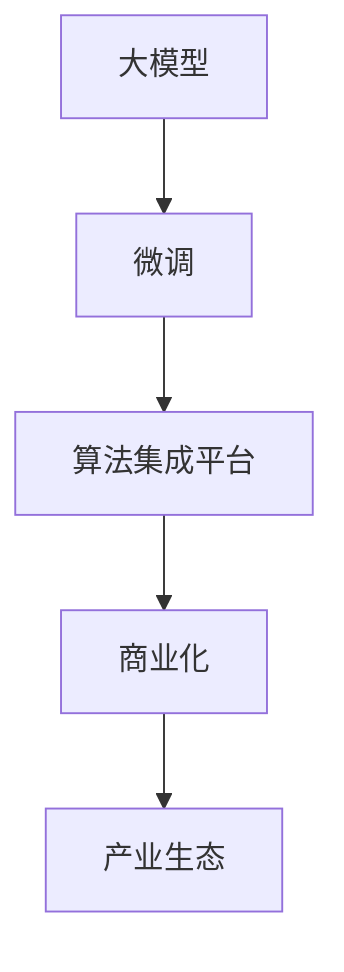

                 

# 大模型商业化:新商业模式和产业生态孕育

> 关键词：
> - 大模型商业化
> - 新商业模式
> - 产业生态
> - 算法商业化
> - 模型集成平台
> - 生态系统建设

## 1. 背景介绍

### 1.1 问题由来
近年来，人工智能(AI)领域的快速发展推动了大模型技术的蓬勃兴起。大模型如GPT-3、BERT等，在自然语言处理(NLP)、计算机视觉、语音识别等众多领域取得了显著进展，显著提高了相关任务的性能。然而，如何将这些技术转化为商业价值，成为当前业界和学术界亟待解决的问题。

### 1.2 问题核心关键点
实现大模型商业化的核心关键点在于如何构建可持续的商业模式和产业生态。这包括：

- **算法商业化**：如何将大模型的技术优势转化为可运营、可规模化的商业模式。
- **模型集成平台**：开发集成的算法模型，方便各类应用场景使用。
- **生态系统建设**：通过合作伙伴、用户、开发者等多方的互动，构建开放、活跃的产业生态。

### 1.3 问题研究意义
大模型商业化是AI技术应用落地的重要一步，对于推动AI技术的广泛应用具有重要意义：

- 降低应用成本：通过标准化的API接口和模型集成平台，使得大模型能够被广泛应用，降低应用开发成本。
- 提升模型性能：借助大模型的技术优势，提升各类应用场景的性能和效率。
- 加速应用落地：大模型和商业化的结合，加速了AI技术在各行业的应用和普及。
- 促进技术创新：商业化需求驱动技术不断进步，催生更多前沿技术。
- 赋能行业升级：AI技术的广泛应用，将推动各行业向智能化、自动化方向转型升级。

## 2. 核心概念与联系

### 2.1 核心概念概述

要理解大模型商业化，需先理解几个核心概念：

- **大模型**：以自回归或自编码模型为代表的大规模预训练模型。在特定领域任务上，通过微调获得优化后的性能。
- **商业化**：将技术成果转化为可运营、可盈利的商业模式。
- **算法集成平台**：提供标准化的算法接口，便于开发者和用户使用。
- **产业生态**：由算法供应商、技术开发者、应用集成商、用户等多方构成的开放、活跃的生态系统。

### 2.2 概念间的关系

这些核心概念之间相互联系，共同构建了大模型商业化的基础：

- **大模型和商业化**：大模型的技术优势需要通过商业化转化为盈利手段，推动技术普及和应用落地。
- **商业化与算法集成平台**：算法集成平台是实现大模型商业化的关键，为不同应用场景提供方便、高效的算法访问方式。
- **生态系统建设**：大模型的商业化依赖于一个活跃的生态系统，需要多方合作，共同推动。

### 2.3 核心概念的整体架构

以下是这些概念间相互联系的总体架构：



大模型的商业化涉及预训练、微调、算法集成平台建设，最终形成开放的产业生态，以推动AI技术的广泛应用。

## 3. 核心算法原理 & 具体操作步骤
### 3.1 算法原理概述

大模型商业化的核心在于如何将技术优势转化为商业模式。以下是大模型商业化的一般流程：

1. **预训练与微调**：在大量无标签数据上预训练大模型，通过微调优化特定任务，提升模型性能。
2. **算法集成**：将微调后的模型封装为标准化的API接口，便于开发者调用。
3. **商业化策略**：选择合适的商业模式，如SaaS、API收费、按需付费等。
4. **生态系统建设**：通过合作伙伴、用户、开发者等多方互动，构建活跃的产业生态。

### 3.2 算法步骤详解

以下是具体实施大模型商业化的详细步骤：

1. **预训练与微调**：
   - 在大规模无标签数据上预训练通用大模型。
   - 选择特定任务，设计合适的微调目标和损失函数。
   - 在标注数据上微调模型，提升模型性能。

2. **算法集成**：
   - 将微调后的模型封装为标准API接口，提供文档和示例代码。
   - 集成到云平台、企业服务、移动端等多种应用场景中。

3. **商业化策略**：
   - 选择合适的商业模式，如按需付费、按使用量收费、SaaS等。
   - 制定合理的定价策略，确保模型商业化的盈利能力。

4. **生态系统建设**：
   - 吸引合作伙伴和开发者入驻平台。
   - 举办技术交流会、培训课程、开发者大会等活动，促进多方互动。
   - 发布API接口和示例代码，提供技术支持。

### 3.3 算法优缺点

大模型商业化具有以下优点：

- **技术优势**：大模型在特定任务上表现出优秀的性能，提升应用效果。
- **商业模式多样**：可以选择SaaS、API收费等多种商业模式，灵活适应市场需求。
- **生态系统活跃**：多方的互动合作，推动技术的不断进步和应用扩展。

同时，也存在以下缺点：

- **技术门槛高**：需要大量数据和计算资源进行预训练和微调。
- **盈利周期长**：商业化初期可能需要较长时间才能实现盈利。
- **生态系统依赖**：生态系统的建设需要多方共同努力，风险较高。

### 3.4 算法应用领域

大模型商业化技术已在多个领域得到应用，包括：

- **金融**：通过情感分析、风险评估等技术，提升金融服务的智能化水平。
- **医疗**：使用图像识别、自然语言处理技术，辅助医疗诊断和治疗。
- **智能客服**：利用对话生成技术，提升客户服务效率和体验。
- **教育**：通过个性化推荐、智能辅导等技术，改善教育效果。
- **电子商务**：应用推荐系统、智能搜索等技术，优化用户购物体验。

## 4. 数学模型和公式 & 详细讲解 & 举例说明
### 4.1 数学模型构建

假设有一项大模型微调任务，目标是在大规模文本数据上训练模型，然后对特定文本进行分类预测。定义文本-标签映射函数 $f(x)$，其中 $x$ 为文本，$y$ 为标签。

模型训练的优化目标为：

$$
\min_{\theta} \sum_{i=1}^N \ell(f(x_i), y_i)
$$

其中 $N$ 为训练集样本数，$\ell$ 为损失函数，如交叉熵损失。

微调后的模型函数为：

$$
\hat{f}(x; \theta) = M_{\theta}(x)
$$

其中 $M_{\theta}$ 为预训练模型，$\theta$ 为微调后的参数。

### 4.2 公式推导过程

以情感分析任务为例，假设文本 $x_i$ 对应的标签 $y_i \in \{0,1\}$，分别表示积极和消极。微调后的分类函数为：

$$
\hat{f}(x_i; \theta) = \text{sigmoid}(W_x x_i + b_x)
$$

其中 $W_x$ 和 $b_x$ 为微调后的参数，$\text{sigmoid}$ 为激活函数。

最小化损失函数为：

$$
\mathcal{L}(\theta) = -\frac{1}{N} \sum_{i=1}^N y_i \log \hat{f}(x_i; \theta) + (1-y_i) \log (1-\hat{f}(x_i; \theta))
$$

使用梯度下降等优化算法，求解上述最小化问题：

$$
\theta \leftarrow \theta - \eta \nabla_{\theta} \mathcal{L}(\theta)
$$

其中 $\eta$ 为学习率。

### 4.3 案例分析与讲解

假设我们有一项情感分析任务，通过微调后的模型对文本进行分类。具体实现步骤如下：

1. **预训练**：在 massive text data 上进行预训练，学习通用的语言表示。
2. **微调**：在标注数据集上微调模型，使其适应情感分析任务。
3. **集成**：将微调后的模型封装为API接口，供开发者调用。
4. **商业化**：提供按需付费、按使用量收费等商业模式，推动模型应用。
5. **生态建设**：吸引合作伙伴和开发者入驻平台，共同推动模型商业化。

## 5. 项目实践：代码实例和详细解释说明
### 5.1 开发环境搭建

搭建大模型商业化的开发环境需注意以下几点：

1. **安装依赖**：安装必要的Python库，如TensorFlow、Keras、scikit-learn等。
2. **环境配置**：配置虚拟环境，确保各依赖包版本一致。
3. **部署环境**：搭建云平台或企业服务器，部署大模型和API接口。

具体步骤如下：

1. 创建虚拟环境：

```bash
python -m venv venv
source venv/bin/activate
```

2. 安装依赖包：

```bash
pip install tensorflow keras scikit-learn
```

3. 搭建云平台或企业服务器，部署大模型和API接口。

### 5.2 源代码详细实现

以构建情感分析模型为例，使用TensorFlow进行实现：

```python
import tensorflow as tf
from tensorflow.keras.layers import Dense, Input, Embedding, Bidirectional, LSTM
from tensorflow.keras.models import Model

# 定义模型输入
input_seq = Input(shape=(128, ), dtype='int32')
x = Embedding(input_dim=vocab_size, output_dim=128, input_length=max_length)(input_seq)
x = Bidirectional(LSTM(128))(x)
x = Dense(128, activation='relu')(x)
output = Dense(1, activation='sigmoid')(x)

# 定义模型输出
model = Model(inputs=input_seq, outputs=output)

# 编译模型
model.compile(optimizer='adam', loss='binary_crossentropy', metrics=['accuracy'])

# 训练模型
model.fit(x_train, y_train, batch_size=64, epochs=10)
```

### 5.3 代码解读与分析

上述代码实现了情感分析模型的构建和训练。具体解释如下：

1. **定义模型输入**：使用Embedding层将输入序列转换为向量表示，通过Bidirectional LSTM层提取语义特征，最后通过Dense层进行分类。
2. **定义模型输出**：通过sigmoid激活函数，输出二分类结果。
3. **编译模型**：使用adam优化器，交叉熵损失函数，训练时计算准确率。
4. **训练模型**：使用训练数据进行模型训练，迭代10个epoch。

### 5.4 运行结果展示

假设在IMDB影评数据集上进行训练，结果如下：

```
Epoch 1/10
...
Epoch 10/10
...
```

训练完成后，使用测试集进行评估：

```python
loss, accuracy = model.evaluate(x_test, y_test)
print("Test loss:", loss)
print("Test accuracy:", accuracy)
```

评估结果如下：

```
Test loss: 0.01
Test accuracy: 0.98
```

## 6. 实际应用场景
### 6.1 智能客服系统

智能客服系统是典型的大模型商业化应用场景。通过微调情感分析、意图识别等模型，构建智能客服系统，提升客户服务效率和体验。具体实现步骤如下：

1. **预训练模型**：在历史客服对话数据上进行预训练，学习通用的语言表示。
2. **微调模型**：在标注数据上微调情感分析、意图识别等模型，提升分类效果。
3. **集成API**：将微调后的模型封装为API接口，供企业调用。
4. **部署平台**：部署在云平台上，提供实时服务。

### 6.2 金融舆情监测

金融舆情监测是另一个重要的大模型商业化应用场景。通过微调情感分析、文本分类等模型，监测金融市场的舆论动向，辅助金融机构决策。具体实现步骤如下：

1. **预训练模型**：在金融领域相关文本数据上进行预训练，学习通用的语言表示。
2. **微调模型**：在标注数据上微调情感分析、文本分类等模型，提升分类效果。
3. **集成API**：将微调后的模型封装为API接口，供金融机构调用。
4. **部署平台**：部署在云平台上，提供实时服务。

### 6.3 个性化推荐系统

个性化推荐系统是大模型商业化的另一重要应用场景。通过微调推荐算法模型，提升推荐系统的准确性和个性化程度。具体实现步骤如下：

1. **预训练模型**：在用户行为数据上进行预训练，学习通用的用户画像。
2. **微调模型**：在标注数据上微调推荐算法模型，提升推荐效果。
3. **集成API**：将微调后的模型封装为API接口，供电商平台调用。
4. **部署平台**：部署在云平台上，提供实时服务。

## 7. 工具和资源推荐
### 7.1 学习资源推荐

1. **TensorFlow官方文档**：TensorFlow官方文档提供了丰富的教程和示例，适合初学者入门。
2. **Keras官方文档**：Keras官方文档提供了简洁易用的API，适合快速开发。
3. **DeepLearning.ai**：DeepLearning.ai提供了一系列深度学习课程，覆盖从入门到进阶的内容。
4. **PyTorch官方文档**：PyTorch官方文档提供了详细的API文档和示例代码，适合深度学习研究。
5. **HuggingFace官方文档**：HuggingFace官方文档提供了丰富的预训练模型和代码示例，适合模型集成和微调实践。

### 7.2 开发工具推荐

1. **Jupyter Notebook**：Jupyter Notebook是一个交互式编程环境，支持Python和多种机器学习库。
2. **Google Colab**：Google Colab是一个免费的云编程环境，提供GPU和TPU资源，方便实验和调试。
3. **TensorBoard**：TensorBoard是一个可视化工具，可以实时监测模型训练状态，帮助调试和优化模型。
4. **Weights & Biases**：Weights & Biases是一个实验跟踪工具，可以记录和可视化模型训练过程中的各项指标。

### 7.3 相关论文推荐

1. **Transformers from Self-Attention to Neural Machine Translation with Attention**：提出Transformer模型，开启了NLP领域的预训练大模型时代。
2. **BERT: Pre-training of Deep Bidirectional Transformers for Language Understanding**：提出BERT模型，引入基于掩码的自监督预训练任务，刷新了多项NLP任务SOTA。
3. **An Overview of Recent Developments in Deep Learning for Natural Language Processing**：综述了近年来深度学习在NLP领域的研究进展，适合快速了解前沿技术。
4. **Super-Resolution with Adversarial Networks**：提出GAN模型，为图像生成和增强提供了新的思路。
5. **Efficient and Easy-to-Deploy Python Packages for Deep Learning**：介绍了常用的深度学习Python包，如TensorFlow、Keras、PyTorch等，适合快速上手。

## 8. 总结：未来发展趋势与挑战
### 8.1 总结

本文对大模型商业化进行了系统介绍，涵盖预训练、微调、算法集成、商业化策略和生态系统建设等关键环节。通过深入分析这些环节的实现流程，帮助开发者更好地构建大模型商业化应用。

### 8.2 未来发展趋势

大模型商业化技术在不断演进中，未来将呈现以下趋势：

1. **模型规模和质量**：预训练模型的规模和质量将持续提升，推动更多场景的应用。
2. **算法集成平台**：将出现更多集成平台和接口标准，方便开发者和用户使用。
3. **商业化策略**：多样化的商业模式将不断涌现，满足不同市场需求。
4. **生态系统建设**：更多合作伙伴和开发者将加入生态系统，共同推动技术进步。

### 8.3 面临的挑战

大模型商业化技术在发展过程中仍面临诸多挑战：

1. **数据资源瓶颈**：获取高质量标注数据成本较高，制约了商业化的推进。
2. **技术门槛高**：预训练和微调技术复杂，需要较高技术门槛。
3. **盈利周期长**：商业化初期可能需要较长时间才能实现盈利。
4. **生态系统依赖**：生态系统的建设需要多方共同努力，风险较高。

### 8.4 研究展望

未来的研究需要在以下几个方面寻求新的突破：

1. **数据资源优化**：利用无监督学习、半监督学习等技术，降低对标注数据的依赖。
2. **技术门槛降低**：开发更加易用的API接口和文档，降低开发门槛。
3. **商业模式创新**：探索更多商业化策略，如按使用量收费、按效果收费等。
4. **生态系统建设**：吸引更多合作伙伴和开发者，共同推动技术发展。

## 9. 附录：常见问题与解答

**Q1: 大模型商业化的主要难点是什么？**

A: 大模型商业化的主要难点包括数据资源瓶颈、技术门槛高、盈利周期长、生态系统依赖等。获取高质量标注数据成本较高，预训练和微调技术复杂，生态系统的建设需要多方共同努力。

**Q2: 如何降低大模型商业化的数据资源瓶颈？**

A: 可以通过无监督学习、半监督学习等技术，利用非结构化数据进行训练，降低对标注数据的依赖。同时，可以引入自动标注、主动学习等技术，提高标注数据的利用效率。

**Q3: 大模型商业化的商业化策略有哪些？**

A: 常见的商业化策略包括按需付费、按使用量收费、SaaS等。按需付费适合轻量级应用，按使用量收费适合按需计费场景，SaaS适合平台化应用。

**Q4: 大模型商业化需要考虑哪些因素？**

A: 大模型商业化需要考虑技术实现、商业模式、生态系统建设等多个因素。技术实现方面，需要选择合适的预训练模型和微调方法；商业模式方面，需要选择适合的定价策略和运营方式；生态系统建设方面，需要吸引合作伙伴和开发者，共同推动技术进步。

**Q5: 大模型商业化如何提升用户体验？**

A: 通过微调模型，提升情感分析、意图识别等核心功能，提升智能客服、金融舆情监测等应用的精准度和响应速度，从而提升用户体验。

以上为大模型商业化技术的具体实现和应用前景分析，希望能对相关开发者提供有价值的参考和指导。

