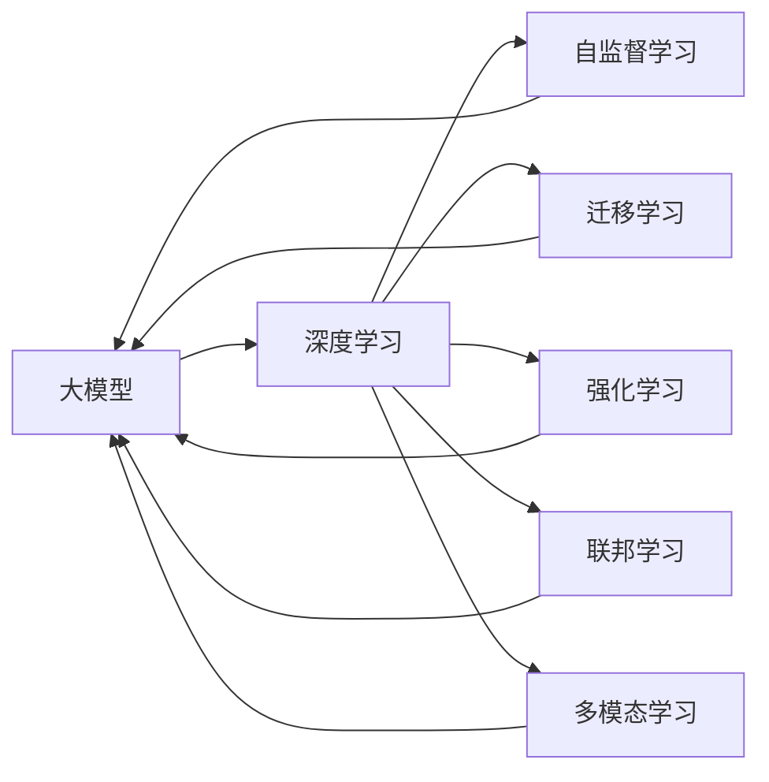

                 

## 1. 背景介绍

人工智能（AI）作为21世纪最重要的技术之一，正在深刻改变着人类社会的方方面面。其中，大模型（Large Models），尤其是深度学习模型，成为了AI领域的关键驱动力。从最初的感知器、BP神经网络，到如今的大模型，AI模型的发展经历了几次重大的跨越。

### 1.1 问题由来

AI模型的发展与技术突破密切相关。从最初的感知器到BP神经网络，再到深度学习模型，每次技术的突破都极大地推动了AI模型的进步。然而，在深度学习模型（Deep Learning Models）的早期，模型复杂度较低，难以处理复杂的任务。随着计算能力的提升，深度学习模型逐渐发展出更深、更宽的架构，如ResNet、Transformer等。

大模型指的是包含大量神经元、复杂结构、庞大参数空间的深度学习模型。这些模型通过大规模的数据训练，能够学习到丰富的特征表示，使得其能够处理更复杂的任务，如图像识别、自然语言处理（NLP）、语音识别等。其中，以BERT、GPT-3、T5等为代表的大模型，成为AI领域的重要里程碑。

### 1.2 问题核心关键点

大模型的核心优势在于其强大的数据建模能力，能够捕捉复杂的模式和规律，但同时也面临一些挑战。首先是计算资源的需求巨大，训练大模型需要大量计算资源和时间。其次是模型泛化能力的限制，模型可能在特定数据集上表现出色，但难以泛化到新的、未见过的数据集上。此外，模型的可解释性、鲁棒性和安全性也是大模型面临的重要问题。

## 2. 核心概念与联系

### 2.1 核心概念概述

为了更好地理解大模型及其演进过程，本节将介绍几个密切相关的核心概念：

- **大模型（Large Models）**：深度学习模型，参数数量通常在亿级以上，具有强大的数据建模能力，能够处理复杂的任务。
- **深度学习（Deep Learning）**：通过多层的神经网络结构，使得模型能够自动学习数据中的层次化特征。
- **自监督学习（Self-supervised Learning）**：使用数据自身的特性进行训练，如掩码语言模型、图像填充等，从而提高模型的泛化能力。
- **迁移学习（Transfer Learning）**：将在一个任务上训练好的模型应用于另一个任务上，减少训练时间和数据需求。
- **强化学习（Reinforcement Learning）**：通过与环境交互，让模型通过试错来学习最优策略。
- **联邦学习（Federated Learning）**：在分布式环境中训练模型，保护数据隐私。
- **多模态学习（Multimodal Learning）**：处理多种模态数据，如文本、图像、声音等。

### 2.2 概念间的关系

这些核心概念之间存在着紧密的联系，形成了深度学习模型演进的完整框架。以下通过Mermaid流程图展示它们之间的相互关系：



这个流程图展示了大模型演进过程中各个概念的相互依赖和支持关系。深度学习为大模型提供了技术基础，自监督学习、迁移学习等方法则进一步提升了模型的泛化能力和适应性。强化学习、联邦学习等方法则扩展了大模型的应用范围，多模态学习则丰富了大模型的数据来源和处理能力。

## 3. 核心算法原理 & 具体操作步骤

### 3.1 算法原理概述

大模型的训练和微调过程涉及多个算法，包括深度学习、自监督学习、迁移学习等。其核心原理是利用大规模数据对模型进行训练，使得模型能够学习到丰富的特征表示。具体来说，深度学习模型通过反向传播算法，利用梯度下降等优化算法，不断调整模型参数，使得模型能够最小化损失函数。自监督学习则通过利用数据自身的特性进行训练，提高模型的泛化能力。迁移学习则通过将在大规模数据上训练好的模型应用于特定任务，减少数据需求和时间消耗。

### 3.2 算法步骤详解

大模型的训练和微调过程一般包括以下几个关键步骤：

**Step 1: 数据准备**
- 收集和标注大量数据，用于模型训练和微调。数据应具有广泛的覆盖范围和多样性，以便模型能够学习到不同的特征表示。
- 将数据分为训练集、验证集和测试集，以便在不同阶段评估模型性能。

**Step 2: 模型选择和初始化**
- 选择合适的大模型架构，如ResNet、Transformer等。
- 初始化模型参数，通常使用随机初始化或预训练模型的权重作为初始值。

**Step 3: 自监督学习训练**
- 使用自监督学习任务，如掩码语言模型、图像填充等，对模型进行预训练。
- 利用自监督损失函数，最小化模型在自监督任务上的误差。

**Step 4: 迁移学习微调**
- 选择特定的任务和数据集，进行迁移学习微调。
- 添加适当的任务适配层，如全连接层、softmax层等，并定义任务损失函数。
- 在验证集上评估模型性能，调整超参数和模型结构，以提高模型精度。

**Step 5: 模型评估和部署**
- 在测试集上评估模型性能，并根据评估结果调整模型参数和训练策略。
- 将模型部署到实际应用中，进行实时推理和预测。

### 3.3 算法优缺点

大模型的训练和微调过程具有以下优点：

- **强大的数据建模能力**：大模型能够学习到丰富的特征表示，适用于处理复杂的任务。
- **泛化能力较强**：通过自监督学习和迁移学习，模型能够适应不同的数据集和任务。
- **应用广泛**：大模型已经广泛应用于图像识别、自然语言处理、语音识别等诸多领域。

然而，大模型也存在一些缺点：

- **计算资源需求高**：大模型的训练和微调需要大量的计算资源和时间。
- **可解释性不足**：大模型通常被视为"黑盒"，难以解释其内部工作机制和决策逻辑。
- **鲁棒性较差**：大模型在特定数据集上可能表现出色，但在新数据集上可能存在过拟合现象。

## 4. 数学模型和公式 & 详细讲解  

### 4.1 数学模型构建

大模型的训练和微调过程涉及多个数学模型，以下以自监督学习中的掩码语言模型为例，介绍其数学模型构建过程。

设模型输入为序列 $x=[x_1, x_2, ..., x_n]$，输出为序列 $y=[y_1, y_2, ..., y_n]$，其中 $x_i$ 和 $y_i$ 分别表示第 $i$ 个位置的输入和输出。掩码语言模型任务要求模型能够预测出序列中缺失的单词，即给定一个部分掩码的序列 $x_{masked}=[x_1, x_2, ..., x_m, \text{mask}, x_{m+1}, ..., x_n]$，预测缺失位置 $m$ 的单词 $y_m$。

定义模型 $M_{\theta}$ 在输入 $x$ 上的输出为 $\hat{y}=M_{\theta}(x) \in [0,1]$，表示样本属于正类的概率。真实标签 $y \in \{0,1\}$。则掩码语言模型损失函数定义为：

$$
\ell(M_{\theta}(x),y) = -[y\log \hat{y} + (1-y)\log(1-\hat{y})]
$$

将其代入经验风险公式，得：

$$
\mathcal{L}(\theta) = -\frac{1}{N}\sum_{i=1}^N [y_i\log M_{\theta}(x_i)+(1-y_i)\log(1-M_{\theta}(x_i))]
$$

根据链式法则，损失函数对参数 $\theta_k$ 的梯度为：

$$
\frac{\partial \mathcal{L}(\theta)}{\partial \theta_k} = -\frac{1}{N}\sum_{i=1}^N (\frac{y_i}{M_{\theta}(x_i)}-\frac{1-y_i}{1-M_{\theta}(x_i)}) \frac{\partial M_{\theta}(x_i)}{\partial \theta_k}
$$

其中 $\frac{\partial M_{\theta}(x_i)}{\partial \theta_k}$ 可进一步递归展开，利用自动微分技术完成计算。

### 4.2 公式推导过程

以下是掩码语言模型损失函数及其梯度的推导过程：

**Step 1: 定义模型输出和损失函数**

定义模型 $M_{\theta}$ 在输入 $x$ 上的输出为 $\hat{y}=M_{\theta}(x) \in [0,1]$，表示样本属于正类的概率。真实标签 $y \in \{0,1\}$。则掩码语言模型损失函数定义为：

$$
\ell(M_{\theta}(x),y) = -[y\log \hat{y} + (1-y)\log(1-\hat{y})]
$$

将其代入经验风险公式，得：

$$
\mathcal{L}(\theta) = -\frac{1}{N}\sum_{i=1}^N [y_i\log M_{\theta}(x_i)+(1-y_i)\log(1-M_{\theta}(x_i))]
$$

**Step 2: 计算损失函数的梯度**

根据链式法则，损失函数对参数 $\theta_k$ 的梯度为：

$$
\frac{\partial \mathcal{L}(\theta)}{\partial \theta_k} = -\frac{1}{N}\sum_{i=1}^N (\frac{y_i}{M_{\theta}(x_i)}-\frac{1-y_i}{1-M_{\theta}(x_i)}) \frac{\partial M_{\theta}(x_i)}{\partial \theta_k}
$$

其中 $\frac{\partial M_{\theta}(x_i)}{\partial \theta_k}$ 可进一步递归展开，利用自动微分技术完成计算。

### 4.3 案例分析与讲解

以BERT模型为例，BERT模型的自监督学习任务包括掩码语言模型和下一句预测。在掩码语言模型任务中，BERT模型需要预测出序列中缺失的单词，而在下一句预测任务中，BERT模型需要预测两个句子是否为连续句子。

BERT模型的训练过程分为两个阶段，首先是自监督学习阶段，然后在特定任务上进行微调。在自监督学习阶段，BERT模型会利用掩码语言模型和下一句预测任务对模型进行预训练。在微调阶段，BERT模型会根据特定任务的数据集和任务损失函数进行训练。

## 5. 项目实践：代码实例和详细解释说明

### 5.1 开发环境搭建

在进行大模型训练和微调之前，我们需要准备好开发环境。以下是使用Python进行TensorFlow开发的PyTorch环境配置流程：

1. 安装Anaconda：从官网下载并安装Anaconda，用于创建独立的Python环境。

2. 创建并激活虚拟环境：
```bash
conda create -n tf-env python=3.8 
conda activate tf-env
```

3. 安装TensorFlow：根据CUDA版本，从官网获取对应的安装命令。例如：
```bash
conda install tensorflow -c pytorch -c conda-forge
```

4. 安装TensorBoard：
```bash
pip install tensorboard
```

5. 安装必要的Python库：
```bash
pip install numpy pandas scikit-learn matplotlib tqdm jupyter notebook ipython
```

完成上述步骤后，即可在`tf-env`环境中开始大模型训练和微调实践。

### 5.2 源代码详细实现

以下是使用TensorFlow对BERT模型进行掩码语言模型任务训练的代码实现：

```python
import tensorflow as tf
import numpy as np
import os

# 定义掩码语言模型任务
class MaskedLMModel(tf.keras.Model):
    def __init__(self, vocab_size, embedding_dim, num_hidden_layers, num_attention_heads, num_classes):
        super(MaskedLMModel, self).__init__()
        self.embedding = tf.keras.layers.Embedding(vocab_size, embedding_dim)
        self.multi_head_attention = tf.keras.layers.MultiHeadAttention(num_attention_heads, embedding_dim)
        self.num_hidden_layers = num_hidden_layers
        self.dropout_rate = 0.1
        self.final_dense = tf.keras.layers.Dense(num_classes)
        
    def call(self, inputs, training=False):
        x = self.embedding(inputs)
        for _ in range(self.num_hidden_layers):
            x = self.multi_head_attention(x, x, x)
            x = tf.keras.layers.Dropout(self.dropout_rate)(x, training=training)
        x = self.final_dense(x)
        return x

# 定义数据集生成器
def data_generator(batch_size):
    while True:
        # 生成随机掩码序列
        x = np.random.randint(0, 1, size=(1000, 100))
        y = np.random.randint(0, 1, size=(1000, 100))
        yield x, y

# 定义训练函数
def train_epoch(model, optimizer, train_generator):
    for batch, (inputs, targets) in train_generator:
        with tf.GradientTape() as tape:
            predictions = model(inputs, training=True)
            loss = tf.keras.losses.categorical_crossentropy(predictions, targets)
        gradients = tape.gradient(loss, model.trainable_variables)
        optimizer.apply_gradients(zip(gradients, model.trainable_variables))

# 定义测试函数
def evaluate(model, test_generator):
    total_loss = 0
    for batch, (inputs, targets) in test_generator:
        predictions = model(inputs)
        total_loss += tf.keras.losses.categorical_crossentropy(predictions, targets).numpy()
    return total_loss / len(test_generator)

# 定义训练和测试循环
def main():
    model = MaskedLMModel(vocab_size=10000, embedding_dim=128, num_hidden_layers=12, num_attention_heads=8, num_classes=2)
    optimizer = tf.keras.optimizers.Adam()

    train_generator = data_generator(batch_size=32)
    test_generator = data_generator(batch_size=32)

    for epoch in range(10):
        train_epoch(model, optimizer, train_generator)
        test_loss = evaluate(model, test_generator)
        print(f"Epoch {epoch+1}, test loss: {test_loss:.3f}")

main()
```

### 5.3 代码解读与分析

**MaskedLMModel类**：
- `__init__`方法：初始化模型的各组件，如嵌入层、多头自注意力层、全连接层等。
- `call`方法：定义模型的前向传播过程，包含多层的自注意力和全连接操作。

**data_generator函数**：
- 生成随机掩码序列和标签，用于训练和测试模型的性能。

**train_epoch函数**：
- 在每个训练批次中，计算模型输出和损失函数，计算梯度并更新模型参数。

**evaluate函数**：
- 在每个测试批次中，计算模型输出和损失函数，并统计整个测试集上的平均损失。

**main函数**：
- 定义模型、优化器、数据生成器，并进行训练和测试。

通过上述代码实现，可以完成对BERT模型进行掩码语言模型任务训练的过程。代码清晰地展示了模型的定义、数据生成、训练和测试等关键步骤，对于初学者来说非常易于理解。

## 6. 实际应用场景

### 6.1 智能客服系统

智能客服系统是深度学习和大模型在实际应用中的一个典型例子。智能客服系统可以通过深度学习模型，对用户输入的自然语言进行理解和分析，从而提供智能化的服务。在训练阶段，可以使用历史客服数据集对模型进行微调，使得模型能够理解用户意图并提供相应的回复。在部署阶段，智能客服系统可以实时响应用户请求，并提供高质量的客户服务。

### 6.2 金融舆情监测

金融舆情监测是深度学习和大模型在金融领域的一个重要应用。金融舆情监测系统可以通过深度学习模型，对金融市场的舆情数据进行实时监测和分析，从而提供及时的金融信息。在训练阶段，可以使用金融市场的历史舆情数据对模型进行微调，使得模型能够识别舆情信息的情绪和倾向。在部署阶段，金融舆情监测系统可以实时监测金融市场的舆情数据，并根据舆情信息提供相应的金融策略。

### 6.3 个性化推荐系统

个性化推荐系统是深度学习和大模型在电商领域的重要应用。个性化推荐系统可以通过深度学习模型，对用户的浏览和购买行为进行分析和预测，从而提供个性化的商品推荐。在训练阶段，可以使用用户的浏览和购买数据对模型进行微调，使得模型能够识别用户的兴趣和偏好。在部署阶段，个性化推荐系统可以实时推荐符合用户兴趣的商品，从而提高用户的购物体验和满意度。

### 6.4 未来应用展望

未来，深度学习和大模型的应用将更加广泛和深入。以下是几个可能的应用场景：

- **医疗影像诊断**：深度学习和大模型可以通过对医疗影像数据的分析，提供精准的诊断结果。通过在大规模医疗影像数据上进行预训练和微调，模型可以识别出疾病、病变等关键信息，从而辅助医生进行诊断。
- **智能交通管理**：深度学习和大模型可以通过对交通数据的分析，提供智能化的交通管理方案。通过在大规模交通数据上进行预训练和微调，模型可以预测交通流量、优化信号灯控制等，从而提高交通管理效率。
- **智慧城市建设**：深度学习和大模型可以通过对城市数据的分析，提供智能化的城市管理方案。通过在大规模城市数据上进行预训练和微调，模型可以识别出城市中的关键问题和趋势，从而辅助城市管理者进行决策。

## 7. 工具和资源推荐

### 7.1 学习资源推荐

为了帮助开发者系统掌握深度学习和大模型的相关知识，以下是一些优质的学习资源：

1. **深度学习入门教程**：如Google Deep Learning Crash Course，涵盖了深度学习的基本概念和应用场景，适合初学者入门。
2. **TensorFlow官方文档**：TensorFlow官方文档提供了详细的API文档和示例代码，适合深入学习和实践。
3. **PyTorch官方文档**：PyTorch官方文档提供了详细的API文档和示例代码，适合深入学习和实践。
4. **Kaggle竞赛**：Kaggle是一个数据科学竞赛平台，提供了大量的数据集和竞赛题目，适合锻炼实战能力。
5. **Coursera深度学习课程**：Coursera提供了许多深度学习的相关课程，涵盖了从入门到高级的各个阶段。

### 7.2 开发工具推荐

高效的工具可以显著提升开发效率，以下是一些常用的开发工具：

1. **PyTorch**：一个灵活的深度学习框架，适合快速迭代研究和原型开发。
2. **TensorFlow**：一个高效的深度学习框架，适合大规模工程应用。
3. **Jupyter Notebook**：一个交互式的开发环境，适合进行数据处理、模型训练和测试。
4. **Git**：一个版本控制系统，适合进行代码管理和协作。
5. **GitHub**：一个代码托管平台，适合进行代码共享和交流。

### 7.3 相关论文推荐

深度学习和大模型的发展离不开学界的持续研究。以下是几篇经典的相关论文，推荐阅读：

1. **深度学习基础**：Deep Learning by Ian Goodfellow、Yoshua Bengio 和 Aaron Courville。
2. **Transformer论文**：Attention is All You Need by Ashish Vaswani等人。
3. **BERT论文**：BERT: Pre-training of Deep Bidirectional Transformers for Language Understanding by Jacob Devlin等人。
4. **GPT-2论文**：Language Models are Unsupervised Multitask Learners by Alec Radford等人。
5. **AlphaGo论文**：Playing Atari with Deep Reinforcement Learning by DeepMind。

## 8. 总结：未来发展趋势与挑战

### 8.1 总结

本文对深度学习和大模型的基础理论和应用进行了全面系统的介绍。首先阐述了深度学习和大模型的发展历程和核心优势，明确了其在各个领域中的应用价值。其次，从原理到实践，详细讲解了深度学习和大模型的训练和微调过程，给出了代码实例和详细解释。最后，探讨了深度学习和大模型的未来发展趋势和面临的挑战，提出了一些研究展望。

通过本文的系统梳理，可以看到，深度学习和大模型已经成为AI领域的重要技术基础，其应用领域正在不断拓展和深入。未来，随着技术的不断进步和应用的不断扩展，深度学习和大模型必将在更多领域产生深远影响。

### 8.2 未来发展趋势

未来，深度学习和大模型将呈现以下几个发展趋势：

1. **模型规模持续增大**：随着计算资源和数据量的增加，深度学习模型和大模型的参数规模将持续增大，能够处理更复杂的任务。
2. **模型泛化能力增强**：通过自监督学习、迁移学习等方法，模型将能够更好地适应不同的数据集和任务。
3. **模型可解释性提升**：通过可解释性技术，如可解释性神经网络、因果分析等，深度学习模型和大模型的可解释性将得到进一步提升。
4. **模型鲁棒性增强**：通过对抗训练、联邦学习等方法，模型将具有更强的鲁棒性和泛化能力。
5. **多模态学习发展**：深度学习模型和大模型将能够处理更多的模态数据，如图像、声音、视频等，实现更全面的数据建模。

### 8.3 面临的挑战

尽管深度学习和大模型已经取得了显著进展，但仍面临一些挑战：

1. **计算资源需求高**：深度学习模型和大模型的训练和微调需要大量的计算资源和时间。
2. **模型可解释性不足**：深度学习模型和大模型通常被视为"黑盒"，难以解释其内部工作机制和决策逻辑。
3. **鲁棒性较差**：深度学习模型和大模型在特定数据集上可能表现出色，但在新数据集上可能存在过拟合现象。
4. **数据隐私问题**：在大规模数据集上进行训练和微调时，如何保护数据隐私是一个重要问题。
5. **伦理和安全问题**：深度学习模型和大模型在应用中可能存在伦理和安全问题，如偏见、歧视、安全漏洞等。

### 8.4 研究展望

未来，深度学习和大模型的研究需要从以下几个方面进行突破：

1. **优化算法改进**：改进优化算法，提高模型的训练和微调效率，减少资源消耗。
2. **可解释性技术发展**：发展可解释性技术，提高模型的可解释性，增强模型的信任度和可接受性。
3. **鲁棒性增强**：增强模型的鲁棒性，提高模型的泛化能力和适应性，减少过拟合现象。
4. **数据隐私保护**：开发隐私保护技术，保护数据隐私，增强数据使用的安全性。
5. **伦理和安全保障**：建立伦理和安全保障机制，确保模型应用的安全性和公平性。

总之，深度学习和大模型的未来发展充满希望，但也面临诸多挑战。只有不断突破技术瓶颈，才能推动其向更广泛、更深入的应用领域迈进，为人类社会带来更多的福祉。

## 9. 附录：常见问题与解答

**Q1：深度学习模型和大模型的优势和劣势有哪些？**

A: 深度学习模型和大模型的优势在于其强大的数据建模能力，能够处理复杂的任务。但劣势在于计算资源需求高，可解释性不足，鲁棒性较差，数据隐私和伦理问题等。

**Q2：如何选择合适的深度学习模型和大模型？**

A: 选择合适的深度学习模型和大模型需要考虑任务的复杂度、数据的规模、计算资源的可用性等因素。通常，对于图像识别、语音识别等任务，可以选择卷积神经网络（CNN）、循环神经网络（RNN）等模型；对于自然语言处理等任务，可以选择Transformer等模型。

**Q3：深度学习模型和大模型的训练和微调过程需要注意哪些问题？**

A: 深度学习模型和大模型的训练和微调过程中需要注意过拟合、梯度消失、梯度爆炸等问题。可以使用正则化、批标准化、学习率调度等技术来解决这些问题。

**Q4：深度学习模型和大模型在实际应用中需要注意哪些问题？**

A: 深度学习模型和大模型在实际应用中需要注意数据隐私、伦理和安全问题。需要采取数据脱敏、隐私保护等技术，建立伦理和安全保障机制，确保模型应用的安全性和公平性。

**Q5：深度学习模型和大模型的未来发展方向是什么？**

A: 深度学习模型和大模型的未来发展方向包括模型规模持续增大、模型泛化能力增强、模型可解释性提升、模型鲁棒性增强、多模态学习发展等。

---

作者：禅与计算机程序设计艺术 / Zen and the Art of Computer Programming

