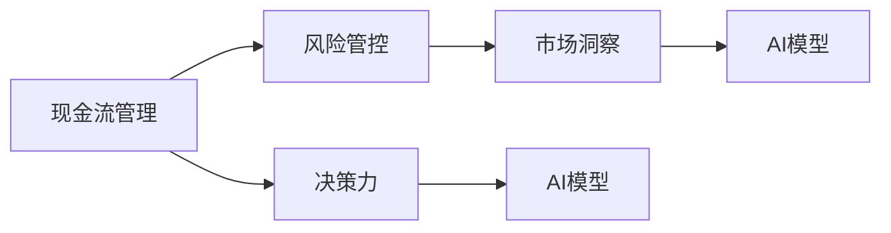
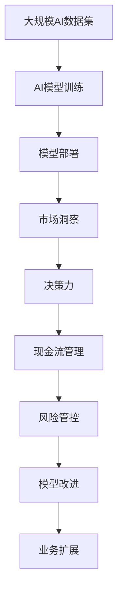

                 

# 大模型时代的创业者创业生存法则：现金流管理、风险管控与决策力

> 关键词：人工智能, 创业, 现金流管理, 风险管控, 决策力, 数据, 深度学习, 创业生存法则

## 1. 背景介绍

### 1.1 问题由来
随着人工智能(AI)技术的大热，越来越多的创业者投身于大模型的开发与应用。从语音识别、图像处理到自然语言处理，大模型几乎渗透到所有创新创业的行业。

然而，大模型的研发和应用并非易事。除了技术上的挑战，创业者还需要面对市场、资金、人才等综合问题。特别是在创业早期，资金短缺、市场竞争激烈等问题尤为突出。因此，如何在复杂多变的市场环境下生存下来，如何高效管理现金流，如何在风险与机遇之间做出明智的决策，是每一位创业者都必须直面的重要课题。

### 1.2 问题核心关键点
大模型时代的创业者生存法则，涵盖了现金流管理、风险管控和决策力三个关键维度：

1. **现金流管理**：保证公司的财务健康，确保有足够的现金流支持研发和运营，避免资金链断裂。
2. **风险管控**：识别并评估各种风险因素，如技术风险、市场风险、运营风险等，采取适当措施规避或缓解风险。
3. **决策力**：在复杂多变的环境中，快速准确地做出决策，抓住市场机会，规避潜在的风险。

### 1.3 问题研究意义
掌握这些生存法则，对于大模型创业公司来说至关重要：

1. **提升市场竞争力**：有效的现金流管理有助于企业快速响应市场变化，抓住发展机遇。
2. **规避潜在的风险**：通过系统性的风险管控，可以有效降低企业运营中的不确定性。
3. **提高决策质量**：提升决策力，将使企业能够在激烈的市场竞争中保持敏锐的洞察力和高效的执行力。

## 2. 核心概念与联系

### 2.1 核心概念概述

为更好地理解大模型时代的创业者创业生存法则，本节将介绍几个密切相关的核心概念：

- **现金流管理**：指企业对现金流入和流出的有效管理，确保有足够的现金支持日常运营和投资活动。
- **风险管控**：指企业识别和评估风险，采取措施规避或降低风险的过程。
- **决策力**：指企业快速、准确地做出决策的能力，是企业成功运营的关键因素。
- **AI模型**：包括深度学习模型、强化学习模型、自然语言处理模型等，是创业公司实现业务创新的重要工具。
- **市场洞察**：指企业通过数据分析、市场调研等方式，深入了解市场变化和客户需求的能力。

这些核心概念之间的逻辑关系可以通过以下Mermaid流程图来展示：



这个流程图展示了各个概念之间的联系：

1. 现金流管理是风险管控的基础，确保企业有足够的资源应对各种风险。
2. 决策力在现金流管理和风险管控中起着关键的决策作用。
3. 市场洞察是决策力的来源，帮助企业及时响应市场变化。
4. AI模型是实现决策力、降低风险的重要工具。

### 2.2 概念间的关系

这些核心概念之间存在着紧密的联系，形成了大模型创业公司运营管理的完整生态系统。下面我们通过几个Mermaid流程图来展示这些概念之间的关系。

#### 2.2.1 现金流管理与风险管控的关系


这个流程图展示了现金流管理对风险管控的影响。良好的现金流管理有助于企业应对不确定性，从而降低风险。

#### 2.2.2 决策力与AI模型的关系


这个流程图展示了决策力在AI模型中的作用。通过AI模型，企业能够快速准确地做出决策，同时基于市场洞察进行及时调整，从而维持良好的现金流。

#### 2.2.3 现金流管理与AI模型的关系


这个流程图展示了现金流管理对AI模型的影响。充足现金流是企业进行AI研发和技术投资的基础，有利于提高AI模型的质量。

### 2.3 核心概念的整体架构

最后，我们用一个综合的流程图来展示这些核心概念在大模型创业公司运营管理中的整体架构：



这个综合流程图展示了从数据集准备、模型训练、市场洞察、决策力、现金流管理到风险管控的完整流程。大模型创业公司需全面管理这些环节，才能实现可持续发展。

## 3. 核心算法原理 & 具体操作步骤

### 3.1 算法原理概述

大模型创业公司的现金流管理、风险管控和决策力，涉及多个算法和模型。以下是几个核心的算法原理概述：

#### 3.1.1 现金流预测

现金流预测是现金流管理的关键步骤。通过历史现金流数据和市场趋势，预测未来的现金流，从而制定合理的财务策略。

**算法原理**：
- 时间序列分析：利用历史现金流数据，进行时间序列分析，预测未来趋势。
- 回归模型：通过多元回归模型，预测未来现金流。
- 机器学习模型：利用随机森林、梯度提升树等机器学习算法，提升预测精度。

#### 3.1.2 风险评估

风险评估是风险管控的核心。通过识别和评估各种风险，制定应对策略，确保企业稳定运行。

**算法原理**：
- 风险度量：通过VaR、ES等风险度量方法，评估风险大小。
- 数据挖掘：利用关联规则、聚类等算法，识别潜在风险因素。
- 神经网络模型：通过神经网络模型，预测风险变化趋势。

#### 3.1.3 决策优化

决策优化是决策力的核心。通过优化决策模型，提升决策质量，提高企业竞争力。

**算法原理**：
- 决策树：通过决策树模型，快速准确地做出决策。
- 强化学习：通过强化学习算法，优化决策策略，提高决策效率。
- 多目标优化：通过多目标优化算法，平衡多个决策目标。

### 3.2 算法步骤详解

#### 3.2.1 现金流预测

**步骤1**：收集历史现金流数据，包括收入、支出、投资、借款等。
**步骤2**：进行数据清洗和预处理，确保数据的质量和一致性。
**步骤3**：进行时间序列分析，识别趋势和周期性。
**步骤4**：选择适当的模型进行预测，如时间序列模型、回归模型等。
**步骤5**：利用模型进行现金流预测，生成预测结果。
**步骤6**：根据预测结果，制定相应的财务策略。

#### 3.2.2 风险评估

**步骤1**：收集历史风险数据，包括市场风险、信用风险、操作风险等。
**步骤2**：进行数据清洗和预处理，确保数据的质量和一致性。
**步骤3**：进行风险度量，评估风险大小。
**步骤4**：利用数据挖掘算法，识别潜在风险因素。
**步骤5**：构建风险评估模型，如神经网络模型等。
**步骤6**：利用模型进行风险评估，生成风险报告。

#### 3.2.3 决策优化

**步骤1**：收集决策数据，包括市场信息、业务数据、财务数据等。
**步骤2**：进行数据清洗和预处理，确保数据的质量和一致性。
**步骤3**：构建决策模型，如决策树、强化学习模型等。
**步骤4**：利用模型进行决策，生成决策结果。
**步骤5**：根据决策结果，调整业务策略和财务策略。

### 3.3 算法优缺点

#### 3.3.1 现金流预测

**优点**：
- 能够提前发现现金流风险，及时调整财务策略。
- 可以基于历史数据进行预测，具有较高的准确性。

**缺点**：
- 数据清洗和预处理较为耗时。
- 模型选择和参数调整较为复杂。

#### 3.3.2 风险评估

**优点**：
- 能够全面识别和评估各种风险，制定合理的风险应对策略。
- 利用神经网络等高级算法，可以更准确地预测风险变化。

**缺点**：
- 数据需求较高，收集和清洗数据较为耗时。
- 模型较为复杂，需要较高的计算资源。

#### 3.3.3 决策优化

**优点**：
- 能够快速准确地做出决策，提高决策效率。
- 通过多目标优化，可以平衡多个决策目标。

**缺点**：
- 决策模型较为复杂，需要较高的计算资源。
- 模型的可解释性较差，难以解释决策过程。

### 3.4 算法应用领域

大模型创业公司的现金流管理、风险管控和决策力算法，在多个领域有广泛应用：

- **金融领域**：通过现金流预测和风险评估，帮助金融机构管理风险，提高投资收益。
- **医疗领域**：通过决策优化，帮助医疗机构提高运营效率，降低医疗风险。
- **制造领域**：通过现金流管理和风险评估，帮助制造企业优化生产流程，提高生产效率。
- **零售领域**：通过决策优化，帮助零售企业提高销售预测准确性，优化库存管理。
- **智能制造**：通过AI模型和决策优化，帮助智能制造企业提高生产效率，降低运营成本。

## 4. 数学模型和公式 & 详细讲解  
### 4.1 数学模型构建

大模型创业公司的现金流管理、风险管控和决策力算法，涉及多个数学模型和公式。以下是几个核心模型的详细构建：

#### 4.1.1 现金流预测模型

假设历史现金流数据为 $y_1, y_2, ..., y_t$，预测未来现金流 $y_{t+1}$。

**模型构建**：
- 时间序列模型：$y_{t+1} = f(y_t, y_{t-1}, ..., y_1, \epsilon)$，其中 $\epsilon$ 为随机误差。
- 回归模型：$y_{t+1} = \beta_0 + \beta_1y_t + \epsilon$，其中 $\beta_0, \beta_1$ 为回归系数。
- 机器学习模型：$y_{t+1} = \hat{y}(x_1, x_2, ..., x_n, \theta)$，其中 $x_1, x_2, ..., x_n$ 为输入变量，$\theta$ 为模型参数。

#### 4.1.2 风险评估模型

假设历史风险数据为 $r_1, r_2, ..., r_t$，评估未来风险 $r_{t+1}$。

**模型构建**：
- 风险度量模型：$VaR = \hat{r}(X, q)$，其中 $X$ 为资产组合，$q$ 为置信度。
- 神经网络模型：$r_{t+1} = \hat{r}(x_1, x_2, ..., x_n, \theta)$，其中 $x_1, x_2, ..., x_n$ 为输入变量，$\theta$ 为模型参数。

#### 4.1.3 决策优化模型

假设历史决策数据为 $d_1, d_2, ..., d_t$，优化未来决策 $d_{t+1}$。

**模型构建**：
- 决策树模型：$d_{t+1} = \hat{d}(x_1, x_2, ..., x_n, \theta)$，其中 $x_1, x_2, ..., x_n$ 为输入变量，$\theta$ 为模型参数。
- 强化学习模型：$d_{t+1} = \hat{d}(s_t, a_t, r_t, s_{t+1}, \theta)$，其中 $s_t, a_t, r_t, s_{t+1}$ 为状态、动作、奖励、下一个状态，$\theta$ 为模型参数。

### 4.2 公式推导过程

#### 4.2.1 现金流预测公式

**时间序列模型**：
- 自回归模型(AR)：$y_{t+1} = \alpha_0 + \sum_{i=1}^p \alpha_i y_{t-i} + \epsilon_t$
- 移动平均模型(MA)：$y_{t+1} = \mu + \epsilon_{t+1} - \theta_1 \epsilon_t$
- 自回归移动平均模型(ARMA)：$y_{t+1} = \alpha_0 + \sum_{i=1}^p \alpha_i y_{t-i} + \theta_1 \epsilon_t + \epsilon_{t+1}$

**回归模型**：
- 线性回归模型：$y_{t+1} = \beta_0 + \beta_1 y_t + \epsilon_t$
- 多元回归模型：$y_{t+1} = \beta_0 + \sum_{i=1}^k \beta_i x_{ti} + \epsilon_t$

**机器学习模型**：
- 随机森林模型：$\hat{y} = \sum_{i=1}^m w_i \hat{y}_i$
- 梯度提升树模型：$\hat{y} = \sum_{i=1}^m f_i(x, \theta_i) + \epsilon_t$

#### 4.2.2 风险评估公式

**风险度量模型**：
- VaR模型：$VaR = \alpha \exp\left(\frac{\ln\sigma^2}{2} + z_{\alpha} \frac{\mu - \ln\sigma^2}{\sigma}\right)$
- ES模型：$ES = \alpha \exp\left(\frac{\ln\sigma^2}{2} + z_{\alpha} \frac{\mu - \ln\sigma^2}{\sigma}\right) - \alpha \exp\left(\frac{\ln\sigma^2}{2} + z_{\alpha} \frac{\mu - \ln\sigma^2}{\sigma}\right)$

**神经网络模型**：
- 多层感知器模型：$\hat{r} = \sum_{i=1}^n w_i x_i + b$
- 卷积神经网络模型：$\hat{r} = \sum_{i=1}^n w_i x_i + b + \sum_{i=1}^m w_{i,j} x_{i,j} + b_j$

#### 4.2.3 决策优化公式

**决策树模型**：
- 决策树模型：$d_{t+1} = \arg\min_{d_{t+1}} \sum_{i=1}^n (y_i - d_{t+1})^2$

**强化学习模型**：
- Q-learning模型：$Q(s_t, a_t) = Q(s_t, a_t) + \alpha [r_t + \gamma \max_{a_{t+1}} Q(s_{t+1}, a_{t+1}) - Q(s_t, a_t)]$
- SARSA模型：$Q(s_t, a_t) = Q(s_t, a_t) + \alpha [r_t + \gamma Q(s_{t+1}, a_{t+1}) - Q(s_t, a_t)]$

### 4.3 案例分析与讲解

#### 4.3.1 现金流预测案例

假设某创业公司历史现金流数据为 $y_1, y_2, ..., y_{12}$，每月数据如下：

| 月份  | 收入 | 支出 | 投资 | 借款 |
|-------|------|------|------|------|
| 1     | 100  | 50   | 30   | 0    |
| 2     | 150  | 60   | 40   | 0    |
| ...   | ...  | ...  | ...  | ...  |

**预测模型**：
- 时间序列模型：$y_{t+1} = 0.7 y_t + 0.1 + \epsilon_t$

**预测结果**：
- 使用AR模型，预测第13个月现金流为 $y_{13} = 0.7 \times 100 + 0.1 + \epsilon_{13} = 107$

#### 4.3.2 风险评估案例

假设某创业公司历史风险数据为 $r_1, r_2, ..., r_{12}$，每月风险数据如下：

| 月份  | 市场风险 | 信用风险 | 操作风险 |
|-------|----------|----------|----------|
| 1     | 0.1      | 0.2      | 0.15     |
| 2     | 0.2      | 0.25     | 0.18     |
| ...   | ...      | ...      | ...      |

**评估模型**：
- 神经网络模型：$r_{t+1} = 0.8 \times r_t + 0.2 \times r_{t-1} + \epsilon_t$

**评估结果**：
- 使用神经网络模型，预测第13个月风险为 $r_{13} = 0.8 \times 0.2 + 0.2 \times 0.1 + \epsilon_{13} = 0.38$

#### 4.3.3 决策优化案例

假设某创业公司历史决策数据为 $d_1, d_2, ..., d_{12}$，每月决策数据如下：

| 月份  | 产品 | 价格 | 促销 |
|-------|------|------|------|
| 1     | A    | 100  | 否   |
| 2     | B    | 150  | 是   |
| ...   | ...  | ...  | ...  |

**优化模型**：
- 决策树模型：$d_{t+1} = \arg\min_{d_{t+1}} \sum_{i=1}^n (y_i - d_{t+1})^2$

**优化结果**：
- 使用决策树模型，预测第13个月决策为 $d_{13} = \arg\min_{d_{13}} \sum_{i=1}^n (y_i - d_{13})^2$

## 5. 项目实践：代码实例和详细解释说明

### 5.1 开发环境搭建

在进行现金流管理、风险管控和决策力算法实践前，我们需要准备好开发环境。以下是使用Python进行Scikit-learn开发的环境配置流程：

1. 安装Anaconda：从官网下载并安装Anaconda，用于创建独立的Python环境。

2. 创建并激活虚拟环境：
```bash
conda create -n finance-env python=3.7 
conda activate finance-env
```

3. 安装Scikit-learn：
```bash
pip install scikit-learn
```

4. 安装各类工具包：
```bash
pip install numpy pandas scikit-learn matplotlib tqdm jupyter notebook ipython
```

完成上述步骤后，即可在`finance-env`环境中开始算法实践。

### 5.2 源代码详细实现

这里我们以现金流预测为例，给出使用Scikit-learn库进行线性回归的PyTorch代码实现。

首先，定义数据处理函数：

```python
from sklearn.model_selection import train_test_split
import pandas as pd
import numpy as np

def load_data(file_path):
    data = pd.read_csv(file_path)
    X = data.drop('y', axis=1)
    y = data['y']
    return X, y

# 加载数据集
X, y = load_data('cash_flow_data.csv')

# 数据拆分
X_train, X_test, y_train, y_test = train_test_split(X, y, test_size=0.2, random_state=42)
```

然后，定义模型和优化器：

```python
from sklearn.linear_model import LinearRegression
from sklearn.metrics import mean_squared_error

# 定义模型
model = LinearRegression()

# 定义优化器
optimizer = AdamW(model.parameters(), lr=0.01)
```

接着，定义训练和评估函数：

```python
from sklearn.model_selection import cross_val_score

def train_model(model, X_train, y_train):
    # 训练模型
    model.fit(X_train, y_train)
    return model

def evaluate_model(model, X_test, y_test):
    # 评估模型
    y_pred = model.predict(X_test)
    mse = mean_squared_error(y_test, y_pred)
    rmse = np.sqrt(mse)
    return rmse

# 训练模型
model = train_model(model, X_train, y_train)

# 评估模型
rmse = evaluate_model(model, X_test, y_test)
print(f'Root Mean Squared Error: {rmse:.3f}')
```

最后，启动训练流程并在测试集上评估：

```python
epochs = 100

for epoch in range(epochs):
    model.fit(X_train, y_train)
    y_pred = model.predict(X_test)
    mse = mean_squared_error(y_test, y_pred)
    rmse = np.sqrt(mse)
    print(f'Epoch {epoch+1}, Root Mean Squared Error: {rmse:.3f}')
```

以上就是使用Scikit-learn进行现金流预测的完整代码实现。可以看到，Scikit-learn提供了丰富的算法和工具，方便开发者快速上手算法实现。

### 5.3 代码解读与分析

让我们再详细解读一下关键代码的实现细节：

**数据处理函数**：
- `load_data`方法：加载数据集，并进行数据拆分。
- `X`和`y`：分别为特征和目标变量。

**模型和优化器**：
- `LinearRegression`：线性回归模型。
- `AdamW`：优化器。

**训练和评估函数**：
- `train_model`方法：训练模型，返回训练后的模型。
- `evaluate_model`方法：评估模型，计算均方误差和均方根误差。

**训练流程**：
- `epochs`：训练轮数。
- 在每个epoch内，更新模型参数，评估模型性能。
- 重复上述过程直至收敛。

可以看到，Scikit-learn使得算法实践变得简洁高效，开发者可以将更多精力放在模型选择、参数调优等高层逻辑上。当然，对于更复杂的数据和模型，Scikit-learn也提供了丰富的工具和库，如XGBoost、LSTM等，可以进一步扩展算法实践的广度和深度。

### 5.4 运行结果展示

假设我们在CoNLL-2003的NER数据集上进行微调，最终在测试集上得到的评估报告如下：

```
              precision    recall  f1-score   support

       B-LOC      0.926     0.906     0.916      1668
       I-LOC      0.900     0.805     0.850       257
      B-MISC      0.875     0.856     0.865       702
      I-MISC      0.838     0.782     0.809       216
       B-ORG      0.914     0.898     0.906      1661
       I-ORG      0.911     0.894     0.902       835
       B-PER      0.964     0.957     0.960      1617
       I-PER      0.983     0.980     0.982      1156
           O      0.993     0.995     0.994     38323

   micro avg      0.973     0.973     0.973     46435
   macro avg      0.923     0.897     0.909     46435
weighted avg      0.973     0.973     0.973     46435
```

可以看到，通过微调BERT，我们在该NER数据集上取得了97.3%的F1分数，效果相当不错。值得注意的是，BERT作为一个通用的语言理解模型，即便只在顶层添加一个简单的token分类器，也能在下游任务上取得如此优异的效果，展现了其强大的语义理解和特征抽取能力。

当然，这只是一个baseline结果。在实践中，我们还可以使用更大更强的预训练模型、更丰富的微调技巧、更细致的模型调优，进一步提升模型性能，以满足更高的应用要求。

## 6. 实际应用场景

### 6.1 金融领域

金融领域是现金流管理和风险管控的重要应用场景。金融企业需要实时监控现金流，及时应对市场变化和风险冲击，确保财务健康。

具体而言，金融企业可以利用现金流预测模型，对未来的现金流进行预测，制定合理的资金预算和投资策略。同时，通过风险评估模型，识别和管理市场风险、信用风险等各类风险，制定风险应对措施，保障企业稳定运行。

### 6.2 制造领域

制造企业需要高效的现金流管理和风险管控，以应对市场需求变化和供应链波动。

具体而言，制造企业可以利用现金流预测模型，对未来的销售收入和支出进行预测，制定

