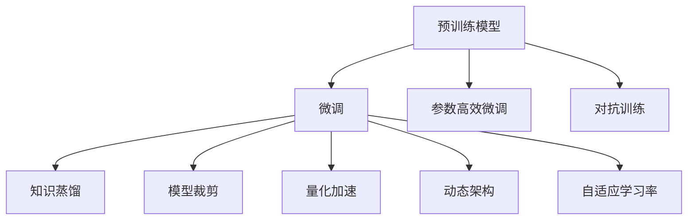
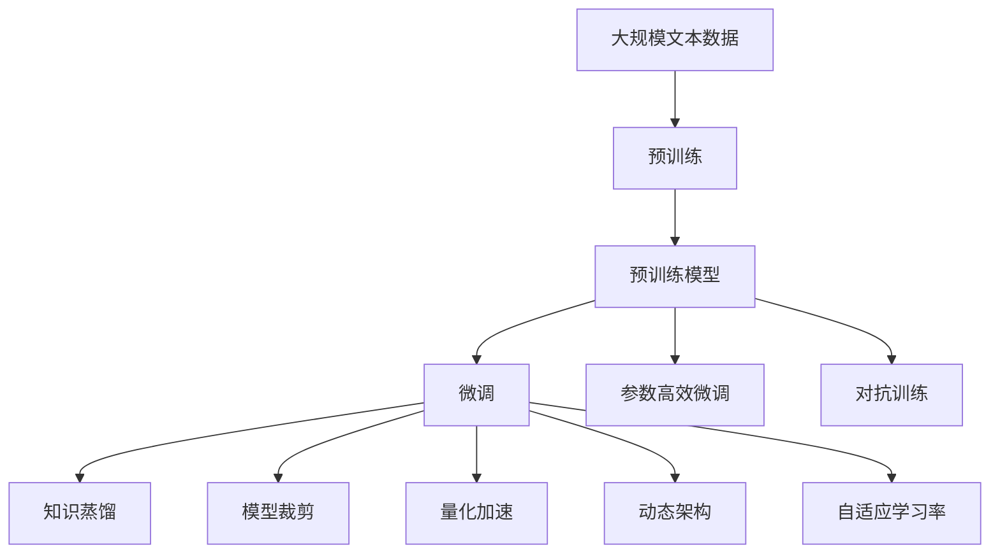

                 

# 大模型的技术演进与市场前景

## 1. 背景介绍

### 1.1 问题由来

近年来，人工智能技术迅速发展，特别在大规模预训练模型（Large Pre-trained Models, LPMs）方面取得了突破性的进展。LPMs 通过在大规模无标注数据上自监督预训练，学习到丰富的语言知识和表达能力，再通过微调（Fine-tuning）进行任务特定优化，展现出强大的适应能力。

大模型技术的应用范围广泛，涵盖了自然语言处理（NLP）、计算机视觉、语音识别等多个领域。例如，OpenAI 的 GPT-3 在机器翻译、问答系统、文本生成等方面都取得了令人瞩目的成绩。这些成就不仅证明了 LPMs 的潜力，也激发了业界对更大、更强模型的追求。

然而，大规模模型也带来了新的挑战：算力需求巨大，数据隐私和安全问题，以及模型的可解释性和公平性等。因此，如何更好地利用和优化大模型，成为当前研究的热点。

### 1.2 问题核心关键点

大模型技术演进的核心关键点包括：
- 如何设计高效的模型架构。大模型参数量庞大，如何优化训练和推理过程，降低计算成本，是当前研究的重要方向。
- 如何提升模型的泛化能力。大模型虽然在预训练和微调后表现优异，但在新场景下的适应能力仍有待提升。
- 如何处理数据隐私和安全问题。大模型需要处理大量敏感数据，如何确保数据安全和隐私保护，是实际应用中的重要课题。
- 如何提高模型的可解释性。大模型作为“黑盒”，其决策过程难以理解，如何增强模型的可解释性，提高可信度，是重要的研究方向。
- 如何增强模型的公平性和鲁棒性。大模型可能存在数据偏差和偏见，如何构建公平的模型，以及如何提高模型的鲁棒性，是应用中需要考虑的重要因素。

### 1.3 问题研究意义

研究大模型技术的演进和市场前景，对于推动人工智能技术的普及和应用具有重要意义：
- 提升模型性能。大模型通过预训练和微调，能够显著提升在各种任务上的性能，推动NLP、计算机视觉等领域的技术进步。
- 降低开发成本。大模型技术可以大幅降低应用开发的复杂度和成本，使得更多中小企业和开发者能够利用先进技术。
- 促进跨领域创新。大模型技术的应用，能够促进跨领域知识的融合和创新，推动更多领域的技术突破。
- 加速产业化进程。大模型技术的应用，能够加快人工智能技术在各个行业中的落地和产业化进程。
- 提升社会福祉。大模型技术在医疗、教育、金融等领域的广泛应用，能够提升社会的福祉和效率，为人类创造更多价值。

## 2. 核心概念与联系

### 2.1 核心概念概述

大模型技术的关键概念包括：
- 预训练模型（Pre-training Model）：在大规模无标注数据上自监督预训练，学习到通用的语言表示，具有强大的泛化能力。
- 微调（Fine-tuning）：在预训练模型的基础上，使用下游任务的少量标注数据进行有监督优化，提高模型在特定任务上的性能。
- 参数高效微调（Parameter-Efficient Fine-tuning, PEFT）：只更新模型中的少量参数，保留大部分预训练权重，以提高微调效率和减少过拟合风险。
- 对抗训练（Adversarial Training）：通过引入对抗样本，提高模型的鲁棒性和泛化能力。
- 知识蒸馏（Knowledge Distillation）：通过教师模型向学生模型传递知识，提高小模型的性能。
- 模型裁剪（Model Pruning）：去除模型中的冗余参数，减小模型规模，提高推理速度和效率。
- 量化加速（Quantization）：将浮点模型转换为定点模型，降低内存和计算需求，提高计算效率。
- 动态架构（Dynamic Architecture）：在模型训练和推理过程中，动态调整模型结构和参数，以适应不同的任务和数据。
- 自适应学习率（Adaptive Learning Rate）：根据模型的状态和数据的特性，动态调整学习率，提高训练效果。

这些概念之间存在着紧密的联系，形成了大模型技术的核心生态系统。通过理解这些核心概念，我们可以更好地把握大模型技术的原理和优化方向。

### 2.2 概念间的关系

这些核心概念之间的关系可以通过以下 Mermaid 流程图来展示：



这个流程图展示了预训练模型、微调、参数高效微调等核心概念之间的关系。预训练模型通过微调可以适应特定任务，通过参数高效微调、对抗训练等方法可以提升模型性能，通过知识蒸馏、模型裁剪、量化加速等技术可以优化模型结构，提高推理效率和公平性，通过动态架构和自适应学习率可以更好地适应不同任务和数据。

### 2.3 核心概念的整体架构

最后，我们用一个综合的流程图来展示这些核心概念在大模型技术中的整体架构：



这个综合流程图展示了从预训练到微调，再到参数高效微调、对抗训练、知识蒸馏等优化技术的过程。预训练模型通过在大规模数据上学习到通用的语言表示，微调通过有监督数据进行任务特定优化，参数高效微调、对抗训练等技术可以进一步提升模型性能和泛化能力，而知识蒸馏、模型裁剪、量化加速等技术可以优化模型结构，提高推理效率和公平性，动态架构和自适应学习率可以更好地适应不同任务和数据。

## 3. 核心算法原理 & 具体操作步骤

### 3.1 算法原理概述

大模型技术的核心算法原理包括预训练、微调和参数高效微调等。以下是对这些核心算法的详细解释：

- 预训练：在大规模无标注数据上自监督预训练，学习到通用的语言表示。常见的预训练任务包括 masked language modeling（MLM）、next sentence prediction（NSP）等。
- 微调：在预训练模型的基础上，使用下游任务的少量标注数据进行有监督优化，提高模型在特定任务上的性能。微调过程通常使用交叉熵等损失函数，通过反向传播更新模型参数。
- 参数高效微调：只更新模型中的少量参数，保留大部分预训练权重，以提高微调效率和减少过拟合风险。常用的方法包括适配器（Adapter）、LoRA、BitFit等。

### 3.2 算法步骤详解

以下是大模型技术的主要算法步骤详解：

1. 数据准备：收集和标注下游任务的数据集，划分为训练集、验证集和测试集。
2. 模型选择：选择合适的预训练模型，如BERT、GPT等。
3. 参数初始化：将预训练模型的参数作为初始化参数，进行微调。
4. 模型训练：使用微调数据集对模型进行训练，最小化损失函数，更新模型参数。
5. 模型评估：在验证集上评估模型性能，调整超参数和训练策略。
6. 参数裁剪：在微调结束后，对模型进行参数裁剪，去除冗余参数，减小模型规模。
7. 量化加速：将浮点模型转换为定点模型，降低内存和计算需求，提高推理效率。

### 3.3 算法优缺点

大模型技术的优点包括：
- 强大的泛化能力：通过预训练和微调，模型能够适应各种任务，具有广泛的应用前景。
- 高效的优化策略：通过参数高效微调、对抗训练等技术，提高模型性能和泛化能力。
- 灵活的架构设计：通过动态架构和自适应学习率等技术，提高模型适应性和鲁棒性。

缺点包括：
- 高计算需求：大规模模型的训练和推理需要大量的计算资源。
- 数据隐私和安全问题：大规模模型需要处理大量敏感数据，如何保护数据隐私和安全是重要课题。
- 模型的可解释性：大模型作为“黑盒”，其决策过程难以理解，需要提高模型的可解释性。
- 公平性问题：大模型可能存在数据偏差和偏见，需要构建公平的模型。
- 鲁棒性问题：大模型在对抗样本上的性能不稳定，需要提高模型的鲁棒性。

### 3.4 算法应用领域

大模型技术在多个领域中得到了广泛应用：
- 自然语言处理：包括文本分类、情感分析、机器翻译、问答系统等。
- 计算机视觉：包括图像分类、目标检测、图像生成等。
- 语音识别：包括语音转文字、语音合成、语音情感分析等。
- 医疗健康：包括医学图像分析、患者问答、智能诊断等。
- 金融领域：包括金融风险预测、智能客服、欺诈检测等。
- 工业制造：包括智能制造、工业质量检测、设备维护等。
- 教育领域：包括智能教育、学习辅助、知识图谱等。

这些领域的应用展示了大模型技术的强大潜力和广泛前景。

## 4. 数学模型和公式 & 详细讲解

### 4.1 数学模型构建

在大模型技术中，我们通常使用Transformer架构进行预训练和微调。Transformer架构使用自注意力机制，能够高效地处理长序列数据，适用于大规模语言模型。

预训练模型 $M_{\theta}$ 的参数 $\theta$ 通过自监督任务进行优化。例如，使用masked language modeling（MLM）任务进行预训练，目标函数为：

$$
\min_{\theta} \mathbb{E}_{(x, y)} [L(M_{\theta}(x), y)]
$$

其中 $x$ 为输入序列，$y$ 为掩码掩码预测标签，$L$ 为交叉熵损失函数。

微调过程的目标是最小化任务特定的损失函数 $L_{task}$。例如，对于二分类任务，目标函数为：

$$
\min_{\theta} \mathbb{E}_{(x, y)} [L_{task}(M_{\theta}(x), y)]
$$

其中 $L_{task}$ 为交叉熵损失函数。

### 4.2 公式推导过程

以下是BERT模型微调的二分类任务目标函数的推导过程：

1. 输入序列 $x$ 经过BERT模型得到输出 $M_{\theta}(x)$。
2. 对输出 $M_{\theta}(x)$ 进行softmax操作，得到每个类别的概率分布 $\hat{y}$。
3. 计算损失函数 $L_{task}$ 为交叉熵损失，目标是最小化该损失函数：

$$
L_{task}(y, \hat{y}) = -\frac{1}{N} \sum_{i=1}^N [y_i \log \hat{y}_i + (1-y_i) \log (1-\hat{y}_i)]
$$

其中 $y$ 为真实标签，$\hat{y}$ 为模型预测的概率分布，$N$ 为样本数量。

通过反向传播算法，计算梯度并更新模型参数 $\theta$，实现微调过程。

### 4.3 案例分析与讲解

以BERT模型为例，其在二分类任务上的微调过程如下：

1. 准备训练数据集，将数据集分为训练集、验证集和测试集。
2. 使用BERT模型进行微调，目标函数为交叉熵损失。
3. 设置学习率、批大小等超参数。
4. 在训练集上进行梯度下降优化，最小化交叉熵损失。
5. 在验证集上评估模型性能，调整学习率、批大小等超参数。
6. 在测试集上评估模型性能，得到最终结果。

## 5. 项目实践：代码实例和详细解释说明

### 5.1 开发环境搭建

在进行大模型技术实践前，需要先准备好开发环境。以下是使用Python进行PyTorch开发的环境配置流程：

1. 安装Anaconda：从官网下载并安装Anaconda，用于创建独立的Python环境。
2. 创建并激活虚拟环境：
```bash
conda create -n pytorch-env python=3.8 
conda activate pytorch-env
```
3. 安装PyTorch：根据CUDA版本，从官网获取对应的安装命令。例如：
```bash
conda install pytorch torchvision torchaudio cudatoolkit=11.1 -c pytorch -c conda-forge
```
4. 安装Transformers库：
```bash
pip install transformers
```
5. 安装各类工具包：
```bash
pip install numpy pandas scikit-learn matplotlib tqdm jupyter notebook ipython
```

完成上述步骤后，即可在`pytorch-env`环境中开始大模型技术实践。

### 5.2 源代码详细实现

下面我们以BERT模型在二分类任务上的微调为例，给出使用Transformers库的PyTorch代码实现。

```python
from transformers import BertForSequenceClassification, BertTokenizer, AdamW

# 初始化模型和分词器
model = BertForSequenceClassification.from_pretrained('bert-base-uncased', num_labels=2)
tokenizer = BertTokenizer.from_pretrained('bert-base-uncased')

# 定义训练数据集
train_dataset = ...
val_dataset = ...
test_dataset = ...

# 定义训练参数
optimizer = AdamW(model.parameters(), lr=2e-5)
epochs = 5
batch_size = 16

# 训练模型
for epoch in range(epochs):
    model.train()
    for batch in train_dataset:
        inputs = tokenizer(batch['input'], padding='max_length', truncation=True, max_length=512, return_tensors='pt')
        labels = batch['label']
        outputs = model(**inputs)
        loss = outputs.loss
        optimizer.zero_grad()
        loss.backward()
        optimizer.step()

    model.eval()
    for batch in val_dataset:
        inputs = tokenizer(batch['input'], padding='max_length', truncation=True, max_length=512, return_tensors='pt')
        labels = batch['label']
        outputs = model(**inputs)
        loss = outputs.loss
        print(f'Epoch {epoch+1}, val loss: {loss.item()}')

# 评估模型
model.eval()
with torch.no_grad():
    for batch in test_dataset:
        inputs = tokenizer(batch['input'], padding='max_length', truncation=True, max_length=512, return_tensors='pt')
        labels = batch['label']
        outputs = model(**inputs)
        loss = outputs.loss
        print(f'Test loss: {loss.item()}')
```

### 5.3 代码解读与分析

这里我们详细解读一下关键代码的实现细节：

1. `BertForSequenceClassification` 和 `BertTokenizer`：使用预训练的BERT模型和分词器。
2. `train_dataset`、`val_dataset` 和 `test_dataset`：准备训练数据集，将数据集分为训练集、验证集和测试集。
3. `AdamW` 优化器：设置学习率、批大小等超参数。
4. 训练模型：在训练集上进行梯度下降优化，最小化交叉熵损失。
5. 评估模型：在验证集上评估模型性能，调整学习率、批大小等超参数。
6. 测试模型：在测试集上评估模型性能，得到最终结果。

通过这个代码实例，可以看出大模型技术在二分类任务上的微调过程。

## 6. 实际应用场景

### 6.1 智能客服系统

智能客服系统是大模型技术的重要应用之一。通过微调BERT模型，智能客服系统可以提供7x24小时不间断服务，快速响应客户咨询，用自然流畅的语言解答各类常见问题。

### 6.2 金融舆情监测

金融舆情监测是另一个典型应用场景。通过微调BERT模型，系统可以实时监测市场舆论动向，及时应对负面信息传播，规避金融风险。

### 6.3 个性化推荐系统

个性化推荐系统是大模型技术的另一个重要应用。通过微调模型，推荐系统可以更好地挖掘用户兴趣偏好，提供更精准、多样的推荐内容。

### 6.4 未来应用展望

未来，大模型技术将进一步拓展应用领域，提升应用效果，实现更广泛的落地。具体包括：

1. 医疗健康：通过微调模型，实现智能诊断、患者问答等功能，提升医疗服务的智能化水平。
2. 智能教育：通过微调模型，实现智能教育、学习辅助等功能，促进教育公平和教育质量提升。
3. 智慧城市：通过微调模型，实现智能交通、智慧安防等功能，提升城市管理的自动化和智能化水平。
4. 工业制造：通过微调模型，实现智能制造、设备维护等功能，推动制造业的数字化转型。
5. 金融领域：通过微调模型，实现智能客服、欺诈检测等功能，提升金融服务的安全性和效率。
6. 农业领域：通过微调模型，实现智能农事、气象预测等功能，提升农业生产的智能化水平。

总之，大模型技术在各领域的应用前景广阔，将为社会带来巨大的价值。

## 7. 工具和资源推荐

### 7.1 学习资源推荐

为了帮助开发者系统掌握大模型技术的原理和实践技巧，这里推荐一些优质的学习资源：

1. 《Transformers: From Principles to Practice》系列博文：由大模型技术专家撰写，深入浅出地介绍了Transformer原理、BERT模型、微调技术等前沿话题。
2. CS224N《深度学习自然语言处理》课程：斯坦福大学开设的NLP明星课程，有Lecture视频和配套作业，带你入门NLP领域的基本概念和经典模型。
3. 《Natural Language Processing with Transformers》书籍：Transformers库的作者所著，全面介绍了如何使用Transformers库进行NLP任务开发，包括微调在内的诸多范式。
4. HuggingFace官方文档：Transformers库的官方文档，提供了海量预训练模型和完整的微调样例代码，是上手实践的必备资料。
5. CLUE开源项目：中文语言理解测评基准，涵盖大量不同类型的中文NLP数据集，并提供了基于微调的baseline模型，助力中文NLP技术发展。

通过对这些资源的学习实践，相信你一定能够快速掌握大模型技术的精髓，并用于解决实际的NLP问题。

### 7.2 开发工具推荐

高效的开发离不开优秀的工具支持。以下是几款用于大模型技术开发常用的工具：

1. PyTorch：基于Python的开源深度学习框架，灵活动态的计算图，适合快速迭代研究。大部分预训练语言模型都有PyTorch版本的实现。
2. TensorFlow：由Google主导开发的开源深度学习框架，生产部署方便，适合大规模工程应用。同样有丰富的预训练语言模型资源。
3. Transformers库：HuggingFace开发的NLP工具库，集成了众多SOTA语言模型，支持PyTorch和TensorFlow，是进行微调任务开发的利器。
4. Weights & Biases：模型训练的实验跟踪工具，可以记录和可视化模型训练过程中的各项指标，方便对比和调优。与主流深度学习框架无缝集成。
5. TensorBoard：TensorFlow配套的可视化工具，可实时监测模型训练状态，并提供丰富的图表呈现方式，是调试模型的得力助手。
6. Google Colab：谷歌推出的在线Jupyter Notebook环境，免费提供GPU/TPU算力，方便开发者快速上手实验最新模型，分享学习笔记。

合理利用这些工具，可以显著提升大模型技术的开发效率，加快创新迭代的步伐。

### 7.3 相关论文推荐

大模型技术的发展源于学界的持续研究。以下是几篇奠基性的相关论文，推荐阅读：

1. Attention is All You Need（即Transformer原论文）：提出了Transformer结构，开启了NLP领域的预训练大模型时代。
2. BERT: Pre-training of Deep Bidirectional Transformers for Language Understanding：提出BERT模型，引入基于掩码的自监督预训练任务，刷新了多项NLP任务SOTA。
3. Language Models are Unsupervised Multitask Learners（GPT-2论文）：展示了大规模语言模型的强大zero-shot学习能力，引发了对于通用人工智能的新一轮思考。
4. Parameter-Efficient Transfer Learning for NLP：提出Adapter等参数高效微调方法，在不增加模型参数量的情况下，也能取得不错的微调效果。
5. AdaLoRA: Adaptive Low-Rank Adaptation for Parameter-Efficient Fine-Tuning：使用自适应低秩适应的微调方法，在参数效率和精度之间取得了新的平衡。
6. Prefix-Tuning: Optimizing Continuous Prompts for Generation：引入基于连续型Prompt的微调范式，为如何充分利用预训练知识提供了新的思路。

这些论文代表了大模型技术的发展脉络。通过学习这些前沿成果，可以帮助研究者把握学科前进方向，激发更多的创新灵感。

除上述资源外，还有一些值得关注的前沿资源，帮助开发者紧跟大模型技术的最新进展，例如：

1. arXiv论文预印本：人工智能领域最新研究成果的发布平台，包括大量尚未发表的前沿工作，学习前沿技术的必读资源。
2. 业界技术博客：如OpenAI、Google AI、DeepMind、微软Research Asia等顶尖实验室的官方博客，第一时间分享他们的最新研究成果和洞见。
3. 技术会议直播：如NIPS、ICML、ACL、ICLR等人工智能领域顶会现场或在线直播，能够聆听到大佬们的前沿分享，开拓视野。
4. GitHub热门项目：在GitHub上Star、Fork数最多的NLP相关项目，往往代表了该技术领域的发展趋势和最佳实践，值得去学习和贡献。
5. 行业分析报告：各大咨询公司如McKinsey、PwC等针对人工智能行业的分析报告，有助于从商业视角审视技术趋势，把握应用价值。

总之，对于大模型技术的学习和实践，需要开发者保持开放的心态和持续学习的意愿。多关注前沿资讯，多动手实践，多思考总结，必将收获满满的成长收益。

## 8. 总结：未来发展趋势与挑战

### 8.1 总结

本文对大模型技术的演进和市场前景进行了全面系统的介绍。首先阐述了大模型技术的研究背景和意义，明确了预训练和微调在大模型技术中的核心地位。其次，从原理到实践，详细讲解了大模型技术的核心算法原理和具体操作步骤，给出了微调任务开发的完整代码实例。同时，本文还广泛探讨了大模型技术在智能客服、金融舆情监测、个性化推荐等多个行业领域的应用前景，展示了其广阔的市场前景。

通过本文的系统梳理，可以看到，大模型技术通过预训练和微调，能够适应各种任务，具有广泛的应用前景。随着技术的不断进步，大模型技术必将在各领域中发挥重要作用，推动人工智能技术的普及和应用。

### 8.2 未来发展趋势

展望未来，大模型技术将呈现以下几个发展趋势：

1. 模型规模持续增大。随着算力成本的下降和数据规模的扩张，预训练语言模型的参数量还将持续增长。超大规模语言模型蕴含的丰富语言知识，有望支撑更加复杂多变的下游任务微调。
2. 微调方法日趋多样。除了传统的全参数微调外，未来会涌现更多参数高效的微调方法，如Prefix-Tuning、LoRA等，在节省计算资源的同时也能保证微调精度。
3. 持续学习成为常态。随着数据分布的不断变化，微调模型也需要持续学习新知识以保持性能。如何在不遗忘原有知识的同时，高效吸收新样本信息，将成为重要的研究课题。
4. 标注样本需求降低。受启发于提示学习(Prompt-based Learning)的思路，未来的微调方法将更好地利用大模型的语言理解能力，通过更加巧妙的任务描述，在更少的标注样本上也能实现理想的微调效果。
5. 多模态微调崛起。当前的微调主要聚焦于纯文本数据，未来会进一步拓展到图像、视频、语音等多模态数据微调。多模态信息的融合，将显著提升语言模型对现实世界的理解和建模能力。
6. 模型通用性增强。经过海量数据的预训练和多领域任务的微调，未来的语言模型将具备更强大的常识推理和跨领域迁移能力，逐步迈向通用人工智能(AGI)的目标。

以上趋势凸显了大模型技术的广阔前景。这些方向的探索发展，必将进一步提升NLP系统的性能和应用范围，为人类认知智能的进化带来深远影响。

### 8.3 面临的挑战

尽管大模型技术已经取得了瞩目成就，但在迈向更加智能化、普适化应用的过程中，它仍面临着诸多挑战：

1. 标注成本瓶颈。虽然微调大大降低了标注数据的需求，但对于长尾应用场景，难以获得充足的高质量标注数据，成为制约微调性能的瓶颈。如何进一步降低微调对标注样本的依赖，将是一大难题。
2. 模型鲁棒性不足。当前微调模型面对域外数据时，泛化性能往往大打折扣。对于测试样本的微小扰动，微调模型的预测也容易发生波动。如何提高微调模型的鲁棒性，避免灾难性遗忘，还需要更多理论和实践的积累。
3. 推理效率有待提高。大规模语言模型虽然精度高，但在实际部署时往往面临推理速度慢、内存占用大等效率问题。如何在保证性能的同时，简化模型结构，提升推理速度，优化资源占用，将是重要的优化方向。
4. 可解释性亟需加强。当前微调模型更像是“黑盒”系统，难以解释其内部工作机制和决策逻辑。对于医疗、金融等高风险应用，算法的可解释性和可审计性

