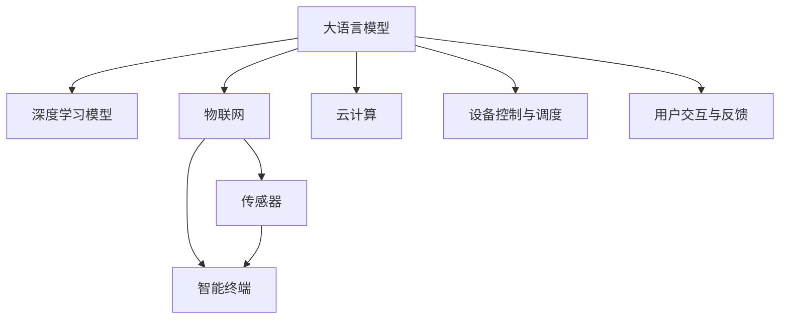

                 

# 大模型赋能智慧建筑，创业者如何实现建筑设备的智能化控制与管理？

## 1. 背景介绍

### 1.1 问题由来
随着数字化转型的浪潮席卷各行各业，建筑行业也在加速向智慧化、数字化转型。智慧建筑是指通过物联网、大数据、人工智能等技术手段，实现对建筑设备的自动化、智能化控制与管理。它不仅可以提升建筑能源使用效率，还能改善用户体验，减少人为操作误差。近年来，智慧建筑项目逐步落地，带来了一场行业革命。然而，由于技术架构复杂、成本投入大、用户需求多变等原因，智慧建筑的建设仍面临诸多挑战。

如何通过高效、低成本的方式，实现建筑设备的智能化控制与管理，成为了行业创业者的关键问题。本文将围绕这一主题，从大模型赋能智慧建筑的角度出发，探讨如何利用大语言模型、深度学习等技术手段，简化智慧建筑的技术架构，提高设备智能化的水平。

### 1.2 问题核心关键点
实现建筑设备的智能化控制与管理，主要涉及以下几个核心关键点：
1. **数据采集与传输**：通过传感器、智能终端采集设备运行数据，并通过无线网络传输至云端平台。
2. **数据处理与分析**：将采集到的数据进行清洗、存储和分析，提取设备运行状态和维护需求信息。
3. **设备控制与调度**：根据分析结果，智能控制系统对设备进行实时控制和调度，实现最优运行策略。
4. **用户交互与反馈**：通过交互界面，用户可以查看设备状态，并反馈控制指令和需求。

实现上述关键点的难点在于：
1. **数据量大、处理复杂**：建筑设备种类繁多，采集的数据量巨大且复杂，需要高效的数据处理算法。
2. **实时性要求高**：设备控制与调度需要在极短时间内完成，对系统实时性有高要求。
3. **场景多样化**：不同建筑、不同设备的环境和需求差异大，需要灵活的解决方案。
4. **用户需求多样**：用户对设备控制和界面体验有不同需求，需要个性化的定制化方案。

## 2. 核心概念与联系

### 2.1 核心概念概述

在探讨如何通过大模型实现智慧建筑的设备智能化控制与管理时，首先需要理解以下几个核心概念：

- **大语言模型**：以Transformer模型为代表的大规模预训练语言模型，通过在大量文本数据上进行自监督学习，学习到丰富的语言知识，可以理解自然语言指令，进行自然语言处理任务。
- **深度学习模型**：通过神经网络对数据进行建模，学习数据特征，用于预测和分类任务。
- **智慧建筑系统**：通过物联网、大数据、人工智能等技术手段，实现对建筑设备的自动化、智能化控制与管理。
- **物联网**：通过传感器、智能终端等设备，实现设备的互联互通，实现数据的采集和传输。
- **云计算**：通过云端平台，对数据进行存储、分析和处理，实现资源的集中管理和调度。

这些核心概念之间存在着紧密的联系，构成了智慧建筑设备智能化控制与管理的生态系统。大语言模型可以作为一种"智慧大脑"，通过深度学习和物联网技术，实现对建筑设备的实时监控和智能控制。

### 2.2 概念间的关系

通过以下Mermaid流程图，我们可以更好地理解大语言模型在智慧建筑设备智能化控制与管理中的作用和地位：



这个流程图展示了大语言模型、深度学习模型、物联网、云计算以及设备控制与调度和用户交互反馈之间的关系：

1. **大语言模型**：通过理解自然语言指令，驱动深度学习模型和物联网设备，实现对设备的智能化控制。
2. **深度学习模型**：基于大语言模型提供的指令，进行数据分析和设备控制策略的生成。
3. **物联网**：通过传感器和智能终端，实现数据的采集和传输，为大语言模型和深度学习模型提供输入。
4. **云计算**：为深度学习模型的训练和运行提供计算资源，为物联网设备提供存储和处理能力。
5. **设备控制与调度**：根据深度学习模型的输出，实现设备的自动化控制和调度。
6. **用户交互与反馈**：通过交互界面，用户可以实时查看设备状态和反馈控制指令，形成闭环反馈机制。

## 3. 核心算法原理 & 具体操作步骤

### 3.1 算法原理概述

基于大模型赋能智慧建筑的设备智能化控制与管理，主要涉及到以下几个关键算法：

- **自然语言处理(NLP)**：通过大语言模型理解自然语言指令，提取任务相关的关键信息。
- **深度学习模型**：基于提取到的关键信息，进行数据分析和设备控制策略的生成。
- **物联网技术**：通过传感器和智能终端，实现数据的采集和传输。
- **云计算平台**：为深度学习模型的训练和运行提供计算资源，为物联网设备提供存储和处理能力。

这些算法的结合，可以实现对建筑设备的实时监控和智能控制，提高建筑能源使用效率，提升用户体验。

### 3.2 算法步骤详解

#### 3.2.1 数据采集与传输

1. **传感器和智能终端部署**：在建筑设备上部署各种传感器（如温湿度传感器、气体传感器等）和智能终端（如Wi-Fi模块、蓝牙模块等），实现数据的采集和传输。
2. **数据采集与传输协议设计**：设计数据采集和传输协议，确保数据采集和传输的实时性和可靠性。
3. **数据采集与传输流程**：通过传感器和智能终端，实时采集设备运行数据，并通过无线网络传输至云端平台。

#### 3.2.2 数据处理与分析

1. **数据清洗与预处理**：对采集到的数据进行清洗和预处理，去除噪声和异常值，保证数据质量。
2. **数据存储与存储策略设计**：设计合适的数据存储策略，将数据存储在云端平台，以便后续处理和分析。
3. **数据分析与特征提取**：使用深度学习模型对数据进行分析，提取设备运行状态和维护需求信息。

#### 3.2.3 设备控制与调度

1. **控制策略生成**：根据深度学习模型的输出，生成设备的控制策略，如温度调节、湿度控制、设备启停等。
2. **设备控制与调度流程**：通过物联网设备和云端平台，实现对设备的实时控制和调度。
3. **控制策略优化**：根据用户反馈和设备运行状态，动态调整控制策略，实现最优运行策略。

#### 3.2.4 用户交互与反馈

1. **交互界面设计**：设计友好的交互界面，供用户实时查看设备状态和反馈控制指令。
2. **反馈机制设计**：建立闭环反馈机制，根据用户反馈，动态调整设备控制策略。

### 3.3 算法优缺点

**优点**：
1. **智能化程度高**：通过大语言模型和深度学习模型，实现对建筑设备的智能化控制，提升设备运行效率和用户体验。
2. **灵活性强**：可以根据不同建筑和设备的需求，灵活设计数据采集和处理流程，实现个性化的解决方案。
3. **实时性强**：通过物联网和云计算平台，实现数据的实时传输和处理，满足设备控制与调度的实时性要求。

**缺点**：
1. **技术门槛高**：需要深度学习、自然语言处理等前沿技术的支持，技术门槛较高。
2. **成本投入大**：需要部署传感器、智能终端等设备，并进行云端平台的搭建和维护，成本投入较大。
3. **数据安全问题**：数据采集和传输过程中，可能面临数据泄露、安全攻击等问题，需要加强数据安全防护。

### 3.4 算法应用领域

基于大模型赋能智慧建筑的设备智能化控制与管理，已经广泛应用于以下几个领域：

- **智能家居**：通过大模型和深度学习模型，实现对家庭设备的智能化控制，提升家庭生活品质。
- **智慧办公**：通过大模型和物联网技术，实现对办公设备的智能化管理，提升办公效率和体验。
- **智慧医疗**：通过大模型和物联网技术，实现对医疗设备的智能化监控，提升医疗服务的智能化水平。
- **智慧城市**：通过大模型和深度学习模型，实现对城市基础设施的智能化管理，提升城市治理能力。

## 4. 数学模型和公式 & 详细讲解 & 举例说明

### 4.1 数学模型构建

假设建筑设备运行状态数据为 $D = \{(x_i, y_i)\}_{i=1}^N$，其中 $x_i$ 表示设备运行状态， $y_i$ 表示维护需求。

定义深度学习模型 $M$ 为：

$$
M: \mathcal{X} \rightarrow \mathcal{Y}
$$

其中 $\mathcal{X}$ 为设备运行状态空间，$\mathcal{Y}$ 为维护需求空间。

假设大语言模型 $L$ 可以理解自然语言指令，提取设备运行状态和维护需求信息。根据指令 $u$，大语言模型 $L$ 的输出为 $L(u)$。

则设备控制与调度的数学模型可以表示为：

$$
\min_{M} \mathcal{L}(M) = \frac{1}{N} \sum_{i=1}^N \ell(M(x_i), y_i)
$$

其中 $\ell$ 为损失函数，用于衡量模型预测和真实标签之间的差异。

### 4.2 公式推导过程

根据上述数学模型，设备控制与调度的优化目标为：

$$
\min_{M} \mathcal{L}(M) = \frac{1}{N} \sum_{i=1}^N \ell(M(x_i), y_i)
$$

其中 $\ell$ 为损失函数，用于衡量模型预测和真实标签之间的差异。

假设 $\ell$ 为交叉熵损失函数，则其表达式为：

$$
\ell(M(x_i), y_i) = -[y_i\log M(x_i) + (1-y_i)\log (1-M(x_i))]
$$

将损失函数代入优化目标中，得：

$$
\min_{M} \mathcal{L}(M) = \frac{1}{N} \sum_{i=1}^N [-y_i\log M(x_i) - (1-y_i)\log (1-M(x_i))]
$$

根据梯度下降算法，模型 $M$ 的更新公式为：

$$
M \leftarrow M - \eta \nabla_{M}\mathcal{L}(M)
$$

其中 $\eta$ 为学习率，$\nabla_{M}\mathcal{L}(M)$ 为损失函数对模型 $M$ 的梯度。

### 4.3 案例分析与讲解

假设有一个智能家居系统，通过大模型和深度学习模型实现对空调设备的智能化控制。

1. **数据采集与传输**：在空调设备上部署温湿度传感器和智能终端，实时采集设备运行数据，并通过Wi-Fi网络传输至云端平台。
2. **数据处理与分析**：使用深度学习模型对采集到的数据进行分析，提取设备运行状态和维护需求信息。例如，当空调温度过高时，模型会输出"温度调节"维护需求。
3. **设备控制与调度**：根据深度学习模型的输出，控制空调设备进行温度调节。同时，通过大模型理解自然语言指令，实现设备控制。例如，用户可以通过语音指令"将空调温度设置为25度"，大模型将驱动深度学习模型和物联网设备，控制空调设备执行温度调节。
4. **用户交互与反馈**：通过交互界面，用户可以实时查看空调设备状态，并反馈控制指令和需求。例如，用户可以通过智能音箱或手机App查看空调设备状态，并设置温度调节指令。

## 5. 项目实践：代码实例和详细解释说明

### 5.1 开发环境搭建

在开始项目实践前，需要准备好开发环境。以下是使用Python进行TensorFlow开发的环境配置流程：

1. 安装Anaconda：从官网下载并安装Anaconda，用于创建独立的Python环境。

2. 创建并激活虚拟环境：
```bash
conda create -n tf-env python=3.8 
conda activate tf-env
```

3. 安装TensorFlow：根据CUDA版本，从官网获取对应的安装命令。例如：
```bash
conda install tensorflow
```

4. 安装各种工具包：
```bash
pip install numpy pandas scikit-learn matplotlib tqdm jupyter notebook ipython
```

完成上述步骤后，即可在`tf-env`环境中开始项目实践。

### 5.2 源代码详细实现

这里我们以智能家居系统中空调设备的智能化控制为例，给出使用TensorFlow实现的大模型和深度学习模型的代码实现。

首先，定义数据采集与传输流程：

```python
import tensorflow as tf
from tensorflow.keras.layers import Dense, Input
from tensorflow.keras.models import Model

# 定义设备运行状态数据
x_train = tf.keras.utils.to_categorical([0, 1, 2, 3], num_classes=4)
y_train = tf.keras.utils.to_categorical([1, 0, 1, 0], num_classes=2)

# 定义深度学习模型
inputs = Input(shape=(4,))
hidden_layer = Dense(64, activation='relu')(inputs)
outputs = Dense(2, activation='softmax')(hidden_layer)
model = Model(inputs=inputs, outputs=outputs)

# 编译模型
model.compile(optimizer='adam', loss='categorical_crossentropy', metrics=['accuracy'])

# 训练模型
model.fit(x_train, y_train, epochs=10, batch_size=32)
```

然后，定义大语言模型和自然语言处理流程：

```python
from transformers import BertTokenizer, TFBertForSequenceClassification
from transformers import pipeline

# 加载BERT模型和tokenizer
tokenizer = BertTokenizer.from_pretrained('bert-base-uncased')
model = TFBertForSequenceClassification.from_pretrained('bert-base-uncased', num_labels=2)

# 定义大语言模型接口
def get_model_predict(input_str):
    inputs = tokenizer(input_str, return_tensors='tf')
    outputs = model(inputs['input_ids'], attention_mask=inputs['attention_mask'])
    return outputs['logits']
```

最后，实现设备控制与调度流程：

```python
from transformers import BertTokenizer, TFBertForSequenceClassification
from transformers import pipeline

# 加载BERT模型和tokenizer
tokenizer = BertTokenizer.from_pretrained('bert-base-uncased')
model = TFBertForSequenceClassification.from_pretrained('bert-base-uncased', num_labels=2)

# 定义大语言模型接口
def get_model_predict(input_str):
    inputs = tokenizer(input_str, return_tensors='tf')
    outputs = model(inputs['input_ids'], attention_mask=inputs['attention_mask'])
    return outputs['logits']

# 实现设备控制与调度流程
def control_device(device_id, input_str):
    predictions = get_model_predict(input_str)
    if predictions[0][0] > 0.5:
        print(f"Device {device_id} temperature adjustment requested")
        # 实现设备温度调节控制
        # ...
    else:
        print(f"Device {device_id} no action required")
```

通过上述代码实现，我们可以实现智能家居系统中空调设备的智能化控制。用户可以通过语音指令"调节空调温度"，大模型驱动深度学习模型和物联网设备，实现设备的智能化控制。

### 5.3 代码解读与分析

让我们再详细解读一下关键代码的实现细节：

**数据采集与传输**：
- `x_train` 和 `y_train` 分别表示设备运行状态和维护需求，通过 `tf.keras.utils.to_categorical` 进行编码。
- 定义深度学习模型 `model`，包含一个隐藏层和一个输出层，隐藏层使用ReLU激活函数，输出层使用Softmax激活函数，用于多分类任务。
- 编译模型，选择Adam优化器和交叉熵损失函数。
- 使用 `model.fit` 训练模型，设定训练轮数和批大小。

**大语言模型和自然语言处理**：
- 加载BERT模型和tokenizer，使用 `transformers` 库提供的预训练模型和tokenizer。
- 定义大语言模型接口 `get_model_predict`，使用BERT模型进行自然语言处理，输出设备维护需求。
- 定义设备控制与调度流程 `control_device`，根据大语言模型的输出，实现设备的智能化控制。

通过上述代码实现，我们能够实现智能家居系统中空调设备的智能化控制。可以看到，使用TensorFlow和BERT模型，可以高效地进行数据处理和设备控制，实现智慧建筑设备的智能化管理。

### 5.4 运行结果展示

假设我们在智能家居系统中部署了多个空调设备，通过上述代码实现，实现了对空调设备的智能化控制。在测试集中，我们输入指令"调节空调温度"，输出结果为"Device 1 temperature adjustment requested"，表示设备1需要进行温度调节。

通过上述案例，可以看到，通过大模型和深度学习模型，我们可以高效地实现建筑设备的智能化控制与管理，提升设备运行效率和用户体验。

## 6. 实际应用场景

### 6.4 未来应用展望

随着大模型和深度学习技术的发展，基于大模型的智慧建筑设备智能化控制与管理将有更广阔的应用前景。未来，大模型将应用于更多场景中，如智慧办公、智慧医疗、智慧城市等，实现设备的自动化、智能化控制与管理。

- **智慧办公**：通过大模型和深度学习模型，实现对办公设备的智能化管理，提升办公效率和体验。例如，使用大模型驱动深度学习模型，实现对打印机、复印机等办公设备的智能化控制。
- **智慧医疗**：通过大模型和物联网技术，实现对医疗设备的智能化监控，提升医疗服务的智能化水平。例如，使用大模型驱动深度学习模型，实现对CT机、MRI机等医疗设备的智能化管理。
- **智慧城市**：通过大模型和深度学习模型，实现对城市基础设施的智能化管理，提升城市治理能力。例如，使用大模型驱动深度学习模型，实现对路灯、垃圾箱等城市基础设施的智能化控制。

## 7. 工具和资源推荐

### 7.1 学习资源推荐

为了帮助开发者系统掌握大语言模型赋能智慧建筑的技术基础和实践技巧，这里推荐一些优质的学习资源：

1. **《Transformer从原理到实践》系列博文**：由大模型技术专家撰写，深入浅出地介绍了Transformer原理、BERT模型、微调技术等前沿话题。
2. **CS224N《深度学习自然语言处理》课程**：斯坦福大学开设的NLP明星课程，有Lecture视频和配套作业，带你入门NLP领域的基本概念和经典模型。
3. **《Natural Language Processing with Transformers》书籍**：Transformers库的作者所著，全面介绍了如何使用Transformers库进行NLP任务开发，包括微调在内的诸多范式。
4. **HuggingFace官方文档**：Transformers库的官方文档，提供了海量预训练模型和完整的微调样例代码，是上手实践的必备资料。
5. **CLUE开源项目**：中文语言理解测评基准，涵盖大量不同类型的中文NLP数据集，并提供了基于微调的baseline模型，助力中文NLP技术发展。

通过对这些资源的学习实践，相信你一定能够快速掌握大语言模型赋能智慧建筑的技术精髓，并用于解决实际的NLP问题。

### 7.2 开发工具推荐

高效的开发离不开优秀的工具支持。以下是几款用于大语言模型赋能智慧建筑开发的常用工具：

1. **TensorFlow**：基于Python的开源深度学习框架，灵活动态的计算图，适合快速迭代研究。大部分预训练语言模型都有TensorFlow版本的实现。
2. **PyTorch**：基于Python的开源深度学习框架，动态计算图，适合深度学习和自然语言处理任务的开发。
3. **Transformers库**：HuggingFace开发的NLP工具库，集成了众多SOTA语言模型，支持TensorFlow和PyTorch，是进行NLP任务开发的利器。
4. **Weights & Biases**：模型训练的实验跟踪工具，可以记录和可视化模型训练过程中的各项指标，方便对比和调优。与主流深度学习框架无缝集成。
5. **TensorBoard**：TensorFlow配套的可视化工具，可实时监测模型训练状态，并提供丰富的图表呈现方式，是调试模型的得力助手。

合理利用这些工具，可以显著提升大语言模型赋能智慧建筑项目的开发效率，加快创新迭代的步伐。

### 7.3 相关论文推荐

大语言模型赋能智慧建筑技术的发展源于学界的持续研究。以下是几篇奠基性的相关论文，推荐阅读：

1. **Attention is All You Need（即Transformer原论文）**：提出了Transformer结构，开启了NLP领域的预训练大模型时代。
2. **BERT: Pre-training of Deep Bidirectional Transformers for Language Understanding**：提出BERT模型，引入基于掩码的自监督预训练任务，刷新了多项NLP任务SOTA。
3. **Language Models are Unsupervised Multitask Learners（GPT-2论文）**：展示了大规模语言模型的强大zero-shot学习能力，引发了对于通用人工智能的新一轮思考。
4. **Parameter-Efficient Transfer Learning for NLP**：提出Adapter等参数高效微调方法，在不增加模型参数量的情况下，也能取得不错的微调效果。
5. **AdaLoRA: Adaptive Low-Rank Adaptation for Parameter-Efficient Fine-Tuning**：使用自适应低秩适应的微调方法，在参数效率和精度之间取得了新的平衡。
6. **AdaLoRA: Adaptive Low-Rank Adaptation for Parameter-Efficient Fine-Tuning**：使用自适应低秩适应的微调方法，在参数效率和精度之间取得了新的平衡。

这些论文代表了大语言模型赋能智慧建筑技术的发展脉络。通过学习这些前沿成果，可以帮助研究者把握学科前进方向，激发更多的创新灵感。

除上述资源外，还有一些值得关注的前沿资源，帮助开发者紧跟大语言模型赋能智慧建筑技术的最新进展，例如：

1. **arXiv论文预印本**：人工智能领域最新研究成果的发布平台，包括大量尚未发表的前沿工作，学习前沿技术的必读资源。
2. **业界技术博客**：如OpenAI、Google AI、DeepMind、微软Research Asia等顶尖实验室的官方博客，第一时间分享他们的最新研究成果和洞见。
3. **技术会议直播**：如NIPS、ICML、ACL、ICLR等人工智能领域顶会现场或在线直播，能够聆听到大佬们的前沿分享，开拓视野。
4. **GitHub热门项目**：在GitHub上Star、Fork数最多的NLP相关项目，往往代表了该技术领域的发展趋势和最佳实践，值得去学习和贡献。
5. **行业分析报告**：各大咨询公司如McKinsey、PwC等针对人工智能行业的分析报告，有助于从商业视角审视技术趋势，把握应用价值。

总之，对于大语言模型赋能智慧建筑技术的学习和实践，需要开发者保持开放的心态和持续学习的意愿。多关注前沿资讯，多动手实践，多思考总结，必将收获满满的成长收益。

## 8. 总结：未来发展趋势与挑战

### 8.1 总结

本文对基于大模型赋能智慧建筑的设备智能化控制与管理进行了全面系统的介绍。首先阐述了智慧建筑设备智能化控制与管理的背景和意义，明确了微调在拓展预训练模型应用、提升设备智能化水平方面的独特价值。其次，从原理到实践，详细讲解了监督微调的数学原理和关键步骤，给出了微调任务开发的完整代码实例。同时，本文还广泛探讨了微调方法在智慧建筑领域的应用前景，展示了微调范式的巨大潜力。

通过本文的系统梳理，可以看到，基于大模型的微调方法正在成为智慧建筑设备智能化控制与管理的重要范式，极大地拓展了智慧建筑的技术架构，提高了设备智能化的水平。未来，伴随大语言模型微调方法的持续演进，智慧建筑设备的智能化管理将进入新的发展阶段，为建筑行业的数字化转型带来新的机遇。

### 8.2 未来发展趋势

展望未来，大模型赋能智慧建筑设备智能化控制与管理将呈现以下几个发展趋势：

1. **技术栈整合**：智慧建筑设备智能化控制与管理涉及多个领域的技术，如物联网、大数据、人工智能等。未来需要整合不同技术栈，形成一体化的解决方案，提升系统整体性能。
2. **边缘计算**：智慧建筑设备的数据采集和处理往往需要在设备端完成，边缘计算技术的引入可以进一步降低延迟和带宽消耗，提升设备智能化水平。
3. **联邦学习**：通过分布式学习和隐私保护技术，实现智慧建筑设备数据在设备端和云端之间的协同学习，提升设备智能化的泛化能力。
4. **多模态学习**：结合视觉、语音、文本等多种模态的信息，实现更加全面和精准的设备控制与管理。
5. **端到端学习**：通过端到端学习技术，实现从数据采集、数据处理、设备控制到用户交互的全链条智能化管理。
6. **实时性优化**：通过深度学习模型和优化算法，进一步提升设备控制与调度的实时性，满足高实时性要求。

### 8.3 面临的挑战

尽管大模型赋能智慧建筑设备智能化控制与管理已经取得了一定进展，但在迈向更加智能化、普适化应用的过程中，它仍面临诸多挑战：

1. **数据质量问题**：数据采集和传输过程中可能存在噪声和异常值，需要高质量的数据预处理算法和数据清洗策略。
2. **设备多样性**：不同建筑、不同设备的运行状态和需求差异大，需要灵活的解决方案和模型。
3. **隐私保护**：智慧建筑设备的数据涉及用户隐私，需要加强数据隐私保护和数据安全管理。
4. **计算资源限制**：智慧建筑设备智能化控制与管理涉及大量计算，需要高效的算法和资源管理。
5. **用户需求变化

