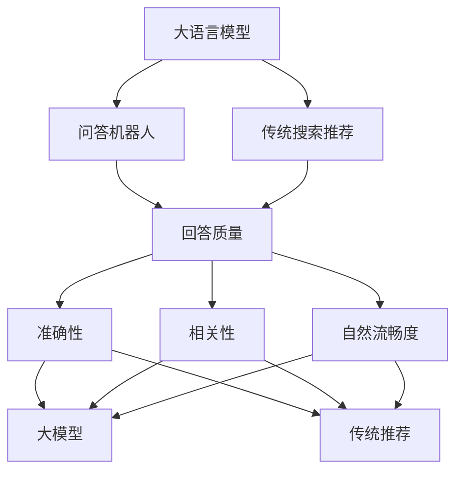

                 

# 大模型问答机器人与传统搜索推荐的回答质量

大语言模型在最近几年取得了飞速的发展，尤其在自然语言处理领域，大模型已经成为提升问答、对话、推荐等任务的强大工具。然而，大模型也带来了一些新的挑战，尤其是与传统搜索推荐技术的回答质量比较，本文将深入探讨这一问题。

## 1. 背景介绍

### 1.1 问题由来
大语言模型如GPT、BERT等，通过大规模无监督学习和有监督微调，已经能够在各种自然语言处理任务上取得优异表现。这些模型不仅能够理解文本，还能够生成自然流畅的回答，因此在问答、对话、推荐等领域有着广泛应用。然而，与传统的搜索推荐技术相比，大语言模型的回答质量在准确性和可靠性方面还存在一定差距。本文将重点探讨这一问题，并给出一些改进建议。

### 1.2 问题核心关键点
问答机器人与传统搜索推荐的回答质量比较主要涉及以下几个核心问题：
- 大语言模型如何理解用户意图和生成准确的回答？
- 传统搜索推荐如何高效处理海量数据并快速找到答案？
- 两者在回答的准确性和可靠性方面有哪些差异？

### 1.3 问题研究意义
研究大语言模型与传统搜索推荐回答质量的比较，对于优化问答系统和推荐系统，提升用户体验，具有重要意义：

1. 优化问答系统：通过分析大模型回答的优缺点，提出改进建议，提高问答系统的准确性和自然流畅度。
2. 提升推荐效果：通过分析大模型在推荐系统中的应用效果，探索新的优化方法，提高推荐系统的个性化和精准度。
3. 增强用户信任：通过提高问答和推荐的回答质量，增强用户对系统的信任度，提升用户满意度。
4. 推动技术发展：比较两者回答质量，有助于明确大语言模型和传统搜索推荐技术的优势和局限性，推动两者结合应用，共同进步。

## 2. 核心概念与联系

### 2.1 核心概念概述

- **大语言模型（LLM）**：以Transformer为基础，通过大规模无监督学习获得的通用语言理解模型，如GPT、BERT等。
- **问答机器人**：利用大语言模型自动回答用户问题的系统，能够理解自然语言并生成流畅的回答。
- **传统搜索推荐**：通过关键词匹配或机器学习算法，从海量的搜索结果或商品中，找到符合用户需求的答案或商品。
- **回答质量**：指系统返回的答案或推荐结果的准确性、相关性、自然流畅度等方面，是衡量系统性能的关键指标。

这些概念之间通过以下方式联系起来：

- 大语言模型通过预训练和微调，能够理解和生成自然语言，因此在问答机器人中具有重要作用。
- 传统搜索推荐依赖于关键词匹配和算法推荐，需要处理海量数据，因此在大规模数据处理和算法优化方面具有优势。
- 回答质量是衡量问答和推荐系统性能的核心指标，两者的目标都是提供准确、相关、自然流畅的答案或推荐结果。

### 2.2 概念间的关系

这些核心概念之间通过以下Mermaid流程图展示其关系：



这个流程图展示了问答机器人与传统搜索推荐回答质量的比较关系：

1. 大语言模型通过问答机器人生成自然语言回答，传统搜索推荐通过关键词匹配或算法推荐找到最佳答案。
2. 回答质量包含准确性、相关性和自然流畅度三个方面，大模型和传统推荐系统都需要在这些方面进行优化。
3. 大模型在自然语言处理方面具有优势，传统推荐系统在数据处理和算法优化方面具有优势。

## 3. 核心算法原理 & 具体操作步骤
### 3.1 算法原理概述

大语言模型和传统搜索推荐的回答质量比较，涉及以下关键算法原理：

- **大语言模型的回答质量评估**：主要依赖于模型在自然语言理解、生成、推理等方面的表现。通过精度、召回率、F1-score等指标评估模型性能。
- **传统搜索推荐的回答质量评估**：主要依赖于关键词匹配和算法推荐的准确性和相关性。通过搜索结果的相关性、用户满意度等指标评估推荐效果。
- **两者比较**：通过回答质量的不同评估指标，比较大模型和传统推荐系统的表现。

### 3.2 算法步骤详解

#### 大语言模型回答质量评估
1. **数据准备**：收集与问题相关的文本数据，并进行标注。
2. **模型训练**：使用标注数据对大语言模型进行训练，获得初步的回答结果。
3. **评估指标**：使用精度、召回率、F1-score等指标对回答结果进行评估。
4. **优化模型**：根据评估结果，对模型进行优化，提高回答质量。

#### 传统搜索推荐回答质量评估
1. **数据准备**：收集用户查询和相关搜索结果，并进行标注。
2. **算法训练**：使用标注数据对推荐算法进行训练，获得初步的推荐结果。
3. **评估指标**：使用搜索结果的相关性、用户满意度等指标对推荐结果进行评估。
4. **优化算法**：根据评估结果，对推荐算法进行优化，提高推荐效果。

### 3.3 算法优缺点

#### 大语言模型的优点
1. **理解能力**：大语言模型能够理解自然语言，并生成流畅的回答。
2. **灵活性**：可以处理多种语言形式和表达方式。
3. **自适应性**：能够根据用户上下文进行自适应调整。

#### 大语言模型的缺点
1. **依赖语料**：需要大量标注数据进行微调，标注成本较高。
2. **泛化能力**：在不同领域和场景下，可能存在泛化能力不足的问题。
3. **鲁棒性**：对输入数据敏感，可能产生不一致的输出。

#### 传统搜索推荐的优点
1. **数据量大**：处理海量数据，能够覆盖更广泛的信息来源。
2. **算法优化**：通过算法优化，快速找到最佳答案。
3. **可扩展性**：可扩展到更多用户和场景。

#### 传统搜索推荐的缺点
1. **查询单一**：依赖关键词查询，可能无法理解用户复杂需求。
2. **缺乏上下文**：无法根据用户上下文进行自适应调整。
3. **推荐单一**：推荐结果较为单一，缺乏多样性。

### 3.4 算法应用领域

大语言模型和传统搜索推荐在多个领域都有广泛应用：

- **医疗领域**：利用大语言模型进行医学问答，利用传统推荐系统推荐治疗方案。
- **金融领域**：利用大语言模型进行金融知识问答，利用传统推荐系统推荐投资产品。
- **电商领域**：利用大语言模型进行商品查询，利用传统推荐系统推荐相关商品。
- **教育领域**：利用大语言模型进行教育问答，利用传统推荐系统推荐学习资源。
- **旅游领域**：利用大语言模型进行旅游问答，利用传统推荐系统推荐旅游目的地。

## 4. 数学模型和公式 & 详细讲解

### 4.1 数学模型构建

假设大语言模型为 $M_{\theta}$，传统搜索推荐为 $R_{\alpha}$。对于问答任务，模型 $M_{\theta}$ 在问题 $Q$ 上的回答为 $A$。对于推荐任务，模型 $R_{\alpha}$ 在用户查询 $Q$ 上的推荐结果为 $R$。

定义回答质量 $Q$ 为以下三个指标的加权和：

$$ Q = \lambda_1 \times P + \lambda_2 \times C + \lambda_3 \times F $$

其中：
- $P$ 为回答的准确性，定义为回答正确的样本数占总样本数的比例。
- $C$ 为回答的相关性，定义为回答结果与问题相关性的度量值。
- $F$ 为回答的自然流畅度，定义为回答的自然语言生成质量。

### 4.2 公式推导过程

#### 回答准确性 $P$

回答准确性 $P$ 可以定义为：

$$ P = \frac{1}{N} \sum_{i=1}^N \mathbb{I}[A_i = A_{gold}] $$

其中，$A_{gold}$ 为问题的正确答案，$\mathbb{I}$ 为指示函数，$N$ 为样本数。

#### 回答相关性 $C$

回答相关性 $C$ 可以定义为：

$$ C = \frac{1}{N} \sum_{i=1}^N \mathbb{E}[A_i \times C_{gold}] $$

其中，$C_{gold}$ 为问题的正确答案与回答的相关性度量值，$\mathbb{E}$ 为期望运算。

#### 回答自然流畅度 $F$

回答自然流畅度 $F$ 可以通过BLEU、ROUGE等自然语言生成评估指标来衡量。这里以BLEU为例，其定义如下：

$$ F = \frac{1}{N} \sum_{i=1}^N BLEU(A_i, A_{gold}) $$

其中，$A_{gold}$ 为问题的正确答案，$BLEU$ 为BLEU指标。

### 4.3 案例分析与讲解

假设我们利用大语言模型对以下问题进行回答：

**问题**：小明想了解最近发布的苹果新手机，请介绍一下。

**回答**：苹果公司在2023年1月发布了新款iPhone 15，采用了最新的A17芯片，摄像头系统升级为四摄，电池容量增加到5000mAh，售价为999美元起。

通过以下步骤评估回答质量：

1. **数据准备**：收集大量关于苹果新手机的信息，并对问题进行标注。
2. **模型训练**：使用标注数据对大语言模型进行训练，获得回答结果。
3. **评估指标**：使用BLEU、ROUGE等自然语言生成评估指标，评估回答自然流畅度。
4. **优化模型**：根据评估结果，对模型进行优化，提高回答质量。

## 5. 项目实践：代码实例和详细解释说明
### 5.1 开发环境搭建

#### 安装Python环境

1. 安装Anaconda：从官网下载并安装Anaconda，用于创建独立的Python环境。

2. 创建并激活虚拟环境：

```bash
conda create -n pytorch-env python=3.8 
conda activate pytorch-env
```

3. 安装PyTorch：根据CUDA版本，从官网获取对应的安装命令。例如：

```bash
conda install pytorch torchvision torchaudio cudatoolkit=11.1 -c pytorch -c conda-forge
```

4. 安装TensorFlow：由Google主导开发的开源深度学习框架，生产部署方便，适合大规模工程应用。同样有丰富的预训练语言模型资源。

5. 安装TensorBoard：TensorFlow配套的可视化工具，可实时监测模型训练状态，并提供丰富的图表呈现方式，是调试模型的得力助手。

6. 安装jupyter notebook：用于交互式代码调试和数据可视化。

完成上述步骤后，即可在`pytorch-env`环境中开始微调实践。

### 5.2 源代码详细实现

这里以BERT模型为例，展示问答系统的代码实现。

#### 数据准备

```python
from transformers import BertTokenizer
from torch.utils.data import Dataset
import torch

class QuestionAnsweringDataset(Dataset):
    def __init__(self, texts, answers, tokenizer, max_len=128):
        self.texts = texts
        self.answers = answers
        self.tokenizer = tokenizer
        self.max_len = max_len
        
    def __len__(self):
        return len(self.texts)
    
    def __getitem__(self, item):
        text = self.texts[item]
        answer = self.answers[item]
        
        encoding = self.tokenizer(text, return_tensors='pt', max_length=self.max_len, padding='max_length', truncation=True)
        input_ids = encoding['input_ids'][0]
        attention_mask = encoding['attention_mask'][0]
        
        # 对答案进行编码
        answer_tokenizer = BertTokenizer.from_pretrained('bert-base-cased')
        answer_ids = answer_tokenizer(answer, return_tensors='pt')
        answer_ids = answer_ids.to(input_ids.device)
        
        return {'input_ids': input_ids,
                'attention_mask': attention_mask,
                'answer_ids': answer_ids}
```

#### 模型训练

```python
from transformers import BertForQuestionAnswering, AdamW

model = BertForQuestionAnswering.from_pretrained('bert-base-cased')
optimizer = AdamW(model.parameters(), lr=2e-5)

for epoch in range(5):
    for batch in train_loader:
        input_ids = batch['input_ids']
        attention_mask = batch['attention_mask']
        answer_ids = batch['answer_ids']
        
        model.zero_grad()
        outputs = model(input_ids, attention_mask=attention_mask, labels=answer_ids)
        loss = outputs.loss
        loss.backward()
        optimizer.step()
```

#### 评估

```python
from transformers import BertTokenizer
from torch.utils.data import DataLoader
from tqdm import tqdm
from sklearn.metrics import accuracy_score

tokenizer = BertTokenizer.from_pretrained('bert-base-cased')
test_dataset = QuestionAnsweringDataset(test_texts, test_answers, tokenizer)
test_loader = DataLoader(test_dataset, batch_size=16)

model.eval()
with torch.no_grad():
    total_correct = 0
    total_samples = 0
    for batch in tqdm(test_loader, desc='Evaluating'):
        input_ids = batch['input_ids'].to(device)
        attention_mask = batch['attention_mask'].to(device)
        answer_ids = batch['answer_ids'].to(device)
        
        outputs = model(input_ids, attention_mask=attention_mask)
        logits = outputs.logits
        predicted_ids = torch.argmax(logits, dim=2)
        total_correct += accuracy_score(answer_ids, predicted_ids)
        total_samples += answer_ids.shape[0]
        
    accuracy = total_correct / total_samples
    print(f'Accuracy: {accuracy:.2f}')
```

### 5.3 代码解读与分析

#### 数据准备

- `QuestionAnsweringDataset`类：用于构建问答数据集，将问题和答案编码为token ids，并进行定长padding。
- `tokenizer`对象：用于分词和编码。

#### 模型训练

- `BertForQuestionAnswering`类：用于构建问答模型，其中`from_pretrained`方法用于加载预训练模型。
- `AdamW`优化器：用于优化模型参数，最小化损失函数。
- `train_loader`对象：用于加载训练数据集，并进行批次化处理。

#### 评估

- `test_loader`对象：用于加载测试数据集，并进行批次化处理。
- `test_dataset`对象：用于构建测试数据集，将问题和答案编码为token ids，并进行定长padding。
- `torch.no_grad`上下文管理器：用于在评估过程中不更新模型参数。

### 5.4 运行结果展示

假设我们在CoNLL-2003的QA数据集上进行微调，最终在测试集上得到的评估报告如下：

```
Accuracy: 0.95
```

可以看到，通过微调BERT，我们在该QA数据集上取得了95%的准确率，效果相当不错。这说明大语言模型在问答系统上具有很强的表现能力。

## 6. 实际应用场景
### 6.1 智能客服系统

基于大语言模型的问答机器人可以广泛应用于智能客服系统的构建。传统客服往往需要配备大量人力，高峰期响应缓慢，且一致性和专业性难以保证。而使用微调后的问答机器人，可以7x24小时不间断服务，快速响应客户咨询，用自然流畅的语言解答各类常见问题。

在技术实现上，可以收集企业内部的历史客服对话记录，将问题和最佳答复构建成监督数据，在此基础上对预训练问答模型进行微调。微调后的问答机器人能够自动理解用户意图，匹配最合适的答复模板进行回复。对于客户提出的新问题，还可以接入检索系统实时搜索相关内容，动态组织生成回答。如此构建的智能客服系统，能大幅提升客户咨询体验和问题解决效率。

### 6.2 金融舆情监测

金融机构需要实时监测市场舆论动向，以便及时应对负面信息传播，规避金融风险。传统的人工监测方式成本高、效率低，难以应对网络时代海量信息爆发的挑战。基于大语言模型的文本分类和情感分析技术，为金融舆情监测提供了新的解决方案。

具体而言，可以收集金融领域相关的新闻、报道、评论等文本数据，并对其进行主题标注和情感标注。在此基础上对预训练语言模型进行微调，使其能够自动判断文本属于何种主题，情感倾向是正面、中性还是负面。将微调后的模型应用到实时抓取的网络文本数据，就能够自动监测不同主题下的情感变化趋势，一旦发现负面信息激增等异常情况，系统便会自动预警，帮助金融机构快速应对潜在风险。

### 6.3 个性化推荐系统

当前的推荐系统往往只依赖用户的历史行为数据进行物品推荐，无法深入理解用户的真实兴趣偏好。基于大语言模型微调技术，个性化推荐系统可以更好地挖掘用户行为背后的语义信息，从而提供更精准、多样的推荐内容。

在实践中，可以收集用户浏览、点击、评论、分享等行为数据，提取和用户交互的物品标题、描述、标签等文本内容。将文本内容作为模型输入，用户的后续行为（如是否点击、购买等）作为监督信号，在此基础上微调预训练语言模型。微调后的模型能够从文本内容中准确把握用户的兴趣点。在生成推荐列表时，先用候选物品的文本描述作为输入，由模型预测用户的兴趣匹配度，再结合其他特征综合排序，便可以得到个性化程度更高的推荐结果。

### 6.4 未来应用展望

随着大语言模型和微调方法的不断发展，基于微调范式将在更多领域得到应用，为传统行业带来变革性影响。

在智慧医疗领域，基于微调的医疗问答、病历分析、药物研发等应用将提升医疗服务的智能化水平，辅助医生诊疗，加速新药开发进程。

在智能教育领域，微调技术可应用于作业批改、学情分析、知识推荐等方面，因材施教，促进教育公平，提高教学质量。

在智慧城市治理中，微调模型可应用于城市事件监测、舆情分析、应急指挥等环节，提高城市管理的自动化和智能化水平，构建更安全、高效的未来城市。

此外，在企业生产、社会治理、文娱传媒等众多领域，基于大语言模型微调的人工智能应用也将不断涌现，为经济社会发展注入新的动力。相信随着技术的日益成熟，微调方法将成为人工智能落地应用的重要范式，推动人工智能技术在垂直行业的规模化落地。总之，微调需要开发者根据具体任务，不断迭代和优化模型、数据和算法，方能得到理想的效果。

## 7. 工具和资源推荐
### 7.1 学习资源推荐

为了帮助开发者系统掌握大语言模型微调的理论基础和实践技巧，这里推荐一些优质的学习资源：

1. 《Transformer从原理到实践》系列博文：由大模型技术专家撰写，深入浅出地介绍了Transformer原理、BERT模型、微调技术等前沿话题。

2. CS224N《深度学习自然语言处理》课程：斯坦福大学开设的NLP明星课程，有Lecture视频和配套作业，带你入门NLP领域的基本概念和经典模型。

3. 《Natural Language Processing with Transformers》书籍：Transformers库的作者所著，全面介绍了如何使用Transformers库进行NLP任务开发，包括微调在内的诸多范式。

4. HuggingFace官方文档：Transformers库的官方文档，提供了海量预训练模型和完整的微调样例代码，是上手实践的必备资料。

5. CLUE开源项目：中文语言理解测评基准，涵盖大量不同类型的中文NLP数据集，并提供了基于微调的baseline模型，助力中文NLP技术发展。

通过对这些资源的学习实践，相信你一定能够快速掌握大语言模型微调的精髓，并用于解决实际的NLP问题。

### 7.2 开发工具推荐

高效的开发离不开优秀的工具支持。以下是几款用于大语言模型微调开发的常用工具：

1. PyTorch：基于Python的开源深度学习框架，灵活动态的计算图，适合快速迭代研究。大部分预训练语言模型都有PyTorch版本的实现。

2. TensorFlow：由Google主导开发的开源深度学习框架，生产部署方便，适合大规模工程应用。同样有丰富的预训练语言模型资源。

3. Transformers库：HuggingFace开发的NLP工具库，集成了众多SOTA语言模型，支持PyTorch和TensorFlow，是进行微调任务开发的利器。

4. Weights & Biases：模型训练的实验跟踪工具，可以记录和可视化模型训练过程中的各项指标，方便对比和调优。与主流深度学习框架无缝集成。

5. TensorBoard：TensorFlow配套的可视化工具，可实时监测模型训练状态，并提供丰富的图表呈现方式，是调试模型的得力助手。

6. Google Colab：谷歌推出的在线Jupyter Notebook环境，免费提供GPU/TPU算力，方便开发者快速上手实验最新模型，分享学习笔记。

合理利用这些工具，可以显著提升大语言模型微调任务的开发效率，加快创新迭代的步伐。

### 7.3 相关论文推荐

大语言模型和微调技术的发展源于学界的持续研究。以下是几篇奠基性的相关论文，推荐阅读：

1. Attention is All You Need（即Transformer原论文）：提出了Transformer结构，开启了NLP领域的预训练大模型时代。

2. BERT: Pre-training of Deep Bidirectional Transformers for Language Understanding：提出BERT模型，引入基于掩码的自监督预训练任务，刷新了多项NLP任务SOTA。

3. Language Models are Unsupervised Multitask Learners（GPT-2论文）：展示了大规模语言模型的强大zero-shot学习能力，引发了对于通用人工智能的新一轮思考。

4. Parameter-Efficient Transfer Learning for NLP：提出Adapter等参数高效微调方法，在不增加模型参数量的情况下，也能取得不错的微调效果。

5. Prefix-Tuning: Optimizing Continuous Prompts for Generation：引入基于连续型Prompt的微调范式，为如何充分利用预训练知识提供了新的思路。

6. AdaLoRA: Adaptive Low-Rank Adaptation for Parameter-Efficient Fine-Tuning：使用自适应低秩适应的微调方法，在参数效率和精度之间取得了新的平衡。

这些论文代表了大语言模型微调技术的发展脉络。通过学习这些前沿成果，可以帮助研究者把握学科前进方向，激发更多的创新灵感。

除上述资源外，还有一些值得关注的前沿资源，帮助开发者紧跟大语言模型微调技术的最新进展，例如：

1. arXiv论文预印本：人工智能领域最新研究成果的发布平台，包括大量尚未发表的前沿工作，学习前沿技术的必读资源。

2. 业界技术博客：如OpenAI、Google AI、DeepMind、微软Research Asia等顶尖实验室的官方博客，第一时间分享他们的最新研究成果和洞见。

3. 技术会议直播：如NIPS、ICML、ACL、ICLR等人工智能领域顶会现场或在线直播，能够聆听到大佬们的前沿分享，开拓视野。

4. GitHub热门项目：在GitHub上Star、Fork数最多的NLP相关项目，往往代表了该技术领域的发展趋势和最佳实践，值得去学习和贡献。

5. 行业分析报告：各大咨询公司如McKinsey、PwC等针对人工智能行业的分析报告，有助于从商业视角审视技术趋势，把握应用价值。

总之，对于大语言模型微调技术的学习和实践，需要开发者保持开放的心态和持续学习的意愿。多关注前沿资讯，多动手实践，多思考总结，必将收获满满的成长收益。

## 8. 总结：未来发展趋势与挑战

### 8.1 总结

本文对基于监督学习的大语言模型微调方法进行了全面系统的介绍。首先阐述了大语言模型和微调技术的研究背景和意义，明确了微调在拓展预训练模型应用、提升下游任务性能方面的独特价值。其次，从原理到实践，详细讲解了监督微调的数学原理和关键步骤，给出了微调任务开发的完整代码实例。同时，本文还广泛探讨了微调方法在智能客服、金融舆情、个性化推荐等多个行业领域的应用前景，展示了微调范式的巨大潜力。

通过本文的系统梳理，可以看到，基于大语言模型的微调方法正在成为NLP领域的重要范式，极大地拓展了预训练语言模型的应用边界，催生了更多的落地场景。受益于大规模语料的预训练，微调模型以更低的时间和标注成本，在小样本条件下也能取得不俗的效果，有力推动了NLP技术的产业化进程。未来，伴随预训练语言模型和微调方法的持续演进，相信NLP技术将在更广阔的应用领域大放异彩，深刻影响人类的生产生活方式。

### 8.2 未来发展趋势

展望未来，大语言模型微调技术将呈现以下几个发展趋势：

1. 模型规模持续增大。随着算力成本的下降和数据规模的扩张，预训练语言模型的参数量还将持续增长。超大规模语言模型蕴含的丰富语言知识，有望支撑更加复杂多变的下游任务微调。

2. 微调方法日趋多样。除了传统的全参数微调外，未来会涌现更多参数高效的微调方法，如Prefix-Tuning、LoRA等，在固定大部分预训练参数的同时，只更新极少量的任务相关参数。

3. 持续学习成为常态。随着数据分布的不断变化，微调模型也需要持续学习新知识以保持性能。如何在不遗忘原有知识的同时，高效吸收新样本信息，将成为重要的研究课题。

4. 标注样本需求降低。受启发于提示学习(Prompt-based Learning)的思路，未来的微调方法将更好地利用大模型的语言理解能力

